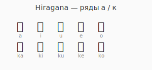

# Мой прогресс по японскому

Уверенно читаю ряды `あ` и `か`. Карточка-таблица для повторения:

## Что работает

- Ежедневные короткие drill'ы (5–10 мин) лучше, чем долгие сессии раз в неделю.
- Правило «ゼロ-субъект» из Cure Dolly сразу щёлкнуло.

## Что хочется попробовать

- Смешанные drill'ы хирагана + катакана, когда пройду хотя бы ряд `ア`.
