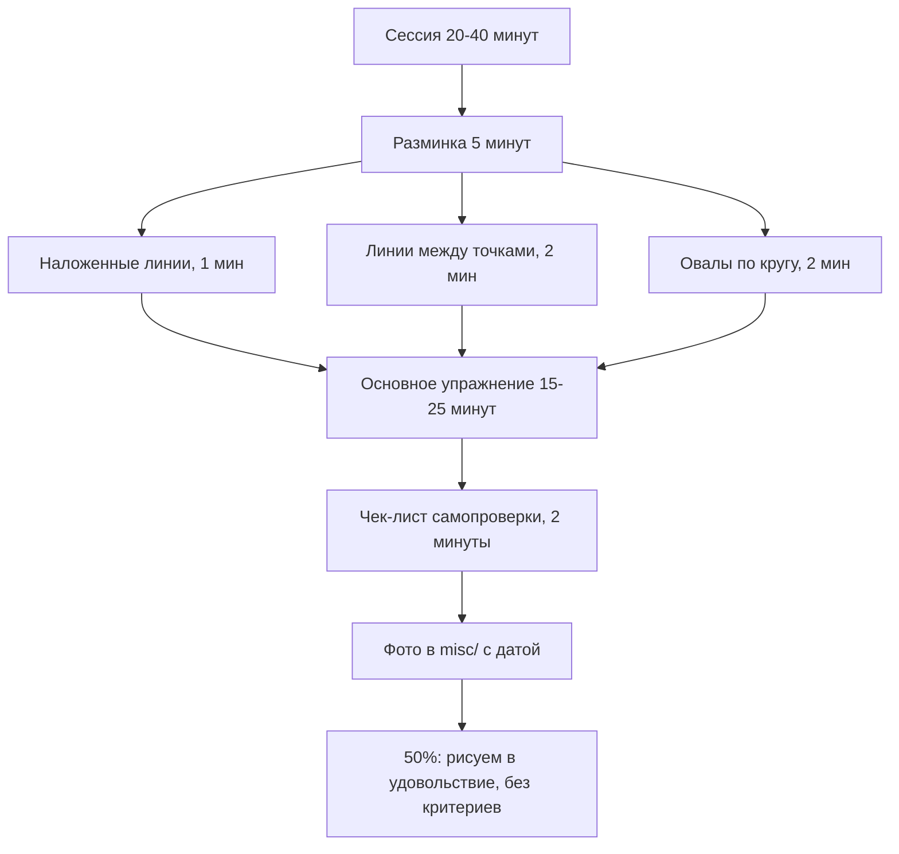

# Материалы и умение видеть

## Простыми словами

Рисование — это не «дар руки», а связка «глаз → решение → рука». Рука почти всегда
в порядке: она уже умеет писать буквы размером 3 мм и попадать курсором в маленькую
кнопку. Ломается средний блок. Когда вы смотрите на настоящий глаз человека и пытаетесь
его нарисовать, мозг подсовывает не то, что видно, а *имя*: «глаз». А у имени есть
готовая картинка — миндалина с кружком посередине. Вы рисуете её. Потом смотрите на
результат и говорите: «непохоже».

Бетти Эдвардс в книге «Drawing on the Right Side of the Brain» называет это переходом
от режима «узнавания» к режиму «видения». Задача первого модуля — обмануть подстановщик
символов четырьмя приёмами: перевернуть картинку вверх ногами, запретить смотреть на
бумагу, заставить рисовать пустоту вместо предмета, и замедлить руку до скорости глаза.

Второй блок — материалы. Тут правило одно: **минимум**. Дорогая бумага давит («жалко
портить»), набор из 24 карандашей парализует выбором. Три карандаша и пачка офисной
бумаги дают больше прогресса, чем чемодан.

## Зачем это нужно

Без модуля 01 всё остальное просядет. Перспектива, пропорции, свет — это всё способы
*проверить* то, что вы видите. Если восприятие подменяет наблюдение памятью, проверять
будет нечего: вы будете аккуратно строить символ.

Практический эффект упражнений на видение измерим. Классический замер Эдвардс —
автопортрет или рисунок руки «до» и «после» пяти дней упражнений; разница у большинства
взрослых новичков заметна невооружённым глазом. Поэтому первый шаг модуля — сделать
«нулевой» рисунок и сфотографировать его.

## Материалы: что купить

### Обязательный минимум

| Что | Зачем |
| --- | --- |
| Карандаши HB, 2B, 4B | HB — построение и лёгкие линии; 2B — основной рабочий; 4B — тёмные акценты |
| Или механический 0.5 (HB) + один 2B деревянный | Не надо точить, линия всегда одинаковой ширины |
| Пачка офисной бумаги A4, 500 листов | Дешёвая — не жалко испортить. Это ключевое свойство |
| Клячка (kneaded eraser) | Осветляет, не сдирая бумагу; лепится в любую форму |
| Обычный мягкий ластик | Для чистого стирания начисто |
| Точилка | Если карандаши деревянные |
| Планшет/фанерка A3 или жёсткая папка | Чтобы держать лист под наклоном |

Всё вместе — цена одного обеда. Скетчбук A5 — опционально, для «рисования в удовольствие»
по правилу 50%; упражнения делаются на офисной бумаге, потому что там не страшно.

### Что НЕ покупать сейчас

- Наборы «24 карандаша от 8H до 8B». Пять степеней вы не различите ещё месяц.
- Дорогую бумагу для рисунка, торшон, акварельную. Она провоцирует беречь лист.
- Растушёвки, уголь, сангину, сепию, маркеры. Это модуль 05 и позже, если вообще.
- Мольберт. Стол и наклонная поверхность решают всё на первый год.
- Графический планшет. Те же основы, но добавляет слой технических проблем.

Правило: **новый инструмент покупается, когда старый мешает**. Не раньше.

## Хват и посадка

### Два хвата

```text
  Пишущий (tripod)            Верхний (overhand)
  ~~~~~~~~~~~~~~~~            ~~~~~~~~~~~~~~~~~~
   карандаш зажат              карандаш лежит под
   между большим,              ладонью, держат все
   указательным и              пальцы, грифель почти
   средним, кисть              параллелен листу,
   опирается на лист           кисть не касается листа

   контроль: высокий           контроль: широкий
   размах: 2-3 см              размах: 20-40 см
   для: детали, штрих          для: длинные линии,
        мелкие формы                разметка, тон плашкой
```

Тройной хват (tripod grip) — тот, которым вы пишете. Он даёт точность, но движение идёт
от пальцев и запястья, а размах у них 2–3 см. Любая линия длиннее выходит дугой или
«куриной лапкой» из коротких штрихов.

Верхний хват (overhand grip) — карандаш лежит под ладонью, держится всеми пальцами
сбоку, грифель идёт по бумаге почти плашмя. Кисть фиксирована, движение идёт от локтя
и плеча. Так рисуются длинные линии, разметка, лёгкие поисковые штрихи.

Правило переключения: **длина линии больше 5 см — верхний хват и движение от плеча;
мельче — пишущий**. Подробно механика линии разбирается в модуле
[`02-lines-and-basic-shapes`](../02-lines-and-basic-shapes/theory.md).

### Посадка и лист

1. Сядьте прямо, обе ступни на полу, спина не скручена.
2. Лист — **под наклоном 20–45°** к вам: подложите папку, книгу, поставьте планшет на
   колени и обопритесь о стол. Горизонтальный лист вы видите в ракурсе, и все круги
   на нём выйдут сплюснутыми, а квадраты — трапециями. Это не ошибка руки, это оптика.
3. Глаз — примерно по центру листа, расстояние 40–60 см.
4. Свет — слева, если вы правша (иначе тень от руки ложится на рисунок).
5. Модель или референс — так, чтобы **не поворачивать голову**: рядом с листом, а не
   сбоку. Каждый поворот головы меняет ракурс и ломает наблюдение.

## Разминка: 5–10 минут в начале каждой сессии

Разминка нужна не «для настроя», а чтобы рука вспомнила амплитуду от плеча. Она одинаковая
каждый день — это её ценность.



Состав разминки на этом этапе (полный набор — в модуле 02):

1. **Свободные дуги от плеча, 1 минута.** Кисть в воздухе, локоть неподвижен, чертите
   большие дуги над листом *не касаясь бумаги*. Потом опускаете — и те же дуги на бумаге.
2. **Линии между двумя точками, 2 минуты.** Ставите две точки на расстоянии 10–15 см,
   «примеряете» движение над листом 2–3 раза и проводите одним махом. Не подправляете.
3. **Овалы по кругу, 2 минуты.** Рисуете один овал 20–30 раз по тому же следу, не
   отрывая карандаш, движение от плеча.

## «Видеть, а не узнавать»: четыре упражнения

### Общая механика

Все четыре приёма делают одно и то же — лишают мозг возможности назвать то, что он видит.
Как только объект не опознан, включается честное копирование того, что реально попадает
на сетчатку: углы, длины, соотношения.

### 1. Рисунок вверх ногами (upside-down drawing)

**Что делаем.** Берём линейный рисунок (классика Эдвардс — портрет Игоря Стравинского
работы Пикассо, 1920), переворачиваем его на 180° и копируем в перевёрнутом виде.

**Пошагово.**
1. Распечатайте или откройте на экране линейный рисунок. Переверните вверх ногами.
   Экран проще: поверните планшет/телефон.
2. Положите лист, засеките **30–40 минут**.
3. Начните с любого места — с верхнего края изображения (это будет низ оригинала).
4. Ведите глаз от линии к линии: где эта линия начинается относительно соседней? Под
   каким углом? Какой длины по сравнению с той, что уже нарисована?
5. **Запрет:** не переворачивать лист до конца работы. Не пытаться понять, что это.
6. Если поймали себя на мысли «а, это же нос» — остановитесь, посмотрите только на
   маленький участок линии, продолжайте.
7. По готовности переверните оба листа. Сравните.

**Почему работает.** Перевёрнутое лицо мозг не опознаёт как лицо, символ не подставляется,
остаются чистые линии и углы. Почти у всех результат заметно точнее, чем рисунок того же
изображения «правильной стороной».

### 2. Чистый контур (pure contour drawing)

**Что делаем.** Рисуем медленно, глядя **только на объект**, а не на бумагу.

**Пошагово.**
1. Объект — собственная ладонь, смятая бумажка или кусок ткани. Складок должно быть много.
2. Сядьте так, чтобы **не видеть свой лист**: разверните корпус, или закройте лист вторым
   листом бумаги с прорезью, или просто дайте себе слово не смотреть.
3. Таймер на **5 минут**. Карандаш ставится на бумагу и **не отрывается**.
4. Выберите точку на краю объекта. Ведите по ней глазом со скоростью примерно 1 мм в
   секунду — очень медленно. Рука едет синхронно с глазом.
5. Глаз и рука идут **вместе**: каждый микроизгиб края — микроизгиб линии.
6. Через 5 минут посмотрите. Рисунок будет похож на клубок проводов. Это нормально
   и это успех: цель — синхронизация, а не сходство.

### 3. Слепой контур (blind contour)

То же самое, что чистый контур, но с двумя послаблениями: длительность 2–3 минуты и
объект попроще. Часто термины используют как синонимы; удобно считать, что «слепой» —
это короткая версия «чистого» для разминки. Делайте один слепой контур в начале каждой
сессии первой недели.

### 4. Модифицированный контур (modified contour)

Компромисс для реального рисунка: смотрим на объект 80% времени, на лист — 20%,
и **только когда карандаш стоит на месте**. То есть: посмотрели на лист, поставили
карандаш в нужную точку, дальше глаз ушёл на объект и ведёт линию вслепую. Отрывать
карандаш можно. Это рабочий режим для обычного рисования с натуры.

### 5. Негативное пространство (negative space)

**Что делаем.** Рисуем не предмет, а **дырки вокруг него**.

Классическое упражнение Эдвардс — стул. Просвет между ножками, между спинкой и сиденьем,
проём между ножкой и краем сиденья — это самостоятельные фигуры со своей формой. У них
нет имени, значит, нет и символа: мозг вынужден их честно измерять.

**Пошагово.**
1. Поставьте стул против светлой стены, сядьте в 2–3 метрах.
2. Нарисуйте на листе рамку — прямоугольник с теми же пропорциями, что и «кадр», который
   вы видите. Стул должен целиком помещаться в кадр.
3. Найдите **самую маленькую дырку** — например, треугольный просвет между перекладиной
   и ножкой. Нарисуйте её первой, точно по форме.
4. Дальше стройте соседние просветы, пристыковывая их к первой фигуре: этот просвет
   вдвое шире? Его верхняя грань идёт под тем же углом?
5. Дырки, которые упираются в край кадра, замыкайте линией рамки.
6. **Ни разу не рисуйте сам стул.** Он проявится сам, как в трафарете.
7. Время: **25–35 минут**.

### 6. Ваза и лица (vase/faces)

Быстрый (10 минут) диагностический тест. Слева на листе рисуете профиль лица, смотрящий
вправо. От верхней и нижней точек профиля проводите горизонтали вправо. Затем рисуете
**зеркальный** профиль справа, ведя линию так, чтобы силуэт между профилями стал вазой.
Правая половина рисуется резко тяжелее: символ «профиль» не помогает, приходится
следить за формой просвета. Часто именно здесь новичок впервые ловит момент
переключения режима.

## Пять навыков восприятия

Эдвардс раскладывает «умение видеть» на пять тренируемых компонентов:

1. **Восприятие краёв (edges)** — где именно кончается одна форма и начинается другая.
   Тренируется контурными упражнениями.
2. **Восприятие пространств (spaces)** — негативное пространство. Тренируется «стулом».
3. **Восприятие отношений (relationships)** — пропорции и углы: «этот отрезок вдвое
   длиннее того», «эта линия под 30° к вертикали». Это весь модуль
   [`03-measuring-and-proportions`](../03-measuring-and-proportions/index.md) и
   [`04-perspective`](../04-perspective/index.md).
4. **Восприятие света и тени (light and shadow)** — видеть тональные пятна, а не
   «предметы». Это модуль [`05-form-light-and-shadow`](../05-form-light-and-shadow/index.md).
5. **Восприятие целого (gestalt)** — способность держать в голове весь образ и не
   утонуть в деталях. Появляется само, как следствие первых четырёх.

Полезно после каждого упражнения спрашивать себя: какой из пяти я сейчас тренировал?

## Мышление: правило 50%, объём и «уродливая стадия»

**Правило 50% (Drawabox).** Половина времени, потраченного на рисование, — упражнения
с критериями. Вторая половина — рисование того, что нравится, **без всяких критериев и
без разбора ошибок**. Не «упражнения важнее», а именно 50/50. Курс Drawabox настаивает
на этом жёстче, чем на любом упражнении: без второй половины мотивация выгорает за
несколько недель, а без первой прогресс останавливается.

**Количество важнее качества.** На старте цель — число честных попыток, а не число
удачных рисунков. Ориентир: 20–40 минут в день, каждый день, лучше меньше, но подряд.
Пропущенный день не отыгрывается двухчасовым марафоном.

**«Уродливая стадия».** Через 2–4 недели наступает момент, когда вы уже видите свои
ошибки, но ещё не умеете их исправлять. Раньше рисунок казался нормальным, теперь —
плохим. Это не регресс, это выросло восприятие: оно всегда обгоняет руку. Единственное
лекарство — продолжать и опираться на фотоархив.

**Фотоархив.** После каждой сессии фотографируйте лист и кладите в `misc/` с именем вида
`2026-09-08-blind-contour.jpg`. Через три недели вы сравните и увидите разницу, которой
не чувствуете день ото дня. Это единственный честный измеритель прогресса.

## Чек-лист самопроверки

Пройдитесь по нему в конце каждой сессии модуля 01.

- [ ] Лист стоял под наклоном, я не смотрел на него сверху под острым углом.
- [ ] Для линий длиннее 5 см я использовал верхний хват и движение от плеча.
- [ ] В контурном упражнении карандаш двигался медленно и синхронно с глазом, а не
      «дорисовывал по памяти» быстрее взгляда.
- [ ] В упражнении на слепой контур я не подглядывал на лист.
- [ ] В упражнении вверх ногами я ни разу не перевернул лист до конца.
- [ ] Я не стирал ничего в процессе; ластик остался лежать.
- [ ] Результат сфотографирован и лежит в `misc/` с датой.
- [ ] Я потратил примерно столько же времени на «рисование в удовольствие», сколько
      на упражнения (в пределах недели, не обязательно в один день).

## Типичные ошибки

- **Купить много и дорого.** Приводит к жалости к бумаге и к параличу выбора. Три
  карандаша, офисная пачка.
- **Рисовать на плоском столе.** Все окружности выйдут сплющенными, квадраты — трапециями,
  и вы будете «исправлять» несуществующие ошибки.
- **Рисовать от запястья.** Даёт короткие дуги вместо прямых и «куриные лапки».
- **Подглядывать в слепом контуре.** Упражнение мгновенно теряет смысл: как только вы
  видите лист, включается контроль и вместе с ним символы.
- **Спешить в контурных упражнениях.** Скорость руки выше скорости глаза = вы рисуете
  по памяти. Медленно — это и есть техника.
- **Стирать в процессе.** Каждое стирание — потерянные данные о том, где вы ошибаетесь.
  Ластик в модуле 01 нужен только чтобы осветлять слишком тёмное.
- **Оценивать контурный рисунок по сходству.** У чистого контура критерий — синхронность
  и количество отслеженных мелких изгибов, а не похожесть.
- **Ждать «вдохновения».** Расписание и таймер работают, вдохновение — нет.
- **Бросить на уродливой стадии.** См. выше: это признак роста восприятия.

## Словарь терминов

- **Символьное рисование** — воспроизведение заученной схемы объекта («глаз-миндалина»)
  вместо наблюдаемой формы.
- **Контурный рисунок (contour drawing)** — рисунок по краям формы без тона.
- **Чистый контур (pure contour)** — медленный контур с взглядом только на объект,
  карандаш не отрывается.
- **Слепой контур (blind contour)** — короткая версия чистого контура, обычно 2–3 минуты.
- **Модифицированный контур (modified contour)** — контур со взглядом на лист только
  при неподвижном карандаше.
- **Негативное пространство (negative space)** — форма пустоты вокруг и внутри объекта.
- **Позитивное пространство (positive space)** — форма самого объекта.
- **Кадр (picture plane / frame)** — прямоугольник, ограничивающий изображение; служит
  системой отсчёта для форм, упирающихся в край.
- **Тройной хват (tripod grip)** — пишущий хват, движение от пальцев.
- **Верхний хват (overhand grip)** — карандаш под ладонью, движение от плеча.
- **Клячка (kneaded eraser)** — мягкий лепной ластик, осветляет прикосновением.
- **Правило 50% (50% rule)** — половина времени на упражнения, половина на свободное
  рисование.

## См. также

- **Betty Edwards, «Drawing on the Right Side of the Brain»** — главы про рисунок вверх
  ногами (упражнение с портретом Стравинского работы Пикассо), чистый контур, вазу/лица
  и негативное пространство со стулом. Там же — иллюстрации «до/после», которые текстом
  не передать.
- **Bert Dodson, «Keys to Drawing»** — первые ключи: рисование того, что видишь,
  и разделение «смотреть/рисовать».
- **Drawabox**, [drawabox.com](https://drawabox.com) — Lesson 0 (введение, материалы,
  правило 50%). Читать до начала модуля 02.
- **Proko**, серия «Drawing Basics» на YouTube — видео про хват карандаша и посадку;
  посмотреть один ролик про grip достаточно, чтобы увидеть оба хвата в движении.
- Следующий модуль: [`02-lines-and-basic-shapes`](../02-lines-and-basic-shapes/index.md).
- Сохраняйте референсы (портрет Стравинского, фото своих работ) в `misc/` и ссылайтесь
  на них относительными путями, например `../../misc/stravinsky.jpg`.
