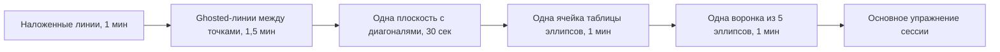

# Урок 03 — Разминка на 5 минут и первый «лист форм»

Длительность: **35–40 минут**. Нужны: карандаш HB, карандаш 2B, 3 листа A4, таймер.

## Разогрев — 3 минуты

Сегодня разогрев короткий, потому что первая половина урока — это и есть сборка
разминки. Просто проведите 8 наложенных линий и 6 ghosted-линий, чтобы рука вспомнила
амплитуду.

## Шаг 1. Собираем постоянную разминку — 5 минут

Разминка нужна каждый день до конца курса. Требования к ней: **фиксированный состав**
(чтобы видеть динамику), **ровно 5 минут** (чтобы не съедала сессию), **все базовые
движения** (чтобы рука была готова к любой задаче).



Регламент по блокам:

1. **Наложенные линии — 1 минута.** Два набора по 8 проходов: один короткий, один
   длинный через лист.
2. **Ghosted-линии — 1,5 минуты.** 10–12 линий, обязательно все четыре направления.
3. **Плоскость с диагоналями — 30 секунд.** Одна штука. Проверка: диагонали дают одно
   пересечение.
4. **Ячейка таблицы эллипсов — 1 минута.** Один ряд из 5–7 эллипсов, касающихся
   стенок и друг друга.
5. **Воронка — 1 минута.** Дуга, ось, 5 эллипсов на ней.

Заведите привычку делать разминку **на одном листе**, складывая их стопкой в `misc/`
раз в неделю: стопка за месяц — самый наглядный график прогресса, который у вас будет.

Проведите разминку прямо сейчас по таймеру. Уложились — состав ваш, не меняйте его
месяц.

```drill
type: free-form
prompt: "5 минут по таймеру. Полная разминка: наложенные линии, ghosted-линии, плоскость с диагоналями, ячейка эллипсов, воронка. Уложиться ровно в 5 минут."
answer: "Все пять блоков выполнены; уложились в 5 минут; движение шло от плеча, не от запястья; ничего не подправлялось и не стиралось; лист подписан датой."
check: manual
```

## Шаг 2. Круги двумя способами — 6 минут

Круг — частный случай эллипса (степень 90°), но у него своя трудность: любая
несимметричность видна мгновенно.

**Способ «от плеча».** Ghosting в воздухе, 2–3 быстрых прохода. Нарисуйте 10 кругов
диаметром 4–6 см. Быстро, живо, годится для 95% задач.

**Способ «часы».** Для крупных и ответственных кругов:

```text
              12
        11  .  |  .  1
      10 .     |     . 2
         .     |     .
    9 ---------+--------- 3       1. центр
         .     |     .            2. четыре точки: 12, 3, 6, 9
       8 .     |     . 4          3. четыре между ними
         7  .  |  .  5            4. соединить короткими дугами
              6
```

Нарисуйте так 3 круга диаметром 10 см. Затем переверните лист — «яйцо» станет заметно
сразу, если оно есть.

## Шаг 3. Базовые фигуры без линейки — 8 минут

Правило одно: **сначала точки, потом линии**. Стороны, рисуемые по очереди, наследуют
ошибки друг друга, и к четвёртой фигура уезжает.

- **Квадрат.** Четыре точки → взгляд («стороны параллельны? диагонали равны?») →
  четыре ghosted-линии. 5 штук.
- **Прямоугольник 2:1.** То же. Проверка: мысленно разделите пополам по длине — половины
  должны выглядеть одинаково. 5 штук.
- **Треугольник.** Три точки → три линии. Для равностороннего проверка: каждая вершина
  «смотрит» в середину противоположной стороны. 5 штук.

Универсальная проверка любой фигуры — перевернуть лист вверх ногами. Глаз привыкает
к своей ошибке за секунды, переворот сбрасывает привычку.

```drill
type: free-form
prompt: "8 минут. Пять квадратов, пять прямоугольников 2:1, пять треугольников. Линейка запрещена. Каждая фигура: сначала угловые точки, потом стороны ghosted-линиями. В конце проверить, перевернув лист."
answer: "Углы намечены точками до сторон; ни одна сторона не имеет заметной дуги; диагонали квадратов равны и пересекаются в центре; половины прямоугольников выглядят одинаково; при перевороте листа фигуры не «поехали»."
check: manual
```

## Шаг 4. «Лист форм» — 12 минут

Итоговое упражнение модуля. Один лист A4, всё сразу, без стирания.

Разделите лист на четыре зоны (просто наметьте линиями от руки) и заполните:

1. **Зона 1 — линии.** 12 ghosted-линий разных направлений.
2. **Зона 2 — эллипсы.** Две ячейки таблицы плюс одна воронка.
3. **Зона 3 — фигуры.** По две штуки: квадрат, прямоугольник, треугольник, круг.
4. **Зона 4 — штриховка.** Два прямоугольника 5×8 см, в каждом 20–30 параллельных
   линий с равным интервалом от края до края: один горизонтальными линиями, второй —
   под 45°.

Штриховка здесь — не про тон, а про строй. Тон и свет будут в модуле
[`05-form-light-and-shadow`](../../05-form-light-and-shadow/index.md); сегодня задача
только одна: одинаковый интервал, параллельность, никаких крючков.

Этот лист — ваш эталон «до». Через месяц сделайте такой же и положите рядом.

```drill
type: free-form
prompt: "12 минут. «Лист форм»: A4 разделён на четыре зоны — 12 ghosted-линий; две ячейки эллипсов плюс воронка; по две базовые фигуры каждого типа; два прямоугольника штриховки по 20-30 линий. Без ластика."
answer: "Все четыре зоны заполнены; ни одна линия не обводилась; эллипсы без углов на концах; в штриховке интервал равномерный и линии касаются обеих границ; лист сфотографирован в misc/ с датой и помечен как эталон."
check: manual
```

## Чек-лист сессии

- [ ] Разминка уложилась ровно в 5 минут и её состав зафиксирован.
- [ ] Круги нарисованы обоими способами.
- [ ] Все фигуры строились «сначала точки, потом линии».
- [ ] «Лист форм» заполнен целиком, без стирания.
- [ ] Лист подписан датой и лежит в `misc/`.

## Итог

Модуль 02 закончен. У вас есть три вещи: техника уверенной линии (ghosting), контроль
эллипса (быстро, 2–3 прохода, малая ось = ось вращения) и постоянная пятиминутная
разминка, которая теперь открывает каждую сессию.

Точность будет расти сама, если соблюдать два запрета: не обводить и не стирать.
Обе привычки маскируют ошибку, а вам нужна ошибка в явном виде — только по ней рука учится.

Дальше — [`03-measuring-and-proportions`](../../03-measuring-and-proportions/index.md):
как решить, **куда** проводить линию. Там впервые появится натура и настоящий рисунок
с предметов.
