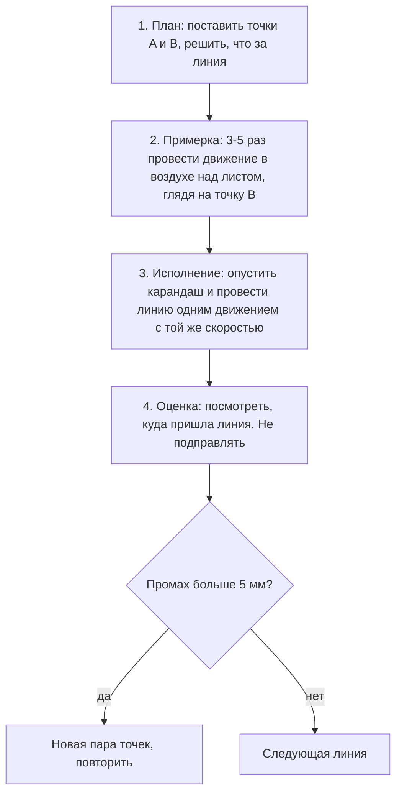

# Линия и базовые формы

## Простыми словами

Есть два способа провести линию из точки A в точку B. Первый: осторожно, мелкими
штришками, всё время подправляя направление, — так рисует почти каждый новичок.
Получается мохнатая серая полоса, которая не совпадает ни с A, ни с B, и при этом
выглядит «примерно правильно». Второй: примерился и провёл одним движением. Линия
чистая, и, скорее всего, она мимо — например, прошла на 3 мм левее точки B.

Второй способ лучше. Не потому, что красивее, а потому что **честнее**: ошибка видна,
измерима и потому исправима. Мохнатая линия ошибку прячет. Через полгода первый способ
превращается в привычку, от которой избавляются годами.

Отсюда центральная идея модуля: **уверенность важнее точности**. Сначала учимся
проводить чистую линию (пусть мимо), потом отдельно учимся попадать. В обратном порядке
не работает.

## Зачем это нужно

Линия — единственный физический инструмент, который у вас есть. Всё остальное —
пропорции, перспектива, свет — это решения о том, *куда* её провести. Если рука не
исполняет решение, проверить решение невозможно: вы не поймёте, ошиблись вы в
построении или просто промазали.

Плюс эллипсы. Эллипс — это круг в перспективе, а круги в реальном мире повсюду: кружки,
банки, колёса, глаза, ручки дверей, тарелки. Эллипс с острыми концами мгновенно
разрушает объём, поэтому он вынесен в отдельный крупный блок ещё до перспективы.

## Как делать (пошагово)

### 1. Уверенная линия: что это

Уверенная линия (confident line) — это линия, проведённая **одним непрерывным движением
с постоянной скоростью**, без остановок и без подправок. Признаки:

```text
   уверенная линия:        A----------------------->B'   (мимо B на 3 мм, но чистая)

   куриные лапки:          A~-~ -~--~ - ~-~- ~-~->  B    (попала, но месиво)

   линия с «переездом»:    A---------------------->  B   с крючком на конце
                                                   \_
```

Оценивается по трём признакам: **нет дрожи** (wobble), **нет остановок и наплывов**,
**одинаковая толщина по всей длине** (кроме намеренного нажима).

### 2. Откуда двигать: плечо, локоть, запястье, пальцы

```text
  сустав     радиус дуги    длина линии, которую он тянет
  --------------------------------------------------------
  плечо      очень большой  15 см и больше, почти прямая
  локоть     средний        5-15 см
  запястье   маленький      2-5 см, заметная дуга
  пальцы     крошечный      меньше 2 см, только детали
```

Правило: **линия длиннее 5 см рисуется от плеча**, кисть при этом не опирается на лист
и не сгибается. Ощущение непривычное — рука «плавает». Так и должно быть. Через неделю
это станет нормой.

### 3. Ghosting — главная техника модуля

Ghosting (метод Drawabox, Lesson 1) — это разделение одного действия на четыре фазы.
Смысл: рука репетирует движение вхолостую, пока оно не станет автоматическим, и только
потом касается бумаги.



Ключевые детали:

- В фазе примерки смотрите **на конечную точку B**, а не на карандаш. Рука сама идёт
  туда, куда направлен взгляд, — это тот же механизм, что при броске мяча.
- Скорость исполнения = скорости примерки. Медленное «аккуратное» исполнение после
  быстрой примерки даёт дугу.
- Линия проводится **один раз**. Обводить нельзя. Это не запрет ради дисциплины: обводя,
  вы тренируете руку исправляться, а не попадать.
- Промах — это данные. Записывайте себе: «стабильно ухожу вправо» — значит, надо
  целиться левее.

### 4. Наложенные линии (superimposed lines)

Первое упражнение Drawabox. Проводите одну базовую линию (можно с линейкой или от руки),
затем **8 раз обводите её**, каждый раз начиная строго из одной и той же стартовой
точки.

- Все 8 линий стартуют из одной точки — это единственная жёсткая часть.
- К концу они разъедутся веером. Это нормально.
- Цель — не совпадение, а ровность каждого прохода. Разъезд говорит, где именно рука
  тянет в сторону.
- Длины: короткие (5 см), средние (12 см), длинные (через весь лист).

### 5. Линии между двумя точками (ghosted lines)

Ставите две точки, применяете ghosting, проводите одну линию. Критерии:
попадание в конечную точку ±3 мм, отсутствие дрожи, отсутствие «крючка» на конце.

Начинайте с расстояния 10 см, доводите до диагонали листа. Углы меняйте: горизонтальные,
вертикальные, диагональные в обе стороны. Диагональ «снизу слева — вверх вправо» для
правши самая удобная: она совпадает с естественным размахом руки. Диагональ «сверху
слева — вниз вправо» идёт поперёк него и даётся труднее — добавляйте её специально.

### 6. Плоскости (ghosted planes)

Ставите на листе **четыре точки** произвольным четырёхугольником, соединяете их
четырьмя ghosted-линиями. Получается плоскость. Затем проводите две диагонали — они
должны пересечься в одной точке. Точка пересечения — центр плоскости (это пригодится
в модуле [`04-perspective`](../04-perspective/index.md) для деления в перспективе).

Упражнение сложнее, чем кажется: каждая следующая линия должна попасть в две уже
существующие точки, права на промах меньше.

### 7. Эллипсы: анатомия

```text
              большая ось (major axis)
        <------------------------------->
                       |
                 ......|......
             ..'       |       '..
           .'          |          '.       малая ось
    ------.------------+------------.------ (minor axis)
           '.          |          .'
             ..        |       ..'
                 '''''''''''''
        концы ровные, круглые — НЕ острые
```

- **Большая ось (major axis)** — самый длинный диаметр эллипса.
- **Малая ось (minor axis)** — самый короткий, всегда перпендикулярна большой.
- **Степень (degree)** — насколько эллипс «раскрыт»: отношение малой оси к большой,
  обычно выражают в градусах. 90° — это круг, 10° — почти линия. Круглая крышка кружки,
  которую вы видите почти сбоку, — узкий эллипс, малая степень.
- **Концы (ends)** — самое частое место провала. У эллипса нет углов; на концах большой
  оси кривизна максимальная, но она всё равно **плавная**.

Физика такая же, как у линии: эллипс рисуется **одним быстрым движением от плеча**, а не
выводится медленно. Медленный эллипс всегда выходит с углами и вмятинами.

### 8. Как рисовать эллипс

1. Наметьте, где эллипс должен быть и какой он ширины.
2. Ghosting: покрутите движение **в воздухе** над листом 5–8 раз, по той траектории,
   которая нужна.
3. Опустите карандаш и обведите **2–3 круга по одному следу**, не отрывая карандаш и
   не сбавляя скорость. Два прохода — норма Drawabox, три — максимум; больше превращается
   в «клубок».
4. Не подправляйте. Плохой эллипс — рисуйте следующий рядом.

### 9. Таблицы эллипсов (tables of ellipses)

Расчертите лист на 6–8 ячеек-прямоугольников (можно от руки). В каждой ячейке заполните
ряд эллипсов так, чтобы они **касались стенок ячейки и друг друга**, не пересекаясь и
не оставляя зазоров.

Критерии: касание без наложения, ровные концы, одинаковая степень внутри ряда.
Это упражнение на контроль размера и на «попадание в границу».

### 10. Эллипсы в плоскостях (ellipses in planes)

Берёте плоскость (упражнение 6) и вписываете в неё эллипс так, чтобы он **касался всех
четырёх сторон**. Плоскость чаще всего неправильный четырёхугольник, значит, эллипс
будет наклонённым — и это правильно: он ведёт себя как круг, лежащий на этой плоскости
в пространстве.

Правило, которое пригодится в перспективе: **малая ось эллипса совпадает с осью
вращения** объекта. У стоящей кружки ось вертикальная — значит, малая ось ободка
вертикальна. Подробно — в
[`04-perspective`](../04-perspective/theory-2-ellipses-and-cylinders.md).

### 11. Воронки (funnels)

Рисуете дугу (сегмент окружности), проводите через неё прямую ось. Вдоль оси нанизываете
ряд эллипсов разной величины — как воронку. Все эллипсы должны быть **симметричны
относительно оси**: ось делит каждый пополам и совпадает с их малой осью.

Упражнение ставит навык, без которого не получится ни одного цилиндра.

### 12. Круги: два способа

**Способ 1 — «часы».** Наметьте центр, поставьте четыре точки на равном расстоянии
от него (12, 3, 6, 9 часов), затем ещё четыре между ними. Соедините восемь точек
короткими дугами. Медленно, но точно; годится для крупных кругов и для проверки.

**Способ 2 — от плеча.** Ghosting в воздухе, затем два-три быстрых прохода по одному
следу. Быстро и живо, точность приходит с повторами. Это основной способ.

Для повседневной работы используйте второй; первый — когда круг критичен (циферблат,
колесо крупным планом).

### 13. Базовые плоские фигуры

- **Квадрат.** Ошибка новичка — рисовать четыре стороны по очереди; к четвёртой фигура
  «уезжает». Правильно: наметить четыре угловые точки, проверить их глазом (диагонали
  равны? стороны параллельны?), потом соединить ghosted-линиями.
- **Прямоугольник.** То же плюс проверка: разделите его пополам по длине — обе половины
  должны выглядеть одинаково.
- **Треугольник.** Три точки, три линии. Равносторонний труден: проверяйте, что каждая
  вершина «смотрит» в середину противоположной стороны.
- **Проверка любой фигуры:** переверните лист вверх ногами или посмотрите на него в
  зеркало. Кривизна, которую глаз перестал замечать, станет очевидной.

### 14. Штриховка как контроль линии

На этом этапе штриховка (hatching) — не про тон, а про руку. Задача: в заданном
прямоугольнике провести 20–30 параллельных линий с одинаковым интервалом, каждая от
края до края.

Критерии: интервал равномерный, линии параллельны, начало и конец касаются границ
прямоугольника, нет «крючков» на концах. Тон и работа со светом — модуль
[`05-form-light-and-shadow`](../05-form-light-and-shadow/index.md); здесь только строй.

### 15. Как исправлять, не стирая: draw-through

**Draw-through** («сквозное» построение) — рисовать невидимые части формы так, как будто
объект прозрачный: дальнюю стенку коробки, дальний край ободка кружки. Даёт два эффекта:
вы проверяете, что форма замкнута и правдоподобна, и вы перестаёте бояться лишних линий.

Правила работы без ластика:

1. Ошиблись — **не стирайте, проведите правильную линию рядом**, чуть плотнее.
   Глаз читает более тёмную линию как главную.
2. Лишние построения не мешают: они читаются как строительные леса и добавляют рисунку
   живости.
3. Ластик (лучше клячка) достаётся **в самом конце**, чтобы приглушить построение, а
   не чтобы убрать ошибку.
4. Если лист «умер» — берите новый. Пачка стоит копейки, а новая попытка стоит 10 минут.

### 16. Ежедневная разминка — 5 минут

Одинаковая каждый день, до конца курса:

1. Наложенные линии — 1 минута (2 набора по 8).
2. Ghosted-линии между точками — 1,5 минуты (10–12 линий, разные углы).
3. Одна плоскость с диагоналями — 30 секунд.
4. Таблица эллипсов, одна ячейка — 1 минута.
5. Воронка из 5 эллипсов — 1 минута.

## Чек-лист самопроверки

По каждому упражнению — до пяти пунктов «да/нет».

**Линия:**
- [ ] Проведена одним движением, без остановок.
- [ ] Нет дрожи по всей длине.
- [ ] Нет «крючка» на конце (рука не тормозила).
- [ ] Попадание в конечную точку в пределах 3–5 мм.
- [ ] Линия не обводилась вторым проходом.

**Эллипс:**
- [ ] Концы плавные, без углов и вмятин.
- [ ] Не более 2–3 проходов, они лежат близко друг к другу.
- [ ] Форма симметрична относительно обеих осей.
- [ ] Эллипс касается границ ячейки/плоскости там, где должен.
- [ ] Степень одинакова у всех эллипсов ряда.

**Фигура:**
- [ ] Углы намечены точками до проведения сторон.
- [ ] Стороны прямые, без дуги.
- [ ] Диагонали пересекаются примерно в центре.
- [ ] При перевороте листа фигура не «поехала».

## Типичные ошибки

- **Куриные лапки (chicken scratching).** Много коротких штрихов вместо одной линии.
  Лечение: ghosting и запрет обводить.
- **Рисование от запястья.** Даёт дугу вместо прямой. Лечение: верхний хват, кисть
  в воздухе.
- **Медленное «аккуратное» проведение.** Медленная линия дрожит. Скорость — часть техники.
- **Крючок на конце.** Рука тормозит перед точкой и заворачивает. Лечение: вести
  движение «сквозь» точку, останавливаться уже после неё.
- **Эллипс с острыми концами.** Признак того, что эллипс выводился медленно и по частям.
- **Эллипс-«клубок».** Пять и больше проходов. Максимум три.
- **Забытая ось у воронки.** Эллипсы наклоняются вразнобой; малая ось перестаёт совпадать
  с осью воронки.
- **Стирание в процессе.** Убивает данные об ошибке и съедает время.
- **Рисование квадрата «по одной стороне за раз».** Фигура уезжает к четвёртой стороне.
- **Отказ от разминки, когда «уже получается».** Разминка — это восстановление амплитуды,
  а не проверка навыка.

## Словарь терминов

- **Уверенная линия (confident line)** — линия одним движением, без остановок и правок.
- **Ghosting** — примерка движения в воздухе перед проведением линии.
- **Наложенные линии (superimposed lines)** — многократное обведение одной линии из
  общей стартовой точки.
- **Плоскость (plane)** — четырёхугольник из четырёх ghosted-линий, база для эллипсов
  и коробок.
- **Куриные лапки (chicken scratching)** — линия из множества коротких неуверенных штрихов.
- **Большая ось (major axis)** — самый длинный диаметр эллипса.
- **Малая ось (minor axis)** — самый короткий диаметр, перпендикулярна большой; совпадает
  с осью вращения объекта.
- **Степень эллипса (degree)** — отношение малой оси к большой, выражается в градусах;
  90° — круг.
- **Воронка (funnel)** — ряд эллипсов, нанизанных на общую ось внутри дуги.
- **Штриховка (hatching)** — параллельные линии; на этом этапе — упражнение на строй.
- **Draw-through** — построение объекта как прозрачного, с невидимыми гранями.

## См. также

- **Drawabox, Lesson 1: Lines, Ellipses and Boxes** — первоисточник ghosting, наложенных
  линий, плоскостей, таблиц эллипсов и воронок. Там же — картинки «правильно/неправильно»,
  которых нет в тексте. [drawabox.com](https://drawabox.com)
- **Drawabox, Lesson 0** — правило 50% и почему не надо стирать.
- **Andrew Loomis, «Fun with a Pencil»** — начало книги: простые формы, построение
  «от блока», лёгкость линии.
- **Proko**, ролики про line control и «how to draw a straight line» — видно движение
  плеча, что текстом не передаётся.
- Предыдущий модуль: [`01-materials-and-seeing`](../01-materials-and-seeing/index.md).
- Следующий модуль: [`03-measuring-and-proportions`](../03-measuring-and-proportions/index.md).
- Эллипсы в перспективе, цилиндры и колёса:
  [`04-perspective`](../04-perspective/index.md).
