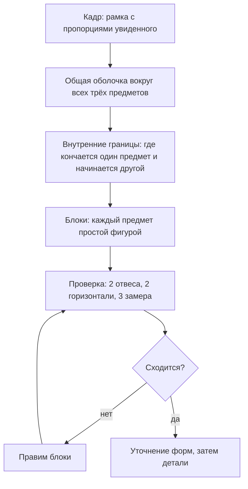

# Урок 02 — Натюрморт из трёх предметов блок-ином

Длительность: **40–45 минут**. Нужны: карандаш HB (построение) и 2B (уточнение),
2 листа A4, три предмета, лампа, таймер.

## Разогрев — 5 минут

Стандартная пятиминутная разминка. Плюс одно повторение рукой: три ghosted-линии через
весь лист верхним хватом — оболочку вы будете строить именно такими.

## Шаг 1. Постановка — 5 минут

Ставим натюрморт правильно, это половина успеха.

1. **Предметы:** три штуки, **разной формы** и **разной высоты**. Идеальная тройка для
   первого раза: кружка (цилиндр), книга или коробка (блок), яблоко или мандарин (шар).
2. **Перекрытие.** Сдвиньте их так, чтобы хотя бы один предмет частично закрывал другой.
   Перекрытие мгновенно даёт глубину и создаёт интересные просветы для проверки.
3. **Никакого ряда.** Не выстраивайте предметы в линию по фронту — разнесите по глубине.
4. **Фон** светлый и однотонный: лист бумаги, приколотый к стене, или светлая стена.
5. **Свет:** одна лампа сбоку и чуть сверху, примерно под 45°. Верхний свет в комнате
   **выключить**. Две тени от двух источников путают форму.
6. **Дистанция** 1,5–2 метра, вся группа в поле зрения без поворота головы.
7. **Отметьте место** на полу и **сфотографируйте постановку** в `misc/` — если её
   придётся разобрать, вернуться будет по чему.

Свет сегодня нужен только чтобы формы читались; тон и тени — модуль
[`05-form-light-and-shadow`](../../05-form-light-and-shadow/index.md). Рисуем линией.

## Шаг 2. Кадр и общая оболочка — 8 минут



1. **Кадр.** Сложите пальцы обеих рук в прямоугольник и посмотрите сквозь него на
   группу. Подберите такое кадрирование, чтобы группа занимала примерно 2/3 кадра.
   Нарисуйте рамку с этими пропорциями.
2. **Габаритные точки.** Отметьте четыре крайние точки всей группы: самая левая, самая
   правая, самая верхняя, самая нижняя. Это границы, за которые рисунок не выйдет.
3. **Оболочка (envelope).** Соедините крайние точки прямыми линиями — получится
   многоугольник, как будто на группу натянули резинку. Обычно 5–7 сторон.

```text
        .-------------------.
       /                     \
      /   ( )                 \        оболочка = многоугольник
     |     |     [====]        |       вокруг всей группы,
     |    ( )    [====]  (o)   |       только прямые линии
      \                       /
       '---------------------'
```

Оболочка — самая важная линия дня. Если она стоит верно, ошибиться сильно внутри уже
трудно.

```drill
type: free-form
prompt: "8 минут. Кадр и общая оболочка натюрморта: рамка с пропорциями увиденного, четыре крайние габаритные точки, многоугольник оболочки из прямых линий."
answer: "Кадр нарисован до всего остального; крайние точки намечены до линий; оболочка состоит только из прямых; группа занимает примерно две трети кадра; ни один предмет ещё не нарисован."
check: manual
```

## Шаг 3. Блоки — 10 минут

Каждый предмет — **одна простая фигура**. Кружка — прямоугольник, книга —
параллелограмм, яблоко — квадратик со скругленными углами.

Порядок:

1. Начните с **самого крупного** предмета: он задаёт масштаб остальным.
2. Выберите единицу измерения — например, высоту кружки — и меряйте ей остальных:
   «яблоко = 0,6 высоты кружки», «книга по длине = 1,4 высоты кружки».
3. Отметьте **границы каждого предмета точками** внутри оболочки, потом соединяйте.
4. Не рисуйте ни одного эллипса, ни одной кривой. Только блоки.

## Шаг 4. Проверка — 6 минут

Самый важный этап, и его обычно пропускают.

- **Два отвеса.** Вертикаль через край книги: через что она проходит на кружке и на
  яблоке? Сверьте с рисунком.
- **Две горизонтали.** Уровень верха кружки: где он пересекает книгу? Уровень низа
  яблока: выше или ниже низа кружки?
- **Три замера.** Повторите ключевые отношения — общая ширина к общей высоте и два
  межпредметных.
- **Негатив.** Посмотрите на просветы между предметами. Форма просвета между кружкой и
  книгой на рисунке и в натуре — одна и та же?

Нашли ошибку — **правьте блок**, а не деталь. Правая линия проводится плотнее рядом
со старой; ластик не нужен.

```drill
type: free-form
prompt: "16 минут суммарно. Блоки трёх предметов простыми фигурами внутри оболочки, затем проверка: два отвеса, две горизонтали, три замера, сравнение одного просвета. Все найденные ошибки исправить на уровне блоков."
answer: "Начали с самого крупного предмета и мерили им остальные; каждый предмет обозначен одной простой фигурой без кривых; выполнены все четыре типа проверки; найденные ошибки исправлены линией поверх, без стирания; после правки повторно проверен хотя бы один отвес."
check: manual
```

## Шаг 5. Уточнение — 8 минут

Только теперь блоки превращаются в предметы.

1. Прямые становятся реальными кривыми: скругление яблока, изгиб корпуса кружки.
2. Эллипсы: ободок и донышко кружки. Малая ось вертикальна; донышко по степени шире
   ободка.
3. Ручка кружки, корешок книги, черенок яблока — по одному признаку на предмет, не больше.
4. Линии касания: где каждый предмет стоит на столе. Проверьте, что они на разных
   уровнях — иначе предметы «слипнутся» в одну плоскость.

Остановитесь по таймеру. Незаконченный, но верно построенный натюрморт полезнее
законченного и кривого.

## Чек-лист сессии

- [ ] Предметы разной формы и высоты, есть перекрытие.
- [ ] Один источник света, верхний свет выключен.
- [ ] Постановка сфотографирована, место на полу отмечено.
- [ ] Кадр и общая оболочка построены до предметов.
- [ ] Каждый предмет прошёл стадию простого блока.
- [ ] Выполнены минимум 2 отвеса и 2 горизонтали.
- [ ] Ошибки исправлялись на уровне блоков.
- [ ] Ластик не использовался в процессе.

## Итог

Групповая постановка добавляет новый класс ошибок: не только «предмет неверный», но и
«предметы стоят друг относительно друга неверно». Оболочка и отвесы закрывают именно
этот класс. Формула сессии: **общая оболочка → блоки → проверка → уточнение**, и
проверка обязана быть между блоками и уточнением, а не после всего.

Следующая сессия — [урок 03](./03-proportion-errors-checklist.md): разбираем свои
ошибки по чек-листу и учимся их чинить.
