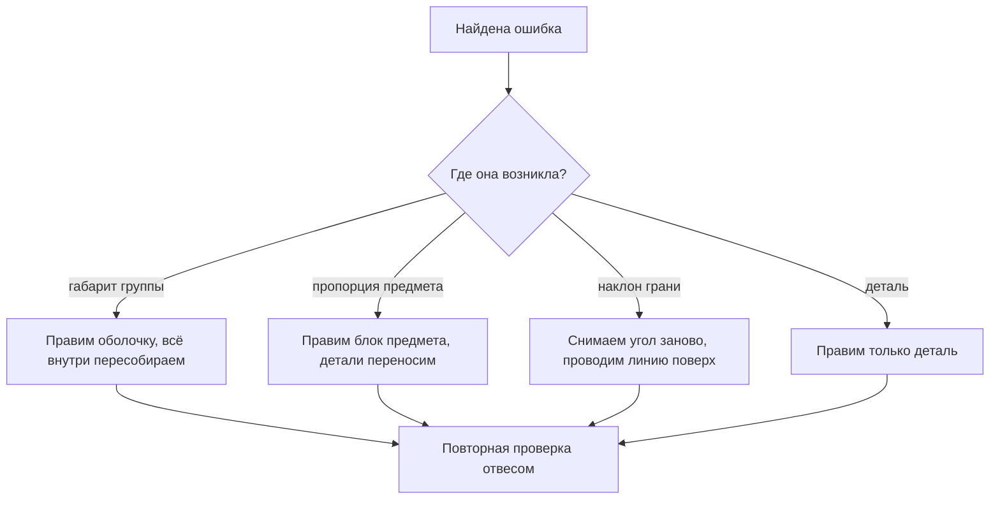

# Урок 03 — Разбор ошибок пропорций: чек-лист и исправление

Длительность: **35–40 минут**. Нужны: рисунки из уроков 01 и 02, карандаш 2B и 4B,
2 чистых листа, та же постановка (или фото постановки), таймер.

Урок диагностический. Рисуем мало, смотрим много — и учимся смотреть системно.

## Разогрев — 4 минуты

Сокращённая разминка: наложенные линии, 8 ghosted-линий, одна ячейка эллипсов.
Дальше нужна голова, а не рука.

## Шаг 1. Пять системных ошибок — 4 минуты

Ошибки пропорций у всех новичков одни и те же. Выучите список, чтобы искать адресно,
а не «смотреть, что не так».

1. **Верх больше низа.** Внимание сосредоточено на «главном» — ободке, крышке, голове —
   и непроизвольно его увеличивает. Проверка: отношение «верхняя половина : нижняя».
2. **Объект растёт по ходу работы.** Каждая новая деталь чуть шире предыдущей, предмет
   вылезает за габарит. Проверка: сравнить с изначально намеченными крайними точками.
3. **Выпрямленные наклоны.** Наклонные грани стремятся к горизонтали или вертикали.
   Проверка: карандаш-транспортир на каждую наклонную линию.
4. **Уплывшая ось.** У симметричного предмета половины разные. Проверка: переворот
   листа плюс осевая линия.
5. **Слипшаяся глубина.** Предметы стоят «в один ряд», линии касания стола на одном
   уровне. Проверка: горизонтали через нижние точки предметов.

## Шаг 2. Аудит своего рисунка — 12 минут

Возьмите натюрморт из [урока 02](./02-still-life-block-in.md) и разложите рядом с
натурой (или фото постановки). Работайте карандашом 4B **прямо поверх рисунка** —
пометки должны быть видны.

Процедура, строго по пунктам:

```text
   1. отвес     |  ставим карандаш вертикально, отмечаем на рисунке
                |  РЕАЛЬНОЕ положение точки штрихом 4B
   2. горизонт ---  то же горизонтально
   3. замер     [==]  повторяем 3 ключевых отношения, отмечаем
                      верное положение крестиком
   4. негатив   (##)  обводим просвет и сравниваем форму
   5. середина   +    отмечаем реальную середину по высоте
```

1. Проведите **три отвеса** через характерные точки натуры и отметьте на рисунке, где
   вертикаль должна была пройти.
2. Проведите **три горизонтали** — то же самое.
3. Повторите **три замера** и крестиками отметьте верные положения границ.
4. Обведите **два просвета** и сравните форму.
5. Отметьте **середину** группы по высоте и по ширине.

Теперь у вас на листе карта расхождений. Запишите на полях **три главные ошибки
словами**, обязательно с направлением: не «кружка кривая», а «кружка на 15% выше, чем
надо» или «яблоко смещено вправо на полдиаметра».

```drill
type: free-form
prompt: "12 минут. Аудит своего натюрморта: три отвеса, три горизонтали, три замера, два просвета, середины. Все расхождения отмечать карандашом 4B поверх рисунка. Записать три главные ошибки словами с направлением и величиной."
answer: "Выполнены все пять типов проверки; расхождения отмечены на листе, а не только замечены; три ошибки записаны с направлением и примерной величиной; формулировки конкретные, без слова «криво»."
check: manual
```

## Шаг 3. Исправление на правильном уровне — 10 минут

Главное правило: **ошибка чинится на том уровне, где возникла**.



Возьмите **чистый лист** и перерисуйте натюрморт заново с учётом найденных ошибок.
Не исправляйте старый: он вам нужен как «до».

Порядок тот же — кадр, оболочка, блоки, проверка, уточнение, — но теперь на каждом этапе
вы **специально проверяете ту ошибку, которую нашли у себя**. Если ваша системная
ошибка — «верх больше», меряйте отношение «верх : низ» дважды: на оболочке и на блоках.

Уложитесь в 10 минут. Задача не в законченности, а в правильном блоке.

```drill
type: free-form
prompt: "10 минут. Перерисовать тот же натюрморт на чистом листе с учётом трёх найденных ошибок. Старый рисунок не исправлять. На каждом этапе дополнительно проверять свою личную системную ошибку."
answer: "Работа велась на новом листе; порядок кадр-оболочка-блоки-проверка соблюдён; личная системная ошибка проверялась минимум дважды; новый рисунок ближе к натуре хотя бы по двум из трёх найденных ошибок; ластик не использовался."
check: manual
```

## Шаг 4. Личный список ошибок — 4 минуты

Заведите на отдельном листе (или в заметках) свой **список системных ошибок**. Формат:

```text
   ошибка                        как проверяю              с какого числа
   ---------------------------------------------------------------------
   верх крупнее низа             отношение верх:низ        2026-09-08
   наклоны выпрямляю             карандаш-транспортир      2026-09-08
   предметы слипаются в ряд      горизонтали через низы    2026-09-08
```

Правило работы со списком: перед каждым новым рисунком с натуры прочитать его —
занимает 20 секунд. Ошибка, которую вы ищете заранее, почти не появляется.

Раз в две недели вычёркивайте то, что перестало встречаться, и добавляйте новое.
Список должен быть коротким: **не больше пяти пунктов**.

```drill
type: multiple-choice
prompt: "Вы обнаружили, что вся группа предметов на 20 процентов шире, чем нужно. На каком уровне чинить?"
options: ["подправить контуры каждого предмета", "перестроить общую оболочку и пересобрать блоки", "уменьшить только крайний предмет", "оставить, разница небольшая"]
answer: "перестроить общую оболочку и пересобрать блоки"
check: exact
```

## Чек-лист сессии

- [ ] Аудит проведён всеми пятью способами проверки.
- [ ] Расхождения отмечены прямо на листе, а не только замечены.
- [ ] Три ошибки записаны словами, с направлением и величиной.
- [ ] Повтор сделан на чистом листе, старый рисунок сохранён как «до».
- [ ] Личный список ошибок заведён и содержит не больше пяти пунктов.
- [ ] Оба листа сфотографированы в `misc/` с датой.

## Итог

Разбор — это не «посмотреть и расстроиться», а процедура из пяти проверок, дающая
карту расхождений. Из карты получаются три конкретные формулировки, из формулировок —
личный список, а список превращает случайные ошибки в те, которые вы ищете заранее.

Модуль 03 закончен. Теперь у вас есть полный набор: видеть (модуль 01), проводить
линию (модуль 02), решать, куда её проводить (модуль 03). Осталось объяснить, почему
измеренные отношения меняются с расстоянием — этим занимается
[`04-perspective`](../../04-perspective/index.md).
