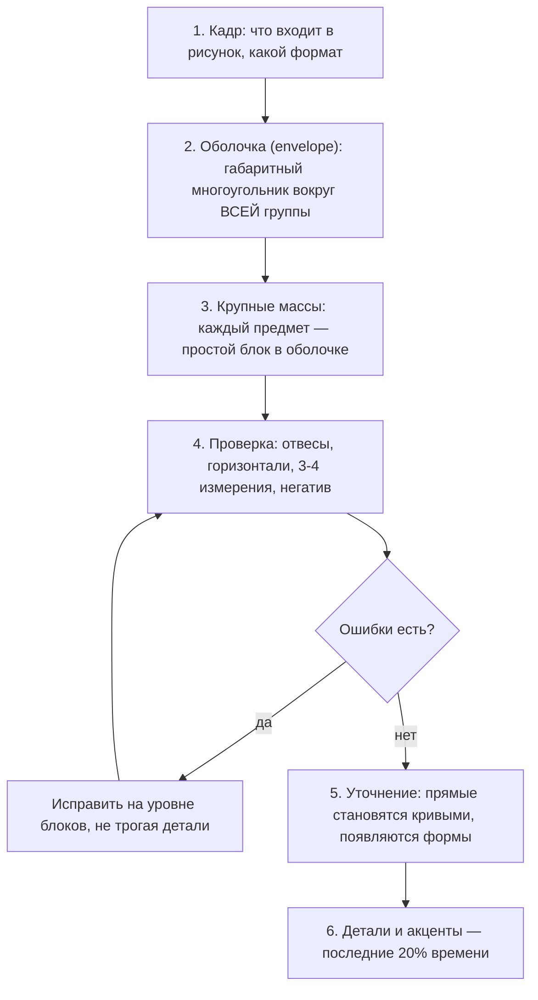

# Измерение и пропорции

## Простыми словами

Спросите себя: насколько кружка выше, чем шире? Большинство ответит «ну, примерно
в полтора». Возьмите карандаш, измерьте — окажется, что ровно в 1,15. И вот эта разница
между «примерно» и «1,15» и есть разница между рисунком, который «что-то не то», и
рисунком, который выглядит правильным.

Пропорция — это **отношение двух величин**, а не абсолютный размер. Абсолютные
сантиметры на листе не нужны никогда: важно только, во сколько раз одно больше другого.
Поэтому все процедуры модуля устроены одинаково — выбрать единицу и уложить её в
остальное.

Второе, что здесь важно: пропорции — **проверяемые**. Не «чувствую, что криво», а
«ставлю отвес от края ручки вниз — он проходит через середину донышка, а у меня на
рисунке проходит мимо». Это точная диагностика, а значит, точное исправление.

## Зачем это нужно

Все остальные навыки бессмысленны при сломанных пропорциях. Идеально проложенная тень
на предмете, у которого верх вдвое больше низа, — это тень на кривом предмете.
Именно ошибки пропорций делают рисунок «детским», даже если линия уверенная.

Второй эффект — скорость. Три минуты измерений в начале экономят полчаса переделок в
конце. Аналитику это обычно нравится: конечная точность зависит не от везения, а от
числа проверок.

## Как делать (пошагово)

### 1. Измерение карандашом (sighting)

Классическая техника, описанная у Берта Додсона в «Keys to Drawing» и в любом
академическом курсе.

```text
      глаз (один!)         карандаш               предмет
        O  ------------------ |==========| ----------> [ кружка ]
        |<-------- рука полностью выпрямлена -------->|
                  локоть НЕ сгибается, плечо неподвижно
```

Шаги:

1. **Выпрямите руку полностью** и держите её так всё измерение. Согнули локоть —
   изменился масштаб, все замеры бессмысленны.
2. **Закройте один глаз.** Два глаза дают два разных изображения, карандаш «двоится».
3. **Держите карандаш перпендикулярно направлению взгляда**, в плоскости, параллельной
   вашему лицу. Наклонённый вперёд карандаш даёт заниженную длину.
4. **Выберите единицу (unit).** Обычно это самый маленький значимый размер: ширина
   ручки кружки, высота крышки, диаметр яблока. Совместите кончик карандаша с одним
   краем этого элемента, ноготь большого пальца — с другим. Расстояние «кончик–ноготь»
   и есть единица.
5. **Не отпуская палец**, переносите карандаш на другой размер и считайте, сколько раз
   единица укладывается: «в высоте кружки единица помещается 3 с небольшим раза».
6. **Запишите отношения**, а не сантиметры: «высота = 3,2 ширины ручки».
7. **На листе** выберите произвольный размер единицы (например, 2 см) и стройте всё
   от него. Рисунок будет крупнее или мельче натуры, но пропорционально верным.

Полезно измерять **три-четыре ключевых отношения**, а не всё подряд: общая высота
к общей ширине, высота главного элемента к общей высоте, ширина одного объекта к ширине
соседнего.

### 2. Sight-size против сравнительного измерения

**Sight-size** — лист ставится рядом с натурой так, чтобы изображение на листе было
**точно того же размера**, что видимый размер натуры. Тогда можно буквально прикладывать
карандаш и переносить длины один в один, без пересчёта. Метод академических школ; даёт
высокую точность, но требует жёсткой фиксации позы, расстояния и положения листа: сдвинулись
на 20 см — всё сломалось.

**Сравнительное измерение (comparative measurement)** — то, что описано выше: работа
с отношениями, размер на листе любой. Менее точно, зато работает где угодно, в том числе
на улице и в кафе.

Правило: для учебного натюрморта дома — sight-size, если хочется максимума точности
и есть возможность не двигаться. Во всех остальных случаях — сравнительное. В этом
модуле основной метод — **сравнительный**.

### 3. Отвесы и горизонтали (plumb lines)

Самый дешёвый способ проверить взаимное положение.

Держите карандаш **строго вертикально** (или горизонтально) на вытянутой руке и
смотрите, что оказывается на одной линии:

```text
        |                             ------------------  горизонталь
        |  <- отвес через край         касается верха
        |     кувшина                  яблока и середины
      [кувшин]  [яблоко]               ручки кувшина
        |
        `--- проходит по левому краю яблока
```

Вопросы, которые вы задаёте:

- Что находится **прямо под** этой точкой? (вертикальный отвес)
- Что находится **на одном уровне** с ней? (горизонталь)
- Правый край кружки левее или правее левого края яблока?

Три-четыре отвеса ловят почти все ошибки размещения. Отвес не требует ни выпрямленной
руки, ни фиксированного масштаба — только один глаз и вертикальность карандаша.

### 4. Углы: метод часов и карандаш-транспортир

Наклонные линии — вторая по частоте ошибка после размеров. Глаз систематически
«выпрямляет» наклоны: скошенный край стола рисуется горизонтальнее, чем есть.

**Метод часов.** Приложите карандаш к наблюдаемому наклону (держа его на вытянутой руке
в плоскости листа) и назовите направление как стрелку часов: «эта грань идёт как стрелка
на 2 часа». Затем переносите на лист то же направление.

```text
        12
   11    |    1
        \|/
  10 --- + --- 2      грань стола идёт «на 2 часа»
        /|\
    8    |    4
         6
```

**Карандаш-транспортир.** Приложите карандаш к линии в натуре, запомните угол между ним
и вертикалью (или горизонталью), не меняя угол — поднесите к листу и проведите. Самый
прямой способ, работает и для длинных линий.

**Приём «поймать в вилку».** Спросите не «сколько градусов», а «ближе к вертикали или
к горизонтали?» и потом «ближе к 45° или к горизонтали?». Двумя вопросами угол
загоняется в узкий диапазон, и промах становится мал.

### 5. Envelope и блок-ин (block-in)

Главная процедура модуля: строим от общего к частному, никогда наоборот.



Подробнее по шагам:

1. **Кадр.** Решите, что вообще входит в рисунок, и нарисуйте рамку с теми же
   пропорциями. Без кадра нет системы отсчёта.
2. **Оболочка (envelope).** Обведите всю группу предметов одним многоугольником из
   прямых линий — как будто натянули резинку. Это ваша опора: если оболочка стоит
   правильно, внутри уже трудно ошибиться сильно.
3. **Крупные массы.** Каждый предмет — простая фигура: кружка = прямоугольник,
   яблоко = квадратик со скруглением, коробка = параллелограмм. Никаких деталей.
4. **Проверка.** Отвесы, горизонтали, 3–4 замера, взгляд на негативное пространство.
   Ошибки исправляются **сейчас**, пока их дёшево исправлять.
5. **Уточнение.** Прямые превращаются в реальные кривые, появляются эллипсы ободков,
   изгибы ручки.
6. **Детали.** Последние 20% времени. Не раньше.

Правило: **никогда не уточняйте то, что ещё не проверено**. Каждая минута, вложенная
в деталь на неверном блоке, — минута, которую придётся выбросить.

### 6. Середины и половины

Быстрая и очень надёжная проверка. Найдите **середину** любого объекта — по высоте
и по ширине — и проверьте, что на рисунке она там же.

Примеры, которые почти всегда удивляют новичка:

- У стоящего человека середина по высоте — примерно **лобковая кость**, а не пупок и
  не талия.
- У головы анфас линия глаз — примерно **середина** высоты головы, а не верхняя треть
  (это разбирается в [`07-figure-and-head-basics`](../07-figure-and-head-basics/index.md)).
- У кружки середина по высоте обычно **ниже**, чем кажется, потому что верх притягивает
  внимание.

Способ деления: половина, потом половина половины. Четвертями объект контролируется
надёжнее, чем «на глаз в целом».

### 7. Проверка симметрии

Три приёма, от самого дешёвого:

1. **Переверните лист вверх ногами.** Глаз перестаёт узнавать объект и мгновенно видит
   перекос. Занимает две секунды.
2. **Посмотрите в зеркало** (или на фото с зеркальным отражением в телефоне). Ошибка,
   к которой вы привыкли, «прыгает» в глаза.
3. **Посмотрите на просвет** — приложите лист к окну с обратной стороны.

Для симметричных предметов (кружка, ваза, бутылка) добавьте **осевую линию**: проведите
вертикаль через центр и стройте обе половины от неё, а не одну за другой.

### 8. Проверка негативом

Приём из [модуля 01](../01-materials-and-seeing/theory.md), который здесь становится
инструментом контроля. Когда что-то «не так», а что — непонятно: посмотрите на **форму
просвета** между предметами и сравните её с той, что на рисунке. Просветы врут гораздо
реже, чем предметы, потому что у них нет символа.

### 9. Постановка натюрморта

Что ставить в первые разы:

- **2–3 предмета**, разных по форме: кружка (цилиндр), коробка или книга (блок),
  яблоко или мандарин (шар). Больше — рано.
- **Разной высоты**, чтобы не выстроились в ряд одинаковых столбиков.
- **Частично перекрывающих друг друга** — перекрытие сразу даёт глубину и создаёт
  интересные просветы.

Как ставить:

1. Фон — светлая стена или лист бумаги, приколотый сзади. Никакой пёстрой скатерти.
2. Свет — **одна лампа сбоку и чуть сверху**, под 45°. Верхний свет в комнате выключить:
   два источника дают две тени и путаницу.
3. Расстояние — 1,5–2 метра, вся группа умещается в поле зрения без поворота головы.
4. **Отметьте своё место**: наклейте бумажку на пол под ножку стула. Сдвинулись — ракурс
   изменился, и все замеры устарели.
5. Сфотографируйте постановку: если её придётся разобрать, вернуться будет по чему.

Свет здесь нужен для читаемости формы; тон и тени — тема
[`05-form-light-and-shadow`](../05-form-light-and-shadow/index.md), сейчас рисуем линией.

## Чек-лист самопроверки

- [ ] Рука при измерении была полностью выпрямлена, локоть не сгибался.
- [ ] Один глаз закрыт, карандаш перпендикулярен взгляду.
- [ ] Я записал 3–4 отношения, а не абсолютные сантиметры.
- [ ] Кадр и оболочка (envelope) нарисованы **до** предметов.
- [ ] Проверены минимум 2 отвеса и 2 горизонтали.
- [ ] Найдены и проверены середины по высоте и ширине.
- [ ] Лист был перевёрнут для проверки хотя бы один раз.
- [ ] Детали начались только после того, как блоки признаны верными.
- [ ] Моё место не менялось в течение сессии.

## Типичные ошибки

- **Голова/верх слишком большие.** Мы уделяем внимание «главному» и непроизвольно его
  увеличиваем. Лечение: измерить отношение «верх : низ» до рисования.
- **Объект растёт по ходу рисования.** Начали с кружки, добавили деталь чуть шире, ещё
  чуть шире — и предмет вылез за кадр. Лечение: габаритная оболочка и точки границ,
  поставленные заранее.
- **Выпрямленные наклоны.** Скошенные края становятся почти горизонтальными. Лечение:
  метод часов, карандаш-транспортир.
- **Уплывшая ось.** У симметричного предмета одна половина шире и выше другой. Лечение:
  осевая линия и построение обеих половин параллельно.
- **Согнутый локоть при замере.** Каждый замер в своём масштабе — все отношения врут.
- **Измерение двумя глазами.** Карандаш двоится, край «плавает» на сантиметр.
- **Детали раньше блоков.** Час на прорисовку ручки, которая стоит не там.
- **Ползающая поза.** Наклонились ближе к натуре — сменился ракурс. Отметьте место.
- **Один замер вместо трёх.** Одно отношение не задаёт форму. Минимум три.
- **Игнорирование негатива при поиске ошибки.** Смотреть на предмет, который «не такой»,
  бесполезно: смотреть надо на просвет рядом с ним.

## Словарь терминов

- **Пропорция** — отношение двух величин; всегда «во сколько раз», а не «сколько см».
- **Единица измерения (unit)** — самый маленький значимый размер объекта, которым
  меряют остальное.
- **Измерение карандашом (sighting)** — замер на вытянутой руке одним глазом.
- **Sight-size** — метод, при котором изображение на листе равно видимому размеру натуры.
- **Сравнительное измерение (comparative measurement)** — работа с отношениями, масштаб
  на листе произвольный.
- **Отвес (plumb line)** — воображаемая вертикаль, проверяющая, что под чем находится.
- **Оболочка (envelope)** — габаритный многоугольник вокруг всей группы предметов.
- **Блок-ин (block-in)** — построение крупными простыми массами до деталей.
- **Метод часов** — описание наклона линии как положения часовой стрелки.
- **Осевая линия (axis)** — вертикаль или ось симметрии предмета, от которой строятся
  обе половины.

## См. также

- **Bert Dodson, «Keys to Drawing»** — ключи про измерение, отношения и «рисование от
  общего»; там же упражнения на середины и на проверку.
- **Betty Edwards, «Drawing on the Right Side of the Brain»** — главы о восприятии
  отношений (третий из пяти навыков) и о видоискателе/плоскости изображения.
- **Andrew Loomis, «Successful Drawing»** — построение от габарита, пропорции и
  масштаб в сцене.
- **Proko**, ролики по теме «measuring» и «sight size» — там видно движение руки и
  положение карандаша, чего текст не передаёт.
- Предыдущий модуль: [`02-lines-and-basic-shapes`](../02-lines-and-basic-shapes/index.md).
- Следующий модуль: [`04-perspective`](../04-perspective/index.md) — там отношения
  начинают меняться по законам схождения, и измерение дополняется построением.
- Свет и тон: [`05-form-light-and-shadow`](../05-form-light-and-shadow/index.md).
