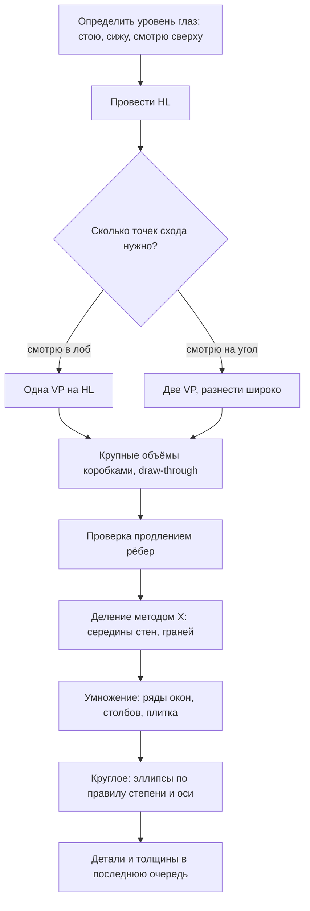

# Перспектива: эллипсы, цилиндры, деление пространства

Вторая часть теории модуля. Первая —
[`theory.md`](./theory.md) — про горизонт, точки схода и коробки; здесь всё круглое
и всё, что нужно, чтобы построить сцену: деление, умножение, лестница, интерьер, улица.

## Простыми словами

Круг в перспективе — это эллипс. Не «сплюснутый круг на глаз», а эллипс с двумя
понятными свойствами: его **малая ось совпадает с осью вращения объекта**, а его
**степень зависит от того, насколько далеко он от линии горизонта**. Обе вещи
проверяются за секунду, и обе почти всегда нарушены у новичка.

Вторая тема — деление пространства. Как поставить в перспективе ряд одинаковых столбов,
чтобы промежутки честно сокращались? Как найти середину уходящей вглубь стены, если
она уже не посередине на листе? Обе задачи решает одна конструкция — **диагонали**.

## Зачем это нужно

Круглого в мире примерно столько же, сколько прямоугольного: кружки, банки, тарелки,
колёса, трубы, бутылки, бочки, монеты, циферблаты. Кружка с неправильным эллипсом дна
разваливается независимо от того, как хорошо она построена в остальном.

Деление и умножение — это то, что превращает «коробку в пространстве» в «сцену»:
забор, ряд окон, шаги лестницы, плитка на полу. Без этих приёмов рисовать интерьер
приходится «на глаз», и он всегда выходит с накопленной ошибкой.

## Как делать (пошагово)

### 1. Степень эллипса и расстояние от горизонта

Возьмите стакан и медленно поднимайте его от стола к уровню глаз. Ободок из почти
круглого станет узким, а на уровне глаз выродится в **прямую линию**.

```text
   высоко над HL:   (      )      широкий эллипс, видим снизу
                     '----'

   - - - - - - - -  ---------  - - - - - - - - - - - HL
                    (на уровне глаз эллипс = линия)

   ниже HL:          .----.
                    (      )      чем ниже, тем шире
                     '----'
                    .------.
                   (        )     ещё ниже — ещё шире
                    '------'
```

Правило: **чем дальше круг от линии горизонта, тем больше степень эллипса** (тем он
«круглее»). Чем ближе к HL — тем уже.

Прямое следствие для стоящей на столе кружки: **донышко по степени шире ободка**,
потому что оно дальше от уровня глаз. Новички рисуют наоборот или делают их
одинаковыми — и кружка «складывается».

### 2. Малая ось = ось вращения

```text
        кружка стоит                     кружка лежит на боку
          |  ось                            ось
        .-|-.                             ----|----
       (  |  )                        ( ) ....|.... ( )
        '-|-'                              ---|---
     малая ось вертикальна            малая ось вдоль оси кружки
```

Малая ось эллипса всегда совпадает с осью вращения объекта. У стоящего цилиндра
ось вертикальна — значит, малая ось ободка вертикальна. У лежащей трубы ось идёт
вдоль трубы (и уходит в точку схода) — значит, малая ось эллипса лежит вдоль этого же
направления.

Это самый быстрый способ проверить свой эллипс: проведите через него малую ось и
посмотрите, совпадает ли она с осью предмета. Не совпала — эллипс «косой», объект
разваливается.

Технику самих эллипсов (ghosting, 2–3 прохода, ровные концы) см. в
[`02-lines-and-basic-shapes`](../02-lines-and-basic-shapes/theory.md).

### 3. Эллипс через квадрат в перспективе

Надёжный способ получить правильный эллипс — вписать его в квадрат, построенный
в перспективе.

1. Постройте квадрат в перспективе (стороны идут в свои точки схода).
2. Проведите диагонали — их пересечение даёт **центр квадрата в перспективе**. Он
   окажется **дальше** геометрической середины на листе.
3. Через центр проведите две «средние линии» — в точки схода.
4. Эллипс касается всех четырёх сторон в точках, где их пересекают средние линии.
   Обратите внимание: касание **не** посередине стороны на листе, а там, куда пришла
   средняя линия.

Такой эллипс автоматически имеет верную степень и верный наклон.

### 4. Цилиндр стоящий

1. Проведите **ось** — вертикаль.
2. Наметьте верхний эллипс: малая ось лежит на оси, степень выбираете по расстоянию
   от HL.
3. Нижний эллипс на той же оси, **шире по степени** (дальше от горизонта).
4. Соедините крайние точки эллипсов двумя боковыми линиями. Они касаются эллипсов
   по краям **большой оси**, а не «где придётся».
5. **Draw-through:** нарисуйте дальние половины обоих эллипсов. Тогда видно, что
   цилиндр замкнут, и легко заметить перекос.

Кружка = цилиндр + толщина стенки (второй эллипс внутри верхнего) + ручка. Ручка
строится как маленькая коробка/дуга, лежащая в вертикальной плоскости, проходящей
через ось.

### 5. Цилиндр лежащий

1. Проведите **ось** — линию, уходящую в точку схода.
2. Оба эллипса перпендикулярны оси: их **малые оси лежат на оси цилиндра**.
3. Дальний эллипс **меньше** ближнего (перспективное сокращение) и **чуть уже**
   по степени, если он ближе к горизонту.
4. Соедините по краям большой оси.

Частая ошибка: у лежащего цилиндра рисуют эллипсы с вертикальной малой осью, «по
привычке». Труба сразу превращается в набор колец.

### 6. Колесо

Колесо — это лежащий на боку короткий цилиндр, стоящий на земле.

1. Ось колеса горизонтальна и обычно уходит в точку схода (если машина стоит под углом).
2. Эллипс колеса: малая ось = ось колеса.
3. Второй эллипс — внутренний диск — **концентричен** первому и лежит в той же
   плоскости с той же степенью.
4. Толщина покрышки: второй эллипс, сдвинутый **вдоль оси**, а не вниз или вбок.
5. Точка касания земли лежит на **нижнем конце малой оси**, а не в нижней точке
   эллипса по листу. Это тонкое место: у наклонённого эллипса это разные точки.

### 7. Деление в перспективе: метод X

Задача: найти середину уходящей вглубь плоскости (стены, крышки стола, грани коробки).

```text
     A ________________ B
       |\            /|
       |  \        /  |
       |    \    /    |
       |      \/  <-- центр в перспективе
       |    /    \    |
       |  /        \  |
     C |/____________\| D

     провести диагонали AD и BC; их пересечение — центр;
     через него вертикаль (или линия в VP) делит плоскость пополам
```

Работает всегда и не требует измерений: диагонали прямоугольника пересекаются в его
центре — это свойство сохраняется при перспективной проекции.

Применение: середина стены для двери, середина фронтона дома, середина грани коробки,
центр квадрата для вписывания эллипса.

Повторяя приём, можно делить на 4, 8, 16 частей.

### 8. Умножение в перспективе: ряд одинаковых элементов

Задача: поставить ряд одинаковых столбов, окон, шпал так, чтобы промежутки правильно
сокращались.

```text
     верхняя линия -> VP
      *---___
      |      ---___*---___
      |            |      ---___*
      |     x      |    x       |        1. центр первого пролёта (x)
      |            |            |           через диагонали
      *---___      |            |        2. из верха первого столба
             ---___*---___      |           линия через x
                          ---___*        3. где она пересечёт нижнюю
     нижняя линия -> VP                     линию — там следующий столб
```

Пошагово:

1. Постройте первый пролёт: два столба, верхняя и нижняя линии уходят в VP.
2. Найдите **середину** первого пролёта методом X — точка `x`.
3. Из **верхней точки первого столба** проведите линию через `x` дальше.
4. Там, где она пересечёт **нижнюю направляющую**, стоит следующий столб.
5. Повторяйте: каждый новый пролёт строится от предыдущего.

Промежутки будут сокращаться ровно так, как надо, — без измерений и без «на глаз».

### 9. Простая лестница

Лестница — это ряд одинаковых коробок, поставленных со сдвигом. Строится комбинацией
деления и умножения.

1. Постройте **боковую стенку** лестницы как плоскость, уходящую в VP.
2. На ближнем краю отложите высоту одной ступени, на дальнем — тоже (с сокращением).
   Соедините — получится «направляющая подъёма».
3. Разделите высоту на N равных частей **по ближнему краю** и проведите линии в VP.
4. Глубина ступеней делится методом умножения (п. 8) вдоль нижней линии.
5. Пересечения дают профиль лестницы: рисуете ступеньки как «пилу» между двумя
   наклонными направляющими.

Ключевая проверка: **все вертикали ступеней вертикальны**, все горизонтальные рёбра
идут в одну VP, а линия, соединяющая наружные углы ступеней, — прямая (это «наклонная
точка схода» лестницы).

### 10. Простой интерьер

Комната в одноточечной перспективе строится за пять шагов:

1. **HL** на высоте глаз, **VP** на ней, чуть сбоку от центра.
2. **Дальняя стена** — прямоугольник со сторонами, параллельными краям листа.
3. Из её углов — линии в VP: получаются пол, потолок, боковые стены.
4. Границы комнаты по бокам — вертикали там, где кончается видимая часть.
5. Мебель: каждый предмет — коробка. **Все коробки, стоящие параллельно стенам,
   делят ту же VP.** Повёрнутый стол получает свою пару точек схода, но **на той же HL**.

Плитка на полу — умножение (п. 8) плюс деление (п. 7). Окна и двери — деление стены
методом X.

### 11. Угол улицы

Двухточечная перспектива, но масштаб больше.

1. **HL** — уровень глаз стоящего человека. Это важно: глаза прохожих на рисунке
   окажутся примерно **на той же HL**, независимо от того, далеко они или близко
   (если рост примерно одинаков). Это самый сильный приём для правдоподобной улицы.
2. Две VP далеко за пределами листа. Отметьте их на столе или прикрепите лист скотчем
   к большому листу.
3. Ближайший **угол дома** — вертикаль. От неё — линии в обе VP.
4. Этажи: делятся методом X по вертикальной грани, окна — умножением вдоль фасада.
5. Тротуар, бордюр, столбы — те же VP.

```text
        VPL                                          VPR
     ....*.....................................*....
     - - - - - - - - - - - - - - - - - - - - - - -   HL = 1,6 м
                        |                             (уровень глаз)
        ______          |          ______
       |______|\        |        /|______|
       |______| \       |       / |______|
                 \      |      /
                  \_____|_____/     <- угол дома, вертикаль
       o  o     o       |      o   o      <- головы прохожих
                        |               примерно на HL
```

### 12. Порядок работы над сценой



## Чек-лист самопроверки

**Эллипс:**
- [ ] Малая ось совпадает с осью вращения объекта.
- [ ] Степень тем больше, чем дальше эллипс от HL.
- [ ] Эллипс на уровне HL нарисован как линия или почти линия.
- [ ] У стоящего цилиндра донышко шире ободка по степени.

**Цилиндр:**
- [ ] Есть проведённая ось.
- [ ] Боковые линии касаются эллипсов у концов большой оси.
- [ ] Дальние половины эллипсов построены draw-through.
- [ ] У лежащего цилиндра малая ось лежит вдоль его оси, а не вертикальна.

**Сцена:**
- [ ] Одна HL, все параллельные объекты делят точки схода.
- [ ] Середины найдены диагоналями, а не на глаз.
- [ ] Ряд одинаковых элементов построен умножением, а не равными отрезками.
- [ ] Головы стоящих людей примерно на HL.

## Типичные ошибки

- **Донышко уже ободка.** Кружка «складывается». Правило степени нарушено.
- **Одинаковая степень у верха и низа цилиндра.** Объект выглядит как наклейка.
- **Вертикальная малая ось у лежащей трубы.** Труба превращается в стопку колец.
- **Толщина покрышки, отложенная вниз, а не вдоль оси.** Колесо становится плоским
  и «косым».
- **Точка касания колеса взята как нижняя точка эллипса на листе**, а не как конец
  малой оси. Машина «зависает» или «врастает» в асфальт.
- **Равные промежутки между столбами.** Забор уходит вдаль, а промежутки не сокращаются —
  пространство мгновенно ломается.
- **Середина уходящей стены на глаз.** Дверь оказывается не по центру. Метод X дешевле
  и всегда точен.
- **Своя HL у каждого куска сцены.** Мебель на одной, окно на другой.
- **Прохожие разного роста на разных уровнях горизонта.** Головы взрослых людей на
  ровной земле лежат примерно на HL — при любой удалённости.
- **Эллипс, нарисованный медленно.** Даже верный по построению эллипс с углами на концах
  ломает форму; техника — из
  [`02-lines-and-basic-shapes`](../02-lines-and-basic-shapes/index.md).

## Словарь терминов

- **Степень эллипса (degree)** — отношение малой оси к большой; растёт с удалением
  круга от линии горизонта.
- **Малая ось (minor axis)** — короткий диаметр эллипса; совпадает с осью вращения.
- **Ось объекта (axle / axis)** — линия, вокруг которой объект симметричен: вертикаль
  у стоящего цилиндра, продольная линия у лежащего.
- **Метод X (диагонали)** — нахождение центра прямоугольника в перспективе через
  пересечение диагоналей.
- **Умножение в перспективе** — построение ряда одинаковых элементов через середину
  первого пролёта.
- **Наклонная точка схода** — точка, куда сходятся наклонные рёбра лестницы или крыши;
  лежит **не** на HL, а выше или ниже неё.
- **Концентричные эллипсы** — эллипсы с общим центром и общей осью; так строятся диск
  колеса и толщина стенки кружки.

## См. также

- **Scott Robertson & Thomas Bertling, «How to Draw»** — самая подробная книга по
  делению и умножению в перспективе, эллипсам и построению цилиндров; там же —
  конструкция колёс.
- **Marshall Vandruff, «Perspective Drawing» lectures** (YouTube) — лекции про эллипсы
  в перспективе и про деление пространства.
- **Drawabox, Lesson 1 (ellipses) и Lesson 5** — практика эллипсов и цилиндров; там же
  «cylinder challenge» с проверкой по оси.
- **Andrew Loomis, «Successful Drawing»** — раздел про круглые формы в перспективе
  и про масштаб фигур в сцене.
- Первая часть теории: [`theory.md`](./theory.md).
- Техника самих эллипсов:
  [`02-lines-and-basic-shapes`](../02-lines-and-basic-shapes/theory.md).
- Следующий модуль:
  [`05-form-light-and-shadow`](../05-form-light-and-shadow/index.md) — те же цилиндры,
  но с тоном.
