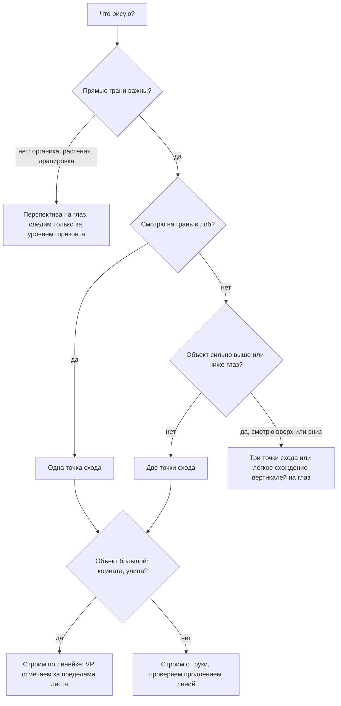

# Перспектива: горизонт, точки схода, коробки

## Простыми словами

Всё сводится к одному факту: **предмет, удалённый вдвое, виден под вдвое меньшим углом**.
Ваш глаз меряет не сантиметры, а углы. Столб высотой 3 метра в десяти метрах виден
под большим углом, чем такой же столб в двадцати. На листе он и должен быть крупнее —
ровно во столько же раз.

Из этого следуют два вывода, и больше в перспективе почти ничего нет:

1. **Параллельные линии, уходящие от вас, на листе сходятся.** Не потому, что они
   искривляются, а потому, что угол между ними сокращается с расстоянием. В бесконечности
   он равен нулю — это и есть **точка схода (vanishing point, VP)**.
2. **Линия горизонта — это уровень ваших глаз.** Всё, что выше глаз, вы видите снизу;
   всё, что ниже, — сверху. Горизонт не «где земля кончается», а «где находятся ваши глаза».

Вторая часть модуля — практическая: **коробки от руки**. Кажется, что рисовать
куб — это скучно. Но куб — это три направления пространства сразу; научившись ставить
куб под любым углом, вы получаете каркас почти для любого предмета.

## Зачем это нужно

Без перспективы предметы «плавают»: кружка стоит не на столе, а перед ним; дом
выглядит как фасад из картона; комната похожа на плоскую театральную кулису. При этом
пропорции могут быть измерены идеально — и всё равно не работать, потому что измерение
даёт отношения на плоскости, а перспектива объясняет, как эти отношения меняются в глубину.

Плюс перспектива нужна для рисования **из головы**. С натуры вы можете всё измерить.
Придумывая сцену, измерять нечего — остаётся построение.

## Как делать (пошагово)

### 1. Линия горизонта (HL) — это уровень глаз

```text
   стоите:                        сидите:
    - - - - - - - - - - HL         [] [] []
       [][][][][]                 - - - - - - - - HL
       дома ниже глаз                верх шкафа выше глаз
       -> видны крыши                -> видно его дно снизу
```

Практические следствия:

- **Всё, что выше HL, вы видите снизу**: видно нижнюю грань, дно, потолок навеса.
- **Всё, что ниже HL, вы видите сверху**: видна верхняя грань, стол, крышка коробки.
- **Всё, что пересекает HL**, показывает и то и другое: у стоящей на полу коробки
  выше глаз видно дно, у стоящей ниже — крышку.
- Эллипс на уровне HL вырождается в **линию**. Ободок кружки, стоящей ровно на уровне
  глаз, — прямая черта.
- Как найти HL на фото: найдите объект, у которого не видно ни верха, ни низа —
  он и стоит на горизонте. Или: если фотограф стоял, HL примерно на высоте 1,6 м на
  стенах и людях (глаза стоящих людей на фото окажутся примерно на одной линии).
- HL **всегда горизонтальна** и всегда одна на рисунок. Если вы наклонили голову вбок,
  наклоняется всё изображение целиком, а не горизонт относительно него.

### 2. Точка схода (VP)

Точка схода — это место на картине, куда сходятся изображения линий, параллельных
в реальности. Правила:

- **У каждого набора параллельных линий своя точка схода.** У пола и потолка комнаты
  она общая, у наклонной крышки рояля — своя.
- **Горизонтальные линии сходятся на линии горизонта.** Все до одной.
- **Вертикали в 1- и 2-точечной перспективе остаются вертикальными** и не сходятся.
- Линии, **параллельные плоскости листа**, не сходятся вообще — они остаются
  параллельными на листе.

### 3. Одноточечная перспектива

Условие: одна из граней объекта **параллельна плоскости листа**, вы смотрите на неё
«в лоб».

```text
     +-------------------------------------------+
     |  \                                     /  |
     |    \____________________________ ___ /    |
     |     |                          |     |    |
   --|-----|-------------- VP --------|-----|----|--  HL
     |     |__________________________|     |    |
     |    /                            \    |    |
     |  /                                \  |    |
     +-------------------------------------------+
        коридор: пол, потолок, обе стены сходятся в одну VP
        вертикали вертикальны, горизонтали параллельны краю листа
```

Порядок построения коридора:

1. Проведите **HL** — горизонтальную линию на высоте глаз (примерно 1/3 от низа листа,
   если вы стоите).
2. Поставьте **VP** на HL. Не в центре: чуть сбоку интереснее и естественнее.
3. Нарисуйте **дальнюю стену** — прямоугольник со сторонами, параллельными краям листа.
4. Из четырёх углов дальней стены проведите линии **через VP наружу**, к краям листа.
   Это пол, потолок и обе боковые стены.
5. Двери, окна, плинтусы: их горизонтальные линии тоже идут в VP, вертикали остаются
   вертикальными.
6. Всё, что параллельно дальней стене (дверные проёмы по фронту), рисуется прямыми
   параллельными линиями.

Тот же принцип — железная дорога (рельсы в VP, шпалы горизонтальны), ряд домов вдоль
улицы, вид вдоль стола.

### 4. Двухточечная перспектива

Условие: вы смотрите на **угол** объекта, ни одна вертикальная грань не параллельна листу.

```text
   VPL                                                     VPR
    *_______                                        _______*
    |       ----____              _____----------          |
  --|--------------- ---____ ____---- ----------------------|--  HL
    |                       |   |                           |
    |               ____----|   |----____                   |
    |          ____---      |   |       ---____             |
                            |___|
              коробка на столе: две системы горизонталей,
              вертикали остаются вертикальными
```

Порядок:

1. **HL** и две точки схода на ней — **VPL** и **VPR**. Разнесите их **широко**,
   лучше за пределы листа (положите лист на большую поверхность и отметьте точки на
   столе или на скотче).
2. Проведите **вертикаль** — ближайшее к вам ребро коробки. Задайте его высоту.
3. Из верхней и нижней точек ребра проведите по две линии: в VPL и в VPR. Получились
   четыре направляющие.
4. Отметьте на левой паре, где кончается коробка, — проведите там **вертикаль**. То же
   справа.
5. Верхнюю грань замкните: из верхних точек боковых рёбер — линии в противоположные
   точки схода. Они пересекутся в дальнем верхнем углу.
6. **Draw-through**: постройте и невидимое дальнее нижнее ребро тем же способом. Так
   вы проверите, что коробка замкнута.

### 5. Трёхточечная перспектива

Условие: вы смотрите **вверх или вниз** на высокий объект. Тогда вертикали тоже
перестают быть параллельными и сходятся в третью точку.

```text
   смотрим вверх на башню          смотрим вниз с крыши
   VPL              VPR                  VPL      VPR
     \              /               ------*--------*-----  HL
   ---*------------*---  HL                \      /
       \  |    |  /                        |      |
        \ |    | /                         |      |
         \|    |/                          \      /
          \    /                            \    /
           \  /                              \  /
            \/  VP3 (высоко над листом)       \/ VP3 (глубоко внизу)
```

- Смотрим **вверх** — третья точка **над** листом, вертикали сходятся кверху, объект
  «сужается» вверх.
- Смотрим **вниз** — третья точка **под** листом, объект сужается книзу.
- Чем ближе третья точка, тем сильнее эффект. Слишком близко — карикатурное искажение.

Практически трёхточечную перспективу строят редко: чаще делают **лёгкое схождение
вертикалей на глаз**, и этого достаточно.

### 6. Конус зрения и искажения

Человек чётко видит примерно **60° по горизонтали**. Всё, что попадает в рисунок за
пределами этого конуса, начинает выглядеть растянутым — это не ошибка построения,
это честная проекция широкого угла на плоскость.

```text
      план сверху:
                          лист (плоскость картины)
        ______________________________________________
             \                             /
              \        60 градусов        /
               \                         /
                \                       /
                 \                     /
                  \        O          /     O = глаз
                   ------------------
        всё, что попало в конус, выглядит нормально;
        углы за его пределами растягиваются
```

Практические правила:

- **Точки схода разносите широко.** Близко стоящие VP = очень широкий угол зрения =
  «рыбий глаз». Типичная ошибка новичка: обе VP на листе A4 в 20 см друг от друга.
- Рабочий ориентир: расстояние между VPL и VPR **не меньше двух ширин листа**.
- Держите объекты в средней части кадра. Куб у самого края при широком угле
  неизбежно будет казаться скошенным.

### 7. Коробки от руки

Это главная практика модуля. Идея взята из Drawabox, Lesson 2 («250 box challenge»):
нарисовать много коробок в произвольных ракурсах, каждый раз проверяя себя.

Как рисовать одну коробку без разметки точек схода:

1. Нарисуйте **Y** — три линии из одной точки, углы между ними примерно по 120°.
   Это ближайший угол коробки и три направления рёбер.
2. От каждого конца Y проведите ещё по два ребра, **чуть сходящихся** к тем же
   направлениям, что и исходные.
3. Замкните дальний угол. Постройте его **draw-through**, как у прозрачной коробки.
4. Проверьте: продлите каждую из трёх групп по четыре ребра длинными лёгкими линиями.
   Каждая четвёрка должна собраться в узкий пучок.

```text
     проверка продлением:
                    ....... сходятся кучно = ХОРОШО
        ___________/
       /___________\ ....... расходятся веером = грани параллельны,
       \                     схождения не хватает
        \__________ ....... пересекаются крест-накрест = перебор,
                             линии сошлись раньше времени
```

Главное правило коробки: **рёбра одного направления сходятся, а не расходятся**.
Расхождение — самая заметная и самая частая ошибка; глаз читает такую коробку
как «вывернутую наизнанку».

Норма практики: **10–15 коробок в день**, каждая с проверкой продлением. Через 250
штук рука начинает ставить схождение сама.

### 8. Вращение коробок и коробки в коробках

- **Вращение.** Нарисуйте одну коробку, затем рядом такую же, но повёрнутую на 10–15°.
  Затем ещё и ещё, серией из 6–8 штук. Точки схода при этом «переезжают» по горизонту:
  чем сильнее повёрнута коробка, тем ближе одна из VP.
- **Коробки в коробках.** Внутри построенной коробки постройте меньшую, у которой
  **те же точки схода**. Так тренируется главное умение сцены: несколько объектов,
  стоящих параллельно друг другу, обязаны делить точки схода.
- **Коробка на коробке.** Поставьте вторую сверху первой, повторно используя рёбра
  верхней грани. Это уже почти архитектура.

### 9. Когда перспектива может быть приблизительной

Не всякий рисунок строится по точкам. Ориентир:



Практически: **скетч на улице** — горизонт и направление схождения на глаз;
**интерьер или техника** — построение с отмеченными точками; **органика** — только
горизонт и общее чувство глубины.

## Чек-лист самопроверки

**Сцена:**
- [ ] На рисунке ровно одна линия горизонта, и она горизонтальна.
- [ ] Все объекты, стоящие на полу параллельно друг другу, делят точки схода.
- [ ] Горизонтальные линии сходятся на HL, а не выше и не ниже.
- [ ] Вертикали вертикальны (если это не трёхточечная перспектива).

**Коробка:**
- [ ] Рёбра каждого из трёх направлений при продлении собираются в пучок, а не
      расходятся.
- [ ] Дальний угол построен draw-through и коробка замкнута.
- [ ] Ни одна пара рёбер, которая должна сходиться, не осталась параллельной.
- [ ] Коробка не выглядит «вывернутой» — при взгляде издалека читается один объём.

**Конус зрения:**
- [ ] Точки схода разнесены минимум на две ширины листа.
- [ ] Объекты не прижаты к самому краю кадра.

## Типичные ошибки

- **Параллельные грани, которые должны сходиться.** Коробка выглядит плоской или
  вывернутой. Проверка продлением ловит это за секунды.
- **Точки схода слишком близко.** Получается «рыбий глаз» и растянутые углы. Разносите VP.
- **Две линии горизонта.** Возникает, когда часть сцены рисуется «как удобно». Горизонт
  на рисунке всегда один.
- **Горизонтали, сходящиеся не на HL.** Признак того, что точка схода поставлена
  на глаз в произвольном месте.
- **Наклонённая линия горизонта.** HL всегда горизонтальна относительно листа.
- **Каждому объекту своя VP.** Если предметы стоят параллельно, точки схода общие.
  Разные VP допустимы только для по-разному повёрнутых объектов, но все они лежат
  на одной HL.
- **Вертикали, сходящиеся без нужды.** Трёхточечная перспектива нужна только когда вы
  реально смотрите вверх или вниз.
- **Построение без draw-through.** Дальний угол «подгоняется на глаз» и коробка
  оказывается непрямоугольной.
- **Слишком много точек и линий.** Лист превращается в паутину. Стройте лёгким HB
  и только ключевые направляющие.
- **Забытый горизонт при рисовании с натуры.** Достаточно один раз определить уровень
  глаз и провести лёгкую линию — половина ошибок отпадает.

## Словарь терминов

- **Линия горизонта (horizon line, HL)** — уровень глаз наблюдателя; всё выше видно
  снизу, всё ниже — сверху.
- **Точка схода (vanishing point, VP)** — точка, в которую сходятся изображения линий,
  параллельных в реальности.
- **Одноточечная перспектива** — одна грань объекта параллельна плоскости листа.
- **Двухточечная перспектива** — взгляд на угол объекта, две системы горизонталей.
- **Трёхточечная перспектива** — взгляд вверх или вниз, вертикали тоже сходятся.
- **Конус зрения (cone of vision)** — примерно 60° чёткого зрения; за его пределами
  проекция растягивается.
- **Плоскость картины (picture plane)** — воображаемое стекло между глазом и сценой,
  на котором «отпечатывается» изображение.
- **Draw-through** — построение невидимых граней как у прозрачного объекта.
- **Проверка продлением (extending lines)** — продление рёбер коробки для контроля
  схождения.

## См. также

- **Drawabox, Lesson 1 (боксы в конце) и Lesson 2 — «250 box challenge»** — практика
  коробок от руки и метод проверки продлением линий. [drawabox.com](https://drawabox.com)
- **Scott Robertson & Thomas Bertling, «How to Draw»** — систематическая перспектива:
  конус зрения, точки схода, деление и умножение, построение сложных объектов.
- **Marshall Vandruff, «Perspective Drawing» lectures** (YouTube) — подробный разбор
  1/2/3-точечной перспективы и искажений; смотреть первые лекции параллельно с этим модулем.
- **Andrew Loomis, «Successful Drawing»** — главы о перспективе и о том, как она
  работает в реальной композиции.
- Продолжение теории:
  [`theory-2-ellipses-and-cylinders.md`](./theory-2-ellipses-and-cylinders.md).
- Предыдущий модуль:
  [`03-measuring-and-proportions`](../03-measuring-and-proportions/index.md).
- Следующий модуль:
  [`05-form-light-and-shadow`](../05-form-light-and-shadow/index.md).
- Полезно сохранить в `misc/` пару фотографий улицы и комнаты с прочерченным
  горизонтом — на них удобно проверять себя.
