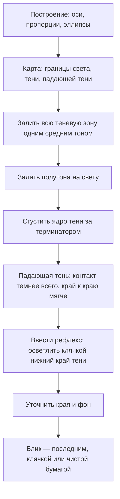

# Штриховка и рендер: как положить тон на бумагу

## Простыми словами

Предыдущий файл отвечал на вопрос «какой тон где». Этот отвечает на вопрос «как рукой
сделать этот тон». Между ними пропасть, в которую проваливается большинство новичков:
понимаю, где темнее, но получается грязь.

Хорошая новость: тон делается небольшим набором механических приёмов, и все они
тренируются как гаммы. Плохая новость: их действительно нужно тренировать — «понять
штриховку» невозможно, ею можно только начать владеть. Пятнадцать минут в день две
недели, и рука начинает класть ровный тон сама.

**Рендер (rendering)** — это доведение построенного рисунка до объёма тоном. Он всегда
идёт в одном и том же порядке: от больших пятен к маленьким, от общего к частному, от
средних тонов к крайним. Блик — последнее, что вы делаете, а не первое.

## Зачем это нужно

Тон, положенный техникой, читается как поверхность: аккуратная штриховка по форме сама
подсказывает, что предмет круглый. Тон, положенный «как получится», читается как грязь
на бумаге, даже если светлоты угаданы верно.

Ещё одна причина — контроль. Штрих можно ослабить, усилить, стереть клячкой, положить
поверх второй слой. Растёртая пальцем каша не поддаётся ничему: она не светлеет, не
темнеет предсказуемо и оставляет жирные пятна.

## Как делать (пошагово)

### Техника 0. Чем и как держать

Прежде чем говорить о штрихах, три решения, которые влияют на тон сильнее, чем усердие.

**Карандаши.** Для тона нужны минимум три: **HB** — светлые ступени 1–3 и построение,
**2B** — рабочая середина 3–6, **4B** — тёмные 6–9 и контактные тени. Одним карандашом
весь диапазон не взять: HB в тёмном месте начнёт блестеть и продавит бумагу задолго до
того, как станет действительно тёмным, а 4B в светлом месте не даст положить ступень 2
даже при самом слабом нажиме.

**Заточка.** Для тона грифель точат **длинным конусом** (обычным ножом или скальпелем,
а не точилкой): длинный грифель даёт возможность работать как остриём, так и боком.
Тупой, «сработанный» кончик — не брак, а инструмент: им кладут широкий мягкий тон.
Держите два карандаша одной твёрдости — один остро заточенный, второй нарочно
притупленный.

**Хват.** Для линий и деталей — обычный, «письменный». Для тона — **обратный хват
(overhand)**: карандаш лежит в ладони, грифель касается бумаги боком, движение идёт от
плеча. Такой хват физически не позволяет мельчить и продавливать: сила распределяется
по большой площади. Переучиваться неприятно ровно один вечер, потом становится удобнее.

**Бумага.** Гладкая офисная бумага даёт чистые ровные тона и плохо держит много слоёв.
Шершавая (для эскизов, «фактурная») берёт больше графита и даёт зерно — на ней проще
получить глубокий чёрный и фактуру, но труднее — идеально ровное поле. Для учёбы
достаточно офисной; шершавую попробуйте, когда дойдёте до фактур в модуле 06.

**Лист под рукой.** Положите чистый лист бумаги под кисть рабочей руки: он защищает
рисунок от смазывания. Это самая простая привычка, экономящая работы.

### Техника 1. Простая штриховка (hatching)

Параллельные штрихи в одном направлении. База всего.

- Движение — от локтя/плеча, как в [`02-lines-and-basic-shapes`](../02-lines-and-basic-shapes/theory.md);
  кисть не «пишет», а ведёт.
- Штрих ставится и **отрывается** — не туда-обратно зигзагом: зигзаг даёт тёмные
  развороты на концах.
- Длина 2–4 см, промежутки одинаковые, наклон одинаковый.
- Плотность тона регулируется расстоянием между штрихами и нажимом.

Упражнение: квадрат 5 × 5 см, заполнить ровным тоном ступени 3. Двадцать квадратов —
и рука понимает.

### Техника 2. Перекрёстная штриховка (cross-hatching)

Второй слой штрихов под углом 30–60° к первому (не под 90°: прямая сетка выглядит как
клетчатая ткань). Каждый слой добавляет ступень тона.

Главный плюс: тон набирается **слоями, а не давлением**. Пять лёгких слоёв дают
глубокий бархатный чёрный без блеска графита; один сильный нажим даёт блестящую серую
вмятину.

### Техника 3. Штриховка по форме (contour hatching)

Штрих идёт **вдоль поверхности**, повторяя её кривизну: по шару — дугами, как параллели
глобуса; по цилиндру — вертикально вдоль оси или дугами поперёк; по кубу — вдоль граней,
у каждой грани своё направление.

```text
  шар: дуги по «широтам»      цилиндр: вдоль оси       куб: по граням
       ,-''''''-.                  |||||||               +--------+
     ,'  ~~~~~~  `.                |||||||              /////////|
    /  ~~~~~~~~~~  \               |||||||             /////////||
   |  ~~~~~~~~~~~~  |              |||||||            +--------+ |
    \  ~~~~~~~~~~  /               |||||||            |========|/
     `. ~~~~~~~~ ,'                |||||||            |========|
       `-......-'                  |||||||            +--------+
```

Это самый выразительный способ: направление штриха само сообщает форму. Loomis и
классическая школа рисуют почти исключительно так.

### Техника 4. Кружками (scumbling, «шерстяное» пятно)

Мелкие спутанные петельки, наложенные плотно. Даёт мягкий тон без направления — хорош
для органики: земля, листва, шерсть, фон, размытый задний план. Опасность: легко
получить «вату» без формы, поэтому не используйте её для основных объёмов, пока не
освоите три предыдущие.

### Техника 5. Растушёвка (blending)

Растушёвка **растушёвкой-палочкой (stump)**, кусочком бумаги или ватной палочкой —
допустима и полезна: она сглаживает полутон на шаре и делает мягкие переходы.

Пальцем — **не растушёвывать**. Кожа оставляет жир, бумага перестаёт брать графит, и
пятно уже не исправить. Единственное исключение — большой фоновый тон, который вам не
жалко.

Когда растушёвка вредна:

- вместо штриховки, «чтобы быстрее» — получается серая каша без структуры;
- на всей работе целиком — рисунок становится фотографически-скользким и мёртвым;
- в тёмных местах — растёртый графит светлеет и мутнеет.

Рабочий рецепт: штриховка задаёт тон и структуру, растушёвка — только в полутоне и
только чуть-чуть, потом сверху ещё один слой штриха, чтобы вернуть фактуру.

### Техника 6. Градиент нажимом

Плавный переход от белого к чёрному без ступенек. Полоска 3 × 15 см, ведём штрих
слева направо, постепенно увеличивая давление и уменьшая расстояние между штрихами.

Секрет ровного градиента: **много лёгких проходов**, каждый начинается чуть правее
предыдущего. Не один проход с плавным нажимом (так не выйдет — рука дискретна), а
десять слоёв, каждый следующий короче.

### Порядок рендера

Один и тот же для любого предмета. Заучите его как алгоритм.



Почему именно так: заливая тень одним тоном, вы сразу видите композицию пятен и можете
починить её дёшево. Если начать с деталей, к моменту, когда ошибка станет видна,
на листе уже полчаса работы.

### Рендер четырёх примитивов

**Шар.** Круг (циркуль не нужен, но проверьте на симметрию). Терминатор — эллиптическая
дуга, изогнутая по форме, не проходящая через центр: она смещена в теневую сторону.
Штрих — дугами по «широтам». Полутон плавный, ядро сразу за терминатором, рефлекс
узкой полосой по нижнему краю. Падающая тень — овал, вытянутый от лампы, темнее всего
у точки касания.

**Куб.** Три видимые грани — три разных ровных тона, никаких градиентов внутри грани
(на плоскости свет ровный). Самая светлая — обращённая к лампе, средняя — боковая,
тёмная — та, что от лампы. Штрих у каждой грани своего направления, вдоль её рёбер.
Куб учит главному: **тон меняется на изломе формы, а не плавно**. Падающая тень —
многоугольник, построенный по перспективе.

**Цилиндр.** Тон меняется только по горизонтали (по окружности), по вертикали — почти
постоянен. Штрих ведём вертикально, вдоль оси, тогда трубчатость читается сразу.
Терминатор — вертикальная полоса. Верхний эллипс освещён иначе, чем бок: это отдельная
плоскость. Ошибка: делать градиент и сверху вниз тоже — цилиндр превращается в
подушку.

**Конус.** Полосы тона сходятся к вершине, терминатор — прямая линия от вершины к
основанию (в отличие от шара!). Штрих — вдоль образующих, к вершине. Конус — хорошее
упражнение на аккуратность: штрихи должны сужаться, не превращаясь в клубок у вершины.

### Рендер реальных предметов

**Яйцо или яблоко.** Тот же шар, но: у яблока есть ямка у черенка, а собственный тон
неоднородный (полоски, пятна). Правило: **сначала объём, потом собственный тон**.
Отрендерите яблоко как шар, и только потом добавьте пятна — причём в тени пятна почти
не видны. Черенок ставит масштаб, но рисуется в конце.

**Кружка.** Цилиндр + ручка. Порядок: эллипс верха и низа, стенка, толщина края
(двойной эллипс — почти все забывают), ручка как изогнутый цилиндр, у которого своя
маленькая падающая тень на боку кружки. Внутренность кружки — отдельная история: там
своя тень и свой рефлекс, обычно верхняя внутренняя стенка темнее, чем ждёшь.

**Коробка.** Куб плюс материал: у картона видны рёбра со сколами, у книги — торец
страниц. Не давайте фактуре съесть три ровных тона граней: сначала грани, фактура
поверх, и только на светлой грани — в тени она пропадает.

### Ремонт: что делать, если тон пошёл не туда

Тональный рисунок почти всегда можно спасти, если знать три приёма.

**Слишком светло.** Самая безобидная беда: положите ещё один слой штриха. Именно поэтому
работать нужно снизу вверх по тону — от светлого к тёмному. Добавить всегда легче, чем
убрать.

**Слишком темно.** Клячка, прижатая плашмя и снятая **отрывом**, а не растиранием,
поднимает верхний слой графита. Если участок совсем забит — прижмите чистой клячкой
несколько раз подряд, каждый раз разминая её (грязная клячка размазывает вместо того,
чтобы снимать). Ластик-карандаш годится только для узких мест: он оставляет ясные
границы.

**Мутно и грязно.** Обычно это следствие растирания и разнонаправленных штрихов. Лечение:
осветлить всё пятно клячкой на одну-две ступени и положить сверху один аккуратный слой
штриха в **едином** направлении по форме. Направление возвращает поверхности смысл, и
грязь превращается в тон.

Отдельно — про порядок работы по листу: двигайтесь **от светлых участков к тёмным** и
по возможности сверху вниз, слева направо (для правши). Так рука меньше едет по уже
положенному графиту.

## Чек-лист самопроверки

- Штрих одного направления в пределах одной поверхности, не «каракули».
- Тон набран слоями; нигде нет блеска графита от давления.
- На кубе внутри каждой грани тон ровный, на шаре и цилиндре — плавный.
- Штрих по шару идёт дугами, по цилиндру — вдоль оси, по конусу — к вершине.
- Порядок соблюдён: пятна → полутон → ядро → падающая тень → рефлекс → блик.
- Блик — единственное действительно белое место на предмете, и он поставлен последним.
- Отойдя на два метра и прищурившись, я вижу объём, а не «серое пятно на бумаге».

## Типичные ошибки

- **Зигзаг вместо штриха.** Рука ходит туда-обратно, на концах — тёмные шпильки.
  Лечение: отрывать карандаш после каждого штриха.
- **Штрих поперёк формы.** Диагональная сетка по всей работе, независимо от предмета.
  Лечение: перед каждым участком спросить «куда бы поползла муравей по этой поверхности?»
- **Тон давлением.** Один злой слой, бумага продавлена, исправить нельзя. Лечение:
  4–6 лёгких слоёв.
- **Растушёвка вместо рисования.** Всё пальцем, всё серое. Лечение: палочка, только в
  полутоне, потом штрих сверху.
- **Блик первым.** Обвели белое пятнышко и всю работу его обходили. Лечение: блик
  выбирается клячкой в конце.
- **Одинаковый край везде.** Все границы одинаково резкие. Об этом отдельно —
  [`06-texture-and-edges`](../06-texture-and-edges/theory.md).
- **Забытая толщина края у кружки.** Стенка нарисована как бумажная, предмет выглядит
  жестяным. Лечение: два эллипса на верхнем крае, между ними — узкий тон.

## Словарь терминов

- **Рендер (rendering)** — доведение рисунка тоном до ощущения объёма.
- **Штриховка (hatching)** — параллельные штрихи.
- **Перекрёстная штриховка (cross-hatching)** — наложение слоёв штрихов под углом.
- **Штриховка по форме (contour hatching)** — штрихи вдоль кривизны поверхности.
- **Scumbling** — тон мелкими спутанными петлями.
- **Растушёвка (blending)** — сглаживание тона палочкой (stump) или бумагой.
- **Клячка (kneaded eraser)** — мягкий лепящийся ластик; работает на осветление, не
  на стирание.
- **Градиент (gradation)** — плавный переход тона.

## См. также

- Первая часть: [`theory.md`](./theory.md) — какой тон где должен быть.
- Andrew Loomis, «Successful Drawing» — примеры штриховки по форме на примитивах;
  практически весь рисуночный материал книги построен на contour hatching.
- Drawabox, уроки по контролю линии и texture-разделу drawabox.com — механика штриха
  и почему нельзя «дорисовывать» дрожащими линиями.
- Proko, «Shading Techniques» и «How to Render a Sphere» — короткие видео, показывающие
  движение руки; текст этого не заменит, посмотрите один раз перед уроком 02.
- Bert Dodson, «Keys to Drawing», раздел про тон и штрих — очень спокойный, «человеческий»
  подход к тому, как набирать тон без страха испортить лист.
- Готовые тональные шкалы и фото шара под лампой удобно распечатать и держать в
  `misc/light/`.
