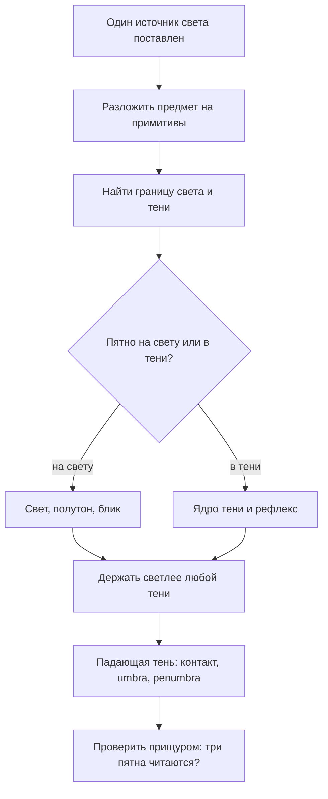

# Форма, свет и тень — анатомия света и тон

## Простыми словами

Пока вы рисуете только контур, вы рисуете **форму на плоскости** (shape) — силуэт,
дырку в бумаге. Как только внутри силуэта появляется правильно распределённый тон,
он превращается в **объёмную форму** (form) — то, что можно обойти вокруг.

Разница между кругом и шаром на бумаге — не в линии. Линия одна и та же. Разница в
том, что на шаре есть градиент: одна сторона светлая, другая тёмная, между ними —
плавный переход, а рядом на столе лежит падающая тень. Мозг зрителя читает этот набор
пятен как «трёхмерный предмет под лампой» автоматически, без вашего участия. Ваша
задача — не «нарисовать красиво», а **дать мозгу зрителя правильные подсказки**.

И ещё одна упрощающая мысль. Мир состоит из бесконечного числа форм, но свет ведёт
себя предсказуемо всего на четырёх:

- **шар** (sphere) — яблоко, голова, плечо, ягода, лампочка;
- **куб / коробка** (box) — дом, книга, чемодан, таз, грудная клетка;
- **цилиндр** (cylinder) — кружка, рука, ствол дерева, банка, шея;
- **конус** (cone) — абажур, ёлка, юбка, кончик карандаша, нос как клин.

Выучив свет на этих четырёх, вы получаете отмычку почти ко всему остальному: сложный
предмет — это набор примитивов, склеенных вместе. Кружка = цилиндр + изогнутый цилиндр
(ручка). Яблоко = шар с вмятиной. Груша = шар + конус. Это тот же принцип конструкции,
что и в [`04-perspective`](../04-perspective/theory.md), только теперь конструкция
нужна не ради формы, а ради света.

## Зачем это нужно

**Чтобы рисовать из головы.** Скопировать пятна с фотографии можно и без теории — но
только с этой конкретной фотографии. Понимая, как свет ложится на шар, вы поставите
тень на любом шаре, при любом положении лампы, без референса.

**Чтобы находить свою ошибку.** «Что-то не то, но не пойму что» — самая частая жалоба
новичка на тональном рисунке. Когда у зон есть имена (терминатор, рефлекс, контактная
тень), диагноз становится конкретным: «нет терминатора», «рефлекс светлее полутона»,
«падающая тень оторвалась от предмета».

**Чтобы экономить силы.** Правильный порядок действий (сначала большие пятна, потом
детали) отнимает в разы меньше времени, чем «нарисую-ка я всё сразу аккуратно».

## Как делать (пошагово)

### Шаг 1. Один источник света. Всегда, пока учитесь

Поставьте настольную лампу сбоку и чуть сверху от предмета, примерно под 45°, и
выключите верхний свет. Одна лампа = одна система теней = задача решаемая. Две лампы
дают два блика, два терминатора и две падающие тени, которые накладываются друг на
друга — это уровень «через полгода».

Дневной свет из окна тоже годится, если окно одно и день не слишком пасмурный:
пасмурное небо — это огромный рассеянный источник, тени становятся почти неразличимы,
и учиться на нём нечему.

### Шаг 2. Разложить предмет на примитивы и построить каркас

Сначала карандашом HB очень легко: оси, пропорции, эллипсы донышек, углы куба. Пока
никакого тона. Если каркас кривой, любой безупречный тон ляжет на кривую форму и
рисунок останется неверным. Проверка каркаса — по методике модуля
[`03-measuring-and-proportions`](../03-measuring-and-proportions/theory.md).

### Шаг 3. Разделить на две территории: свет и тень

Это главный шаг, и его почти все пропускают. **До всяких полутонов** обведите очень
лёгкой линией границу между освещённой и теневой частью предмета и контур падающей
тени. Получается карта из двух областей. Прищурьтесь: если вы видите на предмете
пятно, которое непонятно куда отнести — оно принадлежит свету (в тени таких сомнений
не бывает, тень читается как единое тёмное пятно).

Правило, которое спасает рисунок: **самый светлый тон в тени всегда темнее самого
тёмного тона на свету.** Две территории не смешиваются. Как только вы позволили
рефлексу в тени стать светлее полутона на свету, форма разваливается.

### Шаг 4. Анатомия света на шаре

Вот полный набор зон. Ниже — схема: слева свет, справа тень, под шаром падающая тень.

```text
   лампа ↘
            ,--------------.
         ,-'  (*)  ░░░      `-.        (*) 1 блик        highlight
       ,'   ░░░░░░░░░ ▒▒▒       `.         2 свет        light
      /   ░░░░░░░░ ▒▒▒▒▒ ▓▓▓      \        3 полутон     halftone
     |  ░░░░░░░ ▒▒▒▒▒▒ ▓▓▓ ███ ▓▓  |       4 терминатор  terminator
     |  ░░░░░░ ▒▒▒▒▒▒ ▓▓▓▓ ███ ▓▓▓ |       5 ядро тени   core shadow
      \  ░░░░░ ▒▒▒▒▒ ▓▓▓▓ ███ ▓▓▓ /        6 рефлекс     reflected light
       `.  ░░░ ▒▒▒▒ ▓▓▓ ███ ▓▓▓ ,'
         `-.__░_▒▒_▓▓_███_▓▓__,-'
        ███████▓▓▓▓▒▒▒▒░░░
        └ контактная  └ полутень (penumbra)
          тень          ← падающая тень (cast shadow)
```

Разберём по порядку.

1. **Блик (highlight)** — отражение самой лампы в поверхности. Не «самое светлое место
   формы», а именно отражение: на матовом яблоке он расплывчатый, на глянцевом чайнике
   — маленький и резкий, на бархате его нет вовсе. Ставится последним.
2. **Свет (light)** — участок, повёрнутый прямо к лампе. Здесь бумага почти чистая.
3. **Полутон (halftone)** — поверхность отворачивается от света, тон постепенно темнеет.
   Это самая «объёмная» зона: именно плавность полутона делает форму круглой.
4. **Терминатор**, он же граница света и тени (terminator) — линия, где поверхность
   уходит от лампы под 90°. Ключевое: **это не линия, а полоса**, и на шаре она
   изогнута по форме, а не прямая.
5. **Сердцевина тени / ядро (core shadow)** — самая тёмная часть собственной тени,
   сразу за терминатором. Тёмная потому, что сюда уже не попадает прямой свет, но ещё
   не долетел отражённый от стола.
6. **Рефлекс (reflected light)** — свет, отражённый от стола и стен, подсвечивает
   нижний край теневой стороны. Он **всегда темнее любого полутона на свету**. Ошибка
   новичка — сделать рефлекс белым; тогда край предмета «светится» и форма ломается.
7. **Падающая тень (cast shadow)** — тень предмета на столе. У неё три свойства:
   - **контактная тень (occlusion shadow)** — там, где предмет касается стола, свет
     не пролезает вообще: это самое тёмное место всего рисунка;
   - **полная тень (umbra)** — плотная часть рядом с предметом, с довольно чётким краем;
   - **полутень (penumbra)** — размытый край дальше от предмета; чем дальше от точки
     касания, тем светлее и мягче.
   Падающая тень **лежит на плоскости стола** и подчиняется перспективе: она вытянута
   от лампы через предмет, и её форма — это силуэт предмета, спроецированный на стол.

Проверьте себя вопросом: «где темнее — в ядре тени или в контактной тени?» Правильный
ответ: в контактной. Собственная тень предмета почти всегда светлее, чем стык предмета
со столом.

### Шаг 5. Тональная шкала

Тон (value) — это светлота пятна независимо от того, чем оно нарисовано. У новичка
типичная беда: весь рисунок живёт в двух-трёх ступенях серого посередине — «мутно».
Лечится шкалой.

**Как сделать шкалу на 5 ступеней (20 минут, один раз, потом висит над столом):**

1. Начертите полоску 3 × 15 см, разделите на 5 клеток.
2. Клетка 1 — чистая бумага, не трогаем. Клетка 5 — максимально тёмная, какую можете
   выжать (4B, несколько слоёв, но без блеска графита).
3. Клетка 3 — ровно посередине по ощущению. Клетки 2 и 4 — посередине между соседями.
4. Отойдите на два метра и прищурьтесь: переходы должны читаться как ровная лестница,
   без «провалов» и «ступенек-близнецов».

```text
 1        2        3        4        5
[      ] [░░░░░░] [▒▒▒▒▒▒] [▓▓▓▓▓▓] [██████]
 белый   светлый  средний  тёмный   чёрный
 бумага    HB       2B       4B      4B×3
```

Позже сделайте шкалу на **9 ступеней** — тем же способом, но с промежуточными
клетками. Девять — рабочий стандарт: этого хватает, чтобы описать любую натуру, и
достаточно мало, чтобы держать в голове. Практический приём: рисуя, называйте про себя
номер ступени («тут четвёрка, тут семёрка») — это переводит рисование из «ощущений» в
измеримые решения, что для аналитического склада ума работает отлично.

Держите шкалу рядом с рисунком и прикладывайте: сравнивать проще, чем помнить.

### Шаг 6. Прищур (squinting)

Прищуриться — значит выбросить детали и увидеть большие тональные пятна. Технически
вы уменьшаете количество света, попадающего в глаз, и слабые различия пропадают.
Прищуривайтесь при каждом сомнении: «это светлее или темнее?» С прищуром ответ виден
за секунду, с широко открытыми глазами вы будете спорить с собой минуту.

Второй способ того же — посмотреть на натуру и на рисунок в отражении телефона с
выключенным экраном или сфотографировать рисунок и обесцветить. Ошибки тона видны
мгновенно.

### Шаг 7. Собственный тон против света

У каждого предмета есть **собственный тон (local value)** — светлота его материала:
белая чашка светлая, чёрная кружка тёмная. И есть свет, который на неё падает. На
рисунке важен результат, а не «как оно называется в жизни».

Ключевое правило: **белая чашка в тени темнее чёрной кружки на свету.** Новичок
рисует то, что знает («чашка же белая!») и оставляет её бумажно-белой в тени — рисунок
рассыпается. Это тот же механизм «рисуем символ вместо увиденного», о котором говорил
модуль 01, только в тоне.

Практический приём: перед рендером решите для каждого предмета, в какой диапазон
ступеней он попадает. Например: белая кружка — ступени 1–5, тёмная бутылка — 4–9. Тогда
светлая сторона бутылки не станет светлее теневой стороны кружки.

## Порядок разбора освещения



## Чек-лист самопроверки

- Источник света один, и я могу показать пальцем, где он.
- На предмете есть все зоны: свет, полутон, терминатор, ядро, рефлекс.
- Терминатор — полоса, повторяющая форму, а не проволока по контуру.
- Рефлекс темнее самого тёмного полутона на свету.
- Падающая тень начинается ровно от точки касания, и там самое тёмное место рисунка.
- Прищурившись, я вижу три отчётливых пятна: свет, тень предмета, падающая тень.
- Тон нижней и верхней ступени задействован: есть почти белое и почти чёрное.

## Типичные ошибки

- **Тень «обводкой».** Тёмная полоска по краю силуэта вместо тени по форме. Форма
  становится плоской наклейкой. Лечение: терминатор ищем внутри формы, а не на контуре.
- **Мутный рисунок.** Всё в ступенях 3–5, нет ни белого, ни чёрного. Лечение: сначала
  поставьте самое тёмное место (контактную тень), потом всё остальное относительно него.
- **Светящийся рефлекс.** Рефлекс сделан почти белым, край предмета «горит». Лечение:
  правило двух территорий.
- **Плавающая падающая тень.** Тень оторвана от предмета или лежит не в ту сторону.
  Лечение: линия от лампы через край предмета до стола задаёт границу тени.
- **Нет терминатора.** Свет ровно светлеет к тени без сгущения — форма выглядит как
  надувной шарик. Лечение: сознательно затемнить полосу сразу за границей.
- **Блеск графита.** Слишком сильно давили мягким карандашом, тёмное место блестит и
  кажется светлым. Лечение: набирать тон слоями, а не давлением.
- **Всё блестит.** Блик поставлен на каждом предмете и одинаково резкий. Лечение: блик
  зависит от материала; на матовом предмете его может не быть вовсе.

## Словарь терминов

- **Форма-силуэт (shape)** — плоское очертание.
- **Объёмная форма (form)** — трёхмерная форма, переданная тоном.
- **Тон (value)** — светлота пятна по шкале от белого до чёрного.
- **Собственный тон (local value)** — светлота материала предмета.
- **Блик (highlight)** — отражение источника света.
- **Полутон (halftone)** — переход от света к терминатору.
- **Терминатор (terminator)** — граница света и тени на самой форме.
- **Сердцевина тени (core shadow)** — самая тёмная зона собственной тени.
- **Рефлекс (reflected light)** — отражённый свет в теневой части.
- **Падающая тень (cast shadow)** — тень предмета на другой поверхности.
- **Контактная тень (occlusion shadow)** — тень в месте касания, самое тёмное место.
- **Umbra / penumbra** — плотная и размытая части падающей тени.
- **Прищур (squinting)** — приём упрощения натуры до больших пятен.

## См. также

- Продолжение: [`theory-2-shading-and-rendering.md`](./theory-2-shading-and-rendering.md)
  — как физически положить этот тон на бумагу.
- Andrew Loomis, «Successful Drawing» — главы о свете и о трёх измерениях: разбор того,
  как форма и свет работают вместе.
- James Gurney, «Color and Light», главы «Sources of Light» и «Light and Form» — самая
  внятная логика света; книга про краски, но разделы о свете полностью применимы к
  графиту.
- Proko, серия «How to Shade» на proko.com / YouTube — визуальный разбор зон света на
  шаре; смотреть перед уроком 02.
- Scott Robertson, «How to Render» — глава про тень от точечного источника; технично,
  но именно там видно, как строится форма падающей тени.
- Реперные картинки (шар под лампой, тональная шкала) удобно сохранить в
  `misc/light/` и ссылаться на них из своих заметок.
