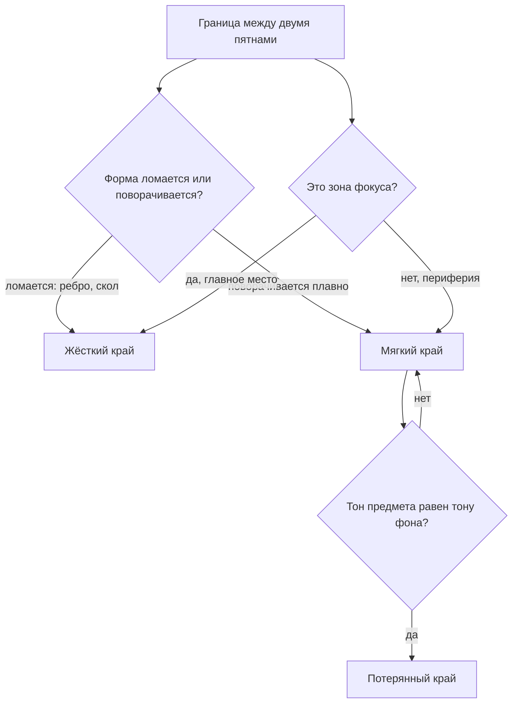

# Текстуры и края

## Простыми словами

Возьмите любой рисунок, который вам нравится, и любой свой учебный. Скорее всего, тон
у вас уже не хуже. Разница будет в **краях**.

**Край (edge)** — это то, как одно тональное пятно переходит в другое: резко, мягко или
никак. У новичка все края одинаковые, потому что он рисует контуры: обвёл предмет —
получил жёсткую границу по всему периметру. В реальности глаз видит совсем другое:
одни границы режут, другие тают, третьи вообще исчезают, и предмет частью растворяется
в фоне.

Управление краями — самый дешёвый способ сделать рисунок «взрослым». Оно не требует ни
новых материалов, ни анатомии, ни лет практики: нужно просто решать для каждой границы,
какой она должна быть, вместо того чтобы обводить всё одинаково.

Вторая тема модуля — **текстура (texture)**: кора, ржавчина, ткань, волосы. И здесь
главный секрет разочаровывающе прост: текстура — это мелкий рельеф, а рельеф освещается
по тем же законам, что и большая форма. Значит, текстура **подчинена свету**, и рисовать
её нужно после объёма и не везде.

## Зачем это нужно

**Края создают глубину.** Резкий край выходит вперёд, мягкий уходит назад. Одним только
контролем краёв можно построить пространство даже без перспективы.

**Края направляют взгляд.** Глаз цепляется за максимальный контраст и максимальную
резкость. Где вы сделали край жёстким и контраст сильным — туда зритель и смотрит. Это
ваш руль.

**Текстура без формы разрушает рисунок.** Начинающий, нарисовав кору по всему стволу
равномерно, получает плоскую доску в узорчик. Текстура, положенная по правилам, наоборот,
усиливает объём.

**Экономия сил.** Проработать всё одинаково подробно невозможно и не нужно: рисунок с
одним проработанным местом и намёками вокруг читается лучше и делается втрое быстрее.

## Как делать (пошагово)

### Три типа края

```text
   жёсткий (hard)        мягкий (soft)        потерянный (lost)
   ████│                 ████▓▓▒▒░░           ████▒▒░░
       │                                              ░░░░  ← фон того же тона
   резкая граница        плавный переход      границы нет вообще
   скол, стекло,         круглая форма,       тень предмета сливается
   контакт с опорой      расфокус, движение   с тенью фона
```

1. **Жёсткий край (hard edge)** — граница читается как линия. Где встречается:
   - излом формы: ребро куба, край стола, скол камня;
   - контакт предмета с опорой;
   - плотный, резкий предмет на контрастном фоне (силуэт крыши на небе);
   - край падающей тени рядом с точкой касания;
   - блестящие поверхности: стекло, хром, вода.

2. **Мягкий край (soft edge)** — переход растянут. Где встречается:
   - плавно поворачивающаяся форма: щека, яблоко, плечо;
   - терминатор на круглом предмете (он **всегда** мягче, чем на гранёном);
   - дальний край падающей тени (penumbra);
   - всё, что вне фокуса: задний план, передний план близко к глазу;
   - движение и пушистые материалы: волосы, мех, дым.

3. **Потерянный край (lost edge)** — границы нет: тон предмета совпал с тоном фона, и
   форма продолжается «в уме» зрителя. Где встречается:
   - тёмная сторона предмета на тёмном фоне;
   - светлый край на светлом фоне;
   - там, где вы сознательно хотите увести часть предмета из внимания.

Потерянный край пугает новичка: кажется, что рисунок «не дорисован». На самом деле он
работает лучше всего: мозг зрителя достраивает форму сам и получает от этого
удовольствие. Правило: **на одном рисунке должен быть хотя бы один потерянный край**.

### Как решать, какой край здесь



Практический приём: закончив тональную стадию, пройдитесь по рисунку и **сознательно
испортите** половину своих аккуратных границ — размягчите их клячкой или пальцем по
чистой салфетке. Оставьте резкими только те 3–4, которые действительно нужны. Эффект
почти всегда впечатляет.

### Чем физически делаются края

Тип края — это не только решение, но и конкретное движение руки. Четыре способа:

- **Жёсткий** — штрих плотно доводится до границы и обрывается. Если нужна совсем острая
  граница, положите на рисунок ровный край листа бумаги как маску и штрихуйте до него:
  получится идеальный обрыв тона без линии.
- **Мягкий** — три варианта: (1) штриховать «на просвет», постепенно увеличивая
  промежутки между штрихами к границе; (2) прокатить по границе клячку, скатанную в
  валик; (3) чуть-чуть растушевать палочкой и вернуть фактуру лёгким штрихом сверху.
- **Потерянный** — не «стереть контур», а **дотемнить фон** до тона предмета. Разница
  принципиальная: стирание оставляет светлую щель, дотемнение действительно смыкает
  пятна.
- **Обрыв контурной линии** — самый дешёвый приём: рисуя контур, местами не доводите
  линию, оставляя разрывы. Зритель их не заметит, а рисунок сразу станет живым.

Полезно потренировать все четыре подряд на одной полоске: тогда в работе вы будете
выбирать способ, а не мучиться, как реализовать задуманное.

### Текстура следует форме и свету

Три правила, из которых выводится всё остальное:

1. **Текстура искажается по форме.** Полоски на кружке — не прямые линии, а дуги,
   повторяющие цилиндр. Кора не идёт вертикальными прямыми, она огибает ствол. Клетка
   на ткани изгибается по складкам. Если текстура не искажается — предмет плоский.

2. **Текстура живёт в полутоне.** Это ключевое правило модуля, запомните формулировку:
   **текстура сильнее всего видна в полутоне, слабеет на ярком свету и почти исчезает в
   тени.** На свету всё пересвечено, детали смываются; в тени всё погружено в темноту,
   и мелкий рельеф не читается. Полутон — единственная зона, где рельеф даёт собственные
   микротени.

3. **Текстура состоит из микро-света и микро-тени.** Каждая бороздка коры — это
   маленький цилиндр со своим бликом и тенью, и все эти микро-тени падают **в ту же
   сторону**, что и большая тень предмета.

```text
  неправильно: текстура ровно везде   правильно: текстура в полутоне
  ▒▒▒▒▒▒▒▒▒▒▒▒▒▒▒▒▒▒▒▒▒               ░░░░ ░ ▒≈≈≈≈▒ ▓▓▓▓ ███
  ≈≈≈≈≈≈≈≈≈≈≈≈≈≈≈≈≈≈≈≈≈               свет   полутон  тень
  ≈≈≈≈≈≈≈≈≈≈≈≈≈≈≈≈≈≈≈≈≈               (гладко) (фактура) (пусто)
```

### Рецепты материалов

**Дерево (wood grain).** Слои: (1) объём цилиндра или доски тоном; (2) крупные линии
волокон — длинные, слегка волнистые, идущие вдоль формы, **неравномерно** сгруппированные
(два рядом, потом промежуток); (3) сучки — овалы, вокруг которых волокна обтекают, как
вода вокруг камня; (4) местами тонкая тёмная линия трещины. На свету волокна почти не
рисуем. Ошибка: одинаковый частокол параллельных полосок по всей доске.

**Шлифованный металл (brushed metal).** Тон ровный, поверх — очень мелкая продольная
штриховка в одном направлении, плюс вытянутый смазанный блик вдоль этого направления.
Контраст умеренный. Всё, металл готов.

**Хром / полированный металл (chrome).** Хром не имеет собственного тона — он показывает
**отражения**. Рецепт: (1) очень тёмное сверху (отражение потолка/стен), очень светлое
снизу (отражение стола) — или наоборот, но с резкой границей между ними; (2) горизонт
отражения — жёсткая изогнутая линия примерно на уровне глаз; (3) сильно вытянутые,
искажённые пятна отражений; (4) блик — максимально резкий и белый. Главный признак
хрома: **соседство почти чёрного и почти белого через жёсткий край**. Плавные градиенты
убивают эффект.

**Стекло (glass).** Стекло — это «то, что за ним» + собственные блики + тёмные края.
Рецепт: (1) сначала нарисуйте фон и то, что видно сквозь стакан, слегка искажённым и
смещённым; (2) стенки стакана по бокам — тёмные вертикальные полосы (там свет проходит
через толщу под углом); (3) очень резкие маленькие блики на краях и на кромке; (4) на
столе под стаканом — светлое пятно (каустика), а не сплошная тень: свет проходит
насквозь и собирается. Стекло — единственный материал, где падающая тень **светлее в
середине**. Ошибка: рисовать стакан как серый цилиндр.

**Ткань и складки (fabric folds).** Складка — это цилиндр или конус с изгибом: у неё
есть свет, терминатор, ядро и рефлекс, как у любой формы. Классификация шести типов
(по традиции, идущей от учебников рисунка) простыми словами:

- **труба (pipe)** — прямая мягкая складка, как штанина или занавес;
- **зигзаг (zigzag)** — ломаная гармошка, когда труба сминается на сгибе;
- **спираль (spiral)** — складка, обвивающая цилиндр: рукав на согнутой руке;
- **полузамок (half-lock)** — складка на резком сгибе, где ткань «упирается» сама в
  себя: локоть, колено;
- **ромб (diaper)** — ткань, натянутая между двумя точками опоры, даёт сетку из
  диагональных складок;
- **падающая (drop)** — ткань, свисающая с одной точки, расходится веером книзу.

Не заучивайте названия — заучите принцип: **у складки всегда есть точка натяжения**.
Найдите, откуда ткань тянут, и все складки пойдут от этой точки. Рисуйте не «морщинки»,
а несколько крупных форм: три большие складки убедительнее двадцати мелких.

**Вода и отражения.** Спокойная вода — почти зеркало: отражение идёт **строго вниз** от
предмета, оно чуть темнее и мягче оригинала. Рябь: отражение разбивается на
горизонтальные полоски, чем дальше от зрителя — тем короче и плотнее. Правило:
горизонтальный штрих, никаких вертикалей. Отражение искажается по вертикали, но не
уезжает вбок.

**Листва массами.** Не рисуйте листья. Рисуйте (1) общий силуэт кроны как несколько
крупных «шаров» с собственным светом и тенью; (2) внутри — тёмные дырки просветов; (3)
и только по краю освещённых масс — десяток-другой отдельных листочков как намёк. Это
и есть «подразумеваемая текстура (implied texture)»: зритель, увидев несколько
настоящих листьев, достраивает остальные сам.

### Экономия деталей

Простое рабочее правило: **одна зона фокуса на рисунок**. Там — самый жёсткий край,
самый сильный контраст, самая подробная фактура. По мере удаления от неё: края мягче,
контраст ниже, детали превращаются в намёк. Периферию можно оставить почти пустой.

Инструменты фактуры, которые стоит знать:

- **Фактура бумаги.** Карандаш, положенный плашмя и легко по шершавой бумаге, оставляет
  графит только на бугорках — мгновенно получается фактура камня, штукатурки, асфальта.
- **Клячка (kneaded eraser).** Скатанная в остриё — вытягивает светлые волоски, блики
  на металле, просветы в листве. Прижатая плашмя — снимает верхний слой и смягчает край.
- **Ластик-карандаш** — для узких резких светлых линий (царапина на металле, край стекла).
- **Подложка.** Положите под лист монету или сетку и заштрихуйте сверху — получите
  рельеф (frottage). Приём разовый, но иногда экономит время.

## Чек-лист самопроверки

- Я могу показать на рисунке хотя бы один жёсткий, один мягкий и один потерянный край.
- Самый жёсткий край и самый сильный контраст находятся в зоне фокуса, а не случайно.
- Терминатор на круглых предметах мягкий, на гранёных — жёсткий.
- Текстура плотнее всего в полутоне и почти отсутствует в тени.
- Текстура искажена по форме предмета, а не наложена ровной сеткой.
- Микротени фактуры падают в ту же сторону, что и большая тень.
- Периферия рисунка проработана заметно слабее центра.

## Типичные ошибки

- **Обводка по контуру.** Весь предмет обведён линией одной толщины. Лечение: линию
  контура рвать, менять толщину, часть границ заменять на разницу тонов.
- **Одинаковые края везде.** Лечение: приём «размягчить половину границ» в конце работы.
- **Текстура вместо формы.** Кора нарисована, а ствол плоский. Лечение: сначала объём
  цилиндра, фактура — вторым слоем.
- **Ровный частокол.** Волокна, кирпичи, черепица — все одинаковые и равномерные.
  Лечение: группировать неравномерно, часть пропускать.
- **Текстура в тени.** В тёмной зоне тщательно прорисованы все морщинки. Лечение:
  в тени фактура пропадает, оставьте пятно.
- **Серое стекло.** Стакан отрендерен как матовый цилиндр. Лечение: рисовать то, что
  за ним, плюс резкие блики и тёмные боковины.
- **Хром без контраста.** Плавные градиенты вместо резких пятен отражений.
- **Двадцать мелких складок.** Ткань превращается в мятую бумагу. Лечение: три-четыре
  крупные складки от точки натяжения.
- **Вертикальные штрихи на воде.** Лечение: отражение строится горизонтальными полосами.

## Словарь терминов

- **Край (edge)** — характер перехода между двумя тональными пятнами.
- **Жёсткий край (hard edge)** — резкая граница.
- **Мягкий край (soft edge)** — плавный переход.
- **Потерянный край (lost edge)** — граница отсутствует, предмет сливается с фоном.
- **Текстура (texture)** — мелкий рельеф поверхности, читаемый через микро-свет и
  микро-тень.
- **Подразумеваемая текстура (implied texture)** — намёк из нескольких деталей, который
  зритель достраивает.
- **Каустика (caustic)** — светлое пятно под прозрачным предметом от собранного света.
- **Frottage** — фактура, полученная штриховкой поверх рельефной подложки.
- **Зона фокуса (focal point)** — место наибольшего контраста и детализации.

## См. также

- Основа: [`05-form-light-and-shadow`](../05-form-light-and-shadow/theory.md) —
  без анатомии света текстура не работает.
- Продолжение: [`08-composition-and-sketching-habit`](../08-composition-and-sketching-habit/index.md)
  — фокус и распределение внимания в целом рисунке.
- Drawabox, урок 7 (texture and detail) на drawabox.com — лучший бесплатный разбор
  того, почему текстура делается тенями, а не линиями.
- James Gurney, «Color and Light», разделы про прозрачность, отражения и материалы —
  логика стекла, воды и металла разобрана буквально по пунктам.
- Andrew Loomis, «Successful Drawing» — разделы про акцент и подчинение деталей;
  там же классические примеры «где рисовать подробно».
- Scott Robertson, «How to Render» — главы про отражающие и прозрачные материалы;
  технично и очень наглядно.
- Bert Dodson, «Keys to Drawing» — про то, как не утонуть в деталях.
- Референсы материалов (кора, хром, стакан, драпировка) удобно собрать в
  `misc/materials/`.
