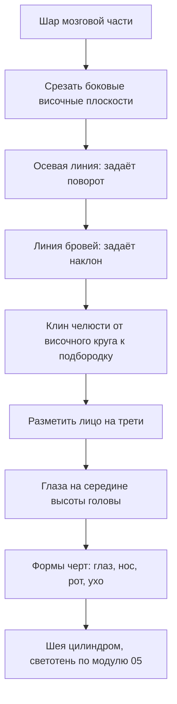

# Голова по Лумису, черты лица и руки

## Простыми словами

Голова кажется непостижимой, пока вы рисуете **лицо**. Стоит начать рисовать **череп
как объём**, и всё становится решаемым.

Метод Эндрю Лумиса — самый живучий способ построения головы, придуманный в середине XX
века и до сих пор используемый везде. Его идея в одном предложении: **голова — это шар
со срезанными боками, к которому снизу приделана челюсть**. Шар — мозговая часть,
плоские «щёчки» по бокам — височные плоскости, челюсть — клин. Всё.

Дальше вы просто рисуете на этом шаре две линии — вертикальную осевую (centerline) и
горизонтальную линию бровей (brow line), — и они автоматически задают поворот и наклон
головы. Черты лица потом раскладываются по этим линиям арифметически.

Руки — та же история: пока вы рисуете «пальцы», ничего не выходит. Начните с варежки,
и через месяц по пять минут в день руки перестанут быть кошмаром.

## Зачем это нужно

**Похожесть — следствие конструкции, а не наоборот.** Портретное сходство берётся из
правильных пропорций черепа и посадки головы, а не из тщательно нарисованных ресниц.

**Метод даёт голову в любом повороте.** Скопировать анфас можно и без метода. Но
повернуть голову на три четверти «из головы» без конструкции невозможно — а с шаром и
двумя линиями это две минуты.

**Символы — главный враг.** Глаз-«лодочка с кружком», нос-«галочка», ухо-«вопросительный
знак» — это иероглифы, которые мы рисуем с детского сада. Модуль 01 объяснял, откуда они
берутся; здесь мы их окончательно заменяем формами.

## Как делать (пошагово)

### Голова по Лумису: конструкция

```text
   1. шар            2. срез боков       3. оси на шаре      4. челюсть
      _____             _____               _____               _____
    /       \         /|     |\           /| , |\             /| , |\
   |         |       | |     | |         | |  ,| |           | |  ,| |
   |         |       | |     | |  ← плоская  |--+--|  ← линия | |--+--|
    \_____ /          \|_____|/           \| ',| /            \| ',| /
                       височная            бровей и            \  V /
                       плоскость           осевая               \_V_/  подбородок
```

Пошагово:

1. **Шар.** Круг — мозговая часть черепа. Рисуется свободно, от плеча.
2. **Срез боков.** Представьте, что шар сплюснут с двух сторон: на каждой стороне
   появляется плоский круг (височная плоскость), диаметром примерно 2/3 шара. В фас вы
   видите её как круг с торца — то есть не видите; в профиль это большой круг на всю
   боковину; в три четверти — один круг виден как круг, второй уходит за форму.
3. **Осевая линия (centerline)** — вертикаль по шару спереди, изогнутая по сфере.
   Она определяет **поворот** головы: по центру — фас, смещена вбок — три четверти.
4. **Линия бровей (brow line)** — горизонталь по шару, тоже изогнутая. Она определяет
   **наклон**: смотрит голова вверх (дуга выгнута вверх) или вниз.
5. **Челюсть.** От нижнего края височного круга опускается клин к подбородку. Длина
   лицевой части (от линии бровей до подбородка) примерно равна расстоянию от линии
   бровей до макушки.
6. **Шея.** Цилиндр, идущий не вертикально, а под наклоном вперёд, и входящий в череп
   глубоко сзади, а не приклеенный к подбородку.



### Три поворота

**Фас.** Осевая — точно по центру, линия бровей — прямая горизонталь. Голова
симметрична, и это её главная сложность: любая асимметрия сразу видна. Приём: рисовать
парные черты **одновременно** — оба глаза по очереди по одному движению, а не «доделал
левый, взялся за правый».

**Профиль.** Виден весь височный круг. Лицевая линия — это профильная кривая: лоб,
переносица (углубление!), нос, губы, подбородок. Самое частое: забывают, что затылок
уходит **далеко назад** — голова в профиль заметно длиннее, чем кажется. Ухо в профиле
находится примерно посередине глубины головы, за вертикалью челюстного угла.

**Три четверти.** Осевая смещена в сторону поворота и изогнута по сфере. Дальний глаз
уже ближнего и ближе к краю лица; дальняя половина лица короче — это перспективное
сокращение, а не ошибка. Скула с ближней стороны выступает силуэтом. Три четверти —
рабочий поворот, в нём рисуют большинство портретов, потому что он читается объёмнее
всего.

### Размещение черт лица

```text
 ┌───────────── макушка
 │   лоб
 ├───────────── линия волос         }
 │                                  }  три равные трети
 ├───────────── линия бровей        }  от линии волос до подбородка
 │   ГЛАЗА — ровно на середине      }
 │   высоты всей головы             }
 ├───────────── низ носа            }
 │   рот — на 1/3 от носа к подбородку
 └───────────── подбородок
   уши: между линией бровей и низом носа
   ширина головы в фас ≈ 5 глаз; между глазами ровно один глаз
```

Три правила, которые исправляют 80% ошибок:

1. **Глаза — на середине высоты головы**, считая от макушки до подбородка. Новичок
   ставит их слишком высоко, потому что мысленно «отрезает» лоб и волосы. Проверяйте
   измерением: от макушки до глаз должно быть столько же, сколько от глаз до подбородка.
2. **Трети.** От линии волос до бровей, от бровей до низа носа, от носа до подбородка —
   примерно равные отрезки.
3. **Ширина — пять глаз**, причём промежуток между глазами равен ширине одного глаза.

### Черты как формы, а не символы

- **Глаз** — это не миндаль на плоскости, а **шар в глазнице**, прикрытый двумя веками,
  у которых есть **толщина**. Верхнее веко нависает, и от него падает тень на радужку —
  вот почему верх глаза почти всегда темнее. Внутренний уголок ниже и «мокрый»,
  внешний — выше и острее. Радужка частично скрыта верхним веком; полностью открытая
  радужка даёт испуганный взгляд.
- **Нос** — клин (трапециевидная призма) с четырьмя плоскостями: спинка сверху, две
  боковые, нижняя с ноздрями. Ноздри — не дырки, а крылья: рисуйте форму крыла, а тень
  ноздри сама появится. Кончик носа — шарик, крылья — два шарика поменьше.
- **Рот** — не линия, а **два цилиндра губ, надетые на цилиндр зубного ряда**. Верхняя
  губа обычно темнее (она наклонена вниз-от света), нижняя ловит свет и имеет свой блик.
  Линия между губами — единственная по-настоящему тёмная деталь; её рисуют неровной,
  с изменением нажима.
- **Ухо** — овал размером с расстояние от бровей до низа носа, наклонённый назад
  примерно как угол челюсти. Внутри — форма буквы «Y» и мочка. Больше ничего в
  учебном рисунке не нужно.

Общее правило: **сначала объёмная форма и её тень, потом контур**. Если начать с
контура, получится символ.

### Волосы как масса

Волосы новички рисуют волосок за волоском и получают парик из проволоки. Правильный
порядок ровно тот же, что везде: **сначала масса, потом пряди, потом отдельные волосы —
и последних почти не нужно**.

1. **Объём.** Волосы — это шапка **поверх** черепа, то есть форма больше черепа на
   толщину прикрытия. Нарисуйте её как отдельный объём, у которого есть свет,
   терминатор и своя тень на лбу и на шее.
2. **Пряди.** Три-пять крупных масс, каждая со своим направлением. Направление всегда
   идёт **от точки роста** — обычно от макушки или от линии пробора.
3. **Край.** Граница волос и лица со стороны света — мягкая; там, где прядь отделяется
   от массы, — жёсткая. Силуэт волос местами теряется в фоне.
4. **Отдельные волосы** — десяток по краю освещённых прядей, снятых клячкой-остриём.
   Больше не нужно: зритель достроит.

Линия волос на лбу — не ровная дуга, а неровная, с углублениями у висков. Ровная дуга
мгновенно выдаёт схему.

### Три вещи, которые дают сходство

Учебная голова и портрет отличаются немногим. Если хочется сходства, начинать нужно не
с деталей, а с трёх вещей:

1. **Пропорции черепа.** Соотношение высоты и ширины, длина лицевой части относительно
   мозговой. Люди отличаются друг от друга прежде всего этим.
2. **Углы и расстояния.** Расстояние между глазами, высота посадки бровей, длина носа
   относительно третей, ширина челюсти. Всё это измеряется.
3. **Общая форма головы в силуэте.** Прищурьтесь и посмотрите на силуэт: он уже узнаваем
   до всяких черт.

Ресницы, морщинки и родинки сходства не дают. Это проверяется просто: узнаваемая
карикатура состоит из четырёх линий и никаких деталей.

Практический приём для проверки: прищурьтесь, посмотрите на натуру и на рисунок по
очереди и сравните **одну** величину — например, расстояние от глаз до подбородка
относительно ширины головы. Если она совпала, а сходства всё равно нет, ищите следующую
величину; если не совпала — правьте её, а не глаза.

### Руки

Руки — самая частая жалоба и самая быстро решаемая проблема, потому что они всегда с
вами: натура бесплатная и доступна 24 часа.

Три стадии, через которые проходит каждый рисунок кисти:

1. **Варежка (mitten).** Ладонь — плоская коробка (слегка клиновидная, шире у пальцев),
   четыре пальца — одна общая масса-варежка, большой палец — отдельный клин, отходящий
   от нижней трети ладони. На этой стадии решается поза и пропорция: **ладонь примерно
   равна длине пальцев**, вся кисть — длиной с лицо.
2. **Блоки.** Варежка делится: пальцы становятся четырьмя цепочками коробок по три
   фаланги. Костяшки — не по прямой линии, а по дуге. Пальцы веером расходятся от
   запястья, а не растут параллельно.
3. **Пальцы.** Скругление, суставы как утолщения, ногти как маленькие плоскости на
   верхней грани последней фаланги. Складки на суставах — две-три, не двадцать.

**Режим тренировки: пять минут в день.** Одна страница, четыре-пять набросков
собственной левой руки (если вы правша) в разных положениях: лежит, держит карандаш,
сжата в кулак, показывает ладонь. Никакой светотени, только конструкция. Через месяц
разница будет разительная — это самое высокооплачиваемое упражнение во всём домене.

**Стопы** делаются так же: клин с треугольной подошвой, пятка — шар, пальцы — общая
масса плюс большой отдельно. Учебная стопа — это башмак: рисуйте её как обувь, и
пропорция получится сама.

## Чек-лист самопроверки

- Голова начата с шара, а не с овала лица.
- Височная плоскость обозначена, и по ней понятен поворот.
- Осевая и линия бровей изогнуты по сфере, а не проведены прямыми.
- Глаза стоят на середине высоты головы.
- Трети (волосы—брови—нос—подбородок) примерно равны.
- Ширина лица ≈ 5 глаз, между глазами помещается один глаз.
- Уши находятся между бровями и низом носа.
- Шея — наклонный цилиндр, входящий в череп сзади.
- Кисть длиной с лицо; ладонь ≈ длине пальцев; костяшки по дуге.

## Типичные ошибки

- **Глаза слишком высоко.** Классика номер один. Лечение: измерить середину головы.
- **Плоская голова.** Нарисовано лицо без черепа. Лечение: всегда начинать с шара.
- **Прямые осевые.** Линии проведены линейкой, голова не поворачивается. Лечение:
  осевая и линия бровей — дуги по сфере.
- **Символьный глаз.** Миндаль с кружком, ресницы веером. Лечение: шар, веки с толщиной,
  тень от верхнего века.
- **Нос-галочка.** Лечение: клин с четырьмя плоскостями, крылья вместо дырок.
- **Рот-линия.** Лечение: два объёма губ, тёмная только линия смыкания.
- **Приклеенная голова.** Шея вертикальная и тонкая, голова «висит». Лечение: наклонный
   цилиндр, широкое основание, вход в череп сзади.
- **Крошечные кисти и пальцы-сосиски.** Лечение: варежка сначала, пропорция «кисть =
  лицо», костяшки по дуге.
- **Симметрия «по половинкам».** Одна сторона лица доделана до конца, потом вторая.
  Лечение: парные черты рисуются параллельно.

## Словарь терминов

- **Метод Лумиса (Loomis method)** — построение головы из шара, височных плоскостей и
  челюсти.
- **Височная плоскость (side plane)** — плоский срез на боку черепного шара.
- **Осевая линия (centerline)** — вертикальная линия симметрии лица, задаёт поворот.
- **Линия бровей (brow line)** — горизонталь по черепу, задаёт наклон.
- **Трети лица** — равные отрезки волосы—брови, брови—нос, нос—подбородок.
- **Варежка (mitten)** — упрощённая кисть: ладонь-коробка и общая масса пальцев.
- **Фаланга** — сегмент пальца; их три у каждого пальца, кроме большого.

## См. также

- Первая часть: [`theory.md`](./theory.md) — пропорции фигуры, жест, манекен.
- Andrew Loomis, «Drawing the Head and Hands» — первоисточник метода; первые тридцать
  страниц покрывают всё, что здесь описано, и содержат схемы, которые текст заменить не
  может. Смотрите разделы про «ball and plane» и про повороты головы.
- Proko, серия «Loomis Head» / «How to Draw the Head from Any Angle» — пошаговая
  видеодемонстрация ровно этого метода; лучший визуальный компаньон к этому файлу.
- Andrew Loomis, «Figure Drawing for All It's Worth» — разделы про кисти и стопы.
- Proko, серия про руки — разбор кисти от коробок к пальцам.
- line-of-action.com — есть отдельный режим тренировки рук и лиц по таймеру.
- Схемы поворотов головы и фото рук удобно сохранить в `misc/figure/`.
