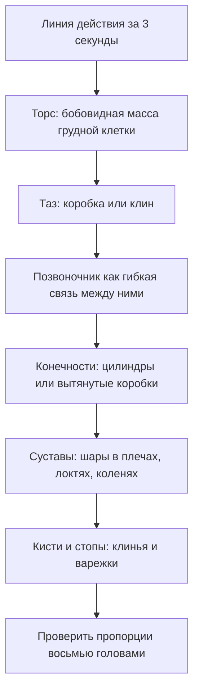

# Фигура: пропорции, жест, манекен

## Простыми словами

Фигура человека кажется невозможной по одной причине: мы смотрим на людей всю жизнь и
поэтому замечаем малейшую неправду. Кривой стул мы простим, кривую руку — нет. Отсюда
ощущение «фигура — это другой уровень».

На самом деле уровень тот же. Фигура — это те же коробки и цилиндры из
[`04-perspective`](../04-perspective/theory.md), собранные в определённом порядке и
пропорции. Новое здесь только два умения:

1. **Пропорции** — сколько голов в росте, где пупок, где колено. Это просто знание,
   выучивается за вечер и проверяется измерением.
2. **Жест** — умение поймать движение раньше формы. Это навык, тренируется таймером.

И одно решение, которое экономит месяцы: **начинать не с контура, а с движения**.
Новичок начинает с головы, аккуратно рисует лицо, спускается ниже — и обнаруживает, что
на ноги места не осталось, а поза деревянная. Профессионал сначала за десять секунд
кладёт линию действия, потом строит на ней массы, и только потом уточняет.

## Зачем это нужно

**Фигура — универсальный тест.** Всё, что вы усвоили в прошлых модулях, здесь
проверяется разом: видение форм, измерение, перспектива, объём.

**Жест переносится на всё остальное.** Умение схватить главное движение за 30 секунд
делает лучше любой рисунок — дерева, здания, кошки. Это тренировка **приоритета**:
сначала важное, потом второстепенное.

**Пропорции экономят нервы.** Большинство «не похоже» в фигуре — это не анатомия, а
арифметика: голова великовата, ноги коротковаты, кисти крошечные. Каноны решают эту
проблему за неделю.

## Как делать (пошагово)

### Канон восьми голов

Классический учебный канон (у Лумиса — «идеальная» фигура): рост = 8 высот головы.
Реальный человек чаще 7–7,5 голов, но восьмёрка удобнее для учёбы: деления попадают на
ориентиры ровно.

```text
 0 ├── макушка
   │        голова 1
 1 ├── подбородок ─── ширина плеч ≈ 2 головы (муж.)
   │
 2 ├── линия сосков, низ грудных мышц
   │
 3 ├── пупок, талия чуть выше
   │
 4 ├── лобок — СЕРЕДИНА ФИГУРЫ, кисти опущенных рук — чуть ниже
   │
 5 ├── середина бедра
   │
 6 ├── низ колена
   │
 7 ├── икра
   │
 8 ├── подошва
```

Что запомнить в первую очередь, если запоминать нечего:

- **Середина фигуры — лобок, а не пупок.** Ноги занимают половину роста. Новичок почти
  всегда рисует ноги короче.
- **Локоть — на уровне пупка** (деление 3), **запястье — на уровне лобка** (деление 4).
- **Кисть длиной с лицо** — от подбородка до линии волос. Кисти новички делают вдвое
  меньше, чем надо.
- **Стопа длиной примерно с голову** (или чуть меньше, около 1 головы).
- **Ширина плеч** — около 2 голов у мужчины, около 1,5 у женщины.

**Различия, в одном абзаце.** У мужчины плечи заметно шире таза, грудная клетка крупнее,
талия ниже и менее выражена. У женщины таз по ширине близок к плечам или шире, талия
выше и уже, бёдра шире, шея тоньше, плечи покатее. У ребёнка голова огромна относительно
тела: у младенца рост ≈ 4 головы, в 6 лет ≈ 6 голов, в подростковом ≈ 7. Именно
пропорция головы, а не «милые черты», делает детскую фигуру детской — это самый
надёжный признак.

### Жестовый рисунок (gesture)

**Жест — это не набросок контура, это запись действия.** За 30 секунд вы не успеете
нарисовать человека. Вы успеете записать три вещи:

1. **Действие (action)** — что тело делает: тянется, падает, отталкивается, скручивается.
2. **Поток (flow)** — как движение проходит сквозь тело одной непрерывной кривой.
3. **Вес (weight)** — на что человек опирается, куда его тянет тяжесть.

**Линия действия (line of action)** — одна большая дуга или S-образная кривая от головы
до опорной ноги, которую вы кладёте **первой**, за две-три секунды. Она не проходит по
контуру и вообще не обязана попадать «внутрь тела» — она описывает направление.

```text
   поза «человек тянется вверх и вбок»

        o             линия действия — одна дуга,
       /|\            от макушки к опорной стопе
      / | \           контур на неё нанизывается позже
        |  \
       / \
      /   \
```

Правило, которое переворачивает результат: **линия действия должна быть простой**. Если
она получается волнистой в трёх местах — вы уже рисуете контур, а не движение.

**Протокол тренировки.** Классическая схема, которой пользуются в любой студии:

- **30 секунд × 10 póz** — только линия действия и две-три массы. Цель — не «нарисовать»,
  а увидеть.
- **2 минуты × 5 поз** — линия действия + бобовидный торс + таз + направления конечностей.
- **5 минут × 2–3 позы** — то же плюс объём: манекен, суставы, намёк на светотень.

Итого 20 минут — идеальная ежедневная разминка.

Где брать позы: **line-of-action.com** (бесплатный таймер с фигурой, есть режимы
одетой/обнажённой натуры, рук, лиц, животных) и **quickposes.com** (то же самое, с
подборками по темам). Оба сайта позволяют задать длительность и число поз — то есть
буквально реализуют протокол выше. Живые люди в кафе и метро — следующий уровень;
подробнее об этом в [`08-composition-and-sketching-habit`](../08-composition-and-sketching-habit/index.md).

Важная психологическая настройка: **жестовые наброски не должны быть красивыми**.
Девять из десяти будут выглядеть как каракули, и это нормально — вы тренируете глаз и
скорость решения, а не производите продукт. Не стирайте их и не выбрасывайте: через
месяц полезно посмотреть первую и последнюю страницы.

### Манекен: фигура из примитивов

Когда жест пойман, на него надевается объём. Манекен — упрощённая фигура из четырёх
типов деталей.



Детали манекена:

- **Грудная клетка** — «боб» (bean), яйцевидная масса, слегка сплюснутая. Или коробка,
  если вам легче с перспективой. Занимает примерно от деления 1 до деления 3.
- **Таз** — коробка или клин, короче грудной клетки, от деления 3 до 4.
- Между ними — **гибкая талия**: два эти объёма наклоняются и скручиваются друг
  относительно друга. Именно эта разница наклонов и создаёт живую позу. Если обе
  коробки параллельны, фигура стоит по стойке смирно.
- **Конечности** — цилиндры, сужающиеся к суставам. Плечо и бедро толще, предплечье и
  голень тоньше.
- **Суставы** — шары. Шар в плече, в локте, в колене. Они позволяют менять направление
  цилиндров, не ломая форму.
- **Кисти и стопы** — на этом этапе клинья и «варежки», ничего больше.

Ключ к перспективе фигуры: у грудной клетки и таза есть **направление**, то есть
передняя плоскость. Нарисуйте на бобе овал-«эллипс груди», а на тазовой коробке —
переднюю грань, и фигура сразу перестанет быть плоской. Это те же самые эллипсы и
коробки в перспективе, что и в модуле 04.

### Как проверять пропорции на живой натуре

Канон — это ориентир для фигуры «из головы». С натуры пропорции нужно **измерять**, и
делается это тем же способом, что в модуле 03: карандаш на вытянутой руке, локоть
выпрямлен, один глаз закрыт.

Практический порядок проверки, который ловит почти все грубые ошибки:

1. **Голова как единица.** Отмерьте высоту головы на карандаше большим пальцем и
   отложите её вниз по фигуре: сколько раз укладывается до подошв? Получилось шесть —
   значит, у вас на рисунке голова слишком большая.
2. **Середина.** Найдите на натуре точку, делящую фигуру пополам по высоте, и сверьте с
   рисунком. Она должна попасть примерно на лобок.
3. **Ширины.** Ширина плеч в головах, ширина таза относительно плеч.
4. **Углы.** Приложите карандаш к линии плеч и к линии тазовых косточек: это два разных
   угла, и именно их разница делает позу живой. Перенесите углы на рисунок как есть, не
   «выравнивая».

Три измерения занимают двадцать секунд и стоят получаса исправлений.

Отдельно про **уровень глаз**: если натура стоит, а вы сидите, вы смотрите на фигуру
снизу, и всё, что ниже вашей линии горизонта, будет сокращаться. Отметьте на рисунке,
на какой высоте фигуры проходит уровень ваших глаз, — это мгновенно объясняет странные
на первый взгляд пропорции и не даёт «выпрямить» их по канону.

### Ракурс: когда канон не работает

**Ракурс (foreshortening)** — сокращение размеров при направлении формы на зрителя. Рука,
вытянутая в объектив, по канону должна быть длиной в три головы, а на рисунке занимает
одну — и это правильно.

Что делать, когда пропорции «врут»:

- **Доверяйте измерению, а не знанию.** Измерьте длину бедра на вытянутой руке — и
  нарисуйте столько, сколько намерили, даже если мозг протестует.
- **Рисуйте перекрытия.** В ракурсе главный сигнал глубины — то, что одна форма
  заслоняет другую: колено перекрывает бедро, кисть перекрывает предплечье. Обозначьте
  эти перекрытия явно.
- **Считайте цилиндры.** Сокращённая конечность — это цилиндр, повёрнутый к зрителю: у
  него виден эллипс торца. Нарисуйте этот эллипс — форма перестанет казаться обрубком.

Ракурс — единственный случай, где канон отступает; во всех остальных он работает.

### Одежда поверх манекена

Одетая фигура рисуется в том же порядке, просто с лишним шагом в конце: сначала
манекен, потом ткань поверх. Не наоборот — иначе одежда получится мешком без человека
внутри.

Практически: постройте фигуру, затем определите **точки натяжения** — там, где ткань
опирается на тело (плечи, локти, грудь, колени, бёдра). От них пойдут складки по
правилам [`06-texture-and-edges`](../06-texture-and-edges/theory.md). Между точками
натяжения ткань висит свободно и повторяет форму тела лишь приблизительно.

### Порядок работы над фигурой

1. Линия действия — 3 секунды.
2. Голова-овал и опорная стопа — ставим границы, чтобы фигура влезла в лист.
3. Грудная клетка и таз с их наклонами.
4. Направления конечностей — простыми осевыми линиями.
5. Объём: цилиндры, шары суставов.
6. Проверка пропорций делением на 8 (или измерением карандашом).
7. Уточнение контура, светотень — по правилам модуля 05.

## Чек-лист самопроверки

- Линия действия положена первой и она простая, а не волнистая.
- Фигура влезла в лист целиком, включая стопы.
- Рост делится примерно на 8 голов; середина фигуры приходится на лобок.
- Локти на уровне пупка, запястья на уровне лобка.
- Кисть длиной с лицо, стопа длиной около головы.
- Грудная клетка и таз наклонены по-разному, а не параллельны.
- В суставах есть шары, конечности — объёмные цилиндры, а не палки.
- Понятно, на какую ногу приходится вес.

## Типичные ошибки

- **Начал с головы, места не хватило.** Лечение: сначала габарит — макушка и стопы, потом
  всё остальное.
- **Большая голова.** Самая частая ошибка пропорций. Лечение: проверять голову как 1/8
  роста измерением карандашом.
- **Короткие ноги.** Следствие того, что серединой фигуры считают пупок. Лечение:
  середина — лобок.
- **Крошечные кисти.** Лечение: кисть = длина лица.
- **Деревянная поза.** Грудная клетка и таз параллельны, линия действия отсутствует.
  Лечение: сознательно наклонить их в разные стороны.
- **Обе ноги несут вес одинаково.** Фигура «плавает». Лечение: решить, какая нога
  опорная; её бедро идёт выше.
- **Контур вместо масс.** Обведён силуэт, внутри пусто. Лечение: манекен из объёмов.
- **Жест «красиво и медленно».** 30-секундный набросок рисуется пять минут. Лечение:
  таймер со звуком, лист переворачивается по звонку без исключений.

## Словарь терминов

- **Канон (canon)** — условная система пропорций; учебный стандарт — 8 голов.
- **Жест / жестовый рисунок (gesture)** — быстрый набросок, фиксирующий движение.
- **Линия действия (line of action)** — главная кривая направления позы.
- **Поток (flow)** — непрерывность движения сквозь тело.
- **Вес (weight)** — распределение тяжести, опорная нога.
- **Манекен (mannequin)** — фигура, собранная из примитивов.
- **Боб (bean)** — упрощённая бобовидная масса грудной клетки.
- **Ориентиры (landmarks)** — костные точки, видимые на любой фигуре: подбородок,
  ключицы, соски, пупок, лобок, колени.

## См. также

- Продолжение: [`theory-2-head-and-hands.md`](./theory-2-head-and-hands.md) — голова,
  черты лица, руки.
- Andrew Loomis, «Figure Drawing for All It's Worth» — канон восьми голов, схемы
  пропорций и построение манекена; книга доступна как отсканированное издание, именно из
  неё происходит большинство таблиц пропорций, которые вы встретите где угодно.
- Proko, бесплатный курс «Figure Drawing Fundamentals», раздел про gesture — самое
  внятное объяснение линии действия из существующих; смотреть перед уроком 01.
- Bert Dodson, «Keys to Drawing», главы про жест и про рисование людей вокруг.
- line-of-action.com и quickposes.com — таймеры с наборами поз; поставьте закладки
  прямо сейчас, они понадобятся в уроке 01.
- Таблицу пропорций удобно распечатать и держать в `misc/figure/`.
