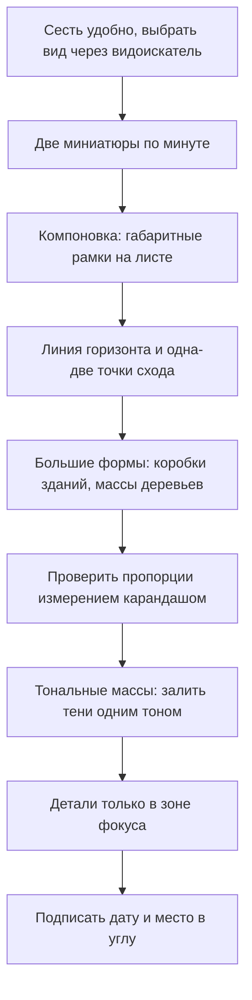
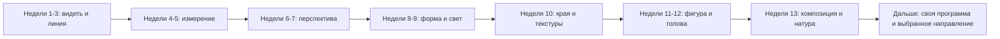

# Скетчинг с натуры и ежедневная привычка

## Простыми словами

Есть неприятная правда: почти все, кто бросает рисование, бросают его не потому, что
«нет таланта», а потому, что перестают рисовать. Навык рисования — это накопленные
часы наблюдения, и накапливаются они только регулярностью.

Хорошая новость: регулярность — инженерная задача, а не вопрос силы воли. У неё есть
понятные компоненты: короткая длительность, фиксированное время, одинаковый ритуал
начала, видимый след прогресса и защита от выгорания. Разберём каждый.

Вторая тема файла — **рисование с натуры**. Это то, ради чего всё затевалось: выйти на
улицу или сесть в кафе и за 20 минут сделать живой рисунок того, что перед вами.
Отдельный навык здесь один: **скорость решения**. С натуры невозможно всё построить и
всё проверить — приходится выбирать, что важно, а что можно потерять.

## Зачем это нужно

**Натура даёт то, чего не даёт фото:** объём (два глаза видят глубину), реальный свет,
возможность подойти и посмотреть с другой стороны, и — главное — необходимость решать
быстро, потому что автобус уедет, а человек в кафе допьёт кофе и встанет.

**Привычка важнее любого отдельного урока.** Двадцать минут в день шесть дней в неделю
— это 100+ часов за год. Три часа по субботам, когда есть настроение, — это 30 часов и
обычно бросание к марту.

**Разбор своих работ ускоряет всё остальное.** Без обратной связи можно повторять одну
и ту же ошибку сотню раз. Чек-лист даёт обратную связь без учителя.

## Как делать (пошагово)

### Выбор мотива

Правило новичка: **чем проще, тем лучше — но не скучно**. Признаки хорошего мотива для
скетча:

- есть **ясная тональная раскладка**: очевидно тёмные и очевидно светлые массы;
- есть **один главный объект** и понятная периферия;
- он **не убежит** в ближайшие двадцать минут (здание, дерево, стол в кафе, припаркованная
  машина);
- вы **можете сесть** и вам удобно (это не мелочь: стоя на морозе никто не рисует
  внимательно).

Плохие мотивы для старта: панорама города со ста зданиями, толпа, идущая на вас, сложный
интерьер с зеркалами.

### Пятиминутный и получасовой скетч

Это два разных жанра, а не «короткий и длинный».

**Пять минут** — про **выбор**. Вы успеваете: большие массы, одну-две направляющие
линии, один акцент. Больше ничего. Задача — записать впечатление. Пятиминутные скетчи
делаются десятками и не должны быть красивыми.

**Тридцать минут** — про **построение**. Успеваете: миниатюру, компоновку, перспективный
каркас, тональные массы, детали в одной зоне фокуса. Это уже маленькая законченная
работа.

Полезная привычка: перед получасовым скетчем всегда делать **две миниатюры по минуте**.
Две минуты вложений спасают полчаса.

### Алгоритм urban sketch

Комментарии к шагам, которые чаще всего ломаются:

- **Линия горизонта — это уровень ваших глаз.** Сидя вы видите город снизу, стоя — иначе.
  Отметьте её на листе первой; всё остальное строится от неё по правилам
  [`04-perspective`](../04-perspective/theory.md).
- **Большие формы раньше окон.** Здание — коробка. Окна и балконы — фактура на этой
  коробке, и их нужно меньше, чем кажется: пары рядов достаточно, дальше зритель
  достроит сам.
- **Тени одним тоном.** На улице свет меняется, поэтому решите тональную раскладку в
  первые пять минут и держитесь её, даже если солнце ушло.
- **Подпись и дата.** Механическая мелочь, которая через год превращает скетчбук в
  дневник.

### Люди в кафе и на улице

Люди двигаются — и это не проблема, а тренажёр. Приёмы:

1. **Рисуйте позу, а не человека.** Линия действия за три секунды (навык из
   [`07-figure-and-head-basics`](../07-figure-and-head-basics/theory.md)) — и, даже если
   человек встал, у вас есть запись движения.
2. **Люди повторяются.** Человек, читающий телефон, примет ту же позу через полминуты.
   Ждите возвращения позы и дорисовывайте.
3. **Собирайте по частям.** Голова от одного, руки от другого — никто не заметит.
4. **Не смотрите в упор.** Смотрите «мимо», работайте боковым зрением, держите блокнот
   маленьким. Люди почти никогда не возражают, но внимание их смущает.
5. **Начинайте со спящих и читающих.** Они неподвижны дольше всех.

### Привычка: 20–40 минут в день

**Структура сессии** — три части, всегда в одном порядке:

1. **Разминка, 5 минут.** Одинаковая каждый день: линии, эллипсы, коробки. Смысл не в
   технике, а в ритуале: разминка снимает вопрос «а что рисовать» и запускает сессию.
2. **Упражнение, 10–20 минут.** Конкретная задача из текущего модуля, с чек-листом.
3. **Удовольствие, 10–15 минут.** Рисуете что хотите, без критериев и без разбора.

Третья часть — не бонус, а необходимость. Это **правило 50%** из Drawabox: половина
времени должна уходить на рисование ради удовольствия. Обучение без удовольствия
выгорает за месяц; удовольствие без обучения не растёт. Нужны оба.

**Инфраструктура привычки:**

- **Фиксированное время.** Не «когда будет время», а конкретный слот: после ужина,
  до работы. Привязка к существующему ритуалу работает лучше будильника.
- **Материалы на виду.** Карандаш и скетчбук лежат раскрытыми на столе. Каждый барьер
  между вами и началом сессии стоит примерно один пропущенный день в неделю.
- **Минимальная версия.** В плохой день — пять минут и одна страница жеста. Пропуск дня
  допустим; два пропуска подряд — нет, это точка, где привычки умирают.
- **Фотографирование в `misc/`** по дате: `2026-09-08-sketch-01.jpg`. Прогресс в
  рисовании невидим изнутри и очевиден при сравнении через месяц.

### Как разбирать свои работы

Раз в неделю, 15 минут, разложить работы за неделю и пройтись по чек-листу. Отвечать
«да/нет», без литературы:

1. Композиция: есть ли один фокус? Кадр поделён неравно?
2. Пропорции: проверял ли я их измерением? Где ошибся больше всего?
3. Перспектива: сходятся ли параллели? Одна ли линия горизонта?
4. Форма и свет: один ли источник? Есть ли терминатор и рефлекс?
5. Края: есть ли разные типы или всё одинаково резкое?
6. Тон: использован ли весь диапазон — от бумаги до почти чёрного?
7. Что здесь получилось **лучше**, чем неделю назад?

Последний вопрос обязателен. Разбор, состоящий только из ошибок, демотивирует и потому
не работает.

Правило формулировок: ошибка должна превращаться в **действие**. Не «плохие тени», а
«не сгустил ядро за терминатором — на следующей работе сделать это отдельным шагом».

### Плато и мотивация

Прогресс идёт ступенями: две недели роста, потом три недели ощущения, что стало хуже.
Это нормально и объяснимо: **глаз растёт быстрее руки**. Вы начинаете видеть ошибки,
которых раньше не замечали, — то есть «хуже» стало не рисование, а самооценка.

Что делать на плато:

- **Сменить жанр на неделю.** Рисовали натюрморты — идите на улицу. Устали от людей —
  рисуйте чайники.
- **Уменьшить задачу.** Не «хороший рисунок», а «пять минут, только линия действия».
- **Достать старые работы.** Самое честное лекарство: месячной давности рисунки почти
  всегда хуже, чем помнится.
- **Не сравнивать себя с интернетом.** Сравнивайте только с собой месяц назад — это
  единственное осмысленное сравнение.

### План на 90 дней

Тринадцать недель, 20–40 минут в день, шесть дней в неделю. Каждая неделя — модуль плюс
ежедневная разминка. Седьмой день — свободный, без обязательств.

| Недели | Фокус | Ежедневная практика | Критерий «прошёл» |
|---|---|---|---|
| 1 | Материалы и умение видеть (модуль 01) | контурные и слепые контурные рисунки, негативное пространство | 20 контурных рисунков; вижу форму, а не «узнаю» предмет |
| 2 | Линия (модуль 02) | ghosting, прямые между точками, дуги | линия из точки в точку без «куриных лапок» |
| 3 | Эллипсы и фигуры (модуль 02) | 100 эллипсов в день, круги, простые фигуры | эллипс без углов, ось выдержана |
| 4 | Измерение (модуль 03) | измерение карандашом, углы, вертикали | пропорции натюрморта с ошибкой меньше 10% |
| 5 | Пропорции и симметрия (модуль 03) | натюрморт из 2–3 предметов через день | предметы стоят на одной плоскости, не «плавают» |
| 6 | Перспектива 1–2 точки (модуль 04) | 20 коробок в день, линия горизонта | параллели сходятся в одну точку, коробки не «разъезжаются» |
| 7 | Цилиндры и интерьер (модуль 04) | эллипсы в перспективе, угол комнаты | цилиндр в перспективе, эллипсы согласованы по степени |
| 8 | Тон и штриховка (модуль 05) | шкала, градиенты, ровные поля | попадаю в заданную ступень тона ±1 |
| 9 | Свет на формах (модуль 05) | шар, куб, цилиндр, конус; яблоко и кружка | все зоны света присутствуют и названы |
| 10 | Края и текстуры (модуль 06) | три типа края, дерево, металл, стекло, ткань | на работе есть жёсткий, мягкий и потерянный край |
| 11 | Жест и пропорции (модуль 07) | 20 минут жеста по таймеру + 5 минут рук | линия действия первой, фигура в 8 голов |
| 12 | Голова и манекен (модуль 07) | 5 голов по Лумису в день + манекены | голова строится в любом повороте |
| 13 | Композиция и натура (модуль 08) | 6 миниатюр перед работой, 2 скетча с натуры в неделю | могу назвать фокус своей работы одним словом |

После 90 дней имеет смысл не начинать «второй круг» с нуля, а собрать личную программу:
слабые места из недельных разборов + один проект в месяц (серия скетчей одного района,
портреты домашних, разворот скетчбука в неделю).

### Куда двигаться дальше

Направления, каждое со своим реальным ориентиром:

- **Тушь и линер.** Линия без права на ластик; штриховка тушью. Ориентиры: курс
  Drawabox (он целиком рассчитан на линер) и международное сообщество Urban Sketchers
  (urbansketchers.org) с его правилами рисования на месте.
- **Фигура и анатомия глубже.** Loomis, «Figure Drawing for All It's Worth» как базис;
  дальше — курсы Proko по анатомии.
- **Цифровой рисунок.** Планшет, слои, кисти. Фундамент тот же; техника переносится
  почти полностью.
- **Свет и цвет.** James Gurney, «Color and Light» — следующий естественный шаг, когда
  тональное мышление уже поставлено.
- **Технический рисунок и дизайн.** Scott Robertson, «How to Draw» и «How to Render» —
  перспектива и рендер на промышленном уровне.
- **Пленэр и композиция пейзажа.** Продолжение работы с натуры: те же миниатюры и
  notan, но на природе.

Выбирать стоит одно направление на несколько месяцев, а не все сразу.

## Чек-лист самопроверки

- Есть фиксированное время сессии и оно соблюдается шесть дней в неделю.
- Каждая сессия начинается с одинаковой пятиминутной разминки.
- Половина времени уходит на рисование ради удовольствия.
- Работы фотографируются в `misc/` с датой в имени.
- Раз в неделю проводится разбор по чек-листу, и в нём есть пункт «что стало лучше».
- Каждая найденная ошибка превращена в конкретное действие.
- В неделю есть хотя бы один рисунок с натуры.

## Типичные ошибки

- **Слишком большая цель.** «Час в день» держится две недели. Лечение: 20 минут, но
  каждый день.
- **Только упражнения.** Обучение без удовольствия выгорает. Лечение: правило 50%.
- **Только удовольствие.** Рисование одного и того же на том же уровне годами. Лечение:
  правило 50% с другой стороны.
- **Сравнение с чужими работами в сети.** Лечение: сравнивать только с собой месяц назад.
- **Идеальный скетчбук.** Страх испортить дорогую бумагу. Лечение: дешёвая бумага и
  установка «эта тетрадь — черновик».
- **Разбор без действий.** «Плохо получилось» вместо конкретного пункта. Лечение:
  формулировка «в следующий раз сделать X».
- **Бросить после двух пропусков.** Лечение: минимальная версия сессии на пять минут.

## Словарь терминов

- **Скетч (sketch)** — быстрый рисунок с натуры, не претендующий на законченность.
- **Urban sketching** — практика рисования городской среды с натуры на месте.
- **Правило 50%** — половина времени практики отводится рисованию для удовольствия.
- **Плато** — период, когда прогресс не ощущается, потому что глаз растёт быстрее руки.
- **Ретроспектива** — регулярный разбор своих работ по чек-листу.
- **Пленэр** — работа с натуры на открытом воздухе.

## См. также

- Первая часть: [`theory.md`](./theory.md) — композиция, notan, миниатюры.
- Drawabox, drawabox.com — раздел о «правиле 50%» и о структуре ежедневной практики;
  самый внятный текст о том, как не выгореть.
- Bert Dodson, «Keys to Drawing» — книга во многом о ежедневной практике и о рисовании
  того, что вокруг.
- Betty Edwards, «Drawing on the Right Side of the Brain» — вернуться к упражнениям на
  видение, если чувствуете, что «разучились видеть».
- James Gurney, gurneyjourney.blogspot.com — многолетний дневник практики с натуры;
  полезно как пример отношения к работе.
- line-of-action.com и quickposes.com — ежедневная жестовая разминка.
- Скетчи с натуры фотографируйте в `misc/sketchbook/` по датам — это ваш измеримый
  прогресс.
