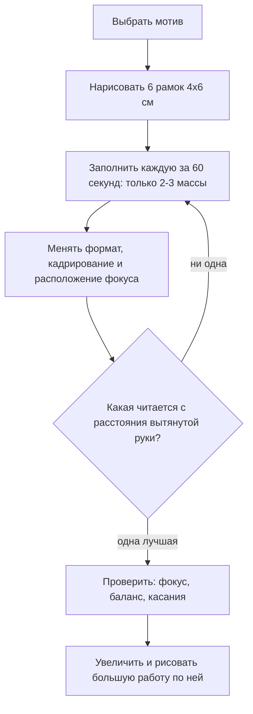

# Композиция

## Простыми словами

Композиция — это **решения, принятые до первой линии**: что попадает в кадр, что
остаётся за ним, куда должен смотреть зритель и как расставлены тёмные и светлые пятна.

Звучит абстрактно, поэтому переведём на понятный язык. Представьте, что вы делаете
скриншот. Прежде чем нажать кнопку, вы выбираете, где рамка, что попадёт внутрь и
достаточно ли контрастно то, что вы хотите показать. Ровно то же самое делает художник,
только рамку он выбирает сам, а «контраст» расставляет вручную.

Главная мысль: **композиция решается на пятисантиметровой миниатюре за минуту, а не на
большом листе за три часа**. Если на миниатюре размером со спичечный коробок рисунок
читается — большая работа получится. Если не читается — не спасёт никакая штриховка.

## Зачем это нужно

**Экономия времени.** Шесть миниатюр по минуте отсеивают пять плохих вариантов до того,
как вы вложили в них час.

**Понятность.** Зритель должен за секунду понять, о чём рисунок. Композиция — это то,
что за него это решает.

**Ощущение законченности.** Работы новичка часто выглядят как «упражнение», даже когда
техника хороша: предмет посередине, поля одинаковые, тона равномерные. Композиционные
решения превращают упражнение в рисунок.

## Как делать (пошагово)

### Формат и кадрирование

**Формат** — пропорции листа. Три рабочих варианта:

- **Вертикальный (портретный)** — для высоких мотивов: фигура, дерево, узкая улица.
  Усиливает ощущение роста и падения.
- **Горизонтальный (альбомный)** — пейзаж, интерьер, спокойствие, движение вбок.
- **Квадратный** — статика, сосредоточенность на объекте.

Формат — это решение, а не то, как лёг лист. Поверните лист сознательно.

**Кадрирование (cropping)** — где проходят границы. Два инструмента:

1. **Видоискатель** — прямоугольное окошко, вырезанное в куске картона (или сложенные
   уголком две руки, или прямоугольник большими и указательными пальцами). Смотрите на
   натуру сквозь него и двигайте, пока композиция не соберётся.
2. **Правило «резать смело или не резать вообще».** Кружка, у которой чуть-чуть срезан
   бок, выглядит как ошибка. Кружка, срезанная наполовину, выглядит как решение.

### Точка зрения — тоже композиционное решение

Прежде чем выбирать рамку, выберите, **откуда вы смотрите**. Это решение принимается
ногами и стоит ноль усилий, а меняет рисунок сильнее любого приёма.

- **Уровень глаз стоящего человека** — нейтрально и привычно. Так выглядит большинство
  фотографий и большинство скучных рисунков.
- **Низкая точка** (сесть на землю, положить предмет выше уровня глаз) — предметы
  вырастают, появляется значительность и напряжение.
- **Высокая точка** (встать, посмотреть на натюрморт сверху) — видно расположение
  предметов на плоскости, появляется ощущение обзора и порядка.

Практически: перед началом работы сделайте три шага вбок, присядьте, встаньте — и
посмотрите на мотив из каждой позиции. Часто именно смена точки зрения решает
композицию, которая «не складывалась» из исходного положения. Уровень глаз задаёт линию
горизонта, а значит и всю перспективу — см.
[`04-perspective`](../04-perspective/theory.md).

### Фокус

**Фокус (focal point)** — место, куда зритель смотрит первым. На рисунке он должен быть
**один**. Инструменты, которыми он создаётся, по силе:

1. **Контраст тона** — самое тёмное рядом с самым светлым. Работает сильнее всего.
2. **Резкость края** — самый жёсткий край в кадре (см.
   [`06-texture-and-edges`](../06-texture-and-edges/theory.md)).
3. **Детализация** — там подробно, вокруг намёком.
4. **Направляющие линии** — дорога, ветка, взгляд персонажа, тень, ведущие глаз к
   фокусу.
5. **Изоляция** — одинокий предмет среди пустоты притягивает внимание.

Если вы не можете назвать фокус своей работы — его нет, и зритель растеряется.

### Правило третей и его границы

Разделите кадр на три части по горизонтали и вертикали. Четыре точки пересечения —
удобные места для фокуса; линии — удобные места для горизонта.

```text
 ┌──────┬──────┬──────┐
 │      │      │      │
 ├──────●──────●──────┤   ● — сильные точки
 │      │      │      │
 ├──────●──────●──────┤   горизонт — на верхней
 │      │      │      │   или нижней линии
 └──────┴──────┴──────┘
```

**Зачем оно вообще нужно:** оно защищает от двух главных бед новичка — предмета ровно
по центру и горизонта ровно посередине. Обе делят кадр на равные части, а равенство —
это скука и неопределённость.

**Где оно заканчивается:** правило третей — костыль, а не закон. Центральная композиция
может быть очень сильной (симметрия, фронтальность, портрет в упор). Множество великих
работ его нарушают. Пользуйтесь им как быстрой проверкой «а не получилось ли у меня
всё поровну?», а не как обязательной сеткой.

Куда полезнее правила третей одна мысль: **делите кадр неравными частями**. Небо и земля
— в отношении примерно 1:2 или 2:1, но не 1:1.

### Notan: две-три тональные массы

**Notan** (термин из японской традиции, вошедший в западные учебники) — упрощение
композиции до плоских пятен светлого и тёмного, без всяких деталей и полутонов.
Практически: возьмите миниатюру 4 × 6 см и залейте её **двумя тонами** — белым и почти
чёрным. Или тремя: светлый, средний, тёмный.

```text
 ┌──────────┐  ┌──────────┐  ┌──────────┐  ┌──────────┐
 │░░░░░░░░░░│  │████░░░░░░│  │░░░░░░░░░░│  │██████████│
 │░░░███░░░░│  │███░░░░░░░│  │▓▓▓▓░░░░██│  │███░░░░███│
 │░░█████░░░│  │░░░░░░░████│ │▓▓▓▓▓▓░███│  │███░██░███│
 │██████████│  │░░░░██████│  │██████████│  │██████████│
 └──────────┘  └──────────┘  └──────────┘  └──────────┘
  тёмное на     диагональ     три массы:    светлое на
  светлом                     небо/земля/   тёмном
                              акцент
```

Что notan показывает мгновенно:

- **Читается ли композиция вообще.** Если пятна сливаются в кашу, никакая проработка не
  поможет.
- **Есть ли тональная структура.** Хорошее правило: **светлое на тёмном или тёмное на
  светлом**. Главный объект должен отличаться по тону от того, на чём он стоит. Тёмный
  предмет на тёмном фоне исчезает — если только вы не делаете это намеренно
  (потерянный край).
- **Баланс масс.** Все тёмные пятна сползли в один угол? Кадр «падает».

Практическое правило: **три массы лучше десяти**. Хороший рисунок обычно раскладывается
на 3–4 крупных тональных пятна.

### Направляющие линии, баланс, касания

**Направляющие линии (leading lines)** — линии, ведущие глаз внутрь кадра к фокусу:
дорога, река, перила, край стола, ряд фонарей, вытянутая рука. Линия, выводящая глаз
**из** кадра, — ошибка: зритель уходит и не возвращается.

**Баланс** — ощущение, что кадр не заваливается. Не симметрия: большое спокойное пятно
с одной стороны уравновешивается маленьким контрастным акцентом с другой, как груз на
рычаге. Проверка: посмотрите на миниатюру и спросите себя, в какую сторону она
«тяжелее».

**Касания (tangents)** — места, где две линии соприкасаются или почти соприкасаются, и
глубина схлопывается. Классические случаи, которые нужно уметь видеть:

- макушка головы ровно касается линии горизонта или края стола;
- контур предмета сливается с вертикалью дверного косяка;
- дерево «растёт» точно из плеча человека;
- край предмета точно совпадает с краем листа.

Лечение всегда одно: **сдвинуть на сантиметр**. Пусть либо явно перекрывает, либо явно
не касается. Перекрытие (overlap) — вообще один из самых дешёвых способов показать
глубину: то, что перекрывает, — ближе.

### Ритм и группировка

Три предмета, поставленные с равными промежутками, выглядят как забор. Те же три,
сгруппированные как «два рядом и один отдельно», выглядят как композиция. Это правило
работает почти механически, поэтому его стоит запомнить в виде формулы: **группируйте
неравными числами** — 2 + 1, 3 + 2, 4 + 1.

То же касается размеров и интервалов: три предмета одного размера с одинаковыми зазорами
скучны; крупный, средний и маленький с разными промежутками читаются как история. Правило
относится и к деталям внутри рисунка — окна на здании, листья, складки: равномерный
частокол всегда хуже неравномерной группировки.

**Ритм** — это чередование, которое глаз считывает как движение: пятно, пауза, пятно
поменьше, длинная пауза, акцент. Проверяется прищуром: если тёмные пятна идут через
равные промежутки, композиция «стучит»; если чередование неравномерное — она «дышит».

### Пустота — это тоже элемент

Начинающий стремится заполнить лист, потому что пустое место кажется недоделанностью. В
действительности **пустота работает**: она даёт глазу отдохнуть и усиливает то, что
рядом. Одинокий предмет в большом пустом кадре читается сильнее, чем тот же предмет в
плотном окружении.

Практические следствия:

- **Негативное пространство** (форма пустоты между предметами) — полноценная часть
  композиции; смотрите на неё так же, как на предметы. Если пустоты между предметами
  одинаковые по форме и размеру — композиция вялая.
- **Незаполненная периферия — не ошибка.** Достаточно намёка: пара линий, лёгкое пятно.
- **Не бойтесь «воздуха» сверху или сбоку.** Именно он часто задаёт настроение: много
  неба — простор, мало — теснота.

### Три быстрых теста

Перед тем как начать большую работу, прогоните выбранный вариант через три проверки.
Каждая занимает секунды.

1. **Тест ногтя.** Уменьшите миниатюру мысленно (или превью фотографии) до размера
   ногтя. Что видно? Если ничего не читается, кроме серого пятна, композиции нет.
2. **Тест прищура.** Прищурьтесь и посчитайте различимые массы. Три-четыре — хорошо,
   одна — нет структуры, десять — каша.
3. **Тест зеркала.** Посмотрите на эскиз в зеркале или переверните лист изображением к
   свету и посмотрите с обратной стороны. Привычный взгляд «замыливается»; в отражении
   перекос, завал и дисбаланс видны сразу.

Четвёртая, необязательная, но очень полезная проверка — **отложить на сутки**. Утренний
взгляд на вчерашний эскиз честнее любого чек-листа: за ночь глаз «расклеивается» и
перестаёт видеть то, что вы задумывали, вместо того, что действительно нарисовано.

### Миниатюры



Практика, которая меняет всё: **шесть миниатюр перед каждой серьёзной работой**.
Правила:

1. Размер 4 × 6 см, не больше. На маленьком не получится «рисовать» — только решать.
2. Одна минута на штуку. Таймер.
3. Только пятна, никаких контуров и деталей.
4. Варианты должны **отличаться** — другой формат, другое кадрирование, другое место
   фокуса, другая раскладка тёмного и светлого. Шесть одинаковых миниатюр — потерянные
   шесть минут.
5. Выбираете лучшую, глядя на них с расстояния вытянутой руки прищурившись.

Десять минут на миниатюры экономят час на большой работе и радикально повышают шанс,
что она получится.

## Чек-лист самопроверки

- Формат выбран сознательно, а не «как лежал лист».
- Я могу назвать фокус одним словом и показать пальцем.
- Кадр разделён неравными частями; горизонт не посередине.
- Композиция раскладывается на 3–4 крупные тональные массы.
- Главный объект отличается по тону от того, на чём он стоит.
- Есть хотя бы одна направляющая линия, ведущая внутрь кадра.
- Нет касаний: контуры либо явно перекрывают, либо явно расходятся.
- Миниатюра размером с ноготь всё ещё читается.

## Типичные ошибки

- **Предмет ровно по центру, поля одинаковые.** Лечение: сдвинуть, кадрировать смелее.
- **Горизонт посередине.** Кадр разваливается на две равные половины. Лечение: 1:2 или
  2:1.
- **Нет фокуса.** Всё проработано одинаково. Лечение: выбрать одно место и усилить там
  контраст и резкость, остальное приглушить.
- **Два конкурирующих фокуса.** Глаз мечется. Лечение: один подавить.
- **Касания.** Дерево из головы, макушка на линии горизонта. Лечение: сдвинуть.
- **Всё влезло.** Попытка вместить весь вид. Лечение: видоискатель и решение «это не
  войдёт».
- **Обрезано чуть-чуть.** Срезанный на пару миллиметров край читается как ошибка.
  Лечение: резать смело или не резать.
- **Ровный тональный ковёр.** Нет ни больших светлых, ни больших тёмных масс. Лечение:
  notan из двух тонов на старте.
- **Миниатюры «как маленькие рисунки».** В них рисуют детали вместо пятен. Лечение:
  таймер на минуту и толстый карандаш.

## Словарь терминов

- **Композиция (composition)** — организация элементов в кадре.
- **Формат** — пропорции и ориентация листа.
- **Кадрирование (cropping)** — выбор границ изображения.
- **Видоискатель (viewfinder)** — рамка для выбора кадра.
- **Фокус (focal point)** — точка главного внимания.
- **Правило третей (rule of thirds)** — сетка 3 × 3 как ориентир для фокуса и горизонта.
- **Notan** — упрощение композиции до 2–3 плоских тональных масс.
- **Тональная структура** — распределение светлых и тёмных пятен.
- **Направляющие линии (leading lines)** — линии, ведущие взгляд к фокусу.
- **Касание (tangent)** — нежелательное соприкосновение контуров, убивающее глубину.
- **Перекрытие (overlap)** — один предмет заслоняет другой; простейший способ показать
  глубину.
- **Миниатюра (thumbnail)** — крошечный набросок композиции.

## См. также

- Продолжение: [`theory-2-sketching-habit.md`](./theory-2-sketching-habit.md) — как
  применять это на натуре и как удержать привычку.
- Andrew Loomis, «Successful Drawing» — разделы про композицию, кадрирование и
  распределение акцентов; книга во многом именно об этом.
- Bert Dodson, «Keys to Drawing» — глава про композицию и про «дизайн» листа, очень
  практичная и без академизма.
- James Gurney, gurneyjourney.blogspot.com — множество коротких заметок о тональных
  массах, фокусе и работе с натуры; поиск по словам composition и notan.
- Drawabox, drawabox.com — раздел с рекомендациями по «правилу 50%» и по тому, как не
  превратить обучение в бесконечные упражнения.
- Свои удачные notan-схемы полезно фотографировать в `misc/composition/` — это личная
  библиотека рабочих раскладок.
