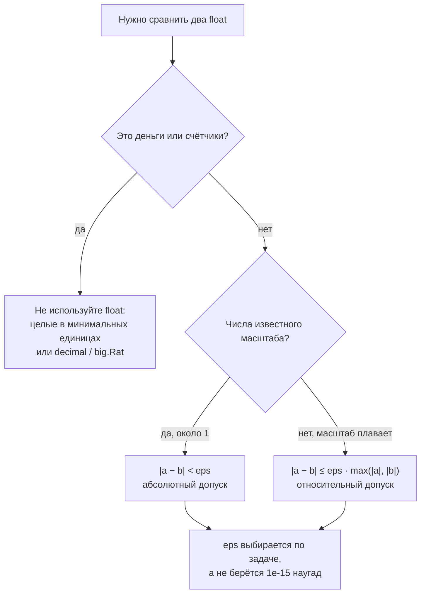

# Числа в компьютере

Вторая часть теории модуля. В [первой части](./theory.md) числа были идеальными:
бесконечная прямая, точные дроби, любые степени. В памяти всё иначе — там конечное
число бит, и почти все «странности» языков программирования растут именно отсюда.

Обозначения (⌊x⌋, |x|, ℝ и прочие) — в [словаре обозначений](./theory.md#словарь-обозначений).

## Вспоминаем школу

Из школы полезны ровно две вещи.

Первая — **позиционная запись**. Число 253 в десятичной системе означает
2·10² + 5·10¹ + 3·10⁰. Ровно тот же принцип в двоичной, только основание 2:

```text
1101₂ = 1·2³ + 1·2² + 0·2¹ + 1·2⁰
      = 8 + 4 + 0 + 1
      = 13
```

Вторая — **конечная десятичная дробь существует не для всякой дроби**. 1/3 = 0.333…
не заканчивается. Правило было такое: дробь p/q записывается конечной десятичной
ровно тогда, когда после сокращения знаменатель q состоит только из делителей
основания (для десятки — двойки и пятёрки). Держите эту фразу в голове: сейчас мы
поменяем основание на 2, и она объяснит главный флоатный сюрприз.

Системы счисления и битовые операции вглубь — это
[модуль 05](../05-number-theory-and-binary/index.md); здесь только тот минимум,
который нужен, чтобы понять типы чисел.

## Зачем программисту

- Понять, почему `int32` тихо переполняется на 2 147 483 648 и что при этом происходит
  с знаком — а значит, почему счётчик просмотров однажды стал отрицательным.
- Перестать бояться `0.1 + 0.2 != 0.3` и начать сравнивать float правильно.
- Знать, когда `float64` уже не годится (деньги, идентификаторы, большие суммы) и что
  брать вместо него.
- Читать чужие баги: «после 2⁵³ id перестали быть уникальными в JSON» — это ровно
  про мантиссу double.

## Простыми словами

**Целые числа в памяти — это кольцо, а не прямая.** Если у вас 8 бит, то после 255
идёт 0, а не 256. Числовая прямая замкнута в круг, и переполнение — это просто
переход через стык.

**Вещественные числа в памяти — это не точки, а сетка.** `float64` умеет представить
конечный (хоть и огромный) набор значений, расположенных неравномерно: густо около
нуля, редко у больших чисел. Любое ваше число «приклеивается» к ближайшему узлу сетки.
Отсюда всё: и погрешность, и то, что сравнивать на равенство бессмысленно.

## Точнее

### Целые: размеры и переполнение

| Тип | Бит | Диапазон |
|---|---|---|
| `int8` | 8 | −128 … 127 |
| `uint8` | 8 | 0 … 255 |
| `int16` | 16 | −32 768 … 32 767 |
| `int32` | 32 | −2 147 483 648 … 2 147 483 647 |
| `int64` | 64 | −9 223 372 036 854 775 808 … 9 223 372 036 854 775 807 |
| `uint64` | 64 | 0 … 18 446 744 073 709 551 615 |

Общая формула: знаковый n-битный тип держит от −2ⁿ⁻¹ до 2ⁿ⁻¹ − 1, беззнаковый — от 0
до 2ⁿ − 1. Единичка вычитается потому, что ноль тоже занимает одно из значений.

В Go переполнение **не паникует**: оно молча заворачивается по модулю 2ⁿ. Это ровно
математический `mod` из первой части теории:

```text
результат = (истинное значение) mod 2ⁿ,  с приведением к диапазону типа
```

### Дополнительный код (two's complement) за одну страницу

Как хранить отрицательные, если в памяти только нули и единицы? Наивная идея —
отдать старший бит под знак — даёт два нуля (+0 и −0) и ломает сложение. Реальные
процессоры используют дополнительный код.

Правило: **старший бит имеет отрицательный вес**. Для 8 бит веса такие:

```text
бит:     b₇   b₆  b₅  b₄  b₃  b₂  b₁  b₀
вес:   −128   64  32  16   8   4   2   1

1111 1111 = −128 + 64+32+16+8+4+2+1 = −128 + 127 = −1
1000 0000 = −128                    = −128
0111 1111 =        64+32+16+8+4+2+1 =  127
```

Из этой таблицы сразу видны три вещи:

1. Ноль ровно один: `0000 0000`.
2. Отрицательных чисел на одно больше, чем положительных: минимум −128, максимум 127.
   Поэтому `−int8(−128)` переполняется — числа +128 просто нет.
3. Сложение работает без всяких «если знак»: обычное двоичное сложение с отбрасыванием
   переноса даёт правильный ответ. Это и есть причина, по которой выбрали именно эту схему.

Практический приём: чтобы получить −x, инвертируйте все биты и прибавьте 1
(`−x = ~x + 1`). Проверьте на 8 битах для x = 1: `0000 0001` → `1111 1110` → `1111 1111` = −1.

### IEEE 754: float обычными словами

`float64` (в терминах стандарта — binary64, в C/Java — double) хранит число в трёх кусках:

```text
[ знак: 1 бит ][ порядок: 11 бит ][ мантисса: 52 бита ]

значение ≈ (−1)^знак × 1.мантисса × 2^(порядок − 1023)
```

Это та же научная запись `m · 10ᵏ` из первой части теории, только основание 2 и
всё конечной длины. Отсюда следуют главные свойства.

**Мантисса — 52 бита плюс подразумеваемая единица, итого 53 значащих двоичных
разряда.** Значит, все целые числа до 2⁵³ = 9 007 199 254 740 992 представляются
точно, а начиная с 2⁵³ + 1 — уже нет. Это тот самый предел `Number.MAX_SAFE_INTEGER`
в JavaScript и причина, по которой большие id в JSON принято передавать строкой.

**Шаг сетки зависит от величины числа.** Между 1 и 2 соседние float отстоят на 2⁻⁵²
≈ 2.2·10⁻¹⁶, между 2 и 4 — вдвое больше, и так далее. Относительная точность
постоянна (~15–16 десятичных цифр), абсолютная — нет.

**Не всякая десятичная дробь представима.** Вернёмся к правилу из «Вспоминаем школу»,
но с основанием 2: конечной двоичной дробью записываются только дроби, знаменатель
которых — степень двойки. 1/2, 1/4, 0.75 — да. А 0.1 = 1/10, где в знаменателе есть
пятёрка, — нет. В двоичной системе 0.1 — это бесконечная периодическая дробь, ровно
как 1/3 в десятичной:

```text
0.1  ≈ 0.1000000000000000055511151231257827021181583404541015625
0.2  ≈ 0.200000000000000011102230246251565404236316680908203125
0.1 + 0.2 ≈ 0.3000000000000000444089209850062616169452667236328125
0.3  ≈ 0.299999999999999988897769753748434595763683319091796875
```

Последние две строки — разные числа. Поэтому `0.1 + 0.2 == 0.3` даёт `false`, и это
не баг языка, а честная арифметика на конечной сетке.

**Особые значения.** `+Inf` и `−Inf` (переполнение и деление ненуля на ноль),
`NaN` («не число» — результат `0/0`, `√(−1)`, `Inf − Inf`). У NaN есть коварное
свойство: `NaN != NaN` возвращает `true`, то есть NaN не равен даже сам себе. И
существуют два нуля, `+0` и `−0`, которые равны друг другу при сравнении, но
`1/(+0) = +Inf`, а `1/(−0) = −Inf`.

### Как сравнивать float



Абсолютный допуск (`|a − b| < 1e-9`) отлично работает для чисел порядка единицы и
полностью бесполезен для чисел порядка 10¹⁵ — там сама сетка крупнее допуска.
Относительный допуск устойчивее, но ломается около нуля. Универсального `eps` не
существует: величина допуска — это утверждение о вашей задаче.

Отдельный инструмент — `math.Nextafter(x, y)`: возвращает следующее представимое
float-число от `x` в сторону `y`. Им удобно измерять реальный шаг сетки в конкретной
точке и понимать, какой `eps` вообще осмыслен.

### Когда float не подходит

- **Деньги.** Храните целыми в минимальных единицах (копейки, центы) или используйте
  десятичный тип. `0.1 + 0.2` в бухгалтерии — это не философия, это расхождение баланса.
- **Идентификаторы.** Любой id больше 2⁵³ теряет точность при проходе через double.
- **Большие точные вычисления.** Факториалы, криптография, длинная арифметика —
  стандартная библиотека Go даёт `math/big`: `big.Int` (целые произвольной длины),
  `big.Rat` (точные рациональные дроби p/q), `big.Float` (float с настраиваемой
  точностью мантиссы). Плата — скорость и аллокации, поэтому не «на всякий случай».

## Разобранные примеры

### Пример 1. Переполнение int8

Задача: что вернёт `int8(127) + int8(1)`?

```text
127 в двоичном виде  = 0111 1111
+1                   = 0000 0001
сумма (8 бит)        = 1000 0000     — перенос ушёл в старший бит
старший бит весит −128
значение             = −128
```

Ответ: −128. Формально это `(127 + 1) mod 256 = 128`, приведённое в диапазон
знакового типа: 128 − 256 = −128.

### Пример 2. Почему 0.1 + 0.2 не 0.3

```text
0.1 не представим точно  → сохранён как 0.1000000000000000055511151231257827…
0.2 не представим точно  → сохранён как 0.2000000000000000111022302462515654…
их точная сумма          = 0.3000000000000000166533453693773481…
округляется до ближайшего float → 0.3000000000000000444089209850062616…
0.3 сам по себе округляется до  → 0.2999999999999999888977697537484346…
две разные точки сетки   → сравнение на == даёт false
```

Мораль: ошибка появилась не при сложении, а раньше — в момент, когда литералы `0.1`
и `0.2` попали в память.

### Пример 3. Граница 2⁵³

Задача: почему `float64(9007199254740993)` печатается как `9007199254740992`?

```text
2⁵³ = 9007199254740992
шаг сетки при таких величинах = 2       — мантиссы уже не хватает на единицу
представимы: … 9007199254740992, 9007199254740994 …
9007199254740993 попадает между узлами → округляется к ближайшему чётному → …992
```

### Пример 4. Ceil на float против ceil на целых

Задача: `math.Ceil(0.29 / 0.01)` — сколько будет?

```text
0.29 / 0.01 в точной арифметике = 29
в float64 частное = 28.999999999999996   — обе дроби неточны
math.Ceil(28.999999999999996) = 29       — округление вверх «подобрало» ответ
```

Здесь повезло: погрешность оказалась в минус, и потолок вернул ожидаемое 29. Но
знак погрешности не гарантирован. Стоит частному оказаться чуть *больше* целого —
и потолок прыгнет на единицу вверх:

```text
0.1 + 0.2 = 0.30000000000000004        — погрешность в плюс
(0.1 + 0.2) / 0.1 = 3.0000000000000004
math.Ceil(3.0000000000000004) = 4      — вместо ожидаемых 3
```

Вывод из примера: считайте потолок на целых через `(a + b − 1)/b`, а не через деление
float с последующим `Ceil`. Формула из [первой части](./theory.md) точна всегда.

## В коде

Переполнение и то, что Go про него молчит:

```go
package main

import (
	"fmt"
	"math"
)

func main() {
	var a int8 = 127
	a++
	fmt.Println(a) // -128, без паники и без предупреждения

	var u uint8 = 0
	u--
	fmt.Println(u) // 255, кольцо замкнулось в другую сторону

	fmt.Println(math.MaxInt64, math.MinInt64)
}
```

Флоаты и сравнение с допуском:

```go
package main

import (
	"fmt"
	"math"
)

// almostEqual сравнивает с относительным допуском; eps подбирается под задачу.
func almostEqual(a, b, eps float64) bool {
	if a == b { // ловит и точное равенство, и совпадение бесконечностей
		return true
	}
	return math.Abs(a-b) <= eps*math.Max(math.Abs(a), math.Abs(b))
}

func main() {
	fmt.Println(0.1+0.2 == 0.3)                  // false
	fmt.Println(almostEqual(0.1+0.2, 0.3, 1e-12)) // true
	fmt.Printf("%.20f\n", 0.1+0.2)               // 0.30000000000000004441
}
```

Насколько крупна сетка в конкретной точке — `math.Nextafter`:

```go
package main

import (
	"fmt"
	"math"
)

func main() {
	for _, x := range []float64{1, 1e6, 1e15, 1e18} {
		step := math.Nextafter(x, math.Inf(1)) - x
		fmt.Printf("рядом с %-8g шаг сетки = %g\n", x, step)
	}
	// рядом с 1e15 шаг уже 0.125 — никакой eps=1e-9 там не работает
}
```

Точная арифметика через `math/big`:

```go
package main

import (
	"fmt"
	"math/big"
)

func main() {
	// точная дробь: 1/10 + 2/10 == 3/10, без всяких приближений
	sum := new(big.Rat).Add(big.NewRat(1, 10), big.NewRat(2, 10))
	fmt.Println(sum.Cmp(big.NewRat(3, 10)) == 0) // true

	// целые произвольной длины: 2^200 целиком
	fmt.Println(new(big.Int).Lsh(big.NewInt(1), 200))
}
```

## Типичные ошибки

- **Сравнивать float через `==`.** Работает только для значений, которые вы сами
  туда положили и не трогали. Любая арифметика — и равенство разваливается.
- **Брать `eps = 1e-15` «как все».** Для чисел порядка 10¹⁵ шаг сетки крупнее этого
  допуска; сравнение вырождается в `==`.
- **Хранить деньги во float.** Классика, которая всплывает на этапе сверки отчётов.
- **Считать, что переполнение выстрелит.** В Go оно тихое: `int32` счётчик просто
  уедет в минус.
- **Забывать про асимметрию диапазона.** `−math.MinInt64` не помещается в `int64`,
  а `math.Abs` от минимального int даёт снова его же.
- **Проверять NaN через `x == math.NaN()`.** Это всегда `false`; нужен `math.IsNaN(x)`.
- **Округлять float и считать результат точным.** `math.Round(2.675*100)/100` даёт
  2.67, а не 2.68 — потому что 2.675 хранится чуть меньше, чем 2.675.
- **Использовать `math/big` везде.** Он в разы медленнее и аллоцирует; берите его
  осознанно, там, где точность действительно важна.

## Шпаргалка формул

| Тема | Формула / факт |
|---|---|
| Диапазон знакового n-бит | от −2ⁿ⁻¹ до 2ⁿ⁻¹ − 1 |
| Диапазон беззнакового n-бит | от 0 до 2ⁿ − 1 |
| Переполнение | результат = истинное значение mod 2ⁿ |
| Отрицание в доп. коде | −x = ~x + 1 |
| Вес старшего бита (n бит) | −2ⁿ⁻¹ |
| Структура float64 | 1 бит знак + 11 бит порядок + 52 бита мантиссы |
| Значение float64 | (−1)^s × 1.f × 2^(e − 1023) |
| Точные целые в float64 | все до 2⁵³ = 9 007 199 254 740 992 |
| Десятичных цифр точности | ~15–16 |
| Машинное эпсилон float64 | 2⁻⁵² ≈ 2.22·10⁻¹⁶ |
| Абсолютное сравнение | \|a − b\| < eps |
| Относительное сравнение | \|a − b\| ≤ eps · max(\|a\|, \|b\|) |
| NaN | NaN ≠ NaN; проверять `math.IsNaN` |

## Словарь терминов

- **Бит / разряд** — одна двоичная позиция, 0 или 1.
- **Знаковый / беззнаковый тип** — умеет ли представлять отрицательные значения.
- **Дополнительный код (two's complement)** — способ хранения знаковых целых, где
  старший бит имеет вес −2ⁿ⁻¹.
- **Переполнение (overflow)** — выход результата за диапазон типа; в Go — заворот по модулю.
- **IEEE 754** — стандарт представления вещественных чисел; `float32` = binary32,
  `float64` = binary64.
- **Мантисса (significand)** — «значащие цифры» числа в float.
- **Порядок (exponent)** — показатель степени двойки в float.
- **Денормализованные числа** — очень маленькие значения около нуля, у которых
  подразумеваемая единица мантиссы отсутствует; точность там падает.
- **Машинное эпсилон** — расстояние от 1.0 до следующего представимого числа.
- **NaN** — «not a number», результат неопределённой операции; не равен ничему, включая себя.
- **`math/big`** — пакет Go для точной арифметики: `big.Int`, `big.Rat`, `big.Float`.

## См. также

- Первая часть теории: [`theory.md`](./theory.md), в том числе
  [словарь обозначений](./theory.md#словарь-обозначений).
- Урок по этой теме: [`lessons/03-numbers-in-the-machine.md`](./lessons/03-numbers-in-the-machine.md).
- Двоичная система, биты и модульная арифметика вглубь:
  [`05-number-theory-and-binary`](../05-number-theory-and-binary/index.md).
- **David Goldberg, «What Every Computer Scientist Should Know About Floating-Point
  Arithmetic»** (1991) — канонический разбор IEEE 754:
  https://docs.oracle.com/cd/E19957-01/806-3568/ncg_goldberg.html
- **Go documentation** — пакеты `math`, `math/big`, `math/bits`:
  https://pkg.go.dev/math и https://pkg.go.dev/math/big
- **The Go Programming Language Specification**, раздел Numeric types (диапазоны и
  поведение при переполнении): https://go.dev/ref/spec
