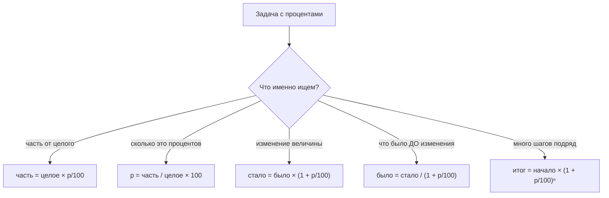

# Числа и арифметика — теория

Это фундамент. Не потому, что «без него никуда» — а потому, что всё остальное в курсе
опирается на четыре вещи: дробь, процент, степень и остаток. Если они лежат в голове
криво, дальше каждая формула будет выглядеть как заклинание.

Договоримся сразу: если попадётся незнакомый символ — он объяснён ниже, в разделе
[«Словарь обозначений»](#словарь-обозначений). Заглядывать туда не стыдно, это
справочник, а не экзамен.

## Вспоминаем школу

### Числовая прямая и виды чисел

Самая полезная картинка в арифметике — прямая, на которой каждому числу соответствует
точка. Все виды чисел — это просто «сколько точек мы разрешаем себе брать».

```text
   ─────┬─────┬─────┬─────┬─────┬─────┬─────┬─────▶
       −3    −2    −1     0     1     2     3

  ℕ  «натуральные»:              1     2     3  ...   (счёт предметов)
  ℤ  «целые»:      −3    −2    −1     0     1     2     3  ...
  ℚ  «рациональные»: всё, что записывается дробью p/q:  −1.5,  1/3,  0.25,  7/2
  ℝ  «вещественные»: вся прямая целиком, включая √2 ≈ 1.41421…  и  π ≈ 3.14159…
```

Каждое следующее множество включает предыдущее: ℕ ⊂ ℤ ⊂ ℚ ⊂ ℝ (значок ⊂ читается
«содержится в»). Дальше по курсу это будет ровно то же самое, что «`int8` помещается
в `int64`»: расширение множества допустимых значений.

Отдельно стоит запомнить факт, который в школе проговаривают вскользь: **не всякое
число — дробь**. √2 нельзя записать как p/q ни при каких целых p и q. Такие числа
называются иррациональными, и их на прямой «подавляющее большинство». Для программиста
это не абстракция: именно поэтому `float64` не хранит числа, а хранит *приближения*.

### Дроби

Дробь p/q — это невыполненное деление. Не «половинка пирога», а именно отложенная
операция: 3/4 значит «раздели 3 на 4, но не сейчас». Отсюда все правила:

- **Умножение** — самое простое: (a/b) · (c/d) = (a·c)/(b·d). Числители с числителями,
  знаменатели со знаменателями.
- **Деление** — это умножение на перевёрнутую дробь: (a/b) : (c/d) = (a/b) · (d/c).
- **Сложение** требует общего знаменателя: a/b + c/d = (a·d + c·b)/(b·d). Самый частый
  провал взрослого человека — сложить «числитель с числителем, знаменатель со
  знаменателем». 1/2 + 1/3 — это **не** 2/5, это 5/6.
- **Сокращение**: делим числитель и знаменатель на общий делитель. 6/8 = 3/4.
- **Смешанное число** 2¾ — это просто 2 + 3/4 = 11/4. Обратно: 11/4 → 11 разделить на 4
  с остатком, получаем 2 целых и 3 в остатке, то есть 2¾.

### Десятичные дроби

Десятичная запись — это дробь со знаменателем-степенью десятки: 0.25 = 25/100 = 1/4.
Важный факт: **не всякая дробь записывается конечной десятичной**. 1/3 = 0.333…
Конечной десятичной записью обладают ровно те дроби, у которых знаменатель после
сокращения состоит только из двоек и пятёрок (делители десятки). Запомните эту фразу —
через две страницы она объяснит `0.1 + 0.2 != 0.3`.

### Проценты

Процент — это дробь со знаменателем 100. `p%` = p/100. Всё. Дальше — четыре типовые
задачи, и путаница между ними даёт больше всего ошибок в отчётах.



Два капкана, в которые попадают все:

1. **Проценты не складываются.** Рост на 10%, потом ещё на 10% — это не 20%, а
   1.1 · 1.1 = 1.21, то есть 21%.
2. **Падение и рост не компенсируются.** −20%, потом +20% даёт 0.8 · 1.2 = 0.96, то
   есть минус 4% от исходного.

### Степени и корни

aⁿ — это «a, умноженное само на себя n раз». Правила действий с показателями стоит
знать наизусть, они переиспользуются в логарифмах, big-O и битовых трюках:

```text
aᵐ · aⁿ = aᵐ⁺ⁿ        — при умножении показатели складываются
aᵐ / aⁿ = aᵐ⁻ⁿ        — при делении вычитаются
(aᵐ)ⁿ  = aᵐ·ⁿ         — степень степени: показатели перемножаются
(a·b)ⁿ = aⁿ · bⁿ      — степень произведения
a⁰ = 1   (при a ≠ 0)  — следует из aⁿ / aⁿ = aⁿ⁻ⁿ = a⁰ = 1
a⁻ⁿ = 1/aⁿ            — отрицательный показатель = «в знаменатель»
a^(1/2) = √a          — дробный показатель = корень
a^(m/n) = ⁿ√(aᵐ)      — общий случай
```

Правило «a^(1/2) = √a» не соглашение из воздуха: если правила должны продолжать
работать, то (a^(1/2))² = a^(1/2 · 2) = a¹ = a. А число, квадрат которого равен a, —
это и есть √a.

### Порядок действий

Скобки → степени и корни → умножение и деление (слева направо) → сложение и вычитание
(слева направо). Унарный минус ведёт себя коварно: −3² = −(3²) = −9, а (−3)² = 9.

### Модуль

|x| («модуль x», «абсолютная величина») — это расстояние от x до нуля, всегда ≥ 0.
|−7| = 7, |7| = 7. Практическая польза: |a − b| — это расстояние между a и b, и именно
так сравнивают float'ы «с точностью до эпсилон».

### Деление с остатком, ⌊x⌋ и ⌈x⌉

Для целых a и b > 0 существуют единственные q и r такие, что

```text
a = b·q + r,  где 0 ≤ r < b
```

q — неполное частное, r — остаток. 17 = 5·3 + 2, значит 17 div 5 = 3, 17 mod 5 = 2.

⌊x⌋ — «пол», округление вниз (⌊3.7⌋ = 3, ⌊−3.2⌋ = −4). ⌈x⌉ — «потолок», округление
вверх (⌈3.2⌉ = 4, ⌈−3.7⌉ = −3). Обратите внимание на отрицательные: пол идёт **вниз
по прямой**, а не «в сторону нуля».

### Научная запись и порядки величин

Число в научной записи — это `m · 10ᵏ`, где 1 ≤ |m| < 10. В коде десятка пишется как
`e`: `1.6e-19`, `6.02e23`. Показатель k и есть «порядок величины». Порядки складываются
при умножении, поэтому оценки в уме делаются мгновенно:

```text
3·10⁵ запросов × 2·10³ байт
= (3·2) · 10⁵⁺³      — множители отдельно, степени отдельно
= 6 · 10⁸ байт       — то есть ~600 МБ
```

### Округление и значащие цифры

Значащие цифры — все цифры числа, начиная с первой ненулевой. У 0.00420 их три: 4, 2, 0.
Результат вычисления не может быть точнее исходных данных: если время измерено как
«около 12 мс», писать «11.9473 мс в среднем» бессмысленно.

Отдельно: правило округления .5 бывает разным. «Школьное» округляет 2.5 → 3, а
`math.Round` в Go — тоже от нуля (2.5 → 3, −2.5 → −3). Но банковское округление
(round half to even), которое используют многие библиотеки и форматы вывода, даёт
2.5 → 2 и 3.5 → 4. Если суммы не сходятся на копейку — ищите здесь.

## Зачем программисту

Каждый пункт выше — это не «повторение ради повторения», а инструмент, который вы
уже используете, просто не всегда осознанно:

- **Дроби и проценты** — SLA, конверсия, error rate, «сколько ещё нод нужно, если
  трафик вырос на 35%», расчёт скидок и налогов там, где ошибка стоит денег.
- **Степени и корни** — размер пространства ключей (2¹²⁸ для UUID), рост объёма
  данных, экспоненциальный backoff при ретраях, оценка «сколько бит нужно».
- **Порядки величин** — capacity planning на салфетке. Умение за десять секунд сказать
  «это примерно 6·10⁸ байт» экономит часы неверных решений.
- **Деление с остатком** — шардирование (`hash % shards`), кольцевые буферы, разбиение
  на страницы, конвертация секунд в часы/минуты, чередование цветов строк.
- **⌊x⌋ / ⌈x⌉** — «сколько страниц при page size = 50»: ⌈n/50⌉, а не n/50.
- **Модуль** — сравнение float'ов, метрики отклонения, допуски.

## Простыми словами

Три идеи, из которых складывается всё остальное.

**Первая: число — это точка на прямой.** Разные «виды чисел» — это разные степени
щедрости в том, какие точки мы разрешаем. Целые — редкие засечки. Рациональные —
густо, но с дырками. Вещественные — сплошь.

**Вторая: дробь — это отложенное деление.** Как ленивое вычисление: 3/4 — это не
«результат», а «инструкция поделить». Поэтому дроби можно сокращать (инструкцию можно
упростить) и поэтому у сложения дробей такие правила: нельзя сложить две инструкции,
пока они «в разных единицах».

**Третья: степень — это повторённое умножение, и она умеет продолжаться в обе
стороны.** Вправо натуральными показателями, влево — нулём, отрицательными и дробными.
Все «странные» правила (a⁰ = 1, a^(1/2) = √a) появляются не по декрету, а потому что
это единственный способ не сломать формулу aᵐ · aⁿ = aᵐ⁺ⁿ.

## Точнее

### Дроби: полный набор правил

```text
a/b + c/d = (a·d + c·b) / (b·d)      — общий знаменатель
a/b − c/d = (a·d − c·b) / (b·d)
(a/b) · (c/d) = (a·c) / (b·d)
(a/b) : (c/d) = (a·d) / (b·c)        — умножение на обратную
a/b = (a·k)/(b·k)                    — при k ≠ 0 дробь не меняется
```

Знаменатель b·d в сумме — это *какой-нибудь* общий знаменатель, не обязательно
наименьший. Наименьший — это НОК(b, d), но его поиск сам по себе тема
[модуля 05](../05-number-theory-and-binary/index.md); для ручного счёта достаточно
перемножить и потом сократить.

### Проценты: главное правило

Все пять формул собраны в [шпаргалке](#шпаргалка-формул) ниже. Правило, из которого
они выводятся, одно: **процент — это множитель**. Рост на p% — умножение на
(1 + p/100), уменьшение на p% — умножение на (1 − p/100). Поэтому шаги
перемножаются, а «найти, что было до изменения» — это деление на множитель, а не
вычитание процента.

### Остаток: математический mod против `%` в Go

Определение выше требует 0 ≤ r < b. Но операция `%` в Go (как в C, Java, Rust)
определена иначе: она берёт знак **делимого**.

```text
математически:   −7 mod 3 = 2      — потому что −7 = 3·(−3) + 2, и 0 ≤ 2 < 3
в Go:            −7 % 3   == −1    — потому что −7 = 3·(−2) + (−1)
```

Оба ответа «правильные» в своей системе: Go делит с усечением к нулю
(−7 / 3 == −2), а математика делит с округлением вниз (⌊−7/3⌋ = −3). Отсюда
практическое правило: если вы шардируете по `hash % n`, а `hash` может быть
отрицательным — вы получите отрицательный индекс и панику. Лечится так:

```text
mod(a, n) = ((a % n) + n) % n
```

### Пол, потолок и округление

```text
⌊x⌋ = наибольшее целое ≤ x
⌈x⌉ = наименьшее целое ≥ x
⌈a/b⌉ = ⌊(a + b − 1)/b⌋   — для целых a ≥ 0, b > 0: «потолок целочисленным делением»
```

Последняя строчка — рабочая лошадка: `pages := (n + size - 1) / size` без всякого float.

### Степени с нецелым показателем

Определение a^(m/n) = ⁿ√(aᵐ) требует a > 0, иначе начинаются приключения:
√(−4) не существует среди вещественных чисел, а (−8)^(1/3) формально равно −2, но
`math.Pow(-8, 1.0/3)` вернёт `NaN`. Для программиста правило простое: возводить в
дробную степень только положительные числа.

Логарифм — обратная операция к степени, и это тема
[модуля 02](../02-algebra-refresher/index.md). Здесь достаточно интуиции:
log₂(n) — это «в какую степень возвести 2, чтобы получить n», то есть «сколько раз n
можно поделить пополам». log₂(1024) = 10.

## Разобранные примеры

### Пример 1. Сложение дробей и смешанное число

Задача: сколько будет 2¾ + 5/6?

```text
2¾ + 5/6
= 11/4 + 5/6                    — 2¾ = (2·4 + 3)/4 = 11/4
= (11·6)/(4·6) + (5·4)/(6·4)    — общий знаменатель 24
= 66/24 + 20/24                 — посчитали числители
= 86/24                         — сложили числители
= 43/12                         — сократили на 2
= 3 7/12                        — 43 = 12·3 + 7, целая часть 3, остаток 7
```

Проверка прикидкой: 2.75 + 0.833 ≈ 3.58, а 3 + 7/12 ≈ 3.583. Сходится.

### Пример 2. Обратный процент

Задача: после скидки 15% товар стоит 2 380 ₽. Сколько он стоил до скидки?

```text
стало = было · (1 − 0.15)
2380  = было · 0.85              — подставили
было  = 2380 / 0.85              — разделили обе части на 0.85
было  = 2800                     — посчитали
```

Проверка: 2800 · 0.85 = 2380. Типичная ошибка — прибавить 15% к 2380 и получить 2737,
что неверно: 15% считались от *старой* цены, а не от новой.

### Пример 3. Оценка порядка

Задача: 4 млн пользователей, у каждого в среднем 30 событий в день, событие ~250 байт.
Сколько данных в сутки?

```text
4·10⁶ × 30 × 250
= 4·10⁶ × 3·10¹ × 2.5·10²        — всё в научную запись
= (4 · 3 · 2.5) · 10⁶⁺¹⁺²        — множители отдельно, степени отдельно
= 30 · 10⁹
= 3 · 10¹⁰ байт                  — привели к 1 ≤ m < 10
≈ 30 ГБ                          — 10⁹ байт ≈ 1 ГБ
```

Тридцать гигабайт в сутки — уже понятно, что это не «просто положим в Postgres».

### Пример 4. Страницы и остаток

Задача: 1 234 записи, на странице 50. Сколько страниц и сколько записей на последней?

```text
1234 = 50·24 + 34               — деление с остатком
q = 24, r = 34                  — 24 полные страницы и 34 записи сверху
страниц = ⌈1234/50⌉ = 25        — неполная страница тоже страница
на последней = 34
```

Целочисленный вариант без float: (1234 + 50 − 1) / 50 = 1283 / 50 = 25.

## В коде

Каждую формулу выше можно проверить за минуту. Ниже — Go, который считает то же самое.

Проценты и обратный процент:

```go
package main

import "fmt"

func main() {
	old := 2800.0
	discounted := old * (1 - 0.15) // 2380
	restored := discounted / (1 - 0.15)
	fmt.Println(discounted, restored) // 2380 2800

	// проценты не складываются
	fmt.Println(1.1 * 1.1)  // 1.2100000000000002 -> +21%, не +20%
	fmt.Println(0.8 * 1.2)  // 0.96              -> −4%, а не 0%
}
```

Правильный mod для отрицательных чисел (пригодится в шардировании):

```go
// mod возвращает математический остаток: результат всегда в [0, n).
func mod(a, n int) int {
	if n <= 0 {
		panic("mod: n must be positive")
	}
	return ((a % n) + n) % n
}

// mod(-7, 3) == 2, при этом -7 % 3 == -1
```

Потолок целочисленным делением — без `math.Ceil` и без float:

```go
// ceilDiv = ⌈a/b⌉ для a >= 0, b > 0.
func ceilDiv(a, b int) int {
	return (a + b - 1) / b
}

// ceilDiv(1234, 50) == 25
```

Проверка правила aᵐ · aⁿ = aᵐ⁺ⁿ на целых числах, чтобы не мешать float:

```go
func pow(a, n int) int {
	r := 1
	for i := 0; i < n; i++ {
		r *= a
	}
	return r
}

// pow(3,4)*pow(3,5) == pow(3,9)  -> true
```

## Типичные ошибки

- **Складывать числители и знаменатели отдельно.** 1/2 + 1/3 ≠ 2/5. Общий знаменатель
  обязателен; проверяйте прикидкой в десятичных.
- **Складывать проценты.** «Выросло на 10% и ещё на 10% — итого 20%» — нет, 21%.
  А «упало на 50%, потом выросло на 50%» — это 0.5 · 1.5 = 0.75, минус 25%.
- **Считать обратный процент вычитанием.** Если после +20% получилось 120, то было
  100, а не 120 − 20% = 96.
- **Забывать про унарный минус.** −3² = −9, а не 9.
- **Считать, что `%` в Go — это математический mod.** Для отрицательных это не так;
  `hash % n` может дать отрицательный индекс.
- **Округлять «в сторону нуля» вместо ⌊⌋.** Для отрицательных `int(-3.7)` в Go даёт −3,
  а ⌊−3.7⌋ = −4. Это разные функции.
- **Терять неполную страницу.** `n / size` вместо `⌈n/size⌉` — классическая потеря
  последних записей в пагинации.
- **Врать точностью.** Пять знаков после запятой в отчёте, где входные данные имели
  две значащие цифры, — это не аккуратность, а шум.

## Шпаргалка формул

| Тема | Формула |
|---|---|
| Сложение дробей | a/b + c/d = (a·d + c·b)/(b·d) |
| Умножение дробей | (a/b)·(c/d) = (a·c)/(b·d) |
| Деление дробей | (a/b):(c/d) = (a·d)/(b·c) |
| Смешанное → неправильная | k n/m = (k·m + n)/m |
| p% от X | X · p/100 |
| Доля в процентах | (X/Y)·100 |
| Изменение на p% | X · (1 + p/100) |
| Обратный процент | Y / (1 + p/100) |
| n шагов роста | X · (1 + p/100)ⁿ |
| Степени | aᵐ·aⁿ = aᵐ⁺ⁿ; aᵐ/aⁿ = aᵐ⁻ⁿ; (aᵐ)ⁿ = aᵐⁿ |
| Нулевая и отрицательная | a⁰ = 1 (a ≠ 0); a⁻ⁿ = 1/aⁿ |
| Корень как степень | √a = a^(1/2); ⁿ√(aᵐ) = a^(m/n) |
| Деление с остатком | a = b·q + r, 0 ≤ r < b |
| Математический mod | mod(a,n) = ((a % n) + n) % n |
| Потолок через целые | ⌈a/b⌉ = ⌊(a + b − 1)/b⌋ |
| Модуль | \|x\| = x при x ≥ 0, иначе −x |
| Научная запись | m · 10ᵏ, где 1 ≤ \|m\| < 10 |

## Словарь обозначений

Таблица, ради которой этот модуль стоит первым. Все остальные модули курса ссылаются
сюда. Колонка «в коде» — не строгая эквивалентность, а рабочая аналогия для интуиции.

| Символ | Читается | Что значит | В коде |
|---|---|---|---|
| ℕ | «натуральные числа» | 1, 2, 3, … (иногда с нулём) | `uint` |
| ℤ | «целые числа» | …, −2, −1, 0, 1, 2, … | `int` |
| ℚ | «рациональные числа» | всё, что записывается дробью p/q | `big.Rat` |
| ℝ | «вещественные числа» | вся числовая прямая | `float64` (приближённо) |
| ∈ | «принадлежит», «лежит в» | x ∈ A — x есть элемент A | `_, ok := set[x]` |
| ∉ | «не принадлежит» | x ∉ A | `!ok` |
| ⊆ | «подмножество» | A ⊆ B — каждый элемент A есть в B | «все ключи A есть в B» |
| ∪ | «объединение» | A ∪ B — всё, что в A или в B | слияние двух множеств |
| ∩ | «пересечение» | A ∩ B — то, что и в A, и в B | общие ключи |
| ∀ | «для любого», «для всех» | ∀x P(x) — P верно для каждого x | `all(...)`, цикл с ранним `false` |
| ∃ | «существует» | ∃x P(x) — есть хотя бы один такой x | `any(...)`, цикл с ранним `true` |
| ⇒ | «следует», «влечёт» | p ⇒ q — если p, то q | `if p { assert q }` |
| ⇔ | «тогда и только тогда» | p ⇔ q — p и q равносильны | `p == q` для булевых |
| Σ | «сумма» | Σᵢ₌₁ⁿ aᵢ — сложить a₁ … aₙ | `for i := 1; i <= n; i++ { s += a[i] }` |
| ∏ | «произведение» | ∏ᵢ₌₁ⁿ aᵢ — перемножить a₁ … aₙ | тот же цикл, но `p *= a[i]` |
| ≈ | «приблизительно равно» | π ≈ 3.14 | сравнение с эпсилон |
| ≠ | «не равно» | a ≠ b | `a != b` |
| ≤ / ≥ | «меньше или равно» / «больше или равно» | a ≤ b | `a <= b` |
| \|x\| | «модуль x» | расстояние от x до нуля | `math.Abs(x)` |
| ⌊x⌋ | «пол x», округление вниз | наибольшее целое ≤ x | `math.Floor(x)` |
| ⌈x⌉ | «потолок x», округление вверх | наименьшее целое ≥ x | `math.Ceil(x)` |
| n! | «эн факториал» | 1·2·…·n, при этом 0! = 1 | цикл-произведение |
| C(n,k) | «це из эн по ка», «биномиальный коэффициент» | сколькими способами выбрать k из n без учёта порядка | число сочетаний |
| log | «логарифм» | log_a(b) = c ⇔ aᶜ = b | `math.Log2`, `math.Log` |
| mod | «по модулю», «остаток» | a mod n — остаток от деления | `a % n` (но см. знаки!) |
| ∞ | «бесконечность» | не число, а «растёт без предела» | `math.Inf(1)` |

Читается это всё вслух — так и запоминается. «Σᵢ₌₁ⁿ i» — «сумма по i от одного до эн
от i», то есть «сложи все числа от 1 до n». В коде это три строчки цикла, и ничего
страшного в значке нет.

## Словарь терминов

- **Натуральные / целые / рациональные / вещественные числа** — ℕ / ℤ / ℚ / ℝ; см. таблицу выше.
- **Иррациональное число** — вещественное, которое нельзя записать дробью p/q (√2, π, e).
- **Числитель / знаменатель** — верх и низ дроби; знаменатель показывает, на сколько частей делим.
- **Сокращение дроби** — деление числителя и знаменателя на общий делитель.
- **Смешанное число** — запись вида «целая часть + правильная дробь», 2¾.
- **Процент** — сотая доля; p% = p/100.
- **Процентный пункт** — разница между двумя процентами. Рост с 3% до 5% — это +2 процентных пункта, но +66% относительно.
- **Основание и показатель степени** — в aⁿ: a — основание, n — показатель.
- **Корень n-й степени** — число, которое в n-й степени даёт подкоренное выражение.
- **Модуль (абсолютная величина)** — расстояние от числа до нуля.
- **Неполное частное и остаток** — q и r в записи a = b·q + r.
- **Пол и потолок** — округление вниз (⌊x⌋) и вверх (⌈x⌉).
- **Научная (экспоненциальная) запись** — m · 10ᵏ при 1 ≤ |m| < 10.
- **Порядок величины** — показатель k в научной записи; «во сколько десяток».
- **Значащие цифры** — цифры, начиная с первой ненулевой; мера точности числа.

## См. также

- Продолжение этого модуля: [`theory-2-numbers-in-machine.md`](./theory-2-numbers-in-machine.md)
  — как всё вышеперечисленное ломается о конечную память.
- Следующий модуль: [`02-algebra-refresher`](../02-algebra-refresher/index.md) —
  уравнения, функции, логарифмы.
- Остаток и модульная арифметика вглубь: [`05-number-theory-and-binary`](../05-number-theory-and-binary/index.md).
- Порядки роста и big-O: [`09-growth-and-calculus-intuition`](../09-growth-and-calculus-intuition/index.md).
- **Khan Academy** — разделы Arithmetic и Pre-algebra: https://www.khanacademy.org/math/arithmetic
- **Paul's Online Math Notes**, раздел Algebra → Preliminaries (степени, корни, дроби):
  https://tutorial.math.lamar.edu/Classes/Alg/Alg.aspx
- **BetterExplained** (Kalid Azad) — интуитивные заметки про степени, экспоненту и проценты:
  https://betterexplained.com
- **Paul Orland, «Math for Programmers»** (Manning, 2020) — математика глазами
  разработчика, с кодом.
