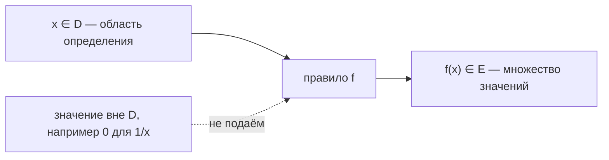

# Функции, графики, экспонента и логарифм

Вторая половина теории модуля. Первая — выражения, уравнения, системы — в
[`theory.md`](./theory.md). Общий словарь символов — в модуле 01:
[словарь обозначений](../01-numbers-and-arithmetic/theory.md#словарь-обозначений).

## Вспоминаем школу

Функция в школе была «`y` зависит от `x`», и рисовали её как линию на клетчатой бумаге.
Парабола, гипербола, прямая — набор картинок, которые надо было узнавать.

Логарифм был страшнее всего: `log₂ 8 = 3`, и никто толком не объяснил зачем. Хотя
объяснение помещается в одну строчку: **логарифм — это ответ на вопрос «в какую степень
надо возвести основание, чтобы получить это число»**. `log₂ 8 = 3`, потому что `2³ = 8`.
Всё. Логарифм — просто степень, только записанная с другого конца.

Что забывается первым:

1. **Функция — это правило, а не формула.** Формула — частый способ задать правило, но
   правило можно задать таблицей, графиком или куском кода.
2. **Один вход — ровно один выход.** Если правило на одном входе может дать два разных
   ответа, это не функция.
3. **`log(x + y)` не равно `log x + log y`.** Логарифм превращает в сумму *произведение*,
   а не сумму: `log(xy) = log x + log y`.

## Зачем программисту

- **Функция — это буквально код.** `func f(x float64) float64` и есть математическая
  функция, если она детерминирована и не лезет наружу. «Область определения» — это
  множество входов, на которых функция не паникует и не возвращает ошибку.
- **Форма графика — это интуиция про производительность.** `O(n)` — прямая, `O(n²)` —
  парабола, `O(log n)` — почти горизонтальная линия. Увидев замеры на графике, можно
  назвать класс роста, не читая код.
- **Экспонента — это retry backoff, рост нагрузки, размножение данных.** Задержки
  `1s, 2s, 4s, 8s` — это `2ⁿ`. Кэш с TTL и время полураспада — та же экспонента, только
  убывающая.
- **Логарифм — это «сколько раз можно поделить пополам».** Бинарный поиск, высота
  сбалансированного дерева, количество бит для хранения `N` значений, число уровней
  merge sort — везде `log₂`.
- **Логарифмическая шкала** — способ увидеть на одном графике и 10 мс, и 10 с. Все
  дашборды с латентностью так и рисуют.

## Простыми словами

**Функция — это машинка с одним входом и одним выходом.** Кинули число внутрь — вылезло
число. Одно и то же число на входе всегда даёт один и тот же результат.



**Экспонента — это «умножаем на одно и то же»**: каждый шаг увеличивает результат в
`a` раз. **Логарифм — обратная машинка**: он спрашивает «а сколько шагов было?».

Разница между линейным и экспоненциальным ростом чувствуется физически. Линейный рост —
это «каждый шаг прибавляем одинаковую величину»: очередь растёт на сто сообщений в
минуту. Экспоненциальный — «каждый шаг умножаем на одинаковую величину»: очередь растёт
вдвое за минуту. Первая ситуация неприятна, вторая — авария, и разница между ними
видна не сразу: за первые пять минут числа отличаются несильно, а за двадцать —
в тысячи раз. Способность отличить эти два режима по графику дежурства спасает больше
времени, чем любая формула.

Логарифм устроен зеркально и потому кажется «медленным до неприличия». Если умножить
аргумент в тысячу раз, логарифм по основанию 2 вырастет всего примерно на 10. Именно
это свойство делает логарифмическую сложность такой ценной: данные растут на порядки,
а работа — на единицы шагов.

Пара «возведение в степень ↔ логарифм» устроена как пара «умножение ↔ деление»: одно
отменяет другое.

```text
  2  ─возвели в степень 5─►  32
  32 ─взяли log₂──────────►  5
```

## Точнее

### Функция, область определения, множество значений

**Функция** `f` из множества `D` в множество `E` — правило, которое каждому элементу
`x ∈ D` сопоставляет **ровно один** элемент `f(x) ∈ E`.

- `D` — **область определения** (domain): все допустимые входы.
- `E` — множество, куда попадают результаты; фактически достигаемые значения называют
  **множеством значений** (range).
- Запись `f(x)` читается «эф от икс» — это *значение* функции в точке `x`, а не
  умножение `f` на `x`.

Ограничения области определения возникают из трёх запретов: деление на ноль,
чётный корень из отрицательного, логарифм неположительного.

| Функция | Область определения | Множество значений |
|---|---|---|
| `y = kx + b` | все числа | все числа (при `k ≠ 0`) |
| `y = x²` | все числа | `y ≥ 0` |
| `y = 1/x` | `x ≠ 0` | `y ≠ 0` |
| `y = √x` | `x ≥ 0` | `y ≥ 0` |
| `y = abs(x)`, то есть модуль | все числа | `y ≥ 0` |
| `y = aˣ` (`a > 0`) | все числа | `y > 0` |
| `y = log_a x` | `x > 0` | все числа |

Проверка «функция ли это» по графику — **тест вертикальной прямой**: если вертикальная
линия пересекает график больше одного раза, правило даёт два ответа на один вход, и это
не функция. Окружность `x² + y² = 1` этот тест не проходит.

### Пять базовых графиков

**Прямая `y = kx + b`.** `k` — угловой коэффициент (наклон): на сколько вырастет `y`,
если `x` вырастет на 1. `b` — сдвиг по вертикали, значение при `x = 0`. При `k > 0`
линия идёт вверх, при `k < 0` — вниз, при `k = 0` — горизонталь.

```text
  y
  6│                    ╱  y = 2x + 1
  4│              ╱
  2│        ╱
  1├──╱  ← b = 1, точка (0,1)
  0└──┬────┬────┬────┬──► x
     0    1    2    3
   наклон k = 2: шаг вправо на 1 поднимает на 2
```

**Парабола `y = x²`.** Симметрична относительно оси `y`, вершина в `(0, 0)`, растёт
всё быстрее. Ключевые точки: `(1, 1)`, `(2, 4)`, `(3, 9)`, `(−2, 4)`.

```text
  y
  9│  •                       •
  4│    •                  •
  1│      •            •
  0└────────•──────•──────────► x
    -3  -2  -1  0  1  2  3
```

**Гипербола `y = 1/x`.** Две ветви, в нуле не определена. При `x → 0` справа значение
улетает вверх, при больших `x` прижимается к нулю, но нуля не достигает. Прямые `x = 0`
и `y = 0` — **асимптоты**: линии, к которым график подходит сколь угодно близко.

```text
  y
  4│ •
  2│   •
  1│      •
  0├────────•───•───•──── асимптота y = 0
   │  ↑
   │  асимптота x = 0
   └──┬───┬───┬───┬──► x
     0.25 0.5  1   2
```

**Корень `y = √x`.** Половинка параболы, положенная набок: определён только при `x ≥ 0`,
растёт, но всё медленнее. Точки: `(0,0)`, `(1,1)`, `(4,2)`, `(9,3)`.

**Модуль `y = |x|`.** Галочка с изломом в нуле: при `x ≥ 0` это `y = x`, при `x < 0` —
`y = −x`. Значение всегда неотрицательно.

```text
  y
  3│ ╲                 ╱
  2│   ╲             ╱
  1│     ╲         ╱
  0└───────╲─────╱────────► x
    -3  -2  -1  0  1  2  3
```

### Экспонента

**Показательная функция**: `y = aˣ`, где `a > 0` и `a ≠ 1`. Переменная стоит
в показателе — этим она отличается от степенной `y = x²`, где переменная в основании.
Разница огромна: `x²` при удвоении `x` растёт вчетверо, а `2ˣ` при увеличении `x` на 1
удваивается.

Свойства (те же правила степеней, что в модуле 01):

```text
a⁰ = 1
aˣ · aʸ = aˣ⁺ʸ            — при умножении показатели складываются
aˣ / aʸ = aˣ⁻ʸ            — при делении вычитаются
(aˣ)ʸ = aˣ·ʸ              — при возведении в степень перемножаются
a⁻ˣ = 1/aˣ                — отрицательный показатель переворачивает дробь
```

При `a > 1` функция растёт, при `0 < a < 1` — убывает (это затухание). Значение всегда
строго положительно: `aˣ > 0` при любом `x`. Ноль недостижим: сколько ни умножай
положительное число на положительное, нуля не получишь — отсюда и горизонтальная
асимптота `y = 0` у убывающей экспоненты.

Насколько экспонента быстрее степенной функции, лучше всего видно в таблице:

| `x` | `x²` | `2ˣ` |
|---|---|---|
| 5 | 25 | 32 |
| 10 | 100 | 1024 |
| 20 | 400 | 1 048 576 |
| 40 | 1 600 | около 1.1 · 10¹² |
| 64 | 4 096 | около 1.8 · 10¹⁹ |

Последняя строка — это, кстати, ровно число значений, помещающихся в `uint64`. Именно
поэтому перебор всех 64-битных ключей невозможен, а перебор всех пар из 4096 элементов
делается за секунды: 10¹⁹ против 10⁷.

Особое основание — **`e ≈ 2.718281828`**, число Эйлера. Оно выбрано не из эстетики:
у функции `eˣ` скорость роста в каждой точке равна самому значению. Почему это важно и
что такое «скорость роста» — в
[`09-growth-and-calculus-intuition`](../09-growth-and-calculus-intuition/index.md).

### Логарифм

**Определение.** Для `a > 0`, `a ≠ 1` и `b > 0`:

```text
log_a(b) = c   ⇔   aᶜ = b
```

Читается «логарифм числа `b` по основанию `a`». Словами: «в какую степень нужно
возвести `a`, чтобы получить `b`». Ограничение `b > 0` — не каприз: `aᶜ` всегда
положительно, значит отрицательное `b` получить нельзя.

Обозначения, которые встретятся: `log₂` — двоичный, `ln` — натуральный (основание `e`),
`lg` или просто `log` — обычно десятичный, но в информатике `log` без индекса чаще всего
означает `log₂`. Если основание важно — пишите его явно.

**Законы логарифмов:**

```text
log_a(1) = 0                          — a⁰ = 1
log_a(a) = 1                          — a¹ = a
log_a(x·y) = log_a x + log_a y        — произведение → сумма
log_a(x/y) = log_a x − log_a y        — частное → разность
log_a(xⁿ) = n · log_a x               — степень → множитель
a^(log_a x) = x                       — возведение отменяет логарифм
log_a(aˣ) = x                         — и наоборот
```

Первый закон — сердце всего. Он и есть причина, по которой логарифмы вообще придумали:
до калькуляторов они превращали умножение больших чисел в сложение.

Проверить его можно на пальцах:

```text
log₂(8 · 4)
= log₂ 32                   — посчитали произведение
= 5                         — потому что 2⁵ = 32
log₂ 8 + log₂ 4
= 3 + 2                     — потому что 2³ = 8 и 2² = 4
= 5                         — совпало
```

**Переход к другому основанию:**

```text
log_a x = log_b x / log_b a
```

Пример: `log₂ 1000 = log₁₀ 1000 / log₁₀ 2 = 3 / 0.30103 ≈ 9.966`. Полезно, потому что
калькуляторы и стандартные библиотеки обычно дают только `ln` и `log₁₀`.

Из формулы перехода следует важное для программиста: **логарифмы по разным основаниям
отличаются только постоянным множителем**. `log₂ n = ln n / ln 2 ≈ 1.4427 · ln n`.
Множитель `1/ln a` не зависит от `n`. Поэтому в оценках сложности основание логарифма
не указывают: `O(log₂ n)` и `O(log₁₀ n)` — один и тот же класс, они отличаются в
постоянное число раз. Подробнее про то, что такое «класс роста» и почему константы
отбрасывают — в [`09-growth-and-calculus-intuition`](../09-growth-and-calculus-intuition/index.md).

**Логарифмическая шкала.** На обычной оси равные отрезки — равные *разности*
(0, 10, 20, 30). На логарифмической — равные *отношения* (1, 10, 100, 1000). Такая шкала
сжимает огромный диапазон в удобную картинку и превращает экспоненту в прямую: если
на лог-шкале данные легли на прямую, рост экспоненциальный.

```text
  обычная шкала:   1  2  3  4  5  6  7  8  9 10 ... 100 ......... 1000
  лог-шкала:       1 ──────── 10 ──────── 100 ──────── 1000
                     ×10        ×10         ×10   (равные отрезки)
```

## Разобранные примеры

**Пример 1. Область определения.** Найти, при каких `x` определено `f(x) = √(x − 3)/(x − 5)`.

```text
x − 3 ≥ 0        — под корнем должно быть неотрицательное
x ≥ 3            — решили
x − 5 ≠ 0        — знаменатель не ноль
x ≠ 5            — решили
ответ: x ≥ 3 и x ≠ 5
```

**Пример 2. Уравнение прямой по двум точкам.** Через `(1, 5)` и `(3, 11)`.

```text
k = (11 − 5)/(3 − 1)      — наклон это прирост y на прирост x
k = 6/2 = 3               — посчитали
5 = 3·1 + b               — подставили первую точку в y = kx + b
b = 2                     — выразили b
ответ: y = 3x + 2
```

Проверка второй точкой: `3·3 + 2 = 11`. Сходится.

**Пример 3. Свернуть выражение с логарифмами.**

```text
log₂ 40 − log₂ 5
= log₂ (40/5)             — разность логарифмов это логарифм частного
= log₂ 8                  — посчитали
= 3                       — потому что 2³ = 8
```

**Пример 4. Решить показательное уравнение `3 · 2ˣ = 96`.**

```text
2ˣ = 96/3                 — разделили обе части на 3
2ˣ = 32                   — посчитали
x = log₂ 32               — по определению логарифма
x = 5                     — потому что 2⁵ = 32
```

Проверка: `3 · 2⁵ = 3 · 32 = 96`. Верно.

**Пример 5. Сколько бит нужно для 1000 различных значений?**

```text
2ᵇ ≥ 1000                 — b бит кодируют 2ᵇ комбинаций
b ≥ log₂ 1000             — взяли логарифм от обеих частей
b ≥ 9.97                  — посчитали
b = 10                    — округлили вверх, бит целое
```

Округление вверх — это `⌈x⌉`, потолок; про него подробно в
[`01-numbers-and-arithmetic`](../01-numbers-and-arithmetic/theory.md).

**Пример 6. Логарифм числа меньше единицы.** Вычислить `log₅ 125 + log₅ (1/25)`.

```text
log₅ 125 = 3              — потому что 5³ = 125
log₅ (1/25) = log₅ 5⁻²    — записали 1/25 как степень с отрицательным показателем
             = −2         — потому что log_a(aˣ) = x
сумма = 3 + (−2) = 1
```

Проверка вторым способом, через закон произведения:

```text
log₅ 125 + log₅ (1/25)
= log₅ (125 · 1/25)       — сумма логарифмов это логарифм произведения
= log₅ 5                  — посчитали произведение
= 1                       — совпало
```

Отсюда общее правило, которое стоит запомнить отдельно: **логарифм числа между 0 и 1
отрицателен**, логарифм единицы равен нулю, логарифм числа больше единицы положителен
(при основании больше 1). Это ровно тот факт, который в задачах про затухание
переворачивает знак неравенства.

## В коде

Функция как отображение — это буквально функция в Go, а область определения
превращается в проверку входа:

```go
package main

import (
	"fmt"
	"math"
)

// f(x) = sqrt(x-3)/(x-5); domain: x >= 3 and x != 5.
func f(x float64) (float64, error) {
	if x < 3 || x == 5 {
		return 0, fmt.Errorf("x=%v is outside the domain", x)
	}
	return math.Sqrt(x-3) / (x - 5), nil
}

func main() {
	fmt.Println(f(4))  // 1 <nil>
	fmt.Println(f(2))  // 0 error
}
```

Проверка законов логарифма численно:

```go
package main

import (
	"fmt"
	"math"
)

func close(a, b float64) bool { return math.Abs(a-b) < 1e-9 }

func main() {
	x, y, n := 7.0, 3.0, 4.0
	fmt.Println(close(math.Log(x*y), math.Log(x)+math.Log(y)))   // true
	fmt.Println(close(math.Log(x/y), math.Log(x)-math.Log(y)))   // true
	fmt.Println(close(math.Log(math.Pow(x, n)), n*math.Log(x)))  // true
	fmt.Println(close(math.Exp(math.Log(x)), x))                 // true
}
```

`math.Log` в Go — натуральный логарифм; есть также `math.Log2` и `math.Log10`
(см. pkg.go.dev/math). Переход к другому основанию, если нужного нет под рукой:

```go
// logBase returns log_a(x) via the change-of-base formula.
func logBase(a, x float64) float64 {
	return math.Log(x) / math.Log(a)
}
```

«Сколько бит нужно для N значений» и «сколько шагов сделает бинарный поиск» — одна и
та же формула `⌈log₂ N⌉`, но у целочисленной версии есть точный вариант без
вещественной арифметики:

```go
package main

import (
	"fmt"
	"math/bits"
)

// bitsNeeded returns ceil(log2(n)) for n >= 1: bits to encode n distinct values.
func bitsNeeded(n uint) int {
	if n <= 1 {
		return 0
	}
	return bits.Len(n - 1)
}

func main() {
	fmt.Println(bitsNeeded(1000)) // 10
	fmt.Println(bitsNeeded(1024)) // 10
	fmt.Println(bitsNeeded(1025)) // 11
}
```

Целочисленный вариант надёжнее `int(math.Ceil(math.Log2(float64(n))))`: у второго на
больших точных степенях двойки бывает ошибка округления на единицу.

## Типичные ошибки

- **`log(x + y) = log x + log y`.** Неверно. В сумму раскладывается логарифм
  произведения. Проверьте: `log₂(2 + 2) = 2`, а `log₂ 2 + log₂ 2 = 2`... совпало
  случайно; возьмите `log₂(4 + 4) = 3`, а `log₂ 4 + log₂ 4 = 4`. Не совпало.
- **Логарифм от нуля или отрицательного.** Не существует: `aᶜ` всегда положительно.
  В коде это `NaN` или `-Inf`, а не паника — легко пропустить.
- **Путать `x²` и `2ˣ`.** При `x = 10` первое даёт `100`, второе — `1024`. При `x = 20`
  разница уже в 2600 раз.
- **`√(a + b) = √a + √b`.** Нет. `√(9 + 16) = 5`, а `3 + 4 = 7`.
- **Считать, что `y = 1/x` где-то достигает нуля.** Не достигает: асимптота — линия, к
  которой график только приближается.
- **Забыть, что `|x|` не имеет производной в нуле** и «излом» на графике реален: код
  вроде оптимизации по `|x|` в нуле ведёт себя не так, как по `x²`.
- **Сравнивать `float` через `==` после логарифмов и корней.** Используйте сравнение с
  допуском, как `close` в примерах выше.
- **Указывать основание логарифма в оценке сложности.** `O(log n)` без индекса — это
  не небрежность, а следствие формулы перехода к другому основанию.

## Шпаргалка формул

| Что | Формула | Условие |
|---|---|---|
| Прямая | `y = kx + b`, `k` — наклон, `b` — сдвиг | — |
| Наклон по двум точкам | `k = (y₂ − y₁)/(x₂ − x₁)` | `x₁ ≠ x₂` |
| Определение логарифма | `log_a b = c ⇔ aᶜ = b` | `a > 0`, `a ≠ 1`, `b > 0` |
| Логарифм произведения | `log_a(xy) = log_a x + log_a y` | `x, y > 0` |
| Логарифм частного | `log_a(x/y) = log_a x − log_a y` | `x, y > 0` |
| Логарифм степени | `log_a(xⁿ) = n · log_a x` | `x > 0` |
| Взаимная обратность | `a^(log_a x) = x`, `log_a(aˣ) = x` | `x > 0` |
| Смена основания | `log_a x = log_b x / log_b a` | `a, b ≠ 1` |
| Степени | `aˣ·aʸ = aˣ⁺ʸ`, `(aˣ)ʸ = aˣʸ`, `a⁻ˣ = 1/aˣ` | `a > 0` |
| Бит для `N` значений | `⌈log₂ N⌉` | `N ≥ 1` |

## Словарь терминов

| Термин | Значение |
|---|---|
| Функция | Правило: один вход → ровно один выход |
| `f(x)` | «эф от икс», значение функции в точке `x` |
| Область определения | Множество допустимых входов |
| Множество значений | Множество достижимых выходов |
| Аргумент | Вход функции |
| График | Множество точек `(x, f(x))` на плоскости |
| Асимптота | Прямая, к которой график приближается сколь угодно близко |
| Угловой коэффициент `k` | Наклон прямой: прирост `y` на единицу `x` |
| Показательная функция | `y = aˣ`, переменная в показателе |
| Степенная функция | `y = xⁿ`, переменная в основании |
| `e` | Число Эйлера, `≈ 2.71828` |
| `ln x` | Логарифм по основанию `e` |
| `log₂ x` | Логарифм по основанию 2 |
| Лог-шкала | Ось, где равные отрезки означают равные отношения |

## См. также

- Первая часть теории модуля — [`theory.md`](./theory.md).
- Степени, корни, потолок и пол — [`01-numbers-and-arithmetic`](../01-numbers-and-arithmetic/theory.md).
- Рост функций, big-O, логарифмы вглубь — [`09-growth-and-calculus-intuition`](../09-growth-and-calculus-intuition/index.md).
- Khan Academy, курсы *Algebra 2* (functions, exponential and logarithmic functions) — khanacademy.org.
- Paul's Online Math Notes, раздел *Algebra*, главы *Exponential and Logarithm Functions* — tutorial.math.lamar.edu.
- BetterExplained, статьи об интуиции для `e` и логарифмов — betterexplained.com.
- Документация пакета `math` — pkg.go.dev/math.
- Уроки модуля: [`lessons/02-functions-and-graphs.md`](./lessons/02-functions-and-graphs.md),
  [`lessons/03-exponent-and-logarithm.md`](./lessons/03-exponent-and-logarithm.md).
