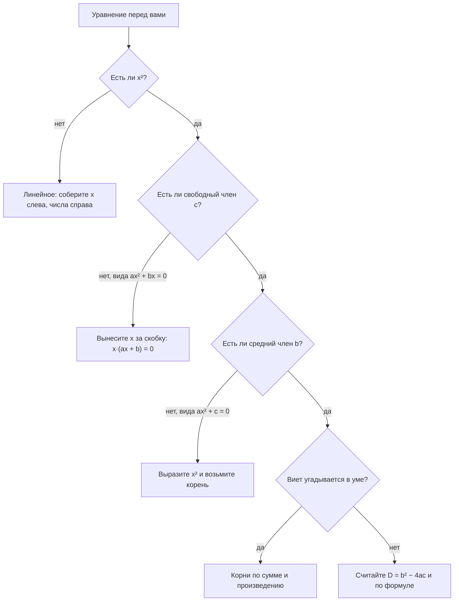

# Алгебра: выражения, уравнения, системы

Вторая часть теории модуля — функции, графики, экспонента и логарифм — лежит в
[`theory-2-functions-and-logarithms.md`](./theory-2-functions-and-logarithms.md).
Общий словарь символов (`Σ`, `∈`, `|x|`, `⌊x⌋`) живёт в модуле 01:
[словарь обозначений](../01-numbers-and-arithmetic/theory.md#словарь-обозначений).

## Вспоминаем школу

Вся алгебра выросла из одного приёма: **вместо конкретного числа пишем букву**.
Буква `x` означает «какое-то одно число, пока неизвестное, но одно и то же на
протяжении всей задачи». Это ровно то же самое, что переменная в коде: `x := ?`.

Дальше школа выдала набор ритуалов:

- «раскрыть скобки» — `3(x + 2)` превращается в `3x + 6`;
- «привести подобные» — `2x + 5x` это `7x`;
- «перенести через равно со сменой знака» — `x + 3 = 10` становится `x = 10 − 3`;
- «формулы сокращённого умножения» — `(a + b)²`, `a² − b²` и компания;
- «дискриминант» — `D = b² − 4ac`, и что-то про два корня;
- «система» — две строчки с фигурной скобкой слева.

Три факта, которые забываются первыми и потом дороже всего стоят:

1. **`(a + b)² ≠ a² + b²`.** Между ними теряется `2ab`. Это самая частая алгебраическая
   ошибка на свете, и она же — источник половины неверных оценок в head-math.
2. **При умножении или делении неравенства на отрицательное число знак
   переворачивается.** `−2x < 6` даёт `x > −3`, а не `x < −3`.
3. **Уравнение — это вопрос, а не команда.** `2x + 6 = 14` спрашивает: «при каком `x`
   левая часть равна правой?». Ответ можно и нужно проверить подстановкой.

## Зачем программисту

Алгебра — это навык «выразить одно через другое», и он работает каждый день.

- **Sizing и capacity planning.** «Каждый инстанс держит 800 rps, есть базовые 1200 rps
  накладных расходов, надо выдержать 20 000 rps» — это линейное уравнение
  `800n = 20000 − 1200`, а ответ `n = 23.5` надо ещё округлить вверх.
- **Границы и SLA.** «Сколько запросов в секунду можно принимать, чтобы p99 остался
  ниже 200 мс» — это неравенство, и знак в нём легко перевернуть по невнимательности.
- **Пересчёт единиц и масштабирование.** Пропорция «на 3 пода 12 ГБ, сколько на 7» —
  это `12/3 = x/7`.
- **Квадратные уравнения** появляются там, где что-то растёт квадратично: число пар в
  множестве из `n` элементов — `n(n − 1)/2`, и вопрос «при каком `n` пар будет больше
  миллиона» — это квадратное неравенство.
- **Системы уравнений** — прямой предок линейной алгебры
  ([`10-linear-algebra-basics`](../10-linear-algebra-basics/index.md)): решить систему
  из двух уравнений руками полезно ровно для того, чтобы потом понимать, что делает
  матрица.
- **Разложение на множители** — это способ увидеть структуру выражения. `n² − 1` в коде
  выглядит бессмысленно, а `(n − 1)(n + 1)` уже подсказывает, что при `n = 1` всё
  обнуляется.

## Простыми словами

**Выражение** — это рецепт вычисления: `2x + 6`. Дайте ему `x`, оно вернёт число.
В коде это чистая функция от `x`.

**Уравнение** — это утверждение, что два рецепта дают одинаковый результат:
`2x + 6 = 14`. Оно верно не всегда, а только при некоторых `x`. Найти эти `x` и значит
«решить уравнение».

**Тождество** — утверждение, верное при *любых* значениях букв: `(a + b)² = a² + 2ab + b²`
верно всегда, для любых `a` и `b`. Формулы сокращённого умножения — это тождества.
Их не решают, ими пользуются.

Полезная картинка для уравнения: **весы**. Слева одна чаша, справа другая, они в
равновесии. Что бы вы ни сделали с одной чашей, сделайте то же с другой — равновесие
сохранится. Прибавить 5 к обеим частям, умножить обе части на 3, вычесть `x` из обеих
частей — всё это законно.

Неравенство — те же весы, но перекошенные: одна чаша тяжелее. Прибавление одинакового
груза в обе чаши перекос не меняет. А вот умножение обеих частей на отрицательное
число — это как перевернуть весь рисунок вверх ногами: перекос меняет направление.

## Точнее

### Выражения, слагаемые, подобные

Выражение состоит из **слагаемых** (terms), разделённых знаками `+` и `−`. В слагаемом
`7x²` число `7` — это **коэффициент**, `x²` — буквенная часть.

**Подобные слагаемые** — те, у которых буквенная часть совпадает целиком, включая
степени. `3x` и `5x` подобны, `3x` и `5x²` — нет, `3xy` и `5yx` подобны (порядок
множителей не важен). Приводить подобные — значит складывать их коэффициенты.

**Распределительный закон** (он же «раскрытие скобок»):

```text
a(b + c) = ab + ac          — умножаем на каждое слагаемое внутри
a(b − c) = ab − ac          — минус тоже «раздаётся»
−(b + c) = −b − c           — минус перед скобкой меняет знак каждого слагаемого
```

Последняя строчка — источник бесконечных ошибок. `5 − (x + 2)` это `5 − x − 2 = 3 − x`,
а не `5 − x + 2`.

Умножение двух скобок — распределительный закон, применённый дважды: каждое слагаемое
первой скобки умножается на каждое слагаемое второй.

```text
(a + b)(c + d)
= a(c + d) + b(c + d)        — раскрыли по первой скобке
= ac + ad + bc + bd          — раскрыли обе оставшиеся
```

### Формулы сокращённого умножения

Это просто заранее посчитанные результаты частых умножений. Символ `±` читается «плюс
или минус» и означает две формулы сразу: одну со знаком `+`, другую со знаком `−`.

| Формула | Раскрытая форма |
|---|---|
| `(a + b)²` | `a² + 2ab + b²` |
| `(a − b)²` | `a² − 2ab + b²` |
| `(a + b)(a − b)` | `a² − b²` |
| `(a + b)³` | `a³ + 3a²b + 3ab² + b³` |
| `(a − b)³` | `a³ − 3a²b + 3ab² − b³` |
| `a³ + b³` | `(a + b)(a² − ab + b²)` |
| `a³ − b³` | `(a − b)(a² + ab + b²)` |

Первую формулу не обязательно помнить — её видно. Квадрат стороны `a + b`
разрезается на четыре куска:

```text
        a          b
     +-------+---------+
   a |  a·a  |   a·b   |
     +-------+---------+
   b |  b·a  |   b·b   |
     +-------+---------+

  площадь всего квадрата = a² + ab + ba + b² = a² + 2ab + b²
```

Два прямоугольника `a·b` — это и есть тот самый `2ab`, который теряют.

Разность квадратов `a² − b² = (a − b)(a + b)` проверяется раскрытием:

```text
(a − b)(a + b)
= a·a + a·b − b·a − b·b     — раскрыли обе скобки
= a² + ab − ab − b²         — переставили множители
= a² − b²                   — средние слагаемые взаимно уничтожились
```

### Разложение на множители

Разложить на множители — превратить сумму в произведение. Три рабочих приёма:

1. **Вынести общий множитель.** `6x² + 9x = 3x(2x + 3)`.
2. **Узнать формулу.** `x² − 25 = x² − 5² = (x − 5)(x + 5)`.
3. **Группировка.** `x³ + x² + x + 1 = x²(x + 1) + 1(x + 1) = (x + 1)(x² + 1)`.

И четвёртый, самый универсальный для квадратного трёхчлена: если `x₁` и `x₂` — корни
уравнения `ax² + bx + c = 0`, то `ax² + bx + c = a(x − x₁)(x − x₂)`. Запись `x₁`
читается «икс первое», нижний индекс — просто номер, а не степень.

### Линейные уравнения

**Линейное уравнение** — уравнение вида `ax + b = 0`, где `x` в первой степени.
Если `a ≠ 0` (`≠` читается «не равно»), решение единственное: `x = −b/a`.

Законные (равносильные) преобразования — те, что не меняют множество решений:

- прибавить или вычесть одно и то же число (или выражение) из обеих частей;
- умножить или разделить обе части на **ненулевое** число;
- раскрыть скобки и привести подобные внутри любой части.

Два вырожденных случая стоит знать: `0·x = 0` верно при любом `x` (бесконечно много
решений), `0·x = 5` неверно никогда (решений нет).

### Неравенства

Знаки: `<` меньше, `>` больше, `≤` «меньше или равно», `≥` «больше или равно».

Правила почти те же, что для уравнений, но с одним исключением:

```text
a < b  ⇒  a + c < b + c              — прибавили одно и то же, знак сохранился
a < b  и  c > 0  ⇒  a·c < b·c        — умножили на положительное, знак сохранился
a < b  и  c < 0  ⇒  a·c > b·c        — умножили на отрицательное, знак ПЕРЕВЕРНУЛСЯ
```

Символ `⇒` читается «следовательно», `⇔` — «равносильно, тогда и только тогда».

Почему знак переворачивается — видно на числовой прямой. Умножение на `−1` зеркально
отражает прямую относительно нуля, и то, что было левее, становится правее:

```text
            −5    −3     0     3     5
  ──────────┼─────┼──────┼─────┼─────┼──────►
             \     \           /     /
              \     \         /     /
   отражение:  3 < 5  становится  −3 > −5
```

Проверить всегда можно числами: `3 < 5`, умножаем обе части на `−2`, получаем `−6` и
`−10`. И действительно `−6 > −10`. Знак пришлось перевернуть.

Ответ у неравенства — не одно число, а промежуток. Записи: `x > 2` то же самое, что
`x ∈ (2; +∞)`. Символ `∈` читается «принадлежит». Круглая скобка означает, что край
не включён, квадратная — включён: `x ≤ 7` это `x ∈ (−∞; 7]`.

### Системы двух линейных уравнений

Система — это требование, чтобы **оба** уравнения выполнялись одновременно:

```text
{ 2x + y = 7
{ x − y = 2
```

**Способ подстановки:** выражаем одну переменную из одного уравнения и подставляем во
второе. **Способ сложения (elimination):** складываем или вычитаем уравнения так, чтобы
одна переменная исчезла. Второй способ обычно быстрее, если коэффициенты удобные.

Геометрический смысл: каждое линейное уравнение с двумя неизвестными — это прямая на
плоскости. Решение системы — точка их пересечения. Отсюда ровно три случая:

- прямые пересекаются в одной точке — одно решение;
- прямые параллельны — решений нет (получится противоречие вида `0 = 5`);
- прямые совпали — бесконечно много решений (получится тождество `0 = 0`).

### Квадратные уравнения

**Квадратное уравнение**: `ax² + bx + c = 0`, где `a ≠ 0`. Число `a` — старший
коэффициент, `b` — средний, `c` — свободный член.

**Дискриминант**: `D = b² − 4ac`. Слово означает «различитель»: он различает случаи.

```text
D > 0  →  два разных корня:  x = (−b + √D)/(2a)  и  x = (−b − √D)/(2a)
D = 0  →  один корень:       x = −b/(2a)
D < 0  →  вещественных корней нет (√ от отрицательного не берётся)
```

Откуда берётся формула — из **выделения полного квадрата**. Это не магия, это честный
вывод, который стоит увидеть один раз:

```text
ax² + bx + c = 0
x² + (b/a)·x + c/a = 0            — разделили всё на a, можно, так как a ≠ 0
x² + 2·(b/(2a))·x + c/a = 0       — переписали средний член как 2·(b/(2a))·x
(x + b/(2a))² − (b/(2a))² + c/a = 0   — свернули в квадрат и вычли лишнее
(x + b/(2a))² = b²/(4a²) − c/a    — перенесли остальное вправо
(x + b/(2a))² = (b² − 4ac)/(4a²)  — привели к общему знаменателю 4a²
x + b/(2a) = ±√(b² − 4ac)/(2a)    — взяли корень из обеих частей
x = (−b ± √(b² − 4ac))/(2a)       — перенесли b/(2a) вправо
```

**Формулы Виета** для приведённого уравнения `x² + px + q = 0` (то есть при `a = 1`):

```text
x₁ + x₂ = −p       — сумма корней
x₁ · x₂ = q        — произведение корней
```

Для общего вида: `x₁ + x₂ = −b/a`, `x₁ · x₂ = c/a`. Виет — быстрый способ угадать корни
целыми числами: для `x² − 5x + 6 = 0` ищем два числа с суммой `5` и произведением `6`.
Это `2` и `3`. Дискриминант считать не пришлось.

Какой способ выбрать:



### Пропорции и отношения

**Отношение** `a` к `b` — это дробь `a/b`. Запись «2 к 3» означает `a/b = 2/3`.

**Пропорция** — равенство двух отношений. Главное свойство:

```text
a/b = c/d   ⇔   a·d = b·c        — при b ≠ 0 и d ≠ 0
```

Это и есть «умножение крест-накрест». Из него получаются все пересчёты: если известны
три числа из четырёх, четвёртое находится одним умножением и одним делением.

Масштабирование: если все части увеличить в `k` раз, отношение не изменится — `(ka)/(kb) = a/b`.
Именно поэтому «60% пользователей» — величина, не зависящая от того, тысяча их или
миллион.

## Разобранные примеры

**Пример 1. Линейное уравнение со скобками и дробью.**

```text
3(x − 2) = (x + 4)/2
6(x − 2) = x + 4        — умножили обе части на 2, чтобы убрать дробь
6x − 12 = x + 4         — раскрыли скобку слева
6x − x = 4 + 12         — собрали x слева, числа справа
5x = 16                 — привели подобные
x = 16/5 = 3.2          — разделили обе части на 5
```

Проверка: слева `3(3.2 − 2) = 3 · 1.2 = 3.6`, справа `(3.2 + 4)/2 = 7.2/2 = 3.6`. Сходится.

**Пример 2. Неравенство с переворотом знака.**

```text
7 − 4x ≥ 19
−4x ≥ 19 − 7            — вычли 7 из обеих частей
−4x ≥ 12                — посчитали
x ≤ 12/(−4)             — разделили на −4, знак ≥ стал ≤
x ≤ −3                  — посчитали
```

Проверка граничной точкой: при `x = −3` слева `7 + 12 = 19`, равно правой части, годится.
Проверка точкой внутри: при `x = −4` слева `7 + 16 = 23 ≥ 19`, верно. Проверка снаружи:
при `x = 0` слева `7 ≥ 19` — неверно, значит `x = 0` в ответ не входит. Всё сходится.

**Пример 3. Квадратное уравнение.**

```text
2x² − 7x + 3 = 0
D = (−7)² − 4·2·3       — подставили a = 2, b = −7, c = 3
D = 49 − 24 = 25        — посчитали
√D = 5                  — корень из 25
x = (7 ± 5)/(2·2)       — минус на минус дал +7 в числителе
x₁ = 12/4 = 3           — вариант со знаком +
x₂ = 2/4 = 0.5          — вариант со знаком −
```

Проверка по Виету: `x₁ + x₂ = 3.5`, и `−b/a = 7/2 = 3.5`. Произведение `3 · 0.5 = 1.5`,
и `c/a = 3/2 = 1.5`. Оба совпали.

**Пример 4. Система способом сложения.**

```text
{ 2x + y = 7
{ x − y = 2
3x = 9                  — сложили уравнения почленно, y исчез: y + (−y) = 0
x = 3                   — разделили на 3
3 − y = 2               — подставили x = 3 во второе уравнение
y = 1                   — перенесли и посчитали
```

Проверка в первом уравнении: `2·3 + 1 = 7`. Верно.

**Пример 5. Пропорция.**

Три пода занимают 12 ГБ. Сколько займут семь при той же нагрузке на под?

```text
12/3 = x/7              — записали пропорцию
12 · 7 = 3 · x          — крест-накрест
84 = 3x                 — посчитали
x = 28                  — разделили на 3
```

## В коде

Формулы удобны тем, что их можно проверить перебором. Тождество — это утверждение
«верно всегда», и хотя перебор не доказывает его строго, он мгновенно ловит опечатку.

Проверка `(a + b)² = a² + 2ab + b²` и `a² − b² = (a − b)(a + b)`:

```go
package main

import "fmt"

func main() {
	for a := -20; a <= 20; a++ {
		for b := -20; b <= 20; b++ {
			if (a+b)*(a+b) != a*a+2*a*b+b*b {
				fmt.Println("square identity broken at", a, b)
			}
			if a*a-b*b != (a-b)*(a+b) {
				fmt.Println("difference identity broken at", a, b)
			}
		}
	}
	fmt.Println("all identities hold")
}
```

Решение квадратного уравнения — прямая запись формулы, включая случай `D < 0`:

```go
package main

import (
	"fmt"
	"math"
)

// roots returns the real roots of a*x^2 + b*x + c = 0; for d == 0 both are equal.
func roots(a, b, c float64) []float64 {
	d := b*b - 4*a*c
	if d < 0 {
		return nil
	}
	s := math.Sqrt(d)
	return []float64{(-b + s) / (2 * a), (-b - s) / (2 * a)}
}

func main() {
	fmt.Println(roots(2, -7, 3)) // [3 0.5]
}
```

Переворот знака в неравенстве тоже проверяется кодом — полезно один раз увидеть,
что это не соглашение, а факт:

```go
package main

import "fmt"

func main() {
	// If a < b and c < 0, then a*c > b*c.
	for a := -10; a <= 10; a++ {
		for b := a + 1; b <= 10; b++ { // a < b
			for c := -5; c < 0; c++ { // c < 0
				if !(a*c > b*c) {
					fmt.Println("flip rule broken at", a, b, c)
				}
			}
		}
	}
	fmt.Println("flip rule holds")
}
```

Проверка формул Виета для найденных корней:

```python
import math

def check_vieta(a, b, c):
    d = b * b - 4 * a * c
    s = math.sqrt(d)
    x1, x2 = (-b + s) / (2 * a), (-b - s) / (2 * a)
    assert math.isclose(x1 + x2, -b / a, abs_tol=1e-9)
    assert math.isclose(x1 * x2, c / a, abs_tol=1e-9)
    return x1, x2

print(check_vieta(2, -7, 3))  # (3.0, 0.5)
```

Сравнение вещественных чисел здесь идёт через `isclose`, а не через `==`: точное
равенство для `float` почти всегда ложь. Подробности — в
[`01-numbers-and-arithmetic`](../01-numbers-and-arithmetic/theory.md).

## Типичные ошибки

- **`(a + b)² = a² + b²`.** Нет. Потеряно `2ab`. Проверьте на `a = b = 1`: слева `4`,
  справа `2`.
- **Забыть сменить знаки после минуса перед скобкой.** `5 − (x + 2)` это `3 − x`.
- **Не перевернуть знак неравенства** при делении на отрицательное. Спасение —
  подставить любое число из полученного ответа обратно в исходное неравенство.
- **Делить на выражение, которое может быть нулём.** Из `x² = x` нельзя сократить на `x`
  и получить `x = 1`: так теряется корень `x = 0`. Правильно — перенести всё влево и
  разложить: `x(x − 1) = 0`.
- **Путать `x₁` и `x¹`.** Нижний индекс — номер, верхний — степень.
- **Знак `b` в дискриминанте.** В `2x² − 7x + 3` коэффициент `b = −7`, и `b² = 49`,
  а не `−49`. Квадрат отрицательного числа положителен.
- **«Решил» — и не проверил.** Подстановка ответа обратно занимает пятнадцать секунд и
  ловит почти любую арифметическую опечатку.
- **Сокращать в дроби слагаемые, а не множители.** В `(x + 3)/3` тройки не сокращаются:
  сокращать можно только общий множитель всего числителя и знаменателя.

## Шпаргалка формул

| Что | Формула | Условие |
|---|---|---|
| Раскрытие скобок | `a(b + c) = ab + ac` | — |
| Квадрат суммы | `(a + b)² = a² + 2ab + b²` | — |
| Квадрат разности | `(a − b)² = a² − 2ab + b²` | — |
| Разность квадратов | `a² − b² = (a − b)(a + b)` | — |
| Куб суммы | `(a + b)³ = a³ + 3a²b + 3ab² + b³` | — |
| Куб разности | `(a − b)³ = a³ − 3a²b + 3ab² − b³` | — |
| Сумма кубов | `a³ + b³ = (a + b)(a² − ab + b²)` | — |
| Разность кубов | `a³ − b³ = (a − b)(a² + ab + b²)` | — |
| Линейное уравнение | `x = −b/a` | `a ≠ 0` |
| Дискриминант | `D = b² − 4ac` | — |
| Корни квадратного | `x = (−b ± √D)/(2a)` | `D ≥ 0`, `a ≠ 0` |
| Виет | `x₁ + x₂ = −b/a`, `x₁·x₂ = c/a` | `D ≥ 0`, `a ≠ 0` |
| Разложение трёхчлена | `ax² + bx + c = a(x − x₁)(x − x₂)` | `D ≥ 0` |
| Пропорция | `a/b = c/d ⇔ ad = bc` | `b ≠ 0`, `d ≠ 0` |
| Знак неравенства | `a < b`, `c < 0 ⇒ ac > bc` | — |

## Словарь терминов

| Термин | Значение |
|---|---|
| Переменная | Буква, обозначающая пока неизвестное число |
| Выражение | Рецепт вычисления: `2x + 6` |
| Уравнение | Утверждение о равенстве двух выражений при некоторых значениях |
| Тождество | Равенство, верное при любых значениях букв |
| Коэффициент | Числовой множитель при буквенной части |
| Подобные слагаемые | Слагаемые с одинаковой буквенной частью |
| Корень уравнения | Значение переменной, при котором уравнение верно |
| Дискриминант | `D = b² − 4ac`, различает число корней |
| Система | Требование, чтобы несколько уравнений выполнялись одновременно |
| Пропорция | Равенство двух отношений |
| `≠` | «не равно» |
| `≤`, `≥` | «меньше или равно», «больше или равно» |
| `±` | «плюс или минус»: два варианта сразу |
| `⇒`, `⇔` | «следует», «равносильно» |
| `∈` | «принадлежит» |
| `x₁` | «икс первое», нижний индекс — номер |

## См. также

- Продолжение теории модуля — [`theory-2-functions-and-logarithms.md`](./theory-2-functions-and-logarithms.md).
- Дроби, степени, порядок действий — [`01-numbers-and-arithmetic`](../01-numbers-and-arithmetic/theory.md).
- Системы уравнений в матричном виде — [`10-linear-algebra-basics`](../10-linear-algebra-basics/index.md).
- Khan Academy, курсы *Algebra 1* и *Algebra 2* — khanacademy.org.
- Paul's Online Math Notes, раздел *Algebra* — tutorial.math.lamar.edu.
- Paul Orland, *Math for Programmers* (Manning, 2020) — математика с проверкой кодом.
- Уроки модуля: [`lessons/01-solving-equations.md`](./lessons/01-solving-equations.md).
