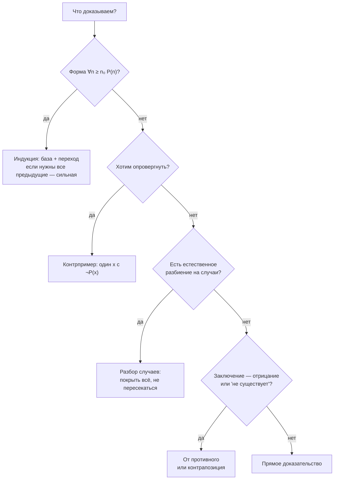

# Техники доказательства: прямое, от противного, индукция

Продолжение [`theory.md`](./theory.md). Там были инструменты — связки, импликация,
кванторы. Здесь — то, что ими строят: аккуратное рассуждение, которое убеждает не
только автора.

## Вспоминаем школу

Слово «доказательство» у большинства связано с геометрией: «Дано… Доказать… Решение…
Что и требовалось доказать». Ощущение осталось скорее неприятное — казалось, что нужно
угадать нужную дополнительную линию, и либо ты её видишь, либо нет.

Хорошая новость: угадывать почти не нужно. Техник ровно пять штук, они перечислимы, и
выбор между ними делается почти механически — по форме утверждения. То, что в школе
выглядело озарением, обычно было просто «примени контрапозицию» или «разбери два случая».

Что стоит вспомнить из школы:

- **«Что и требовалось доказать»** (лат. QED) — маркер конца, не магия.
- **Контрпример** убивает утверждение целиком. Одного достаточно.
- **Индукция** («метод математической индукции») — та самая штука с «предположим, что
  верно для n, докажем для n+1». В школе она казалась жульничеством: мы что,
  предполагаем то, что доказываем? Нет — и ниже разберём, почему.

## Зачем программисту

- **Инварианты цикла.** Утверждение «после k-й итерации `sum` равна сумме первых k
  элементов» — доказывается ровно индукцией. Если вы умеете это формулировать, вы
  находите off-by-one ошибки глазами, до запуска тестов.
- **Рекурсия.** Рекурсивная функция корректна по тем же причинам, по которым работает
  индукция: база + шаг. «Доказать функцию» = «проверить базовый случай и переход».
- **Тесты не доказывают — они опровергают.** Прошедший тест не гарантирует ничего;
  упавший тест — это контрпример, и он окончателен. Понимание этой асимметрии меняет
  отношение к тестам.
- **Код-ревью и споры в PR.** «Этот код не может уйти в бесконечный цикл, потому что
  на каждой итерации `hi - lo` строго убывает и ограничено снизу нулём» — это
  доказательство, и оно закрывает спор.
- **Чтение документации.** «Гарантируется, что для любого валидного ключа существует
  ровно одна запись» — вы уже умеете разбирать структуру кванторов; техники
  доказательства учат понимать, что автор обязан был показать.

## Простыми словами

Доказательство — это цепочка шагов, где каждый следующий шаг проверяемо следует из
предыдущих и из того, что мы уже приняли за правду. Не «я так чувствую», а «вот шаг,
вот его причина». Ровно как в разборах из первой части: одна строка — одно
преобразование — одна причина.

Почти всё, что доказывают, имеет форму импликации `p ⇒ q`: «если дано p, то верно q».
Отсюда и техники: их можно рассортировать по тому, с какой стороны они заходят на
эту импликацию.

- **Прямое доказательство** — начать с `p` и дойти до `q`.
- **Контрапозиция** — доказать `¬q ⇒ ¬p`; это то же самое утверждение (см.
  [`theory.md`](./theory.md)), но иногда идти с этой стороны проще.
- **От противного** — предположить `p ∧ ¬q` и получить чепуху.
- **Разбор случаев** — разбить все возможности на конечное число ситуаций и проверить каждую.
- **Индукция** — для утверждений вида `∀n ≥ n₀`: доказать для старта и доказать переход.

И отдельно — **контрпример**, техника не доказательства, а опровержения.

Выбор техники — не вопрос вкуса и не озарение. Посмотрите на форму утверждения:
есть ли в нём «для всех n, начиная с …» (индукция), есть ли естественное разбиение
на конечное число ситуаций (случаи), содержит ли заключение отрицание или слово
«не существует» (контрапозиция или от противного). Если ни одна подсказка не сработала,
пробуйте прямое — оно самое дешёвое и чаще всего достаточное. Небольшая, но важная
привычка: прежде чем доказывать, выпишите отдельными строками, что дано и что требуется
получить. Половина «непонятных» задач становится понятной именно на этом шаге, потому
что там обычно и прячется пропущенное условие.

И ещё: доказательство пишется для читателя, а не для себя. Строка без причины —
это не шаг, а надежда. Формат «одно преобразование — одна причина после тире» дисциплинирует
лучше любых правил оформления, потому что не даёт незаметно проскочить место, где вы
на самом деле не уверены.

## Точнее

### Прямое доказательство

Схема: предполагаем `p`, применяем определения и уже доказанные факты, приходим к `q`.

**Утверждение.** Если `n` чётное, то `n²` чётное.

```text
n чётное                        — посылка
n = 2k для некоторого целого k  — определение чётности
n² = (2k)² = 4k²                — подставили и возвели в квадрат
n² = 2·(2k²)                    — вынесли 2
2k² — целое                     — произведение целых чисел целое
n² чётное                       — определение чётности, что и требовалось
```

Работает, когда из посылки легко «раскручивать» определения вперёд.

### Доказательство контрапозицией

Схема: вместо `p ⇒ q` доказываем `¬q ⇒ ¬p`. Это законно, потому что формулы
равносильны (вывод — в [`theory.md`](./theory.md)).

**Утверждение.** Если `n²` чётное, то `n` чётное.

Прямо это неудобно: из «n² = 2m» вытащить структуру `n` тяжело. Контрапозиция:

```text
Докажем: n нечётное ⇒ n² нечётное   — контрапозиция исходного
n нечётное                          — предположение
n = 2k + 1                          — определение нечётности
n² = 4k² + 4k + 1                   — раскрыли квадрат
n² = 2·(2k² + 2k) + 1               — вынесли 2, остался остаток 1
n² нечётное                         — определение нечётности
Значит, исходное утверждение верно  — контрапозиция равносильна исходному
```

Признак «здесь нужна контрапозиция»: заключение содержит отрицание или свойство,
которое трудно использовать напрямую, а посылка — наоборот, легко «разбирается».

### Доказательство от противного

Схема: предполагаем, что утверждение ложно, и выводим противоречие — что-то вида
`r ∧ ¬r`. Раз предположение ведёт к невозможному, оно ложно, а значит, утверждение верно.

Для импликации отрицание, как мы знаем, это `p ∧ ¬q`: «посылка верна, а заключение нет».

**Классика: √2 — иррациональное число** (то есть не представимо как дробь `a/b` с целыми
`a`, `b`).

```text
Предположим, √2 = a/b                   — отрицание утверждения
дробь a/b несократима                   — любую дробь можно сократить до несократимой
2 = a²/b²                               — возвели обе части в квадрат
a² = 2b²                                — умножили на b²
a² чётное                               — равно 2·(целое)
a чётное                                — доказано выше контрапозицией
a = 2c                                  — определение чётности
(2c)² = 2b², то есть 4c² = 2b²          — подставили
b² = 2c²                                — сократили на 2
b² чётное, значит b чётное              — тот же аргумент, что и для a
a и b оба чётные                        — противоречие: дробь была несократима
```

Получили `r ∧ ¬r` («дробь несократима» и «дробь сократима»). Значит, предположение
неверно и `√2` иррационально.

**Второй классический пример — простых чисел бесконечно много** (набросок, доказательство
Евклида). Предположим, что простых конечное число: `p₁, p₂, …, pₖ`. Рассмотрим
`N = p₁·p₂·…·pₖ + 1`. При делении на любое `pᵢ` число `N` даёт остаток 1, то есть не
делится ни на одно простое из списка. Но у любого числа больше 1 есть простой делитель.
Значит, есть простое вне списка — противоречие со словом «все». Полный разбор делимости
и простых — в модуле
[`05-number-theory-and-binary`](../05-number-theory-and-binary/index.md).

Осторожно: «от противного» легко превращается в «я запутался и назвал это
противоречием». Если противоречие не получилось за несколько шагов — скорее всего,
техника выбрана не та.

### Разбор случаев

Схема: разбиваем все возможности на конечное число взаимоисключающих и покрывающих всё
случаев, доказываем в каждом. Ключевые слова — «взаимоисключающих» (не пересекаются) и
«покрывающих всё» (ничего не потеряли).

**Утверждение.** Для любого целого `n` произведение `n·(n + 1)` чётно.

```text
Случай 1: n чётное
  n = 2k, значит n·(n+1) = 2k·(n+1) — множитель 2 на месте, произведение чётно
Случай 2: n нечётное
  n + 1 чётное, n + 1 = 2m, значит n·(n+1) = n·2m — снова множитель 2
Других случаев нет: целое число либо чётно, либо нечётно
```

В коде это ровно `switch`, где вы обязаны покрыть все ветки, включая `default`.

### Математическая индукция

Индукция доказывает утверждения вида `∀n ≥ n₀ P(n)` — «для всех натуральных n,
начиная с n₀». Схема из двух шагов:

1. **База.** Доказать `P(n₀)` — обычно `P(0)` или `P(1)`, подстановкой.
2. **Индукционный переход.** Доказать `∀k ≥ n₀ (P(k) ⇒ P(k+1))`: **если** верно для `k`,
   **то** верно для `k+1`.

Почему это не жульничество: на втором шаге мы не предполагаем то, что доказываем.
Мы доказываем импликацию `P(k) ⇒ P(k+1)`, а импликация ничего не утверждает про
истинность посылки. Мы строим лестницу: база — первая ступенька, переход — гарантия,
что с любой ступеньки можно шагнуть на следующую. Вместе они дают все ступеньки.

**Аналогия с циклом.** Индукция — это `for`-цикл, который вы доказываете, а не запускаете:

```text
база          ↔  состояние перед входом в цикл (инициализация)
переход       ↔  тело цикла: если инвариант верен до итерации, он верен после
вывод ∀n P(n) ↔  инвариант верен после любого числа итераций, в том числе на выходе
```

Именно поэтому доказательство корректности цикла и индукция — одно и то же упражнение,
записанное разными словами. Про рекуррентные соотношения — `T(n) = 2·T(n/2) + n` и
подобные — отдельный разговор в модуле
[`11-graphs-recurrences-automata`](../11-graphs-recurrences-automata/index.md).

**Сильная индукция.** Иногда `P(k+1)` не выводится из одного `P(k)`, но выводится из
«всех предыдущих сразу». Тогда переход формулируют так: «пусть `P(m)` верно для всех
`n₀ ≤ m ≤ k`; докажем `P(k+1)`». Это называется сильной (полной) индукцией, и она не
сильнее обычной — просто удобнее. Типичный случай: доказательство, что любое целое `n > 1`
раскладывается на простые множители: `n` либо простое (база), либо `n = a·b` с
`1 < a, b < n`, и мы пользуемся утверждением сразу для обоих меньших чисел. Рекурсия
вида «разделяй и властвуй» доказывается именно сильной индукцией: `mergeSort` на массиве
длины `n` опирается на корректность себя же на длинах `n/2`, а не на `n - 1`.

### Почему индукция вообще работает

Разумный вопрос: откуда взялось право делать вывод «база + переход ⇒ верно для всех»?
Это не теорема, которую доказывают внутри арифметики, а свойство натуральных чисел,
принимаемое как аксиома. Эквивалентная и более наглядная формулировка — **принцип
наименьшего элемента**: в любом непустом множестве натуральных чисел есть наименьший
элемент.

Отсюда индукция получается доказательством от противного за три строки. Пусть база и
переход доказаны, но `P(n)` верно не для всех `n`. Тогда множество «плохих» `n`
непусто, а значит, в нём есть наименьший — назовём его `m`. Это `m` не равно `n₀`,
потому что `P(n₀)` доказано базой; значит, `m > n₀` и `m - 1` уже не плохое, то есть
`P(m - 1)` верно. Но переход даёт `P(m - 1) ⇒ P(m)`, откуда `P(m)` верно —
противоречие с тем, что `m` плохое. Плохих чисел нет.

Тот же принцип наименьшего элемента — причина, по которой цикл с неотрицательным строго
убывающим счётчиком обязан завершиться: бесконечная строго убывающая последовательность
натуральных чисел не существует, иначе у множества её значений не было бы наименьшего
элемента.

### Опровержение контрпримером

Чтобы опровергнуть `∀x P(x)`, достаточно предъявить один `x` с `¬P(x)`. Это прямое
следствие правила `¬∀x P(x) = ∃x ¬P(x)`.

Знаменитый пример: `n² + n + 41` даёт простое число при `n = 0, 1, 2, …, 39`. Сорок
подтверждений подряд — и всё равно утверждение «для любого n это простое» ложно: при
`n = 40` получаем `40² + 40 + 41 = 1681 = 41²`. Это же и мораль про тесты: сколько бы
зелёных прогонов ни было, они не доказывают. Один красный — доказывает обратное.

Симметрично: чтобы опровергнуть `∃x P(x)`, контрпримера не хватит — нужно показать
`∀x ¬P(x)`, то есть проверить всё.

### Как читать формулировку теоремы

Разбирайте любую формулировку на три части:

1. **Структура кванторов** — что «для всех», что «существует», в каком порядке.
2. **Посылка (гипотеза)** — что дано, что можно использовать.
3. **Заключение** — что требуется получить.

Слова-маркеры: «если … то …» — импликация; «тогда и только тогда» (iff) — эквивалентность,
и доказывать надо **две** импликации; «пусть … » — вводится переменная под квантором
всеобщности; «найдётся», «существует» — квантор существования, и доказательство часто
состоит в том, чтобы просто предъявить объект.

Разберём настоящую формулировку: **«для любых целых a и b, если a и b нечётные, то
a + b чётное»**.

```text
структура кванторов : ∀a ∀b — два одинаковых квантора подряд, порядок не важен
посылка             : Odd(a) ∧ Odd(b)
заключение          : Even(a + b)
```

Что это сразу даёт. Во-первых, доказывать нужно `∀`, значит, брать произвольные `a`, `b`
и не пользоваться никакими их особенностями — «пусть a и b — произвольные нечётные».
Во-вторых, посылка легко разворачивается (`a = 2k + 1`, `b = 2m + 1`), а заключение
простое, — значит, подойдёт прямое доказательство, контрапозицию звать незачем.
В-третьих, чтобы это утверждение **опровергнуть**, хватило бы одной пары чисел.

Отдельно стоит замечать слово «единственный»: «существует ровно один x» — это `∃!x`,
и доказывается оно в два приёма: сначала существование (предъявить), потом
единственность (предположить два таких объекта и показать, что они совпадают).



## Разобранные примеры

### Пример 1. Сумма первых n чисел

**Утверждение.** Для любого целого `n ≥ 1`: `1 + 2 + … + n = n(n+1)/2`.

Обозначим это утверждение `P(n)`.

```text
База, n = 1:
  левая часть  = 1
  правая часть = 1·(1+1)/2 = 2/2 = 1
  совпало, значит P(1) верно

Переход. Пусть P(k) верно: 1 + 2 + … + k = k(k+1)/2. Докажем P(k+1):
  1 + 2 + … + k + (k+1)
  = k(k+1)/2 + (k+1)          — подставили предположение индукции
  = k(k+1)/2 + 2(k+1)/2       — привели к общему знаменателю
  = (k(k+1) + 2(k+1))/2       — сложили дроби
  = (k+1)(k+2)/2              — вынесли общий множитель (k+1)
  = (k+1)((k+1)+1)/2          — переписали k+2 как (k+1)+1
  Это и есть P(k+1)

База верна, переход верен ⇒ P(n) верно для всех n ≥ 1
```

Обратите внимание на предпоследнюю строку: цель — привести выражение к виду формулы с
подставленным `k+1`. Всегда полезно заранее выписать, как должен выглядеть ответ.

### Пример 2. Инвариант линейного поиска максимума

**Утверждение.** После обработки первых `i` элементов непустого слайса `xs` переменная
`best` равна максимуму среди `xs[0..i-1]`.

```text
База, i = 1:
  best = xs[0], максимум одноэлементного отрезка — сам элемент. Верно.

Переход. Пусть после i элементов best = max(xs[0..i-1]). Обрабатываем xs[i]:
  если xs[i] > best, то best := xs[i]
  Случай A: xs[i] > max(xs[0..i-1])
    новый best = xs[i] = max(xs[0..i])       — новый элемент и есть максимум
  Случай B: xs[i] ≤ max(xs[0..i-1])
    best не менялся = max(xs[0..i-1]) = max(xs[0..i])  — новый элемент не больше
  В обоих случаях best = max(xs[0..i]). Верно.

После n итераций best = max(xs[0..n-1]) — весь слайс. Алгоритм корректен.
```

Здесь индукция и разбор случаев работают вместе: переход доказан двумя случаями.

### Пример 3. Контрапозиция в проверке доступа

**Утверждение.** Если запрос обработан, то у него был валидный токен.

Прямо это доказывать неудобно — обработка происходит в глубине кода. Контрапозиция:
«если токена не было (или он невалиден), то запрос не обработан». Это уже проверяемо
локально: достаточно показать, что единственная точка входа проходит через middleware,
которое при невалидном токене возвращает ошибку и не вызывает следующий обработчик.
Одно и то же утверждение, но вторая формулировка сводится к чтению одной функции вместо
обхода всего графа вызовов.

### Пример 4. Почему бинарный поиск не зацикливается

Утверждение из код-ревью: цикл `for lo < hi { mid := (lo + hi) / 2; … }`, где каждая
ветка либо делает `lo = mid + 1`, либо `hi = mid`, обязательно завершается.

Доказываем через величину `d = hi - lo`, которая по условию цикла положительна.

```text
Пусть lo < hi, тогда mid = (lo + hi)/2 с округлением вниз
lo ≤ mid < hi                     — среднее лежит в отрезке, mid < hi из-за округления
Случай A: lo := mid + 1
  новое d = hi − mid − 1 < hi − lo — так как mid ≥ lo, вычли не меньше единицы
Случай B: hi := mid
  новое d = mid − lo < hi − lo     — так как mid < hi
Других веток нет по условию задачи.
В обоих случаях d — целое, d ≥ 0, и строго убывает
⇒ бесконечно много итераций невозможно, цикл завершается
```

Ключевая деталь — строка `lo ≤ mid < hi`. Если бы округление шло вверх, в случае B
величина `d` могла бы не уменьшиться, и цикл завис бы. Именно это и есть классический
баг бинарного поиска: он ловится не тестами, а вот этой строчкой рассуждения.

## В коде

### Проверяем формулу перебором, прежде чем доказывать

Код не доказывает утверждение для всех `n`, но мгновенно ловит опечатку в формуле:

```go
package main

import "fmt"

func main() {
	for n := 1; n <= 1000; n++ {
		sum := 0
		for i := 1; i <= n; i++ {
			sum += i
		}
		if sum != n*(n+1)/2 {
			fmt.Println("counterexample at n =", n)
			return
		}
	}
	fmt.Println("formula holds for n = 1..1000")
}
```

Здоровая привычка: сначала проверить кодом на маленьких значениях, потом доказывать
индукцией. Если код нашёл контрпример — доказывать нечего, надо чинить формулу.

### Ищем контрпример осознанно

```python
def f(n):
    return n * n + n + 41

def is_prime(m):
    return m > 1 and all(m % d for d in range(2, int(m**0.5) + 1))

for n in range(0, 60):
    if not is_prime(f(n)):
        print("first counterexample: n =", n, "->", f(n))
        break
```

Вывод: `n = 40 -> 1681`. Тридцать девять успешных проверок ничего не гарантировали.
Кстати, `all(...)` здесь — тот самый квантор `∀` из [`theory.md`](./theory.md).

### Разбор случаев глазами компилятора

Доказательство разбором случаев и `switch` с покрытыми ветками — одна и та же
дисциплина: «перечислить всё, ничего не потерять». Проверить перебором утверждение
«для любого целого n произведение n·(n + 1) чётно» можно так:

```go
for n := -1000; n <= 1000; n++ {
	if (n*(n+1))%2 != 0 {
		fmt.Println("counterexample:", n)
		return
	}
}
fmt.Println("no counterexample in [-1000, 1000]")
```

Перебор не заменяет двух случаев из доказательства выше — он проверяет конечный отрезок,
а утверждение говорит про все целые. Но он делает ровно то, что нужно на этом этапе:
показывает, что тратить вечер на доказательство ложного утверждения не придётся.

### Индукция как цикл

Одно и то же утверждение, записанное двумя способами:

```go
// Индукция: база sum(0) = 0, переход sum(k+1) = sum(k) + (k+1).
func sumRec(n int) int {
	if n == 0 { // база
		return 0
	}
	return sumRec(n-1) + n // переход
}

// Цикл: инвариант — после i итераций sum = 1 + 2 + ... + i.
func sumIter(n int) int {
	sum := 0 // инвариант верен при i = 0: пустая сумма равна 0
	for i := 1; i <= n; i++ {
		sum += i // инвариант сохраняется
	}
	return sum // инвариант при i = n — это и есть ответ
}
```

Рекурсивная версия — буквально запись индукции: `if` — база, `return` — переход.
Итеративная — та же индукция, но по инварианту. Если умеете доказать одну, умеете и другую.

## Типичные ошибки

- **Забыть базу индукции.** Без базы переход доказывает пустоту: лестница есть, а встать
  на неё негде. Классический «доказательства» вида «все лошади одной масти» ломаются
  именно на границе базы и первого перехода.
- **Доказывать переход не туда.** Нужно `P(k) ⇒ P(k+1)`, а не «P(k+1) выглядит похоже
  на P(k)». В переходе обязательно должно быть место, где предположение реально подставлено.
- **Путать «не доказано» и «ложно».** Если техника не сработала, утверждение не стало
  ложным. Чтобы объявить его ложным, нужен контрпример.
- **Считать тесты доказательством.** Зелёные тесты — конечное число проверок; утверждение
  говорит про все входы. `n² + n + 41` прошёл бы сорок тестов.
- **«От противного» без противоречия.** Если вы предположили `¬q` и получили просто
  «что-то странное», доказательства нет. Нужно явное `r ∧ ¬r`.
- **Неполный разбор случаев.** Случаи должны покрывать всё. «Положительное или
  отрицательное» забывает ноль — и это ровно тот баг, который потом ловят в продакшене.
- **Опровергать `∃` контрпримером.** Один неподходящий элемент не опровергает «существует»;
  нужно показать, что не подходит ни один.
- **Терять условие в контрапозиции.** Контрапозиция `p ⇒ q` — это `¬q ⇒ ¬p`, а не
  `¬p ⇒ ¬q`. Второе — противоположное утверждение, и оно не равносильно исходному.

## Шпаргалка формул

| Техника | Что предполагаем | Что получаем | Когда применять |
|---|---|---|---|
| прямое | `p` | `q` | посылка легко разворачивается |
| контрапозиция | `¬q` | `¬p` | заключение — отрицание |
| от противного | `p ∧ ¬q` | `r ∧ ¬r` | «не существует», иррациональность, бесконечность |
| разбор случаев | `c₁ ∨ c₂ ∨ … ∨ cₙ` | `q` в каждом случае | есть естественное разбиение |
| индукция | `P(k)` | `P(k+1)`, плюс база `P(n₀)` | утверждение про все `n ≥ n₀` |
| сильная индукция | `P(m)` для всех `m ≤ k` | `P(k+1)`, плюс база | шаг опирается не только на `k` |
| контрпример | — | один `x` с `¬P(x)` | нужно опровергнуть `∀` |

Полезные тождества, которыми пользуются в доказательствах (полный список — в
[`theory.md`](./theory.md)):

```text
p ⇒ q      = ¬q ⇒ ¬p            — контрапозиция
¬(p ⇒ q)   = p ∧ ¬q             — отрицание импликации
p ⇔ q      = (p ⇒ q) ∧ (q ⇒ p)  — «тогда и только тогда» = две импликации
¬∀n P(n)   = ∃n ¬P(n)           — опровержение через контрпример
```

## Словарь терминов

- **Теорема** — доказанное утверждение. **Лемма** — вспомогательная теорема.
  **Следствие (corollary)** — то, что почти сразу вытекает из уже доказанного.
- **Гипотеза (посылка, hypothesis)** — то, что дано. **Заключение (conclusion)** — то,
  что требуется доказать.
- **Прямое доказательство** — путь от посылки к заключению.
- **Контрапозиция** — доказательство `¬q ⇒ ¬p` вместо `p ⇒ q`.
- **Доказательство от противного (reductio ad absurdum)** — предположить отрицание и
  получить противоречие.
- **Разбор случаев (proof by cases)** — покрыть все возможности конечным числом ветвей.
- **База индукции** — доказанный стартовый случай. **Индукционный переход** —
  доказательство `P(k) ⇒ P(k+1)`. **Предположение индукции** — используемое в переходе `P(k)`.
- **Сильная (полная) индукция** — переход опирается на все случаи от базы до `k`.
- **Инвариант цикла** — утверждение, истинное перед каждой итерацией и сохраняющееся ею.
- **Контрпример** — конкретный объект, опровергающий утверждение с `∀`.
- **QED («что и требовалось доказать»)** — маркер завершения доказательства.

## См. также

- [`theory.md`](./theory.md) — связки, импликация, кванторы, законы де Моргана.
- [`cards.md`](./cards.md), [`drills.md`](./drills.md) — карточки и упражнения.
- [`lessons/03-induction-in-practice.md`](./lessons/03-induction-in-practice.md) —
  индукция и инвариант цикла на практике.
- Модуль [`05-number-theory-and-binary`](../05-number-theory-and-binary/index.md) —
  делимость и простые числа, на которых построены примеры выше.
- Модуль [`11-graphs-recurrences-automata`](../11-graphs-recurrences-automata/index.md) —
  рекуррентности и связка «рекурсия ↔ индукция».
- Модуль [`09-growth-and-calculus-intuition`](../09-growth-and-calculus-intuition/index.md) —
  big-O, где индукция используется для оценок сверху.
- Lehman, Leighton, Meyer — *Mathematics for Computer Science* (MIT OpenCourseWare 6.042,
  свободный PDF), главы *Proofs* и *Induction* — основной источник по этому файлу.
- Rosen — *Discrete Mathematics and Its Applications*, разделы про методы доказательства
  и математическую индукцию.
- Graham, Knuth, Patashnik — *Concrete Mathematics*, глава *Recurrent Problems* — про то,
  как индукция работает вместе с суммами и рекуррентностями.
- Khan Academy — khanacademy.org, материалы по математической индукции.
