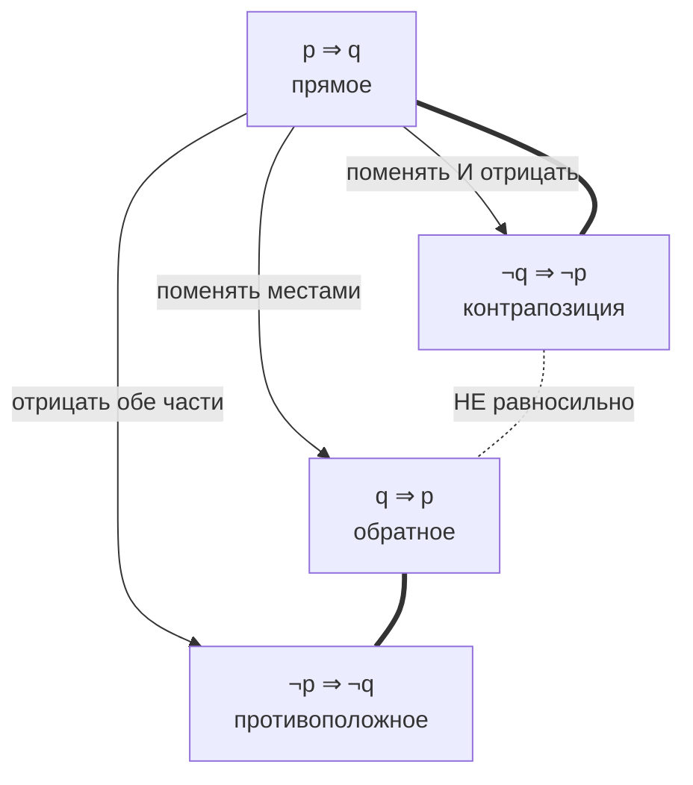

# Логика высказываний: связки, таблицы истинности, кванторы

Вторая половина модуля — техники доказательства — вынесена в отдельный файл:
[`theory-2-proof-techniques.md`](./theory-2-proof-techniques.md). Сначала инструменты,
потом то, что ими строят.

## Вспоминаем школу

В школе логика была где-то на стыке математики и информатики и выглядела как таблички
с нулями и единицами. Оттуда обычно остаётся три обрывка:

- «И» — истинно, когда истинны обе части. «ИЛИ» — когда хотя бы одна. «НЕ» — переворачивает.
- Была какая-то стрелочка «если … то …», и с ней все путались.
- Были таблицы истинности, которые нужно было заполнять руками, и это казалось
  бессмысленным упражнением.

Две вещи, которые забывают чаще всего, и обе важны:

1. **Математическое «или» — не исключающее.** «Кофе или чай» в кафе означает «одно из
   двух». В математике `p ∨ q` истинно и тогда, когда истинны оба. Для «ровно одного из
   двух» есть отдельная операция — XOR.
2. **«Если ложь, то что угодно» — истина.** Это не опечатка и не подвох, а сознательное
   соглашение, и ниже мы разберём, почему оно единственно разумное.

Если вы не помните ничего из школьной логики — ничего страшного: в отличие от
тригонометрии, здесь всё восстанавливается за один вечер, потому что вы этим и так
пользуетесь каждый день, просто на языке Go, а не на языке символов.

## Зачем программисту

Логика — единственный раздел математики, которым программист занимается физически
ежедневно, даже если считает, что «математику не использует».

- **Каждый `if`** — это логическое выражение. Каждый баг вида «условие срабатывает не
  тогда, когда надо» — ошибка в логике, а не в коде.
- **`WHERE` в SQL, фильтры в API, правила доступа, feature flags** — те же связки,
  только записанные другим синтаксисом.
- **Рефакторинг условий.** Когда вы превращаете `if !(a && b)` в `if !a || !b`, вы
  применяете закон де Моргана. Если применить его неправильно — получите тихий баг,
  который тесты могут не поймать.
- **Спецификации и тесты.** «Каждый запрос получает ответ» и «существует запрос без
  ответа» — это утверждение и его отрицание. Отрицание требования буквально даёт
  условие, при котором тест должен упасть.
- **Инварианты и код-ревью.** Фраза «этот цикл всегда оставляет `sum` равной сумме
  первых `i` элементов» — это инвариант, и доказывается он индукцией.
- **Чтение чужой документации и статей.** RFC, спеки баз данных, статьи про
  распределённые системы написаны на языке «для всех … существует …». Без кванторов
  это просто набор слов.

## Простыми словами

**Высказывание** — это утверждение, про которое имеет смысл спросить «истинно или ложно?»
и получить ровно один ответ. `2 + 2 = 4` — высказывание (истинное). `x > 5` — пока не
высказывание: неизвестно, чему равен `x`. «Который час?» и «Закрой дверь» — не
высказывания вообще: вопрос и команда не бывают ложными.

В Go высказывание — это выражение типа `bool`. Буквально. Всё, что вы можете подставить
в `if`, — высказывание (при условии, что все переменные уже имеют значения).

**Связки** склеивают высказывания в более сложные, ровно как операторы склеивают
булевы выражения:

| Математика | Читается | Go | Смысл |
|---|---|---|---|
| `¬p` | «не p» | `!p` | переворот |
| `p ∧ q` | «p и q» | `p && q` | оба истинны |
| `p ∨ q` | «p или q» | `p \|\| q` | хотя бы один истинен |
| `p ⊕ q` | «p исключающее-или q» | `p != q` | ровно один истинен |
| `p ⇒ q` | «из p следует q» | `!p \|\| q` | p обещает q |
| `p ⇔ q` | «p равносильно q» | `p == q` | значения совпадают |

Символы: `¬` — крышечка-отрицание (иногда пишут `~` или черту сверху `p̄`),
`∧` — «домик вверх» = И, `∨` — «домик вниз» = ИЛИ, `⊕` — плюс в кружке = XOR,
`⇒` — двойная стрелка = следование, `⇔` — двойная стрелка в обе стороны = равносильность.
Общий словарь математических обозначений живёт в модуле 01:
[«Словарь обозначений»](../01-numbers-and-arithmetic/theory.md#словарь-обозначений).

**Импликация** `p ⇒ q` — самое коварное. Проще всего думать о ней как об обещании:
«если платёж прошёл, то заказ создан». Обещание нарушено ровно в одном случае: платёж
прошёл, а заказа нет. Во всех остальных случаях вас не в чем упрекнуть — в том числе
если платёж не прошёл. Отсюда и берётся «ложь ⇒ что угодно = истина»: обещание, условие
которого не наступило, не нарушено.

## Точнее

### Таблицы истинности

Таблица истинности перечисляет все комбинации значений переменных и результат.
Для `n` переменных строк ровно `2ⁿ`: одна переменная — 2 строки, две — 4, три — 8.
Дальше растёт быстро, поэтому руками считают до трёх переменных, а больше — кодом.

Базовые операции (везде используем `true` / `false`, как в Go):

| p | q | ¬p | p ∧ q | p ∨ q | p ⊕ q | p ⇒ q | p ⇔ q |
|---|---|---|---|---|---|---|---|
| false | false | true | false | false | false | **true** | true |
| false | true | true | false | true | true | **true** | false |
| true | false | false | false | true | true | **false** | false |
| true | true | false | true | true | false | **true** | true |

Обратите внимание на колонку `p ⇒ q`: единственный `false` — в строке «p истинно,
q ложно». Это и есть «нарушенное обещание».

Порядок строк — не догма, но удобно перечислять комбинации как двоичные числа от `00`
до `11`: тогда ничего не потеряется. Это ровно то, что делает вложенный цикл по
`[]bool{false, true}`.

### Приоритет операций

Как и в арифметике, у связок есть приоритет — от сильного к слабому:

```text
¬        — сильнее всего, как унарный минус
∧        — как умножение
∨, ⊕     — как сложение
⇒        — слабее
⇔        — слабее всего
```

Значит `¬p ∧ q` читается как `(¬p) ∧ q`, а не `¬(p ∧ q)` — разница огромная.
В Go приоритет `!` > `&&` > `||` совпадает с математическим, но `⇒` и `⇔` в языке нет.
Совет из практики: в реальном коде ставьте скобки даже там, где приоритет и так
правильный. Читателю не придётся вспоминать таблицу приоритетов, а компилятору всё равно.

### Импликация и её родственники

Пусть `p` = «число делится на 4», `q` = «число чётное». Утверждение `p ⇒ q` истинно.
У него есть три родственника, и их постоянно путают:

| Название | Формула | Для нашего примера | Истинно? |
|---|---|---|---|
| прямое | `p ⇒ q` | делится на 4 ⇒ чётное | да |
| обратное (converse) | `q ⇒ p` | чётное ⇒ делится на 4 | **нет** (6) |
| противоположное (inverse) | `¬p ⇒ ¬q` | не делится на 4 ⇒ нечётное | **нет** (6) |
| контрапозиция | `¬q ⇒ ¬p` | нечётное ⇒ не делится на 4 | да |

**Контрапозиция всегда равносильна исходной импликации.** Это не совпадение и не
эмпирика — это тождество, которое можно проверить таблицей или вывести:

```text
p ⇒ q
= ¬p ∨ q          — определение импликации
= q ∨ ¬p          — коммутативность ∨
= ¬(¬q) ∨ ¬p      — двойное отрицание: q = ¬(¬q)
= ¬q ⇒ ¬p         — определение импликации, читаем справа налево
```

Обратное и противоположное равносильны между собой (они контрапозиции друг друга),
но исходному утверждению — нет. Классическая ошибка в рассуждениях (и в коде):
«если токен истёк, запрос отклоняется» не означает «если запрос отклонён, токен истёк».
Отклонить могли и по другой причине.



Двойная линия `===` означает «равносильно», пунктир — «не равносильно».

### Законы де Моргана

Два закона, которые программист применяет чаще всех остальных вместе взятых:

```text
¬(p ∧ q) = ¬p ∨ ¬q        — «не (оба)» = «хотя бы один не»
¬(p ∨ q) = ¬p ∧ ¬q        — «не (хотя бы один)» = «ни один не»
```

Мнемоника: **отрицание проходит внутрь скобок и переворачивает связку**. `∧` становится
`∨`, `∨` становится `∧`. Именно переворот связки забывают чаще всего, и получается
`¬(p ∧ q) = ¬p ∧ ¬q` — неверно.

Проверим первый закон таблицей полностью, без пропусков:

| p | q | p ∧ q | ¬(p ∧ q) | ¬p | ¬q | ¬p ∨ ¬q |
|---|---|---|---|---|---|---|
| false | false | false | true | true | true | true |
| false | true | false | true | true | false | true |
| true | false | false | true | false | true | true |
| true | true | true | false | false | false | false |

Колонки `¬(p ∧ q)` и `¬p ∨ ¬q` совпали во всех четырёх строках — законы равносильны.
Законы работают и для трёх и более аргументов: `¬(p ∧ q ∧ r) = ¬p ∨ ¬q ∨ ¬r`.

### Тавтология, противоречие, выполнимость

- **Тавтология** — формула, истинная при любых значениях переменных. Пример: `p ∨ ¬p`
  («закон исключённого третьего»). В коде это условие, которое всегда `true`, — обычно
  признак мёртвой ветки.
- **Противоречие** — формула, ложная при любых значениях. Пример: `p ∧ ¬p`. В коде это
  недостижимая ветка: `if x > 10 && x < 3`.
- **Выполнимая (satisfiable) формула** — существует хотя бы один набор значений, при
  котором она истинна. Все три понятия связаны: `F` — тавтология ⇔ `¬F` невыполнима.

Практический смысл: `F` равносильна `G` тогда и только тогда, когда `F ⇔ G` —
тавтология. Так проверка «упростил ли я условие правильно» сводится к проверке
тавтологии, а её можно перебрать за `2ⁿ` строк.

### Предикаты и кванторы

**Предикат** — это высказывание с дыркой: `P(x)` = «x чётное». Само по себе не истинно
и не ложно, но становится высказыванием, как только подставить конкретный `x`.
В коде предикат — это функция `func(x T) bool`.

Чтобы из предиката снова получить высказывание, есть два способа — навесить квантор.

| Символ | Читается | Смысл | Код |
|---|---|---|---|
| `∀x P(x)` | «для любого x верно P(x)» | ни одного контрпримера | `allOf(xs, P)` |
| `∃x P(x)` | «существует x, для которого P(x)» | есть хотя бы один свидетель | `anyOf(xs, P)` |

`∀` — перевёрнутая «A» (All), `∃` — зеркальная «E» (Exists). Часто указывают, откуда
берётся `x`: `∀x ∈ Users`, читается «для любого x из множества Users» (символ `∈` —
«принадлежит», см. модуль 01 и модуль
[`04-sets-relations-functions`](../04-sets-relations-functions/index.md)).

**Отрицание кванторов** — правило, которое стоит выучить наизусть:

```text
¬∀x P(x) = ∃x ¬P(x)       — «не все» = «нашёлся тот, кто не»
¬∃x P(x) = ∀x ¬P(x)       — «ни одного» = «все не»
```

Это те же законы де Моргана, только для бесконечно длинных цепочек: `∀` — это большое
`∧` по всем элементам, `∃` — большое `∨`. Отрицание проходит внутрь и переворачивает
квантор.

**Порядок вложенных кванторов важен.** Сравните:

```text
∀r ∃h  Handles(h, r)      — для каждого запроса существует обработчик
∃h ∀r  Handles(h, r)      — существует обработчик, обрабатывающий все запросы
```

Первое слабее: обработчик может быть свой у каждого запроса. Второе сильнее: требуется
один универсальный. Из второго следует первое, но не наоборот. Одинаковые кванторы
подряд (`∀x ∀y` или `∃x ∃y`) переставлять можно, разные — нельзя.

**Пустая коллекция.** Ловушка, на которой ломаются тесты: `∀x ∈ ∅ P(x)` — истинно
(нет ни одного контрпримера), а `∃x ∈ ∅ P(x)` — ложно (нет ни одного свидетеля).
Это называют «vacuous truth», «истинность впустую». Тот же ответ даёт код:
`allOf` на пустом слайсе возвращает `true`, `anyOf` — `false`.

### Законы булевой алгебры

Булева алгебра работает почти как школьная, если читать `∧` как умножение,
`∨` как сложение, `false` как 0, `true` как 1. Почти — потому что есть лишние законы,
которых в арифметике нет.

```text
p ∧ true = p              — нейтральный элемент
p ∨ false = p             — нейтральный элемент
p ∧ false = false         — поглощающий элемент
p ∨ true = true           — поглощающий элемент
p ∧ p = p                 — идемпотентность (в арифметике x·x ≠ x!)
p ∨ p = p                 — идемпотентность
p ∧ ¬p = false            — противоречие
p ∨ ¬p = true             — исключённое третье
¬(¬p) = p                 — двойное отрицание
p ∧ (q ∨ r) = (p ∧ q) ∨ (p ∧ r)   — дистрибутивность ∧ над ∨
p ∨ (q ∧ r) = (p ∨ q) ∧ (p ∨ r)   — дистрибутивность ∨ над ∧ (в арифметике неверно!)
p ∨ (p ∧ q) = p           — поглощение (absorption)
p ∧ (p ∨ q) = p           — поглощение
```

Два последних — самые полезные при чистке условий: если внутри скобок повторяется то,
что уже стоит снаружи, скобки часто выкидываются целиком.

**Связь с множествами.** Логические связки один в один отображаются на операции над
множествами: `∧ ↔ ∩` (пересечение), `∨ ↔ ∪` (объединение), `¬ ↔ дополнение`.
Законы де Моргана в теории множеств выглядят как `(A ∩ B)ᶜ = Aᶜ ∪ Bᶜ`. Развивать эту
тему здесь не будем — множества, диаграммы Венна и всё остальное живут в модуле
[`04-sets-relations-functions`](../04-sets-relations-functions/theory.md).

## Разобранные примеры

### Пример 1. Упрощаем условие доступа

Дано условие из реального кода:

```text
!(isAdmin && isActive) || (!isAdmin && isActive)
```

Обозначим `a` = `isAdmin`, `b` = `isActive` и упростим по шагам:

```text
¬(a ∧ b) ∨ (¬a ∧ b)
= (¬a ∨ ¬b) ∨ (¬a ∧ b)        — закон де Моргана в первой скобке
= ¬a ∨ ¬b ∨ (¬a ∧ b)          — ассоциативность ∨, скобки не нужны
= ¬a ∨ (¬b ∨ (¬a ∧ b))        — перегруппируем, чтобы увидеть узор
= ¬a ∨ ((¬b ∨ ¬a) ∧ (¬b ∨ b)) — дистрибутивность ∨ над ∧
= ¬a ∨ ((¬b ∨ ¬a) ∧ true)     — ¬b ∨ b = true, исключённое третье
= ¬a ∨ (¬b ∨ ¬a)              — p ∧ true = p
= (¬a ∨ ¬a) ∨ ¬b              — коммутативность и ассоциативность ∨
= ¬a ∨ ¬b                     — идемпотентность: p ∨ p = p
```

Итог: `!isAdmin || !isActive`, то есть по де Моргану — `!(isAdmin && isActive)`.
Половина исходного выражения была лишней. Проверим таблицей:

| a | b | ¬(a ∧ b) ∨ (¬a ∧ b) | ¬a ∨ ¬b |
|---|---|---|---|
| false | false | true ∨ false = true | true |
| false | true | true ∨ true = true | true |
| true | false | true ∨ false = true | true |
| true | true | false ∨ false = false | false |

Совпало во всех строках — упрощение корректно.

### Пример 2. Переворачиваем требование в тест

Требование: «каждый заказ со статусом `paid` имеет непустой `payment_id`».
Формально, где `O` — множество заказов:

```text
∀o ∈ O  (Paid(o) ⇒ HasPaymentID(o))
```

Что должен искать тест, чтобы поймать нарушение? Отрицаем:

```text
¬∀o ∈ O (Paid(o) ⇒ HasPaymentID(o))
= ∃o ∈ O ¬(Paid(o) ⇒ HasPaymentID(o))    — отрицание ∀ даёт ∃
= ∃o ∈ O ¬(¬Paid(o) ∨ HasPaymentID(o))   — раскрыли импликацию
= ∃o ∈ O (Paid(o) ∧ ¬HasPaymentID(o))    — закон де Моргана + двойное отрицание
```

Получили ровно тот `WHERE`, который нужен: `status = 'paid' AND payment_id IS NULL`.
Это не догадка — это механический вывод из формулировки требования.

### Пример 3. Почему порядок кванторов ломает спеку

Формулировка в тикете: «для каждого шарда есть реплика, которая его обслуживает».

```text
∀s ∃r  Serves(r, s)
```

Разработчик прочитал как «есть реплика, которая обслуживает все шарды»:

```text
∃r ∀s  Serves(r, s)
```

Проверим на модели: два шарда `s₁`, `s₂`, две реплики `r₁`, `r₂`, где `r₁` обслуживает
только `s₁`, а `r₂` — только `s₂`.

- Первая формула: для `s₁` есть `r₁`, для `s₂` есть `r₂`. Истинна.
- Вторая формула: `r₁` не обслуживает `s₂`, `r₂` не обслуживает `s₁`. Ложна.

Одна формула истинна, другая ложна на одной и той же системе — значит, они разные.
Такой контрпример из двух элементов — самый дешёвый способ проверить себя, когда
кванторы кажутся взаимозаменяемыми.

## В коде

### Проверка равносильности перебором

Самая полезная привычка: любое упрощение проверять брутфорсом. Для двух переменных
это четыре строки, для трёх — восемь; компьютеру всё равно.

```go
package main

import "fmt"

func main() {
	vals := []bool{false, true}
	for _, a := range vals {
		for _, b := range vals {
			left := !(a && b)
			right := !a || !b
			if left != right {
				fmt.Printf("mismatch at a=%v b=%v\n", a, b)
				return
			}
		}
	}
	fmt.Println("equivalent on all 4 rows")
}
```

Для трёх переменных добавьте третий цикл. Для большего числа — генерируйте комбинации
битами `i`-го числа от `0` до `2ⁿ - 1`.

### Импликация и контрапозиция

В Go нет оператора `⇒`, но он и не нужен — это `!p || q`:

```go
func implies(p, q bool) bool { return !p || q }

func main() {
	for _, p := range []bool{false, true} {
		for _, q := range []bool{false, true} {
			if implies(p, q) != implies(!q, !p) {
				panic("contrapositive broken")
			}
		}
	}
	// молчит — значит, p ⇒ q и ¬q ⇒ ¬p совпадают всегда
}
```

А вот обратное `q ⇒ p` тем же кодом не пройдёт: при `p = false, q = true` получим
`implies(p, q) = true`, а `implies(q, p) = false`.

### Рефакторинг по де Моргану

Было — с вложенным отрицанием, которое читается тяжело:

```go
if !(user.IsActive() && user.HasValidToken()) {
	return errUnauthorized
}
```

Стало — отрицание внесено внутрь, связка перевёрнута:

```go
if !user.IsActive() || !user.HasValidToken() {
	return errUnauthorized
}
```

Оба варианта корректны. Второй читается как «неактивен ИЛИ токен невалиден» — ближе к
тому, как об этом думает человек. Но обратите внимание на побочный эффект: из-за
**короткого замыкания** (short-circuit evaluation) в Go правая часть `||` не
вычисляется, если левая уже `true`. В первом варианте `HasValidToken()` вызывался,
когда `IsActive()` истинно; во втором — когда `IsActive()` ложно. Если методы делают
запрос в базу или пишут метрику, порядок вызовов изменится. Логика та же, поведение —
не совсем. Держите это в голове, когда «просто упрощаете условие».

### ∀ и ∃ как `allOf` / `anyOf`

```go
func allOf[T any](xs []T, p func(T) bool) bool {
	for _, x := range xs {
		if !p(x) { // нашли контрпример — ∀ ложно
			return false
		}
	}
	return true // пустой слайс тоже сюда: ∀ по ∅ истинно
}

func anyOf[T any](xs []T, p func(T) bool) bool {
	for _, x := range xs {
		if p(x) { // нашли свидетеля — ∃ истинно
			return true
		}
	}
	return false // пустой слайс: ∃ по ∅ ложно
}
```

Функция называется `anyOf`, а не `any`, потому что `any` в Go — предопределённый
псевдоним для `interface{}`; затенять его на уровне пакета можно, но не нужно.
В стандартной библиотеке эти операции живут как `slices.ContainsFunc` (это `∃`) и
`slices.IndexFunc` (`≥ 0` — тоже `∃`); прямого `allOf` нет, но `!ContainsFunc(xs, not(p))`
— это ровно `¬∃x ¬P(x)`, то есть `∀x P(x)`.

## Типичные ошибки

- **Забыть перевернуть связку в де Моргане.** `!(a && b)` — это `!a || !b`,
  а не `!a && !b`. Проверка на пальцах: при `a = true, b = false` исходное истинно,
  а `!a && !b` — ложно.
- **Путать `p ⇒ q` с `q ⇒ p`.** «Все квадраты — прямоугольники» не значит «все
  прямоугольники — квадраты». В коде это ошибка вида «раз отклонили, значит, токен
  протух» — а причин отклонения может быть пять.
- **Считать `∨` исключающим.** `p ∨ q` истинно и когда оба истинны. Если нужно «ровно
  одно», пишите `p != q` (XOR).
- **Отрицать «все» как «никто».** Отрицание «все пользователи активны» — это «есть
  хотя бы один неактивный», а не «все неактивны». Промежуточные случаи никуда не делись.
- **Менять местами разные кванторы.** `∀x ∃y` и `∃y ∀x` — разные утверждения.
  Проверяйте себя контрпримером из двух элементов.
- **Забыть про пустую коллекцию.** «Все элементы валидны» на пустом списке — истина.
  Если бизнес-логика ждёт «хотя бы один валидный», это отдельное условие `len(xs) > 0`.
- **Упрощать условие, не думая о побочных эффектах.** Логическая равносильность не
  обещает одинакового числа вызовов функций — см. короткое замыкание выше.
- **Считать `true`/`false` единственными вариантами при работе с SQL.** В SQL `NULL`
  даёт трёхзначную логику: `NULL = NULL` не `true`, а `NULL`, и `NOT (a AND b)` ведёт
  себя иначе. Здесь мы работаем в классической двузначной логике; про SQL просто помните,
  что там правила другие.

## Шпаргалка формул

| Название | Формула |
|---|---|
| определение импликации | `p ⇒ q = ¬p ∨ q` |
| контрапозиция | `p ⇒ q = ¬q ⇒ ¬p` |
| отрицание импликации | `¬(p ⇒ q) = p ∧ ¬q` |
| эквивалентность | `p ⇔ q = (p ⇒ q) ∧ (q ⇒ p)` |
| XOR | `p ⊕ q = (p ∨ q) ∧ ¬(p ∧ q) = ¬(p ⇔ q)` |
| де Морган | `¬(p ∧ q) = ¬p ∨ ¬q` |
| де Морган | `¬(p ∨ q) = ¬p ∧ ¬q` |
| двойное отрицание | `¬(¬p) = p` |
| идемпотентность | `p ∧ p = p`, `p ∨ p = p` |
| поглощение | `p ∨ (p ∧ q) = p`, `p ∧ (p ∨ q) = p` |
| дистрибутивность | `p ∧ (q ∨ r) = (p ∧ q) ∨ (p ∧ r)` |
| дистрибутивность | `p ∨ (q ∧ r) = (p ∨ q) ∧ (p ∨ r)` |
| отрицание ∀ | `¬∀x P(x) = ∃x ¬P(x)` |
| отрицание ∃ | `¬∃x P(x) = ∀x ¬P(x)` |
| число строк таблицы | `2ⁿ` для `n` переменных |

## Словарь терминов

- **Высказывание (proposition)** — утверждение, которое либо истинно, либо ложно.
- **Предикат (predicate)** — высказывание с параметром: `P(x)`; в коде `func(T) bool`.
- **Связка (connective)** — операция над высказываниями: `¬`, `∧`, `∨`, `⊕`, `⇒`, `⇔`.
- **Таблица истинности** — перечисление всех `2ⁿ` наборов значений и результата.
- **Импликация** — `p ⇒ q`, «если p, то q»; `p` — посылка, `q` — заключение.
- **Обратное (converse)** — `q ⇒ p`. **Противоположное (inverse)** — `¬p ⇒ ¬q`.
  **Контрапозиция** — `¬q ⇒ ¬p`, единственное из трёх, равносильное исходному.
- **Равносильность (logical equivalence)** — формулы совпадают при всех наборах значений.
- **Тавтология** — истинна всегда. **Противоречие** — ложна всегда.
  **Выполнимость (satisfiability)** — истинна хотя бы при одном наборе.
- **Квантор всеобщности `∀`** — «для любого». **Квантор существования `∃`** — «существует».
- **Vacuous truth** — «истинность впустую»: `∀` по пустому множеству истинно.
- **Короткое замыкание (short-circuit)** — правая часть `&&` / `||` не вычисляется,
  если результат уже определён левой.

## См. также

- [`theory-2-proof-techniques.md`](./theory-2-proof-techniques.md) — вторая половина
  модуля: как этими инструментами доказывать.
- [`cards.md`](./cards.md), [`drills.md`](./drills.md) — карточки и упражнения.
- Модуль [`01-numbers-and-arithmetic`](../01-numbers-and-arithmetic/theory.md) —
  словарь обозначений, чётность и делимость.
- Модуль [`04-sets-relations-functions`](../04-sets-relations-functions/theory.md) —
  множества: `∧ ↔ ∩`, `∨ ↔ ∪`, `¬ ↔ дополнение`.
- Модуль [`05-number-theory-and-binary`](../05-number-theory-and-binary/index.md) —
  битовые операции: те же `∧`, `∨`, `⊕`, только сразу над 64 парами бит.
- Lehman, Leighton, Meyer — *Mathematics for Computer Science* (MIT OpenCourseWare 6.042,
  свободный PDF), глава про propositions и predicate logic — канонический текст ровно
  по этому модулю.
- Rosen — *Discrete Mathematics and Its Applications*, глава *The Foundations: Logic and
  Proofs*.
- Khan Academy — khanacademy.org, разделы по логике и математическим рассуждениям.
- Спецификация Go — go.dev/ref/spec, разделы *Logical operators* и *Order of evaluation*
  (про короткое замыкание).
