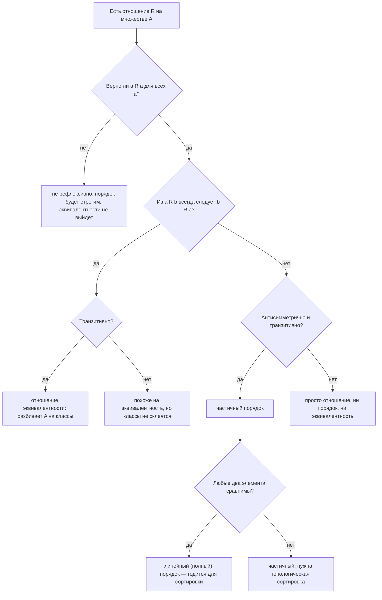
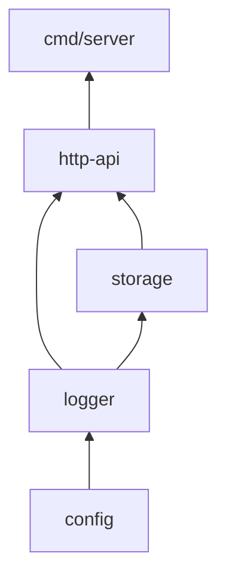

# Отношения и функции

Вторая половина модуля. Первая — [`theory.md`](./theory.md) — про множества; здесь всё
строится поверх декартова произведения `A × B`, так что если `×` пока не откликается,
вернитесь на файл назад.

## Вспоминаем школу

Из школы про функцию помнится примерно следующее: `y = f(x)`, есть график, «каждому
иксу соответствует ровно один игрек», область определения — это где функция «работает»,
и что-то про то, что вертикальная прямая пересекает график не больше одного раза.

Про отношения в школе говорили меньше, но всё же говорили: «больше», «равно»,
«делится на», «подобен» — это всё отношения. И был факт, который тогда казался
занудством: равенство рефлексивно, симметрично и транзитивно. Через десять минут
станет ясно, что этот «занудный» набор свойств — то, на чём держится дедупликация.

Один факт, который забывается первым: **функция — это не формула**. Формула — способ
задать функцию. Сама функция — это правило соответствия, и его можно задать таблицей,
кодом, картинкой или просто списком пар.

## Зачем программисту

- **Дедупликация.** «Считать ли `Ivan@Mail.ru` и `ivan@mail.ru` одним пользователем» —
  это вопрос о том, какое отношение эквивалентности вы выбрали. Классы эквивалентности
  и есть группы дубликатов.
- **Сортировка.** `sort.Slice`, `slices.SortFunc`, компаратор в `ORDER BY` — все они
  требуют **линейного порядка**. Компаратор, который на самом деле задаёт только
  частичный порядок, даёт нестабильный, невоспроизводимый результат.
- **Зависимости.** «Пакет A должен собраться раньше B» — частичный порядок. Топологическая
  сортировка — способ достроить его до линейного.
- **`map[K]V`** — частичная функция из ключей в значения: определена не везде,
  и `v, ok := m[k]` — это проверка «k в области определения?».
- **Идентификаторы.** Генератор id обязан быть инъективным: два разных объекта не
  должны получить один id. Хеш-функция намеренно не инъективна — отсюда коллизии.
- **Кодирование.** base64, URL-encoding, «индекс ↔ (строка, столбец)» в плоском массиве
  — это биекции, и именно поэтому у них есть точная обратная операция.

## Простыми словами

**Отношение** — таблица «кто с кем связан». Ничего больше. Множество пар.

**Функция** — отношение с дисциплиной: у каждого входа ровно один выход. То есть
обычная детерминированная функция без ошибок и без перегрузок.

**Эквивалентность** — отношение «считаем этих двоих одинаковыми для наших целей».
Оно разрезает множество на непересекающиеся группы.

**Порядок** — отношение «этот раньше того». Если умеет сравнить любые два элемента —
линейный (полный); если про некоторые пары честно говорит «не знаю» — частичный.

## Точнее

### Отношение — это подмножество A × B

**Бинарное отношение** `R` из `A` в `B` — любое подмножество `R ⊆ A × B`.
Запись `a R b` (часто `(a, b) ∈ R`) читается «a находится в отношении R с b».

```text
A = {1, 2, 3}
R = {(a, b) ∈ A × A | a < b} = { (1,2), (1,3), (2,3) }
2 R 3 — верно, потому что (2,3) ∈ R
3 R 1 — неверно
```

Когда `A = B`, говорят «отношение **на** множестве A». Именно такие интересны чаще
всего: «равно», «делит», «зависит от», «тот же пользователь, что».

Сколько всего бывает отношений на множестве из n элементов? Отношение — подмножество
`A × A`, у которого `n²` элементов, значит отношений `2^(n²)` — прямое применение
формулы булеана из [`theory.md`](./theory.md).

В коде отношение — это либо `func(a, b T) bool`, либо `map[T]Set` (список смежности),
либо таблица связей в базе. Таблица `user_roles(user_id, role_id)` — буквально
подмножество `users × roles`.

### Четыре свойства

Пусть `R` — отношение на множестве `A`. Кванторы `∀` («для всех») и `∃`
(«существует») разбираются в [модуле 03](../03-logic-and-proofs/theory.md).

| Свойство | Формально | По-человечески |
| --- | --- | --- |
| Рефлексивность | `∀a: a R a` | каждый связан сам с собой |
| Симметричность | `∀a,b: a R b ⇒ b R a` | связь взаимна |
| Антисимметричность | `∀a,b: (a R b и b R a) ⇒ a = b` | взаимно связаны только совпадающие |
| Транзитивность | `∀a,b,c: (a R b и b R c) ⇒ a R c` | связь «пробрасывается» дальше |

Примеры, чтобы почувствовать разницу:

```text
«=» на числах        — рефлексивно, симметрично, антисимметрично, транзитивно
«≤» на числах        — рефлексивно, антисимметрично, транзитивно; НЕ симметрично
«<» на числах        — транзитивно; НЕ рефлексивно (a < a ложно)
«друзья» в соцсети   — симметрично; НЕ транзитивно (друг друга — не обязательно друг)
«подписан на»        — вообще ничего из списка не обязано выполняться
«a делится на b»     — рефлексивно, антисимметрично (на ℕ), транзитивно
```

Антисимметричность часто путают с «не симметрично». Это разные вещи:
антисимметричность — конкретное требование («если связь в обе стороны, то это один и
тот же элемент»), а «не симметрично» — просто отрицание симметричности.



### Эквивалентность и разбиение

Отношение называется **отношением эквивалентности**, если оно рефлексивно,
симметрично и транзитивно. Обозначают обычно `~`.

Главная теорема здесь простая и очень полезная: **отношение эквивалентности разбивает
множество на непересекающиеся классы**, и наоборот, любое разбиение задаёт
эквивалентность. **Класс эквивалентности** элемента `a` — это

```text
[a] = {x ∈ A | x ~ a}      — все, кто «такой же, как a»
```

Классы либо совпадают, либо не пересекаются, и вместе покрывают всё `A`. Такой набор
называется **разбиением** (partition).

```text
A = все email-адреса пользователей
a ~ b, если strings.ToLower(a) == strings.ToLower(b)

классы:  [ivan@mail.ru]  = { Ivan@Mail.ru, ivan@MAIL.ru, ivan@mail.ru }
         [petr@mail.ru]  = { Petr@mail.ru, petr@mail.ru }
разбиение: каждый адрес попал ровно в один класс
```

Из каждого класса выбирают **представителя** (canonical form) — обычно
нормализованное значение. Дедупликация — это «сгруппировать по классам и оставить
по одному представителю»; в коде — `map[canonicalKey][]item`.

Ещё два примера того же механизма:

- **Остатки по модулю.** `a ~ b`, если `a % m == b % m`. Классов ровно `m`.
  Это же — устройство хеш-таблицы: бакет — класс эквивалентности по `hash % nbuckets`.
  Подробности про модульную арифметику — в
  [модуле 05](../05-number-theory-and-binary/index.md).
- **Сравнение структур по бизнес-ключу.** Две записи «одинаковы», если совпали
  `(user_id, date)` — это эквивалентность, а не равенство объектов.

### Порядок: частичный и линейный

**Частичный порядок** (partial order) — отношение рефлексивное, антисимметричное и
транзитивное. Обозначают `≼` или `≤`. Ключевое слово — «частичный»: некоторые пары
могут быть **несравнимы**, и это законно.

**Линейный** (он же полный, total) **порядок** — частичный порядок, в котором
дополнительно любые два элемента сравнимы: `∀a,b: a ≼ b или b ≼ a`.

```text
числа с «≤»                      — линейный порядок: любые два сравнимы
множества с «⊆»                  — частичный: {1,2} и {2,3} несравнимы
задачи сборки с «зависит от»     — частичный: независимые пакеты несравнимы
версии semver с «раньше»         — линейный: любые две версии сравнимы
```

Частичный порядок удобно рисовать **диаграммой Хассе**: снизу — «раньше/меньше»,
сверху — «позже/больше», рёбра только между непосредственными соседями (транзитивные
стрелки не рисуют, они подразумеваются).

```text
Диаграмма Хассе для P({a, b}) с отношением ⊆

            {a, b}
            /    \
         {a}      {b}          — {a} и {b} несравнимы: ни одно не ⊆ другого
            \    /
              ∅
читается снизу вверх: ∅ ⊆ {a} ⊆ {a,b}
```

То же самое для графа зависимостей сборки:



Стрелка «снизу вверх» читается «должно быть собрано раньше». `storage` и `logger`
сравнимы, а вот два независимых листа — нет. **Топологическая сортировка** — это
достраивание частичного порядка до линейного: мы выбираем один из допустимых
линейных порядков (их обычно много), и любой из них — корректный план сборки.
Графы как объект — тема [модуля 11](../11-graphs-recurrences-automata/index.md).

### Порядок и сортировка в коде

Функции сортировки требуют от компаратора именно линейного порядка (точнее — строгого
слабого упорядочения: транзитивность плюс согласованность «равенства»). Что происходит,
если компаратор этому не удовлетворяет:

- результат зависит от исходного расположения элементов и от внутренних решений
  алгоритма;
- один и тот же вход в разных запусках может дать разный вывод;
- падения при этом не будет — вы просто получите тихо неверный порядок.

Отсюда практическое правило: **если по вашему ключу элементы могут быть «равны», порядок
между ними не определён**. Два выхода: либо добавить вторичный ключ (обычно id) и
сделать порядок линейным, либо использовать стабильную сортировку
(`sort.SliceStable`, `slices.SortStableFunc`), которая обещает сохранить исходный
взаимный порядок «равных». Стабильность — это ровно способ доопределить частичный
порядок детерминированно.

### Функции

**Функция** `f: A → B` — это отношение `f ⊆ A × B`, в котором **каждому** `a ∈ A`
соответствует **ровно один** `b ∈ B`. Запись `f: A → B` читается «эф из A в B».

- `A` — **область определения** (domain): откуда берём аргументы.
- `B` — **область прибытия** (codomain): куда обещаем попадать. В русской традиции
  «областью значений» часто называют именно образ, поэтому уточняйте, о чём речь.
- **Образ** (image) `f(A) = {f(a) | a ∈ A}` — что реально получилось. Всегда
  `f(A) ⊆ B`, но равенства может и не быть.

```text
f: {1, 2, 3} → {a, b, c, d},  f(1) = a, f(2) = b, f(3) = a
domain   = {1, 2, 3}
codomain = {a, b, c, d}
image    = {a, b}              — c и d недостижимы
```

Три свойства, которые надо различать:

| Свойство | Определение | На пальцах |
| --- | --- | --- |
| Инъекция | `f(x) = f(y) ⇒ x = y` | разные входы — разные выходы, «без коллизий» |
| Сюръекция | `∀b ∈ B ∃a ∈ A: f(a) = b` | образ покрывает всю область прибытия |
| Биекция | инъекция и сюръекция одновременно | идеальное парное соответствие |

```text
f: ℤ → ℤ, f(x) = 2x       — инъекция (разные x дают разные 2x),
                            не сюръекция (нечётные не получаются)
f: ℤ → ℤ, f(x) = x / 2 целочисленно  — сюръекция (любое y получается),
                            не инъекция (4 и 5 дают одно и то же)
f: ℤ → ℤ, f(x) = x + 1    — биекция
hash(s)                   — не инъекция принципиально: входов бесконечно,
                            выходов 2⁶⁴
```

**Обратная функция** `f⁻¹: B → A` существует **тогда и только тогда, когда `f` —
биекция**, и это не формальность, а ровно то, что нужно от кодировщика:

```text
не инъекция → по значению не восстановить вход (коллизия: кто из двух?)
не сюръекция → для части значений B обратной вообще нет (что декодировать?)
биекция      → каждому b ровно один a, f⁻¹ определена корректно
```

**Композиция** `g ∘ f` («g после f») определена так: `(g ∘ f)(x) = g(f(x))`.
Если `f: A → B` и `g: B → C`, то `g ∘ f: A → C`. Порядок чтения справа налево —
классический источник путаницы; в коде это `g(f(x))`, то есть внутренний вызов
выполняется первым. Композиция биекции с её обратной даёт тождественную функцию:
`f⁻¹ ∘ f = id`.

### Счётность: почему не всякое число представимо

Два бесконечных множества считают «одинакового размера», если между ними есть биекция.
Это единственное разумное определение, и оно приводит к неожиданным выводам.

**Счётное** множество — то, элементы которого можно занумеровать натуральными числами
(то есть построить биекцию с ℕ).

- `ℕ` — счётно по определению.
- `ℤ` — счётно: нумеруем зигзагом `0, 1, −1, 2, −2, 3, −3, ...`. Ага, целых «столько
  же», сколько натуральных.
- `ℚ` (дроби) — тоже счётно: выписываем все пары `(числитель, знаменатель)` в таблицу
  и обходим её диагоналями. Между любыми двумя дробями бесконечно много других — и всё
  равно счётно.
- `ℝ` — **несчётно**. Вещественных чисел строго больше.

Доказательство несчётности ℝ — знаменитый диагональный аргумент Кантора, и это
доказательство от противного (техника разбирается в
[модуле 03](../03-logic-and-proofs/theory.md)):

```text
Предположим, все числа из промежутка [0, 1) удалось занумеровать:
  r₁ = 0. 1 4 1 5 9 ...
  r₂ = 0. 7 1 8 2 8 ...
  r₃ = 0. 3 3 3 3 3 ...
  r₄ = 0. 0 0 1 0 0 ...
Берём диагональ:        1, 1, 3, 0, ...   — k-я цифра числа rₖ
Меняем каждую цифру:    2, 2, 4, 1, ...   — правило: d → d + 1, а 9 → 0
Складываем в число d = 0.2241...
d отличается от r₁ в 1-й цифре, от r₂ во 2-й, от rₖ в k-й —
значит d нет в списке — противоречие с «список полный».
Вывод: занумеровать [0, 1) натуральными числами нельзя.
```

Практический вывод для программиста. `float64` — это конечное множество: ровно `2⁶⁴`
битовых комбинаций, из которых часть занята под `NaN` и бесконечности. Вещественных
чисел несчётно много. Значит, подавляющее большинство вещественных чисел не
представимо в `float64` **в принципе** — не «неточно», а вообще отсутствует в наборе.
`0.1` — как раз такое: в двоичной записи оно бесконечно периодично, и то, что лежит в
переменной, — ближайший представимый сосед. Отсюда `0.1 + 0.2 != 0.3`. Как это
устроено внутри — в [модуле 01](../01-numbers-and-arithmetic/theory.md).

## Разобранные примеры

### Пример 1. Классы эквивалентности по остатку

Возьмём `A = {0, 1, 2, ..., 9}` и отношение `a ~ b ⟺ a % 3 == b % 3`.

```text
Проверяем свойства:
  рефлексивность:  a % 3 == a % 3            — верно всегда
  симметричность:  из a%3 == b%3 следует b%3 == a%3   — равенство симметрично
  транзитивность:  a%3 == b%3 и b%3 == c%3 ⇒ a%3 == c%3 — равенство транзитивно
Значит, это отношение эквивалентности.

Классы:
  [0] = {0, 3, 6, 9}
  [1] = {1, 4, 7}
  [2] = {2, 5, 8}
Проверка разбиения: 4 + 3 + 3 = 10 = |A|, пересечений нет.
```

Это и есть хеш-бакеты: `hash % 3` раскладывает ключи по трём корзинам, и «попали в один
бакет» — отношение эквивалентности.

### Пример 2. Инъекция, сюръекция, биекция на одном примере

Пусть `f: {1,2,3,4} → {a,b,c}`, заданная как `1→a, 2→b, 3→c, 4→a`.

```text
Инъекция?  f(1) = f(4) = a, но 1 ≠ 4        — нет
Сюръекция? образ = {a, b, c} = codomain      — да
Биекция?   нужны оба свойства                — нет
Обратной функции нет: по значению a непонятно, вернуть 1 или 4.
```

Замечание про мощности, которое экономит много времени: если `|A| > |B|`, инъекции не
существует в принципе — кто-то обязательно склеится. Это принцип Дирихле (голубей
больше, чем ящиков), и он же — доказательство того, что коллизии хеша неизбежны.
Подробный разбор — в [модуле 06](../06-combinatorics/index.md).

### Пример 3. Порядок, который сломался

Компаратор «сортируем задачи по приоритету»: `less(x, y) = x.Priority < y.Priority`.
Задачи `T1(p=5)`, `T2(p=5)`, `T3(p=1)`.

```text
T1 ≼ T2? нет (5 < 5 ложно)
T2 ≼ T1? нет
⇒ T1 и T2 несравнимы — это частичный порядок, а не линейный
⇒ их взаимный порядок алгоритм выбирает как ему удобно
⇒ на разных запусках/размерах входа результат может отличаться
Починка: less(x, y) = x.Priority < y.Priority ||
                      (x.Priority == y.Priority && x.ID < y.ID)
теперь любые две разные задачи сравнимы — порядок линейный.
```

## В коде

`map[K]V` — частичная функция: определена только на присутствующих ключах.

```go
prices := map[string]int{"apple": 100, "pear": 150}

// «k ∈ domain(prices)?» — это ровно второе значение из индексации мапы
v, ok := prices["apple"] // v=100, ok=true  — apple в области определения
_, ok2 := prices["kiwi"] // ok2=false       — функция здесь не определена
fmt.Println(v, ok, ok2)  // 100 true false
```

Проверка свойств отношения на конкретном множестве:

```go
func isTransitive(elems []int, r func(a, b int) bool) bool {
    for _, a := range elems {
        for _, b := range elems {
            for _, c := range elems {
                if r(a, b) && r(b, c) && !r(a, c) {
                    return false // нашли контрпример
                }
            }
        }
    }
    return true
}
// isTransitive([]int{1,2,3}, func(a, b int) bool { return a < b }) == true
```

Классы эквивалентности — группировка по канонической форме:

```go
func classes(items []string, canon func(string) string) map[string][]string {
    out := make(map[string][]string)
    for _, it := range items {
        key := canon(it) // представитель класса
        out[key] = append(out[key], it)
    }
    return out
}
// classes([]string{"A@x.io", "a@X.io", "b@x.io"}, strings.ToLower)
// → map["a@x.io":["A@x.io" "a@X.io"] "b@x.io":["b@x.io"]]
```

Линейный порядок для сортировки — с вторичным ключом, чтобы не осталось несравнимых пар:

```go
type Task struct {
    ID       int
    Priority int
}

slices.SortFunc(tasks, func(x, y Task) int {
    if c := cmp.Compare(x.Priority, y.Priority); c != 0 {
        return c
    }
    return cmp.Compare(x.ID, y.ID) // добиваем до линейного порядка
})
```

Биекция и проверка `f⁻¹ ∘ f = id` — плоский двумерный массив:

```go
const W = 5 // ширина

toIdx := func(row, col int) int { return row*W + col }
fromIdx := func(idx int) (int, int) { return idx / W, idx % W }

ok := true
for row := 0; row < 4; row++ {
    for col := 0; col < W; col++ {
        r, c := fromIdx(toIdx(row, col))
        ok = ok && r == row && c == col // композиция даёт тождество
    }
}
fmt.Println(ok) // true
```

Быстрая проверка счётности ℤ (биекция ℕ → ℤ зигзагом) на Python:

```python
def nat_to_int(n):          # 0→0, 1→1, 2→−1, 3→2, 4→−2, ...
    return (n + 1) // 2 if n % 2 else -(n // 2)

vals = [nat_to_int(n) for n in range(9)]
print(vals)                 # [0, 1, -1, 2, -2, 3, -3, 4, -4]
print(len(set(vals)) == len(vals))  # True — инъекция, повторов нет
```

## Типичные ошибки

- **«Не симметрично» ≠ «антисимметрично».** Отношение может быть ни тем, ни другим.
- **Считать любое отношение функцией.** Если одному входу отвечают два выхода — это
  отношение, но не функция. Таблица `user_roles` — отношение; `user_id → role` было бы
  функцией только при ровно одной роли на пользователя.
- **Путать codomain и образ.** `f: ℤ → ℤ, f(x) = x²` объявлена «в ℤ», но образ — только
  неотрицательные квадраты. Сюръективность зависит от того, что вы объявили целью.
- **Ждать обратную функцию от не-биекции.** «Расхешировать» нельзя не потому, что
  алгоритм хитрый, а потому, что функция не инъективна: прообразов много.
- **Компаратор без вторичного ключа.** Даёт частичный порядок и невоспроизводимую
  сортировку. Симптом: тест «то падает, то нет» при одинаковых данных.
- **Компаратор с `return a.X - b.X` на больших числах.** Переполнение делает
  «сравнение» нетранзитивным, и порядок ломается. Используйте `cmp.Compare`.
- **Нормализация «на лету» вместо канонической формы.** Если ключ дедупликации
  вычисляется в двух местах по-разному, отношение перестаёт быть транзитивным,
  и классы расползаются.
- **«Бесконечность одна».** ℕ, ℤ и ℚ равномощны, а ℝ строго больше. Отсюда и берётся
  непредставимость большинства вещественных чисел во `float64`.

## Шпаргалка формул

| Запись | Читается | Смысл |
| --- | --- | --- |
| `R ⊆ A × B` | отношение из A в B | множество пар |
| `a R b` | a в отношении R с b | `(a, b) ∈ R` |
| рефлексивность | — | `∀a: a R a` |
| симметричность | — | `a R b ⇒ b R a` |
| антисимметричность | — | `a R b и b R a ⇒ a = b` |
| транзитивность | — | `a R b и b R c ⇒ a R c` |
| `~` | эквивалентность | рефлексивно + симметрично + транзитивно |
| `[a]` | класс эквивалентности a | `{x ∈ A \| x ~ a}` |
| `≼` | частичный порядок | рефлексивно + антисимметрично + транзитивно |
| линейный порядок | — | частичный + любые два элемента сравнимы |
| `f: A → B` | функция из A в B | каждому `a` ровно один `b` |
| образ `f(A)` | — | `{f(a) \| a ∈ A} ⊆ B` |
| инъекция | — | `f(x) = f(y) ⇒ x = y` |
| сюръекция | — | `∀b ∃a: f(a) = b` |
| биекция | — | инъекция + сюръекция; существует `f⁻¹` |
| `g ∘ f` | g после f | `(g ∘ f)(x) = g(f(x))` |
| счётное множество | — | есть биекция с ℕ (ℕ, ℤ, ℚ — да; ℝ — нет) |

## Словарь терминов

| Термин | Что это |
| --- | --- |
| Отношение | Подмножество декартова произведения; множество пар |
| Класс эквивалентности | Группа элементов, «одинаковых» с точки зрения `~` |
| Разбиение (partition) | Набор непересекающихся классов, покрывающий всё множество |
| Представитель / каноническая форма | Выбранный элемент класса, по которому его опознают |
| Частичный порядок | Порядок, в котором часть пар может быть несравнима |
| Линейный (полный) порядок | Порядок, сравнивающий любые два элемента |
| Диаграмма Хассе | Рисунок частичного порядка без транзитивных рёбер |
| Топологическая сортировка | Достройка частичного порядка до линейного |
| Область определения (domain) | Множество допустимых аргументов |
| Область прибытия (codomain) | Объявленное множество, куда функция отображает |
| Образ (image) | Множество реально получаемых значений |
| Инъекция / сюръекция / биекция | Без склеек / покрывает всё / и то, и другое |
| Счётное множество | Равномощное ℕ |

## См. также

- [`theory.md`](./theory.md) — множества, операции, мощность, `A × B`.
- [`lessons/02-relations-and-ordering.md`](./lessons/02-relations-and-ordering.md) —
  дедупликация и порядки на практике.
- [`lessons/03-functions-and-encoding.md`](./lessons/03-functions-and-encoding.md) —
  инъективные id, хеши, биекции-кодировщики.
- [`01-numbers-and-arithmetic`](../01-numbers-and-arithmetic/theory.md) — числа и
  устройство `float64`.
- [`03-logic-and-proofs`](../03-logic-and-proofs/theory.md) — кванторы `∀`/`∃` и
  доказательство от противного.
- [`05-number-theory-and-binary`](../05-number-theory-and-binary/index.md) — остатки
  по модулю как классы эквивалентности.
- [`06-combinatorics`](../06-combinatorics/index.md) — принцип Дирихле и подсчёт.
- [`07-probability`](../07-probability/index.md) — вероятность коллизий хеша.
- [`11-graphs-recurrences-automata`](../11-graphs-recurrences-automata/index.md) —
  графы и топологическая сортировка.

Внешние источники:

- Lehman, Leighton, Meyer — «Mathematics for Computer Science» (MIT OCW 6.042,
  свободный PDF): разделы про отношения, частичные порядки и бесконечные множества.
- Rosen — «Discrete Mathematics and Its Applications»: главы «Functions» и «Relations».
- Graham, Knuth, Patashnik — «Concrete Mathematics» — про аккуратную работу с
  обозначениями и суммами (полезно после этого модуля).
- Paul Orland — «Math for Programmers» (Manning, 2020) — функции и преобразования
  глазами программиста.
- Khan Academy — khanacademy.org, разделы про функции и обратные функции.
- pkg.go.dev — пакеты `sort`, `slices` и `cmp`: требования к компаратору
  и стабильная сортировка.
