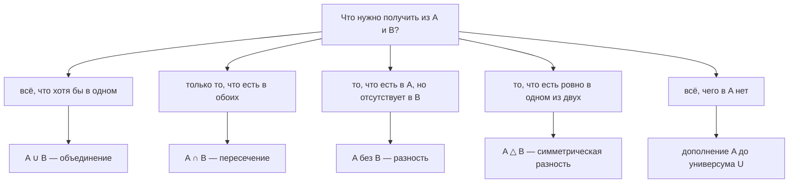

# Множества

Первая половина модуля. Вторая — отношения и функции — лежит в
[`theory-2-relations-functions.md`](./theory-2-relations-functions.md); читать её
имеет смысл после этого файла, потому что отношение определяется через множества.

## Вспоминаем школу

В школе множество показывали примерно так: «это совокупность каких-то объектов»,
рисовали два круга, закрашивали общую часть и называли её пересечением. Дальше шли
задачи вида «в классе 30 человек, 18 играют в футбол, 15 — в шахматы, 7 — и в то,
и в другое; сколько не играет ни во что». Всё.

Три факта из школьного курса, которые забываются первыми и потом мешают больше всего:

1. **В множестве нет повторов.** `{1, 2, 2, 3}` — это ровно то же самое множество,
   что и `{1, 2, 3}`. Не «почти то же», а буквально равное.
2. **В множестве нет порядка.** `{1, 2, 3} = {3, 1, 2}`. Множество отвечает ровно на
   один вопрос: «лежит ли здесь такой-то элемент?» — и ни на какой другой.
3. **Пустое множество `∅` — полноценное множество.** Оно существует, оно одно, и оно
   является подмножеством вообще всего. Пустой мешок — всё ещё мешок.

Если эти три пункта осели, дальше почти всё будет выводиться само.

## Зачем программисту

Множества — не «раздел математики», а формат, в котором уже написана половина вашего
кода. Вот честные примеры из бэкенда:

- **Права доступа.** У пользователя есть набор прав, у роли — свой набор. Вопрос
  «какие права выдать, а какие отобрать при смене роли» — это буквально две разности
  множеств. Без формулы это пишется в три вложенных цикла с багом на границе.
- **Дедупликация.** `map[string]struct{}` — это множество, и ничем другим оно не
  является. `Set` в Go делают именно так, потому что `struct{}` занимает 0 байт.
- **SQL.** Таблица — множество строк. `JOIN` — декартово произведение с фильтром.
  `UNION`, `INTERSECT`, `EXCEPT` в стандарте SQL названы в честь `∪`, `∩` и `\`
  без всякой метафоры.
- **Типы.** `enum` / набор типизированных констант — конечное множество допустимых
  значений. `bool` — множество из двух элементов. Тип вообще удобно считать
  множеством значений, которые в него влезают.
- **Флаги и битовые маски.** Множество подмножеств n-элементного набора прав имеет
  размер `2ⁿ` — вот почему 20 булевых флагов в конфиге дают миллион возможных
  состояний, и вот почему их не получится покрыть тестами.
- **Оценка размеров.** `|A × B| = |A| · |B|` — это ответ на вопрос «сколько строк
  вернёт join без условия» до того, как вы уроните базу.

## Простыми словами

Множество — это мешок, в котором нельзя лежать дважды и в котором нет очереди.
Единственная операция, которую мешок умеет по-настоящему, — ответить `true`/`false`
на вопрос «ты внутри?». Всё остальное — операции над мешками — построено из этого
одного вопроса и обычной логики «и / или / не» из
[модуля 03](../03-logic-and-proofs/theory.md).

В коде это `func (s Set) Has(x string) bool`. В математике — значок `∈`.

## Точнее

### Принадлежность: ∈ и ∉

Запись `x ∈ A` читается «x принадлежит A», «x лежит в A», «x — элемент A».
Перечёркнутый вариант `x ∉ A` — «x не принадлежит A».

```text
2 ∈ {1, 2, 3}      — «двойка лежит в этом множестве»
5 ∉ {1, 2, 3}      — «пятёрки там нет»
```

Значок `∈` — это стилизованная греческая эпсилон от слова ἐστί («есть»). В Go тому же
самому соответствует идиома `_, ok := m[x]`: `ok` и есть значение выражения `x ∈ A`.

Общий справочник значков (ℕ, ℤ, ℚ, ℝ, `|x|`, `Σ` и прочее) живёт в
[модуле 01](../01-numbers-and-arithmetic/theory.md#словарь-обозначений) — сюда
дублировать не будем.

### Два способа записать множество

**Перечислением (roster notation)** — просто список в фигурных скобках:

```text
A = {1, 2, 3}
B = {"red", "green", "blue"}
C = {}  = ∅            — пустое множество
```

**Через условие (set-builder notation)** — «все такие x, что верно вот это»:

```text
E = {x ∈ ℕ | x чётное}          — все чётные натуральные
S = {n ∈ ℤ | −3 ≤ n ≤ 3}        = {−3, −2, −1, 0, 1, 2, 3}
```

Вертикальная черта `|` здесь читается как «таких, что» (иногда вместо неё пишут
двоеточие). Слева от черты — откуда берём кандидатов, справа — условие-фильтр.
Это в точности `filter`:

```go
// E = {x ∈ ℕ | x чётное} для x < 10
var E []int
for x := 0; x < 10; x++ {
    if x%2 == 0 { // условие справа от |
        E = append(E, x)
    }
}
fmt.Println(E) // [0 2 4 6 8]
```

**Равенство множеств.** `A = B` тогда и только тогда, когда в них лежат одни и те же
элементы. Порядок и повторы в записи роли не играют — это просто способ ввода.

### Подмножества: ⊆ и ⊂

`A ⊆ B` — «A является подмножеством B», то есть каждый элемент A лежит и в B.
На языке кванторов из [модуля 03](../03-logic-and-proofs/theory.md):
`A ⊆ B` означает `∀x (x ∈ A ⇒ x ∈ B)`.

`A ⊂ B` — «строгое подмножество»: A ⊆ B, но A ≠ B (в B есть что-то сверх A).

```text
{1, 2} ⊆ {1, 2, 3}     — верно, и даже строго: {1, 2} ⊂ {1, 2, 3}
{1, 2} ⊆ {1, 2}        — верно (нестрогое!)
{1, 2} ⊂ {1, 2}        — неверно, это одно и то же множество
∅ ⊆ A                  — верно для любого A
A ⊆ A                  — верно для любого A
```

Здесь легко споткнуться: `∈` связывает **элемент** и множество, `⊆` связывает
**два множества**. `1 ∈ {1, 2}` — верно; `{1} ⊆ {1, 2}` — верно; а `1 ⊆ {1, 2}` и
`{1} ∈ {1, 2}` — бессмыслица и ложь соответственно.

**Универсум `U`** — множество, внутри которого мы сейчас работаем: все пользователи
системы, все возможные права, все int32. Он нужен для одной операции — дополнения,
потому что «всё, что не в A» без границ означало бы «вообще всё во вселенной».

### Операции

Дальше `U` — универсум, `A` и `B` — его подмножества. Каждая операция — это логическая
связка, переведённая на язык мешков.

**Объединение `A ∪ B`** = `{x | x ∈ A или x ∈ B}` — «хотя бы в одном».

```text
   A ∪ B  (закрашено ###)

   ┌── только A ───┬── A ∩ B ─┬── только B ───┐
   │###############│##########│###############│
   └───────────────┴──────────┴───────────────┘
     A = левая + средняя      B = средняя + правая
```

**Пересечение `A ∩ B`** = `{x | x ∈ A и x ∈ B}` — «в обоих сразу».

```text
   A ∩ B

   ┌── только A ───┬── A ∩ B ─┬── только B ───┐
   │               │##########│               │
   └───────────────┴──────────┴───────────────┘
```

**Разность `A \ B`** = `{x | x ∈ A и x ∉ B}` — «в A, но не в B». Читается «A без B».
Внимание: операция **несимметрична**, `A \ B ≠ B \ A`.

```text
   A \ B                              B \ A

   ┌───────┬──────────┬───────┐   ┌───────┬──────────┬───────┐
   │#######│          │       │   │       │          │#######│
   └───────┴──────────┴───────┘   └───────┴──────────┴───────┘
```

**Дополнение `Ā`** (пишут ещё `Aᶜ` или `U \ A`) = всё в универсуме, чего нет в A.

```text
   Ā = U \ A

   ┌─ U ───────────────────────────────────┐
   │#######┌── A ──────────┐###############│
   │#######│               │###############│
   │#######└───────────────┘###############│
   └───────────────────────────────────────┘
```

**Симметрическая разность `A △ B`** = `(A \ B) ∪ (B \ A)` — «ровно в одном из двух».
Это «исключающее ИЛИ» для множеств, тот самый `XOR`.

```text
   A △ B

   ┌── только A ───┬── A ∩ B ─┬── только B ───┐
   │###############│          │###############│
   └───────────────┴──────────┴───────────────┘
```

Практический смысл `△` — «что изменилось»: сравнили список файлов до и после,
симметрическая разность и есть diff по составу.

Какую операцию брать — вопрос формулировки задачи:



### Законы

Операции над множествами ведут себя как знакомая арифметика — с поправкой на то,
что «сложение» здесь `∪`, а «умножение» `∩`.

| Закон | Формулировка |
| --- | --- |
| Коммутативность | `A ∪ B = B ∪ A`, `A ∩ B = B ∩ A` |
| Ассоциативность | `(A ∪ B) ∪ C = A ∪ (B ∪ C)`, то же для `∩` |
| Дистрибутивность | `A ∩ (B ∪ C) = (A ∩ B) ∪ (A ∩ C)` и `A ∪ (B ∩ C) = (A ∪ B) ∩ (A ∪ C)` |
| Идемпотентность | `A ∪ A = A`, `A ∩ A = A` |
| Нейтральные элементы | `A ∪ ∅ = A`, `A ∩ U = A` |
| Поглощение | `A ∪ U = U`, `A ∩ ∅ = ∅` |
| Де Морган | `дополнение(A ∪ B) = Ā ∩ B̄`, `дополнение(A ∩ B) = Ā ∪ B̄` |

Обратите внимание на дистрибутивность: в обычной арифметике работает только один
вариант (`a · (b + c) = a·b + a·c`), а `a + b·c ≠ (a+b)·(a+c)`. У множеств
дистрибутивны **обе** операции — это приятная симметрия, а не опечатка.

Законы де Моргана — те же самые, что для логики; они и доказываются переводом в
логику. «Не (в A или в B)» = «не в A и не в B». Разбор самих законов и их
доказательство живут в [модуле 03](../03-logic-and-proofs/theory.md) — здесь только
их множественная форма:

```text
дополнение к (A ∪ B) = Ā ∩ B̄     — «ни там, ни там»
дополнение к (A ∩ B) = Ā ∪ B̄     — «хотя бы где-то не лежит»
```

### Мощность и включение-исключение

`|A|` — **мощность** множества, то есть количество элементов. Для конечных множеств
это просто `len()`. Значок тот же, что у модуля числа, но путаницы обычно не
возникает: под вертикальными чертами стоит множество, а не число.

Наивное `|A ∪ B| = |A| + |B|` неверно всегда, когда множества пересекаются: общие
элементы посчитаны дважды. Лишнее надо вычесть — это **формула включения-исключения**:

```text
|A ∪ B| = |A| + |B| − |A ∩ B|
```

Для трёх множеств лишнее вычиталось слишком усердно, и часть возвращают обратно:

```text
|A ∪ B ∪ C| = |A| + |B| + |C| − |A∩B| − |A∩C| − |B∩C| + |A∩B∩C|
```

Общий случай на любое число множеств — тема
[модуля 06](../06-combinatorics/index.md), там же живёт весь подсчёт как дисциплина.

### Булеан P(A) и почему 2ⁿ

**Булеан** (он же power set, множество всех подмножеств) обозначается `P(A)`:

```text
A = {a, b}
P(A) = { ∅, {a}, {b}, {a, b} }      — 4 штуки
```

Почему `|P(A)| = 2ⁿ`, где `n = |A|`? Потому что подмножество — это ровно битовая
маска. Идём по элементам A и для каждого независимо решаем: 0 — не берём, 1 — берём.
n независимых двоичных решений дают `2ⁿ` комбинаций:

```text
элементы:   a  b
маска 00 → { }         = ∅
маска 01 → { a }
маска 10 → { b }
маска 11 → { a, b }
итого 2² = 4           — по два варианта на каждый из 2 элементов
```

Отсюда же вывод, которым живут все системы прав: набор из n прав порождает `2ⁿ`
возможных наборов доступа. При n = 10 это 1024, при n = 30 — больше миллиарда.
Именно поэтому права хранят битовой маской (`uint64` = множество из ≤ 64 прав) и
именно поэтому «протестировать все комбинации флагов» — не план. Битовые операции
подробно разбираются в [модуле 05](../05-number-theory-and-binary/index.md).

### Декартово произведение A × B

`A × B` — множество всех **упорядоченных пар** `(a, b)`, где `a ∈ A`, `b ∈ B`:

```text
A = {1, 2},  B = {x, y}
A × B = { (1,x), (1,y), (2,x), (2,y) }
|A × B| = |A| · |B| = 2 · 2 = 4
```

Ключевое слово — **упорядоченных**. Пара `(1, x)` — не множество: в ней есть первый
элемент и второй, и `(1, x) ≠ (x, 1)`. В Go это структура или массив фиксированной
длины, а не `Set`.

Произведение обобщается на `n` сомножителей: `A₁ × A₂ × ... × Aₙ` — множество кортежей
(tuples) длины n. `A × A` пишут `A²`, `A × A × A` — `A³`. Знакомая плоскость из школы,
`ℝ²`, — это как раз декартово произведение вещественной прямой на себя; отсюда и
«декартовы координаты».

В коде `A × B` — это два вложенных цикла, а в SQL — `CROSS JOIN`. Обычный
`JOIN ... ON условие` = взять `A × B` и оставить только пары, прошедшие фильтр:

```text
SELECT * FROM users u JOIN orders o ON o.user_id = u.id
  ⟺  { (u, o) ∈ users × orders | o.user_id = u.id }
```

Это буквально set-builder notation: слева от `|` — откуда берём пары, справа —
предикат. `WHERE` — ещё один такой же фильтр, дополнительный предикат к тому же
множеству пар. И отсюда сразу практический вывод: если условие в `ON` забыть, база
честно материализует всё произведение размера `|users| · |orders|`.

Почему `|A × B| = |A| · |B|` — видно из тех же вложенных циклов: внешний делает `|A|`
шагов, на каждом внутренний делает `|B|`. Это «правило произведения», подробности —
в [модуле 06](../06-combinatorics/index.md).

## Разобранные примеры

### Пример 1. Классическая задача про кружки

В команде 30 человек. 18 знают Go, 15 знают SQL, 7 знают и то, и другое.
Сколько знают хотя бы что-то одно? Сколько не знают ничего из двух?

```text
|G| = 18, |S| = 15, |G ∩ S| = 7, |U| = 30
|G ∪ S| = |G| + |S| − |G ∩ S|      — формула включения-исключения
        = 18 + 15 − 7              — подставили числа
        = 26                       — знают хотя бы одно
|U| − |G ∪ S| = 30 − 26 = 4        — дополнение: не знают ни того, ни другого
```

Проверка на здравый смысл: только Go знают `18 − 7 = 11`, только SQL — `15 − 7 = 8`,
оба — 7. Сумма `11 + 8 + 7 = 26`. Сходится.

### Пример 2. Права при смене роли

Текущие права пользователя `C = {read, write, deploy}`, права новой роли
`N = {read, write, review}`.

```text
выдать   = N \ C = {read, write, review} \ {read, write, deploy}
                 = {review}                     — есть в новой роли, нет сейчас
отобрать = C \ N = {read, write, deploy} \ {read, write, review}
                 = {deploy}                     — есть сейчас, не нужно в новой роли
оставить = C ∩ N = {read, write}                — трогать не надо
изменения = C △ N = {review, deploy}            — ровно то, что поменяется
```

Заметьте: `C △ N` — это в точности объединение первых двух строк, то есть полный
список изменений. Одна операция вместо ветвлений.

### Пример 3. Мощности навскидку

Пусть `A = {1, 2, 3}`, `B = {x, y}`.

```text
|A| = 3, |B| = 2
|A × B| = 3 · 2 = 6                — пар
|P(A)|  = 2³ = 8                   — подмножеств A
|P(B)|  = 2² = 4                   — подмножеств B
|P(A × B)| = 2⁶ = 64               — подмножеств множества пар,
                                     то есть число всех отношений из A в B
```

Последняя строчка — мостик ко второй части модуля: отношение и есть подмножество
`A × B`, и теперь понятно, сколько их бывает.

## В коде

Множество в Go — это `map[T]struct{}`. Значение `struct{}{}` занимает ноль байт,
поэтому платим только за ключи. Вариант `map[T]bool` тоже встречается, но он тратит
байт на значение и провоцирует баг «`m[x]` вернул `false`, потому что ключа нет,
или потому что значение `false`?».

```go
type Set map[string]struct{}

func NewSet(items ...string) Set {
    s := make(Set, len(items))
    for _, it := range items {
        s[it] = struct{}{}
    }
    return s
}

// Has — это ровно «x ∈ s», Len — ровно «|s|».
func (s Set) Has(x string) bool { _, ok := s[x]; return ok }
func (s Set) Len() int          { return len(s) }
```

Три базовые операции — построчный перевод определений:

```go
func (s Set) Union(o Set) Set { // s ∪ o
    r := make(Set, len(s)+len(o))
    for x := range s {
        r[x] = struct{}{}
    }
    for x := range o {
        r[x] = struct{}{}
    }
    return r
}

func (s Set) Intersect(o Set) Set { // s ∩ o
    r := make(Set)
    for x := range s {
        if o.Has(x) {
            r[x] = struct{}{}
        }
    }
    return r
}
```

```go
func (s Set) Diff(o Set) Set { // s \ o
    r := make(Set)
    for x := range s {
        if !o.Has(x) {
            r[x] = struct{}{}
        }
    }
    return r
}

func (s Set) SymDiff(o Set) Set { // s △ o = (s \ o) ∪ (o \ s)
    return s.Diff(o).Union(o.Diff(s))
}

func (s Set) SubsetOf(o Set) bool { // s ⊆ o
    for x := range s {
        if !o.Has(x) {
            return false
        }
    }
    return true
}
```

Проверяем формулу включения-исключения `|A ∪ B| = |A| + |B| − |A ∩ B|`:

```go
a := NewSet("a", "b", "c")
b := NewSet("b", "c", "d", "e")

lhs := a.Union(b).Len()                         // |A ∪ B|
rhs := a.Len() + b.Len() - a.Intersect(b).Len() // |A| + |B| − |A ∩ B|
fmt.Println(lhs, rhs, lhs == rhs)               // 5 5 true
```

Проверяем `|P(A)| = 2ⁿ` — генерация булеана через битовые маски:

```go
func PowerSet(items []string) [][]string {
    n := len(items)
    out := make([][]string, 0, 1<<n) // 1<<n — это 2ⁿ
    for mask := 0; mask < 1<<n; mask++ {
        var sub []string
        for i := 0; i < n; i++ {
            if mask&(1<<i) != 0 { // i-й бит: берём элемент или нет
                sub = append(sub, items[i])
            }
        }
        out = append(out, sub)
    }
    return out
}
// len(PowerSet([]string{"a","b","c"})) == 8 == 2³
```

Проверяем `|A × B| = |A| · |B|`:

```go
suits := []string{"♠", "♥", "♦", "♣"}
ranks := []string{"A", "K", "Q"}

var deck [][2]string
for _, s := range suits { // внешний цикл: |A| шагов
    for _, r := range ranks { // внутренний: |B| шагов на каждый
        deck = append(deck, [2]string{s, r})
    }
}
fmt.Println(len(deck), len(suits)*len(ranks)) // 12 12
```

И быстрый численный тест законов де Моргана на конкретном универсуме — Python здесь
короче, потому что `set` встроен в язык:

```python
U = set(range(1, 11))
A, B = {1, 2, 3, 4}, {3, 4, 5, 6}

print((U - (A | B)) == (U - A) & (U - B))  # дополнение к A ∪ B = Ā ∩ B̄
print((U - (A & B)) == (U - A) | (U - B))  # дополнение к A ∩ B = Ā ∪ B̄
print(len(A | B) == len(A) + len(B) - len(A & B))
# True True True
```

## Типичные ошибки

- **Путать `∈` и `⊆`.** `1 ∈ {1, 2}` — да. `{1} ⊆ {1, 2}` — да. `{1} ∈ {1, 2}` — нет,
  элемент множества `{1, 2}` — это число 1, а не множество `{1}`.
- **Считать, что `∅` и `{∅}` — одно и то же.** `|∅| = 0`, а `|{∅}| = 1`: во втором
  мешке лежит один предмет — пустой мешок. Это как `nil` против `[]any{nil}`.
- **Складывать мощности без вычитания пересечения.** `|A ∪ B| = |A| + |B|` верно
  только для непересекающихся множеств. Во всех остальных случаях будет завышение.
- **Забывать, что разность несимметрична.** `A \ B` и `B \ A` — разные ответы на
  разные вопросы («что отобрать» и «что выдать»). Перепутать их в коде прав доступа
  — классический инцидент.
- **Говорить «дополнение», не назвав универсум.** Без `U` вопрос «что не входит в A»
  не имеет ответа. В коде универсум — это ваш список всех известных прав/статусов.
- **`nil`-мапа как пустое множество.** Читать из `nil`-мапы можно (вернёт нули),
  а писать — паника. Пустое множество должно быть `make(Set)`, а не `var s Set`.
- **Ожидать порядок от множества.** Обход `map` в Go намеренно рандомизирован. Это не
  баг — у множества порядка нет. Нужен стабильный вывод — соберите ключи в слайс и
  отсортируйте.
- **Сравнивать множества как слайсы.** `reflect.DeepEqual([]string{"a","b"},
  []string{"b","a"})` даст `false`, хотя множества равны. Сравнивать надо через
  «`A ⊆ B` и `B ⊆ A`» либо через равенство мап.

## Шпаргалка формул

| Запись | Читается | Смысл |
| --- | --- | --- |
| `x ∈ A` | x принадлежит A | `_, ok := m[x]; ok == true` |
| `x ∉ A` | x не принадлежит A | ключа нет |
| `A ⊆ B` | A подмножество B | `∀x (x ∈ A ⇒ x ∈ B)` |
| `A ⊂ B` | строгое подмножество | `A ⊆ B` и `A ≠ B` |
| `∅` | пустое множество | `\|∅\| = 0`, и `∅ ⊆ A` всегда |
| `A ∪ B` | объединение | хотя бы в одном |
| `A ∩ B` | пересечение | в обоих |
| `A \ B` | разность | в A и не в B |
| `Ā` | дополнение | `U \ A` |
| `A △ B` | симметрическая разность | `(A \ B) ∪ (B \ A)`, «XOR» |
| `\|A\|` | мощность | `len(set)` |
| `\|A ∪ B\|` | — | `\|A\| + \|B\| − \|A ∩ B\|` |
| `P(A)` | булеан | все подмножества, `\|P(A)\| = 2ⁿ` |
| `A × B` | декартово произведение | все пары, `\|A × B\| = \|A\| · \|B\|` |

## Словарь терминов

| Термин | Что это |
| --- | --- |
| Множество (set) | Совокупность различных элементов без порядка и повторов |
| Элемент | Объект, лежащий в множестве |
| Универсум (`U`) | Множество, в рамках которого рассматриваются все остальные |
| Подмножество | Множество, все элементы которого лежат в другом |
| Мощность (`\|A\|`) | Количество элементов конечного множества |
| Булеан (`P(A)`) | Множество всех подмножеств A |
| Кортеж (tuple) | Упорядоченный набор `(a, b, ...)`; порядок важен |
| Декартово произведение | Множество всех кортежей из сомножителей |
| Включение-исключение | Формула подсчёта мощности объединения |

## См. также

- [`theory-2-relations-functions.md`](./theory-2-relations-functions.md) — вторая
  половина модуля: отношения, порядки, функции.
- [`lessons/01-set-operations-on-data.md`](./lessons/01-set-operations-on-data.md) —
  урок с правами доступа.
- [`01-numbers-and-arithmetic`](../01-numbers-and-arithmetic/theory.md#словарь-обозначений)
  — общий словарь обозначений.
- [`03-logic-and-proofs`](../03-logic-and-proofs/theory.md) — логика, кванторы и
  законы де Моргана, из которых выведены законы множеств.
- [`05-number-theory-and-binary`](../05-number-theory-and-binary/index.md) — битовые
  маски как представление подмножеств.
- [`06-combinatorics`](../06-combinatorics/index.md) — подсчёт: правило произведения,
  включение-исключение в общем виде.

Внешние источники:

- Lehman, Leighton, Meyer — «Mathematics for Computer Science» (MIT OCW 6.042,
  свободный PDF), глава про множества и отношения.
- Rosen — «Discrete Mathematics and Its Applications», раздел «Sets».
- Khan Academy — khanacademy.org, разделы по базовой теории множеств и диаграммам Венна.
- BetterExplained — betterexplained.com (Kalid Azad), интуитивные заметки о множествах
  и комбинаторике.
- pkg.go.dev — пакет `maps` и документация по `map` в Go spec (go.dev/ref/spec).
