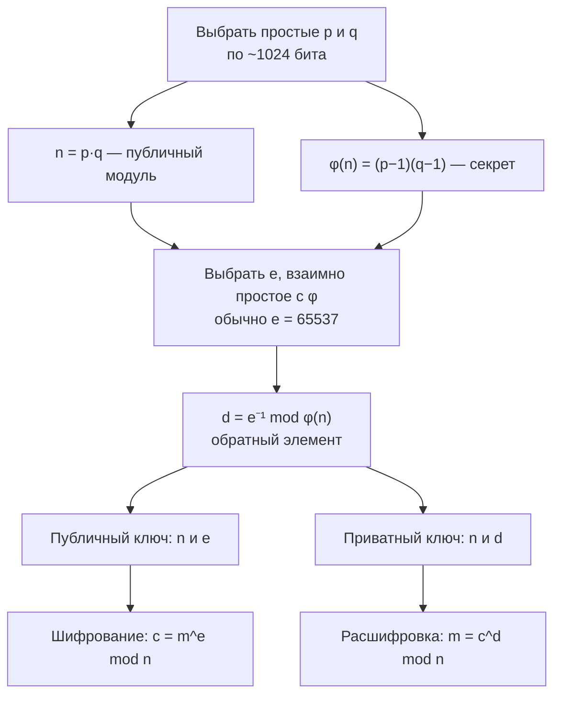

# Системы счисления, биты и что из этого выросло

## Вспоминаем школу

Десятичная запись — это сокращение суммы. Число 4507 означает

```text
4507 = 4·10³ + 5·10² + 0·10¹ + 7·10⁰
```

Десятка тут ничем не выделена, кроме количества пальцев. Возьмём основание b — и получим
позиционную систему по основанию b, где каждая цифра меньше b, а вес разряда равен bᵏ.
Двоичная (b = 2) использует цифры 0 и 1, восьмеричная (b = 8) — 0..7, шестнадцатеричная
(b = 16) — 0..9 и A..F, где A = 10, …, F = 15.

Из школы же — правило перевода «делением на основание с записью остатков снизу вверх».
Оно ровно то же самое, что деление с остатком из [первой части](./theory.md).

## Зачем программисту

Потому что железо двоичное, а человек десятичный, и hex — переводчик между ними. Конкретно:

- Один байт = 8 бит = ровно две hex-цифры (`0x00`..`0xFF`). Поэтому дампы, UUID, цвета
  `#RRGGBB`, хеши SHA-256 пишут в hex: границы байтов видны глазом.
- Права доступа в Unix (`chmod 755`) — восьмеричные, потому что 3 бита = одна восьмеричная цифра.
- Битовые флаги и маски экономят память и позволяют проверять набор опций одной операцией.
- `int32` переполняется на 2 147 483 647 — и это не «баг», а модульная арифметика по 2³².
- Хеш-таблица делает `hash & (size-1)` вместо `hash % size`, если size — степень двойки.
- Оценка «сколько существует UUID» — это оценка 2¹²², и без степеней двойки её не обсудить.

## Простыми словами

Бит — лампочка: горит или нет. Байт — восемь лампочек в ряд. Число в двоичной системе — это
показания ряда лампочек, где каждая следующая влево «стоит» вдвое дороже.

```text
разряд:   7    6    5    4    3    2    1    0
вес:    128   64   32   16    8    4    2    1
байт:     0    1    0    1    1    0    1    0   = 64+16+8+2 = 90 = 0x5A
```

Шестнадцатеричная система — это просто способ читать эти лампочки по четыре: `0101 1010` →
`5 A`. Никакой новой математики, только компактность. Восьмеричная читает по три.

Битовые операции — это «поразрядные И/ИЛИ/НЕ» из логики
([`03-logic-and-proofs`](../03-logic-and-proofs/index.md)), применённые ко всем разрядам
одновременно, за один такт процессора.

## Точнее

### Перевод между системами

**Из десятичной в двоичную — делением с остатком:**

```text
90 / 2 = 45, ост. 0     — младший бит
45 / 2 = 22, ост. 1
22 / 2 = 11, ост. 0
11 / 2 =  5, ост. 1
 5 / 2 =  2, ост. 1
 2 / 2 =  1, ост. 0
 1 / 2 =  0, ост. 1     — старший бит
читаем остатки снизу вверх: 1011010₂ = 90
```

**Из двоичной в десятичную — суммой весов** (или схемой Горнера слева направо:
`acc = acc*2 + bit`).

**Двоичная ↔ шестнадцатеричная — группами по 4 бита**, справа налево, без всякого деления:

```text
1011010₂ → 0101 1010 → 5 A → 0x5A
0xDEAD  → D    E    A    D
        → 1101 1110 1010 1101
```

Это работает только потому, что 16 = 2⁴ и 8 = 2³ — степени двойки. Перевод в десятичную
такого фокуса не допускает, оттого он и муторный.

### Битовые операции

| Операция | Go | Смысл |
|---|---|---|
| AND | `a & b` | бит 1, если он 1 в обоих |
| OR | `a \| b` | бит 1, если он 1 хотя бы в одном |
| XOR | `a ^ b` | бит 1, если биты различаются |
| NOT | `^a` (унарный в Go) | инверсия всех битов |
| AND NOT | `a &^ b` | сбросить в a биты, выставленные в b |
| сдвиг влево | `a << k` | умножить на 2ᵏ |
| сдвиг вправо | `a >> k` | целочисленно разделить на 2ᵏ |

Типовые приёмы с масками (`mask = 1 << i` — единица на позиции i):

```text
проверить бит i:   (x >> i) & 1 == 1      либо   x & (1<<i) != 0
установить бит i:  x |= 1 << i
сбросить бит i:    x &^= 1 << i           (в C/Java: x &= ^(1<<i))
переключить бит i: x ^= 1 << i
взять младшие k:   x & ((1 << k) - 1)     — маска из k единиц
```

XOR заслуживает отдельного слова: он обратим сам себе (`x ^ y ^ y == x`), поэтому лежит в
основе шифра Вернама, «найди непарный элемент» и контрольных сумм.

### Степени двойки и два трюка

```text
x & (x − 1)   — сбрасывает самый младший установленный бит
x & (−x)      — оставляет только самый младший установленный бит
```

Почему работает первый: вычитание единицы превращает младшую единицу в ноль, а все нули
правее — в единицы. AND их взаимно уничтожает.

```text
x       = 1011 0100
x − 1   = 1011 0011
x&(x−1) = 1011 0000     — младшая единица ушла
```

Отсюда классика: `x != 0 && x & (x−1) == 0` — «x является степенью двойки» (ровно один бит).
Второй трюк опирается на дополнительный код: `−x = ^x + 1`, поэтому `x & (−x)` выделяет
младший бит — это основа дерева Фенвика.

Из степеней двойки следует и главное практическое равенство:

```text
x % 2ᵏ  ==  x & (2ᵏ − 1)     — только для неотрицательных x
x / 2ᵏ  ==  x >> k           — только для неотрицательных x
```

Компилятор Go делает эту замену сам, так что писать `>>` ради скорости смысла нет — только
ради явного выражения «я работаю с битами».

### Переполнение и wraparound

`uint8` хранит числа 0..255. 255 + 1 даёт 0. Это не ошибка, а арифметика по модулю 2⁸:
беззнаковые целые в Go определены как кольцо вычетов по модулю 2ⁿ, переполнение **не**
считается паникой. Знаковые типы используют дополнительный код (two's complement): старший
бит — знаковый, а −x кодируется как 2ⁿ − x.

```text
int8:   0111 1111 = 127
      + 0000 0001
      = 1000 0000 = −128     — «переехали» через край
```

Практические следствия: `math.MaxInt64 + 1` даёт `math.MinInt64`; вычисление середины
отрезка `(lo + hi) / 2` в бинарном поиске переполняется на больших индексах, поэтому пишут
`lo + (hi-lo)/2`.

### `math/bits`

Стандартная библиотека Go закрывает почти все битовые нужды и компилируется в одну
процессорную инструкцию:

| Функция | Что делает |
|---|---|
| `bits.OnesCount64(x)` | сколько единичных битов (population count) |
| `bits.LeadingZeros64(x)` | сколько нулей слева — отсюда ⌊log₂ x⌋ = 63 − LeadingZeros |
| `bits.TrailingZeros64(x)` | сколько нулей справа |
| `bits.Len64(x)` | минимальное число бит для записи x |
| `bits.RotateLeft64(x, k)` | циклический сдвиг (нужен в хеш-функциях) |
| `bits.Reverse64(x)` | развернуть порядок битов |
| `bits.Add64` / `bits.Mul64` | сложение и умножение с переносом, 128-битный результат |

## Разобранные примеры

### Пример 1. Флаги прав одной переменной

```text
const (
    Read    = 1 << 0   // 0001 = 1
    Write   = 1 << 1   // 0010 = 2
    Execute = 1 << 2   // 0100 = 4
)
perm := Read | Write            // 0011 = 3
perm & Write != 0               // true  — право есть
perm &^= Write                  // 0001  — забрали право на запись
perm |= Execute                 // 0101 = 5
```

Ровно так устроены `chmod 755`: три группы по три бита, записанные восьмерично —
7 = 111 (rwx владельцу), 5 = 101 (r-x остальным).

### Пример 2. Почему `hash & (n−1)` заменяет `hash % n`

```text
n = 16 = 2⁴
n − 1 = 15 = 0000 1111
hash = 1101 0110 (214)
hash % 16 = 214 − 13·16 = 6
hash & 15 = 0000 0110 = 6      — совпало, и это не совпадение
```

Взятие остатка по 2ᵏ — это отбрасывание старших битов, а AND с маской делает ровно это.
Плата: используются **только младшие биты** хеша. Если хеш-функция плохая и её младшие биты
предсказуемы (например, хешируем указатели, кратные 8), все ключи слипнутся. Отсюда две
школы: брать размер таблицы **простым числом** (тогда `% p` перемешивает все биты) или
степенью двойки, но предварительно «размешать» хеш (в Java это `h ^ (h >>> 16)`, в Go —
рантайм использует AES-инструкции и случайный seed).

### Пример 3. Контрольная сумма и CRC на пальцах

Простейшая контрольная сумма — сумма байтов по модулю 256. Она ловит любую одиночную ошибку,
но не ловит перестановку байтов (сумма не зависит от порядка). Поэтому используют CRC:
сообщение трактуют как многочлен над битами и берут остаток от деления на фиксированный
многочлен-порождающий. Это буквально `mod` из первой части, но в «двоичной» арифметике, где
сложение — это XOR. Отсюда и название: **cyclic redundancy check**.

Проверка чётности — самый вырожденный случай: один бит, равный XOR всех битов сообщения.
Ловит нечётное число ошибок, не ловит чётное. Дальше начинается алгебра кодов
(Хэмминг, Рид—Соломон), которая в этот курс не входит.

### Пример 4. Идея RSA на одной странице

RSA стоит на асимметрии: перемножить два больших простых легко, разложить произведение
обратно — практически невозможно.



Почему расшифровка возвращает исходное: `c^d = m^(e·d) mod n`, а e·d ≡ 1 по модулю φ(n), и
обобщение малой теоремы Ферма (теорема Эйлера) даёт `m^(e·d) ≡ m (mod n)`. Всё, что нужно
для работы, — быстрое возведение в степень по модулю из первой части. Всё, что нужно для
безопасности, — чтобы никто не разложил n на p и q. Знать p и q — значит знать φ(n), значит
уметь вычислить d.

### Пример 5. Насколько велико пространство UUID

UUIDv4 — 128 бит, из которых 6 зафиксированы под версию и вариант, значит случайных 122.

```text
2¹²² = 2² · (2¹⁰)¹² ≈ 4 · (10³)¹² = 4·10³⁶      — приём: 2¹⁰ ≈ 10³
```

5.3·10³⁶ вариантов. Для сравнения: атомов в человеческом теле ~10²⁷, песчинок на Земле ~10¹⁹.
Оценка вероятности коллизии делается через парадокс дней рождения (модуль
[`07-probability`](../07-probability/index.md)): чтобы столкнуться с вероятностью ~50%, нужно
сгенерировать порядка √(2¹²²) ≈ 2⁶¹ ≈ 2.3·10¹⁸ идентификаторов. Генерируя миллион UUID в
секунду, вы дойдёте до этого числа примерно за 70 тысяч лет.

## В коде

```go
import "math/bits"

func isPowerOfTwo(x uint64) bool { return x != 0 && x&(x-1) == 0 }

func lowestSetBit(x uint64) uint64 { return x & -x }

// ⌊log₂ x⌋ для x > 0 — «сколько раз x можно поделить на 2»
func floorLog2(x uint64) int { return 63 - bits.LeadingZeros64(x) }
```

Перевод в любую систему счисления руками (стандартный путь — `strconv.FormatInt(n, base)`):

```go
func toBase(n int, base int) string {
	if n == 0 {
		return "0"
	}
	const digits = "0123456789abcdef"
	var out []byte
	for n > 0 {
		out = append([]byte{digits[n%base]}, out...) // остаток — очередная цифра
		n /= base
	}
	return string(out)
}
```

Демонстрация wraparound — печатает `255 0` и `127 -128`:

```go
var u uint8 = 255
var s int8 = 127
fmt.Println(u, u+1)
fmt.Println(s, s+1)
```

## Типичные ошибки

- **`>>` на отрицательных числах** — в Go это арифметический сдвиг: `-8 >> 1 == -4`, но
  `-1 >> 1 == -1`, а не 0. Замена деления сдвигом верна только для неотрицательных.
- **`x % 2ᵏ` через `&` для отрицательного x** — даст не тот знак; сначала приводите к uint.
- **Путать `^` в Go.** Бинарный `a ^ b` — XOR, унарный `^a` — NOT. В C и Java NOT — это `~`.
- **Приоритет операций.** В Go `&` и `|` связывают слабее сравнений в C-подобных языках, но
  в Go `x & mask != 0` парсится как `(x & mask) != 0` — правильно. В C нужны скобки. Ставьте
  скобки везде, чтобы не держать это в голове.
- **`(lo + hi) / 2`** в бинарном поиске — потенциальное переполнение. Пишите `lo + (hi-lo)/2`.
- **Размер хеш-таблицы = степень двойки без размешивания хеша** — гарантированные коллизии
  на структурированных ключах.
- **Считать, что hex — «другие числа».** Это та же величина, другая запись. `0x10 == 16`.
- **Забыть, что сдвиг на ≥ ширины типа** — неопределённое поведение в C; в Go даёт 0 (и это
  специфицировано), но полагаться на такое всё равно не стоит.

## Шпаргалка формул

| Тема | Формула |
|---|---|
| Позиционная запись | `n = Σ dᵢ·bⁱ`, `0 ≤ dᵢ < b` |
| Разрядность | число n требует `⌊log_b n⌋ + 1` цифр |
| Hex ↔ bin | 1 hex-цифра = 4 бита; 1 байт = 2 hex-цифры |
| Остаток по степени двойки | `x % 2ᵏ = x & (2ᵏ − 1)` (x ≥ 0) |
| Деление на степень двойки | `x / 2ᵏ = x >> k` (x ≥ 0) |
| Проверка степени двойки | `x != 0 && x & (x−1) == 0` |
| Младший бит | `x & (−x)` |
| Дополнительный код | `−x = ^x + 1`; `int8` хранит −128..127 |
| Переполнение uintN | арифметика по модулю `2ᴺ` |
| Приближение | `2¹⁰ ≈ 10³`, значит `2ⁿ ≈ 10^(0.301·n)` |
| Размер UUIDv4 | `2¹²² ≈ 5.3·10³⁶` вариантов |

## Словарь терминов

- **Основание системы (base, radix)** — сколько разных цифр используется.
- **Бит / байт / ниббл** — 1 разряд / 8 разрядов / 4 разряда (одна hex-цифра).
- **Маска** — число, у которого выставлены интересующие нас биты.
- **Population count (popcount)** — количество единичных битов.
- **Дополнительный код (two's complement)** — способ хранения знаковых целых.
- **Wraparound / переполнение** — «оборачивание» через край диапазона типа.
- **Контрольная сумма / CRC** — короткое значение для проверки целостности данных.
- **φ(n) (функция Эйлера)** — количество чисел от 1 до n, взаимно простых с n. Для простого p
  это p − 1, для n = p·q это (p−1)(q−1).

## См. также

- [`theory.md`](./theory.md) — первая часть: делимость, Евклид, модульная арифметика.
- [`07-probability`](../07-probability/index.md) — вероятность коллизий и парадокс дней рождения.
- [`09-growth-and-calculus-intuition`](../09-growth-and-calculus-intuition/index.md) — логарифмы
  и порядки величин, откуда берётся приём `2¹⁰ ≈ 10³`.
- Go: [`math/bits`](https://pkg.go.dev/math/bits), [`strconv`](https://pkg.go.dev/strconv),
  [`hash/crc32`](https://pkg.go.dev/hash/crc32).
- Lehman, Leighton, Meyer. **Mathematics for Computer Science** (MIT 6.042) — раздел про RSA.
- BetterExplained (Kalid Azad) — «Understanding Big and Little Endian», «A Little Diddy About
  Binary File Formats», статьи про основания систем счисления.
