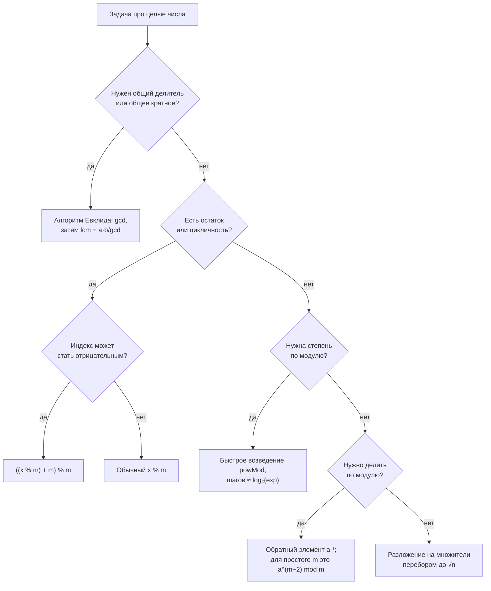

# Делимость, простые числа, НОД и арифметика остатков

## Вспоминаем школу

В третьем классе вас учили делить в столбик и говорили: «17 разделить на 5 — будет 3 и 2
в остатке». Это и есть вся теория чисел в зародыше. Формально: для любых целых a и b > 0
существует **единственная** пара целых q (частное) и r (остаток), такая что

```text
a = b·q + r,   где 0 ≤ r < b
```

Единственность здесь — важное слово: остаток не «какой-нибудь», а ровно один. Читается
`0 ≤ r < b` как «r не меньше нуля и строго меньше b». Обозначения вроде ⌊x⌋ и Σ разобраны
в [словаре обозначений](../01-numbers-and-arithmetic/theory.md#словарь-обозначений) —
загляните туда, если символ незнаком.

Ещё из школы: **b делит a** (пишут `b | a`, читается «b делит a»), если остаток равен нулю.
Простое число — то, у которого ровно два делителя: 1 и оно само. Единица простым **не**
считается — это не каприз, а необходимость, иначе разложение на множители перестало бы быть
единственным (1·2·3 и 1·1·2·3 — уже два разных разложения).

Три правила делимости, которые все когда-то знали и половину забыли:

| Делитель | Признак |
|---|---|
| 2 | последняя цифра чётная |
| 3 | сумма цифр делится на 3 |
| 4 | число из двух последних цифр делится на 4 |
| 5 | последняя цифра 0 или 5 |
| 9 | сумма цифр делится на 9 |
| 11 | знакочередующаяся сумма цифр делится на 11 |

Признак для 3 и 9 не магия: 10 ≡ 1 по модулю 9, поэтому 10ᵏ тоже ≡ 1, и всё число
сворачивается в сумму своих цифр. Через пару разделов это станет очевидным.

## Зачем программисту

Остаток — самая частая математическая операция в бэкенде после сложения:

- `hash(key) % numBuckets` — выбор бакета в map, шарда в базе, партиции в Kafka.
- `(now + offset) % 24` — часовые пояса; `i % n` — кольцевой (циклический) буфер.
- `id % 2 == 0` — деление трафика на A/B, только через хеш, а не через id (об этом ниже).
- НОД и НОК — периоды: «два cron-джоба с периодами 12 и 18 минут совпадут через НОК = 36».
- Модульная арифметика — фундамент хеширования, контрольных сумм, CRC, RSA, Diffie—Hellman,
  генераторов псевдослучайных чисел (LCG: `x = (a·x + c) % m`).
- Простые числа — размеры хеш-таблиц, полиномиальные хеши строк, ключи RSA.

## Простыми словами

Модульная арифметика — это **арифметика часов**. На циферблате 12 часов. Если сейчас 10 и
прошло 5 часов, будет 3, а не 15: мы «обернулись». Мы работаем не с числами, а с их
остатками при делении на 12. Все числа, дающие один остаток, для часов неразличимы: 3, 15,
27, 39 — это одно и то же положение стрелки.

```text
     0/12
   11    1
 10        2
9            3     10 + 5 = 15 → 15 - 12 = 3
 8          4
   7      5
      6
```

Ключевая мысль, которую стоит принять сразу: **можно брать остаток в любой момент, а не
только в конце**. Хотите посчитать (123456 · 789012) mod 7 — не нужно перемножать
гигантские числа; возьмите остатки сомножителей и перемножьте их. Это и делает
криптографию вычислимой.

НОД (наибольший общий делитель) простыми словами — самая крупная «плитка», которой можно
без остатка замостить и отрезок длины a, и отрезок длины b. НОК (наименьшее общее кратное) —
первая точка, где две линейки с делениями a и b совпадут.

## Точнее

### Основная теорема арифметики

Каждое целое n > 1 представимо в виде произведения простых **единственным способом** с
точностью до порядка множителей:

```text
n = p₁^a₁ · p₂^a₂ · … · p_k^a_k
360 = 2³ · 3² · 5
```

Отсюда простые называют «атомами» чисел. Простых бесконечно много (доказательство Евклида:
если бы их было конечное число p₁…p_k, то число p₁·…·p_k + 1 не делилось бы ни на одно из
них — противоречие). Плотность простых: около n / ln n простых чисел не превосходит n, то
есть среди 64-битных чисел примерно каждое 44-е простое. Это важно, когда RSA «ищет большое
простое случайным перебором» — искать приходится недолго.

### НОД, НОК и Евклид

Через разложение на множители:

```text
gcd(a, b) = произведение общих простых в минимальных степенях
lcm(a, b) = произведение всех простых в максимальных степенях
gcd(12, 18) = 2¹·3¹ = 6         — 12 = 2²·3, 18 = 2·3²
lcm(12, 18) = 2²·3² = 36
a · b = gcd(a, b) · lcm(a, b)   — универсальное тождество
```

Раскладывать на множители дорого (на этом и стоит RSA). Поэтому НОД считают **алгоритмом
Евклида**, которому 2300 лет и который до сих пор невозможно улучшить по простоте:

```text
gcd(a, b) = gcd(b, a mod b),   пока b ≠ 0
gcd(a, 0) = a                  — база рекурсии
```

Почему это верно: любой общий делитель a и b делит и a − b·q, то есть делит r. И наоборот.
Значит множество общих делителей пары (a, b) совпадает с множеством общих делителей пары
(b, r), а раз множества совпадают — совпадают и их максимумы.

Почему быстро: остаток падает **экспоненциально**. Можно показать, что за два шага
уменьшаемое уменьшается минимум вдвое (если r ≥ b/2, то следующий остаток < b/2). Отсюда
число шагов O(log(min(a, b))) — для 64-битных чисел это меньше сотни итераций. Худший случай
алгоритма — соседние числа Фибоначчи; красивая деталь, которую любят на собеседованиях.

### Сравнения по модулю

Запись `a ≡ b (mod m)` читается «a сравнимо с b по модулю m» и означает: a и b дают
одинаковый остаток при делении на m, то есть m | (a − b). Это отношение эквивалентности
(см. [`04-sets-relations-functions`](../04-sets-relations-functions/index.md)): оно разбивает
все целые на m классов.

Главные правила — их всего два, и они разрешают почти всё:

```text
если a ≡ b (mod m) и c ≡ d (mod m), то
  a + c ≡ b + d (mod m)      — остатки складываются
  a · c ≡ b · d (mod m)      — остатки умножаются
следствие: a^k ≡ b^k (mod m) — степень тоже работает
```

Чего **нельзя**: делить. `6 ≡ 12 (mod 6)`, но сократить на 6 и получить `1 ≡ 2` — неверно.
Деление по модулю существует, но устроено иначе (следующий раздел).

### Обратный элемент и малая теорема Ферма

«Разделить на a по модулю m» — значит умножить на такое a⁻¹, что `a · a⁻¹ ≡ 1 (mod m)`.
Такой элемент называется **обратным**. Он существует тогда и только тогда, когда
`gcd(a, m) = 1` (числа взаимно просты). Интуиция: если у a и m есть общий делитель d > 1, то
любое произведение a·x кратно d, а 1 — не кратно, значит попасть в 1 невозможно.

**Малая теорема Ферма** простыми словами: если p простое и a не делится на p, то

```text
a^(p−1) ≡ 1 (mod p)
```

То есть, возводя любое ненулевое число в степень p−1 по простому модулю, вы всегда
приземляетесь ровно в единицу. Отсюда бесплатный способ найти обратный элемент:
`a⁻¹ ≡ a^(p−2) (mod p)` — потому что `a · a^(p−2) = a^(p−1) ≡ 1`. Проверим на пальцах для
p = 7, a = 3: 3⁵ = 243 = 34·7 + 5, значит 3⁻¹ ≡ 5, и правда 3·5 = 15 ≡ 1 (mod 7).

### Что применять — дерево решений



## Разобранные примеры

### Пример 1. НОД по Евклиду вручную

```text
gcd(1071, 462)
1071 = 462·2 + 147     — остаток 147
462  = 147·3 + 21      — остаток 21
147  = 21·7 + 0        — остаток 0, стоп
gcd = 21               — последний ненулевой остаток
```

Три шага вместо разложения 1071 = 3²·7·17 и 462 = 2·3·7·11. Проверка через НОК:
lcm = 1071·462 / 21 = 23562.

### Пример 2. Быстрое возведение в степень по модулю

Посчитаем 7¹⁰ mod 13, не считая 7¹⁰ = 282475249.

```text
7²  = 49 ≡ 49 − 39 = 10 (mod 13)      — вычли 3·13
7⁴  = (7²)² ≡ 10² = 100 ≡ 100 − 91 = 9 (mod 13)
7⁸  = (7⁴)² ≡ 9² = 81 ≡ 81 − 78 = 3 (mod 13)
10 = 8 + 2                             — двоичное разложение показателя: 1010₂
7¹⁰ = 7⁸ · 7² ≡ 3 · 10 = 30 ≡ 4 (mod 13)
```

Числа ни разу не вышли за пределы трёхзначных. Ровно так работает `big.Int.Exp` и вся
криптография: log₂(показатель) умножений вместо показателя умножений.

### Пример 3. Кольцевой буфер и отрицательный индекс

Буфер на 8 элементов, голова на позиции 2, нужно взять элемент «на три назад».

```text
i = 2 − 3 = −1                — математически это позиция 7
−1 mod 8 = 7                  — математический mod всегда ≥ 0
в Go: (-1) % 8 == -1          — знак берётся от делимого!
исправление: ((i % 8) + 8) % 8 = ((-1) + 8) % 8 = 7
```

Эта строчка `((x % n) + n) % n` — рабочая лошадка везде, где индекс может уйти в минус:
кольцевые буферы, часовые пояса, циклические сдвиги.

### Пример 4. Почему признак делимости на 3 работает

```text
n = 4·100 + 5·10 + 7        — число 457 по разрядам
10 ≡ 1 (mod 3)              — 10 = 3·3 + 1
100 ≡ 1² = 1 (mod 3)        — правило степени
n ≡ 4·1 + 5·1 + 7·1 = 16 (mod 3)
16 ≡ 1 (mod 3)              — значит 457 не делится на 3, остаток 1
```

Проверка: 457 = 152·3 + 1. Сумма цифр = 16, и она даёт тот же остаток — это и есть признак.

## В коде

Евклид и НОК — четыре строки, работают за десятки итераций даже для огромных чисел:

```go
func gcd(a, b int) int {
	for b != 0 {
		a, b = b, a%b
	}
	return a
}

// Делим до умножения, чтобы не переполнить int на больших a и b.
func lcm(a, b int) int { return a / gcd(a, b) * b }
```

Корректный математический mod и быстрое возведение в степень:

```go
func mod(a, m int) int { return ((a % m) + m) % m } // всегда 0..m-1

func powMod(base, exp, m int) int {
	result := 1
	base %= m
	for exp > 0 {
		if exp&1 == 1 { // младший бит показателя выставлен
			result = result * base % m
		}
		base = base * base % m
		exp >>= 1
	}
	return result
}
```

Проверка малой теоремы Ферма одним циклом — запустите и убедитесь, что печатается
`1 1 1 1 1 1`:

```go
for a := 1; a < 7; a++ {
	fmt.Print(powMod(a, 6, 7), " ") // a^(p-1) mod p при p = 7
}
```

Разложение на множители перебором до √n — этого достаточно, потому что если n = a·b, то
меньший множитель не превосходит √n:

```go
func factorize(n int) map[int]int {
	f := map[int]int{}
	for p := 2; p*p <= n; p++ {
		for n%p == 0 {
			f[p]++
			n /= p
		}
	}
	if n > 1 { // остался один большой простой множитель
		f[n]++
	}
	return f
}
```

## Типичные ошибки

- **`%` в Go — это не `mod`.** Знак результата совпадает со знаком делимого: `-7 % 3 == -1`,
  а математический остаток равен 2. Python ведёт себя «математически» (`-7 % 3 == 2`), Go,
  C, Java, Rust — нет. Всегда оборачивайте в `((x % n) + n) % n`, если x может быть отрицательным.
- **Деление по модулю «в лоб».** `(a / b) % m` ≠ `(a % m) / (b % m)`. Делить нужно через
  обратный элемент, и только если `gcd(b, m) = 1`.
- **Переполнение внутри модульного умножения.** `a * b % m` для 64-битных a и b переполнится
  до взятия остатка. Для больших чисел — `math/big` или заведомо малые модули.
- **`lcm` через `a * b / gcd`** переполняется на больших входах; делите первым.
- **«1 — простое».** Нет. И 0 не простое, и отрицательные числа простыми не считают.
- **Шардинг по `id % n`.** Работает, пока n фиксировано; при изменении n переезжают почти все
  ключи. Отсюда consistent hashing — но это уже системный дизайн, не математика.
- **Проверка «n простое» перебором до n.** Достаточно до √n, это разница между 10⁹ и 3·10⁴
  операциями.

## Шпаргалка формул

| Тема | Формула | Смысл |
|---|---|---|
| Деление с остатком | `a = b·q + r, 0 ≤ r < b` | q и r единственны |
| Евклид | `gcd(a, b) = gcd(b, a mod b)` | база: `gcd(a, 0) = a` |
| Связь НОД и НОК | `a·b = gcd(a,b) · lcm(a,b)` | считать lcm через gcd |
| Сравнение | `a ≡ b (mod m)` ⇔ m делит `a − b` | одинаковый остаток |
| Сложение | `(a + b) mod m = ((a mod m) + (b mod m)) mod m` | брать остаток раньше |
| Умножение | `(a · b) mod m = ((a mod m)·(b mod m)) mod m` | то же для степеней |
| Обратный | `a·a⁻¹ ≡ 1 (mod m)`, существует ⇔ `gcd(a, m) = 1` | «деление» по модулю |
| Ферма | `a^(p−1) ≡ 1 (mod p)`, p простое, `p ∤ a` | отсюда `a⁻¹ ≡ a^(p−2)` |
| Плотность простых | `π(n) ≈ n / ln n` | простых «много» |
| Корректный mod | `((a % m) + m) % m` | защита от минуса |

## Словарь терминов

- **Делимость `b | a`** — a делится на b нацело. Вертикальная черта здесь — не «или».
- **Простое число** — ровно два натуральных делителя. **Составное** — больше двух.
- **Взаимно простые** — `gcd(a, b) = 1`; общих делителей, кроме 1, нет.
- **НОД / gcd** — наибольший общий делитель. **НОК / lcm** — наименьшее общее кратное.
- **Сравнение по модулю** — `a ≡ b (mod m)`, равенство остатков.
- **Класс вычетов** — множество всех чисел с данным остатком, например «все ≡ 3 (mod 7)».
- **Обратный элемент по модулю** — a⁻¹ такое, что `a·a⁻¹ ≡ 1 (mod m)`.
- **Малая теорема Ферма** — `a^(p−1) ≡ 1 (mod p)` для простого p.

## См. также

- [`theory-2-binary-and-bits.md`](./theory-2-binary-and-bits.md) — продолжение: биты, hex,
  хеширование, RSA.
- [`01-numbers-and-arithmetic`](../01-numbers-and-arithmetic/theory.md) — деление с остатком
  и словарь обозначений.
- Lehman, Leighton, Meyer. **Mathematics for Computer Science** (MIT 6.042), главы
  «Number Theory» — Евклид, сравнения, RSA с доказательствами.
- Rosen. **Discrete Mathematics and Its Applications**, глава «Number Theory and Cryptography».
- Khan Academy — курс «Cryptography», раздел «Modular arithmetic» (интерактивные задачи).
- Go: [`math/big`](https://pkg.go.dev/math/big) — `Int.GCD`, `Int.Exp`, `Int.ModInverse`.
