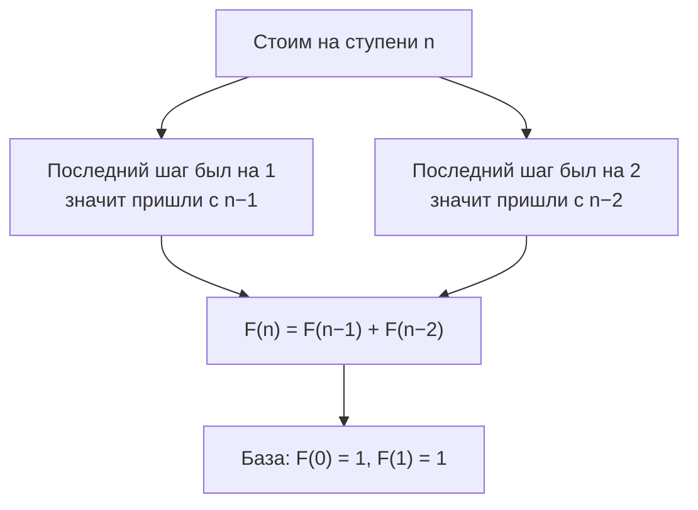

# Мультимножества, включения-исключения, Дирихле и рекуррентности

## Вспоминаем школу

Из школы про это помнят немногое, и то в виде задачек про носки в тёмной комнате
(«сколько носков надо достать, чтобы гарантированно получить пару?») и про диаграммы Венна
(«30 человек знают английский, 20 — немецкий, 10 — оба; сколько знают хотя бы один язык?»).
Обе задачи — из этой части модуля, и обе решаются одной строчкой, если знать, какой.

Ответ на вторую: 30 + 20 − 10 = 40. Мы сложили и вычли пересечение, чтобы не посчитать
двуязычных дважды. Это и есть формула включения-исключения в самом простом виде.

Предполагается, что [первая часть](./theory.md) уже прочитана: правила суммы и произведения,
C(n,k), приём «посчитать с избытком и поделить на кратность».

## Зачем программисту

- **«Хотя бы один».** «Вероятность, что хотя бы один из 5 узлов упадёт», «хотя бы одна
  коллизия», «хотя бы один retry успешен» — всё это считается через дополнение.
- **Дедупликация и SQL.** `COUNT(DISTINCT a OR b)` — это включение-исключение;
  фильтры, объединения индексов, оценки кардинальности в планировщике запросов на нём стоят.
- **Принцип Дирихле.** «В хеш-таблицу с 1000 бакетами положили 1001 ключ — коллизия
  гарантирована». «Сжатие без потерь не может сжимать все файлы» — тоже Дирихле.
- **Мультимножества и распределение.** «Разложить 100 запросов по 4 воркерам», «выбрать 5
  монет из 3 номиналов» — шары и перегородки.
- **Рекуррентности счёта.** Число путей, число валидных строк, число способов разменять
  сумму — динамическое программирование начинается с комбинаторной рекуррентности.

## Простыми словами

Три идеи этой части, каждая — одно предложение:

1. **Если элементы повторяются, посчитайте, будто они разные, и поделите на количество
   способов переставить одинаковые.**
2. **Если проще посчитать «не то», посчитайте «не то» и вычтите из целого.**
3. **Если объектов больше, чем ящиков, какой-то ящик содержит минимум два объекта.**

Третья звучит до неприличия просто, но именно из неё следуют гарантии коллизий, нижние
границы для алгоритмов и невозможность универсального сжатия.

## Точнее

### Перестановки мультимножества

Если среди n элементов есть повторяющиеся: n₁ копий первого типа, n₂ второго и так далее
(n₁ + n₂ + … = n), то различных перестановок

```text
n! / (n₁! · n₂! · … · n_k!)
MISSISSIPPI: n = 11, M=1, I=4, S=4, P=2
11! / (1!·4!·4!·2!) = 39 916 800 / 1152 = 34 650
```

Частный случай при двух типах — это ровно C(n, k): «сколько способов расставить k единиц
среди n позиций» = `n!/(k!(n−k)!)`. То есть сочетания — просто перестановки мультимножества
из нулей и единиц.

### Шары и перегородки

Задача: разложить k **одинаковых** предметов по n **различным** ящикам (ящик может остаться
пустым). Классический трюк: изобразим предметы звёздочками, а границы между ящиками —
перегородками.

```text
k = 7 шаров, n = 4 ящика:
* * | * * * | | * *      →  ящики получили 2, 3, 0, 2
```

Всего позиций в этой строке: k звёздочек + (n−1) перегородок. Расстановка полностью
задаётся тем, какие позиции заняты звёздочками:

```text
C(n + k − 1, k) = C(4 + 7 − 1, 7) = C(10, 7) = C(10, 3) = 120
```

Эта же формула отвечает на вопрос «сколько неупорядоченных выборок k элементов из n типов с
повторениями» — правая нижняя клетка таблицы из [первой части](./theory.md). Если каждый
ящик обязан быть непустым, сначала кладём по одному в каждый и распределяем остаток:
`C(k − 1, n − 1)`.

### Формула включения-исключения

Для двух множеств:

```text
|A ∪ B| = |A| + |B| − |A ∩ B|
```

Читается: «мощность объединения равна сумме мощностей минус мощность пересечения».
Обозначение |A| — количество элементов (см.
[словарь обозначений](../01-numbers-and-arithmetic/theory.md#словарь-обозначений)).

Для трёх:

```text
|A ∪ B ∪ C| = |A| + |B| + |C|
              − |A∩B| − |A∩C| − |B∩C|
              + |A∩B∩C|
```

Общий принцип: складываем одиночные, вычитаем парные, прибавляем тройные, вычитаем
четверные — знаки чередуются. Интуиция: элемент, лежащий ровно в t множествах, посчитан
C(t,1) раз со знаком «+», C(t,2) раз со знаком «−» и так далее; по биному эта сумма ровно 1.

```text
     ┌───────────────┐
     │   A           │
     │      ┌────────┼──────┐
     │      │ A∩B    │  B   │
     │      │        │      │
     └──────┼────────┘      │
            │               │
            └───────────────┘
   пересечение посчитано дважды → вычитаем один раз
```

### Счёт через дополнение

Если U — всё пространство, а A — «плохие» варианты, то «хороших» ровно `|U| − |A|`.
Формулировка «хотя бы один» почти всегда должна разворачиваться в «не ни одного»:

```text
хотя бы один = всего − ни одного
```

Пример: сколько строк длины 5 над алфавитом {a,b,c} содержат хотя бы одну букву `a`?

```text
всего:        3⁵ = 243
ни одной a:   2⁵ = 32          — только b и c
хотя бы одна: 243 − 32 = 211
```

Прямой подсчёт («ровно одна a» + «ровно две» + …) потребовал бы пяти слагаемых с
биномиальными коэффициентами и дал бы то же самое. Дополнение короче почти всегда.

### Принцип Дирихле (pigeonhole)

**Базовая форма.** Если n предметов разложить по m ящикам и n > m, то хотя бы в одном
ящике окажется минимум два предмета.

**Усиленная форма.** Найдётся ящик, где не меньше `⌈n/m⌉` предметов (⌈x⌉ — округление вверх).

Следствия, которые программист встречает регулярно:

- Хеш-функция с 2³² возможными значениями на множестве из 2³² + 1 входов обязана иметь
  коллизию. Это не про качество хеша, это арифметика.
- Универсального сжатия без потерь не бывает: файлов длины ≤ n меньше, чем файлов длины
  n+1, значит какой-то файл сжатие обязано удлинить.
- В любой группе из 13 человек двое родились в один месяц.

### Простые рекуррентности счёта

Задача «лестница»: сколько способов подняться на n ступенек, шагая на 1 или на 2?



Это числа Фибоначчи. Приём универсален: **классифицируем варианты по последнему шагу**,
классы не пересекаются и покрывают всё, значит по правилу суммы складываем.

```text
F(0)=1, F(1)=1, F(2)=2, F(3)=3, F(4)=5, F(5)=8, F(6)=13
```

Тот же приём даёт число двоичных строк без двух единиц подряд (тоже Фибоначчи), число
правильных скобочных последовательностей (числа Каталана `C(2n,n)/(n+1)`) и число способов
разменять сумму монетами (классическая задача динамического программирования).

## Разобранные примеры

### Пример 1. Три фильтра в аналитике

Из 1000 пользователей: 600 открывали приложение, 400 сделали покупку, 300 писали в
поддержку; 250 открывали и покупали, 150 открывали и писали, 100 покупали и писали, 50
делали всё три. Сколько сделали хотя бы что-то?

```text
|A∪B∪C| = 600 + 400 + 300          — одиночные
          − 250 − 150 − 100        — парные
          + 50                     — тройное
        = 1300 − 500 + 50 = 850
```

Значит 1000 − 850 = 150 пользователей не сделали ничего. Ровно этот счёт делает
планировщик БД, оценивая кардинальность `WHERE a OR b OR c`.

### Пример 2. Распределение задач по воркерам

Сколько существует способов раздать 10 одинаковых задач 4 воркерам?

```text
шары и перегородки: k = 10, n = 4
C(10 + 4 − 1, 10) = C(13, 10) = C(13, 3)
C(13,3) = 13·12·11 / (3·2·1)
        = 1716 / 6                — числитель 13·12 = 156, затем 156·11 = 1716
        = 286
```

286 способов. А если каждый воркер обязан получить хотя бы одну задачу:
`C(10 − 1, 4 − 1) = C(9,3) = 84`.

### Пример 3. Feature-флаги

12 булевых флагов. Сколько всего конфигураций и сколько из них включают ровно 3 флага?

```text
всего:           2¹² = 4096
ровно 3:         C(12,3) = 12·11·10/6 = 220
хотя бы 1:       4096 − 1 = 4095            — вычли конфигурацию «все выключены»
не более двух:   C(12,0)+C(12,1)+C(12,2) = 1 + 12 + 66 = 79
```

4096 — это число, которое стоит называть вслух на планировании: полностью протестировать
такую матрицу невозможно, значит нужны либо ограничения на сочетания флагов, либо
pairwise-подход.

### Пример 4. Пагинация и «глубокие» страницы

Курсорная пагинация по 50 элементов на страницу для 10⁶ записей даёт 20 000 страниц — это
просто деление. Комбинаторика появляется, когда спрашивают «сколько существует различных
наборов из 50 элементов, которые могли бы оказаться на странице при произвольной
сортировке»: это C(10⁶, 50), число с примерно 250 знаками. Практический вывод скучный, но
важный: устойчивая пагинация возможна только при **тотальном порядке** (уникальный ключ в
сортировке), иначе «страница» — это выбор из астрономического множества.

## В коде

Проверим формулу шаров и перегородок полным перебором для маленьких n и k:

```go
// bruteBars считает наборы (x₁..xₙ) неотрицательных чисел с суммой k
func bruteBars(n, k int) int {
	if n == 1 {
		return 1 // остаток обязан целиком уйти в единственный ящик
	}
	total := 0
	for first := 0; first <= k; first++ {
		total += bruteBars(n-1, k-first)
	}
	return total
}

fmt.Println(bruteBars(4, 7), binomial(4+7-1, 7)) // 120 120
```

Включение-исключение для произвольного числа множеств — перебор всех непустых подмножеств
масками (те самые биты из модуля
[`05-number-theory-and-binary`](../05-number-theory-and-binary/index.md)):

```go
// sets[i] — множества; size(mask) возвращает |пересечение множеств из mask|
func unionSize(n int, size func(mask int) int) int {
	total := 0
	for mask := 1; mask < 1<<n; mask++ {
		if bits.OnesCount(uint(mask))%2 == 1 {
			total += size(mask) // нечётное число множеств — плюс
		} else {
			total -= size(mask) // чётное — минус
		}
	}
	return total
}
```

Лестница Фибоначчи — и рекуррентность, и её проверка:

```go
func stairs(n int) int {
	a, b := 1, 1 // F(0), F(1)
	for i := 2; i <= n; i++ {
		a, b = b, a+b
	}
	return b
}
// stairs(5) == 8
```

## Типичные ошибки

- **Складывать пересекающиеся множества.** `|A| + |B|` без вычитания пересечения завышает
  ответ. Проверяйте: могут ли одни и те же объекты попасть в оба слагаемых?
- **Считать «хотя бы один» суммой «ровно один» + «ровно два» + …** — можно, но легко
  сбиться. Дополнение короче и надёжнее.
- **Путать одинаковые и различимые объекты.** «10 одинаковых задач по 4 воркерам» — это
  C(13,3) = 286. «10 различных задач по 4 воркерам» — это 4¹⁰ = 1 048 576. Разница в 3600 раз.
- **Забыть про пустые ящики.** `C(n+k−1, k)` разрешает пустые, `C(k−1, n−1)` — нет.
  Формулировка задачи должна подсказать, какая нужна.
- **Применять Дирихле не туда.** Он даёт **гарантию** («коллизия обязательно есть»), а не
  вероятность. Вопрос «когда коллизия вероятна» — это уже парадокс дней рождения из
  [`07-probability`](../07-probability/index.md), и ответ там √N, а не N.
- **Неправильная база рекуррентности.** В лестнице F(0) = 1 (единственный способ никуда не
  идти), а не 0. Ошибка в базе сдвигает всю последовательность.

## Шпаргалка формул

| Ситуация | Формула |
|---|---|
| Перестановки мультимножества | `n! / (n₁!·n₂!·…·n_k!)` |
| Шары и перегородки (можно пустые) | `C(n + k − 1, k)` |
| Шары и перегородки (все непустые) | `C(k − 1, n − 1)` |
| Включение-исключение, 2 множества | размер A∪B = размер A + размер B − размер A∩B |
| Включение-исключение, 3 множества | сумма одиночных − сумма парных + тройное |
| Счёт через дополнение | «хотя бы один» = всего − «ни одного» |
| Дирихле (базовый) | при n > m найдётся ящик с ≥ 2 объектами |
| Дирихле (усиленный) | найдётся ящик с ≥ ⌈n/m⌉ объектами |
| Лестница / строки без «11» | `F(n) = F(n−1) + F(n−2)` |
| Числа Каталана | `Cat(n) = C(2n,n)/(n+1)` |

## Словарь терминов

- **Мультимножество** — набор, где элементы могут повторяться и повторения учитываются.
- **Шары и перегородки (stars and bars)** — приём подсчёта распределений одинаковых
  объектов по различимым ящикам.
- **Включение-исключение** — формула мощности объединения с чередующимися знаками.
- **Дополнение** — «всё остальное»: размер Ā равен размеру U минус размер A.
- **Принцип Дирихле (pigeonhole)** — если объектов больше ящиков, где-то будет два.
- **⌈x⌉** — округление вверх («потолок»); `⌈7/3⌉ = 3`.
- **Рекуррентность** — формула, выражающая значение через предыдущие; база задаёт старт.
- **Числа Каталана** — счётная последовательность для скобочных последовательностей,
  бинарных деревьев, триангуляций.

## См. также

- [`theory.md`](./theory.md) — первая часть: правила счёта, C(n,k), бином.
- [`05-number-theory-and-binary`](../05-number-theory-and-binary/theory-2-binary-and-bits.md)
  — маски и перебор подмножеств битами.
- [`07-probability`](../07-probability/index.md) — «хотя бы один» и парадокс дней рождения
  в вероятностной постановке.
- [`11-graphs-recurrences-automata`](../11-graphs-recurrences-automata/index.md) —
  рекуррентности и их решение всерьёз.
- Lehman, Leighton, Meyer. **Mathematics for Computer Science** (MIT 6.042), главы «Counting»
  и «Sums and Asymptotics».
- Graham, Knuth, Patashnik. **Concrete Mathematics**, главы 5 и 7 (биномиальные коэффициенты,
  производящие функции).
- Rosen. **Discrete Mathematics and Its Applications**, разделы «The Pigeonhole Principle»
  и «Inclusion–Exclusion».
