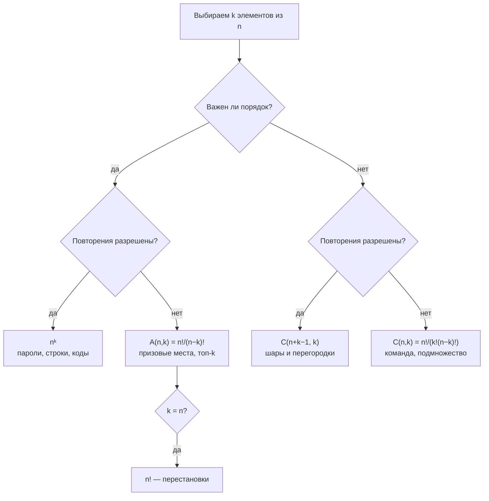

# Правила счёта, факториал, перестановки и сочетания

## Вспоминаем школу

Со школы остались две фразы: «перестановки — это n!» и «сочетания — это C из n по k». Что
именно они считают и чем отличаются — обычно забывается первым. Восстановим с нуля, начав
с двух правил, из которых выводится вообще всё.

**Правило суммы.** Если выбор делается из двух непересекающихся наборов — A с m вариантами
и B с n вариантами, — всего вариантов m + n. «Или» → плюс.

**Правило произведения.** Если выбор делается в два независимых шага: сначала m вариантов,
потом n вариантов, — всего m·n. «И» → умножить.

```text
меню: 3 супа ИЛИ 4 салата           → 3 + 4 = 7 способов взять одно блюдо
обед: 3 супа И 4 салата             → 3 · 4 = 12 способов взять комплект
```

Правило произведения — это ровно `for` внутри `for`: два вложенных цикла на 3 и 4 итерации
выполняют тело 12 раз. Комбинаторика в значительной степени состоит в том, чтобы увидеть в
задаче «или» и «и».

И третий забытый со школы факт: **0! = 1**. Не «странное соглашение», а следствие: пустую
последовательность можно упорядочить ровно одним способом. Обозначения `n!`, `C(n,k)`, `Σ`
разобраны в [словаре обозначений](../01-numbers-and-arithmetic/theory.md#словарь-обозначений).

## Зачем программисту

- **Размер пространства.** Сколько паролей из 8 символов? Сколько существует UUID? Сколько
  комбинаций у 12 feature-флагов? Это оценка стойкости и оценка риска коллизий.
- **Число тестов.** Три параметра по 4, 3 и 5 значений дают 60 комбинаций — pairwise-тестирование
  придумали именно потому, что 60 быстро превращается в 60 000.
- **Число состояний.** Конечный автомат с 5 булевыми полями — 2⁵ = 32 состояния; понимание
  этого числа отличает «протестировали» от «протестировали пару кейсов».
- **Сложность алгоритмов.** Перебор всех подмножеств — 2ⁿ, всех перестановок — n!.
  Разница между «сработает для n = 25» и «сработает для n = 10».
- **Вероятность.** Классическая вероятность — это дробь «сколько подходящих / сколько всего»,
  то есть два комбинаторных счёта (модуль [`07-probability`](../07-probability/index.md)).

## Простыми словами

Почти любая задача на счёт сводится к двум вопросам:

1. **Важен ли порядок?** «AB» и «BA» — это одно и то же или разное?
2. **Разрешены ли повторения?** Можно ли взять один и тот же элемент дважды?

Ответы дают четыре клетки таблицы, и в каждой живёт своя формула. Больше ничего запоминать
не нужно — остальное выводится.



## Точнее

### Факториал и перестановки

`n!` («эн факториал») — произведение всех натуральных чисел от 1 до n:

```text
n! = 1·2·3·…·n,   0! = 1
5! = 120
```

Число **перестановок** n различных элементов равно n!. Почему: на первое место — n
кандидатов, на второе — n−1 (один уже занят), и так далее до 1. По правилу произведения
получаем n·(n−1)·…·1.

Факториал растёт чудовищно: 10! ≈ 3.6·10⁶, 20! ≈ 2.4·10¹⁸ (уже почти предел int64),
70! > 10¹⁰⁰. Полезная оценка — формула Стирлинга: `n! ≈ √(2πn)·(n/e)ⁿ`, из которой следует
`log₂(n!) ≈ n·log₂(n/e)` — именно она даёт нижнюю границу Θ(n log n) для сортировки сравнениями.

### Размещения A(n,k)

**Размещение** — упорядоченный выбор k элементов из n без повторений:

```text
A(n,k) = n · (n−1) · … · (n−k+1) = n! / (n−k)!
A(5,2) = 5·4 = 20        — сколько пар «золото, серебро» из 5 спортсменов
```

Читается «а из эн по ка». Заметьте: A(n,n) = n!/0! = n!, то есть перестановки — частный
случай размещений.

### Сочетания C(n,k)

**Сочетание** — неупорядоченный выбор k элементов из n:

```text
C(n,k) = A(n,k) / k! = n! / (k!·(n−k)!)
C(5,2) = 20 / 2 = 10     — сколько пар «два человека в команду» из 5
```

Читается «це из эн по ка», записывается также как биномиальный коэффициент. Логика деления
на k!: каждое неупорядоченное подмножество из k элементов было посчитано k! раз — по разу на
каждый свой порядок. Это приём **«посчитать с избытком и поделить на кратность»**, один из
самых полезных в комбинаторике.

Свойства, которые стоит знать наизусть:

```text
C(n,0) = C(n,n) = 1              — пустое и полное подмножество
C(n,1) = n
C(n,k) = C(n, n−k)               — выбрать k = отбросить n−k
C(n,k) = C(n−1,k−1) + C(n−1,k)   — правило Паскаля
Σ_{k=0..n} C(n,k) = 2ⁿ           — всего подмножеств n-элементного множества
```

Правило Паскаля читается по-человечески так: зафиксируем один конкретный элемент. Либо он
входит в подмножество — тогда осталось добрать k−1 из n−1, — либо не входит, и надо взять
все k из оставшихся n−1. Классификация полная и без пересечений, значит по правилу суммы
складываем.

### Выборки с повторением

Если порядок важен и повторения разрешены — это просто строка длины k над алфавитом из n
символов:

```text
nᵏ вариантов
пароль из 8 символов алфавита в 62 знака: 62⁸ ≈ 2.2·10¹⁴
```

Если порядок не важен, а повторения разрешены — это «шары и перегородки», формула
`C(n+k−1, k)`; она разбирается во [второй части теории](./theory-2-advanced-counting.md).

### Треугольник Паскаля и бином Ньютона

Правило Паскаля порождает знаменитый треугольник: каждое число — сумма двух над ним.

```text
n=0                 1
n=1               1   1
n=2             1   2   1
n=3           1   3   3   1
n=4         1   4   6   4   1
n=5       1   5  10  10   5   1
n=6     1   6  15  20  15   6   1
```

Строка n — это все C(n,k) при k = 0..n. Сумма строки равна 2ⁿ (проверьте: 1+4+6+4+1 = 16).

**Бином Ньютона** — почему эти же числа появляются при раскрытии скобок:

```text
(a + b)ⁿ = Σ_{k=0..n} C(n,k)·a^(n−k)·b^k
(a + b)³ = a³ + 3a²b + 3ab² + b³        — коэффициенты 1,3,3,1 — строка n=3
```

Интуиция: раскрывая (a+b)(a+b)(a+b), из каждой скобки берём либо a, либо b. Слагаемое a²b
получается столько раз, сколькими способами можно выбрать одну скобку из трёх, где взяли b,
то есть C(3,1) = 3. Комбинаторика и алгебра здесь буквально одно и то же.

Частный случай при a = b = 1 даёт `Σ C(n,k) = 2ⁿ` — тождество из списка выше.

## Разобранные примеры

### Пример 1. Пароли

Алфавит: 26 строчных + 26 заглавных + 10 цифр = 62 символа. Длина ровно 8.

```text
позиций 8, на каждой 62 варианта, повторения разрешены, порядок важен
62⁸ = 218 340 105 584 896 ≈ 2.2·10¹⁴
при переборе 10¹⁰ паролей в секунду (реалистично для GPU-фермы на слабом хеше):
2.2·10¹⁴ / 10¹⁰ = 2.2·10⁴ секунд ≈ 6 часов
```

Добавим один символ длины — умножаем на 62, получаем ~16 дней. Отсюда практический вывод:
длина даёт экспоненциальный выигрыш, расширение алфавита — лишь линейный в показателе.

### Пример 2. Комитет из смешанной группы

В команде 6 бэкендеров и 4 фронтендера. Сколько способов собрать дежурную тройку, где
ровно один фронтендер?

```text
шаг 1: выбрать фронтендера      C(4,1) = 4
шаг 2: выбрать двух бэкендеров  C(6,2) = 6·5/2 = 15
шаги независимы → правило произведения
4 · 15 = 60
```

Проверка здравым смыслом: всего троек C(10,3) = 120, значит ровно половина троек содержит
ровно одного фронтендера — правдоподобно.

### Пример 3. Перестановки с одинаковыми элементами

Сколько различных «слов» получается из букв слова `LEVEL`?

```text
всего букв 5 → 5! = 120, если бы все были разными
но L встречается 2 раза и E встречается 2 раза
каждое реальное слово посчитано 2!·2! = 4 раза
120 / 4 = 30
```

Опять «посчитать с избытком и поделить на кратность». Общая формула — в
[части 2](./theory-2-advanced-counting.md).

### Пример 4. Сколько тестов даёт матрица параметров

API принимает: метод (GET/POST/PUT/DELETE — 4), формат (json/xml/proto — 3), авторизацию
(none/basic/bearer — 3), регион (5).

```text
4 · 3 · 3 · 5 = 180 комбинаций                — полное покрытие
если добавить пятый параметр из 4 значений: 720
```

Число растёт мультипликативно, поэтому полное покрытие быстро становится нереальным.
Pairwise-тестирование обещает покрыть все пары значений примерно за
max(произведение двух крупнейших) ≈ 20 тестов вместо 180 — компромисс, основанный ровно на
этой арифметике.

## В коде

Считать C(n,k) «в лоб» через факториалы плохо: 21! уже переполняет int64, хотя C(21,2) = 210.
Мультипликативная формула переполняется намного позже и не требует больших чисел:

```go
// После шага i накопленное значение равно C(n−k+i, i), поэтому деление всегда нацело.
func binomial(n, k int) int {
	if k < 0 || k > n {
		return 0
	}
	if k > n-k {
		k = n - k // симметрия C(n,k) = C(n,n−k) — меньше итераций
	}
	res := 1
	for i := 1; i <= k; i++ {
		res = res * (n - k + i) / i
	}
	return res
}
```

Более простой и надёжный вариант — считать треугольник Паскаля динамикой, без деления вообще:

```go
func pascalRow(n int) []int {
	row := make([]int, n+1)
	row[0] = 1
	for i := 1; i <= n; i++ {
		for j := i; j > 0; j-- { // идём справа налево, чтобы не затереть нужное
			row[j] += row[j-1] // правило Паскаля
		}
	}
	return row
}
```

Проверка тождества `Σ C(n,k) = 2ⁿ` — три строки, и сомнений не остаётся:

```go
row := pascalRow(20)
sum := 0
for _, v := range row {
	sum += v
}
fmt.Println(sum, 1<<20) // 1048576 1048576
```

Для действительно больших чисел (например, C(100, 50) ≈ 10²⁹) — `math/big`:

```go
c := new(big.Int).Binomial(100, 50) // 100891344545564193334812497256
```

## Типичные ошибки

- **Путать сочетания и размещения.** «Сколько способов выбрать 3 из 10» — C(10,3) = 120.
  «Сколько способов раздать золото, серебро, бронзу» — A(10,3) = 720. Всегда задавайте
  вопрос «поменяет ли смысл перестановка выбранных?».
- **Складывать там, где надо умножать.** «И» — умножение, «или» — сложение. Если шаги
  идут последовательно и оба обязательны, это «и».
- **Забыть про пересечение при сложении.** Правило суммы верно только для
  **непересекающихся** наборов. Иначе — формула включения-исключения (часть 2).
- **Считать `n!` через `int`.** 21! не помещается в int64. Для больших значений — `math/big`
  или логарифмы.
- **`C(n,k)` через факториалы в коде.** Числитель переполнится задолго до того, как
  переполнится ответ. Используйте мультипликативную формулу или Паскаля.
- **Считать «хотя бы один» напрямую.** Почти всегда проще посчитать дополнение и вычесть
  из целого — про это отдельно в части 2.
- **Считать, что «случайный пароль из 8 символов» = 62⁸.** Если человек выбирает его сам,
  реальная энтропия в разы ниже: пространство считается по фактическому распределению, а не
  по алфавиту.

## Шпаргалка формул

| Ситуация | Формула | Пример |
|---|---|---|
| Порядок важен, повторения есть | `nᵏ` | пароли, строки, IP-адреса |
| Порядок важен, повторений нет | `A(n,k) = n!/(n−k)!` | призовые места |
| Порядок не важен, повторений нет | `C(n,k) = n!/(k!(n−k)!)` | команда из k человек |
| Порядок не важен, повторения есть | `C(n+k−1, k)` | k монет по n номиналам |
| Все элементы, порядок важен | `n!` | перестановки |
| Мультимножество | `n! / (n₁!·n₂!·…)` | слово `LEVEL` |
| Всего подмножеств | `2ⁿ` | комбинации флагов |
| Правило Паскаля | `C(n,k) = C(n−1,k−1) + C(n−1,k)` | треугольник |
| Симметрия | `C(n,k) = C(n,n−k)` | оптимизация счёта |
| Бином Ньютона | `(a+b)ⁿ = Σ C(n,k)·a^(n−k)·b^k` | раскрытие скобок |
| Стирлинг | `n! ≈ √(2πn)·(n/e)ⁿ` | оценка порядка |

## Словарь терминов

- **Правило суммы** — «или»: непересекающиеся варианты складываются.
- **Правило произведения** — «и»: независимые шаги перемножаются.
- **Факториал `n!`** — произведение 1·2·…·n; `0! = 1`.
- **Перестановка** — упорядочивание всех n элементов; их n!.
- **Размещение `A(n,k)`** — упорядоченный выбор k из n без повторений.
- **Сочетание `C(n,k)`** — неупорядоченный выбор k из n; оно же биномиальный коэффициент.
- **Биномиальный коэффициент** — коэффициент при `a^(n−k)b^k` в разложении `(a+b)ⁿ`.
- **Треугольник Паскаля** — таблица C(n,k), где каждый элемент — сумма двух над ним.

## См. также

- [`theory-2-advanced-counting.md`](./theory-2-advanced-counting.md) — мультимножества,
  включения-исключения, Дирихле, рекуррентности.
- [`04-sets-relations-functions`](../04-sets-relations-functions/theory.md) — мощность
  множества и декартово произведение.
- [`07-probability`](../07-probability/index.md) — классическая вероятность как отношение
  двух комбинаторных счётов.
- Lehman, Leighton, Meyer. **Mathematics for Computer Science** (MIT 6.042), глава «Counting».
- Rosen. **Discrete Mathematics and Its Applications**, глава «Counting».
- Graham, Knuth, Patashnik. **Concrete Mathematics**, глава 5 «Binomial Coefficients».
- Khan Academy — раздел «Counting, permutations, and combinations».
- Go: [`math/big`](https://pkg.go.dev/math/big) — `Int.Binomial`, `Int.MulRange` для факториала.
