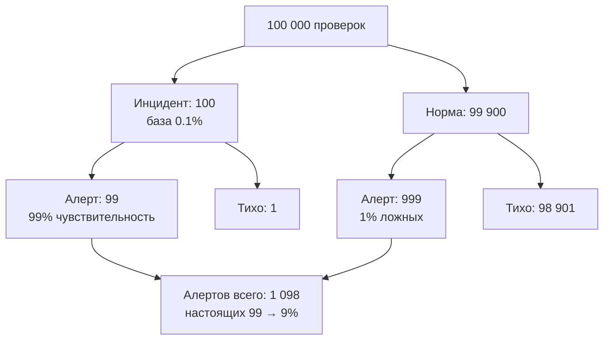

# Урок 01 — Условная вероятность и Байес через таблицы

## Разогрев

- `P(A при условии B) = P(A и B) / P(B)` — сузили мир до B, считаем долю A внутри.
- `P(A при условии B)` и `P(B при условии A)` — **разные** числа.
- Байес переворачивает условную вероятность, домножая на априорную и деля на полную.

Формулы — в [теории](../theory.md). Урок про то, как считать это **без** формул, таблицей,
потому что таблицей ошибиться почти невозможно.

## Метод: условная популяция

Идея одна: вместо вероятностей взять большое круглое число людей (или запросов, или писем) и
разложить их по клеткам. Дроби превращаются в штуки, штуки складываются, ответ — отношение
двух чисел.

## Кейс 1. Алерт на редкий инцидент

Мониторинг проверяет систему каждую минуту. Реальный инцидент случается в 0.1% проверок.
Алерт срабатывает в 99% реальных инцидентов и ошибочно — в 1% нормальных ситуаций.
Пришёл алерт. Насколько вероятно, что это настоящий инцидент?

Берём 100 000 проверок:

```text
                    инцидент   норма    всего
алерт                    99      999     1098
нет алерта                1    98 901   98 902
всего                   100    99 900  100 000
```

Как заполнялась таблица:

```text
инцидентов: 100 000 · 0.001 = 100
нормы:      100 000 − 100 = 99 900
алерт при инциденте: 100 · 0.99 = 99
алерт при норме:     99 900 · 0.01 = 999
```

Ответ читается прямо из строки «алерт»:

```text
P(инцидент при алерте) = 99 / 1098 ≈ 0.090
```

Девять процентов. Из каждых одиннадцати алертов десять ложные — и это при «точности 99%».
Отсюда практический вывод: у редких событий главный враг не чувствительность, а **база**.
Снижать шум надо не «улучшением алерта до 99.9%», а уменьшением частоты ложных
срабатываний: если довести её с 1% до 0.05%, доля настоящих инцидентов вырастет с 9% до 66%.

```drill
type: fill-in
prompt: "В той же задаче ложные срабатывания снизили с 1% до 0.05%, остальное без изменений. Сколько ложных алертов останется на 100 000 проверок?"
answer: "50"
check: exact
hint: "99 900 · 0.0005"
```

## Кейс 2. Тот же расчёт деревом

Таблица и дерево — два вида одного и того же. Дерево удобнее, когда ветвлений больше двух.



Правило чтения дерева: идём сверху вниз, **умножая** вдоль ветви и **складывая** по
параллельным ветвям. Это буквально формула полной вероятности, только нарисованная.

## Кейс 3. Два теста подряд

Первый алерт дал 9%. Пришёл второй, независимый алерт от другой подсистемы с такими же
характеристиками. Что теперь?

Байесовский приём: **апостериорная вероятность первого шага становится априорной для
второго**. Берём 100 000 «ситуаций с одним алертом», где инцидентов уже 9%:

```text
инцидентов: 9 000, нормы: 91 000
второй алерт при инциденте: 9 000 · 0.99 = 8 910
второй алерт при норме:     91 000 · 0.01 = 910
P(инцидент при двух алертах) = 8910 / 9820 ≈ 0.907
```

С 9% до 91% за одно независимое подтверждение. Именно поэтому корреляция сигналов работает
лучше, чем повышение чувствительности одного датчика.

```drill
type: fill-in
prompt: "Априорная вероятность 9%, тест даёт 99% верных положительных и 1% ложных. Какова апостериорная вероятность после положительного результата? Округлите до двух знаков."
answer: "0.91 | 0.907 | 91%"
check: fuzzy
```

## Кейс 4. Обратная задача — не перепутать направление

Формулировка, на которой ошибаются чаще всего: «90% упавших запросов приходят от мобильных
клиентов». Означает ли это, что мобильные клиенты чаще падают?

```text
дано: P(мобильный при падении) = 0.9
хотим: P(падение при мобильном)
нужно ещё: доля мобильных в трафике
```

Если мобильных 95% всего трафика, то 90% среди падений — это даже **лучше** среднего:
мобильные клиенты падают реже. Без знания базы утверждение бессодержательно. Ровно эта
ошибка встречается в постмортемах, аналитике и новостях.

```drill
type: multiple-choice
prompt: "Известно, что 90% упавших запросов пришли от мобильных клиентов, а мобильные дают 95% трафика. Что верно?"
options:
  - "мобильные клиенты падают чаще десктопных"
  - "мобильные клиенты падают реже десктопных"
  - "данных недостаточно для вывода"
  - "падения не зависят от типа клиента"
answer: "мобильные клиенты падают реже десктопных"
check: exact
hint: Сравните долю в падениях с долей в трафике
```

```drill
type: free-form
prompt: "Опишите своими словами алгоритм табличного метода Байеса: какие четыре числа надо получить и как из них читается ответ."
answer: "1) Взять большое круглое число наблюдений. 2) Разбить его по гипотезам согласно априорным вероятностям (например, 100 больных и 99 900 здоровых). 3) В каждой группе применить условные вероятности теста и получить четыре клетки: истинно-положительные, ложноотрицательные, ложноположительные, истинно-отрицательные. 4) Ответ — это отношение нужной клетки к сумме по строке наблюдаемого результата: доля истинно-положительных среди всех положительных."
check: manual
```

## Итог

Условная вероятность — это сужение пространства, а Байес — переворот направления. Считать
их надёжнее всего таблицей условной популяции: взять 100 000 наблюдений, разложить по
клеткам, поделить нужную клетку на сумму по строке. Главный практический вывод урока — про
базовую частоту: при редких событиях даже очень точный тест даёт поток ложных
срабатываний, и лечится это снижением доли ложных положительных или независимым вторым
сигналом, а не повышением чувствительности. Дальше —
[урок 02](./02-expectation-and-distributions.md), где мы перейдём от «какова вероятность» к
«сколько в среднем».
