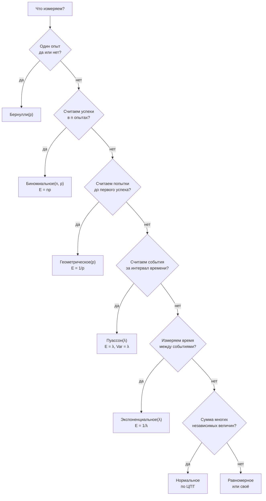

# Случайные величины, матожидание, дисперсия и распределения

## Вспоминаем школу

Школа оставила слово «среднее» и умение считать его как сумму, делённую на количество. Это
и есть матожидание, только для равновероятных исходов. Общий случай — то же самое, но
каждое значение входит со своим весом:

```text
среднее оценок 4, 5, 3, 5 = (4+5+3+5)/4 = 4.25
матожидание = Σ (значение · вероятность этого значения)
```

Ещё школа что-то говорила про «разброс», но почти наверняка забылась и формула дисперсии, и
причина, по которой отклонения возводят в квадрат, а не берут по модулю. Восстановим оба.

## Зачем программисту

- **Ожидаемое число попыток.** «Запрос успешен с вероятностью 0.9 — сколько retry в
  среднем?» Ответ 1/p = 1.11. Отсюда бюджеты на таймауты.
- **Нагрузка.** «В среднем 100 RPS» — это параметр Пуассона; из него сразу получаются
  вероятность всплеска и нужный запас мощности.
- **Интервалы.** Экспоненциальное распределение отвечает на «сколько ждать следующего
  запроса» и объясняет, почему «время до отказа диска» ведёт себя без памяти.
- **Хвосты.** Дисперсия и стандартное отклонение — язык, на котором говорят про p99 и SLA.
- **Bloom-фильтр, sampling, шардирование, load balancing** — всё это распределения.
- **Монте-Карло.** Если аналитика не даётся, симуляция даёт ответ за десять строк кода.

## Простыми словами

**Случайная величина** — это функция, превращающая исход эксперимента в число. Бросили два
кубика (исход) — записали сумму (число). В коде это буквально функция:
`func X(outcome Outcome) float64`.

**Матожидание E[X]** — «центр тяжести» распределения, среднее по бесконечному числу
повторений. **Дисперсия Var(X)** — насколько сильно значения разбегаются от центра.
**Стандартное отклонение σ** — та же дисперсия, но в исходных единицах измерения
(миллисекунды, а не «миллисекунды в квадрате»).

Распределение — это «форма» случайности. Их много, но программисту в 90% случаев хватает
шести, и выбирать между ними можно по одному вопросу: что именно мы считаем?



## Точнее

### Матожидание и его линейность

```text
E[X] = Σ xᵢ · P(X = xᵢ)              — дискретный случай
E[кубик] = (1+2+3+4+5+6)/6 = 3.5
```

Главное свойство, за которое матожидание любят:

```text
E[X + Y] = E[X] + E[Y]               — всегда, даже если X и Y зависимы!
E[c·X] = c·E[X]
```

Слово «даже если зависимы» здесь ключевое: линейность матожидания позволяет разбивать
сложные задачи на простые слагаемые, не заботясь о независимости. Классика: ожидаемое число
совпадений при случайной перестановке n писем по конвертам равно
`E[Σ индикаторов] = Σ P(письмо i попало в свой конверт) = n · (1/n) = 1` — независимо от n и
без единого сложного вычисления.

### Дисперсия и стандартное отклонение

```text
Var(X) = E[(X − E[X])²]              — средний квадрат отклонения
Var(X) = E[X²] − (E[X])²             — удобная вычислительная форма
σ = √Var(X)                          — стандартное отклонение
```

Почему квадрат, а не модуль: квадрат делает функцию гладкой (её можно дифференцировать) и
даёт свойство `Var(X + Y) = Var(X) + Var(Y)` для **независимых** X и Y. Заметьте разницу с
матожиданием: дисперсии складываются только при независимости.

Ещё одно важное следствие: `Var(c·X) = c²·Var(X)`, поэтому `σ(c·X) = |c|·σ(X)`.

### Шесть распределений

| Распределение | Что моделирует | E[X] | Var(X) |
|---|---|---|---|
| Бернулли(p) | один опыт: 1 с вероятностью p | `p` | `p(1−p)` |
| Биномиальное(n,p) | число успехов в n опытах | `np` | `np(1−p)` |
| Геометрическое(p) | номер первого успеха | `1/p` | `(1−p)/p²` |
| Пуассон(λ) | число событий за интервал | `λ` | `λ` |
| Экспоненциальное(λ) | время до следующего события | `1/λ` | `1/λ²` |
| Равномерное(a,b) | «любое значение в отрезке» | `(a+b)/2` | `(b−a)²/12` |
| Нормальное(μ, σ²) | сумма многих малых влияний | `μ` | `σ²` |

Формулы вероятностей, которые действительно нужны:

```text
Биномиальное:   P(X = k) = C(n,k)·p^k·(1−p)^(n−k)
Геометрическое: P(X = k) = (1−p)^(k−1)·p            — k−1 неудач, потом успех
Пуассон:        P(X = k) = λ^k · e^(−λ) / k!
Экспоненциальное: P(X > t) = e^(−λt)                — «ещё не случилось за время t»
```

**Свойство отсутствия памяти** есть ровно у двух: геометрического и экспоненциального.
`P(X > s + t | X > s) = P(X > t)` — «прождав час, вы не приблизились к цели». Именно поэтому
экспоненциальным моделируют время между независимыми запросами, но **не** моделируют износ
оборудования: стареющая деталь память имеет.

Связь Пуассона и экспоненциального: если события приходят по Пуассону с интенсивностью λ в
секунду, то интервалы между ними экспоненциальны с тем же λ. Это одна модель с двух сторон.

### ЗБЧ и ЦПТ простыми словами

**Закон больших чисел (ЗБЧ):** среднее по выборке сходится к матожиданию при росте числа
наблюдений. Это лицензия на Монте-Карло: «посчитаем миллион прогонов и возьмём среднее».

**Центральная предельная теорема (ЦПТ):** сумма (или среднее) многих независимых
одинаково распределённых величин — при почти любом исходном распределении — имеет примерно
**нормальное** распределение. Поэтому колокол вылезает повсюду: рост людей, ошибки
измерений, суммарная задержка из многих независимых стадий.

Практическое следствие — правило «68–95–99.7»:

```text
внутри μ ± 1σ  — примерно 68% значений
внутри μ ± 2σ  — примерно 95%
внутри μ ± 3σ  — примерно 99.7%
```

Осторожно: латентность запросов **не** нормальна — у неё длинный правый хвост, и правило
трёх сигм там даёт неверные ответы (подробнее в
[`08-statistics-and-data`](../08-statistics-and-data/index.md)).

## Разобранные примеры

### Пример 1. Сколько retry нужно в среднем

Запрос успешен с вероятностью p = 0.9, попытки независимы.

```text
X = номер первой успешной попытки → геометрическое(0.9)
E[X] = 1/p = 1/0.9 ≈ 1.11 попытки
P(X > 3) = (1−p)³ = 0.1³ = 0.001         — три неудачи подряд
```

При p = 0.5 картина меняется: `E[X] = 2`, но `P(X > 10) = 0.5¹⁰ ≈ 0.001` — то есть один
запрос из тысячи потребует больше десяти попыток. Именно ради этого хвоста ставят
ограничение на число retry и exponential backoff.

### Пример 2. Всплеск нагрузки

В среднем приходит 100 запросов в секунду. Какова вероятность, что в конкретную секунду
придёт больше 130?

```text
X ~ Пуассон(λ = 100)
E[X] = 100, Var(X) = 100, σ = 10
130 = μ + 3σ                              — три сигмы вправо
P(X > 130) ≈ 0.0017                       — примерно 0.17%
```

То есть примерно раз в 10 минут (1/0.0017 ≈ 590 секунд). Если система падает при 130 RPS, она будет падать несколько
раз в час — вывод, который очевиден только после того, как посчитан.

### Пример 3. Парадокс дней рождения и коллизии

Сколько случайных значений из пространства размера N нужно сгенерировать, чтобы вероятность
совпадения достигла 50%?

```text
P(все k различны) = (1 − 1/N)(1 − 2/N)…(1 − (k−1)/N)
ln P ≈ −(1 + 2 + … + (k−1))/N = −k(k−1)/(2N)      — использовали ln(1−x) ≈ −x
P ≈ e^(−k²/(2N))
P = 0.5  ⇒  k²/(2N) = ln 2  ⇒  k ≈ 1.177·√N
```

Отсюда правило: **коллизии начинаются около √N, а не около N**. Для 365 дней это
k ≈ 22.5 — знаменитые «23 человека в комнате». Для 64-битного пространства
√(2⁶⁴) = 2³² ≈ 4.3·10⁹ — четыре миллиарда, что достижимо. Для UUIDv4 (2¹²² вариантов) это
2⁶¹ ≈ 2.3·10¹⁸ — недостижимо.

### Пример 4. Ложные срабатывания Bloom-фильтра

Bloom-фильтр: m бит, k хеш-функций, n вставленных элементов.

```text
P(конкретный бит остался нулём) = (1 − 1/m)^(kn) ≈ e^(−kn/m)
P(бит стал единицей) ≈ 1 − e^(−kn/m)
P(ложное срабатывание) ≈ (1 − e^(−kn/m))^k        — все k битов оказались заняты
```

Подставим m = 10n (10 бит на элемент) и k = 7:

```text
kn/m = 7/10 = 0.7
e^(−0.7) ≈ 0.4966
(1 − 0.4966)⁷ = 0.5034⁷ ≈ 0.0082                  — около 0.8% ложных срабатываний
```

Оптимальное k при заданных m и n равно `(m/n)·ln 2 ≈ 6.93` — то самое 7. Вся формула
собрана из «дополнения» и «независимости»: ничего сверх первой части теории.

### Пример 5. Линейность матожидания вместо тяжёлой комбинаторики

В хеш-таблицу из m бакетов кладут n ключей равномерно. Сколько бакетов останется пустыми?

```text
Iⱼ = индикатор «бакет j пуст»
P(бакет j пуст) = (1 − 1/m)ⁿ ≈ e^(−n/m)
E[число пустых] = Σ E[Iⱼ] = m · e^(−n/m)          — линейность, зависимость не мешает
при n = m:  m·e^(−1) ≈ 0.368m                     — треть бакетов пуста!
```

Треть бакетов пустует даже при «идеальной» загрузке — важная поправка к интуиции о том, что
n ключей равномерно займут n бакетов.

## В коде

Монте-Карло — универсальная проверка. Схема одна: повторить эксперимент много раз, посчитать
долю или среднее.

```go
import "math/rand/v2"

// Ожидаемое число попыток до первого успеха.
func expectedRetries(p float64, trials int) float64 {
	total := 0
	for range trials {
		for {
			total++
			if rand.Float64() < p {
				break
			}
		}
	}
	return float64(total) / float64(trials)
}
// expectedRetries(0.9, 1_000_000) ≈ 1.111 = 1/0.9
```

Парадокс дней рождения — проверка правила √N:

```go
func collisionProb(space, k, trials int) float64 {
	hits := 0
	for range trials {
		seen := make(map[int]bool, k)
		for i := 0; i < k; i++ {
			v := rand.IntN(space)
			if seen[v] {
				hits++
				break
			}
			seen[v] = true
		}
	}
	return float64(hits) / float64(trials)
}
// collisionProb(365, 23, 100_000) ≈ 0.507
```

Генераторы нужных распределений в стандартной библиотеке:

```go
rand.Float64()             // равномерное на [0,1)
rand.IntN(n)               // равномерное целое 0..n-1
rand.NormFloat64()*σ + μ   // нормальное
rand.ExpFloat64() / λ      // экспоненциальное со средним 1/λ
```

Матожидание и дисперсия выборки одним проходом:

```go
func meanVar(xs []float64) (mean, variance float64) {
	for _, x := range xs {
		mean += x
	}
	mean /= float64(len(xs))
	for _, x := range xs {
		d := x - mean
		variance += d * d
	}
	variance /= float64(len(xs))
	return
}
```

## Типичные ошибки

- **Считать, что среднее описывает систему.** Матожидание ничего не говорит о хвосте.
  Два распределения с E = 100 мс могут иметь p99 в 150 мс и в 5 секунд.
- **Складывать дисперсии зависимых величин.** `Var(X+Y) = Var(X) + Var(Y)` требует
  независимости; матожидание — нет.
- **Путать σ и Var.** Дисперсия измеряется в квадратах единиц; сравнивать с данными нужно σ.
- **Применять правило трёх сигм к латентности.** Она не нормальна: правый хвост длинный,
  и 3σ регулярно превышается. Для латентности считают перцентили, а не сигмы.
- **Использовать экспоненциальное для износа.** Отсутствие памяти означает «деталь не
  стареет». Для износа берут распределение Вейбулла.
- **Путать Пуассон и экспоненциальное.** Пуассон считает **сколько событий** за интервал,
  экспоненциальное — **сколько ждать** до следующего. λ у них одно и то же.
- **Оценивать коллизии как n/N вместо √N.** Ошибка на порядки в опасную сторону.
- **Мало прогонов в Монте-Карло.** Точность симуляции растёт как 1/√trials: чтобы улучшить
  оценку в 10 раз, нужно в 100 раз больше прогонов.

## Шпаргалка формул

| Понятие | Формула |
|---|---|
| Матожидание | `E[X] = Σ xᵢ·P(X = xᵢ)` |
| Линейность | `E[X + Y] = E[X] + E[Y]` (всегда) |
| Дисперсия | `Var(X) = E[X²] − (E[X])²` |
| Сумма дисперсий | `Var(X + Y) = Var(X) + Var(Y)` (только для независимых) |
| Масштаб | `Var(cX) = c²·Var(X)`, `σ(cX) = c·σ(X)` при c > 0 |
| Биномиальное | `P(X=k) = C(n,k)p^k(1−p)^(n−k)`, `E = np`, `Var = np(1−p)` |
| Геометрическое | `P(X=k) = (1−p)^(k−1)p`, `E = 1/p` |
| Пуассон | `P(X=k) = λ^k e^(−λ)/k!`, `E = Var = λ` |
| Экспоненциальное | `P(X > t) = e^(−λt)`, `E = 1/λ` |
| Правило сигм | 68% / 95% / 99.7% внутри 1σ / 2σ / 3σ |
| Парадокс дней рождения | `k ≈ 1.177·√N` для 50% шанса коллизии |
| Bloom-фильтр | `p_fp ≈ (1 − e^(−kn/m))^k`, оптимум `k = (m/n)·ln2` |
| Хотя бы один | `1 − (1−p)ⁿ ≈ 1 − e^(−np)` |

## Словарь терминов

- **Случайная величина** — функция из исхода в число.
- **Распределение** — правило, приписывающее вероятности значениям случайной величины.
- **Матожидание E[X]** — среднее по бесконечному числу повторений, «центр тяжести».
- **Дисперсия Var(X)** — средний квадрат отклонения от матожидания.
- **Стандартное отклонение σ** — корень из дисперсии, в исходных единицах.
- **λ (лямбда)** — интенсивность: событий в единицу времени.
- **Отсутствие памяти** — прошлое ожидание не влияет на будущее.
- **ЗБЧ** — среднее выборки сходится к матожиданию.
- **ЦПТ** — сумма многих независимых величин приближённо нормальна.
- **Монте-Карло** — оценка величины через массовую случайную симуляцию.

## См. также

- [`theory.md`](./theory.md) — первая часть: события, условная вероятность, Байес.
- [`08-statistics-and-data`](../08-statistics-and-data/index.md) — перцентили, выборки,
  доверительные интервалы: что делать, когда распределение неизвестно.
- [`05-number-theory-and-binary`](../05-number-theory-and-binary/theory-2-binary-and-bits.md)
  — размеры пространств хешей и UUID, к которым применяется правило √N.
- Blitzstein & Hwang. **Introduction to Probability** — главы про случайные величины,
  матожидание и стандартные распределения.
- Lehman, Leighton, Meyer. **Mathematics for Computer Science** (MIT 6.042) — «Random
  Variables», «Deviation from the Mean».
- Go: [`math/rand/v2`](https://pkg.go.dev/math/rand/v2) — `Float64`, `IntN`, `NormFloat64`,
  `ExpFloat64`, `Perm`.
