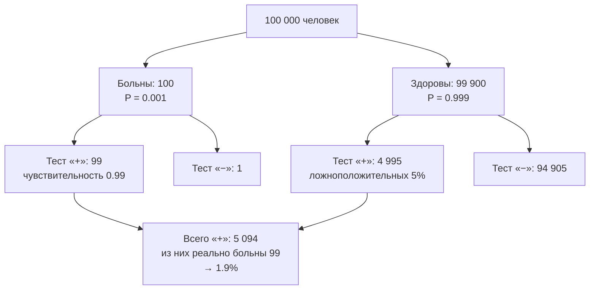

# События, вероятность, условная вероятность и Байес

## Вспоминаем школу

Со школы осталось одно определение: «вероятность — это число благоприятных исходов,
делённое на число всех исходов». Оно верное, но с важной оговоркой, о которой обычно
молчат: так считать можно, **только если все исходы равновероятны**.

```text
P(выпадет чётное на кубике) = 3/6 = 1/2      — 6 равновероятных исходов, 3 подходят
```

Запись `P(A)` читается «вероятность события A». Ещё из школы: вероятность всегда лежит
между 0 и 1, ноль — «невозможно», единица — «наверняка», а проценты — та же вероятность,
умноженная на 100.

Забываются же обычно две вещи. Первая: `P(A и B) = P(A)·P(B)` работает **только при
независимости**. Вторая: несовместные события (не могут произойти вместе) — это **не** то
же самое, что независимые. Разберём обе.

## Зачем программисту

- **Коллизии.** «Сколько записей мы можем сгенерировать до первой коллизии 64-битного id?» —
  парадокс дней рождения, ответ √N, а не N.
- **Надёжность.** «Каждый узел доступен на 99.9%. Какова доступность кластера из 100 узлов,
  если достаточно одного живого? А если нужны все?» — дополнение и произведение.
- **Retry.** «Запрос успешен с вероятностью 0.9. Сколько попыток нужно в среднем?» —
  геометрическое распределение, ответ 1/p.
- **Нагрузка.** «В среднем 100 RPS. Какова вероятность, что в секунду придёт больше 130?» —
  Пуассон.
- **Bloom-фильтр, sampling, A/B-тесты, rate limiting, шардирование** — всё это вероятность.
- **Диагностика.** «Алерт срабатывает в 99% реальных инцидентов. Пришёл алерт — насколько
  вероятен инцидент?» — Байес, и ответ обычно шокирует.

## Простыми словами

Вероятность — это доля. Если повторить эксперимент очень много раз, доля случаев, где
случилось A, стабилизируется около числа P(A). Это **частотная** трактовка, и она удобна
программисту: её можно буквально проверить циклом.

Есть ещё две трактовки, и путаница между ними — источник большинства споров:

- **Классическая**: все исходы равновероятны, считаем долю подходящих. Работает для
  кубиков, карт, случайных id — там, где симметрия очевидна.
- **Частотная**: вероятность как предел доли при многих повторениях. Работает для метрик:
  «доля запросов с ошибкой».
- **Субъективная (байесовская)**: вероятность как мера уверенности. «Вероятность, что этот
  инцидент вызван деплоем, — 70%». Повторить эксперимент нельзя, но ставку сделать можно.

Все три подчиняются одним и тем же правилам, поэтому математика одна.

## Точнее

### Пространство исходов и события

**Пространство элементарных исходов Ω** («омега») — множество всех возможных результатов
эксперимента. **Событие A** — подмножество Ω. Для броска кубика Ω = {1,2,3,4,5,6}, событие
«чётное» = {2,4,6}.

Раз события — множества (см.
[`04-sets-relations-functions`](../04-sets-relations-functions/index.md)), над ними работают
привычные операции: `A ∪ B` — «A или B», `A ∩ B` — «A и B», `Ā` — «не A».

### Аксиомы простыми словами

1. Вероятность неотрицательна: `P(A) ≥ 0`.
2. Вероятность всего пространства равна единице: `P(Ω) = 1`.
3. Для несовместных событий вероятности складываются: если `A ∩ B = ∅`, то
   `P(A ∪ B) = P(A) + P(B)`.

Из них выводится всё остальное. Например, правило дополнения:

```text
A и Ā несовместны, вместе дают Ω        — по построению
P(A) + P(Ā) = P(Ω) = 1                  — аксиома 3 и аксиома 2
P(Ā) = 1 − P(A)                         — перенесли
```

### Правило сложения

Для произвольных (не обязательно несовместных) событий:

```text
P(A ∪ B) = P(A) + P(B) − P(A ∩ B)
```

Это буквально формула включения-исключения из
[`06-combinatorics`](../06-combinatorics/theory-2-advanced-counting.md), поделённая на
размер Ω. Вычитание пересечения нужно, чтобы не посчитать общую часть дважды.

### Условная вероятность

`P(A|B)` («вероятность A при условии B») — вероятность A, если уже известно, что B
произошло. Определение:

```text
P(A и B) / P(B),   при P(B) > 0
```

Интуиция: узнав B, мы **сузили пространство** до B, и теперь считаем долю A внутри него.

```text
Ω:  ████████████████████████    всего 24 клетки
B:  ▓▓▓▓▓▓▓▓                    B — 8 клеток, P(B) = 8/24 = 1/3
A∩B:▓▓                          A∩B — 2 клетки, P(A∩B) = 2/24 = 1/12
P(A при условии B) = 2/8 = 1/4  — доля A внутри суженного мира B
```

Отсюда **правило умножения**:

```text
P(A и B) = P(B) · P(A|B) = P(A) · P(B|A)
```

### Независимость и несовместность — главная путаница

**Независимые** события: знание об одном не меняет вероятность другого.

```text
P(A|B) = P(A)   ⇔   P(A и B) = P(A)·P(B)
```

**Несовместные** (взаимоисключающие) события: не могут произойти одновременно,
`P(A и B) = 0`.

Это противоположные вещи, а не синонимы. Если A и B несовместны и обе имеют ненулевую
вероятность, они **максимально зависимы**: наступление A гарантирует, что B не наступило.

| | Несовместные | Независимые |
|---|---|---|
| Могут ли произойти вместе | нет | да |
| `P(A и B)` | 0 | `P(A)·P(B)` |
| `P(A или B)` | `P(A) + P(B)` | `P(A) + P(B) − P(A)P(B)` |
| Пример | «кубик дал 1» и «кубик дал 6» | «кубик дал 1» и «монета — орёл» |

### Формула полной вероятности и Байес

Если события H₁, …, Hₖ разбивают Ω на непересекающиеся части («гипотезы»), то

```text
P(A) = Σ P(Hᵢ) · P(A|Hᵢ)
```

Читается: вероятность A — это взвешенная сумма по всем сценариям. Отсюда **теорема Байеса**:

```text
P(H|A) = P(A|H) · P(H) / P(A)
```

где `P(A)` раскрывается формулой полной вероятности. Словами: чтобы перевернуть условную
вероятность, нужно домножить на «априорную» вероятность гипотезы и поделить на полную
вероятность наблюдения. Ключевая мысль: **`P(A|B)` и `P(B|A)` — совершенно разные числа**,
и их путаница («ошибка прокурора») стоит людям свободы, а сервисам — ложных алертов.

## Разобранные примеры

### Пример 1. Хотя бы один отказ

Узел доступен с вероятностью 0.999 независимо от других. Кластер из 100 узлов.

```text
P(конкретный узел жив) = 0.999
P(все 100 живы) = 0.999¹⁰⁰                — независимость, произведение
0.999¹⁰⁰ ≈ e^(100·ln0.999) ≈ e^(−0.1001) ≈ 0.9048
P(хотя бы один отказал) = 1 − 0.9048 = 0.0952
```

Почти 10%. Полезное приближение для малых p: `(1−p)ⁿ ≈ e^(−np)`, отсюда
`P(хотя бы один) ≈ 1 − e^(−np) ≈ np` при малом np. Здесь np = 0.1 — и правда ≈ 0.095.

### Пример 2. Медицинский тест (он же — алертинг)

Болезнь встречается у 1 человека из 1000. Тест даёт положительный результат у 99% больных
и ошибается (ложноположительно) у 5% здоровых. Тест положителен. Какова вероятность болезни?

Табличный метод: берём 100 000 человек и просто раскладываем их.

```text
всего:                          100 000
больны (0.1%):                      100
здоровы:                         99 900

больны и тест «+»: 100 · 0.99  =     99
больны и тест «−»:                    1
здоровы и тест «+»: 99900·0.05 =   4 995
здоровы и тест «−»:               94 905

всего положительных: 99 + 4995 = 5 094
P(болен при положительном тесте) = 99 / 5094 ≈ 0.0194
```

Меньше 2%. Ровно так же ведёт себя алерт на редкий инцидент: даже при 99% чувствительности
поток ложных срабатываний утопит сигнал, если базовая частота события мала. Это не изъян
теста, а арифметика редких событий.



Формулой это же:

```text
P(B|+) = P(+|B)·P(B) / (P(+|B)·P(B) + P(+|Z)·P(Z))     — Байес
       = 0.99·0.001 / (0.99·0.001 + 0.05·0.999)
       = 0.00099 / (0.00099 + 0.04995)
       = 0.00099 / 0.05094 ≈ 0.0194                     — совпало с таблицей
```

Таблица и формула дают одно и то же; таблицей ошибиться труднее.

### Пример 3. Спам-фильтр

Слово «выигрыш» встречается в 20% спама и в 1% нормальных писем. Спама 40% от всей почты.
Письмо содержит «выигрыш» — насколько вероятно, что это спам?

```text
P(слово) = 0.4·0.2 + 0.6·0.01 = 0.08 + 0.006 = 0.086      — полная вероятность
P(спам при наличии слова) = 0.08 / 0.086 ≈ 0.930
```

93%. Наивный байесовский классификатор — это ровно эта формула, применённая ко всем словам
письма сразу в предположении их независимости (отсюда «наивный»).

### Пример 4. Две ловушки в одной задаче

Бросаем монету дважды. A — «первый бросок орёл», B — «оба броска одинаковы».

```text
Ω = {ОО, ОР, РО, РР}, все по 1/4
P(A) = 2/4 = 1/2        — {ОО, ОР}
P(B) = 2/4 = 1/2        — {ОО, РР}
P(A и B) = 1/4          — {ОО}
P(A)·P(B) = 1/4         — совпало → события независимы
```

При этом A и B явно «пересекаются по смыслу» — интуиция обманывает, а арифметика нет.
Проверять независимость надо счётом, а не ощущением.

## В коде

Универсальный способ проверить любую вероятностную выкладку — симуляция Монте-Карло.
Если аналитический ответ и симуляция расходятся, ошибка почти всегда в выкладке.

```go
import "math/rand/v2"

// Доля прогонов, в которых отказал хотя бы один из n узлов.
func atLeastOneFailure(n int, up float64, trials int) float64 {
	bad := 0
	for range trials {
		for i := 0; i < n; i++ {
			if rand.Float64() > up { // узел отказал
				bad++
				break
			}
		}
	}
	return float64(bad) / float64(trials)
}
// atLeastOneFailure(100, 0.999, 1_000_000) ≈ 0.095
```

Байес тоже проверяется симуляцией — и это лучший способ поверить в 1.9% из примера 2:

```go
func bayesSim(prevalence, sensitivity, falsePositive float64, trials int) float64 {
	positives, sickPositives := 0, 0
	for range trials {
		sick := rand.Float64() < prevalence
		p := sensitivity
		if !sick {
			p = falsePositive
		}
		if rand.Float64() < p {
			positives++
			if sick {
				sickPositives++
			}
		}
	}
	return float64(sickPositives) / float64(positives)
}
// bayesSim(0.001, 0.99, 0.05, 10_000_000) ≈ 0.019
```

## Типичные ошибки

- **Перепутать `P(A|B)` и `P(B|A)`.** «99% больных дают положительный тест» не значит
  «99% положительных больны». Разница в примере 2 — в 50 раз.
- **Игнорировать базовую частоту (base rate).** Редкость события важнее точности теста.
  Если инцидентов 1 на 10 000 проверок, даже 0.1% ложных срабатываний утопит сигнал.
- **Считать несовместные события независимыми.** Они, наоборот, максимально зависимы.
- **Умножать вероятности зависимых событий.** `P(A и B) = P(A)P(B)` только при
  независимости; иначе `P(A)·P(B|A)`.
- **Считать «хотя бы один» суммой.** `P(хотя бы один из 100 при p = 0.02)` — это не
  100·0.02 = 2, а `1 − 0.98¹⁰⁰ ≈ 0.867`. Складывать можно только несовместные события.
- **Делить на ноль.** `P(A|B)` не определена при `P(B) = 0`.
- **Ошибка игрока.** Монета «не помнит» прошлых бросков: после десяти орлов вероятность
  орла по-прежнему 1/2. Но и обратное неверно — если монета честная, серии обязаны
  встречаться.
- **Забыть, что классическая формула требует равновероятности.** «Либо встречу динозавра,
  либо нет, значит 50%» — исходы не равновероятны.

## Шпаргалка формул

| Правило | Формула |
|---|---|
| Диапазон | `0 ≤ P(A) ≤ 1` |
| Дополнение | `P(не A) = 1 − P(A)` |
| Сложение | `P(A или B) = P(A) + P(B) − P(A и B)` |
| Несовместные | `P(A и B) = 0`, значит `P(A или B) = P(A) + P(B)` |
| Умножение | `P(A и B) = P(A)·P(B при условии A)` |
| Независимость | `P(A и B) = P(A)·P(B)` |
| Условная | `P(A при условии B) = P(A и B) / P(B)` |
| Полная вероятность | `P(A) = Σ P(Hᵢ)·P(A при условии Hᵢ)` |
| Байес | `P(H при условии A) = P(A при условии H)·P(H) / P(A)` |
| Хотя бы один из n | `1 − (1−p)ⁿ ≈ 1 − e^(−np)` при малом p |

## Словарь терминов

- **Ω (омега)** — пространство элементарных исходов, множество всех возможных результатов.
- **Событие** — подмножество Ω; «произошло A» значит «исход попал в A».
- **Несовместные события** — не могут случиться одновременно, `P(A и B) = 0`.
- **Независимые события** — знание об одном не меняет вероятность другого.
- **Условная вероятность `P(A|B)`** — вероятность A в суженном мире, где B уже произошло.
- **Априорная вероятность** — то, что мы думали до наблюдения; **апостериорная** — после.
- **Base rate (базовая частота)** — доля события в популяции до всякого теста.
- **Чувствительность** — `P(тест «+» | болен)`; **специфичность** — `P(тест «−» | здоров)`.
- **Ошибка прокурора** — подмена `P(улика | невиновен)` на `P(невиновен | улика)`.

## См. также

- [`theory-2-random-variables-and-distributions.md`](./theory-2-random-variables-and-distributions.md)
  — случайные величины, матожидание, распределения, Монте-Карло.
- [`06-combinatorics`](../06-combinatorics/theory.md) — счёт исходов для классической вероятности.
- [`08-statistics-and-data`](../08-statistics-and-data/index.md) — что делать, когда
  вероятности неизвестны и есть только данные.
- Blitzstein & Hwang. **Introduction to Probability** (свободно доступна на probabilitybook.net)
  и курс Stat 110 — лучший вход в тему, много «историй» вместо формул.
- Lehman, Leighton, Meyer. **Mathematics for Computer Science** (MIT 6.042), часть IV «Probability».
- Khan Academy — раздел «Probability» (условная вероятность, Байес, деревья).
- 3Blue1Brown — ролики «Bayes theorem» и «The medical test paradox».
