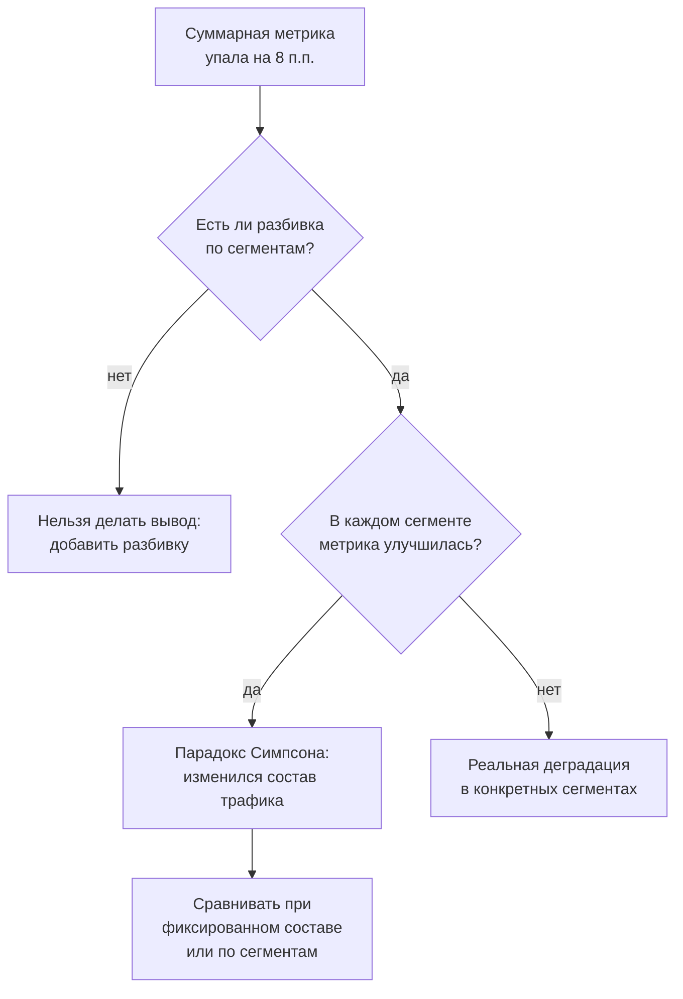

# Урок 02 — Корреляция, причинность и парадоксы

## Разогрев

- Корреляция Пирсона `r ∈ [−1, 1]` измеряет только **линейную** связь.
- У любой корреляции минимум четыре объяснения: X→Y, Y→X, общая причина, отбор.
- Сводные статистики не заменяют график (квартет Энскомба).

Подробности — во [второй части теории](../theory-2-inference-and-traps.md).

## Кейс 1. «Алерты вызывают падения»

Из аналитики: у сервисов с большим числом настроенных алертов больше инцидентов, r = 0.62.
Предложение на планировании: сократить алерты.

Разберём по схеме четырёх объяснений:

```text
X → Y   алерты вызывают падения?         — маловероятно, алерт только наблюдает
Y → X   падения вызывают алерты?         — правдоподобно: после инцидента добавляют алерт
Z → X, Z → Y  общая причина?             — очень правдоподобно: сложность сервиса
отбор                                     — измеряли только сервисы с мониторингом
```

Скорее всего верна комбинация второго и третьего: сложные, критичные сервисы и падают чаще,
и мониторятся плотнее, а после каждого инцидента появляется новый алерт. Сокращение алертов
не уменьшит инциденты — оно уменьшит их **обнаружение**, что хуже.

```drill
type: multiple-choice
prompt: "Обнаружена корреляция r = 0.62 между числом алертов и числом инцидентов. Какое действие корректно?"
options:
  - "сократить число алертов"
  - "проверить гипотезу об общей причине (сложность сервиса) и сравнить сервисы схожей сложности"
  - "добавить алертов, чтобы усилить связь"
  - "признать связь причинной, так как r больше 0.5"
answer: "проверить гипотезу об общей причине (сложность сервиса) и сравнить сервисы схожей сложности"
check: exact
```

## Кейс 2. Парадокс Симпсона в релизе

Новая версия сервиса. Метрика — доля успешных запросов.

```text
                старая версия        новая версия
API v1        9 500/10 000 = 95%     980/1 000 = 98%
API v2          400/500   = 80%   8 500/10 000 = 85%
────────────────────────────────────────────────────
итого       9 900/10 500 ≈ 94.3%  9 480/11 000 ≈ 86.2%
```

Новая версия лучше в **каждом** API, но суммарно хуже на 8 процентных пунктов. Причина не в
коде, а в составе: в старой версии почти весь трафик шёл через надёжный v1, в новой — через
менее надёжный v2. Метрика упала из-за перераспределения трафика.



Правило, которое стоит записать: **прежде чем объяснять изменение агрегата, проверьте, не
изменился ли состав**.

```drill
type: fill-in
prompt: "В старой версии 10 000 запросов через API v1 (95% успеха) и 500 через v2 (80%). Какова суммарная доля успеха в процентах? Округлите до одного знака."
answer: "94.3 | 94.3%"
check: fuzzy
hint: "(9500 + 400) / 10 500"
```

## Кейс 3. Ошибка выжившего в нагрузочном тесте

Нагрузочный тест: 100 000 запросов, p99 = 120 мс, отчёт «всё отлично». В логах — 4 000
таймаутов по 30 секунд, которые генератор посчитал ошибками и **не** внёс в гистограмму
латентности.

```text
измеренная выборка:  96 000 успешных → p99 = 120 мс
реальная картина:    100 000 запросов, 4% с временем ≥ 30 000 мс
честный p99 по всем 100 000: попадает в область таймаутов → ≥ 30 000 мс
```

Разница в 250 раз, и она полностью объясняется тем, **кто попал в выборку**. Правило:
таймауты и ошибки должны входить в замеры латентности как значения, равные таймауту, —
иначе метрика улучшается ровно тогда, когда система деградирует.

Родственная ловушка — **coordinated omission**: генератор нагрузки ждёт ответа перед
отправкой следующего запроса. Во время затыка он просто перестаёт отправлять запросы и не
измеряет самое плохое время, хотя реальный пользователь в этот момент стоит в очереди.
Лечение — измерять от **запланированного** времени отправки, а не от фактического.

```drill
type: multiple-choice
prompt: "Нагрузочный тест не включает таймауты в гистограмму латентности. Как ведёт себя измеренный p99 при росте числа таймаутов?"
options:
  - "растёт пропорционально"
  - "не меняется"
  - "улучшается, потому что медленные запросы исключаются из выборки"
  - "становится равен таймауту"
answer: "улучшается, потому что медленные запросы исключаются из выборки"
check: exact
```

## Кейс 4. Регрессия к среднему

В понедельник эндпоинт показал аномальный p99 в 2 секунды. Команда включила кеш. В среду
p99 = 300 мс. Вывод «кеш помог» — преждевременный.

```text
p99 по дням: 280, 310, 295, 2000, 305, 290, 300
                            ↑ аномалия
```

Аномалии по определению редки, поэтому следующий день почти наверняка окажется ближе к
норме — независимо от принятых мер. Чтобы отделить эффект кеша от естественного откáта,
нужно сравнивать не «до аномалии и после», а сопоставимые периоды: например, недели с кешем
и без, или A/B по трафику.

```drill
type: free-form
prompt: "После аномального дня команда внесла изменение, и метрика вернулась к норме. Опишите, как корректно проверить, что помогло именно изменение."
answer: "Нужно сравнить сопоставимые периоды, а не «аномалию и следующий день». Варианты: разделить трафик на две группы, где изменение включено и выключено, и сравнить их одновременно; сравнить несколько полных недель до и после, глядя на распределение, а не на одно значение; воспроизвести исходные условия аномалии (ту же нагрузку или тот же запрос) с включённым и выключенным изменением. Дополнительно стоит убедиться, что механизм влияния понятен — что именно кеш убрал из критического пути."
check: manual
```

## Кейс 5. Квартет Энскомба своими руками

Четыре набора по 11 точек с одинаковыми средними, дисперсиями, r ≈ 0.816 и одинаковой
линией регрессии `y = 3 + 0.5x`. Проверить это можно за минуту:

```go
// Набор I и набор II квартета Энскомба.
x1 := []float64{10, 8, 13, 9, 11, 14, 6, 4, 12, 7, 5}
y1 := []float64{8.04, 6.95, 7.58, 8.81, 8.33, 9.96, 7.24, 4.26, 10.84, 4.82, 5.68}
y2 := []float64{9.14, 8.14, 8.74, 8.77, 9.26, 8.10, 6.13, 3.10, 9.13, 7.26, 4.74}

fmt.Println(pearson(x1, y1), pearson(x1, y2)) // ≈ 0.816 и ≈ 0.816
```

Первый набор — облако вокруг прямой, второй — идеальная парабола. Одинаковые числа,
несопоставимые смыслы. Мораль: график первым, статистика второй.

```drill
type: free-form
prompt: "Коллега приносит отчёт: «корреляция между размером ответа и латентностью r = 0.05, значит связи нет». Какие два возражения стоит высказать?"
answer: "Первое: Пирсон измеряет только линейную связь, поэтому r ≈ 0 совместим с сильной нелинейной зависимостью — например, латентность может почти не расти до порога сериализации, а после него расти резко. Нужно посмотреть на диаграмму рассеяния. Второе: корреляция могла быть размыта смешиванием разнородных сегментов (разные эндпоинты, кешированные и некешированные запросы): внутри каждого связь может быть сильной, а в объединении взаимно погаситься — это тот же механизм, что в парадоксе Симпсона."
check: manual
```

## Итог

Корреляция — это наблюдение, а не объяснение: у каждой связи есть минимум четыре версии
происхождения, и «X вызывает Y» — лишь одна из них. Парадокс Симпсона напоминает проверять
состав, прежде чем объяснять агрегат; ошибка выжившего — проверять, кто вообще попал в
выборку; регрессия к среднему — не приписывать себе естественный откат аномалии. И общее
для всех четырёх кейсов: сначала нарисуйте данные, потом считайте числа. Дальше —
[урок 03](./03-ab-test-walkthrough.md), где мы полностью разберём один A/B-тест.
