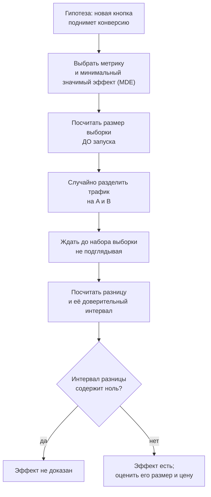

# Выборка, доверительные интервалы, p-value и ловушки данных

## Вспоминаем школу

Школьная статистика заканчивалась на «посчитайте среднее по таблице». Вопрос «а насколько
это среднее надёжно?» не задавался вовсе — и именно он отличает описание данных от выводов
по данным.

Единственное, что школа всё-таки дала и что здесь пригодится, — понятие **процента** и
интуиция про опросы: «опросили тысячу человек, получили 52% ± 3%». Вот это «± 3%» мы и
научимся понимать и считать.

Первая часть теории ([`theory.md`](./theory.md)) — про то, как описать имеющиеся данные.
Эта — про то, что можно (и чего нельзя) утверждать о том, чего мы не измеряли.

## Зачем программисту

- **A/B-тесты.** «Конверсия выросла с 4.0% до 4.3%» — это победа или шум? Без интервала
  ответа нет, а решения принимаются на миллионы.
- **Постмортемы.** «После деплоя выросли ошибки» — совпадение или причина? Корреляция ≠
  причинность, и это не педантизм, а способ не чинить не то.
- **Дашборды.** Парадокс Симпсона регулярно превращает «стало лучше» в «стало хуже» при
  разбивке по сегментам.
- **Нагрузочное тестирование.** Ошибка выжившего: упавшие запросы не попали в замеры, и
  латентность выглядит прекрасно.
- **Оценки по семплированным логам.** Каждое число из семпла — оценка с погрешностью
  порядка `1/√n`.

## Простыми словами

Главная идея вывода по данным: **мы видим выборку, а хотим сказать что-то о совокупности**.
Между ними всегда стоит случайность, и её нужно измерить.

Три инструмента, каждый — одно предложение:

1. **Стандартная ошибка** — насколько «дрожит» наша оценка от выборки к выборке. Она падает
   как `1/√n`: чтобы уточнить вдвое, нужно в четыре раза больше данных.
2. **Доверительный интервал** — диапазон, построенный так, что при бесконечном повторении
   эксперимента 95% таких интервалов накроют истинное значение.
3. **p-value** — вероятность увидеть наблюдаемое расхождение (или большее), **если бы**
   разницы на самом деле не было.

Обратите внимание на формулировку p-value: она про данные при гипотезе, а не про гипотезу
при данных. Это та же ловушка `P(A|B)` против `P(B|A)` из
[`07-probability`](../07-probability/theory.md).

## Точнее

### Стандартная ошибка среднего

```text
SE = s / √n            — s: выборочное стандартное отклонение, n: размер выборки
```

Читается: «стандартная ошибка среднего». Смысл — это σ **распределения самой оценки**.
Ключевое следствие корня:

```text
n = 100    → SE = s/10
n = 10 000 → SE = s/100        — точность выросла в 10 раз ценой 100-кратных данных
```

Для доли (конверсии) формула своя:

```text
SE = √(p(1−p)/n)
p = 0.04, n = 10 000 → SE = √(0.04·0.96/10000) = √(0.00000384) ≈ 0.00196 ≈ 0.2 п.п.
```

### Доверительный интервал

По ЦПТ среднее приближённо нормально, поэтому:

```text
95%-интервал ≈ оценка ± 1.96 · SE      (часто округляют до ±2·SE)
99%-интервал ≈ оценка ± 2.58 · SE
```

Что 95% **означает**: если повторить весь эксперимент много раз, 95% построенных интервалов
накроют истину. Что 95% **не означает**: «истинное значение лежит здесь с вероятностью 95%»
— истинное значение не случайно, случаен интервал. Разница тонкая, но именно из-за неё
интервалы толкуют неверно.

### Проверка гипотез и p-value

```text
H₀ (нулевая гипотеза):        разницы нет, всё объясняется случайностью
H₁ (альтернативная):          разница есть
p-value: P(увидеть такое расхождение или большее | H₀ верна)
p < 0.05  → «отвергаем H₀» (порог — соглашение, а не истина)
```

Что p-value **не** говорит:

- не говорит вероятность того, что H₀ верна;
- не говорит, насколько велик эффект (при огромной выборке значимым станет любой пустяк);
- не говорит, что результат важен для бизнеса.

Всегда смотрите на **размер эффекта и его интервал**, а не только на факт «p < 0.05».

Две ошибки, которые стоит различать:

| | H₀ верна | H₀ ложна |
|---|---|---|
| Отвергли H₀ | ошибка I рода (α), «ложная тревога» | верно |
| Не отвергли | верно | ошибка II рода (β), «пропустили эффект» |

`1 − β` называется **мощностью** теста: вероятность заметить эффект, если он есть.

### A/B-тест на пальцах



Оценка нужного размера выборки для сравнения долей:

```text
n на группу ≈ 16 · p(1−p) / MDE²        — грубая, но рабочая формула для 95%/80%
p = 0.04, хотим заметить рост на 0.4 п.п. (MDE = 0.004):
n ≈ 16 · 0.04 · 0.96 / 0.000016 = 16 · 0.0384 / 0.000016 = 38 400 на группу
```

Тридцать восемь тысяч на группу ради 0.4 процентного пункта — это и есть настоящая цена
A/B-теста, и её лучше узнать до запуска, а не после.

**Проблема подглядывания (peeking).** Если смотреть на результат каждый день и остановиться,
как только `p < 0.05`, доля ложных срабатываний вырастает с 5% до 20–30%: вы даёте себе
много попыток поймать случайное отклонение. Лечится либо фиксированным сроком, либо
последовательными тестами (sequential testing, alpha spending), которые заранее учитывают
многократные проверки.

### Корреляция и причинность

**Корреляция Пирсона r** измеряет силу **линейной** связи и лежит в `[−1, 1]`:

```text
r = Σ(xᵢ − x̄)(yᵢ − ȳ) / ((n−1)·sx·sy)
r = 1   — идеальная прямая с положительным наклоном
r = 0   — линейной связи нет (но может быть нелинейная!)
r = −1  — идеальная прямая с отрицательным наклоном
```

Корреляция не влечёт причинность. Возможных объяснений связи всегда минимум четыре:

```text
X → Y      прямая причина
Y → X      обратная причина
Z → X, Z → Y   общая причина (confounder)
случайность или систематическая ошибка отбора
```

Пример из практики: «сервисы с большим числом алертов чаще падают». Вероятнее всего,
верно `Z → X, Z → Y`: сложные сервисы и алертов имеют больше, и падают чаще.

### Три ловушки

**Парадокс Симпсона.** Тенденция, видимая в каждой группе, может развернуться при
объединении групп.

```text
              A: успех/всего      B: успех/всего
десктоп       60/100 = 60%        9/10  = 90%
мобильные     1/10  = 10%         30/100 = 30%
итого         61/110 ≈ 55%        39/110 ≈ 35%
```

B лучше в каждом сегменте, но хуже в сумме — потому что размеры сегментов разные. Лечение:
всегда смотреть на разбивку и следить, что группы сопоставимы по составу.

**Систематическая ошибка выжившего (survivorship bias).** Мы измеряем только то, что дошло
до измерения. Запросы, упавшие по таймауту, не попали в гистограмму латентности — и
латентность выглядит прекрасной именно тогда, когда всё плохо. Тот же механизм в
«coordinated omission»: нагрузочный генератор ждёт ответа и не отправляет запросы во время
затыка, из-за чего пропускает самые плохие замеры.

**Регрессия к среднему.** После аномально плохого дня следующий обычно лучше — просто
потому, что аномалии редки. Легко принять это за эффект принятых мер.

### Линия регрессии за одну страницу

Метод наименьших квадратов подбирает прямую `y = a + b·x`, минимизирующую сумму квадратов
вертикальных отклонений:

```text
b = r · (sy / sx)          — наклон
a = ȳ − b·x̄               — свободный член, прямая проходит через (x̄, ȳ)
R² = r²                    — доля дисперсии y, объяснённая моделью
```

R² = 0.64 значит «модель объясняет 64% разброса», и ничего не значит про причинность.

### Квартет Энскомба

Фрэнсис Энскомб в 1973 году построил четыре набора по 11 точек с **одинаковыми** средними,
дисперсиями, корреляцией (r ≈ 0.816) и одинаковой линией регрессии — но выглядящих
совершенно по-разному.

```text
набор I      набор II      набор III     набор IV
  ·  · ·       · · ·          ·             ·
 ·  ·  ·     ·      ·        ·            ····
·  ·          ·      ·      ·             (вертикаль
почти          парабола     прямая +       + один
линейно                     один выброс    выброс)
```

Мораль в одну строку: **всегда рисуйте данные**. Сводные статистики не заменяют график.

## Разобранные примеры

### Пример 1. Доверительный интервал для конверсии

В группе A из 10 000 посетителей купили 400.

```text
p̂ = 400 / 10 000 = 0.04                       — оценка конверсии
SE = √(0.04·0.96 / 10 000) = √0.00000384 ≈ 0.00196
95%-интервал: 0.04 ± 1.96·0.00196 = 0.04 ± 0.0038
              [0.0362, 0.0438] то есть [3.62%, 4.38%]
```

Ширина интервала ±0.38 п.п. Значит любое «улучшение» меньше этого — не сигнал, а шум.

### Пример 2. Сравнение двух групп

Группа B: 10 000 посетителей, 430 покупок (4.30%).

```text
разница: 0.0430 − 0.0400 = 0.0030 (0.3 п.п.)
SE разницы = √(SE_A² + SE_B²)                   — дисперсии независимых складываются
SE_A ≈ 0.00196, SE_B ≈ 0.00203
SE разницы = √(0.00196² + 0.00203²) ≈ 0.00282
95%-интервал разницы: 0.0030 ± 1.96·0.00282 = 0.0030 ± 0.0055
                      [−0.0025, +0.0085]
```

Интервал содержит ноль — эффект **не доказан**. При этом он не «опровергнут»: истинный рост
может быть и +0.8 п.п. Правильный вывод: данных недостаточно, нужна большая выборка.

### Пример 3. Сколько данных нужно

Хотим уверенно ловить рост конверсии на 0.4 п.п. от базы 4%.

```text
n ≈ 16 · p(1−p) / MDE² = 16 · 0.04 · 0.96 / 0.004² = 0.61440 / 0.000016 = 38 400
две группы → 76 800 посетителей
при 5 000 посетителей в день: около 16 дней
```

Полезная проверка на здравый смысл: если тест «уложился в два дня», скорее всего либо
эффект огромный, либо вы подглядывали.

### Пример 4. Симпсон в мониторинге

Новая версия сервиса «медленнее в среднем», но быстрее для каждого типа запросов.

```text
              старая                новая
лёгкие  90% трафика, 10 мс    50% трафика, 8 мс
тяжёлые 10% трафика, 200 мс   50% трафика, 180 мс
среднее 0.9·10 + 0.1·200 = 29 мс   0.5·8 + 0.5·180 = 94 мс
```

Каждый тип стал быстрее, а среднее выросло втрое — изменился **состав трафика**. Вывод:
сравнивать средние можно только при сопоставимом составе; иначе сравнивают по сегментам.

## В коде

Доверительный интервал для доли:

```go
func proportionCI(successes, n int, z float64) (lo, hi float64) {
	p := float64(successes) / float64(n)
	se := math.Sqrt(p * (1 - p) / float64(n))
	return p - z*se, p + z*se // z = 1.96 для 95%
}
// proportionCI(400, 10000, 1.96) → 0.0362, 0.0438
```

Корреляция Пирсона одним проходом:

```go
func pearson(xs, ys []float64) float64 {
	n := float64(len(xs))
	var sx, sy, sxy, sxx, syy float64
	for i := range xs {
		sx += xs[i]
		sy += ys[i]
		sxy += xs[i] * ys[i]
		sxx += xs[i] * xs[i]
		syy += ys[i] * ys[i]
	}
	num := n*sxy - sx*sy
	den := math.Sqrt((n*sxx - sx*sx) * (n*syy - sy*sy))
	return num / den
}
```

Проверка «а не шум ли это» без формул — перестановочный тест (permutation test). Он не
требует ни нормальности, ни таблиц:

```go
// Доля случайных перетасовок, где разница долей не меньше наблюдаемой.
func permutationP(labels []bool, values []bool, observed float64, iters int) float64 {
	ge := 0
	perm := slices.Clone(labels)
	for range iters {
		rand.Shuffle(len(perm), func(i, j int) { perm[i], perm[j] = perm[j], perm[i] })
		if diffOfRates(perm, values) >= observed {
			ge++
		}
	}
	return float64(ge) / float64(iters)
}
```

Это и есть Монте-Карло из [`07-probability`](../07-probability/index.md), применённое к
проверке гипотез: вместо вывода формулы мы честно моделируем «мира без эффекта».

## Типичные ошибки

- **Толковать p-value как вероятность гипотезы.** `p = 0.03` не значит «H₀ верна с
  вероятностью 3%». Это `P(данные | H₀)`, а не `P(H₀ | данные)`.
- **Подглядывать в A/B-тест.** Остановка «как только стало значимо» превращает 5% ложных
  срабатываний в 20–30%.
- **Не считать размер выборки заранее.** Тест без расчёта мощности либо ничего не покажет,
  либо покажет случайность.
- **Радоваться значимости без размера эффекта.** На выборке в 10 миллионов значимым станет
  рост на 0.001 п.п., который не окупит даже стоимость релиза.
- **Читать корреляцию как причину.** Всегда перечислите четыре альтернативы: X→Y, Y→X,
  общая причина, отбор.
- **`r = 0` значит «связи нет».** Пирсон измеряет только **линейную** связь; парабола даёт
  r ≈ 0 при идеальной зависимости.
- **Сравнивать средние по разнородным группам.** Парадокс Симпсона ждёт именно здесь.
- **Забывать про выживших.** Упавшие по таймауту запросы не в гистограмме; отменённые
  пользователи не в опросе.
- **Не рисовать данные.** Квартет Энскомба — вечное напоминание.
- **Множественные сравнения.** Проверяя 20 метрик с порогом 0.05, вы почти гарантированно
  найдёте одну «значимую» случайно.

## Шпаргалка формул

| Понятие | Формула |
|---|---|
| Стандартная ошибка среднего | `SE = s / √n` |
| Стандартная ошибка доли | `SE = √(p(1−p)/n)` |
| 95%-интервал | `оценка ± 1.96·SE` |
| 99%-интервал | `оценка ± 2.58·SE` |
| SE разницы двух групп | `√(SE₁² + SE₂²)` |
| Размер выборки (доли) | `n ≈ 16·p(1−p)/MDE²` на группу |
| Корреляция Пирсона | `r = Σ(xᵢ−x̄)(yᵢ−ȳ) / ((n−1)·sx·sy)` |
| Наклон регрессии | `b = r·(sy/sx)`, `a = ȳ − b·x̄` |
| Доля объяснённой дисперсии | `R² = r²` |
| Точность оценки | растёт как `√n` |

## Словарь терминов

- **Стандартная ошибка (SE)** — σ распределения самой оценки, не данных.
- **Доверительный интервал** — интервал, накрывающий истину в заданной доле повторений.
- **H₀ / H₁** — нулевая (эффекта нет) и альтернативная гипотезы.
- **p-value** — вероятность увидеть такое или большее расхождение при верной H₀.
- **Ошибка I рода (α)** — ложная тревога; **ошибка II рода (β)** — пропущенный эффект.
- **Мощность теста** — `1 − β`, вероятность заметить существующий эффект.
- **MDE** — минимальный эффект, который тест способен обнаружить.
- **Peeking** — подглядывание в промежуточные результаты, раздувающее ложные срабатывания.
- **Confounder** — скрытая общая причина двух коррелирующих величин.
- **Парадокс Симпсона** — разворот тенденции при объединении групп.
- **Survivorship bias** — систематическая ошибка из-за измерения только «доживших».
- **R²** — доля дисперсии, объяснённая моделью.

## См. также

- [`theory.md`](./theory.md) — первая часть: описательная статистика, перцентили, выбросы.
- [`07-probability`](../07-probability/theory-2-random-variables-and-distributions.md) —
  ЦПТ и Монте-Карло, на которых стоят интервалы и перестановочные тесты.
- [`09-growth-and-calculus-intuition`](../09-growth-and-calculus-intuition/index.md) —
  почему точность растёт как √n, а не как n.
- Blitzstein & Hwang. **Introduction to Probability** — главы про ЦПТ и оценивание.
- Khan Academy — разделы «Confidence intervals» и «Significance tests».
- Anscombe, F. J. **«Graphs in Statistical Analysis»** (American Statistician, 1973) —
  первоисточник квартета Энскомба.
- Gil Tene. **«How NOT to Measure Latency»** — про coordinated omission и ошибку выжившего
  в нагрузочном тестировании.
