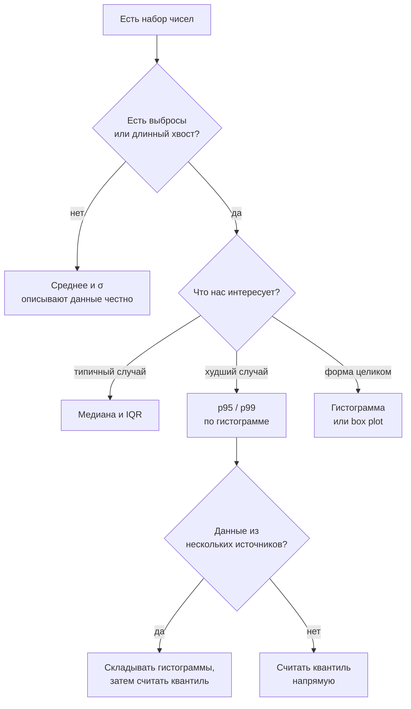

# Центр, разброс, перцентили и как читать распределение данных

## Вспоминаем школу

Школа оставила три слова: среднее, медиана, мода — и уверенность, что первое главнее.

```text
данные: 2, 3, 3, 4, 8
среднее (mean)   = (2+3+3+4+8)/5 = 4
медиана (median) = 3          — середина упорядоченного ряда
мода (mode)      = 3          — самое частое значение
```

Забылось же обычно вот что: **медиана считается по упорядоченному ряду**, а при чётном
количестве элементов берётся полусумма двух центральных. И главное — забылось, что среднее
легко «уводится» одним большим значением, а медиана нет. Замените 8 на 800: среднее станет
162.4, медиана останется 3.

## Зачем программисту

- **Мониторинг.** Средняя латентность — почти бесполезная метрика; работают p50, p95, p99.
  Понимать разницу нужно раньше, чем открывать Grafana.
- **Capacity planning.** Разброс важнее центра: сервис падает на хвостах, а не на среднем.
- **Инциденты.** «Медиана не изменилась, а p99 вырос втрое» — это диагноз, а не шум.
- **Агрегация.** Среднее от перцентилей — самая распространённая ошибка в дашбордах, и она
  систематически занижает картину.
- **A/B и аналитика.** Прежде чем сравнивать группы, нужно уметь описать каждую.
- **Данные для ML.** Нормализация, z-score, обнаружение выбросов — это ровно этот модуль.

## Простыми словами

Любой набор чисел описывается тремя вопросами:

1. **Где центр?** — среднее, медиана, мода.
2. **Насколько разбросано?** — размах, дисперсия, σ, IQR.
3. **Какой формы?** — симметрично, скошено, есть ли выбросы и второй горб.

Программисту важнее всего третий вопрос, потому что латентность почти никогда не
симметрична: у неё длинный правый хвост, и любое «одно число» её не описывает.

```text
латентность типичного HTTP-эндпоинта:

  количество
     │
 400 │█
 300 │██
 200 │███
 100 │████▁▁
   0 │██████▁▁▁▁▁▁▁▁▁▁▁▁▁▁▁▁▁▁▁▁▁▁▁▁▁▁▁▁▁▁▁▁▁▁▁▁▁▁▁▁▁▁▁▁▁
     └──────────────────────────────────────────────────→ мс
      10   50  100  200      500          1000        2000
      ↑        ↑                                ↑
     p50      p90                              p99
```

Среднее у такого распределения лежит правее медианы и левее p90 — то есть не описывает ни
типичного пользователя, ни пострадавшего.

## Точнее

### Генеральная совокупность и выборка

**Генеральная совокупность (population)** — все объекты, которые нас интересуют: все запросы
за сутки, все пользователи. **Выборка (sample)** — то, что мы реально измерили.

Практически всё в мониторинге — выборка: sampling трейсов, метрики за окно, логи с
семплированием. Отсюда важное следствие: любая цифра в дашборде — **оценка**, у неё есть
погрешность, и сравнивать две такие цифры «в лоб» нельзя.

Из-за этого у дисперсии две формулы:

```text
популяционная:  σ² = Σ(xᵢ − μ)² / n
выборочная:     s² = Σ(xᵢ − x̄)² / (n − 1)      — поправка Бесселя
```

Деление на `n − 1` компенсирует то, что выборочное среднее «подогнано» под сами данные и
занижает разброс. При n > 100 разница косметическая, при n = 5 — заметная.

### Меры центра и когда каждая лжёт

| Мера | Определение | Лжёт, когда |
|---|---|---|
| Среднее (mean) | `Σxᵢ / n` | есть выбросы или длинный хвост |
| Медиана (p50) | центральное значение | распределение бимодальное |
| Мода | самое частое значение | данные непрерывные или мод несколько |

Классика: «средняя зарплата в компании 250 тысяч» при медиане в 90 — в компании есть
основатель. Ровно так же «средняя латентность 50 мс» при p99 в 2 секунды.

### Меры разброса

```text
размах (range)  = max − min                     — чувствителен к одному выбросу
дисперсия s²    = Σ(xᵢ − x̄)² / (n−1)
σ = √s²                                          — в тех же единицах, что данные
IQR = Q3 − Q1                                    — межквартильный размах, устойчив
```

Квартили — это перцентили 25%, 50%, 75%. IQR описывает «где живёт средняя половина
данных» и не реагирует на выбросы, за что его любят в box plot.

### Перцентили: что это и как считать

**p-й перцентиль** — значение, ниже которого лежит p% наблюдений. p50 = медиана,
p99 = «хуже, чем у 1% запросов».

Алгоритм «в лоб» (метод ближайшего ранга):

```text
1. отсортировать данные по возрастанию
2. посчитать индекс: i = ⌈p/100 · n⌉
3. взять элемент под этим индексом (нумерация с 1)

данные (n = 10): 10, 12, 15, 18, 20, 25, 30, 45, 80, 300
p50: i = ⌈0.5·10⌉ = 5   → 20
p90: i = ⌈0.9·10⌉ = 9   → 80
p99: i = ⌈0.99·10⌉ = 10 → 300
```

Обратите внимание: при n = 10 перцентиль p99 — это просто максимум. **Чтобы p99 что-то
значил, нужно минимум сотни наблюдений**; на 10 запросах он бессмысленен. Практическое
правило: для устойчивого pXX нужно порядка `100/(100−XX) · 10` наблюдений — для p99 это
около тысячи.

Существуют разные соглашения об интерполяции (линейная между соседними рангами), поэтому
p99 из Prometheus, из Grafana и из вашего кода могут слегка различаться. Это нормально;
ненормально — сравнивать перцентили, посчитанные разными методами.

### Как это устроено в мониторинге

Хранить все замеры дорого, поэтому системы мониторинга используют **гистограммы**: заранее
заданные корзины (bucket) и счётчики попаданий. Перцентиль оценивается интерполяцией внутри
корзины, откуда берётся его погрешность.

```text
bucket ≤ 10мс   : ████████████████████ 2000
bucket ≤ 50мс   : ██████████████ 1400
bucket ≤ 100мс  : █████ 500
bucket ≤ 500мс  : ██ 80
bucket ≤ 1000мс : ▌ 15
bucket ≤ +Inf   : ▏ 5
```

**HDR-гистограмма** (High Dynamic Range) решает проблему выбора корзин: она использует
логарифмически растущие корзины, гарантируя заданную относительную точность (например, 1%)
на всём диапазоне от микросекунд до минут. Именно поэтому её применяют для латентности, где
интересны и 1 мс, и 10 секунд.

### Box plot и выбросы

```text
        Q1    med   Q3
         │     │     │
   ├─────┤█████│█████├─────┤        ° °    °
   │     │           │     │
  min   Q1         Q3    Q3+1.5·IQR      выбросы
 (в пределах усов)
```

Стандартное правило: выбросом считается точка вне `[Q1 − 1.5·IQR, Q3 + 1.5·IQR]`. Полтора —
соглашение, а не закон природы: для нормального распределения оно отсекает примерно 0.7%
данных.

Альтернативный критерий — **z-score**:

```text
z = (x − x̄) / s          — на сколько σ значение отстоит от среднего
|z| > 3  → кандидат в выбросы
```

Оба критерия ломаются на скошенных данных: у латентности «выбросом» окажется значительная
часть законного правого хвоста. Для таких данных смотрят на перцентили, а не на z-score.

### Асимметрия

```text
скос вправо (positive skew):  среднее > медианы > моды     — латентность, доходы
симметрия:                    среднее = медиане = моде     — рост людей
скос влево (negative skew):   среднее < медианы < моды     — редко в IT
```

Быстрая диагностика без формул: сравните среднее и медиану. Если среднее заметно больше —
у данных правый хвост, и любые рассуждения «плюс-минус сигма» неприменимы.

### Какую метрику брать — дерево решений



## Разобранные примеры

### Пример 1. Датасет латентности целиком

Двенадцать замеров (мс): 12, 15, 15, 18, 20, 22, 25, 28, 35, 60, 120, 900.

```text
n = 12, сумма = 1270
среднее = 1270 / 12 ≈ 105.8 мс
медиана: среднее двух центральных (6-го и 7-го): (22 + 25)/2 = 23.5 мс
мода = 15 (встречается дважды)
```

Среднее в 4.5 раза больше медианы — верный признак тяжёлого хвоста. Разброс:

```text
Q1 = значение на позиции ⌈0.25·12⌉ = 3 → 15
Q3 = значение на позиции ⌈0.75·12⌉ = 9 → 35
IQR = 35 − 15 = 20
граница выбросов: Q3 + 1.5·IQR = 35 + 30 = 65
выбросы: 120 и 900
```

Что докладывать команде: «медиана 23.5 мс, p75 = 35 мс, есть два запроса за 120 и 900 мс».
Одно только среднее (105.8) не описывает ни одного реального запроса из двенадцати.

### Пример 2. Почему усреднять перцентили нельзя

Два инстанса за минуту:

```text
инстанс A: 1000 запросов, p99 = 100 мс
инстанс B:   10 запросов, p99 = 900 мс
«средний p99» = (100 + 900)/2 = 500 мс     — ЧИСЛО ИЗ НИОТКУДА
```

Настоящий p99 по объединённым данным: всего 1010 запросов, худший 1% — это 10 запросов. Все
десять запросов инстанса B могли быть медленными, но даже тогда объединённый p99 будет около
100–900 мс в зависимости от распределения A. Единственный корректный способ — сложить
**гистограммы** и посчитать перцентиль заново.

```text
правильно:  merge(histogram_A, histogram_B) → quantile(0.99)
неправильно: avg(p99_A, p99_B), max(p99_A, p99_B) как «оценка»
```

Именно поэтому Prometheus предлагает `histogram_quantile(0.99, sum(rate(bucket[5m])) by (le))`
— суммируются корзины, а не перцентили.

### Пример 3. Среднее скрывает деградацию

```text
до:    p50 = 20 мс, p99 = 100 мс, среднее ≈ 25 мс
после: p50 = 20 мс, p99 = 3000 мс, среднее ≈ 50 мс
```

Среднее выросло вдвое — легко списать на шум. p99 вырос в тридцать раз — это авария, которая
задевает 1% пользователей, то есть при 10 миллионах запросов в сутки — сто тысяч человек.
Алерты по среднему такую деградацию систематически пропускают.

### Пример 4. Z-score и нормализация

Два признака в разных единицах: время ответа (мс) и размер тела (КБ).

```text
время:  x̄ = 50, s = 20   →  значение 110 даёт z = (110 − 50)/20 = 3.0
размер: x̄ = 8,  s = 2    →  значение 12  даёт z = (12 − 8)/2 = 2.0
```

Теперь их можно сравнивать: аномалия по времени сильнее. Это же преобразование
(«стандартизация») применяют перед обучением моделей, чтобы признаки с большим масштабом не
доминировали.

## В коде

Базовая описательная статистика — один проход и одна сортировка:

```go
func percentile(sorted []float64, p float64) float64 {
	if len(sorted) == 0 {
		return 0
	}
	i := int(math.Ceil(p/100*float64(len(sorted)))) - 1 // метод ближайшего ранга
	if i < 0 {
		i = 0
	}
	return sorted[i]
}

func describe(xs []float64) (mean, median, p95, p99 float64) {
	s := slices.Clone(xs)
	slices.Sort(s)
	for _, x := range s {
		mean += x
	}
	mean /= float64(len(s))
	return mean, percentile(s, 50), percentile(s, 95), percentile(s, 99)
}
```

Выборочная дисперсия с поправкой Бесселя:

```go
func sampleVariance(xs []float64, mean float64) float64 {
	var sum float64
	for _, x := range xs {
		d := x - mean
		sum += d * d
	}
	return sum / float64(len(xs)-1) // n−1, а не n
}
```

ASCII-гистограмма — самый быстрый способ увидеть форму данных прямо в терминале:

```go
func histogram(xs []float64, buckets []float64) {
	counts := make([]int, len(buckets))
	for _, x := range xs {
		for i, b := range buckets {
			if x <= b {
				counts[i]++
				break
			}
		}
	}
	for i, c := range counts {
		fmt.Printf("%8.0f | %s %d\n", buckets[i], strings.Repeat("█", c/10), c)
	}
}
```

## Типичные ошибки

- **Алертить по среднему.** Среднее маскирует хвост: деградация p99 в тридцать раз может
  поднять среднее вдвое и не пробить порог.
- **Усреднять перцентили.** `avg(p99)` — величина без смысла. Складывайте гистограммы.
- **Считать p99 на маленькой выборке.** На 10 замерах p99 — это максимум. Нужны сотни.
- **Применять правило трёх сигм к латентности.** Она скошена; 3σ там регулярно
  превышаются, а «выбросами» становится законный хвост.
- **Путать σ и IQR.** σ чувствительна к выбросам, IQR — нет. На грязных данных берите IQR.
- **Делить на n вместо n−1** для выборочной дисперсии. На малых выборках занижает разброс.
- **Считать медиану без сортировки.** Частая ошибка «на скорую руку»; медиана определена
  только для упорядоченного ряда.
- **Сравнивать перцентили из разных систем.** Разные методы интерполяции и разные корзины
  дают разные числа при одинаковых данных.
- **Мода для непрерывных данных.** Без биннинга мода бессмысленна: все значения уникальны.

## Шпаргалка формул

| Величина | Формула | Замечание |
|---|---|---|
| Среднее | `x̄ = Σxᵢ / n` | чувствительно к выбросам |
| Медиана | центральный элемент отсортированного ряда | при чётном n — полусумма двух |
| Выборочная дисперсия | `s² = Σ(xᵢ − x̄)² / (n − 1)` | поправка Бесселя |
| Стандартное отклонение | `s = √s²` | в единицах данных |
| Перцентиль (ближайший ранг) | `i = ⌈p/100 · n⌉` | нумерация с 1 |
| IQR | `Q3 − Q1` | устойчив к выбросам |
| Границы выбросов | `[Q1 − 1.5·IQR, Q3 + 1.5·IQR]` | соглашение, не закон |
| Z-score | `z = (x − x̄) / s` | «сколько сигм от среднего» |
| Диагностика скоса | сравнить `x̄` и медиану | `x̄ >` медианы → правый хвост |

## Словарь терминов

- **Генеральная совокупность (population)** — все объекты, о которых мы хотим знать.
- **Выборка (sample)** — реально измеренное подмножество.
- **Перцентиль / квантиль** — значение, ниже которого лежит заданная доля данных.
- **Квартили Q1, Q2, Q3** — перцентили 25%, 50%, 75%.
- **IQR** — межквартильный размах `Q3 − Q1`.
- **Скос (skew)** — асимметрия распределения; правый хвост = положительный скос.
- **Выброс (outlier)** — наблюдение, сильно отстоящее от остальных.
- **Z-score** — отклонение в единицах стандартного отклонения.
- **Гистограмма** — счётчики попаданий в заранее заданные корзины.
- **HDR-гистограмма** — гистограмма с логарифмическими корзинами и гарантированной
  относительной точностью.

## См. также

- [`theory-2-inference-and-traps.md`](./theory-2-inference-and-traps.md) — вторая часть:
  выборка, доверительные интервалы, p-value, A/B, парадоксы.
- [`07-probability`](../07-probability/theory-2-random-variables-and-distributions.md) —
  матожидание, дисперсия и ЦПТ, на которых стоит вся статистика.
- Khan Academy — раздел «Statistics and probability»: описательная статистика, перцентили,
  box plot.
- Gil Tene. Доклад **«How NOT to Measure Latency»** — про перцентили, coordinated omission и
  HDR-гистограммы; каноническое чтение для мониторинга.
- Prometheus docs — `histogram_quantile` и раздел про гистограммы и summary.
- Go: [`slices`](https://pkg.go.dev/slices) (`Sort`), [`math`](https://pkg.go.dev/math).
