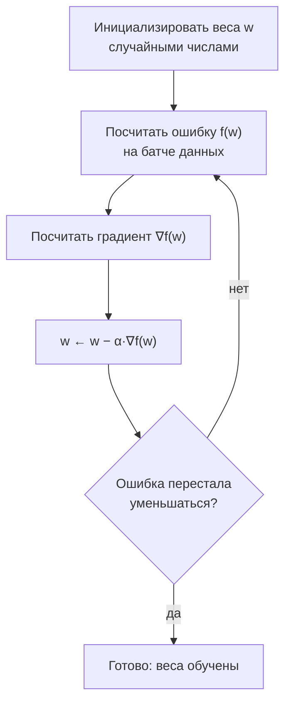
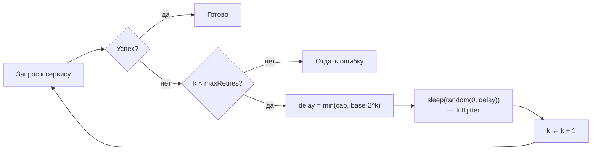

# Матанализ на пальцах: производная, градиент, интеграл, экспонента

Вторая часть модуля. Первая часть — [`theory.md`](./theory.md).

Договоримся сразу: **строгости здесь не будет**. Никаких эпсилон-дельта, никаких
доказательств существования предела. Задача — чтобы слова «производная», «градиент»,
«интеграл» и «экспоненциальное затухание» перестали быть шумом в статьях и стали
рабочими инструментами.

## Вспоминаем школу

Три вещи из школьной программы, которые нам понадобятся.

**Первое: наклон прямой.** `y = kx + b`, наклон `k = Δy/Δx` — «на сколько поднялись
делить на сколько прошли». Это уже было в [`theory.md`](./theory.md).

**Второе: средняя скорость.** Проехали 120 км за 2 часа — средняя скорость 60 км/ч. Это
буквально `Δs/Δt`, тот же наклон, только оси названы «время» и «путь».

**Третье: площадь.** Площадь прямоугольника — `ширина × высота`. Всё, больше ничего для
интеграла не нужно.

И одна школьная формула, которую все помнят наполовину: **сложный процент**. Вклад под
`r` процентов годовых через `t` лет:

```text
S = S₀ · (1 + r)^t        — r в долях: 5 % это 0.05
```

## Зачем программисту

- **Производная** — это скорость изменения. RPS — производная числа запросов по времени.
  «Диск заполняется на 2 ГБ в сутки» — производная. Прогноз «когда кончится место» —
  это деление остатка на производную.
- **Градиент** — производная функции многих переменных. Это то, чем «учится» любая ML-модель:
  градиентный спуск — весь мотор нейросетей в трёх строках кода.
- **Интеграл** — накопление. Суммарный трафик за месяц, средняя нагрузка за окно,
  площадь под кривой latency, «сколько всего денег списали по подписке».
- **Экспонента** — retry backoff, TTL и протухание кеша, half-life у скоринга
  антифрода, EWMA в мониторинге, рост нагрузки при вирусном эффекте.

Это не «математика для интервью». Это язык, на котором написаны SRE-дашборды и статьи
про ML.

## Простыми словами

### Производная

Возьмём кривую и точку на ней. Приложим к точке линейку так, чтобы она касалась кривой
и повторяла её направление, — получится **касательная**. Наклон этой касательной и есть
**производная** в этой точке.

```text
   y
   ^                            ,--
   |                        ,--'    касательная в точке P
   |                    ,--'
   |            f(x) __P'
   |            ___/
   |       ___/
   |  ___/
   +---------------------------------> x
              ^
              x₀
```

По-другому: производная — это «мгновенная скорость». Средняя скорость на отрезке — это
`Δy/Δx`. Начинаем сжимать отрезок: `Δx` → 0. Отношение стремится к какому-то числу — оно
и называется производной `f′(x)`.

```text
f′(x) = lim(h→0) (f(x + h) − f(x)) / h
```

В коде это буквально: `(f(x+h) - f(x)) / h` при очень маленьком `h`.

### Интеграл

Обратная задача. Дана скорость — сколько всего проехали? Умножить скорость на время
нельзя, скорость менялась. Но можно разбить время на маленькие кусочки, на каждом
считать скорость постоянной, умножить и всё сложить. Это **сумма прямоугольников**, она
же **сумма Римана**, она же — площадь под графиком.

```text
   y
   ^   |‾|
   |  |‾| |
   | |‾| | |‾|
   ||‾| | | | |         каждый прямоугольник: ширина Δx, высота f(xᵢ)
   +----------------> x  сумма площадей → интеграл при Δx → 0
    a             b
```

### Экспонента

Экспоненциальный рост — это «прирост пропорционален текущему размеру». Проценты по
вкладу, размножение бактерий, ретраи, которые сами создают нагрузку. Обратная сторона —
экспоненциальное затухание: «убывает на фиксированный процент за фиксированное время».
Это TTL, half-life и скользящее среднее.

## Точнее

### Правила дифференцирования (шпаргалка без доказательств)

| f(x) | f′(x) | комментарий |
|------|-------|-------------|
| `c` (константа) | `0` | константа не меняется |
| `x` | `1` | наклон прямой `y = x` |
| `xⁿ` | `n·x^(n−1)` | правило степени |
| `√x = x^(1/2)` | `1/(2√x)` | частный случай степени |
| `1/x = x^(−1)` | `−1/x²` | тоже степень |
| `eˣ` | `eˣ` | единственная функция, равная своей производной |
| `ln x` | `1/x` | отсюда `Σ 1/i ≈ ln n` |
| `sin x` | `cos x` | пригодится в графике/сигналах |
| `f + g` | `f′ + g′` | правило суммы |
| `c·f` | `c·f′` | константа выносится |
| `f · g` | `f′g + fg′` | правило произведения |
| `f(g(x))` | `f′(g(x)) · g′(x)` | **цепное правило** |

**Цепное правило** — самое важное для ML: это оно превращается в backpropagation.
Читается так: «производная внешней функции, посчитанная во внутренней точке, умножить на
производную внутренней».

### Поиск минимума и максимума

В точке минимума или максимума гладкой функции касательная горизонтальна, то есть

```text
f′(x) = 0        — необходимое условие экстремума
```

Дальше смотрим на вторую производную (производную от производной):
`f″(x) > 0` — «чаша» вверх, это **минимум**; `f″(x) < 0` — это **максимум**.

### Градиент и градиентный спуск

Если функция зависит от нескольких переменных, `f(w₁, w₂, ..., wₙ)`, то для каждой
переменной есть **частная производная** `∂f/∂wᵢ` — «как меняется f, если шевелить только
wᵢ, остальные держать замороженными». Вектор из всех частных производных — **градиент**:

```text
∇f = (∂f/∂w₁, ∂f/∂w₂, ..., ∂f/∂wₙ)
```

Символ `∇` читается «набла». Главное свойство: **градиент показывает направление
наискорейшего роста**. Значит, `−∇f` — направление наискорейшего убывания. Отсюда
рецепт:

```text
w ← w − α·∇f(w)        — шаг градиентного спуска, α — learning rate
```



Вот и весь «искусственный интеллект учится»: спуск по склону функции ошибки на ощупь,
маленькими шагами, ориентируясь на локальный наклон. Слишком большой `α` — перепрыгнем
минимум и разойдёмся; слишком маленький — будем ползти вечно.

### Метод Ньютона

Ещё одно применение касательной: быстро находить корни уравнения `f(x) = 0`. Проводим
касательную в текущей точке и берём место, где она пересекает ось `x`:

```text
x_{k+1} = x_k − f(x_k)/f′(x_k)
```

Для `√2` берём `f(x) = x² − 2`, `f′(x) = 2x`:

```text
x_{k+1} = x_k − (x_k² − 2)/(2x_k)      — подставили f и f′
        = (2x_k² − x_k² + 2)/(2x_k)     — привели к общему знаменателю
        = (x_k² + 2)/(2x_k)             — упростили числитель
        = (x_k + 2/x_k)/2               — поделили почленно: «среднее x и 2/x»
```

Получилась формула, известная ещё вавилонянам: следующее приближение — среднее
арифметическое числа и частного. Сходится квадратично: число верных знаков удваивается
за шаг.

### Интеграл: определение и главная теорема

```text
∫(a..b) f(x) dx = lim(n→∞) Σ(i=1..n) f(xᵢ)·Δx,   где Δx = (b − a)/n
```

Читается: «интеграл от a до b от f по dx». `dx` — это «бесконечно тонкая ширина
прямоугольника», `Σ` превратилась в `∫` (это вытянутая S от слова *summa*).

**Основная теорема анализа** простыми словами: **дифференцирование и интегрирование —
взаимно обратные операции**. Если `F` — функция накопления (`F(x) = ∫(a..x) f`), то
`F′ = f`. И наоборот, если мы знаем `F` с `F′ = f`, то

```text
∫(a..b) f(x) dx = F(b) − F(a)
```

То есть: **скорость роста накопленного равна тому, что накапливаем**. Счётчик байтов
растёт со скоростью, равной текущему битрейту. Очевидно на словах — и это ровно то, что
доказывает теорема.

Практическая формула, которую стоит помнить:

```text
средняя нагрузка за окно [0, T] = (1/T)·∫(0..T) load(t) dt
```

Это буквально то, что показывает график «average CPU за 5 минут» в Grafana.

### Экспоненциальный рост и затухание

Число `e ≈ 2.71828` — не магия. Это предел непрерывного начисления процентов:

```text
e = lim(n→∞) (1 + 1/n)ⁿ
```

Начисляем 100 % годовых раз в год — получаем `2`. Раз в месяц — `(1 + 1/12)¹² ≈ 2.613`.
Каждую секунду — `≈ 2.71828`. Дальше не растёт: `e` — потолок непрерывного роста.

```text
рост:      N(t) = N₀ · e^(rt)         — r > 0
затухание: N(t) = N₀ · e^(−λt)        — λ > 0, «скорость забывания»
```

**Время удвоения** и **правило 70**. Ищем `t`, при котором `e^(rt) = 2`:

```text
e^(rt) = 2                  — условие удвоения
rt = ln 2                   — взяли ln от обеих частей
t = ln 2 / r ≈ 0.693 / r    — ln 2 ≈ 0.693
```

Если `r` задан в процентах (`r% = 100r`), то `t ≈ 69.3 / r%`, что округляют до
**«время удвоения ≈ 70 / процент роста»**. Трафик растёт на 10 % в месяц → удвоится за
7 месяцев. Растёт на 7 % → удвоится за 10 месяцев.

**Период полураспада (half-life)** — зеркальная величина: `T½ = ln 2 / λ`. «Скор
пользователя протухает наполовину за 3 дня» — это `λ = ln 2 / 3`.

**Exponential backoff.** Задержка перед `k`-й попыткой:

```text
delay(k) = min(cap, base · 2^k)
```

Почему экспонента, а не линейный рост: при аварии все клиенты ретраятся одновременно и
добивают уже упавший сервис. Экспонента разводит попытки по времени очень быстро — за
10 попыток от 100 мс до 100 секунд.

Но одной экспоненты мало: если тысяча клиентов упала одновременно, они и ретраятся
одновременно — «thundering herd». Поэтому добавляют **jitter** (случайный разброс):

```text
full jitter:  delay = random(0, min(cap, base · 2^k))
```



**EWMA** (exponentially weighted moving average) — скользящее среднее с экспоненциальным
забыванием, основа почти любого мониторинга:

```text
avgₖ = α·xₖ + (1 − α)·avgₖ₋₁,     0 < α < 1
```

Разворачиваем и видим, откуда «экспоненциальное»:

```text
avgₖ = α·xₖ + α(1−α)·xₖ₋₁ + α(1−α)²·xₖ₋₂ + ...
```

Вес наблюдения падает как `(1−α)ⁱ` — экспоненциальное затухание. Эффективное «окно
памяти» ≈ `1/α`: при `α = 0.1` среднее помнит примерно последние 10 значений.

## Разобранные примеры

### Пример 1. Производная x² в точке 3 — вручную по определению

```text
f(x) = x²,  x = 3
(f(3 + h) − f(3))/h
= ((3 + h)² − 9)/h            — подставили функцию
= (9 + 6h + h² − 9)/h         — раскрыли квадрат суммы
= (6h + h²)/h                 — привели подобные
= 6 + h                       — сократили на h (h ≠ 0)
при h → 0 получаем 6          — предел
f′(3) = 6
```

Проверка по правилу степени: `(x²)′ = 2x`, при `x = 3` это `6`. Совпало.

### Пример 2. Минимум квадратичной ошибки

Функция ошибки: `f(w) = (w − 4)²`. Где минимум?

```text
f′(w) = 2(w − 4)              — цепное правило: внешняя u², внутренняя (w−4)
2(w − 4) = 0                  — условие экстремума
w = 4                         — решили уравнение
f″(w) = 2 > 0                 — «чаша» вверх, значит это минимум
```

Теперь три шага градиентного спуска с `α = 0.1`, старт `w₀ = 0`:

```text
w₁ = 0   − 0.1·2(0 − 4)    = 0    + 0.8   = 0.8
w₂ = 0.8 − 0.1·2(0.8 − 4)  = 0.8  + 0.64  = 1.44
w₃ = 1.44 − 0.1·2(1.44 − 4)= 1.44 + 0.512 = 1.952
```

Каждый шаг сокращает расстояние до 4 на 20 %: `4 − wₖ = 0.8ᵏ·4`. Это, кстати, снова
экспоненциальное затухание.

### Пример 3. Метод Ньютона для √2

```text
x₀ = 1
x₁ = (1 + 2/1)/2 = 1.5
x₂ = (1.5 + 2/1.5)/2 = (1.5 + 1.333333)/2 = 1.4166667
x₃ = (1.4166667 + 1.4117647)/2 = 1.4142157
x₄ = 1.4142136
√2 = 1.41421356...            — четыре шага, восемь верных знаков
```

### Пример 4. Средняя нагрузка через интеграл

Нагрузка держалась 100 RPS первые 60 секунд и 400 RPS следующие 60 секунд. Средняя за
120 секунд:

```text
∫(0..120) load dt = 100·60 + 400·60 = 6000 + 24000 = 30000  — две «прямоугольные» площади
средняя = 30000 / 120 = 250 RPS                             — поделили на длину окна
```

Обратите внимание: «средняя 250» ничего не говорит о том, что был пик 400. Ровно тот же
сюжет, что «среднее скрывает p99» из
[`08-statistics-and-data`](../08-statistics-and-data/theory.md).

## В коде

Численная производная и проверка правила степени:

```go
func derivative(f func(float64) float64, x float64) float64 {
	const h = 1e-6
	return (f(x+h) - f(x-h)) / (2 * h) // центральная разность: точнее односторонней
}

func main() {
	square := func(x float64) float64 { return x * x }
	fmt.Printf("%.6f\n", derivative(square, 3)) // 6.000000 — совпало с 2x при x=3
}
```

Градиентный спуск на одномерной ошибке:

```go
func main() {
	w, alpha := 0.0, 0.1
	for i := 0; i < 50; i++ {
		grad := 2 * (w - 4) // производная f(w) = (w-4)²
		w -= alpha * grad   // шаг против градиента
	}
	fmt.Printf("%.6f\n", w) // 4.000000 — нашли минимум
}
```

Метод Ньютона и сумма Римана:

```go
func sqrt2() float64 {
	x := 1.0
	for i := 0; i < 5; i++ {
		x = (x + 2/x) / 2 // x ← среднее(x, 2/x)
	}
	return x // 1.4142135623730951
}

func integrate(f func(float64) float64, a, b float64, n int) float64 {
	dx, sum := (b-a)/float64(n), 0.0
	for i := 0; i < n; i++ {
		sum += f(a+(float64(i)+0.5)*dx) * dx // высота × ширина, точка середины
	}
	return sum
}
// integrate(func(x float64) float64 { return x * x }, 0, 1, 100000) → 0.3333333 = 1/3
```

EWMA и backoff с jitter:

```go
type EWMA struct {
	alpha, value float64
	init         bool
}

func (e *EWMA) Add(x float64) float64 {
	if !e.init {
		e.value, e.init = x, true // первое значение задаёт старт
		return e.value
	}
	e.value = e.alpha*x + (1-e.alpha)*e.value
	return e.value
}

func backoff(attempt int, base, cap time.Duration) time.Duration {
	d := base << attempt // base · 2^attempt
	if d > cap || d <= 0 {
		d = cap // защита от переполнения и от бесконечного роста
	}
	return time.Duration(rand.Int64N(int64(d))) // full jitter
}
```

## Типичные ошибки

- **Считать производную «формулой», а не смыслом.** Если вы не можете сказать, в каких
  единицах она измеряется (байты в секунду, рубли на пользователя), вы её не поняли.
- **Слишком большой learning rate.** Спуск не сходится, а расходится: ошибка растёт от
  шага к шагу. Первое, что надо уменьшить при «модель не учится».
- **Думать, что градиентный спуск найдёт глобальный минимум.** Он находит **локальный**.
  Для выпуклых функций (одна «чаша») они совпадают, для нейросетей — нет.
- **Численная производная с крошечным `h`.** При `h = 1e-15` числитель — разность двух
  почти равных float64, и всё съедает погрешность. Рабочий диапазон `h` ≈ 1e-6…1e-8.
- **Backoff без jitter.** Экспонента разводит попытки одного клиента, jitter — попытки
  разных клиентов. Нужны оба.
- **Путать `e^(−λt)` и `2^(−t/T½)`.** Это одна и та же кривая, просто разные параметры:
  `λ = ln 2 / T½`.
- **«Рост 5 % в месяц — это мало».** Это удвоение за 14 месяцев и рост в 1.8 раза за год.
  Экспонента всегда обманывает интуицию.

## Шпаргалка формул

| Что | Формула |
|-----|---------|
| Определение производной | `f′(x) = lim(h→0) (f(x+h) − f(x))/h` |
| Степень | `(xⁿ)′ = n·x^(n−1)` |
| Сумма | `(f + g)′ = f′ + g′` |
| Цепное правило | `(f(g(x)))′ = f′(g(x))·g′(x)` |
| Экспонента и логарифм | `(eˣ)′ = eˣ`, `(ln x)′ = 1/x` |
| Условие экстремума | `f′(x) = 0`; минимум если `f″(x) > 0` |
| Градиент | `∇f = (∂f/∂w₁, ..., ∂f/∂wₙ)` |
| Шаг спуска | `w ← w − α·∇f(w)` |
| Метод Ньютона | `x ← x − f(x)/f′(x)`; для √a: `x ← (x + a/x)/2` |
| Интеграл | `∫(a..b) f dx = lim Σ f(xᵢ)·Δx` |
| Основная теорема | `∫(a..b) f = F(b) − F(a)`, где `F′ = f` |
| Среднее по окну | `(1/T)·∫(0..T) f(t) dt` |
| Число e | `e = lim(n→∞)(1 + 1/n)ⁿ ≈ 2.71828` |
| Рост / затухание | `N(t) = N₀·e^(rt)` / `N₀·e^(−λt)` |
| Правило 70 | `время удвоения ≈ 70 / процент роста` |
| Half-life | `T½ = ln 2 / λ ≈ 0.693/λ` |
| Backoff | `delay = min(cap, base·2^k)`, с jitter — `random(0, delay)` |
| EWMA | `avgₖ = α·xₖ + (1−α)·avgₖ₋₁`, окно ≈ `1/α` |

## Словарь терминов

- **Касательная** — прямая, касающаяся кривой в точке и повторяющая её направление.
- **Производная `f′(x)`** — наклон касательной, мгновенная скорость изменения.
- **Частная производная `∂f/∂w`** — производная по одной переменной при остальных фиксированных.
- **Градиент `∇f`** — вектор частных производных; направление наискорейшего роста.
- **Learning rate `α`** — длина шага в градиентном спуске.
- **Экстремум** — точка минимума или максимума.
- **Интеграл `∫`** — накопленная величина, площадь под графиком.
- **Сумма Римана** — приближение интеграла суммой прямоугольников.
- **Основная теорема анализа** — дифференцирование и интегрирование взаимно обратны.
- **e** — основание натурального логарифма, ≈ 2.71828.
- **Half-life (период полураспада)** — время, за которое величина уменьшается вдвое.
- **Jitter** — случайный разброс задержки, чтобы клиенты не ретраились синхронно.
- **EWMA** — скользящее среднее с экспоненциальным весом старых значений.

## См. также

- [`theory.md`](./theory.md) — рост функций, big-O, логарифмы, пределы.
- [`02-algebra-refresher`](../02-algebra-refresher/theory.md) — экспонента и логарифм.
- [`08-statistics-and-data`](../08-statistics-and-data/theory.md) — среднее, процентили,
  почему среднее скрывает пики.
- [`10-linear-algebra-basics`](../10-linear-algebra-basics/theory.md) — векторы, без
  которых градиент остаётся списком чисел.
- **3Blue1Brown — «Essence of Calculus»** (YouTube, Grant Sanderson): визуальная
  интуиция производной и интеграла, 12 коротких серий.
- **BetterExplained** — «An Intuitive Guide to Exponential Functions & e» и
  «A Gentle Introduction to Learning Calculus» (Kalid Azad), betterexplained.com.
- **Paul's Online Math Notes** — tutorial.math.lamar.edu, разделы Calculus I (Derivatives)
  и Calculus I (Integrals) как справочник по правилам.
- Paul Orland. **Math for Programmers** (Manning, 2020) — главы про производные и
  градиентный спуск с кодом.
- AWS Architecture Blog — статья «Exponential Backoff And Jitter» (Marc Brooker) про
  full/equal jitter на практике.
