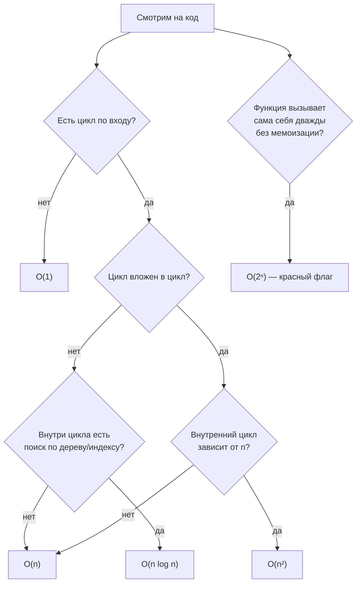
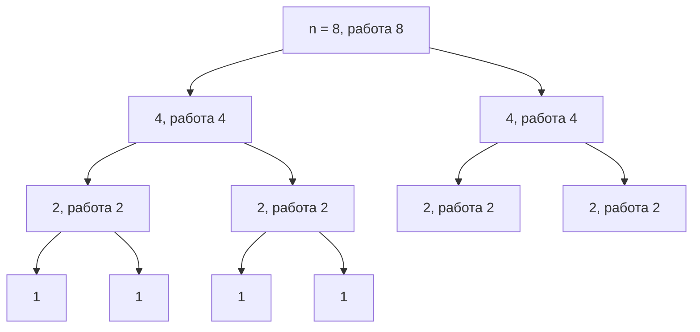

# Рост функций: иерархия, big-O, логарифмы, пределы

## Вспоминаем школу

В школе была **функция** — правило, которое каждому входу `x` сопоставляет ровно один
выход `y = f(x)`. И был **график**: горизонтальная ось `x`, вертикальная `y`, точка
`(x, f(x))` для каждого `x`. График — это не украшение, это способ увидеть поведение
функции целиком, не подставляя числа по одному.

Что график говорит:

- **идёт вверх** — функция растёт (больше вход → больше выход);
- **идёт вниз** — убывает;
- **крутой подъём** — растёт быстро; **пологий** — медленно;
- **выполаживается** — растёт, но всё медленнее (так ведёт себя логарифм);
- **загибается вверх** — растёт всё быстрее (так ведёт себя экспонента).

Вторая школьная вещь — **прямая** `y = kx + b`. Здесь `b` — где прямая пересекает
вертикальную ось, а `k` — **наклон** (slope): на сколько поднимется `y`, если `x`
увеличить на 1. Формула наклона по двум точкам:

```text
k = (y₂ − y₁) / (x₂ − x₁)        — «подъём делить на пробег» (rise over run)
```

Пример: прямая проходит через `(2, 5)` и `(6, 13)`.

```text
k = (13 − 5) / (6 − 2)           — подставили координаты
k = 8 / 4                        — посчитали разности
k = 2                            — на каждый шаг вправо поднимаемся на 2
b = y − kx = 5 − 2·2 = 1         — взяли любую точку и выразили b
y = 2x + 1                       — готовое уравнение прямой
```

Запомните слово **наклон**: вся вторая половина модуля — про то, что у кривой наклон
тоже есть, просто он свой в каждой точке.

Функции, экспонента и логарифм подробно разобраны в
[`02-algebra-refresher`](../02-algebra-refresher/theory.md) — сюда мы берём их как
готовый инструмент.

## Зачем программисту

Вы пишете функцию, которая для каждой пары пользователей проверяет, есть ли между ними
общий чат. На стенде 200 пользователей — работает мгновенно. В проде 50 000 — сервис
падает по таймауту. Ничего не «сломалось»: количество пар выросло в
`(50000/200)² = 62 500` раз. Это не баг, это **рост функции**.

Практически весь инженерный разговор о производительности — это разговор о том, как
время работы зависит от размера входа:

- «этот запрос делает full scan» — значит `O(n)` вместо `O(log n)` по индексу;
- «сортировка не проблема» — потому что `n log n` почти не отличается от `n`;
- «вложенный цикл по заказам внутри цикла по пользователям» — красный флаг `O(n·m)`;
- «перебор всех подмножеств фич» — `2ⁿ`, и на 40 фичах это уже никогда не закончится.

Умение за пять секунд перевести формулу в «сколько это секунд» экономит недели.

## Простыми словами

Big-O — это **ответ на вопрос «что будет, когда данных станет очень много»**. Нас не
интересует, сколько миллисекунд занимает один шаг: это зависит от языка, процессора и
фазы луны. Нас интересует **форма зависимости**: удвоим вход — время удвоится?
учетверится? вырастет на одну единицу?

Отсюда два правила, которые кажутся наглостью, но абсолютно законны:

1. **Константы выбрасываем.** `5n` и `n` — одна и та же форма: удвоил вход — удвоил
   время. Константа зависит от железа, форма — от алгоритма.
2. **Младшие слагаемые выбрасываем.** В `n² + 100n + 5000` при `n = 10⁶` первое
   слагаемое — 10¹², остальные вместе — примерно 10⁸. Второе — это 0.01 % от первого.

Остаётся «главный член»: `n²`. Это и есть big-O.

### Иерархия роста

Вот порядок, который стоит выучить наизусть, слева направо — от лучшего к худшему:

```text
1  <  log n  <  √n  <  n  <  n log n  <  n²  <  n³  <  2ⁿ  <  n!
```

Как это выглядит на графике (по горизонтали — `n`, по вертикали — работа):

```text
работа
  ^                                        2ⁿ  n!
  |                                       /   /
  |                                      /   /
  |                                 n²  /   /
  |                                /   /   /
  |                          n log n  /   /
  |                       /    /     /   /
  |                  n  /    /     /    /
  |              /    /    /     /     /
  |         √n /    /   /      /      /
  |    ___/  /   /    /      /       /
  |  _/  ___/ __/  __/    __/      _/          log n
  | /___/____/____/______/_______/________________________  1
  +--------------------------------------------------------> n
```

### Как быстро оценить сложность куска кода



Это не строгий алгоритм, а быстрый чек-лист для code review: он ловит 90 % реальных
проблем с производительностью.

## Точнее

### Таблица значений

Считаем, что машина делает **10⁹ элементарных шагов в секунду** (оптимистичная оценка
для Go). Логарифм — по основанию 2.

| f(n)      | n = 10  | n = 100              | n = 10⁶              | время при n = 10⁶ |
|-----------|---------|----------------------|----------------------|-------------------|
| 1         | 1       | 1                    | 1                    | мгновенно         |
| log n     | 3.3     | 6.6                  | 19.9                 | мгновенно         |
| √n        | 3.2     | 10                   | 1 000                | 1 мкс             |
| n         | 10      | 100                  | 10⁶                  | 1 мс              |
| n log n   | 33      | 664                  | ≈ 2·10⁷              | 20 мс             |
| n²        | 100     | 10⁴                  | 10¹²                 | ≈ 17 минут        |
| n³        | 1 000   | 10⁶                  | 10¹⁸                 | ≈ 32 года         |
| 2ⁿ        | 1 024   | ≈ 1.3·10³⁰           | не выразимо          | никогда           |
| n!        | 3.6·10⁶ | ≈ 9.3·10¹⁵⁷          | не выразимо          | никогда           |

Отдельно стоит запомнить два порога:

- **2ⁿ при n = 100** — это ≈ 1.3·10³⁰ шагов, то есть ≈ 4·10¹³ лет: примерно в три
  тысячи раз дольше, чем существует Вселенная (≈ 1.4·10¹⁰ лет).
- **n! при n = 20** — это 2.4·10¹⁸ шагов, ≈ 77 лет. При `n = 25` — уже 490 миллионов лет.

Отсюда рабочее правило: экспонента и факториал живут только при `n ≤ 20–25`, и только
если каждый шаг очень дешёвый.

### Big-O, Θ и Ω по-человечески

- **O(f)** — «растёт **не быстрее**, чем f». Верхняя граница, гарантия сверху.
- **Ω(f)** — «растёт **не медленнее**, чем f». Нижняя граница.
- **Θ(f)** — «растёт **ровно как** f» (и сверху, и снизу). Самое честное утверждение.

Почти формально:

```text
T(n) = O(f(n))   ⇔   ∃ c > 0, ∃ n₀:  для всех n ≥ n₀  T(n) ≤ c·f(n)
T(n) = Ω(f(n))   ⇔   ∃ c > 0, ∃ n₀:  для всех n ≥ n₀  T(n) ≥ c·f(n)
T(n) = Θ(f(n))   ⇔   T(n) = O(f(n))  и  T(n) = Ω(f(n))
```

Читается: «существует такая константа `c` и такой порог `n₀`, что начиная с `n₀`
функция `T(n)` не превосходит `c·f(n)`». Символы `∃`, `∀` разобраны в
[словаре обозначений](../01-numbers-and-arithmetic/theory.md#словарь-обозначений).

Ключевые слова здесь — **«существует c»** (значит, константу можно подобрать любую, она
не важна) и **«начиная с n₀»** (значит, поведение на маленьких входах не важно). Именно
эти две лазейки и разрешают выбрасывать константы и младшие члены.

Формально `O` — верхняя граница, поэтому `n = O(n²)` — истинная запись, просто
неинформативная. В инженерной речи почти всегда имеют в виду `Θ`, но говорят `O`.

### Почему основание логарифма не важно

Формула перехода к другому основанию:

```text
log_a n = log_b n / log_b a       — формула замены основания
log₂ n  = ln n / ln 2             — b = e
log₂ n  ≈ 1.4427 · ln n           — 1/ln 2 ≈ 1.4427, это просто константа
```

Переход между основаниями — умножение на константу. А константы мы выбрасываем.
Поэтому `O(log n)` пишут без основания: `O(log₂ n)`, `O(ln n)` и `O(log₁₀ n)` — одно и
то же множество функций. (Внутри показателя степени это уже не так: `2ⁿ` и `3ⁿ`
отличаются принципиально, потому что `3ⁿ = 2^(n·log₂3)` — константа попала в показатель.)

### Логарифм как «сколько раз можно поделить пополам»

Самое полезное чтение логарифма для программиста:

> `log₂ n` — это сколько раз нужно поделить `n` пополам, чтобы дойти до 1.

`log₂ 1024 = 10`, потому что 1024 → 512 → 256 → 128 → 64 → 32 → 16 → 8 → 4 → 2 → 1 —
десять делений. Отсюда сразу: бинарный поиск в отсортированном миллионе элементов —
это 20 сравнений, а не миллион. И отсюда же — «дерево из n узлов имеет высоту около
`log n`, если оно сбалансировано».

Важная интуиция масштаба: логарифм **невероятно** медленный. Чтобы `log₂ n` вырос с
20 до 21, `n` должно вырасти с миллиона до двух миллионов. Чтобы вырос с 20 до 40,
`n` должно стать 10¹². Практически `log n` — это «примерно 20–60, всегда».

**log-log график.** Если по обеим осям отложить логарифмы, то степенная функция
`y = c·n^k` превращается в прямую: `log y = log c + k·log n`. Наклон этой прямой равен
показателю `k`. Это рабочий приём: замерили время на `n = 10³, 10⁴, 10⁵`, нанесли на
log-log — если получилась прямая с наклоном 2, у вас `O(n²)`.

### Гармонические числа: почему Σ 1/i ≈ ln n

`Hₙ = 1 + 1/2 + 1/3 + ... + 1/n = Σ(i=1..n) 1/i` — **гармоническое число** (Σ читается
«сумма по i от 1 до n», это просто цикл).

Сумма растёт, но крайне медленно:

| n     | 10    | 100   | 1 000 | 10⁶    |
|-------|-------|-------|-------|--------|
| Hₙ    | 2.929 | 5.187 | 7.485 | 14.393 |
| ln n  | 2.303 | 4.605 | 6.908 | 13.816 |

Разность стабильно ≈ 0.577 — это **постоянная Эйлера — Маскерони** γ:

```text
Hₙ ≈ ln n + γ,   γ ≈ 0.5772
```

Почему так: `1/i` — это высота столбика, а сумма столбиков ширины 1 приближает площадь
под кривой `1/x`, площадь которой и есть `ln n` (подробнее об «площади под кривой» — в
[`theory-2-calculus.md`](./theory-2-calculus.md)).

Где это встречается: среднее число сравнений в quicksort со случайным опорным
(`≈ 2n·ln n`), ожидаемая длина цепочки при вставках в хеш-таблицу, задача про купоны
(«сколько покупок, чтобы собрать все n наклеек» — `n·Hₙ ≈ n ln n`).

### Рекуррентности как интуиция

Многие алгоритмы описываются формулой «время на входе n = время на кусках + склейка».

```text
Бинарный поиск:  T(n) = T(n/2) + 1        → O(log n)
Merge sort:      T(n) = 2T(n/2) + n       → O(n log n)
```

Интуиция для merge sort: делим пополам, пока не дойдём до одиночек — это `log₂ n`
уровней. На каждом уровне суммарно обрабатываем все `n` элементов. Итого `n` умножить
на `log n`.



На каждом уровне сумма работ равна 8; уровней — `log₂ 8 = 3` (плюс лист). Формальный
разбор рекуррентностей и master theorem — в
[`11-graphs-recurrences-automata`](../11-graphs-recurrences-automata/theory-2-recurrences-and-automata.md).

### Пределы, но без ужаса

Запись `n → ∞` означает не «n равно бесконечности», а «мы смотрим, к чему приближается
выражение, когда n растёт неограниченно».

```text
lim(n→∞) 1/n = 0                     — 1/n подходит к нулю сколь угодно близко
lim(n→∞) (3n² + 5n)/(n² + 1) = 3     — поделили числитель и знаменатель на n²
lim(n→∞) (log n)/n = 0               — логарифм проигрывает линейной функции
```

Разбор второго предела по шагам:

```text
(3n² + 5n)/(n² + 1)
= (3 + 5/n)/(1 + 1/n²)     — поделили числитель и знаменатель на n²
→ (3 + 0)/(1 + 0)          — 5/n → 0 и 1/n² → 0
= 3                        — предел
```

Это и есть механика big-O «изнутри»: `T(n)/f(n)` стремится к константе — значит,
`T(n) = Θ(f(n))`.

Отдельная классика — **0.999… = 1**. Это не «почти 1», это ровно 1: запись `0.999…`
означает предел последовательности `0.9, 0.99, 0.999, ...`, а её предел равен 1.
Короткое рассуждение: `x = 0.999…`, тогда `10x = 9.999…`, вычитаем: `9x = 9`, `x = 1`.

## Разобранные примеры

### Пример 1. Свернуть выражение в big-O

Дано: `T(n) = 3n² + 200n·log n + 50000`.

```text
T(n) = 3n² + 200n·log n + 50000
n·log n растёт медленнее n²                — потому что log n / n → 0
50000 — константа, растёт медленнее всего  — младший член
Главный член: 3n²                          — оставили только его
Константу 3 выбрасываем                    — правило big-O
T(n) = Θ(n²)
```

### Пример 2. Стоит ли менять n² на n log n

Есть отчёт, который работает `O(n²)` и на `n = 100 000` занимает 10 секунд. Что будет
на `n = 1 000 000`?

```text
n вырос в 10 раз                    — 10⁵ → 10⁶
n² вырос в 10² = 100 раз            — квадрат от множителя
10 с · 100 = 1000 с ≈ 17 минут      — новая оценка
```

А если переписать на `n log n`? Текущие 10 с соответствуют
`n² = 10¹⁰` условных шагов, то есть 10⁹ шагов в секунду. Для `n log n` при `n = 10⁶`
получаем `10⁶ · 20 = 2·10⁷` шагов ≈ **0.02 секунды**. Разница — в 50 000 раз, и она
растёт дальше.

### Пример 3. Сколько сравнений сделает бинарный поиск

```text
n = 1 000 000
log₂ 10⁶ = ln 10⁶ / ln 2            — формула замены основания
        = 13.8155 / 0.6931          — значения логарифмов
        ≈ 19.93                     — делим
Округляем вверх: 20 сравнений       — шагов не бывает дробное число
```

Двадцать сравнений против миллиона. И на миллиарде записей будет всего 30.

## В коде

Проверяем таблицу гармонических чисел и связь `Hₙ ≈ ln n + γ`:

```go
package main

import (
	"fmt"
	"math"
)

func harmonic(n int) float64 {
	sum := 0.0
	for i := 1; i <= n; i++ { // Σ(i=1..n) 1/i — сумма это просто цикл
		sum += 1.0 / float64(i)
	}
	return sum
}

func main() {
	for _, n := range []int{10, 100, 1000, 1000000} {
		h := harmonic(n)
		fmt.Printf("n=%-8d H=%.4f  ln n=%.4f  H-ln n=%.4f\n",
			n, h, math.Log(float64(n)), h-math.Log(float64(n)))
	}
	// разность всегда ≈ 0.5772 — постоянная Эйлера
}
```

Проверяем, что основание логарифма — это множитель-константа:

```go
n := 1_000_000.0
log2 := math.Log2(n)  // 19.9316
ln := math.Log(n)     // 13.8155
fmt.Println(log2 / ln) // 1.4427 = 1/ln 2 — константа, от n не зависит
```

## Типичные ошибки

- **«O(n) быстрее, чем O(n²) всегда».** Нет: big-O говорит о поведении при больших `n`.
  На `n = 5` алгоритм с `1000n` проиграет алгоритму с `n²`. Асимптотика — про тренд.
- **Забыть, что `n` — это не только длина списка.** Для алгоритма на числе `x`
  входной размер — число **бит**, то есть `log x`. Поэтому наивная проверка простоты
  делением до `√x` — это экспонента от размера входа, а не «быстро».
- **Складывать вложенные циклы вместо умножения.** Два цикла подряд — `O(n + m)`,
  цикл в цикле — `O(n·m)`.
- **Считать, что `O(1)` значит «быстро».** `O(1)` значит «не зависит от n». Один
  сетевой запрос — это `O(1)` и 50 миллисекунд.
- **Путать основание логарифма с основанием степени.** В `O(log n)` основание не важно,
  в `O(2ⁿ)` — критично.
- **Спорить, `0.999…` меньше единицы или нет.** Это одно и то же число, записанное
  двумя способами, как `1/2` и `0.5`.

## Шпаргалка формул

| Что | Формула |
|-----|---------|
| Наклон прямой | `k = (y₂ − y₁)/(x₂ − x₁)` |
| Иерархия роста | `1 < log n < √n < n < n log n < n² < n³ < 2ⁿ < n!` |
| Определение O | `T(n) ≤ c·f(n)` для всех `n ≥ n₀` |
| Определение Ω | `T(n) ≥ c·f(n)` для всех `n ≥ n₀` |
| Θ | одновременно O и Ω |
| Замена основания | `log_a n = log_b n / log_b a` |
| Логарифм произведения | `log(ab) = log a + log b` |
| Гармоническое число | `Hₙ = Σ(i=1..n) 1/i ≈ ln n + 0.5772` |
| Бинарный поиск | `T(n) = T(n/2) + 1 → Θ(log n)` |
| Merge sort | `T(n) = 2T(n/2) + n → Θ(n log n)` |
| Предел отношения | `T(n)/f(n) → c > 0 ⇒ T(n) = Θ(f(n))` |

## Словарь терминов

- **Асимптотика** — поведение функции при больших значениях аргумента.
- **Big-O, `O(f)`** — верхняя оценка роста с точностью до константы.
- **Ω (омега)** — нижняя оценка роста.
- **Θ (тета)** — точная оценка роста (сверху и снизу одновременно).
- **Главный (доминирующий) член** — слагаемое, растущее быстрее остальных.
- **Наклон (slope)** — на сколько меняется `y` при увеличении `x` на единицу.
- **Гармоническое число `Hₙ`** — сумма `1 + 1/2 + ... + 1/n`.
- **Постоянная Эйлера — Маскерони γ** — ≈ 0.5772, предел разности `Hₙ − ln n`.
- **Предел** — значение, к которому выражение приближается сколь угодно близко.
- **log-log график** — обе оси в логарифмическом масштабе; степенная функция на нём — прямая.

## См. также

- [`theory-2-calculus.md`](./theory-2-calculus.md) — производная, градиент, интеграл,
  экспоненциальный рост.
- [`02-algebra-refresher`](../02-algebra-refresher/theory.md) — функции, графики,
  экспонента и логарифм.
- [`11-graphs-recurrences-automata`](../11-graphs-recurrences-automata/theory-2-recurrences-and-automata.md)
  — формальное решение рекуррентностей и master theorem.
- Lehman, Leighton, Meyer. **Mathematics for Computer Science** (MIT 6.042), глава
  «Asymptotics» — определения O/Θ/Ω с примерами.
- Graham, Knuth, Patashnik. **Concrete Mathematics**, гл. 6 (гармонические числа) и
  гл. 9 (асимптотика).
- **BetterExplained** — статьи «Understanding the Birthday Paradox» и
  «Demystifying the Natural Logarithm (ln)» (Kalid Azad), betterexplained.com.
- **Khan Academy** — раздел «Asymptotic notation» в курсе Algorithms.
