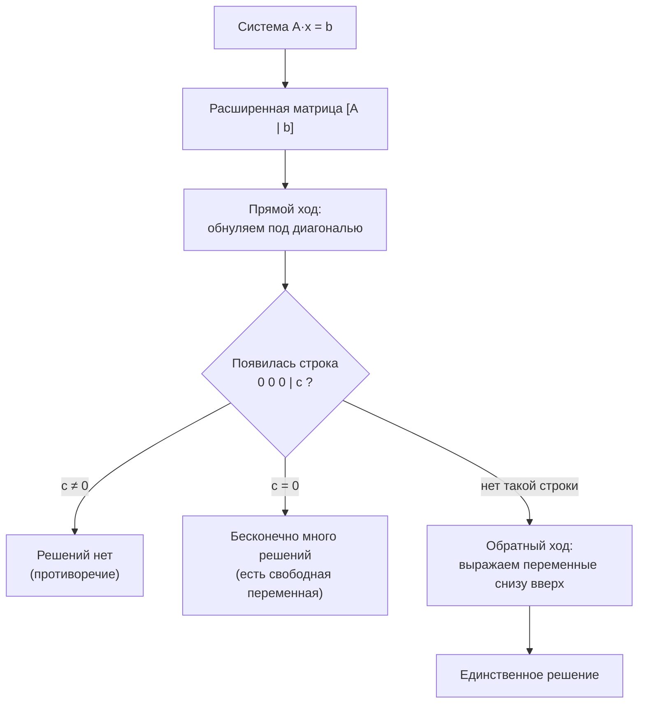
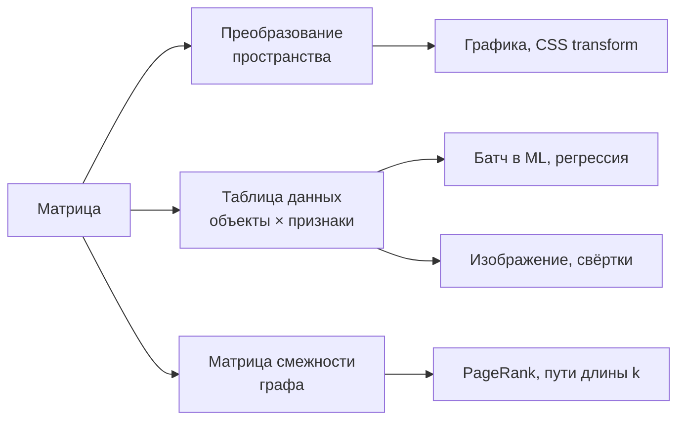

# Матрицы: преобразования, умножение, определитель, системы уравнений

Вторая часть модуля. Первая — [`theory.md`](./theory.md) (векторы и скалярное произведение).

## Вспоминаем школу

Из школы нужны две вещи.

**Система линейных уравнений.** Два уравнения, два неизвестных:

```text
2x + y = 7
x − y = 2
```

Решали **методом подстановки** (выразить `y` из второго и подставить в первое) или
**методом сложения** (сложить уравнения так, чтобы одно неизвестное исчезло). Здесь
сложение работает мгновенно: `3x = 9`, `x = 3`, тогда `y = 1`.

Геометрически каждое уравнение — прямая, а решение — точка их пересечения. Прямые могут
пересечься в одной точке (одно решение), быть параллельными (решений нет) или совпасть
(бесконечно много решений). Эти три случая никуда не денутся и в матричном языке.

**Таблица чисел.** Прямоугольная сетка `m × n` — `m` строк, `n` столбцов. Всё, это и есть
матрица.

## Зачем программисту

- **Графика и UI.** Любой поворот, масштаб, наклон и перенос — умножение на матрицу.
  CSS `transform: matrix(...)`, OpenGL, Canvas — везде одно и то же.
- **Данные — это матрица.** Таблица «строки = объекты, столбцы = признаки». Датасет,
  батч в ML, изображение (пиксели), матрица смежности графа
  ([`11-graphs-recurrences-automata`](../11-graphs-recurrences-automata/theory.md)).
- **PageRank и рекомендации.** Ранжирование страниц — поиск собственного вектора матрицы
  переходов.
- **Регрессия.** «Подогнать прямую под точки» решается через матричное уравнение.
- **Свёртки.** Свёрточный слой нейросети и любой blur/sharpen фильтр — скользящее
  скалярное произведение с маленькой матрицей.

## Простыми словами

Матрица — это **таблица чисел**. Но гораздо полезнее второй взгляд:

> Матрица — это **функция, которая берёт вектор и возвращает вектор**. Причём функция
> особого, «линейного» вида: она умеет только тянуть, сжимать, поворачивать и наклонять
> пространство, но не изгибает его и не сдвигает начало координат.

Ключевая мысль, которая расставляет всё по местам: **столбцы матрицы — это то, куда
уезжают базисные векторы**. Матрица 2×2 первым столбцом говорит, куда попадёт `e₁ = (1,0)`,
вторым — куда попадёт `e₂ = (0,1)`. Всё остальное следует по линейности.

```text
A = [ 3  1 ]     e₁ = (1,0) → (3, 0)   — первый столбец
    [ 0  2 ]     e₂ = (0,1) → (1, 2)   — второй столбец
```

## Точнее

### Обозначения и транспонирование

Элемент на пересечении строки `i` и столбца `j` — `aᵢⱼ`. Размер пишут как `m × n`
(строки × столбцы). **Транспонирование** `Aᵀ` — отражение относительно главной диагонали:
строки становятся столбцами.

```text
A =  [ 1  2  3 ]        Aᵀ = [ 1  4 ]
     [ 4  5  6 ]             [ 2  5 ]
     (2 × 3)                 [ 3  6 ]
                             (3 × 2)
```

### Матрица на вектор

```text
(A·v)ᵢ = Σ(j) aᵢⱼ · vⱼ        — i-я компонента = скалярное произведение i-й строки на v
```

То есть **строка за строкой берём скалярное произведение**. Пример:

```text
[ 3  1 ]   [ 2 ]   [ 3·2 + 1·5 ]   [ 11 ]
[ 0  2 ] · [ 5 ] = [ 0·2 + 2·5 ] = [ 10 ]
```

Второй, более глубокий взгляд — то же самое как **линейная комбинация столбцов**:

```text
A·v = 2·(3, 0) + 5·(1, 2) = (6, 0) + (5, 10) = (11, 10)   — тот же ответ
```

Оба взгляда полезны: первый — как считать, второй — что происходит.

### Три базовых преобразования плоскости

```text
Масштаб:            Поворот на θ:                 Сдвиг (shear) на k:
[ sx   0 ]          [ cos θ  −sin θ ]             [ 1  k ]
[  0  sy ]          [ sin θ   cos θ ]             [ 0  1 ]
```

Как это выглядит на единичном квадрате:

```text
исходный        масштаб (2,1)      поворот 90°        сдвиг k=1
 +---+          +-------+           +---+              +---+
 |   |    →     |       |     →     |   |      →      /   /
 +---+          +-------+           +---+            +---+
```

Поворот на 90° — это `cos 90° = 0`, `sin 90° = 1`:

```text
R = [ 0  −1 ]      e₁ = (1,0) → (0, 1)    — «вправо» стало «вверх»
    [ 1   0 ]      e₂ = (0,1) → (−1, 0)   — «вверх» стало «влево»
```

### Умножение матриц

```text
(A·B)ᵢⱼ = Σ(k) aᵢₖ · bₖⱼ      — строка i матрицы A, скалярно умноженная на столбец j матрицы B
```

**Правило размерностей**: `(m × n) · (n × p) = (m × p)`. Внутренние размеры должны
совпадать, иначе умножение не определено. Мнемоника: «строки первой, столбцы второй,
серединки схлопываются».

**Смысл**: `A·B` — это «сначала применить `B`, потом `A`». Порядок читается **справа
налево**, как в композиции функций `f(g(x))`. Отсюда и главная неожиданность:

```text
A·B ≠ B·A            — умножение матриц НЕ коммутативно
```

Проверим на понятном примере. `R` — поворот на 90°, `S` — растяжение по `x` вдвое.

```text
R·S = [ 0 −1 ]·[ 2 0 ]   = [ 0·2 + (−1)·0   0·0 + (−1)·1 ] = [ 0  −1 ]
      [ 1  0 ] [ 0 1 ]     [ 1·2 +   0·0    1·0 +   0·1  ]   [ 2   0 ]

S·R = [ 2 0 ]·[ 0 −1 ]   = [ 2·0 + 0·1   2·(−1) + 0·0 ] = [ 0  −2 ]
      [ 0 1 ] [ 1  0 ]     [ 0·0 + 1·1   0·(−1) + 1·0 ]   [ 1   0 ]
```

Разные. И это не формальность: «растянуть, потом повернуть» и «повернуть, потом
растянуть» дают физически разные картинки. Любой, кто путал порядок трансформаций в
CSS или OpenGL, это уже переживал.

### Единичная и обратная матрицы

**Единичная матрица** `I` — единицы на диагонали, нули везде ещё. Это «ничего не делать»:
`I·v = v`, `A·I = I·A = A`. Аналог числа 1.

```text
I = [ 1  0 ]
    [ 0  1 ]
```

**Обратная матрица** `A⁻¹` — «отменить преобразование»: `A·A⁻¹ = A⁻¹·A = I`. Аналог
деления. Для 2×2 есть готовая формула:

```text
A = [ a  b ]      A⁻¹ = (1/det A) · [  d  −b ]
    [ c  d ]                        [ −c   a ]
```

Обратная существует не всегда: если преобразование «схлопнуло» плоскость в прямую
(например, спроецировало всё на ось `x`), восстановить исходное невозможно —
информация потеряна.

### Определитель

**Определитель** `det A` — во сколько раз преобразование меняет площадь (в 3D — объём).

```text
det [ a  b ] = ad − bc
    [ c  d ]
```

Читать так:

- `det = 1` — площадь сохраняется (поворот);
- `det = 3` — фигуры раздуваются втрое;
- `det < 0` — пространство вывернулось наизнанку (отражение);
- **`det = 0` — площадь схлопнулась в ноль**, преобразование необратимо, `A⁻¹` не
  существует, а соответствующая система уравнений не имеет единственного решения.

Последний пункт — самый рабочий: `det = 0` это «матрица вырожденная», «строки линейно
зависимы», «уравнения дублируют друг друга». Три разные фразы про одно и то же.

### Системы уравнений как матричное уравнение

Система

```text
 x + 2y +  z = 8
2x +  y −  z = 1
3x −  y + 2z = 7
```

записывается как `A·x = b`:

```text
A = [ 1   2   1 ]     x = [ x ]     b = [ 8 ]
    [ 2   1  −1 ]         [ y ]         [ 1 ]
    [ 3  −1   2 ]         [ z ]         [ 7 ]
```

**Метод Гаусса** (исключение переменных) — тот же школьный метод сложения, только
записанный аккуратно. Работаем с расширенной матрицей `[A | b]` и делаем три вида
операций: менять строки местами, умножать строку на ненулевое число, прибавлять к одной
строке другую, умноженную на число.

```text
[ 1   2   1 | 8 ]
[ 2   1  −1 | 1 ]
[ 3  −1   2 | 7 ]

R2 ← R2 − 2·R1                          — обнуляем x во второй строке
[ 1   2   1 |  8 ]
[ 0  −3  −3 | −15 ]
[ 3  −1   2 |  7 ]

R3 ← R3 − 3·R1                          — обнуляем x в третьей строке
[ 1   2   1 |  8 ]
[ 0  −3  −3 | −15 ]
[ 0  −7  −1 | −17 ]

R2 ← R2 / (−3)                          — делаем ведущий элемент единицей
[ 1   2   1 |  8 ]
[ 0   1   1 |  5 ]
[ 0  −7  −1 | −17 ]

R3 ← R3 + 7·R2                          — обнуляем y в третьей строке
[ 1   2   1 |  8 ]
[ 0   1   1 |  5 ]
[ 0   0   6 | 18 ]                      — треугольный вид достигнут

обратный ход:
6z = 18       ⇒ z = 3                   — из последней строки
y + z = 5     ⇒ y = 5 − 3 = 2           — подставили z во вторую
x + 2y + z = 8 ⇒ x = 8 − 4 − 3 = 1      — подставили в первую

проверка во втором уравнении: 2·1 + 2 − 3 = 1 ✓
```

Стоимость метода Гаусса — `O(n³)` операций. Для `n = 1000` это 10⁹ — секунда; для
`n = 10⁶` — безнадёжно, там нужны итеративные методы.



### Собственные векторы за одну страницу

**Собственный вектор** матрицы — редкий вектор, который преобразование **не поворачивает**,
а только растягивает или сжимает:

```text
A·v = λ·v          — v ≠ 0, λ (лямбда) называется собственным значением
```

Смысл: это «оси» преобразования. Поворот плоскости собственных векторов не имеет вовсе
(всё поворачивается); растяжение по `x` имеет собственный вектор `(1, 0)` с `λ = 2` и
`(0, 1)` с `λ = 1`.

Зачем это программисту: **PageRank**. Возьмём матрицу `M`, где `Mᵢⱼ` — вероятность, что
пользователь перейдёт со страницы `j` на страницу `i`. Распределение «где находится
случайный сёрфер» после шага — это `M·p`. Устойчивое распределение, которое перестаёт
меняться, удовлетворяет

```text
M·p = p            — то есть p это собственный вектор с λ = 1
```

Вот и весь PageRank: важность страницы — компонента собственного вектора матрицы ссылок.
Практически его считают не формулами, а простым повторением `p ← M·p` до сходимости
(**степенной метод**). Та же математика стоит за спектральной кластеризацией и PCA.

### Где ещё это встречается

- **Изображение — матрица.** Оттенки серого: `m × n` чисел. RGB — три такие матрицы.
- **Свёртка — скользящее скалярное произведение.** Маленькое ядро (например, 3×3)
  двигается по картинке, в каждой позиции считается скалярное произведение ядра и
  накрытого куска. Blur, sharpen, детектор границ и свёрточный слой CNN — одна операция
  с разными числами в ядре.
- **Нормальные уравнения.** Задача «провести прямую через облако точек» сводится к
  `(AᵀA)·x = Aᵀb` — это уже система, решаемая Гауссом.
- **Матрица смежности графа.** `Aᵏ` даёт число путей длины `k` между вершинами.



## Разобранные примеры

### Пример 1. Определитель и обратная матрица

```text
A = [ 3  1 ]
    [ 2  4 ]

det A = 3·4 − 1·2 = 12 − 2 = 10          — площади растут в 10 раз
det ≠ 0 ⇒ обратная существует

A⁻¹ = (1/10)·[  4  −1 ] = [  0.4  −0.1 ]
             [ −2   3 ]   [ −0.2   0.3 ]

проверка: A·A⁻¹ = [ 3·0.4 + 1·(−0.2)   3·(−0.1) + 1·0.3 ]
                  [ 2·0.4 + 4·(−0.2)   2·(−0.1) + 4·0.3 ]
                = [ 1.2 − 0.2   −0.3 + 0.3 ] = [ 1  0 ]   ✓
                  [ 0.8 − 0.8   −0.2 + 1.2 ]   [ 0  1 ]
```

### Пример 2. Вырожденная матрица

```text
B = [ 2  4 ]
    [ 1  2 ]
det B = 2·2 − 4·1 = 0                    — площадь схлопнулась
```

Вторая строка — это первая, поделённая на 2: уравнения дублируют друг друга.
Преобразование сжимает всю плоскость на одну прямую, обратной матрицы нет, а система
`B·x = b` либо не имеет решений, либо имеет их бесконечно много.

### Пример 3. Поворот вектора на 90°

```text
R = [ 0  −1 ]      v = (3, 1)
    [ 1   0 ]

R·v = [ 0·3 + (−1)·1 ] = [ −1 ]
      [ 1·3 +   0·1  ]   [  3 ]

проверка: длины совпадают, √(9+1) = √(1+9) = √10   — поворот длину не меняет
проверка: v · (R·v) = 3·(−1) + 1·3 = 0             — угол ровно 90°, векторы ортогональны
det R = 0·0 − (−1)·1 = 1                           — площадь сохранилась
```

### Пример 4. Прямая методом наименьших квадратов

Точки `(1, 2), (2, 3), (3, 5)`. Ищем `y = kx + b`. Записываем «идеальную» систему:

```text
A = [ 1  1 ]        x = [ k ]        b = [ 2 ]
    [ 2  1 ]            [ b ]            [ 3 ]
    [ 3  1 ]                             [ 5 ]
```

Три уравнения на две неизвестные — точного решения нет (точки не лежат на одной прямой).
Умножаем обе части на `Aᵀ` — получаются **нормальные уравнения** `AᵀA·x = Aᵀb`:

```text
AᵀA = [ 1+4+9   1+2+3 ] = [ 14   6 ]
      [ 1+2+3   1+1+1 ]   [  6   3 ]

Aᵀb = [ 1·2 + 2·3 + 3·5 ] = [ 23 ]
      [ 1·2 + 1·3 + 1·5 ]   [ 10 ]

14k + 6b = 23
 6k + 3b = 10

умножим второе на 2:  12k + 6b = 20
вычтем из первого:     2k      = 3      ⇒ k = 1.5
подставим:             6·1.5 + 3b = 10  ⇒ 3b = 1  ⇒ b = 1/3 ≈ 0.333

прямая: y = 1.5x + 0.333
```

Проверка в точках: `1.833, 3.333, 4.833` против `2, 3, 5` — отклонения `±0.167`,
суммарная квадратичная ошибка минимальна.

## В коде

```go
type Matrix struct {
	rows, cols int
	data       []float64 // построчно: элемент (i,j) лежит в data[i*cols+j]
}

func (m Matrix) At(i, j int) float64 { return m.data[i*m.cols+j] }

func MulVec(m Matrix, v []float64) ([]float64, error) {
	if m.cols != len(v) {
		return nil, fmt.Errorf("matvec: %dx%d on vector of length %d", m.rows, m.cols, len(v))
	}
	out := make([]float64, m.rows)
	for i := 0; i < m.rows; i++ {
		sum := 0.0
		for j := 0; j < m.cols; j++ {
			sum += m.At(i, j) * v[j] // строка i скалярно на v
		}
		out[i] = sum
	}
	return out, nil
}
```

Умножение матриц и определитель 2×2:

```go
func Mul(a, b Matrix) (Matrix, error) {
	if a.cols != b.rows {
		return Matrix{}, fmt.Errorf("matmul: (%dx%d)·(%dx%d)", a.rows, a.cols, b.rows, b.cols)
	}
	c := Matrix{rows: a.rows, cols: b.cols, data: make([]float64, a.rows*b.cols)}
	for i := 0; i < a.rows; i++ {
		for j := 0; j < b.cols; j++ {
			sum := 0.0
			for k := 0; k < a.cols; k++ { // «серединки схлопываются»
				sum += a.At(i, k) * b.At(k, j)
			}
			c.data[i*c.cols+j] = sum
		}
	}
	return c, nil
}

func det2(a, b, c, d float64) float64 { return a*d - b*c } // det2(3,1,2,4) → 10
```

Степенной метод для собственного вектора (мини-PageRank):

```go
func powerIteration(m Matrix, steps int) []float64 {
	p := make([]float64, m.cols)
	for i := range p {
		p[i] = 1 / float64(len(p)) // равномерный старт
	}
	for s := 0; s < steps; s++ {
		next, _ := MulVec(m, p)
		sum := 0.0
		for _, x := range next {
			sum += x
		}
		for i := range next {
			next[i] /= sum // нормализуем, иначе значения уплывут
		}
		p = next
	}
	return p
}
```

В продакшене всё это берут готовым: **gonum** (`gonum.org/v1/gonum/mat`) даёт `mat.Dense`,
`mat.NewVecDense`, `Mul`, `Det`, `Inverse`, `mat.Solve` для систем и `mat.Eigen` для
собственных значений — с BLAS-ускорением и аккуратной численной устойчивостью.

## Типичные ошибки

- **Перепутать порядок умножения.** `A·B` значит «сначала B, потом A». Классический баг
  в графике: объект улетает не туда, потому что перенос применён до поворота.
- **Игнорировать правило размерностей.** `(2×3)·(2×3)` не существует. Проверяйте
  «внутренние совпадают, внешние остаются».
- **Считать `det = 0` мелочью.** Это сигнал, что данных не хватает: признаки линейно
  зависимы, система вырождена, обратной матрицы нет.
- **Инвертировать матрицу, чтобы решить систему.** `x = A⁻¹b` математически верно, но
  численно хуже и в разы медленнее прямого решения (Гаусс / LU). Используйте `mat.Solve`.
- **Забыть про почти-вырожденность.** `det = 1e-15` численно не отличим от нуля: решение
  будет, но полностью из шума. Смотрите на число обусловленности, а не на «det ≠ 0».
- **Хранить матрицу как `[][]float64` в горячем коде.** Каждая строка — отдельная
  аллокация и промах кеша. Плоский срез с индексом `i*cols+j` заметно быстрее.

## Шпаргалка формул

| Что | Формула |
|-----|---------|
| Размер | `m × n` — строк × столбцов |
| Транспонирование | `(Aᵀ)ᵢⱼ = aⱼᵢ` |
| Матрица на вектор | `(A·v)ᵢ = Σⱼ aᵢⱼ·vⱼ` |
| Умножение матриц | `(A·B)ᵢⱼ = Σₖ aᵢₖ·bₖⱼ` |
| Правило размерностей | `(m × n)·(n × p) = (m × p)` |
| Некоммутативность | `A·B ≠ B·A` в общем случае |
| Единичная | `A·I = I·A = A` |
| Обратная | `A·A⁻¹ = I` |
| Обратная 2×2 | `A⁻¹ = (1/det A)·[[d, −b], [−c, a]]` |
| Определитель 2×2 | `det = ad − bc` |
| Вырожденность | `det A = 0` ⇔ обратной нет ⇔ строки зависимы |
| Поворот на θ | `[[cos θ, −sin θ], [sin θ, cos θ]]` |
| Масштаб | `[[sx, 0], [0, sy]]` |
| Сдвиг | `[[1, k], [0, 1]]` |
| Система | `A·x = b`, решать методом Гаусса за `O(n³)` |
| Наименьшие квадраты | `AᵀA·x = Aᵀb` |
| Собственный вектор | `A·v = λ·v`, `v ≠ 0` |
| PageRank | `M·p = p` — собственный вектор с `λ = 1` |

## Словарь терминов

- **Матрица** — прямоугольная таблица чисел; она же линейное преобразование.
- **Линейное преобразование** — отображение, сохраняющее сложение и умножение на число.
- **Транспонирование `Aᵀ`** — обмен строк и столбцов.
- **Единичная матрица `I`** — «ничего не делать», единицы на диагонали.
- **Обратная матрица `A⁻¹`** — отменяет действие `A`.
- **Определитель `det A`** — коэффициент изменения площади/объёма.
- **Вырожденная (сингулярная) матрица** — `det = 0`, обратной нет.
- **Метод Гаусса** — приведение системы к треугольному виду элементарными операциями.
- **Свободная переменная** — переменная, которой можно задать любое значение; означает
  бесконечное число решений.
- **Собственный вектор / собственное значение** — `A·v = λ·v`; направление, которое
  преобразование только масштабирует.
- **Степенной метод** — итеративный поиск главного собственного вектора через `p ← M·p`.
- **Нормальные уравнения** — `AᵀA·x = Aᵀb`, решение переопределённой системы по методу
  наименьших квадратов.
- **Свёртка** — скользящее скалярное произведение изображения с ядром.

## См. также

- [`theory.md`](./theory.md) — векторы, нормы, скалярное произведение.
- [`11-graphs-recurrences-automata`](../11-graphs-recurrences-automata/theory.md) —
  матрица смежности графа и степени матрицы как число путей.
- [`08-statistics-and-data`](../08-statistics-and-data/theory.md) — регрессия и
  корреляция с точки зрения статистики.
- **3Blue1Brown — «Essence of Linear Algebra»** (Grant Sanderson), серии 3–7 и 10–14:
  матрицы как преобразования, определитель, обратная матрица, собственные векторы.
- **Khan Academy** — курс Linear Algebra, разделы «Matrix transformations» и
  «Alternate coordinate systems».
- Paul Orland. **Math for Programmers** (Manning, 2020), главы 4–5 — матрицы и
  трансформации с кодом.
- **gonum** — gonum.org/v1/gonum, пакет `mat` (`Dense`, `Solve`, `Det`, `Eigen`);
  документация на pkg.go.dev/gonum.org/v1/gonum/mat.
- Brin, Page. **The Anatomy of a Large-Scale Hypertextual Web Search Engine** (1998) —
  исходная статья про PageRank.
