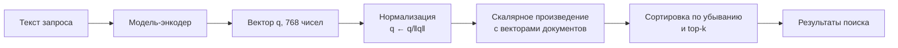
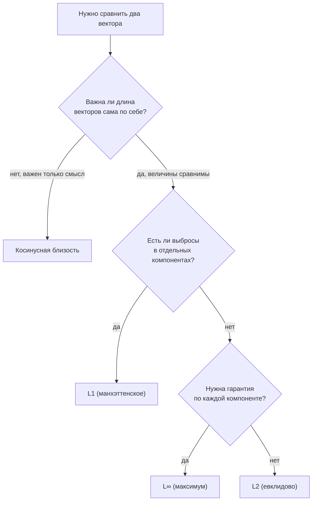

# Векторы: длина, расстояние, скалярное произведение, косинусная близость

## Вспоминаем школу

В школе была **координатная плоскость**: две оси, точка задаётся парой чисел `(x, y)`.
И была **теорема Пифагора**: в прямоугольном треугольнике `c² = a² + b²`.

Из них двоих следует всё, что нужно для начала. Расстояние от начала координат до точки
`(3, 4)`:

```text
d² = 3² + 4²        — теорема Пифагора: катеты 3 и 4
d² = 9 + 16 = 25    — посчитали
d = √25 = 5         — извлекли корень
```

Ещё был **вектор** — «отрезок со стрелкой», у которого есть длина и направление. И
главный факт про векторы, который все забывают: **вектор не привязан к месту**. Стрелка
из `(0,0)` в `(3,4)` и стрелка из `(5,5)` в `(8,9)` — это один и тот же вектор `(3, 4)`.
Важно только смещение.

```text
   y
 5 |        ,>(3,4)
 4 |      ,'
 3 |    ,'
 2 |  ,'
 1 |,'
 0 +-------------------> x
   0  1  2  3  4  5
```

## Зачем программисту

Вектор — это `[]float64`, и почти всё, что делается с данными, делается с векторами.

- **Поиск по смыслу.** Текст, картинку или пользователя превращают в вектор из сотен
  чисел (**embedding**). Похожие объекты дают близкие векторы. «Найти похожее» =
  «найти ближайший вектор».
- **Рекомендации.** Профиль вкусов — вектор; товар — вектор; совпадение — скалярное
  произведение.
- **Графика и игры.** Позиция, скорость, нормаль к поверхности — векторы. Поворот
  камеры — матрица (модуль продолжается в [`theory-2-matrices.md`](./theory-2-matrices.md)).
- **ML.** Веса модели — вектор. Градиент из
  [`09-growth-and-calculus-intuition`](../09-growth-and-calculus-intuition/theory-2-calculus.md)
  — тоже вектор, и шаг обучения `w ← w − α·∇f` — это операция над векторами.
- **Метрики и мониторинг.** Расстояние между «нормальным» профилем нагрузки и текущим —
  основа простейшего детектора аномалий.

## Простыми словами

Вектор — это **список чисел** (для программиста) и **стрелка** (для интуиции). Оба
взгляда верны и нужны: стрелка объясняет, почему формулы такие, список объясняет, как их
считать.

Две базовые операции:

- **Сложение** — «пройти по первой стрелке, потом от её конца по второй». По координатам:
  складываем поэлементно.
- **Умножение на число (скаляр)** — «растянуть стрелку», сохранив направление. По
  координатам: умножаем каждую компоненту. Отрицательный множитель разворачивает стрелку.

```text
u = (2, 1),  v = (1, 3)

u + v = (3, 4):            2·u = (4, 2):

  ^        ,>u+v             ^
  |  v ,-'/                  |
  |   /  /                   |     ,--> 2u
  |  /  /                    |  ,-'
  | /  / u                   |,'  u
  +--------->                +--------->
```

Скалярное произведение отвечает на вопрос **«насколько два вектора смотрят в одну
сторону»**. Оно положительно, если направления похожи, ноль — если векторы
перпендикулярны, отрицательно — если смотрят в разные стороны.

## Точнее

### Обозначения

Вектор пишут `v = (v₁, v₂, ..., vₙ)`. Число компонент `n` — **размерность**. Скаляр
(обычное число) обозначают буквой без стрелки: `c·v`.

```text
v + w = (v₁ + w₁, ..., vₙ + wₙ)          — сложение поэлементно
c·v   = (c·v₁, ..., c·vₙ)                — умножение на скаляр
```

### Нормы: три способа измерить длину

**Норма** `‖v‖` — длина вектора. Их несколько, и выбор — инженерное решение.

```text
L2 (евклидова):  ‖v‖₂ = √(v₁² + v₂² + ... + vₙ²)      — «по прямой», Пифагор
L1 (манхэттенская): ‖v‖₁ = |v₁| + |v₂| + ... + |vₙ|   — «по улицам», сумма модулей
L∞ (максимум):   ‖v‖∞ = max(|v₁|, ..., |vₙ|)          — «самая большая компонента»
```

Для `v = (3, −4)`:

```text
‖v‖₂ = √(9 + 16) = 5        — обычная длина
‖v‖₁ = 3 + 4 = 7            — как такси по кварталам
‖v‖∞ = max(3, 4) = 4        — худшая компонента
```

Всегда выполняется `‖v‖∞ ≤ ‖v‖₂ ≤ ‖v‖₁`.

Где что нужно: L2 — геометрия, embeddings, регуляризация ridge; L1 — устойчивость к
выбросам и разреженность (lasso), «манхэттенское» расстояние на сетке; L∞ — SLA и
гарантии «ни одна компонента не отклонилась больше чем на ε».

**Расстояние** между векторами — норма их разности:

```text
d(v, w) = ‖v − w‖
```

**Единичный вектор** (нормализация) — вектор той же направленности длины 1:

```text
v̂ = v / ‖v‖₂
```

### Скалярное произведение

```text
v · w = v₁w₁ + v₂w₂ + ... + vₙwₙ = Σ(i=1..n) vᵢwᵢ
```

Это **число**, а не вектор (отсюда «скалярное»). В коде — один цикл. Символ `Σ` разобран
в [словаре обозначений](../01-numbers-and-arithmetic/theory.md#словарь-обозначений).

Геометрическая форма — вторая, эквивалентная:

```text
v · w = ‖v‖ · ‖w‖ · cos θ,   где θ — угол между векторами
```

Из неё сразу следуют три факта, ради которых всё и затевалось:

1. `v · v = ‖v‖²` (угол с самим собой равен нулю, `cos 0 = 1`). Удобно: квадрат длины
   считается без корня.
2. `v · w = 0` ⇔ векторы **ортогональны** (перпендикулярны, `cos 90° = 0`).
3. `v · w > 0` — «смотрят в одну сторону», `< 0` — «в разные».

**Проекция.** Скалярное произведение — это «сколько от `v` укладывается вдоль
направления `w`», умноженное на длину `w`. Длина проекции `v` на направление `w`:

```text
proj = (v · w) / ‖w‖
```

Именно поэтому скалярное произведение измеряет «совпадение по смыслу»: оно смотрит, какая
часть одного вектора лежит вдоль другого.

### Косинусная близость

Если мы хотим сравнивать **направления**, а не длины, — делим на длины:

```text
cos(v, w) = (v · w) / (‖v‖₂ · ‖w‖₂)
```

Значение всегда лежит в `[−1, 1]`: `1` — одинаковое направление, `0` — ортогональны,
`−1` — противоположны.

Почему в поиске по embeddings используют именно её, а не евклидово расстояние: длина
вектора часто кодирует «побочные» вещи (длину текста, частоту слова, уверенность модели),
а смысл сидит в направлении. Косинус эти помехи убирает.

Полезный факт для оптимизации: если все векторы заранее нормализованы (`‖v‖ = 1`), то

```text
cos(v, w) = v · w                    — знаменатель равен 1
‖v − w‖² = 2 − 2·(v · w)             — раскрыли квадрат, использовали ‖v‖=‖w‖=1
```

Значит, на нормализованных векторах сортировка по косинусу и по евклидову расстоянию
даёт **один и тот же порядок**. Векторные базы этим и пользуются: нормализуют один раз
при вставке, а дальше считают только скалярное произведение.



### Какую меру близости выбрать



### Ортогональность и базис

Векторы `e₁ = (1, 0)` и `e₂ = (0, 1)` ортогональны и имеют длину 1 — это
**стандартный базис** плоскости. Любой вектор раскладывается по нему единственным
образом: `(3, 4) = 3·e₁ + 4·e₂`. Ортогональность важна, потому что означает
«независимые, не пересекающиеся направления»: изменение вдоль одного не влияет на другое.
На этом стоит вся идея «признаки должны быть некоррелированными».

## Разобранные примеры

### Пример 1. Длина, расстояние, нормализация

`v = (1, 2, 2)`, `w = (4, 2, 4)`.

```text
‖v‖₂ = √(1² + 2² + 2²) = √(1 + 4 + 4) = √9 = 3
‖w‖₂ = √(16 + 4 + 16) = √36 = 6
v − w = (1−4, 2−2, 2−4) = (−3, 0, −2)          — покомпонентная разность
d(v, w) = √(9 + 0 + 4) = √13 ≈ 3.606           — расстояние
v̂ = (1/3, 2/3, 2/3)                            — нормализовали, длина стала 1
проверка: √(1/9 + 4/9 + 4/9) = √1 = 1          — сходится
```

### Пример 2. Скалярное произведение и угол

`v = (1, 2, 3)`, `w = (4, 5, 6)`.

```text
v · w = 1·4 + 2·5 + 3·6        — определение
      = 4 + 10 + 18
      = 32
‖v‖ = √(1 + 4 + 9) = √14 ≈ 3.742
‖w‖ = √(16 + 25 + 36) = √77 ≈ 8.775
cos θ = 32 / (3.742 · 8.775)   — формула косинусной близости
      = 32 / 32.833
      ≈ 0.9746                 — очень близкие направления
θ = arccos(0.9746) ≈ 12.9°     — угол между векторами
```

### Пример 3. Ортогональность

`a = (2, −1)`, `b = (1, 2)`.

```text
a · b = 2·1 + (−1)·2 = 2 − 2 = 0     — скалярное произведение равно нулю
⇒ a ⊥ b                              — векторы перпендикулярны
```

Проверка глазами: `a` идёт вправо-вниз, `b` — вправо-вверх, и наклоны `−1/2` и `2` —
взаимно обратные с минусом. Это школьный признак перпендикулярности прямых, и он же —
частный случай `a · b = 0`.

### Пример 4. Игрушечный семантический поиск

Три «документа» в трёхмерном пространстве признаков `(база данных, сеть, фронтенд)`:

```text
d₁ = (0.9, 0.1, 0.0)   — статья про индексы в Postgres
d₂ = (0.1, 0.9, 0.1)   — статья про TCP
d₃ = (0.2, 0.2, 0.9)   — статья про CSS
q  = (0.8, 0.3, 0.0)   — запрос «медленный SQL-запрос»
```

```text
q · d₁ = 0.8·0.9 + 0.3·0.1 + 0 = 0.72 + 0.03 = 0.75
q · d₂ = 0.8·0.1 + 0.3·0.9 + 0 = 0.08 + 0.27 = 0.35
q · d₃ = 0.8·0.2 + 0.3·0.2 + 0 = 0.16 + 0.06 = 0.22
‖q‖ = √(0.64 + 0.09) = √0.73 ≈ 0.8544
‖d₁‖ = √(0.81 + 0.01) = √0.82 ≈ 0.9055
cos(q, d₁) = 0.75 / (0.8544 · 0.9055) ≈ 0.9695     — почти совпадение
```

Аналогично `cos(q, d₂) ≈ 0.45`, `cos(q, d₃) ≈ 0.27`. Порядок выдачи: `d₁`, `d₂`, `d₃` —
ровно то, чего ждёт здравый смысл.

## В коде

Базовые операции на срезах:

```go
func dot(a, b []float64) float64 {
	sum := 0.0
	for i := range a { // Σ aᵢ·bᵢ — скалярное произведение это цикл
		sum += a[i] * b[i]
	}
	return sum
}

func norm(a []float64) float64 { return math.Sqrt(dot(a, a)) } // ‖v‖ = √(v·v)

func cosine(a, b []float64) float64 {
	d := norm(a) * norm(b)
	if d == 0 {
		return 0 // нулевой вектор не имеет направления
	}
	return dot(a, b) / d
}
```

Проверка тождества `‖v − w‖² = 2 − 2·(v·w)` для нормализованных векторов:

```go
v := []float64{0.6, 0.8}        // ‖v‖ = 1
w := []float64{0.8, 0.6}        // ‖w‖ = 1
diff := []float64{v[0] - w[0], v[1] - w[1]}
fmt.Println(dot(diff, diff))    // 0.08
fmt.Println(2 - 2*dot(v, w))    // 0.07999999999999996 — совпало в пределах float64
```

Для реальных задач писать это руками не нужно: библиотека **gonum**
(gonum.org/v1/gonum) даёт `floats.Dot`, `floats.Norm`, `mat.VecDense` и работает
существенно быстрее наивного цикла.

## Типичные ошибки

- **Сравнивать векторы разной длины.** `dot` по `range a` молча посчитает мусор, если
  `len(b) < len(a)` — или упадёт с паникой. Размерности надо проверять явно.
- **Считать косинус для ненормализованных данных и удивляться.** Косинус игнорирует
  длину — это его свойство, а не баг. Если длина важна (например, «сколько раз купили»),
  косинус не тот инструмент.
- **Забыть про нулевой вектор.** У него нет направления, `cos` даст деление на ноль.
- **Путать `v · w` (число) и покомпонентное умножение (вектор).** В numpy это `@` против
  `*`, и ошибка почти незаметна глазами.
- **Сравнивать float-компоненты через `==`.** После нормализации `‖v‖` будет
  `0.9999999999999999`. Сравнивайте с допуском.
- **Думать, что «близко по косинусу» = «одно и то же».** Косинус 0.95 в 768-мерном
  пространстве может означать «оба текста на русском», а не «оба про Postgres».

## Шпаргалка формул

| Что | Формула |
|-----|---------|
| Сложение | `v + w = (v₁ + w₁, ..., vₙ + wₙ)` |
| Умножение на скаляр | `c·v = (c·v₁, ..., c·vₙ)` |
| Норма L2 | `‖v‖₂ = √(Σ vᵢ²)` |
| Норма L1 | `‖v‖₁ = Σ abs(vᵢ)` |
| Норма L∞ | `‖v‖∞ = max abs(vᵢ)` |
| Соотношение норм | `‖v‖∞ ≤ ‖v‖₂ ≤ ‖v‖₁` |
| Расстояние | `d(v, w) = ‖v − w‖` |
| Нормализация | `v̂ = v / ‖v‖₂` |
| Скалярное произведение | `v · w = Σ vᵢwᵢ` |
| Геометрическая форма | `v · w = ‖v‖·‖w‖·cos θ` |
| Квадрат длины | `v · v = ‖v‖²` |
| Ортогональность | `v · w = 0` |
| Косинусная близость | `cos(v, w) = (v · w)/(‖v‖·‖w‖)` |
| Проекция v на w | `(v · w)/‖w‖` |
| На нормализованных | `‖v − w‖² = 2 − 2·(v · w)` |

## Словарь терминов

- **Вектор** — упорядоченный список чисел; геометрически — стрелка (смещение).
- **Скаляр** — обычное число, в отличие от вектора.
- **Размерность** — количество компонент вектора.
- **Норма `‖v‖`** — длина вектора; L1, L2, L∞ — разные способы её мерить.
- **Единичный вектор** — вектор длины 1.
- **Нормализация** — деление вектора на его длину.
- **Скалярное произведение `v · w`** — сумма попарных произведений компонент; число.
- **Ортогональность** — перпендикулярность, `v · w = 0`.
- **Проекция** — «тень» одного вектора на направление другого.
- **Косинусная близость** — скалярное произведение нормализованных векторов, из `[−1, 1]`.
- **Embedding** — числовой вектор, кодирующий смысл объекта (текста, картинки, товара).
- **Базис** — набор векторов, через который однозначно выражается любой вектор пространства.

## См. также

- [`theory-2-matrices.md`](./theory-2-matrices.md) — матрицы, преобразования, системы уравнений.
- [`09-growth-and-calculus-intuition`](../09-growth-and-calculus-intuition/theory-2-calculus.md)
  — градиент как вектор, градиентный спуск.
- [`08-statistics-and-data`](../08-statistics-and-data/theory.md) — корреляция как
  «косинус центрированных векторов».
- **3Blue1Brown — «Essence of Linear Algebra»** (YouTube, Grant Sanderson), серии 1–2 и 9
  (векторы, линейные комбинации, скалярное произведение). Лучшая визуальная интуиция.
- **Khan Academy** — курс Linear Algebra, разделы «Vectors» и «Dot products».
- Paul Orland. **Math for Programmers** (Manning, 2020), главы 2–3 — векторы с кодом.
- **gonum** — gonum.org/v1/gonum, пакеты `floats` и `mat`; документация на pkg.go.dev.
