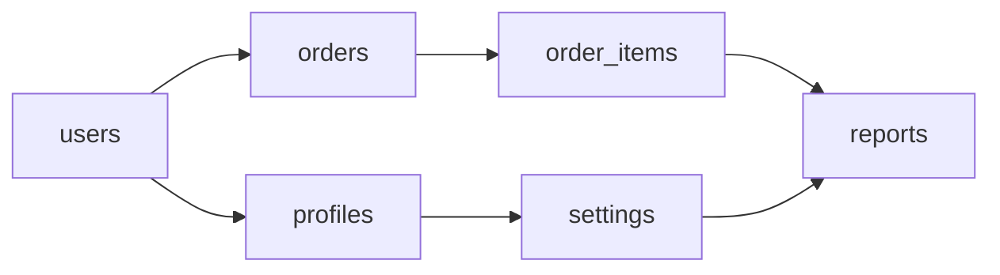
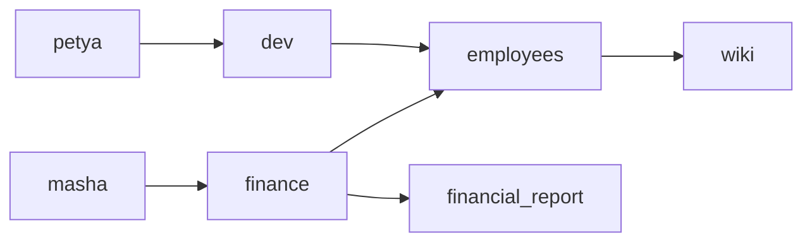

# Урок 01 — Моделируем задачу графом: зависимости, права, очередь задач

## Разогрев

- `G = (V, E)`; `Σ deg(v) = 2m` — лемма о рукопожатиях.
- Дерево: связный, без циклов, `m = n − 1`.
- DAG: топологический порядок существует ⇔ циклов нет.
- Списки смежности — `O(n + m)` памяти; матрица — `O(n²)`.

Теория — [`theory.md`](../theory.md).

## Новая тема: как перевести формулировку на язык графа

Половина работы — задать себе три вопроса **до** написания кода.

1. **Что такое вершина?** Обычно это существительное из формулировки: пользователь,
   задача, таблица, сервис, пакет.
2. **Что такое ребро и куда оно направлено?** Это глагол: «зависит от», «подчиняется»,
   «имеет роль», «вызывает». Направление задаёт смысл: `A → B` может значить «A требует
   B» или «B требует A», и путать эти два варианта — самая частая ошибка.
3. **Какой вопрос мы задаём графу?** От этого зависит и представление, и алгоритм:
   достижимость (есть ли путь), порядок (топологическая сортировка), кратчайший путь,
   наличие цикла, компоненты связности.

Разберём три реальные задачи по этой схеме.

## Разобранные примеры

### Пример 1. Порядок применения миграций

Формулировка: «есть 6 миграций, некоторые требуют, чтобы другие были применены раньше.
В каком порядке накатывать и как обнаружить, что кто-то намудрил с зависимостями?»

```text
вершина  = миграция
ребро    = «A должна быть применена до B», направление A → B
вопрос   = существует ли линейный порядок (топологическая сортировка)
```



Считаем входящие степени и применяем алгоритм Кана:

```text
indeg: users=0, orders=1, profiles=1, order_items=1, settings=1, reports=2

шаг 1: берём users (indeg = 0)              → порядок: users
       уменьшаем indeg соседей: orders=0, profiles=0
шаг 2: берём orders                         → users, orders
       order_items=0
шаг 3: берём profiles                       → users, orders, profiles
       settings=0
шаг 4: берём order_items                    → ..., order_items
       reports=1
шаг 5: берём settings                       → ..., settings
       reports=0
шаг 6: берём reports                        → ..., reports

в порядок попали все 6 вершин ⇒ циклов нет
```

Если бы кто-то добавил зависимость `reports → users`, на первом шаге не нашлось бы ни
одной вершины с нулевой входящей степенью — очередь пуста, а вершины остались. Это и есть
детектор циклической зависимости, и он бесплатный: он встроен в саму сортировку.

Заодно из схемы видно, что `orders` и `profiles` независимы — их можно накатывать
параллельно. Топологический порядок не единственный, и это не баг, а ресурс.

### Пример 2. Проверка прав доступа

Формулировка: «пользователи входят в группы, группы вложены друг в друга, права висят на
группах. Может ли Петя читать финансовый отчёт?»

```text
вершина  = пользователь, группа или ресурс
ребро    = «входит в» (user → group, group → group) и «даёт доступ к» (group → resource)
вопрос   = достижимость: существует ли путь от пользователя до ресурса
```



```text
достижимость от petya: dev → employees → wiki
financial_report НЕ достижим ⇒ доступа нет
достижимость от masha: finance → {employees → wiki, financial_report}
⇒ Маша читает и вики, и отчёт
```

Три практических замечания. Первое: обход обязан помечать посещённые вершины — если в
данных завёлся цикл вложенности групп, обход без пометок зациклится навсегда. Второе:
глубина вложенности обычно мала, поэтому BFS от пользователя стоит копейки, но её надо
ограничивать явным лимитом. Третье: граф разреженный (у пользователя единицы групп),
значит списки смежности, а не матрица.

### Пример 3. Дерево категорий и его свойства

Формулировка: «каталог товаров, у каждой категории один родитель. Сколько связей, какая
глубина, что проверять?»

```text
вершина  = категория
ребро    = «родитель — ребёнок», n − 1 штук
вопрос   = это точно дерево? какая высота?
```

```text
n = 100000 категорий
m = n − 1 = 99999 связей parent_id

инварианты, которые стоит проверять в данных:
  1) ровно у одной категории parent_id IS NULL      — единственный корень
  2) число рёбер равно n − 1                        — иначе есть лишняя связь
  3) при обходе от корня достижимы все n вершин     — иначе граф несвязен
условия 2 и 3 вместе ⇒ циклов нет, это действительно дерево
```

Почему двух условий достаточно: связный граф на `n` вершинах с `n − 1` рёбрами обязан
быть деревом — добавление любого ребра к дереву создаёт цикл, а убрать ребро нельзя, не
потеряв связность. Это ровно то эквивалентное определение из теории, применённое как
тест целостности данных.

Про высоту: при ветвлении 10 глубина всего `log₁₀ 100000 = 5` уровней. Значит,
рекурсивный обход безопасен, а SQL-запрос с рекурсивным CTE отработает за 5 итераций.

### Пример 4. Выбор представления

```text
задача                          n          m            представление
──────────────────────────────────────────────────────────────────────────
граф зависимостей пакетов       ~10³       ~5·10³       списки смежности
права доступа                   ~10⁶       ~10⁷         списки смежности
граф из 40 микросервисов        40         ~200         можно матрицу: 1600 ячеек
матрица переходов PageRank      —          —            матрица (нужны Aᵏ и умножения)
```

Правило простое: если `m` порядка `n` — списки; если граф маленький или нужны матричные
операции (степени, собственные векторы из
[`10-linear-algebra-basics`](../../10-linear-algebra-basics/theory-2-matrices.md)) —
матрица.

## Mini-drill

```drill
type: fill-in
prompt: "В графе миграций из примера 1 добавили зависимость reports → users. Сколько вершин попадёт в топологический порядок до того, как алгоритм Кана остановится? Целое число."
answer: "0"
check: exact
hint: Все вершины оказываются в одном цикле или зависят от него — вершин с нулевой входящей степенью нет с самого начала.
```

```drill
type: fill-in
prompt: "Дерево категорий содержит 12 500 узлов. Сколько в нём рёбер? Целое число."
answer: "12499"
check: exact
```

```drill
type: multiple-choice
prompt: "Проверка прав «может ли пользователь дойти до ресурса» — это какая задача на графе?"
options: ["Кратчайший путь с весами", "Достижимость (существует ли путь)", "Топологическая сортировка", "Поиск максимального паросочетания"]
answer: "Достижимость (существует ли путь)"
check: exact
```

```drill
type: free-form
prompt: "Возьмите задачу из вашего проекта («что от чего зависит», «кто кому подчиняется», «какие сервисы кого вызывают») и опишите её как граф по трём вопросам: что вершина, что ребро и его направление, какой вопрос задаём графу. Укажите представление и оценку n и m."
answer: "Свободный ответ. Проверьте себя: вершина названа конкретным существительным, направление ребра сформулировано так, что его нельзя понять двояко («A требует B», а не «A связан с B»), задача названа стандартным именем (достижимость, топсорт, кратчайший путь, поиск цикла), представление обосновано соотношением m и n."
check: manual
```

## Итог

Моделирование графом — это три вопроса: что вершина, что ребро и куда оно направлено,
какой вопрос мы задаём. Ответы сразу дают и алгоритм, и представление. Полезные факты,
которые окупаются на практике: топологическая сортировка бесплатно детектирует
циклические зависимости и заодно показывает, что можно делать параллельно; проверка прав
— это обычная достижимость, требующая пометок посещённых вершин; связный граф с `n − 1`
рёбрами — дерево, и это готовый тест целостности иерархических данных.

Следующий шаг — [`lessons/02-from-code-to-recurrence.md`](./02-from-code-to-recurrence.md).
