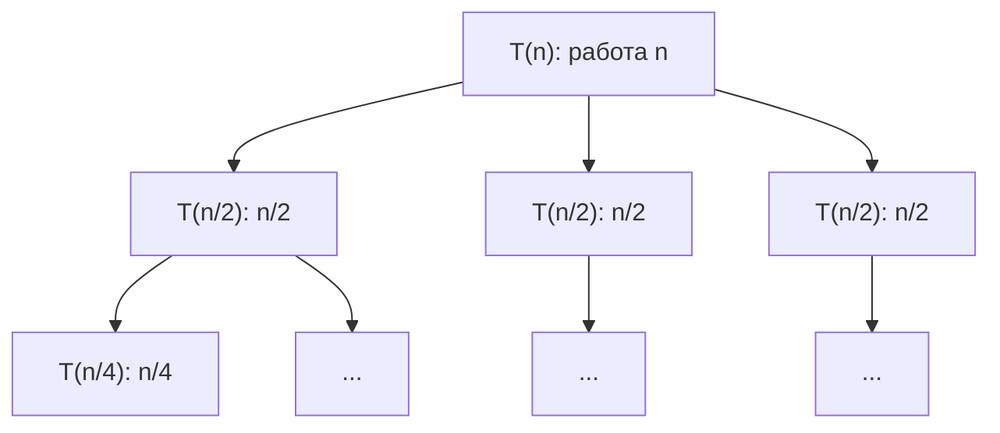

# Урок 02 — От кода к T(n) и к big-O через дерево рекурсии

## Разогрев

- `T(n) = a·T(n/b) + f(n)`: `a` — число вызовов, `b` — во сколько раз меньше вход,
  `f(n)` — работа вне вызовов.
- Критическая функция `n^(log_b a)`; сравниваем с ней `f(n)`.
- Три случая: листья правят (`Θ(n^(log_b a))`), поровну (`·log n`), корень правит (`Θ(f(n))`).
- Метод подстановки: раскрыть до закономерности, остановиться при `n/bᵏ = 1`.

Теория — [`theory-2-recurrences-and-automata.md`](../theory-2-recurrences-and-automata.md).

## Новая тема: рецепт из четырёх шагов

Дан рекурсивный код, нужна сложность. Делаем всегда одно и то же.

1. **Выписать `T(n)` прямо из кода.** Считаем рекурсивные вызовы (это `a`), смотрим, с
   каким аргументом они делаются (`n/b` или `n − 1`), суммируем всю остальную работу
   (`f(n)`). Не забыть базу.
2. **Нарисовать дерево рекурсии.** Сколько узлов на уровне, сколько работы в каждом,
   сколько уровней.
3. **Сложить работу по уровням.** Три возможных сюжета: работа растёт вниз, одинакова,
   убывает вниз.
4. **Проверить master theorem** — если рекуррентность подходящей формы. Ответы должны
   совпасть; если не совпали, ошибка в шаге 1 или 2.

Шаг 2 не пропускать. Именно он не даёт спутать `2T(n/2)` с `T(n/2)`.

## Разобранные примеры

### Пример 1. Три почти одинаковые функции

```go
func a1(n int) int { // один вызов, константная работа
	if n <= 1 {
		return 1
	}
	return 1 + a1(n/2)
}

func a2(n int) int { // два вызова, константная работа
	if n <= 1 {
		return 1
	}
	return a2(n/2) + a2(n/2)
}

func a3(n int) int { // два вызова, линейная работа
	if n <= 1 {
		return 1
	}
	s := 0
	for i := 0; i < n; i++ {
		s++
	}
	return s + a3(n/2) + a3(n/2)
}
```

```text
a1: T(n) = T(n/2) + 1
    дерево: одна цепочка длины log₂ n, по 1 работы     → Θ(log n)

a2: T(n) = 2T(n/2) + 1
    уровень k: 2ᵏ узлов × 1 = 2ᵏ работы
    сумма: 1 + 2 + 4 + ... + n = 2n − 1                → Θ(n)
    работа растёт вниз, правят листья

a3: T(n) = 2T(n/2) + n
    уровень k: 2ᵏ узлов × n/2ᵏ = n работы
    сумма: n на каждом из log₂ n уровней               → Θ(n log n)
    работа распределена поровну
```

Три строчки кода почти неотличимы, а ответы — `log n`, `n` и `n log n`. Дерево рекурсии
показывает разницу мгновенно; интуиция «ну там же деление пополам» — нет.

### Пример 2. Рисуем дерево для T(n) = 3T(n/2) + n



```text
уровень 0:  1 узел    × n      = n
уровень 1:  3 узла    × n/2    = 1.5n
уровень 2:  9 узлов   × n/4    = 2.25n
уровень k:  3ᵏ узлов  × n/2ᵏ   = n·(3/2)ᵏ      — работа РАСТЁТ вниз

число уровней: log₂ n
число листьев: 3^(log₂ n) = n^(log₂ 3) ≈ n^1.585
сумма геометрической прогрессии со знаменателем 3/2 > 1
   определяется последним слагаемым                    → Θ(n^1.585)
```

Проверяем master theorem:

```text
a = 3, b = 2, f(n) = n
критическая функция: n^(log₂3) ≈ n^1.585
f(n) = n растёт МЕДЛЕННЕЕ                              — случай 1
T(n) = Θ(n^(log₂3)) = Θ(n^1.585)                       — совпало ✓
```

Именно эта рекуррентность стоит за алгоритмом Карацубы для умножения длинных чисел:
три умножения половинок вместо четырёх дают `n^1.585` вместо `n²`.

### Пример 3. Когда правит корень

```go
func merge3(a []int) []int {
	if len(a) <= 1 {
		return a
	}
	mid := len(a) / 2
	l, r := merge3(a[:mid]), merge3(a[mid:])
	return expensiveJoin(l, r) // работает за O(n²)
}
```

```text
T(n) = 2T(n/2) + n²

уровень 0:  1 × n²          = n²
уровень 1:  2 × (n/2)²      = n²/2
уровень 2:  4 × (n/4)²      = n²/4
уровень k:  2ᵏ × (n/2ᵏ)²    = n²/2ᵏ            — работа УБЫВАЕТ вниз

сумма: n²·(1 + 1/2 + 1/4 + ...) = n²·2         — геометрическая прогрессия, знаменатель 1/2
T(n) = Θ(n²)                                    — правит корень
```

Master theorem: `n^(log₂2) = n`, `f(n) = n²` растёт быстрее — случай 3, `Θ(n²)`. Совпало.

Практический вывод: если склейка дороже, чем `n^(log_b a)`, оптимизировать рекурсию
бессмысленно — вся стоимость в первом же вызове. Оптимизировать надо `expensiveJoin`.

### Пример 4. Рекуррентность, где master theorem бесполезна

```go
func selectionish(a []int) {
	if len(a) <= 1 {
		return
	}
	for i := range a { // линейный проход
		_ = a[i]
	}
	selectionish(a[1:]) // вход уменьшился на 1, а не в b раз
}
```

```text
T(n) = T(n−1) + n                              — форма не a·T(n/b) + f(n)

разворачиваем:
T(n) = T(n−1) + n
     = T(n−2) + (n−1) + n
     = T(n−3) + (n−2) + (n−1) + n
     = 1 + 2 + ... + n
     = n(n+1)/2                                — формула суммы арифметической прогрессии
T(n) = Θ(n²)
```

Мораль: если вход уменьшается вычитанием, master theorem не применяется вообще — но метод
подстановки работает и даёт ответ за три строчки. Это, кстати, ровно тот случай, что
превращает наивное `s += p` в цикле в `O(n²)`.

### Пример 5. Проверяем себя кодом

Теорию приятно подтверждать счётчиком вызовов:

```go
var calls int

func t(n int) { // моделирует T(n) = 2T(n/2) + n
	calls++
	if n <= 1 {
		return
	}
	t(n / 2)
	t(n / 2)
}

func main() {
	for _, n := range []int{1024, 2048, 4096} {
		calls = 0
		t(n)
		fmt.Printf("n=%-6d calls=%d\n", n, calls)
	}
	// calls растёт линейно по n: 2047, 4095, 8191 — это Θ(n) вызовов,
	// а суммарная работа с учётом «+n» на каждом уровне даёт Θ(n log n)
}
```

Полезная привычка: замерить время на `n`, `2n`, `4n` и посмотреть на отношения. Для
`Θ(n log n)` отношение чуть больше 2, для `Θ(n²)` — около 4, для `Θ(n^1.585)` — около 3.

## Mini-drill

```drill
type: fill-in
prompt: "Функция делает один рекурсивный вызов на трети входа и линейный проход: T(n) = T(n/3) + n. Какая сложность? Ответ в виде Θ(...)."
answer: "Θ(n) | Theta(n)"
check: fuzzy
hint: "Критическая функция n^(log₃1) = 1, f(n) = n растёт быстрее — случай 3."
```

```drill
type: fill-in
prompt: "Сколько листьев у дерева рекурсии для T(n) = 3T(n/2) + n при n = 1024? Ответ в виде числа, округлите до целого."
answer: "59049"
check: fuzzy
hint: "Листьев 3^(log₂ n); при n = 1024 это 3¹⁰."
```

```drill
type: multiple-choice
prompt: "Замеры дали время 1 с при n = 10⁵ и 4 с при n = 2·10⁵. Какая сложность вероятнее всего?"
options: ["Θ(n)", "Θ(n log n)", "Θ(n²)", "Θ(log n)"]
answer: "Θ(n²)"
check: exact
hint: Удвоение входа увеличило время вчетверо.
```

```drill
type: free-form
prompt: "Возьмите T(n) = 4T(n/2) + n². Нарисуйте словами дерево рекурсии, посчитайте работу на уровне k, определите, где сосредоточена работа, и назовите ответ. Проверьте master theorem."
answer: "На уровне k находится 4ᵏ узлов размера n/2ᵏ, работа в каждом (n/2ᵏ)² = n²/4ᵏ, итого на уровне 4ᵏ · n²/4ᵏ = n². Работа одинакова на всех уровнях, уровней log₂ n, значит T(n) = Θ(n² log n). Master theorem: критическая функция n^(log₂4) = n², f(n) = n² совпадает с ней — случай 2, Θ(n² log n). Совпало."
check: manual
```

## Итог

Рецепт неизменен: выписать `T(n)` из кода, нарисовать дерево, сложить по уровням,
сверить с master theorem. Дерево отвечает на главный вопрос — **где сосредоточена
работа**: если она растёт вниз, ответ определяют листья (`Θ(n^(log_b a))`); если
одинакова на всех уровнях, добавляется множитель `log n`; если убывает, всё решает
корень (`Θ(f(n))`). А если вход уменьшается вычитанием, а не делением, master theorem
молчит, но метод подстановки по-прежнему работает.

Следующий шаг — [`lessons/03-designing-a-state-machine.md`](./03-designing-a-state-machine.md).
