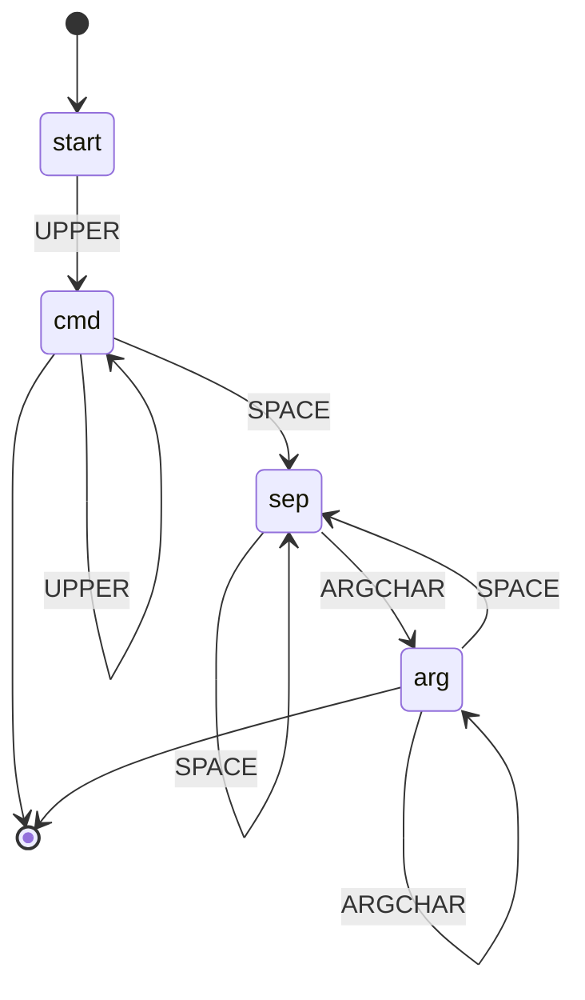

# Урок 03 — Проектируем конечный автомат и превращаем его в switch на Go

## Разогрев

- `M = (Q, Σ, δ, q₀, F)` — состояния, алфавит, переходы, старт, принимающие.
- Автомат помнит **только текущее состояние**: `O(1)` памяти, один проход по входу.
- Регулярные выражения = конечные автоматы; вложенные скобки им не по силам.
- Отсутствие перехода — это отказ, а не «ничего не произошло».

Теория — [`theory-2-recurrences-and-automata.md`](../theory-2-recurrences-and-automata.md).

## Новая тема: пять шагов от требований к коду

Автомат проектируется всегда одинаково.

1. **Выписать алфавит `Σ`** — какие бывают входные события. Для лексера это классы
   символов (цифра, буква, пробел, знак), для протокола — команды и сообщения.
2. **Придумать состояния `Q`.** Правило: состояние должно отвечать на вопрос «что я уже
   прочитал и что мне теперь можно». Если для решения нужен счётчик — конечный автомат не
   подходит, нужен стек.
3. **Заполнить таблицу переходов `δ`.** Строки — состояния, столбцы — символы. Пустая
   клетка = ошибка. Таблица — лучший инструмент, чем стрелки: сразу видно дыры.
4. **Отметить принимающие состояния `F`.** Это то, что отличает «12.5» от «12.».
5. **Перевести в код.** `switch` по паре (состояние, символ) — прямой перевод таблицы.

Разберём на протоколе построчной команды — упрощённом варианте того, что делают SMTP и
Redis.

## Разобранные примеры

### Пример 1. Алфавит и состояния для парсера команды

Задача: разобрать строку вида `SET key value`, где команда — буквы в верхнем регистре,
дальше через один или несколько пробелов идут аргументы.

```text
Σ (классы символов):  UPPER (A-Z), LOWER/DIGIT (аргументные символы), SPACE, прочее

Q:
  start   — ничего не прочитано
  cmd     — читаем имя команды
  sep     — прочитали пробел(ы), ждём аргумент
  arg     — читаем аргумент
  err     — ошибка (поглощающее состояние)

F = {cmd, arg}   — команда без аргументов допустима, «SET » с висящим пробелом — нет
```

Таблица переходов:

```text
            UPPER    ARGCHAR   SPACE    прочее
start       cmd      err       err      err
cmd         cmd      err       sep      err
sep         arg      arg       sep      err
arg         arg      arg       sep      err
err         err      err       err      err
```

Читаем таблицу глазами и сразу видим два проектных решения. Первое: из `start` по
пробелу — ошибка, значит ведущие пробелы запрещены. Второе: `sep → sep` по пробелу,
значит несколько пробелов подряд допустимы, как и требовалось.



### Пример 2. Прогоны

```text
вход «SET k1 v2»:
start --S--> cmd --E--> cmd --T--> cmd --␣--> sep --k--> arg --1--> arg
      --␣--> sep --v--> arg --2--> arg
arg ∈ F  ⇒ принято ✓

вход «SET »:
start --S--> cmd --E--> cmd --T--> cmd --␣--> sep
sep ∉ F  ⇒ отвергнуто ✓   (висящий пробел без аргумента)

вход « SET»:
start --␣--> err
err ∉ F  ⇒ отвергнуто ✓   (ведущий пробел)

вход «Set»:
start --S--> cmd --e--> err
⇒ отвергнуто ✓            (команда должна быть в верхнем регистре)
```

### Пример 3. Таблица превращается в код

```go
type state uint8

const (
	stStart state = iota
	stCmd
	stSep
	stArg
	stErr
)

type class uint8

const (
	clUpper class = iota
	clArg
	clSpace
	clOther
)

func classify(r rune) class {
	switch {
	case r >= 'A' && r <= 'Z':
		return clUpper
	case r >= 'a' && r <= 'z', r >= '0' && r <= '9', r == '_', r == '-':
		return clArg
	case r == ' ':
		return clSpace
	default:
		return clOther
	}
}

// transitions — таблица δ из проекта: строка это состояние, столбец это класс символа.
var transitions = [5][4]state{
	//        UPPER    ARGCHAR  SPACE    OTHER
	stStart: {stCmd, stErr, stErr, stErr},
	stCmd:   {stCmd, stErr, stSep, stErr},
	stSep:   {stArg, stArg, stSep, stErr},
	stArg:   {stArg, stArg, stSep, stErr},
	stErr:   {stErr, stErr, stErr, stErr},
}

func ValidCommand(s string) bool {
	st := stStart
	for _, r := range s {
		st = transitions[st][classify(r)] // один переход на символ
		if st == stErr {
			return false // поглощающее состояние — дальше можно не читать
		}
	}
	return st == stCmd || st == stArg // принимающие состояния
}
```

Обратите внимание: логика решения полностью вынесена в **данные**. Изменить правила —
значит поменять одну строку таблицы, а не искать `if` по всему файлу. И проверить
полноту таблицы можно взглядом: в ней ровно `|Q| × |Σ|` клеток, дыр быть не может.

Альтернативная запись через `switch` уместна, когда переходов немного и они читаются как
проза:

```go
func next(st state, c class) state {
	switch st {
	case stStart:
		if c == clUpper {
			return stCmd
		}
	case stCmd:
		switch c {
		case clUpper:
			return stCmd
		case clSpace:
			return stSep
		}
	case stSep, stArg:
		switch c {
		case clUpper, clArg:
			return stArg
		case clSpace:
			return stSep
		}
	}
	return stErr // всё, что не описано явно, — ошибка
}
```

### Пример 4. Где автомата не хватит

Расширим требования: «аргумент может быть строкой в кавычках, а внутри строки могут быть
вложенные фигурные скобки любой глубины, и их надо проверить на сбалансированность».

```text
кавычки        → это ещё автомат: добавляем состояния inString и escaped
вложенность    → это уже НЕ автомат
```

Причина ровно та, что в теории: глубина вложенности неограничена, а состояний конечное
число. Как только требуется «помнить, сколько скобок открыто», добавляйте счётчик или
стек — получится **автомат с магазинной памятью**, и он уже вне класса регулярных языков.
Практический признак в требованиях: слова «вложенный», «сбалансированный», «любой
глубины».

Строки в кавычках, наоборот, автоматом описываются прекрасно — там нужно помнить всего
два бита: «я внутри строки» и «предыдущий символ был обратным слешем».

## Mini-drill

```drill
type: fill-in
prompt: "По таблице переходов из примера 1: в каком состоянии окажется автомат после входа «GET  x»? Напишите имя состояния."
answer: "arg"
check: fuzzy
hint: Два пробела подряд оставляют автомат в sep.
```

```drill
type: multiple-choice
prompt: "Почему в примере 1 состояние sep не является принимающим?"
options: ["Чтобы запретить команды без аргументов", "Чтобы отвергнуть строку с висящим пробелом в конце", "Чтобы разрешить несколько пробелов подряд", "Это ошибка проектирования"]
answer: "Чтобы отвергнуть строку с висящим пробелом в конце"
check: exact
```

```drill
type: fill-in
prompt: "Сколько клеток должно быть в полной таблице переходов для 5 состояний и 4 классов символов? Целое число."
answer: "20"
check: exact
hint: "|Q| × |Σ|"
```

```drill
type: free-form
prompt: "Спроектируйте автомат для состояний circuit breaker (closed, open, half-open). Перечислите события, все переходы и объясните, какое состояние здесь принимающее и почему вопрос «принимающее» тут звучит иначе, чем для парсера."
answer: "События: success, failure, порог failures превышен, истёк таймаут ожидания, пробный запрос. Переходы: closed + превышен порог ошибок → open; open + истёк таймаут → half-open; half-open + success пробного запроса → closed; half-open + failure → open; closed + success → closed. Для парсера принимающее состояние означает «вход корректен и закончился», а здесь автомат работает бесконечно и принимающих состояний нет — важна не приёмка строки, а само текущее состояние и множество разрешённых переходов. Это тот же формализм, использованный как модель поведения, а не как распознаватель языка."
check: manual
```

## Итог

Проектирование автомата — это пять шагов: алфавит, состояния, таблица переходов,
принимающие состояния, код. Таблица переходов лучше россыпи `if`: она полна по
построению (`|Q| × |Σ|` клеток), читается глазами и меняется в одном месте. Отсутствие
перехода — это отказ, и явное поглощающее состояние `err` делает это видимым. Главное
ограничение помните всегда: автомат помнит только состояние, поэтому «вложенный»,
«сбалансированный» и «любой глубины» в требованиях означают, что нужен стек, а не
регулярка.

На этом модуль и весь курс закончены. Дальше математика перестаёт быть отдельной темой и
становится инструментом: в графах вы видите зависимости, в рекурсии — `T(n)`, в статусах
заказа — автомат, а в формуле из статьи — то, что можно проверить двадцатью строчками
кода.
