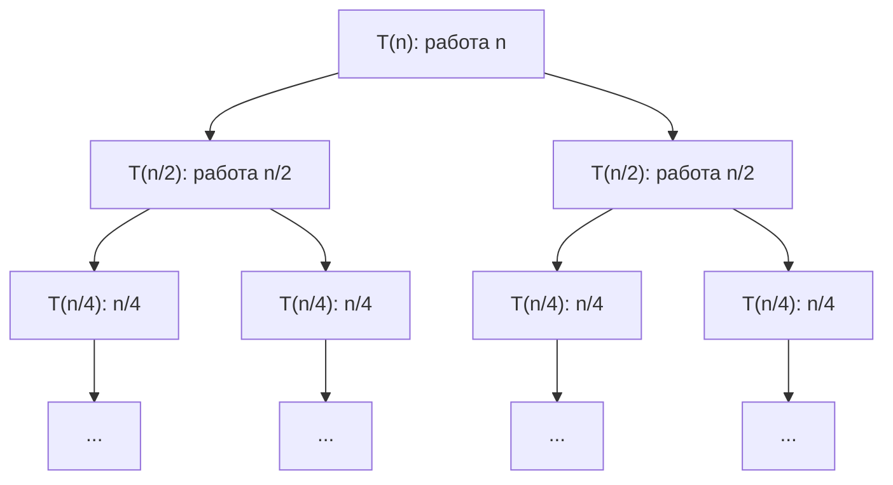
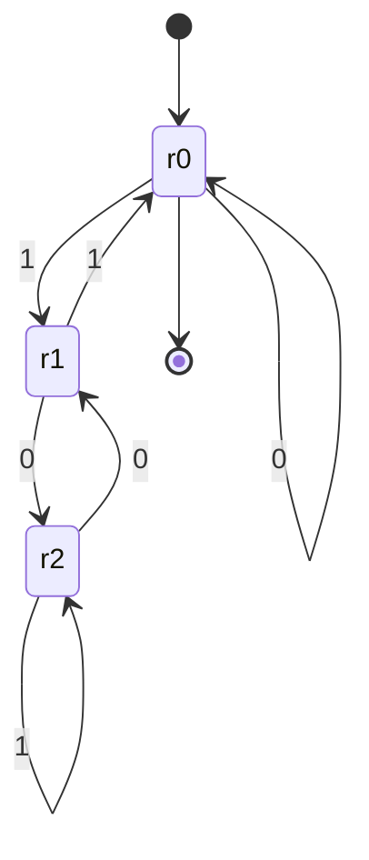
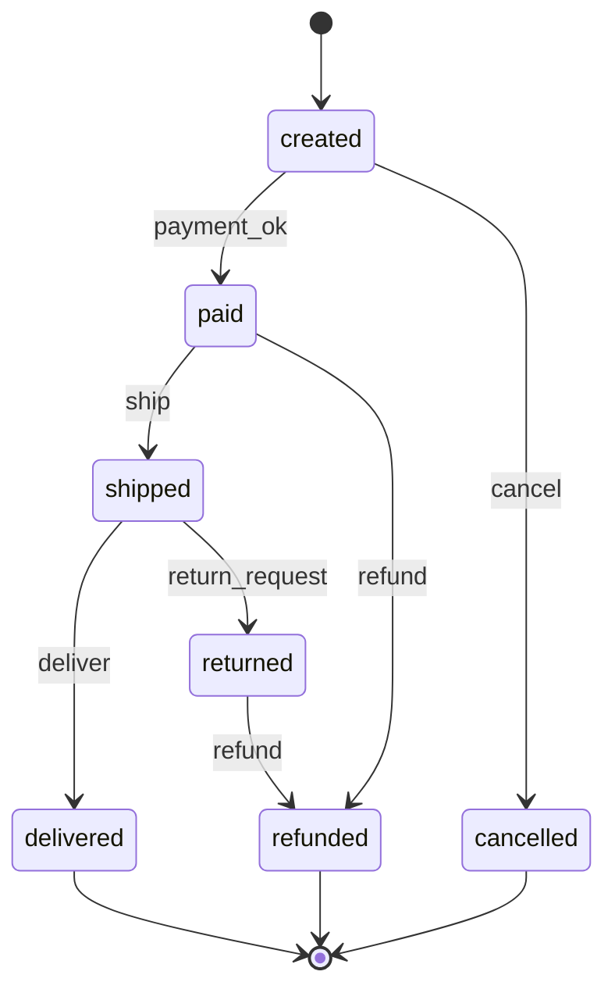

# Рекуррентности, индукция и конечные автоматы

Вторая часть модуля. Первая — [`theory.md`](./theory.md) (графы).

## Вспоминаем школу

**Последовательность, заданная рекуррентно.** В школе это была арифметическая прогрессия:
«каждый следующий член равен предыдущему плюс `d`».

```text
a₁ = 5
aₙ = aₙ₋₁ + 3        — рекуррентная форма: «через предыдущий»
aₙ = 5 + 3(n − 1)    — явная (закрытая) форма: «сразу через n»
```

Вся тема рекуррентностей — про переход от первой формы ко второй. Программист пишет
рекуррентную (это же просто рекурсия!), а знать хочет закрытую — чтобы понимать
сложность.

**Индукция** — школьный «принцип домино»: если первая костяшка падает и каждая роняет
следующую, упадут все. Формально в
[`03-logic-and-proofs`](../03-logic-and-proofs/theory.md).

**Автоматы** в школе тоже были — под именем «блок-схема» или «граф состояний». Кружочки
и стрелки с подписями.

## Зачем программисту

- **Рекуррентности** — единственный честный способ оценить сложность рекурсивной
  функции. «Merge sort это n log n» — не заклинание, а результат решения `T(n) = 2T(n/2) + n`.
- **Индукция** — способ убедиться, что рекурсивная функция правильная, не прогоняя её на
  всех входах. И тот же приём в виде **инварианта цикла** работает для итеративного кода.
- **Конечные автоматы** — это статусы заказа, состояния TCP-соединения, парсеры, лексеры,
  протоколы, circuit breaker, workflow-движки. Любое «из состояния X по событию E
  переходим в Y» — автомат, и рисовать его полезнее, чем писать пятиэтажный `if`.
- **Регулярные выражения** — это автоматы. Понимание границ regex экономит часы: почему
  им нельзя распарсить HTML и почему `(a+)+b` вешает сервис.

## Простыми словами

### Рекуррентность

Рекуррентное соотношение — это «стоимость задачи размера `n` через стоимость задач
меньшего размера». Читается прямо из кода:

```go
func mergeSort(a []int) []int {
	if len(a) <= 1 {
		return a // база рекурсии: T(1) = константа
	}
	mid := len(a) / 2
	left := mergeSort(a[:mid])  // T(n/2)
	right := mergeSort(a[mid:]) // ещё T(n/2)
	return merge(left, right)   // слияние обходит все n элементов: + n
}
```

```text
T(n) = 2·T(n/2) + n        — два вызова на половине + линейное слияние
T(1) = 1                   — база
```

Дальше есть три способа получить из этого `Θ(...)`: развернуть, нарисовать дерево или
применить готовую теорему.

### Автомат

Конечный автомат — это машина с **фиксированным набором состояний**, которая читает вход
символ за символом и по каждому символу переходит из состояния в состояние. Никакой
памяти, кроме текущего состояния, у неё нет. Это ограничение — не недостаток, а
источник силы: автомат работает за один проход, за `O(длины входа)`, с константной
памятью.

## Точнее

### Способ 1. Развернуть (метод подстановки)

Подставляем формулу саму в себя, пока не увидим закономерность.

```text
T(n) = 2T(n/2) + n                             — исходное
     = 2[2T(n/4) + n/2] + n                    — подставили T(n/2)
     = 4T(n/4) + n + n = 4T(n/4) + 2n          — раскрыли и собрали
     = 4[2T(n/8) + n/4] + 2n
     = 8T(n/8) + 3n                            — видна закономерность
     = 2ᵏ·T(n/2ᵏ) + k·n                        — обобщили на k шагов
```

Рекурсия кончается при `n/2ᵏ = 1`, то есть `2ᵏ = n`, `k = log₂ n`:

```text
T(n) = n·T(1) + n·log₂ n                       — подставили k
     = n + n·log₂ n
     = Θ(n log n)                              — главный член
```

Тот же приём для бинарного поиска:

```text
T(n) = T(n/2) + 1
     = T(n/4) + 1 + 1
     = T(n/2ᵏ) + k
при 2ᵏ = n:  T(n) = T(1) + log₂ n = Θ(log n)
```

### Способ 2. Дерево рекурсии

Рисуем, сколько работы на каждом уровне, и складываем по уровням.



```text
уровень 0:  1 задача  × n     = n
уровень 1:  2 задачи  × n/2   = n
уровень 2:  4 задачи  × n/4   = n
...
уровень k:  2ᵏ задач  × n/2ᵏ  = n           — на каждом уровне ровно n работы
число уровней: log₂ n
итого: n · log₂ n = Θ(n log n)
```

Дерево рекурсии полезнее формул, потому что сразу видно, **где сосредоточена работа**:
равномерно по уровням (`n log n`), в корне (`Θ(f(n))`) или в листьях.

### Способ 3. Master theorem, интуитивно

Общий вид: задача делится на `a` подзадач размера `n/b`, плюс работа `f(n)` на склейку.

```text
T(n) = a·T(n/b) + f(n),   a ≥ 1, b > 1
```

Всё решается сравнением `f(n)` с **критической функцией** `n^(log_b a)` — это «сколько
работы в листьях». Логика простая: кто больше, тот и определяет ответ.

```text
случай 1: f(n) растёт МЕДЛЕННЕЕ n^(log_b a)   ⇒ T(n) = Θ(n^(log_b a))     — правят листья
случай 2: f(n) растёт КАК n^(log_b a)          ⇒ T(n) = Θ(n^(log_b a)·log n) — все уровни равны
случай 3: f(n) растёт БЫСТРЕЕ n^(log_b a)      ⇒ T(n) = Θ(f(n))            — правит корень
```

Картинками:

```text
случай 1 (работа копится внизу)   случай 2 (поровну)      случай 3 (всё наверху)
  ▁                                  ▄                        █
  ▂                                  ▄                        ▃
  ▄                                  ▄                        ▂
  █                                  ▄                        ▁
```

Три примера подряд:

```text
Merge sort:      a=2, b=2, f(n)=n
  n^(log₂2) = n¹ = n,  f(n) = n → одинаково → случай 2
  T(n) = Θ(n log n)

Бинарный поиск:  a=1, b=2, f(n)=1
  n^(log₂1) = n⁰ = 1,  f(n) = 1 → одинаково → случай 2
  T(n) = Θ(log n)

Алгоритм Штрассена (умножение матриц): a=7, b=2, f(n)=n²
  log₂7 ≈ 2.807,  n^2.807 растёт быстрее n² → случай 1
  T(n) = Θ(n^2.807)                      — быстрее наивного Θ(n³)
```

Мелкий шрифт: в случае 1 и 3 «медленнее/быстрее» означает «в `n^ε` раз для некоторого
`ε > 0`», а в случае 3 нужна дополнительная **условие регулярности** `a·f(n/b) ≤ c·f(n)`.
На практике она выполняется почти всегда; если рекуррентность в неё не влезает (например,
`T(n) = 2T(n/2) + n log n`), возвращайтесь к дереву рекурсии.

### Fibonacci: когда рекурсия — ловушка

```text
F(0) = 0, F(1) = 1
F(n) = F(n−1) + F(n−2)
```

Наивная рекурсия даёт `T(n) = T(n−1) + T(n−2) + 1`, а это сама последовательность
Фибоначчи — она растёт как `φⁿ`, где `φ = (1 + √5)/2 ≈ 1.618` («золотое сечение»). То есть
`Θ(1.618ⁿ)`: при `n = 50` это уже 10¹⁰ вызовов.

Закрытая форма (формула Бине) существует:

```text
F(n) = (φⁿ − ψⁿ)/√5,   φ = (1+√5)/2 ≈ 1.618,  ψ = (1−√5)/2 ≈ −0.618
```

Поскольку `|ψ| < 1`, второе слагаемое быстро становится ничтожным, и `F(n) ≈ φⁿ/√5`
(округлённое до ближайшего целого — точный ответ). Формула красива, но на больших `n`
страдает от погрешности float64; в коде надёжнее итерация.

**Мемоизация против математики.** Кеширование результатов превращает `Θ(φⁿ)` в `Θ(n)`:
каждое `F(k)` считается один раз. Это общий принцип — если дерево рекурсии содержит
повторяющиеся подзадачи, мемоизация схлопывает его в DAG (граф из
[`theory.md`](./theory.md)), и число вычислений падает до числа различных подзадач.

### Рекурсия ↔ индукция

Это одно и то же, увиденное с двух сторон. Рекурсия сводит задачу к меньшей; индукция
доказывает утверждение для `n`, опираясь на `n − 1`.

Докажем корректность функции:

```go
func sum(n int) int {
	if n == 0 {
		return 0
	}
	return n + sum(n-1)
}
```

Утверждение: `sum(n) = n(n+1)/2` для всех `n ≥ 0`.

```text
База: n = 0
  sum(0) = 0 по коду
  формула: 0·1/2 = 0                        — совпало

Шаг: предположим, sum(k) = k(k+1)/2 верно для некоторого k ≥ 0
  sum(k+1) = (k+1) + sum(k)                 — по коду
           = (k+1) + k(k+1)/2               — подставили предположение
           = (k+1)·(1 + k/2)                — вынесли (k+1)
           = (k+1)·(2 + k)/2                — привели к общему знаменателю
           = (k+1)(k+2)/2                   — это формула при n = k+1  ✓

Вывод: по принципу индукции формула верна для всех n ≥ 0.
```

Три обязательных элемента любой рекурсии, которые видны из этого доказательства:
**база** (иначе нет первой костяшки), **шаг к меньшему** (иначе домино не движется) и
**корректная склейка** результата.

**Инвариант цикла** — тот же приём для итеративного кода: утверждение, истинное перед
каждой итерацией.

```go
func sumIter(n int) int {
	total, i := 0, 1
	// инвариант: перед каждой итерацией total = 1 + 2 + ... + (i−1)
	for ; i <= n; i++ {
		total += i
	}
	// при выходе i = n+1, значит total = 1 + ... + n
	return total
}
```

Схема доказательства через инвариант всегда одна: он верен **до** цикла, сохраняется
итерацией, и **после** цикла вместе с условием выхода даёт нужный результат.

### Конечные автоматы

**DFA** (детерминированный конечный автомат) — пятёрка:

```text
M = (Q, Σ, δ, q₀, F)
Q  — конечное множество состояний
Σ  — алфавит (какие символы бывают на входе)
δ  — функция переходов: δ(состояние, символ) = новое состояние
q₀ — начальное состояние
F  — множество принимающих (accept) состояний, F ⊆ Q
```

Автомат читает вход слева направо, на каждом символе применяет `δ`. Если после
последнего символа он оказался в состоянии из `F` — строка **принята**.

Пример: автомат, принимающий двоичные числа, кратные 3. Состояние — остаток от деления
на 3 того, что прочитано. Дописать бит `b` справа — это `остаток ← (2·остаток + b) mod 3`
(модульная арифметика из
[`05-number-theory-and-binary`](../05-number-theory-and-binary/theory.md)).



Три состояния — и мы умеем проверять делимость строки любой длины на 3, не имея ни
счётчика, ни большого числа. Вот в этом и смысл автоматов: **конечная память при
бесконечном входе**.

**DFA против NFA.** В *недетерминированном* автомате (NFA) из состояния по одному символу
может вести несколько стрелок (или ни одной), а ещё бывают ε-переходы «просто так».
NFA принимает строку, если существует **хоть какой-то** путь, ведущий в принимающее
состояние. Практический факт, который стоит запомнить:

> Любой NFA можно превратить в DFA (конструкция подмножеств), поэтому они распознают
> ровно один и тот же класс языков — **регулярные языки**. Платой может быть взрывной
> рост числа состояний: `k` состояний NFA → до `2ᵏ` состояний DFA.

**Регулярные выражения — это автоматы.** Любая regex переводится в NFA (конструкция
Томпсона), NFA — в DFA. Отсюда следуют две вещи.

*Первая: почему regex не умеет считать скобки.* Чтобы распознать язык «сколько открывающих,
столько же закрывающих» — `(((...)))` любой глубины — нужно помнить текущую глубину, то
есть иметь бесконечно много состояний. У конечного автомата их ровно `k`. Значит, для
достаточно глубокой вложенности две разные глубины неизбежно попадут в одно и то же
состояние — и автомат перестанет их различать, приняв неправильную строку. Это же
рассуждение объясняет, почему regex не парсит HTML и почему для вложенных структур нужен
парсер со стеком.

*Вторая: катастрофический backtracking.* Движки regex в PCRE, Java, Python и JavaScript
не строят DFA, а перебирают варианты NFA с откатами. На шаблоне вроде `(a+)+b` и входе
из тридцати `a` без `b` число вариантов разбиения экспоненциально — сервис зависает
(атака ReDoS). Движок Go (`regexp`, на базе RE2) устроен иначе — он гарантирует линейное
время, но за это не поддерживает обратные ссылки.

### Автоматы в бэкенде

Статусы заказа — классический автомат, и рисунок сразу отвечает на вопросы «можно ли
отменить оплаченный заказ» и «куда из refunded».



Что даёт явная модель: переходы, которых нет на схеме, **запрещены** — и это проверяется
одной таблицей вместо разбросанных по коду `if`. Плюс легко ответить на аудиторские
вопросы («как заказ мог стать shipped, минуя paid?» — никак, такого ребра нет).

Тот же приём в стандартах: состояния TCP (`LISTEN`, `SYN_SENT`, `SYN_RECEIVED`,
`ESTABLISHED`, `FIN_WAIT_1`, `TIME_WAIT`, `CLOSED`) описаны в RFC 793 именно как диаграмма
состояний. И circuit breaker — три состояния `closed → open → half-open`.

## Разобранные примеры

### Пример 1. От кода к рекуррентности и обратно

```go
func f(n int) int {
	if n <= 1 {
		return 1
	}
	s := 0
	for i := 0; i < n; i++ { // линейный проход: + n
		s += i
	}
	return s + f(n/2) + f(n/2) // два вызова на половине
}
```

```text
T(n) = 2T(n/2) + n              — прочитали прямо из кода
a = 2, b = 2, f(n) = n          — параметры master theorem
n^(log₂2) = n                   — критическая функция
f(n) = n = критическая          — случай 2
T(n) = Θ(n log n)
```

### Пример 2. Когда правит корень

```go
func g(n int) int {
	if n <= 1 {
		return 1
	}
	s := 0
	for i := 0; i < n*n; i++ { // квадратичная работа на склейку
		s++
	}
	return s + g(n/2) + g(n/2)
}
```

```text
T(n) = 2T(n/2) + n²
a = 2, b = 2, f(n) = n²
n^(log₂2) = n
n² растёт быстрее n              — случай 3
проверка регулярности: 2·(n/2)² = n²/2 ≤ c·n² при c = 1/2 < 1  ✓
T(n) = Θ(n²)
```

Интуиция: половина всей работы делается в самом первом вызове, и сумма по уровням —
`n² + n²/2 + n²/4 + ... = 2n²` — геометрическая прогрессия, сходящаяся к константе,
умноженной на корень.

### Пример 3. Индукция для рекурсивной функции

Докажем, что `power(x, n)` возводит в степень правильно.

```go
func power(x float64, n int) float64 {
	if n == 0 {
		return 1
	}
	half := power(x, n/2)  // целочисленное деление
	if n%2 == 0 {
		return half * half
	}
	return half * half * x
}
```

```text
База: n = 0 → возвращаем 1 = x⁰                     ✓

Шаг (сильная индукция): пусть power(x, k) = xᵏ для всех k < n.
  Случай n чётное, n = 2t:
    half = power(x, t) = xᵗ                          — по предположению, t < n
    результат = xᵗ · xᵗ = x²ᵗ = xⁿ                   ✓
  Случай n нечётное, n = 2t + 1:
    n/2 = t (целочисленное деление отбрасывает 0.5)
    half = xᵗ
    результат = xᵗ · xᵗ · x = x²ᵗ⁺¹ = xⁿ             ✓

Сложность: T(n) = T(n/2) + 1 = Θ(log n)             — по методу подстановки
```

Обратите внимание: доказательство разобрало **оба** случая чётности — именно там и живут
типичные ошибки в таких функциях.

### Пример 4. Проектируем автомат для токена

Задача: распознать простой числовой литерал вида `12`, `12.5`, но не `12.` и не `.5`.

```text
состояния: start, int, dot, frac
δ(start, цифра) = int
δ(int,   цифра) = int
δ(int,   '.')   = dot
δ(dot,   цифра) = frac
δ(frac,  цифра) = frac
принимающие: {int, frac}     — dot не принимающее, поэтому «12.» отвергается
start не принимающее          — поэтому пустая строка и «.5» отвергаются
```

Прогон на входе `12.5`:

```text
start --1--> int --2--> int --.--> dot --5--> frac
frac ∈ F  ⇒  строка принята  ✓
```

Прогон на входе `12.`:

```text
start --1--> int --2--> int --.--> dot
dot ∉ F  ⇒  строка отвергнута  ✓
```

## В коде

Автомат из примера 4 — прямой перевод таблицы переходов в `switch`:

```go
type state int

const (
	stStart state = iota
	stInt
	stDot
	stFrac
	stErr
)

func isNumber(s string) bool {
	st := stStart
	for _, r := range s {
		digit := r >= '0' && r <= '9'
		switch { // одна ветка на каждую стрелку диаграммы
		case st == stStart && digit:
			st = stInt
		case st == stInt && digit:
			st = stInt
		case st == stInt && r == '.':
			st = stDot
		case st == stDot && digit:
			st = stFrac
		case st == stFrac && digit:
			st = stFrac
		default:
			return false // перехода нет — строка невалидна
		}
	}
	return st == stInt || st == stFrac // принимающие состояния
}
```

Таблица разрешённых переходов для статусов заказа — тот же автомат, но данными:

```go
var allowed = map[string]map[string]bool{
	"created":  {"paid": true, "cancelled": true},
	"paid":     {"shipped": true, "refunded": true},
	"shipped":  {"delivered": true, "returned": true},
	"returned": {"refunded": true},
}

func Transition(from, to string) error {
	if !allowed[from][to] {
		return fmt.Errorf("order: transition %s -> %s is not allowed", from, to)
	}
	return nil
}
```

Мемоизация как способ схлопнуть дерево рекурсии в DAG:

```go
func fib(n int, memo map[int]int) int {
	if n < 2 {
		return n
	}
	if v, ok := memo[n]; ok {
		return v // подзадача уже решена — Θ(φⁿ) превращается в Θ(n)
	}
	v := fib(n-1, memo) + fib(n-2, memo)
	memo[n] = v
	return v
}
```

## Типичные ошибки

- **Забыть базу рекурсии** или сделать её недостижимой (`n/2` при отрицательном `n`).
  Индукция без базы — домино без первой костяшки.
- **Считать, что `T(n) = 2T(n/2) + n` это `O(n)`.** Работа на уровне действительно `n`,
  но уровней `log n`. Дерево рекурсии не даёт ошибиться.
- **Применять master theorem не глядя.** Она работает только для формы `a·T(n/b) + f(n)`
  с одинаковыми подзадачами. Для `T(n) = T(n−1) + n` (это `Θ(n²)`) она неприменима.
- **Путать `T(n) = T(n/2) + 1` и `T(n) = 2T(n/2) + 1`.** Первое — `Θ(log n)`, второе —
  `Θ(n)`. Разница в одном символе, разница в ответе — колоссальная.
- **Мемоизировать функцию с побочными эффектами.** Кеш корректен только для чистых
  функций от своих аргументов.
- **Пытаться регуляркой разобрать вложенные структуры.** Скобки, HTML, JSON — не
  регулярные языки, конечной памяти не хватит принципиально.
- **Писать `(a+)+`-подобные шаблоны в движке с backtracking.** Классическая ReDoS. В Go
  этой проблемы нет (RE2), но если regex пришёл от пользователя в Java/Node — есть.
- **Реализовывать state machine россыпью `if` по всему коду.** Через полгода никто не
  сможет ответить, какие переходы вообще возможны. Таблица переходов + диаграмма.

## Шпаргалка формул

| Что | Формула |
|-----|---------|
| Merge sort | `T(n) = 2T(n/2) + n = Θ(n log n)` |
| Бинарный поиск | `T(n) = T(n/2) + 1 = Θ(log n)` |
| Линейная рекурсия | `T(n) = T(n−1) + n = Θ(n²)` |
| Половинное деление без слияния | `T(n) = 2T(n/2) + 1 = Θ(n)` |
| Общий вид | `T(n) = a·T(n/b) + f(n)` |
| Критическая функция | `n^(log_b a)` |
| Master, случай 1 | `f` меньше критической → `Θ(n^(log_b a))` |
| Master, случай 2 | `f` равна критической → `Θ(n^(log_b a)·log n)` |
| Master, случай 3 | `f` больше критической (+ регулярность) → `Θ(f(n))` |
| Наивный Фибоначчи | `Θ(φⁿ)`, `φ = (1+√5)/2 ≈ 1.618` |
| Формула Бине | `F(n) = (φⁿ − ψⁿ)/√5`, `ψ = (1−√5)/2` |
| Индукция | база + шаг `P(k) ⇒ P(k+1)` |
| DFA | `M = (Q, Σ, δ, q₀, F)` |
| NFA → DFA | до `2ᵏ` состояний (конструкция подмножеств) |
| Обход графа | `O(n + m)` |

## Словарь терминов

- **Рекуррентное соотношение** — формула, выражающая член через предыдущие.
- **Закрытая (явная) форма** — формула, дающая ответ сразу через `n`.
- **Метод подстановки (unrolling)** — раскрытие рекуррентности до видимой закономерности.
- **Дерево рекурсии** — картинка вызовов; сумма работы по уровням даёт ответ.
- **Master theorem** — готовое решение для `T(n) = a·T(n/b) + f(n)`.
- **Критическая функция** — `n^(log_b a)`, «работа в листьях».
- **Мемоизация** — кеширование результатов подзадач; схлопывает дерево рекурсии в DAG.
- **Индукция** — доказательство «база + переход»; зеркало рекурсии.
- **Инвариант цикла** — утверждение, истинное перед каждой итерацией.
- **Конечный автомат (DFA)** — машина с конечным числом состояний и функцией переходов.
- **NFA** — недетерминированный автомат; принимает, если существует хоть один путь.
- **Принимающее (accept) состояние** — состояние, в котором вход считается правильным.
- **Регулярный язык** — язык, распознаваемый конечным автоматом; ровно то, что выражают
  «настоящие» регулярные выражения.
- **ReDoS** — отказ в обслуживании из-за экспоненциального backtracking в regex-движке.

## См. также

- [`theory.md`](./theory.md) — графы, DAG, деревья, обходы.
- [`03-logic-and-proofs`](../03-logic-and-proofs/theory.md) — индукция и техники
  доказательств.
- [`09-growth-and-calculus-intuition`](../09-growth-and-calculus-intuition/theory.md) —
  big-O, логарифмы, иерархия роста.
- [`05-number-theory-and-binary`](../05-number-theory-and-binary/theory.md) — модульная
  арифметика (автомат делимости на 3).
- Lehman, Leighton, Meyer. **Mathematics for Computer Science** (MIT 6.042), главы
  «Induction» и «Recurrences».
- Graham, Knuth, Patashnik. **Concrete Mathematics**, гл. 1–2 — рекуррентности и суммы,
  в том числе числа Фибоначчи и формула Бине.
- Rosen. **Discrete Mathematics and Its Applications**, глава 8 (Advanced Counting
  Techniques) — решение рекуррентностей; глава 13 — автоматы и регулярные языки.
- Russ Cox. **Regular Expression Matching Can Be Simple And Fast** (swtch.com/~rsc/regexp/)
  — почему RE2 линеен, а PCRE может взорваться.
- **Go pkg docs** — pkg.go.dev/regexp, раздел о синтаксисе и об отсутствии обратных ссылок.
- RFC 793 — диаграмма состояний TCP как пример промышленного автомата.
