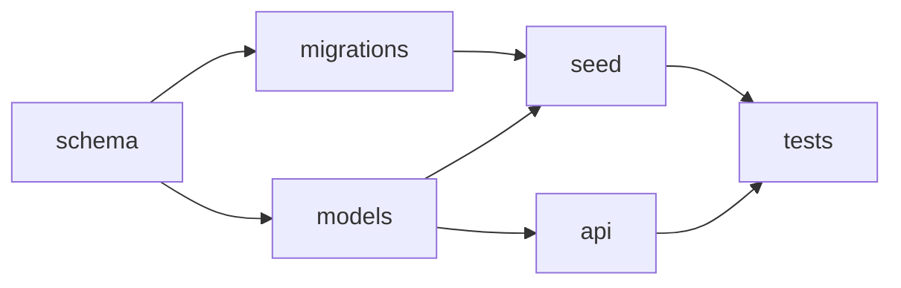
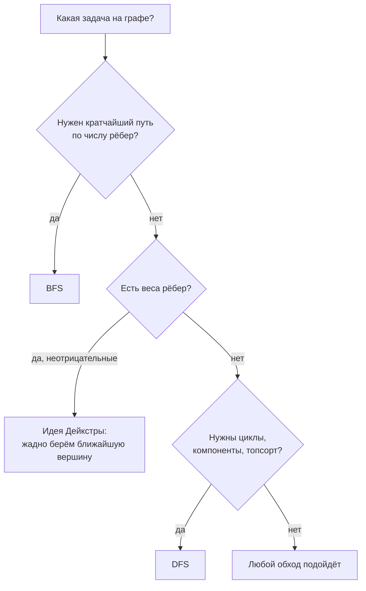

# Графы: вершины, рёбра, деревья, DAG, представления и обходы

## Вспоминаем школу

Школьного графа как отдельной темы, скорее всего, не было — зато были **схемы**: карта
метро, генеалогическое древо, план эвакуации, задача «можно ли пройти по всем мостам по
одному разу». Все они — графы.

Из школы нужны два кирпича.

**Множество** — набор различных элементов без порядка: `V = {a, b, c}`. Запись `x ∈ V`
читается «x принадлежит V», `|V|` — количество элементов. Подробно — в
[`04-sets-relations-functions`](../04-sets-relations-functions/theory.md).

**Пара** — два элемента, записанные вместе. Неупорядоченная пара `{a, b}` — это то же
самое, что `{b, a}` (дружба). Упорядоченная пара `(a, b)` — не то же, что `(b, a)`
(подписка).

Всё. Граф — это множество вершин плюс множество пар.

## Зачем программисту

Граф — самая частая структура в бэкенде, просто её редко называют по имени:

- **Зависимости.** Импорты пакетов, миграции, задачи в CI, сборка — ориентированный
  ациклический граф, и «циклическая зависимость» — это буквально цикл в нём.
- **Права доступа.** Пользователи → роли → ресурсы. Проверка «можно ли Пете читать
  отчёт» — поиск пути.
- **Социальные связи и рекомендации.** «Друзья друзей» — вершины на расстоянии 2.
- **Маршрутизация и сети.** Сервисы и вызовы между ними, latency как вес ребра.
- **Данные.** Схема БД с внешними ключами, иерархия комментариев, дерево категорий.
- **Дедлоки.** Транзакции ждут блокировки; дедлок — цикл в графе ожидания. СУБД именно
  так его и детектирует.

## Простыми словами

**Граф** — это точки и соединения между ними. Точки называются **вершинами** (vertex,
множественное — vertices), соединения — **рёбрами** (edge).

```text
   A ---- B          неориентированный граф:
   |    / |          V = {A, B, C, D}
   |  /   |          E = {{A,B}, {A,C}, {B,C}, {B,D}}
   C      D
```

Четыре характеристики, которые определяют «какой у вас граф»:

1. **Ориентированный или нет.** Дружба взаимна (неориентированный), подписка — нет
   (ориентированный, рёбра со стрелками).
2. **Взвешенный или нет.** У ребра может быть число: расстояние, стоимость, latency.
3. **Есть ли кратные рёбра и петли.** Обычно нет; такой граф называют **простым**.
4. **Связный или нет.** Можно ли добраться из любой вершины в любую.

## Точнее

### Определения и обозначения

```text
G = (V, E)              — граф: множество вершин V и множество рёбер E
n = |V|                 — число вершин
m = |E|                 — число рёбер
deg(v)                  — степень вершины: сколько рёбер в неё входит
```

Для ориентированного графа степень разделяется: `indeg(v)` — сколько стрелок входит,
`outdeg(v)` — сколько выходит.

**Максимальное число рёбер.** В простом неориентированном графе на `n` вершинах:

```text
m ≤ C(n, 2) = n(n − 1)/2
```

`C(n, 2)` — число способов выбрать пару из `n` (см.
[`06-combinatorics`](../06-combinatorics/theory.md)). Отсюда важный практический вывод:
рёбер может быть до `n²/2`, и алгоритм, который перебирает все пары вершин, — это `O(n²)`.

**Плотный** граф — рёбер близко к максимуму; **разреженный** — `m` порядка `n`. Соцсеть
разрежена: у человека сотни друзей, а не миллионы.

### Лемма о рукопожатиях

```text
Σ(v ∈ V) deg(v) = 2m
```

Читается: «сумма степеней всех вершин равна удвоенному числу рёбер». Доказательство — в
одну строку: каждое ребро имеет два конца, значит вносит `+1` в степень каждого из них,
итого `+2` в общую сумму. Это классический приём «посчитать одно и то же двумя способами».

Следствие, которое любят на собеседованиях: **число вершин нечётной степени всегда
чётно**. Действительно, `2m` чётно; сумма чётных степеней чётна; значит, сумма нечётных
степеней тоже чётна, а сумма нечётных чисел чётна только если их чётное количество.

Практическая польза: быстрая проверка целостности данных. Если вы построили
неориентированный граф из таблицы связей и `Σ deg(v)` вышла нечётной — где-то ребро
записано только с одной стороны.

### Пути, циклы, связность

- **Путь** — последовательность вершин, где каждая соседняя пара соединена ребром.
- **Простой путь** — путь без повторов вершин.
- **Цикл** — путь, который начинается и заканчивается в одной вершине.
- **Длина пути** — число рёбер (или сумма весов во взвешенном графе).
- **Расстояние `d(u, v)`** — длина кратчайшего пути.
- **Связный граф** — между любыми двумя вершинами есть путь. Иначе граф распадается на
  **компоненты связности**.

Для ориентированных графов различают **слабую связность** (связен, если забыть про
направления) и **сильную** (из любой вершины достижима любая по стрелкам).

### Деревья

**Дерево** — связный граф без циклов. Три эквивалентных определения (любое влечёт
остальные при `n` вершинах):

1. связный и без циклов;
2. связный и имеет ровно `n − 1` ребро;
3. между любыми двумя вершинами существует **ровно один** простой путь.

Формула `m = n − 1` — самая полезная. Дерево — минимально связный граф: уберите любое
ребро, и оно распадётся; добавьте любое — появится цикл.

**Корневое дерево** — выбрали вершину-корень и все рёбра стали «сверху вниз». Появляются
родители, дети, листья, глубина вершины и **высота** дерева.

Ключевой факт про высоту:

```text
сбалансированное двоичное дерево из n узлов:   высота ≈ log₂ n
вырожденное дерево («цепочка»):                высота = n − 1
```

Ровно поэтому B-дерево индекса в базе даёт `O(log n)`, а несбалансированное BST в худшем
случае деградирует до связного списка и `O(n)`. Логарифм здесь — тот самый «сколько раз
можно поделить пополам» из
[`09-growth-and-calculus-intuition`](../09-growth-and-calculus-intuition/theory.md).

### DAG и топологический порядок

**DAG** (directed acyclic graph) — ориентированный граф без циклов. Это модель всего, что
имеет смысл «сначала/потом»: сборка, миграции, задачи, вычисление зависимостей.

**Топологический порядок** — линейное упорядочивание вершин, при котором каждое ребро
идёт слева направо. Главная теорема:

> Топологический порядок существует **тогда и только тогда**, когда в графе нет циклов.

Интуиция в обе стороны. Если цикл есть, то вершины цикла должны идти каждая раньше
следующей — и раньше самой себя, что невозможно. Если циклов нет, то всегда найдётся
вершина без входящих рёбер (иначе, идя назад по стрелкам, мы бы бесконечно долго шли по
конечному графу и обязательно попали бы в уже посещённую вершину — цикл). Ставим её
первой, убираем, повторяем.



Допустимые порядки: `schema, migrations, models, seed, api, tests` или
`schema, models, api, migrations, seed, tests`. Топологический порядок не единственный —
и это правильно: независимые задачи можно запускать параллельно.

### Двудольные графы

**Двудольный** граф — вершины делятся на два множества так, что все рёбра идут между
множествами, а внутри — ни одного.

```text
пользователи      роли
    u₁ ----------- r₁
    u₂ ----\ /---- r₂
    u₃ -----X----- r₃
```

Критерий: граф двудольный ⇔ в нём **нет циклов нечётной длины** ⇔ его вершины можно
раскрасить в два цвета так, чтобы соседи были разного цвета.

Где встречается: «пользователи ↔ роли», «студенты ↔ курсы», «задачи ↔ исполнители». На
двудольных графах решают задачу о **паросочетании** — как распределить исполнителей по
задачам, чтобы покрыть максимум.

### Представления в памяти

**Матрица смежности** — таблица `n × n`, где `A[i][j] = 1`, если есть ребро.

```text
        A  B  C  D
    A [ 0  1  1  0 ]
    B [ 1  0  1  1 ]        для неориентированного графа матрица симметрична
    C [ 1  1  0  0 ]
    D [ 0  1  0  0 ]
```

Приятный бонус: `Aᵏ[i][j]` равно числу путей длины ровно `k` из `i` в `j` (см.
[`10-linear-algebra-basics`](../10-linear-algebra-basics/theory-2-matrices.md)).

**Списки смежности** — для каждой вершины список соседей.

```text
A: [B, C]
B: [A, C, D]
C: [A, B]
D: [B]
```

| Критерий | Матрица | Списки |
|----------|---------|--------|
| Память | `O(n²)` | `O(n + m)` |
| Есть ли ребро (u, v)? | `O(1)` | `O(deg u)` |
| Перебрать соседей v | `O(n)` | `O(deg v)` |
| Когда выбирать | плотный граф, малый `n`, матричные операции | разреженный граф, большой `n` |

Практика: почти всегда списки. Соцсеть на 10⁷ пользователей в виде матрицы — это 10¹⁴
ячеек, что невозможно; в виде списков — порядка `m` записей.

### Обходы: BFS и DFS как математические идеи

Здесь нас интересует только идея — сами алгоритмы живут в курсе алгоритмов.

**BFS (обход в ширину)** идёт «кругами»: сначала все вершины на расстоянии 1, потом на
расстоянии 2, и так далее. Почему это даёт кратчайший путь в невзвешенном графе:
по индукции, когда BFS впервые доходит до вершины `v`, все вершины меньшего расстояния
уже обработаны, значит найденный путь — минимальный по числу рёбер.

**DFS (обход в глубину)** идёт «вглубь до упора», потом откатывается. Он естественно
отвечает на вопросы про структуру: есть ли цикл, какие компоненты связности,
топологический порядок (вершины в порядке завершения обработки, развёрнутом наоборот).



Оба обхода посещают каждую вершину и каждое ребро по одному разу, поэтому оба работают
за `O(n + m)`.

**Кратчайший путь во взвешенном графе** — отдельная история: BFS уже не годится, потому
что «мало рёбер» ≠ «дёшево». Идея Дейкстры: держим множество вершин с уже известным
минимальным расстоянием и каждый раз добавляем ближайшую из оставшихся. Работает, пока
веса неотрицательны — иначе «уже посчитанное» расстояние может позже улучшиться.

## Разобранные примеры

### Пример 1. Лемма о рукопожатиях на числах

В графе 6 вершин со степенями `3, 3, 2, 2, 1, 1`. Сколько рёбер?

```text
Σ deg(v) = 3 + 3 + 2 + 2 + 1 + 1 = 12      — сложили степени
Σ deg(v) = 2m                              — лемма о рукопожатиях
2m = 12  ⇒  m = 6                          — рёбер шесть
вершин нечётной степени: 3, 3, 1, 1 — четыре штуки, чётное число ✓
```

А существует ли граф со степенями `3, 3, 3, 3, 1`? Сумма равна 13 — нечётная,
значит `2m = 13`, что невозможно. Такого графа **не существует**, и мы поняли это, не
рисуя ни одной картинки.

Важная оговорка: чётность суммы — условие **необходимое, но не достаточное**. Степени
`3, 3, 3, 1` дают сумму 10, чётность в порядке, а графа всё равно нет: каждая вершина
степени 3 в графе на четырёх вершинах обязана соединиться со всеми остальными, и тогда
четвёртая вершина тоже получит степень 3, а не 1. Проверка на чётность быстро
отсеивает мусор, но не гарантирует существование.

### Пример 2. Дерево, рёбра и высота

В каталоге товаров 100 000 категорий, каждая (кроме корня) имеет ровно одного родителя.

```text
структура — корневое дерево, n = 100000
m = n − 1 = 99999                          — столько записей parent_id
если дерево сбалансировано (ветвление 2):
высота ≈ log₂ 100000 ≈ 16.6 → 17 уровней
если ветвление 10:
высота ≈ log₁₀ 100000 = 5 уровней
```

Отсюда сразу оценка: рекурсивный обход дерева категорий уйдёт максимум на 17 уровней
вложенности — стек не переполнится. А вот если данные испорчены и появился цикл, обход
будет вечным: проверка на посещённые вершины обязательна.

### Пример 3. Обнаружение циклической зависимости

Есть зависимости пакетов: `A → B`, `B → C`, `C → A`.

```text
попробуем топологический порядок:
вершин без входящих рёбер: indeg(A)=1, indeg(B)=1, indeg(C)=1 — таких нет
⇒ начать построение невозможно
⇒ в графе есть цикл: A → B → C → A
```

Это ровно то, что печатает сборщик как «import cycle not allowed». Алгоритм Кана
(повторно снимать вершины с нулевой входящей степенью) выдаёт и порядок, и диагноз:
если вершины кончились, а граф не пуст — остаток и есть цикл.

### Пример 4. Двудольность и нечётный цикл

```text
цикл длины 4:  u₁ — r₁ — u₂ — r₂ — u₁
раскраска:     u₁ синий, r₁ красный, u₂ синий, r₂ красный   — конфликтов нет
⇒ двудольный

цикл длины 3:  a — b — c — a
раскраска:     a синий, b красный, c синий
но c и a соседи и оба синие                                 — конфликт
⇒ не двудольный
```

Общее правило: при обходе красим соседа в противоположный цвет; если наткнулись на
соседа своего цвета — найден нечётный цикл, и граф не двудольный.

## В коде

Списки смежности и подсчёт степеней:

```go
type Graph struct {
	adj map[string][]string // вершина → соседи
}

func NewGraph() *Graph { return &Graph{adj: make(map[string][]string)} }

// AddEdge добавляет неориентированное ребро: связь пишется с обеих сторон.
func (g *Graph) AddEdge(u, v string) {
	g.adj[u] = append(g.adj[u], v)
	g.adj[v] = append(g.adj[v], u)
}

func (g *Graph) Degree(v string) int { return len(g.adj[v]) }
```

Проверка леммы о рукопожатиях как теста целостности:

```go
func (g *Graph) EdgeCount() (int, error) {
	sum := 0
	for v := range g.adj {
		sum += len(g.adj[v]) // Σ deg(v)
	}
	if sum%2 != 0 {
		return 0, fmt.Errorf("graph: odd degree sum %d, edges stored one-sided", sum)
	}
	return sum / 2, nil // Σ deg(v) = 2m
}
```

Топологическая сортировка алгоритмом Кана — заодно детектор циклов:

```go
func TopoSort(deps map[string][]string) ([]string, error) {
	indeg := make(map[string]int, len(deps))
	for v, outs := range deps {
		if _, ok := indeg[v]; !ok {
			indeg[v] = 0
		}
		for _, w := range outs {
			indeg[w]++
		}
	}
	queue := make([]string, 0, len(indeg))
	for v, d := range indeg {
		if d == 0 { // вершины, ни от чего не зависящие
			queue = append(queue, v)
		}
	}
	var order []string
	for len(queue) > 0 {
		v := queue[0]
		queue = queue[1:]
		order = append(order, v)
		for _, w := range deps[v] {
			indeg[w]--
			if indeg[w] == 0 {
				queue = append(queue, w)
			}
		}
	}
	if len(order) != len(indeg) {
		return nil, fmt.Errorf("cycle detected: %d of %d nodes ordered", len(order), len(indeg))
	}
	return order, nil
}
```

## Типичные ошибки

- **Забыть отметить посещённые вершины.** В графе с циклом обход зациклится навсегда.
  Это первая причина «под нагрузкой сервис съел всю память».
- **Считать, что кратчайший путь по числу рёбер — самый дешёвый.** В взвешенном графе
  это разные вещи, и BFS даёт неверный ответ.
- **Применять Дейкстру с отрицательными весами.** Алгоритм молча вернёт неправильный
  результат, потому что его корректность опирается на неотрицательность.
- **Хранить разреженный граф матрицей смежности.** `n²` памяти при `m ≈ n` — верный
  способ упереться в RAM на ровном месте.
- **Записывать неориентированное ребро с одной стороны.** Потом «Петя друг Васи, а Вася
  не друг Пети». Лемма о рукопожатиях ловит это одной проверкой.
- **Путать «нет цикла» и «связный».** Это независимые свойства: лес без циклов может
  быть несвязным, а связный граф может кишеть циклами. Дерево — это и то, и другое.
- **Проверять двудольность «на глаз».** Критерий чёткий: нет циклов нечётной длины.

## Шпаргалка формул

| Что | Формула |
|-----|---------|
| Граф | `G = (V, E)`; `n` — число вершин, `m` — число рёбер |
| Максимум рёбер (простой неорграф) | `m ≤ n(n − 1)/2` |
| Лемма о рукопожатиях | `Σ deg(v) = 2m` |
| Следствие | число вершин нечётной степени чётно |
| Дерево | связный, без циклов, `m = n − 1` |
| Высота сбалансированного дерева | `≈ log₂ n` (вырожденного — `n − 1`) |
| Топологический порядок | существует ⇔ граф ациклический |
| Двудольность | ⇔ нет циклов нечётной длины |
| Матрица смежности | память `O(n²)`, проверка ребра `O(1)` |
| Списки смежности | память `O(n + m)`, проверка ребра `O(deg)` |
| Пути длины k | `Aᵏ[i][j]` |
| BFS / DFS | `O(n + m)` |

## Словарь терминов

- **Вершина (vertex)** — узел графа. **Ребро (edge)** — связь между двумя вершинами.
- **Ориентированный граф** — рёбра со стрелками, `(u, v) ≠ (v, u)`.
- **Взвешенный граф** — рёбрам приписаны числа (стоимость, длина, latency).
- **Степень `deg(v)`** — число рёбер при вершине; для орграфа — `indeg` и `outdeg`.
- **Путь** — цепочка вершин, соединённых рёбрами; **цикл** — путь, вернувшийся в начало.
- **Связность** — существование пути между любой парой вершин.
- **Компонента связности** — максимальный связный кусок графа.
- **Дерево** — связный ациклический граф; **лес** — набор деревьев.
- **Корневое дерево** — дерево с выделенной вершиной-корнем; **высота** — длина
  максимального пути от корня до листа.
- **DAG** — ориентированный граф без циклов.
- **Топологический порядок** — линейный порядок вершин DAG, согласованный со стрелками.
- **Двудольный граф** — вершины делятся на две части, рёбра идут только между ними.
- **Матрица смежности / списки смежности** — два способа хранить граф.
- **BFS / DFS** — обход в ширину / в глубину.

## См. также

- [`theory-2-recurrences-and-automata.md`](./theory-2-recurrences-and-automata.md) —
  рекуррентности, индукция, конечные автоматы.
- [`04-sets-relations-functions`](../04-sets-relations-functions/theory.md) — граф как
  отношение на множестве.
- [`10-linear-algebra-basics`](../10-linear-algebra-basics/theory-2-matrices.md) —
  матрица смежности и степени матрицы как число путей.
- [`06-combinatorics`](../06-combinatorics/theory.md) — `C(n, 2)` и подсчёт двумя способами.
- Lehman, Leighton, Meyer. **Mathematics for Computer Science** (MIT 6.042), части
  «Simple Graphs», «Directed Graphs & Partial Orders», «Trees».
- Rosen. **Discrete Mathematics and Its Applications**, главы 10–11 (Graphs, Trees).
- **Khan Academy** — раздел «Graph representation» в курсе Algorithms.
