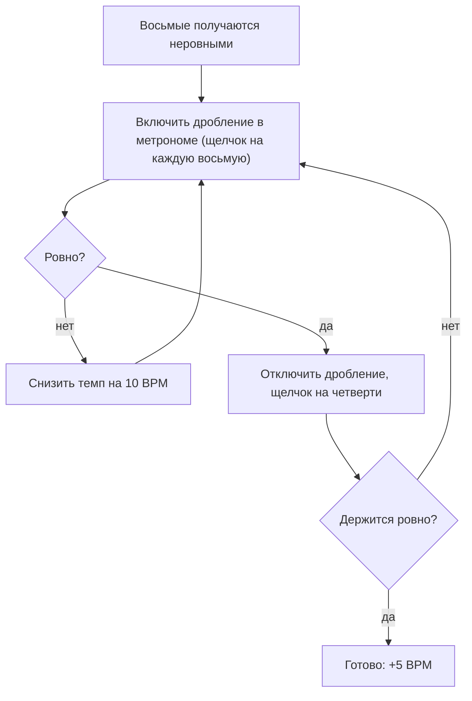

# Урок 01 — Пульс и метроном: хлопаем четверти и восьмые

Длительность: **25–30 минут**. Нужны: метроном (GuitarTuna или Soundbrenner в телефоне
подойдёт), стул с твёрдым полом под ногой, ладони. Инструмент не нужен, и это
принципиально: сегодня учимся времени, а не нотам.

## Разогрев — 3 минуты

Без метронома. Найдите пульс в любой знакомой песне: включите её и кивайте головой,
пока кивок не начнёт совпадать с музыкой сам. Затем добавьте топанье ногой в том же
темпе. Пульс — это то, что вы сейчас нашли: регулярная сетка, под которую всё
раскладывается.

Обратите внимание на важное: пульс продолжает идти, даже когда в песне пауза. Он в
вашей голове, а не в динамиках. Ваша задача на весь курс — сделать этот внутренний
пульс надёжным.

## Шаг 1. Знакомство с метрономом — 4 минуты

Включите метроном на **60 BPM**. Это одна доля в секунду, самый удобный темп для
понимания: 60 BPM = 60 щелчков в минуту = 1000 мс между щелчками.

Просто послушайте 30 секунд, ничего не делая. Потом поставьте 120 BPM — вдвое быстрее,
500 мс между щелчками. Потом 90. Заметьте, как меняется ощущение: на 60 успеваешь
подумать, на 120 приходится доверять телу.

Теперь верните 60 и добавьте ногу: топайте на каждый щелчок. Нога — ваш будущий
внутренний метроном, и она должна научиться работать независимо от рук. Не спешите
хлопать, пока нога не пошла ровно сама.

## Шаг 2. Четверти: попасть внутрь щелчка — 6 минут

Метроном 70 BPM. Хлопайте на каждый щелчок и **считайте вслух** «1 2 3 4», начиная
счёт заново каждые четыре хлопка.

```text
щелчок:  |  X  |  X  |  X  |  X  |  X  |  X  |  X  |  X  |
хлопок:  |  X  |  X  |  X  |  X  |  X  |  X  |  X  |  X  |
счёт:       1     2     3     4     1     2     3     4
```

Главный критерий успеха звучит странно, но он точный: **щелчок должен исчезнуть**. Если
вы слышите отдельно щелчок и отдельно хлопок — вы опаздываете (почти всегда) или
торопитесь. Когда попадание точное, два звука сливаются в один, и метроном как будто
пропадает. Это лучший индикатор, который у вас есть, и он бесплатный.

Счёт вслух не пропускайте, даже если чувствуете себя глупо. Он делает две вещи:
показывает, где вы находитесь в такте, и не даёт остановиться при ошибке — голос
продолжает, руки догоняют.

```drill
type: free-form
prompt: "3 минуты. Метроном 70 BPM. Хлопать четверти со счётом вслух «1 2 3 4», нога топает вместе. Не останавливаться все 3 минуты."
answer: "Щелчок сливался с хлопком, а не звучал отдельно; счёт вслух шёл без перерывов; нога топала ровно и не сбилась; вы ни на секунду не потеряли, какая доля идёт сейчас; вы не начинали заново."
check: manual
hint: "Слышите щелчок отдельно — вы опаздываете. Попробуйте начинать движение ладоней чуть раньше."
```

## Шаг 3. Восьмые: дробим долю на два — 8 минут

Восьмая — половина доли. В счёте она получает слог «и»:

```text
такт 4/4, четверти:   |  1  .  2  .  3  .  4  .  |
счёт восьмыми:        |  1  и  2  и  3  и  4  и  |
хлопки восьмыми:      |  X  X  X  X  X  X  X  X  |
```

Поставьте метроном на **60 BPM** (не быстрее — восьмые вдвое чаще щелчка, и это уже
120 хлопков в минуту) и хлопайте восьмые со счётом «1 и 2 и 3 и 4 и».

Типичная проблема: восьмые выходят неровными, парами «длинная-короткая». Это происходит,
когда «и» ставят на слух («где-то посередине»), а не считают. Лечение простое: **ставьте
метроном на восьмые.** Почти в любом приложении есть настройка дробления (subdivision) —
включите её, и щелчок пойдёт под каждую восьмую. Теперь у вас есть опора на «и», и
ровность получается сама. Освоив, верните щелчок на четверти и держите «и» самостоятельно.



Затем упражнение на переключение: такт четвертей, такт восьмых, и так по кругу.
Пульс при переключении не должен сдвинуться ни на миллиметр — именно здесь новичок
обычно ускоряется, потому что «восьмые — это быстро, надо поспешить».

```drill
type: free-form
prompt: "5 минут. Метроном 60 BPM. Чередовать по такту: такт четвертей, такт восьмых, 8 тактов подряд, счёт вслух «1 и 2 и 3 и 4 и» всё время (даже в такте четвертей)."
answer: "Восьмые ровные, без пар «длинная-короткая»; переход от четвертей к восьмым не сдвинул пульс; счёт «и» проговаривался и в тактах четвертей; щелчок к концу упражнения остался в том же месте относительно хлопков; вы дошли до конца, не начиная заново."
check: manual
```

## Шаг 4. Кто быстрее: вы или метроном — 5 минут

Финальная проверка на сегодня, и она же самый честный тест в ритме. Включите метроном на
80 BPM, хлопайте четверти 16 тактов, а на 8-м такте **выключите звук метронома**, продолжая
хлопать. На 16-м такте включите обратно.

Если вы попали в щелчок — внутренний пульс работает. Если щелчок оказался в другом месте,
посмотрите, в какую сторону: ушли вперёд (почти все новички) или отстали. Это ваша
персональная поправка, и её полезно знать.

```drill
type: free-form
prompt: "4 минуты. Метроном 80 BPM, хлопать четверти 16 тактов. С 9-го по 16-й такт звук метронома выключен, хлопки продолжаются. На 17-м такте метроном включается обратно."
answer: "Вы продержали 8 тактов без щелчка, не сбившись со счёта; при включении щелчок пришёлся близко к хлопку (расхождение меньше половины доли); вы знаете, в какую сторону ушли — вперёд или назад; счёт вслух шёл и в тишине."
check: manual
hint: "Ушли вперёд — вы держите темп мышцами, а не слухом. Это лечится теми же выключениями, только чаще."
```

## Итог

Пульс — это регулярная сетка времени, и она существует у вас в голове, а метроном лишь
проверяет её честность. Доля при 60 BPM длится ровно секунду, формула на все случаи —
60000 / BPM. Четверть — одна доля, восьмая — половина, счёт восьмых вслух звучит как
«1 и 2 и 3 и 4 и».

Три привычки, которые начинаются сегодня и не заканчиваются никогда: **считать вслух**,
**топать ногой на четверти**, **не доигрывать сбитый такт** — остановиться, снизить темп,
начать заново. И критерий, по которому вы теперь оцениваете попадание: щелчок метронома
должен исчезать внутри вашего хлопка.

Дальше — [урок 02](./02-meter-and-durations.md): размеры, длительности и чтение
ритмических строк с листа.
