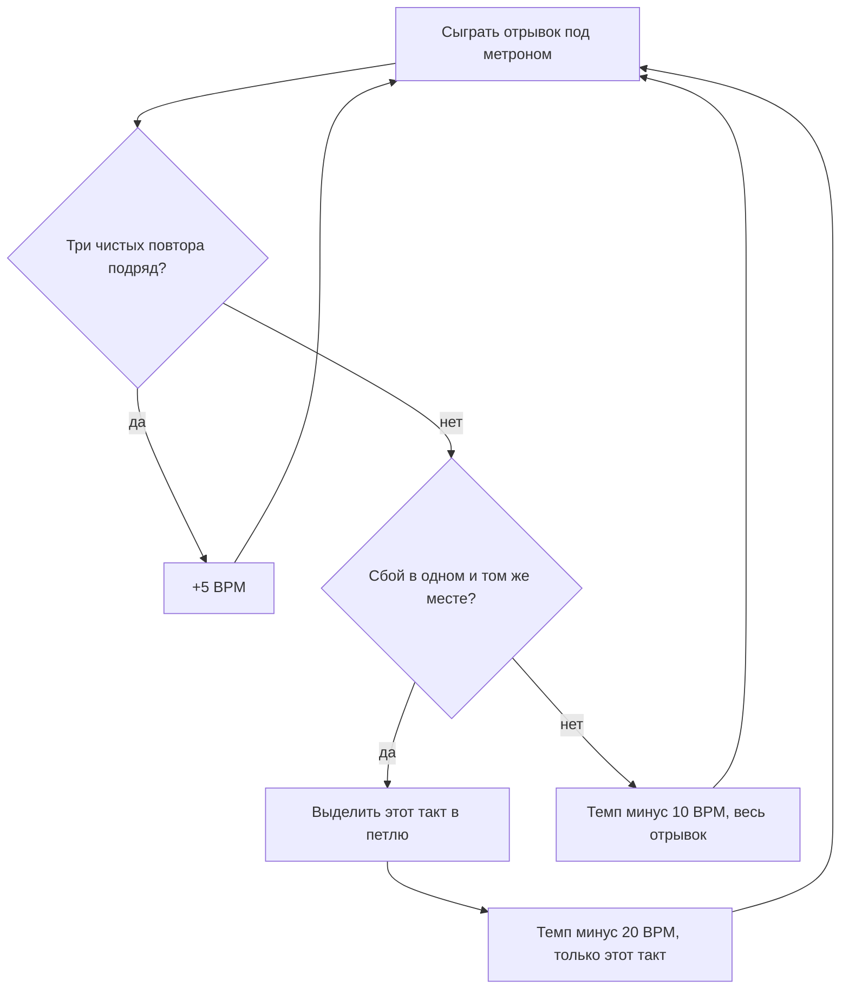
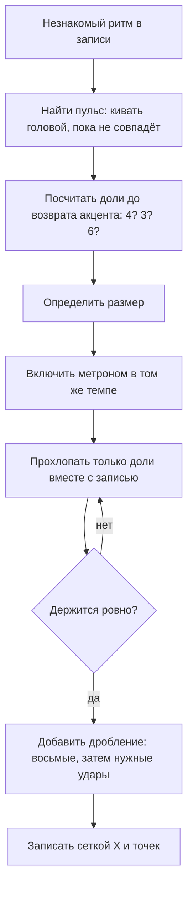

# Звук и ритм

## Простыми словами

Музыка — это колебания воздуха, разложенные по времени. Всё, что дальше будет в курсе
(ноты, гаммы, аккорды, тональности), описывает **какие** колебания. Этот модуль про два
более базовых вопроса: из чего вообще состоит один звук и **когда** он случается.

Аналогия для программиста: звук — это структура с тремя полями, а музыка — это поток
событий с таймстемпами.

```text
Звук {
  высота    (pitch)     — частота колебаний, Гц
  громкость (loudness)  — амплитуда колебаний
  тембр     (timbre)    — «форма» колебания: набор обертонов + огибающая
}

Музыка = отсортированный по времени список таких событий,
         разложенный на регулярную сетку (пульс).
```

Первые три поля — это «что звучит». Регулярная сетка — это ритм. И вот главная новость
модуля: **сетка важнее нот**. Правильные ноты в неправильном времени звучат как ошибка.
Неправильная нота в правильном времени звучит как джаз.

## Зачем это нужно

Три очень практичных причины начать с ритма, а не с нот.

**Первая: 90 % проблем новичка — ритмические.** Когда человек играет песню и слышит, что
«звучит не так», он обычно ищет неправильную ноту. А ошибка почти всегда в другом: он
ускорился, задержался при смене аккорда, сыграл восьмые неровно или потерял счёт в такте.
Ноты были верные. Время — нет. Это хорошая новость, потому что ритм тренируется
измеримо: есть метроном, есть запись, есть «попал / не попал».

**Вторая: ритм — единственный навык, который нельзя занять у теории.** Понимание аккорда
можно вывести из формулы за минуту. Ровные восьмые под 80 BPM выводятся только руками и
только за несколько недель. Поэтому его надо начать раньше всего остального — пусть
созревает в фоне, пока вы разбираетесь с нотами.

**Третья: ритм — это то, по чему слушатель узнаёт песню.** Простучите ладонью по столу
ритм припева любой знакомой песни — человек рядом её угадает. Сыграйте ту же мелодию
ровными четвертями — не угадает никто.

И маленькая причина про частоты: понимание, что октава — это удвоение частоты, снимает
мистику со всей последующей теории. Двенадцать нот, круг квинт, интервалы — это
арифметика на логарифмической шкале, а не тайное знание.

## Как устроено

### Высота: частота в герцах

Высота звука (pitch) — это частота колебаний, измеряемая в герцах (Hz, колебаний в
секунду). Опорная точка всей западной музыки:

```text
A4 = 440 Hz     (нота «ля» первой октавы, эталон настройки)
```

Дальше работает одно правило, из которого следует почти всё:

```text
октава вверх   = частота × 2
октава вниз    = частота / 2

A3 = 220 Hz
A4 = 440 Hz
A5 = 880 Hz
A6 = 1760 Hz
```

Нота с удвоенной частотой воспринимается как **та же нота**, только выше. Это не
соглашение музыкантов, а свойство слуха: удвоение частоты слышится как «то же самое».
Именно поэтому нот всего семь букв (плюс диезы), а не двести — каждые двенадцать
полутонов паттерн начинается заново.

Внутри октавы 12 равных шагов (полутонов). «Равных» в логарифмическом смысле: каждый
следующий полутон — умножение частоты на один и тот же коэффициент.

```text
коэффициент полутона = 2^(1/12) ≈ 1.0595

A4  = 440.00 Hz
A#4 = 466.16 Hz     (440 × 1.0595)
B4  = 493.88 Hz
...
A5  = 880.00 Hz     (440 × 1.0595^12 = 440 × 2)
```

Это называется равномерная темперация (equal temperament). Ей около трёхсот лет, и она
компромисс: ни один интервал, кроме октавы, не идеально «чистый», зато играть можно в
любой тональности без перестройки инструмента. Как float: точность потеряли, зато
универсальность получили.

Номера нот и MIDI-арифметика — тема следующего модуля,
[`02-notes-and-notation`](../02-notes-and-notation/index.md). Здесь достаточно запомнить
удвоение.

### Громкость: амплитуда и динамика

Громкость (loudness) — это амплитуда колебаний, размах давления воздуха. Измеряется в
децибелах (dB), и децибелы логарифмические: +10 dB — это примерно «в два раза громче» на
слух, а не «на десять единиц».

В нотах громкость записывают не числами, а буквами — итальянскими сокращениями:

| Обозначение | Название | Смысл |
|---|---|---|
| `pp` | pianissimo | очень тихо |
| `p` | piano | тихо |
| `mp` | mezzo-piano | умеренно тихо |
| `mf` | mezzo-forte | умеренно громко |
| `f` | forte | громко |
| `ff` | fortissimo | очень громко |
| `<` | crescendo | постепенно громче |
| `>` | diminuendo | постепенно тише |

Это относительная шкала: `f` в тихой баллады и `f` в метал-риффе — разные абсолютные
громкости. Динамика — не про «сделай погромче», а про контраст внутри одной пьесы.

Практический вывод для новичка: **играть всё одинаково громко — самая частая причина
того, что технически верная игра звучит мёртво.** Акцент на сильную долю — это уже
динамика, и о ней речь ниже.

### Тембр: почему одна нота звучит по-разному

Возьмите A4 = 440 Hz на гитаре и то же A4 на пианино. Частота одна, а спутать
невозможно. Разницу делают две вещи.

**Обертоны (harmonics / overtones).** Реальная струна колеблется не только целиком, но и
половинками, третями, четвертями одновременно. Поэтому вместе с основной частотой (fundamental)
звучит целый набор кратных:

```text
основная       440 Hz     ← её мы называем «нотой»
2-й обертон    880 Hz     (440 × 2)
3-й обертон   1320 Hz     (440 × 3)
4-й обертон   1760 Hz     (440 × 4)
5-й обертон   2200 Hz     (440 × 5)
```

У всех инструментов набор один и тот же, но **громкости обертонов разные**. Гитара даёт
больше высоких обертонов, флейта — почти чистую основную, кларнет глушит чётные. Этот
профиль и есть «голос» инструмента.

Приятный побочный факт: тот же ряд обертонов объясняет, почему квинта и октава кажутся
согласными. Мы к этому вернёмся в [`03-scales-and-intervals`](../03-scales-and-intervals/index.md).

**Огибающая (envelope), она же ADSR.** Как громкость меняется во времени от щипка до
тишины:

```text
      /\
     /  \____
    /        \
   /          \____
  A    D   S      R

A (attack)  — сколько нарастает   — гитара/пианино: мгновенно; скрипка/орган: плавно
D (decay)   — спад до уровня      — щипковые: заметный
S (sustain) — сколько держится    — орган держит вечно, щипковая гитара затухает
R (release) — как гаснет          — пианино с педалью: долго; стаккато: сразу
```

Поэтому фортепиано и гитара с одинаковой нотой всё равно различимы: у пианино удар
молоточка по струне, у гитары щипок и трение медиатора. Уберите атаку из записи — и
инструменты становится трудно угадать.

### Пульс, доля, темп

**Пульс (pulse)** — регулярное «тиканье», которое вы чувствуете в музыке и под которое
киваете головой. **Доля (beat)** — одно такое тиканье. Пульс есть даже там, где его никто
не играет: он в голове слушателя, и именно поэтому вся толпа хлопает одновременно.

**Темп (tempo)** — скорость пульса, в ударах в минуту (BPM, beats per minute).

```text
60 BPM   = 1 удар в секунду           (интервал между долями 1000 мс)
120 BPM  = 2 удара в секунду          (500 мс)
90 BPM   = 1.5 удара в секунду        (667 мс)

длительность доли в мс = 60000 / BPM
```

Опорные темпы, которые стоит держать в голове как эталоны:

| BPM | Ориентир |
|---|---|
| 60–70 | медленная баллада, «очень медленно» |
| 80–90 | комфортный темп для разбора нового |
| ≈103 | «Stayin' Alive» (Bee Gees) — тот самый темп, который советуют держать при непрямом массаже сердца (рекомендуемая частота компрессий 100–120 в минуту) |
| 100–120 | скорость спокойной ходьбы |
| 120 | «дефолтный» темп поп/рока и настройка метронома по умолчанию |
| 128–132 | танцевальная электроника |
| 170–175 | drum'n'bass |

Итальянские слова (Largo, Andante, Allegro, Presto) — то же самое, но приблизительно.
BPM точнее, и в любом приложении-метрономе стоит именно оно.

### Такт, размер, сильные и слабые доли

Доли не идут безликой чередой — они группируются. Группа называется **такт (bar / measure)**
и в нотах отделяется вертикальной **тактовой чертой (bar line)**.

**Размер (time signature)** — две цифры в начале, которые говорят, как устроен такт:

```text
 4        ← сколько долей в такте
 4        ← какая длительность считается долей (4 = четверть, 8 = восьмая, 2 = половинная)
```

Три размера покрывают почти всю популярную музыку:

- **4/4** — четыре четверти в такте. Он же «common time», он же дефолт всего. Счёт:
  «1 2 3 4».
- **3/4** — три четверти. Вальс. Счёт «1 2 3», и раз-два-три ощущается как кружение.
- **6/8** — шесть восьмых, сгруппированных 3 + 3. Ощущается как **две** большие доли, у
  каждой внутри тройное дробление. Счёт: «1 2 3 4 5 6» или «раз-и-и два-и-и».

Внутри такта доли не равноправны. Первая доля — самая сильная (её называют «раз» или
downbeat), остальные слабее.

```text
4/4:   1     2     3     4        сила: сильная — слабая — средняя — слабая
       ^                 ^
    сильная          самая слабая

3/4:   1     2     3              сила: сильная — слабая — слабая

6/8:   1  2  3  |  4  5  6        две сильные точки: 1 и 4
       ^           ^
```

И тут же важное исключение, из-за которого рок и поп звучат как рок и поп: **бэкбит
(backbeat)**. Бочка (kick) играет на 1 и 3, а малый барабан (snare) — на **2 и 4**, то есть
акцент садится на слабые доли. Отсюда и правило зала: хлопать на 2 и 4, а не на 1 и 3.

```text
доля:    1     2     3     4
бочка:   X           X
снейр:         X           X      ← бэкбит: то, из-за чего хочется кивать
```

### Длительности и паузы

Длительности заданы не в секундах, а **относительно доли**. Это гениально: меняешь темп —
вся запись едет вместе с ним.

| Русское | English | В 4/4 занимает |
|---|---|---|
| целая | whole note | 4 доли (весь такт) |
| половинная | half note | 2 доли |
| четверть | quarter note | 1 доля |
| восьмая | eighth note | 1/2 доли |
| шестнадцатая | sixteenth note | 1/4 доли |

Арифметика простая, деление на два:

```text
1 целая = 2 половинные = 4 четверти = 8 восьмых = 16 шестнадцатых

|<---------------- целая ----------------->|
|<---- половинная --->|<---- половинная -->|
| четв | четв | четв  | четв | четв | четв |   (в 4/4 их четыре)
|8 |8 |8 |8 |8 |8 |8 |8 |                      (восемь восьмых)
|16|16|16|16|16|16|16|16|16|16|16|16|16|16|16|16|
```

У каждой длительности есть **пауза (rest)** такой же длины. Пауза — это не «ничего», а
такое же музыкальное событие: тишина в нужном месте работает как акцент. Новички паузы
проглатывают и потому играют слитную кашу.

### Точка, лига, триоли

**Точка (dot)** после ноты удлиняет её на половину собственной длины:

```text
четверть с точкой   = четверть + восьмая        = 1.5 доли
половинная с точкой = половинная + четверть     = 3 доли
восьмая с точкой    = восьмая + шестнадцатая    = 0.75 доли
```

Четверть с точкой — рабочая лошадка популярной музыки: паттерн «1 . . 2и . . 3и» держится
именно на ней.

**Лига (tie)** — дуга, соединяющая две ноты одной высоты: их длительности складываются, а
звук берётся один раз. Нужна, когда нота должна перетечь через тактовую черту или когда
нужной длительности просто не существует.

```text
такт 1                    | такт 2
четверть  четверть  ~~~~~~~ половинная       ← звук взят один раз, длится 1 + 2 = 3 доли
```

**Триоль (triplet)** — три ноты в том времени, где по правилам укладываются две. Три
восьмые-триоли занимают одну долю, а не полторы; счёт «раз-и-и, два-и-и». Триоли делают
музыку «покачивающейся» — на них построены блюз, шаффл и почти вся музыка 1950-х. Пока
достаточно уметь их услышать и посчитать, отдельного разбора они не требуют.

### Счёт вслух: сетки

Главный инструмент ритма — не метроном, а **свой голос**. Счёт вслух переводит ритм из
«примерно чувствую» в «знаю, где я нахожусь». Это не костыль новичка: профессионалы
считают при разборе сложных мест всю жизнь.

Три сетки на все случаи:

```text
такт 4/4, четверти:   |  1  .  2  .  3  .  4  .  |
счёт восьмыми:        |  1  и  2  и  3  и  4  и  |
счёт шестнадцатыми:   | 1 e & a 2 e & a 3 e & a 4 e & a |
хлопки (X = хлопок):  | X  .  X  .  X  .  X  .  |
```

Русский вариант счёта восьмых — «1 и 2 и 3 и 4 и». Для шестнадцатых русской удобной
слоговой системы нет, поэтому берут английскую **«1 e & a»** (произносится «уан-и-энд-а»):
`1` — доля, `e` — вторая шестнадцатая, `&` — восьмая между долями, `a` — четвёртая
шестнадцатая. Слоги специально разные на слух, чтобы не сбиться.

Запись ритма сеткой, где `X` — играем, `.` — молчим:

```text
счёт:    1  и  2  и  3  и  4  и
ровные:  X  X  X  X  X  X  X  X     ← восемь восьмых, «прямой» бой
на доли: X  .  X  .  X  .  X  .     ← четыре четверти
через:   X  .  .  X  X  .  X  .     ← четверть с точкой + ...
```

### Синкопа

**Синкопа (syncopation)** — акцент или нота там, где ожидается пауза: на «и», на слабой
доле, между долями. Ощущение — будто музыка спотыкается вперёд, и именно от него хочется
двигаться.

```text
без синкопы:   1  и  2  и  3  и  4  и
               X  .  X  .  X  .  X  .      ← предсказуемо, как метроном

синкопа:       1  и  2  и  3  и  4  и
               X  .  .  X  .  X  X  .      ← удары на «и» второй и третьей доли
                     ^^^^^^^^^
```

Чтобы синкопа работала, слушатель должен чувствовать долю, которую вы пропустили. Поэтому
синкопы играют **на фоне ровного счёта** — и поэтому счёт вслух обязателен: без него вы не
сыграете синкопу, вы просто сыграете не туда.

### Метроном: привычки, которые экономят месяцы

Метроном — не мучение, а система контроля версий для ритма. Он даёт то, чего не даёт
собственная память: объективное «попал / не попал».

Шесть правил, из которых состоит вся методика:

1. **Ставьте темп медленнее, чем хочется.** Настолько медленно, что становится скучно.
   Скучно — значит, у мозга есть запас, чтобы закрепить правильное движение.
2. **Считайте вслух.** Метроном без счёта тренирует «попадать в щелчок», счёт тренирует
   «знать, где я в такте».
3. **Топайте ногой на четверти.** Нога — ваш внутренний метроном, она должна работать и
   без внешнего.
4. **Дробите щелчок.** Сначала пусть метроном стучит восьмыми (двойная сетка) — легче
   ровно. Потом переключите на четверти и держите восьмые сами.
5. **Лесенка +5 BPM.** Повышайте темп только после **трёх чистых повторов подряд**. Сбился —
   вернулись на предыдущую ступень. Никаких «ну почти получилось».
6. **Записывайте себя.** Метроном не врёт, но в момент игры вы его не слышите — вы слышите
   свои ожидания. На записи всё видно.



А вот алгоритм на случай «услышал ритм, хочу повторить»:



## На гитаре

Ритм на гитаре живёт в **правой руке** (у левши — наоборот), и главный принцип
контринтуитивен: рука со медиатором **не останавливается никогда**.

Держите непрерывное качание вниз-вверх восьмыми. Удары, которые не нужны, вы просто
проносите мимо струн — это «призрачные удары» (ghost strums). Так пульс живёт в теле, а не
в голове, и бой не рассыпается при смене аккорда.

```text
счёт:      1   и   2   и   3   и   4   и
рука:      V   ^   V   ^   V   ^   V   ^     ← движение всегда, без остановок
играем:    X   .   X   X   .   X   X   .     ← «X» = задели струны, «.» = мимо
```

Правило соответствия, из которого потом складываются все бои: удары **вниз** приходятся на
цифры (1, 2, 3, 4), удары **вверх** — на «и». Если вы поймали себя на том, что играете «и»
движением вниз, — рука где-то остановилась.

Три ритмические привычки конкретно для гитары:

- **Топать ногой на четверти** с первого дня. Нога сбилась — значит, вы играете руками, а
  не в пульсе.
- **Считать вслух даже при смене аккорда.** Смена аккорда — место, где 100 % новичков
  крадут время. Счёт вслух не даёт остановиться: пусть аккорд возьмётся грязно, но вовремя.
- **Тренировать бой на заглушенных струнах.** Положите левую руку плашмя на струны и
  играйте только ритм. Убрав высоту, вы слышите чистое время.

Постановка рук, хват медиатора и конкретные бои — в
[`06-guitar-foundations`](../06-guitar-foundations/index.md). Здесь важно другое: ритм
ставится на гитаре раньше аккордов, а не после них.

## На клавишах

У клавиш огромное ритмическое преимущество: **ритм видно глазами**. В любом DAW окно
piano-roll — это ровно та же сетка `1 e & a`, только нарисованная, с линиями долей и
дробления.

Три вещи, которые стоит делать с самого начала:

- **Левая рука на долях, правая сверху.** Самое дешёвое упражнение на независимость: левая
  берёт одну ноту ровными четвертями (живой метроном), правая играет что угодно поверх.
  Если левая начала «дышать» вместе с правой — темп вниз.
- **Клик в DAW вместо приложения.** Метроном внутри проекта совпадает с сеткой, поэтому
  запись сразу видно относительно линий: опоздали — нота правее линии, поспешили — левее.
- **Квантизация как детектор, а не как лекарство.** Запишите такт, посмотрите, куда попали
  ноты, и **только потом** при желании выровняйте. Смотреть на «до квантизации» полезнее,
  чем слушать результат: видно систематический сдвиг (почти все новички ускоряются к концу
  такта).

```text
piano-roll, такт 4/4 (| = доля, ' = восьмая):
        |1   '   |2   '   |3   '   |4   '   |
правая   ██      ██  ██       ██   ██
левая    ████    ████    ████    ████            ← ровные четверти = ваш якорь
```

Посадка, номера пальцев и подключение контроллера — в
[`08-keyboard-foundations`](../08-keyboard-foundations/index.md).

## Послушай

Слушать надо не «красиво ли», а «где доля». Кивайте головой и считайте вслух — эти примеры
подобраны так, чтобы размер и приём было слышно отчётливо.

- **4/4 с бэкбитом** — практически весь рок и поп. Возьмите любую знакомую песню, найдите
  малый барабан: он на 2 и 4. Как только услышали — попробуйте хлопать вместе с ним, а не
  с бочкой.
- **3/4 (вальс)** — «Happy Birthday to You»; «The Blue Danube» (Иоганн Штраус); «Piano Man»
  (Billy Joel). Счёт «1 2 3» ложится сам, «1 2 3 4» не ложится никак — это и есть тест на
  размер.
- **6/8** — «House of the Rising Sun» (The Animals); «We Are the Champions» (Queen).
  Слышно две большие доли с тройным дроблением внутри, «раз-и-и два-и-и».
- **5/4** — «Take Five» (Dave Brubeck). Название буквально про размер. Попробуйте
  посчитать до пяти вместе с темой.
- **7/4** — «Money» (Pink Floyd). Знаменитый бас-рифф не укладывается в четыре, и это
  слышно даже без счёта.
- **Синкопа** — «Superstition» (Stevie Wonder). Рифф клавинета почти целиком стоит между
  долями; попробуйте топать четвертями под него.
- **Шаффл и триольное дробление** — «Pride and Joy» (Stevie Ray Vaughan) и любой
  12-тактовый блюз. Сравните с любым прямым роком: разница в дроблении доли на три вместо
  двух.
- **Темп на слух** — «Stayin' Alive» (Bee Gees), около 103 BPM. Полезное упражнение:
  выставить в метрономе 103 и убедиться, что совпало.
- **Тембр** — сыграйте одну и ту же A4 на гитаре и на пианино (или на любом бесплатном
  фортепианном плагине вроде Spitfire LABS). Одна частота, два совершенно разных звука —
  вся разница в обертонах и атаке.

Если про какую-то песню сомневаетесь, в каком она размере, — не верьте на слово и проверьте
на слух или по нотам в MuseScore. Спорные случаи в популярной музыке встречаются часто
(один и тот же трек записывают то в 6/8, то в 12/8).

## Типичные ошибки

- **Ускорение.** Самая универсальная ошибка: чем увереннее место, тем быстрее оно играется,
  а сложное отстаёт. Лечится метрономом и записью, ничем больше.
- **Пауза при смене аккорда.** Ритм останавливается, пока пальцы ищут форму. Лечение:
  играть в темпе, где смена успевает; пусть аккорд будет грязным, но вовремя.
- **Счёт молча.** «Я считаю в голове» почти всегда означает «я не считаю». Вслух, даже если
  чувствуете себя глупо.
- **Метроном как экзамен.** Включить на нужном темпе, не попасть, выключить, расстроиться.
  Метроном — это инструмент медленной работы, а не проверка.
- **Проглоченные паузы.** Тишина — часть ритма. Пропустив паузу, вы съезжаете на её длину
  и уже играете другую песню.
- **Отсутствие дробления.** Играть «на слух примерно между долями» вместо того чтобы знать:
  это «и» или это «а». Разница слышна сразу.
- **Нога-предатель.** Нога топает не ровно, а вместе с тем, что играют руки. Тренируйте
  ногу отдельно, без инструмента.
- **Только 4/4.** Через месяц человек физически не может посчитать вальс. Держите 3/4 и 6/8
  в упражнениях с самого начала.
- **Ритм после нот.** «Сначала выучу, потом сыграю ровно» не работает: неровное исполнение
  закрепляется как навык, и переучиваться дороже.

## Словарь терминов

- **Высота (pitch)** — частота колебаний, в герцах; воспринимается как «выше / ниже».
- **Октава (octave)** — расстояние, на котором частота удваивается; та же нота выше.
- **Полутон (semitone)** — минимальный шаг западной системы, 1/12 октавы, множитель
  2^(1/12) ≈ 1.0595.
- **Равномерная темперация (equal temperament)** — деление октавы на 12 равных полутонов.
- **Громкость (loudness)** — амплитуда колебаний; в нотах записывается динамикой `p`, `f`.
- **Динамика (dynamics)** — система обозначений громкости и её изменений.
- **Тембр (timbre)** — «окраска» звука: набор громкостей обертонов плюс огибающая.
- **Обертоны (harmonics / overtones)** — частоты, кратные основной, звучащие вместе с ней.
- **Огибающая (envelope, ADSR)** — как громкость звука меняется во времени.
- **Пульс (pulse)** — регулярная сетка времени, ощущаемая слушателем.
- **Доля (beat)** — одна единица пульса.
- **Темп (tempo)** — скорость пульса в ударах в минуту (BPM); доля в мс = 60000 / BPM.
- **Такт (bar / measure)** — группа долей между тактовыми чертами.
- **Размер (time signature)** — две цифры: сколько долей в такте и какая длительность есть
  доля.
- **Сильная доля (downbeat)** — первая доля такта, главный акцент.
- **Бэкбит (backbeat)** — акцент на слабые доли 2 и 4, основа рока и поп-музыки.
- **Длительность (note value)** — относительная длина ноты: целая, половинная, четверть,
  восьмая, шестнадцатая.
- **Пауза (rest)** — тишина заданной длительности.
- **Точка (dot)** — удлиняет ноту на половину её длины.
- **Лига (tie)** — соединяет две ноты одной высоты в один звук суммарной длины.
- **Триоль (triplet)** — три ноты в длительности двух.
- **Дробление (subdivision)** — деление доли на восьмые, шестнадцатые, триоли.
- **Синкопа (syncopation)** — акцент вне доли, «между» щелчками метронома.
- **Шаффл / свинг (shuffle / swing)** — триольное дробление доли, «покачивание».
- **Метроном (metronome)** — устройство или приложение, отбивающее ровный пульс.
- **Квантизация (quantize)** — выравнивание записанных нот по сетке в DAW.

## См. также

- **musictheory.net** — раздел Lessons, темы «Rhythm», «Note Duration», «Time Signatures»,
  и упражнение Note Duration Calculator: [musictheory.net](https://www.musictheory.net)
- **teoria.com** — Rhythm Reading и Rhythmic Dictation: тренировка чтения и записи ритма
  на слух. [teoria.com](https://www.teoria.com)
- **Open Music Theory** — открытый учебник, разделы про метр и ритм:
  [openmusictheory.github.io](https://openmusictheory.github.io)
- **Michael Pilhofer & Holly Day, «Music Theory For Dummies»** — первые главы: длительности,
  размеры, счёт. Написано максимально по-человечески.
- **MuseScore** ([musescore.org](https://musescore.org)) — бесплатный нотный редактор:
  наберите ритмическую строку и нажмите play, чтобы услышать, правильно ли вы её поняли.
  Заодно там есть встроенный метроном.
- **Метрономы**: Soundbrenner и GuitarTuna (в последнем метроном идёт вместе с тюнером) —
  бесплатных возможностей достаточно на весь курс.
- **Adam Neely** (YouTube) — ролики про ритм, размеры и полиритмию; **12tone** (YouTube) —
  короткие разборы, в том числе ритмических приёмов в известных песнях.
- Уроки модуля: [`lessons/01-pulse-and-metronome.md`](./lessons/01-pulse-and-metronome.md),
  [`lessons/02-meter-and-durations.md`](./lessons/02-meter-and-durations.md),
  [`lessons/03-syncopation-and-sixteenths.md`](./lessons/03-syncopation-and-sixteenths.md).
- Дальше — ноты и нотация: [`02-notes-and-notation`](../02-notes-and-notation/index.md).
- Тренировка слуха и методика занятий:
  [`05-ear-training-and-practice`](../05-ear-training-and-practice/index.md).
