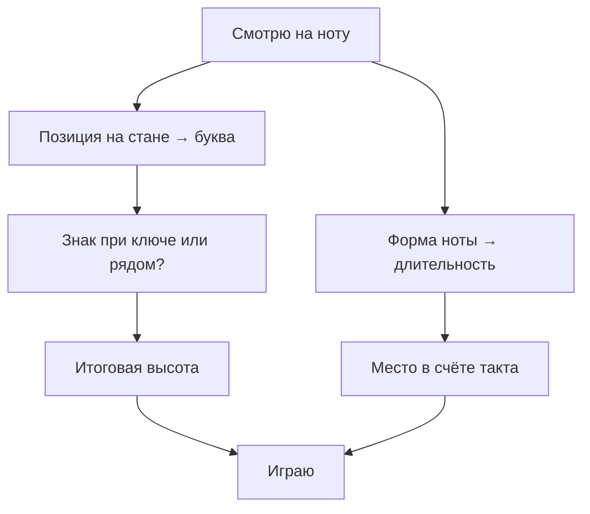

# Урок 03 — Читаем нотный стан: первые мелодии в скрипичном ключе

Длительность: **30 минут**. Нужны: браузер (musictheory.net), по желанию MuseScore и
инструмент.

Сразу честно: **ASCII не умеет рисовать нотный стан**. Схемы ниже показывают логику, но
настоящие ноты надо смотреть глазами — в упражнениях на musictheory.net или набирая их
в MuseScore. Этот урок ставит принцип и запускает ежедневную пятиминутку чтения.

## Разогрев

1. Назовите MIDI-номер `C4`.
2. Сколько полутонов между `E` и `F`?
3. Найдите на инструменте `G4`.

## Шаг 1. Что вообще делает ключ — 5 минут

Стан — пять линеек. Нота сидит либо **на линейке**, либо **между линейками**; каждый шаг
вверх по этой лестнице — следующая буква. Сама лестница ничего не значит, пока не сказано,
какая линейка чему равна. Это и говорит **ключ** (clef).

**Скрипичный ключ** (treble clef, он же G-clef) завитком обвивает **вторую линейку
снизу**, и объявляет: «здесь `G4`». Всё остальное отсчитывается от неё.

```text
      скрипичный ключ — схема, не настоящая нотация
  ──────────────  F5
        E5
  ──────────────  D5
        C5
  ──────────────  B4
        A4
  ──────────────  G4     ← завиток ключа обвивает эту линейку
        F4
  ──────────────  E4
        D4
        C4             ← добавочная линейка под станом (middle C)
```

Читается это так: **линейки** снизу вверх — `E4 G4 B4 D5 F5`; **промежутки** снизу вверх
— `F4 A4 C5 E5`. Мнемоники (английские, они же самые распространённые):

- линейки: **E**very **G**ood **B**oy **D**oes **F**ine;
- промежутки: складываются в слово **FACE**.

Ноты ниже `E4` и выше `F5` пишут на **добавочных линейках** (ledger lines) — коротких
черточках сверху или снизу. Первая такая нота снизу — `C4`, наш старый знакомый MIDI 60.

Басовый ключ (bass clef, F-clef) устроен по тому же принципу — он закрепляет `F3` на
четвёртой линейке снизу и нужен для левой руки на клавишах. Сейчас его **не трогаем**:
для гитары, вокала и правой руки хватает скрипичного. Басовый добавится в модуле
[`08-keyboard-foundations`](../../08-keyboard-foundations/index.md).

## Шаг 2. Знаки — 4 минуты

Три вещи, которые меняют звучание написанной ноты.

- **Знаки при ключе** (key signature) — диезы или бемоли сразу после ключа. Правило
  «все `F` в этой пьесе играются как `F#`». Компактная запись тональности; какие наборы
  бывают и почему именно такие — модуль
  [`03-scales-and-intervals`](../../03-scales-and-intervals/index.md).
- **Случайный знак** (accidental) — диез, бемоль или бекар прямо перед нотой. Действует
  **до конца такта** и только в своей октаве.
- **Бекар** (♮, natural) — отменяет действие знака.

Практическое следствие для чтения: увидев ноту, вы отвечаете на два вопроса —
«какая буква?» (по позиции на стане) и «есть ли знак?» (при ключе или рядом).

## Шаг 3. Высота и ритм — это две оси — 6 минут

Стан несёт **обе** оси сразу: по вертикали — высота, по горизонтали — время. Форма нотной
головки и хвоста задаёт длительность (целая, половинная, четверть, восьмая), как
разбиралось в [`01-sound-and-rhythm`](../../01-sound-and-rhythm/theory.md).

Новички обычно проваливают одну из осей: либо правильно называют ноты, но играют «как
получится» по времени, либо держат ритм и путают высоту. Поэтому тренируем по отдельности,
а вместе собираем осознанно:



Первый месяц полезно проговаривать вслух: «`G`, четверть, на счёт «два»». Медленно, зато
без накопления ошибок.

## Шаг 4. Пятиминутка чтения — 10 минут

Заходите на **musictheory.net → Exercises → Note Identification**. Настройки на старт:
только скрипичный ключ, диапазон от `C4` до `G5`, без знаков.

Правила сессии:

1. Отвечать **сразу**, не пересчитывая от `C4` вверх. Промахнулись — ничего, идём дальше.
2. Опираться на две якорные ноты: `G4` (линейка ключа) и `C4` (первая добавочная снизу).
3. Каждые две минуты — 15 секунд отдыха. Ошибки на четвёртой минуте почти всегда про
   внимание, а не про знание.

Цель на сегодня — **30 верных ответов подряд**. Дальше это упражнение живёт как ежедневная
пятиминутка до конца курса; примерно через две недели чтение перестаёт быть счётом и
становится узнаванием, как чтение букв.

```drill
type: free-form
prompt: "8 минут. musictheory.net → Exercises → Note Identification: только скрипичный ключ, диапазон C4–G5. Цель — 30 верных ответов подряд, отвечая без пересчёта от C4."
answer: "Диапазон и ключ выставлены как указано; вы отвечали от якорей G4 и C4, а не пересчётом; достигнуто не меньше 30 верных ответов подряд; среднее время ответа меньше 3 секунд; вы можете назвать две ноты, которые путались чаще всего."
check: manual
```

```drill
type: multiple-choice
prompt: "Какая нота сидит на второй линейке снизу в скрипичном ключе?"
options: ["E4", "G4", "B4", "C4"]
answer: "G4"
check: exact
```

## Шаг 5. Своя первая строчка — 5 минут

Откройте **MuseScore** (бесплатный, musescore.org), создайте пустую партитуру в
скрипичном ключе и наберите мышкой пять четвертей: `C4 D4 E4 F4 G4`. Нажмите
воспроизведение. Вы только что записали, увидели и услышали одно и то же — это самый
короткий путь от «нот на бумаге» к звуку.

Если хочется закрепить, наберите ту же строчку от `G4` вверх: `G4 A4 B4 C5 D5`. Рисунок
на стане будет тот же, просто выше — визуальное подтверждение того, что мелодия это
**узор шагов**, а не набор конкретных букв.

```drill
type: free-form
prompt: "5 минут. В MuseScore наберите в скрипичном ключе две строчки по пять четвертей: C4 D4 E4 F4 G4 и G4 A4 B4 C5 D5. Прослушайте обе и сравните рисунок на стане."
answer: "Обе строчки набраны и воспроизведены; вы видите, что рисунок на стане один и тот же, только сдвинут вверх; ноты набраны без подсказки-подписи под ними; файл сохранён (можно положить в misc/ домена)."
check: manual
hint: "Если MuseScore ещё не установлен, набросайте обе строчки от руки по схеме стана из этого урока."
```

## Итог

Ключ привязывает линейки к нотам: скрипичный закрепляет `G4` на второй линейке снизу,
линейки читаются как `E4 G4 B4 D5 F5`, промежутки — как `F4 A4 C5 E5` (слово FACE), а
`C4` живёт на первой добавочной линейке под станом. Знаки при ключе действуют на всю
пьесу, случайный знак — до конца такта, бекар отменяет. Стан несёт две оси одновременно,
и тренировать их надо порознь, а собирать сознательно.

Модуль закончен, когда вы читаете `C4`–`G5` без пересчёта и умеете найти любую ноту на
инструменте. Дальше — [`03-scales-and-intervals`](../../03-scales-and-intervals/index.md):
те же 12 нот, но уже как формулы гамм и интервалов.
