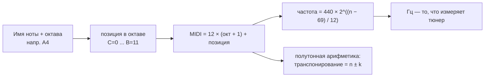

# Ноты и нотация

## Простыми словами

В музыке всего **12 нот**. Не двенадцать тысяч, не «сколько угодно» — ровно 12, после
чего всё начинается заново, только выше. Это замкнутый цикл, как часовой циферблат или
как `uint4` с переполнением: дошли до 11 — следующий шаг снова 0, но октавой выше.

Один шаг по этому циклу называется **полутон** (semitone, half step). На клавишах это
соседняя клавиша — любая, чёрная или белая. На гитаре это соседний лад. Всё остальное в
музыке — гаммы, интервалы, аккорды, тональности — это узоры, нарисованные на этих 12
позициях. Выучив цикл, вы получаете систему координат, в которой дальше всё
раскладывается по полочкам.

Названий у нот два набора. Русский: **до ре ми фа соль ля си**. Международный,
буквенный: **C D E F G A B**. Соответствие один в один:

| Буква | C | D | E | F | G | A | B |
|---|---|---|---|---|---|---|---|
| По-русски | до | ре | ми | фа | соль | ля | си |

Дальше в курсе — только буквы. Так подписаны аккорды в табах, так называются ноты в
любом DAW, в любом тюнере и в любом видео на YouTube. «До-ре-ми» останется мостиком
для перевода, когда попадётся русский учебник.

Заметьте: букв семь, а нот двенадцать. Пять оставшихся — это «чёрные клавиши», и им
дают имена через **диез** (♯, `#`, «на полутон выше») и **бемоль** (♭, `b`, «на полутон
ниже»): C♯, D♯, F♯, G♯, A♯ — или те же самые звуки как D♭, E♭, G♭, A♭, B♭.

## Зачем это нужно

Можно ли играть, не зная нот? Можно. Миллионы людей играют по табам и по картинкам
аккордов. Но есть три вещи, которые без нот не работают.

**Первое: разговор.** «Поставь капо на второй лад и играй как в C» — это уже разговор о
нотах. Барабанщик просит «дай тональность» — надо ответить буквой. Без имён нот вы
общаетесь жестами.

**Второе: перенос.** Выучили песню в G, а петь удобно в E — надо сдвинуть всё на
3 полутона вниз. Если аккорды у вас в голове как картинки, вы застряли. Если как ноты,
это арифметика: `G − 3 = E`.

**Третье: понимание, а не заучивание.** Аккорд `Am` — это не «форма, где пальцы стоят
вот так», а три конкретные ноты A, C, E. Как только это ясно, вы находите Am в пяти
местах на грифе и в трёх видах на клавишах, а не в одном заученном.

Есть и четвёртое, специфически приятное для программиста: у нот есть **числа**.
MIDI-номер — это просто индекс ноты в мировом хроматическом массиве, и вся теория
превращается в арифметику по модулю 12. Об этом ниже, и это самая быстрая дорога в
музыку из всех, что есть у человека, привыкшего к целым числам.

## Как устроено

### Цикл из 12 нот

Вот полный цикл, начиная от C. Внизу — MIDI-номера для четвёртой октавы, чтобы сразу
видеть арифметику:

```text
полутон:   0    1    2    3    4    5    6    7    8    9   10   11   12
нота:      C   C#    D   D#    E    F   F#    G   G#    A   A#    B    C
MIDI (4-я):60   61   62   63   64   65   66   67   68   69   70   71   72
```

Два наблюдения, которые надо усвоить прочно.

**Между E и F полутон. Между B и C полутон.** Во всех остальных парах соседних букв —
целый тон (два полутона). Семь букв разложены по 12 позициям неравномерно, и вот
почему: E♯ и B♯ в обычной записи не нужны — то, что «на полутон выше E», уже называется
F. Именно эти два места и делают всю мажорную гамму несимметричной, а тональности —
разными на вид. Формула гаммы разбирается в модуле
[`03-scales-and-intervals`](../03-scales-and-intervals/index.md); здесь достаточно
запомнить два «стыка»: **E–F и B–C**.

Мнемоника: в цикле есть две «дырки» без чёрной клавиши, и они ровно там, где на
клавиатуре белые клавиши стоят вплотную.

### Октавы

Пройти цикл целиком — значит подняться на **октаву** (octave). Октава — это удвоение
частоты: если A звучит на 440 Гц, то A на октаву выше — `440 × 2 = 880` Гц, а на октаву
ниже — `440 / 2 = 220` Гц. Ухо слышит их как «ту же самую ноту, только выше»: явление
настолько сильное, что во всех музыкальных культурах октаву называют одним именем.

Чтобы различать одинаковые буквы в разных октавах, к букве приписывают номер: `C4`,
`A4`, `E2`. Нумерация (scientific pitch notation) считает от `C`: октава начинается с C
и заканчивается на B, поэтому за `B3` идёт `C4`, а не `C3`. `C4` — то самое «до первой
октавы» в середине рояля.

### Диезы, бемоли и энгармонизм

Один и тот же чёрный звук называется двумя способами:

| Как диез | C♯ | D♯ | F♯ | G♯ | A♯ |
|---|---|---|---|---|---|
| Как бемоль | D♭ | E♭ | G♭ | A♭ | B♭ |

Это **энгармонические** равенства (enharmonic equivalents): разные имена, одна и та же
клавиша, один и тот же MIDI-номер. Выбор имени не косметика — он зависит от
тональности: в тональности с диезами пишут F♯, в тональности с бемолями — G♭ (модуль
03). Пока правило простое: **имена разные, звук один**.

Бывают и **дубль-диезы** (`F##`, звучит как G) с **дубль-бемолями** (`Gbb`, звучит как
F) — они нужны, чтобы не ломать логику записи в далёких тональностях; встретите редко,
пугаться нечего.

Отдельная ловушка с именами: в немецкой (и старой русской) традиции **H** означает то,
что мы называем B, а **B** означает B♭. Поэтому в старых сборниках попадается «H-moll» —
это си минор, наш `Bm`. В курсе используется международная система: `B` — это си, `Bb` —
си-бемоль.

### MIDI-номера: ноты как целые числа

Клавиши пронумерованы подряд от 0 до 127. Опорные точки, которые стоит знать наизусть:

| Нота | MIDI | Что это |
|---|---|---|
| A0 | 21 | самая низкая клавиша рояля (88 клавиш) |
| C4 | 60 | «до первой октавы», середина клавиатуры |
| A4 | 69 | камертонное ля, 440 Гц |
| C8 | 108 | самая высокая клавиша рояля |

Номер считается формулой, где C = 0, C♯ = 1, D = 2, … B = 11:

```text
MIDI = 12 × (номер октавы + 1) + позиция ноты в октаве

C4  = 12 × (4 + 1) + 0  = 60
A4  = 12 × (4 + 1) + 9  = 69
F#3 = 12 × (3 + 1) + 6  = 54
```

И обратно: `октава = MIDI / 12 − 1` (целочисленно), `позиция = MIDI % 12`. То есть
`MIDI 67` → `67 % 12 = 7` → это G, `67 / 12 − 1 = 4` → значит `G4`.

Из номера получается частота:

```text
частота = 440 × 2^((n − 69) / 12)

n = 69  →  440 Гц         (A4)
n = 81  →  880 Гц         (A5, октава = ×2)
n = 60  →  ≈ 261.63 Гц    (C4)
```

Множитель одного полутона — `2^(1/12) ≈ 1.0595`, примерно +5.9 % частоты. Двенадцать
таких шагов дают ровно ×2. Это **равномерная темперация** (equal temperament) —
компромисс, на котором настроены рояль, гитара и любой синтезатор.



**Осторожно с именами октав в DAW.** Номер MIDI 60 — это `C4` в научной нотации, но
Yamaha, Cubase и часть железа называют его `C3`. Разница ровно в одну октаву и она
никуда не денется. Правило: **доверяйте номеру, а не букве с цифрой**. Если в вашем DAW
средняя нота подписана `C3`, просто держите в голове сдвиг.

### Нотный стан

**Нотный стан** (staff) — пять линеек. Нота на линейке или между линейками; чем выше,
тем выше звук. Какая именно линейка что означает, задаёт **ключ** (clef).

- **Скрипичный ключ** (treble clef, G-clef) — для средних и высоких звуков: правая рука
  на клавишах, вся гитара, вокал. Завиток ключа обвивает вторую линейку снизу, и эта
  линейка = `G4`.
- **Басовый ключ** (bass clef, F-clef) — для низких: левая рука на клавишах, бас.
  Двоеточие ключа обхватывает четвёртую линейку снизу, и она = `F3`.

Между двумя станами ровно посередине живёт `C4` — **«до первой октавы»** (middle C). В
скрипичном ключе он на добавочной линейке под станом, в басовом — на добавочной линейке
над станом. Это шов, которым сшиты два ключа.

```text
      скрипичный ключ — схема, не настоящая нотация
  ──────────────  F5
        E5
  ──────────────  D5
        C5
  ──────────────  B4
        A4
  ──────────────  G4     ← завиток ключа обвивает эту линейку
        F4
  ──────────────  E4
        D4
        C4             ← добавочная линейка под станом (middle C)
```

**Добавочные линейки** (ledger lines) — короткие черточки для нот, вылезающих за пять
основных. ASCII их изображает плохо, настоящую нотацию лучше смотреть в MuseScore или в
разделе Lessons на musictheory.net.

Читать нотный стан — значит читать **две вещи одновременно**: по вертикали высоту, по
горизонтали ритм (форма нотной головки и хвоста = длительность; см.
[`01-sound-and-rhythm`](../01-sound-and-rhythm/theory.md)). Новички обычно осваивают
высоту и «зависают» на ритме или наоборот. Тренируйте по отдельности, потом вместе.

В начале стана стоят **знаки при ключе** (key signature) — набор диезов или бемолей,
действующий на всю пьесу: «здесь все F играются как F♯». Это компактная запись
тональности, и разбирается она в модуле
[`03-scales-and-intervals`](../03-scales-and-intervals/index.md). Знак, поставленный
прямо перед нотой (**случайный знак**, accidental), действует **до конца такта** и
только в своей октаве; **бекар** (♮, natural) отменяет действие знака.

### Альтернативная запись

Настоящие ноты — не единственный и не всегда лучший способ.

**TAB (табулатура)** — шесть линий = шесть струн гитары, цифра = номер лада. Тонкая
струна сверху, потому что так гриф выглядит, если посмотреть на него сверху вниз при
игре:

```text
e|--0--1--3--|
B|-----------|
G|-----------|
D|-----------|
A|-----------|
E|-----------|
```

Читается: открытая первая струна, потом она же на 1-м ладу, потом на 3-м. TAB честно
говорит, **куда ставить палец**, но почти ничего не говорит про ритм — поэтому её всегда
слушают вместе с записью.

**Аккордовые схемы** (chord boxes) — картинка грифа с точками. В ASCII их удобно писать
столбиком по струнам, где `0` — открытая, `x` — не играем:

```text
   Am            C
e|--0--        e|--0--
B|--1--        B|--1--
G|--2--        G|--0--
D|--2--        D|--2--
A|--0--        A|--3--
E|--x--        E|--x--
```

**Chord chart / lead sheet** — текст песни или мелодия, над которой выписаны буквы
аккордов. Это рабочий формат живой музыки: `C  G  Am  F` над строчкой — и группа играет.
Расшифровка символов вроде `Cmaj7` или `Csus4` — модуль
[`04-chords-and-harmony`](../04-chords-and-harmony/index.md).

**Piano-roll в DAW** — сетка: по вертикали MIDI-номера, по горизонтали время в тактах.
Для программиста это, честно говоря, самая понятная нотация в мире: обычная
двумерная матрица, где нота — прямоугольник с полями «pitch», «start», «length»,
«velocity». Ноты видно глазами, полутоны считаются линейкой, транспонирование — сдвиг
выделения вверх-вниз. Стан такого не умеет.

**MuseScore** (бесплатный, musescore.org) — инструмент, который переводит между всеми
этими форматами: набираете ноты, слышите их, экспортируете картинку или MIDI. Картинки
настоящей нотации удобно складывать в `misc/` домена.

## На гитаре

Гриф — линейная карта тех же 12 нот. **Один лад = один полутон.** Двенадцать ладов =
октава, поэтому нота на 12-м ладу — та же буква, что и открытая струна.

Открытые струны в стандартном строе, от толстой к тонкой:

| Струна | 6 | 5 | 4 | 3 | 2 | 1 |
|---|---|---|---|---|---|---|
| Нота | E2 | A2 | D3 | G3 | B3 | E4 |
| MIDI | 40 | 45 | 50 | 55 | 59 | 64 |

Мнемоника снизу вверх: **E A D G B E**. Обратите внимание на MIDI-числа: между струнами
5 полутонов, кроме пары G–B, где 4. Эта «дырка» в строе — причина, по которой формы
аккордов ломаются на второй струне; на неё потом уходит половина объяснений в модуле
[`06-guitar-foundations`](../06-guitar-foundations/index.md).

Полная карта первых 12 ладов. Распечатайте или срисуйте — она нужна на каждом занятии:

```text
лад      0    1    2    3    4    5    6    7    8    9   10   11   12
1 (e)    E    F   F#    G   G#    A   A#    B    C   C#    D   D#    E
2 (B)    B    C   C#    D   D#    E    F   F#    G   G#    A   A#    B
3 (G)    G   G#    A   A#    B    C   C#    D   D#    E    F   F#    G
4 (D)    D   D#    E    F   F#    G   G#    A   A#    B    C   C#    D
5 (A)    A   A#    B    C   C#    D   D#    E    F   F#    G   G#    A
6 (E)    E    F   F#    G   G#    A   A#    B    C   C#    D   D#    E
```

Точки-маркеры на грифе стоят на 3, 5, 7, 9 и двойная на 12 ладу — это ваши
«километровые столбы». Полезные привязки: на 5-м ладу шестой струны — A, на 5-м ладу
пятой — D, на 7-м шестой — B. Одна и та же нота на грифе есть в нескольких местах, и это
не баг, а свобода выбора аппликатуры.

## На клавишах

Клавиатура — самая честная картинка 12 нот: 12 клавиш подряд и снова то же самое.

```text
    C#   D#        F#   G#   A#
    Db   Eb        Gb   Ab   Bb
 ___________________________________
|   |#|  |#|       |#|  |#|  |#|   |
|   |#|  |#|       |#|  |#|  |#|   |
|   |_|  |_|       |_|  |_|  |_|   |
|    |    |    |    |    |    |    |
| C  | D  | E  | F  | G  | A  | B  |
|____|____|____|____|____|____|____|
```

Главный трюк ориентации: **чёрные клавиши сгруппированы по 2 и по 3**. Отсюда:

- **C** — белая клавиша слева от группы из **двух** чёрных;
- **F** — белая клавиша слева от группы из **трёх** чёрных;
- пары белых клавиш без чёрной между ними — это и есть **E–F** и **B–C**.

Найдите C, и всё остальное отсчитывается вправо. На 61-клавишной MIDI-клавиатуре обычно
пять C; средняя из них — `C4` = MIDI 60. На 88-клавишном пианино C4 — четвёртая C
слева, ориентир — логотип производителя примерно над ней.

Полезное упражнение прямо сейчас, даже без инструмента: закройте буквенный ряд на
диаграмме выше и назовите каждую белую клавишу по группам чёрных. Двадцать секунд —
и ориентация начинает работать без подсчёта.

Постановка рук, номера пальцев и первые гаммы — модуль
[`08-keyboard-foundations`](../08-keyboard-foundations/index.md).

## Послушай

Слушать здесь надо не мелодии, а сам факт «нота = высота = число».

- **Камертон A = 440 Гц.** Любой тюнер (например, GuitarTuna) показывает и ноту, и
  частоту. Спойте «а-а-а» в микрофон и посмотрите, что покажет прибор. Это самый
  быстрый способ поверить, что высота измерима.
- **Октава.** Возьмите на клавишах C4 и C5 по очереди, потом вместе. Разные звуки, но
  «одна и та же нота» — ухо схлопывает удвоение частоты. То же на гитаре: открытая
  шестая струна E и она же на 12-м ладу.
- **Полутон.** C и C♯ подряд. Тесно, неуютно, «как в саундтреке к фильму про акулу» —
  тема из «Jaws» Джона Уильямса построена ровно на этом шаге. Сравните с целым тоном
  C–D: заметно шире и спокойнее.
- **Энгармонизм на слух проверить нельзя.** Сыграйте C♯, потом объявите ту же клавишу
  D♭. Звук не изменился — только имя. Это важное подтверждение, что энгармонизм про
  запись, а не про звук.
- **Один и тот же звук, разные тембры.** Возьмите A4 (MIDI 69) на гитаре (5-я струна,
  12-й лад) и на клавишах. Высота одна, «голос» разный — почему это так, разобрано в
  [`01-sound-and-rhythm`](../01-sound-and-rhythm/theory.md).

## Типичные ошибки

- **Учить формы аккордов, не зная нот в них.** Классика гитариста-самоучки: пять
  картинок в пальцах и ноль понимания. Лечится вопросом «какие три ноты я сейчас
  зажал?» — задавайте его себе каждый раз в первые месяцы.
- **Считать, что диез и бемоль — разные звуки.** C♯ и D♭ — одна клавиша. Разными их
  делает только контекст записи.
- **Искать E♯ или B♯ на клавиатуре как чёрную клавишу.** Между E и F, как и между B и
  C, чёрной клавиши нет: там уже полутон.
- **Путаница с именами октав в DAW.** «У меня C3 = 60, а в учебнике C4» — это разные
  системы подписи, а не ошибка. Номер надёжнее.
- **Читать TAB как ноты.** TAB не содержит ритма и почти не содержит длительностей.
  Играть по табу «как написано» и без записи — верный способ выучить песню неправильно.
- **Ждать, что стан «прочитается сам».** Чтение нот — навык доступа к памяти, как
  скоропечатание. Пять минут в день на musictheory.net дают больше, чем час раз в
  неделю.
- **Учить сразу оба ключа.** Начните со скрипичного: он нужен для гитары, вокала и
  правой руки. Басовый добавляйте, когда придёте к клавишам.
- **Отсчитывать каждую ноту от C.** Первое время это нормально, но цель — узнавать ноту
  сразу. Помогают опорные точки: G4 на линейке ключа, C4 под станом, точки-маркеры на
  грифе.

## Словарь терминов

- **Полутон (semitone, half step)** — минимальный шаг: соседняя клавиша, соседний лад.
- **Целый тон (tone, whole step)** — два полутона.
- **Октава (octave)** — 12 полутонов; удвоение частоты (`440 × 2 = 880`).
- **Диез (♯, sharp)** — на полутон выше. **Бемоль (♭, flat)** — на полутон ниже.
  **Бекар (♮, natural)** — отмена знака.
- **Энгармонизм (enharmonic equivalence)** — одна высота под разными именами: C♯ = D♭.
- **Хроматический звукоряд (chromatic scale)** — все 12 нот подряд.
- **MIDI-номер** — целое число 0–127, индекс ноты; `C4 = 60`, `A4 = 69`.
- **Равномерная темперация (equal temperament)** — деление октавы на 12 равных
  полутонов, множитель `2^(1/12) ≈ 1.0595`.
- **Нотный стан (staff)** — пять линеек для записи высоты.
- **Ключ (clef)** — знак, задающий привязку линеек к нотам: скрипичный (G4 на второй
  линейке), басовый (F3 на четвёртой).
- **До первой октавы (middle C)** — `C4`, MIDI 60, стык скрипичного и басового ключей.
- **Добавочная линейка (ledger line)** — черта для нот вне пяти основных линеек.
- **Знаки при ключе (key signature)** — диезы/бемоли в начале стана, действующие на всю
  пьесу.
- **Случайный знак (accidental)** — знак перед нотой, действует до конца такта.
- **Табулатура (TAB)** — запись «струна + лад» без ритма.
- **Аккордовая схема (chord box)** — картинка грифа с точками пальцев.
- **Lead sheet / chord chart** — мелодия или текст с буквами аккордов сверху.
- **Piano-roll** — сетка «MIDI-номер × время» в DAW.

## См. также

- **musictheory.net** → Lessons: «The Staff, Clefs, and Ledger Lines», «Note
  Identification»; Exercises → «Note Identification» и «Keyboard Identification» —
  пять минут в день, и стан начинает читаться.
- **teoria.com** → Reading Music — те же темы с упражнениями.
- **Open Music Theory** (openmusictheory.github.io) — бесплатный открытый учебник,
  разделы про нотацию и высоту.
- **Michael Pilhofer, Holly Day, «Music Theory For Dummies»** — главы про ноты, стан и
  ключи; самый мягкий вход из книг.
- **MuseScore** (musescore.org) — набрать, услышать, экспортировать настоящую нотацию.
- **GuitarTuna** — тюнер, который показывает ноту и частоту одновременно.
- Предыдущий модуль: [`01-sound-and-rhythm`](../01-sound-and-rhythm/index.md) — пульс,
  темп, длительности; вторая половина чтения нот.
- Следующий модуль: [`03-scales-and-intervals`](../03-scales-and-intervals/index.md) —
  гаммы, интервалы, тональности и знаки при ключе.
- Практика на инструментах: [`06-guitar-foundations`](../06-guitar-foundations/index.md)
  и [`08-keyboard-foundations`](../08-keyboard-foundations/index.md).
- Уроки модуля: [`lessons/01-twelve-notes-keyboard-fretboard.md`](./lessons/01-twelve-notes-keyboard-fretboard.md),
  [`lessons/02-midi-numbers-and-semitones.md`](./lessons/02-midi-numbers-and-semitones.md),
  [`lessons/03-reading-treble-clef.md`](./lessons/03-reading-treble-clef.md).
