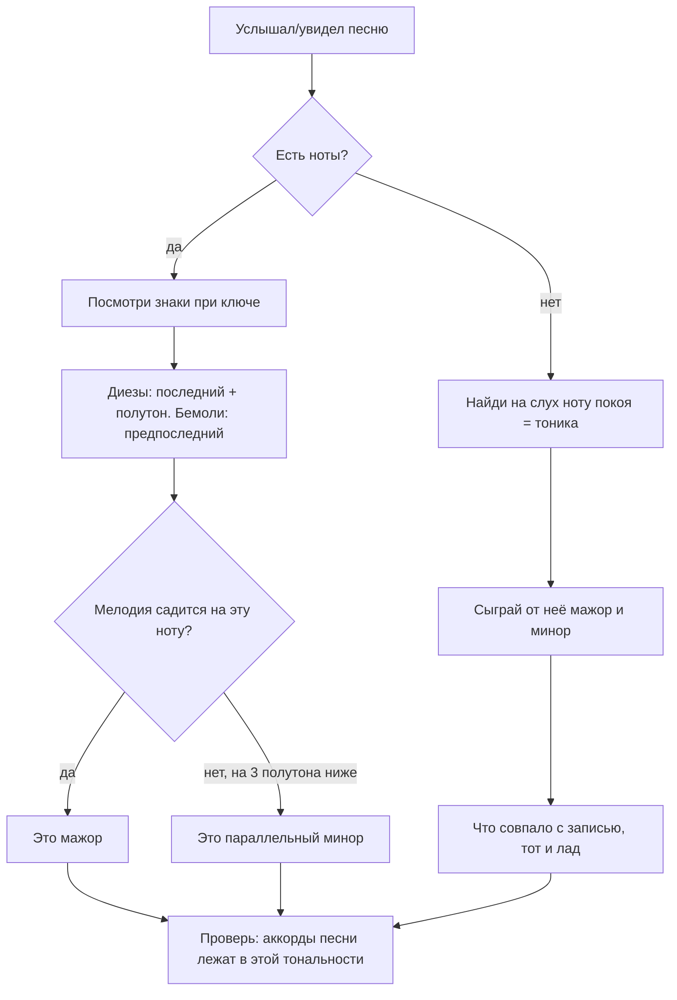

# Интервалы, тональности и кварто-квинтовый круг

Первая часть теории модуля — гаммы: [`theory.md`](./theory.md).

## Простыми словами

**Интервал** — расстояние между двумя нотами. Единица измерения — полутон. Всё.

Дальше начинается небольшая бюрократия, и её стоит понять один раз. У интервала два
имени, потому что музыканты считают двумя разными способами:

- **сколько полутонов** — это физика, число от 0 до 12 (и дальше);
- **сколько букв** (ступеней) он покрывает, включая обе крайние — это запись на бумаге.

От C до E — 4 полутона и три буквы (C, D, E), поэтому интервал называется **терцией**
(«третья») и уточняется как **большая**: б3, по-английски M3 или «major third». От C до
Eb — тоже три буквы, но 3 полутона: **малая терция**, м3. Разное качество, одна и та же
«третья».

Программистская аналогия: номер («терция») — это тип, качество («большая/малая») — это
значение внутри типа. На инструменте вы играете полутоны, на бумаге читаете буквы, и
названия интервалов — просто мост между двумя представлениями.

**Тональность** (key) — это гамма плюс договорённость, какая нота работает домом. Знаки
при ключе — компактная запись «в этой пьесе такие-то ноты повышены/понижены всегда».
**Кварто-квинтовый круг** — карта всех тональностей, выложенная так, чтобы соседи
отличались одним знаком.

## Зачем это нужно

1. **Интервалы — язык аккордов.** Мажорное трезвучие в модуле 04 определяется как «б3
   плюс м3 сверху». Без интервалов это придётся заучивать двенадцать раз.
2. **Интервалы — язык слуха.** Узнавание интервалов — базовый навык модуля
   [`05-ear-training-and-practice`](../05-ear-training-and-practice/index.md). Подобрать
   мелодию — значит услышать цепочку интервалов и ступеней.
3. **Знаки при ключе экономят внимание.** Увидели два диеза — знаете, что песня почти
   наверняка в D-мажоре или B-миноре, и что F и C всегда повышены.
4. **Круг квинт объясняет, почему аккорды в песнях стоят рядом.** Соседи по кругу — это
   те самые аккорды, которые в тысячах песен идут друг за другом.
5. **Транспозиция — рутинная операция.** «Слишком высоко, давай на три полутона ниже» —
   на клавишах это сдвиг, на гитаре каподастр, в DAW параметр transpose.

Есть и шестая причина, важная лично для взрослого новичка: интервалы дают **объективную
обратную связь**. «Звучит как-то не так» — бесполезная формулировка, с ней ничего не
сделаешь. «Я взял м3 вместо б3» — уже задача с решением. Как только у ошибок появляются
имена, обучение перестаёт быть угадыванием и становится отладкой, а это ровно тот режим
работы, в котором программист чувствует себя как дома.

Разумный порядок освоения: сначала уверенно считать полутоны на бумаге и на инструменте,
потом узнавать интервалы на слух, и только потом браться за подбор песен. Пропустить
первый шаг соблазнительно, но именно он делает второй возможным.

## Как устроено

### Таблица интервалов

Основа, которую стоит знать наизусть. Обозначения: `ч` — чистый (perfect), `м` — малый
(minor), `б` — большой (major), `ув` — увеличенный (augmented), `ум` — уменьшённый
(diminished).

| Полутонов | Название | Кратко | От C |
|---|---|---|---|
| 0 | чистая прима (unison) | ч1 | C |
| 1 | малая секунда (minor 2nd) | м2 | Db |
| 2 | большая секунда (major 2nd) | б2 | D |
| 3 | малая терция (minor 3rd) | м3 | Eb |
| 4 | большая терция (major 3rd) | б3 | E |
| 5 | чистая кварта (perfect 4th) | ч4 | F |
| 6 | тритон (ув4 / ум5) | тритон | F# / Gb |
| 7 | чистая квинта (perfect 5th) | ч5 | G |
| 8 | малая секста (minor 6th) | м6 | Ab |
| 9 | большая секста (major 6th) | б6 | A |
| 10 | малая септима (minor 7th) | м7 | Bb |
| 11 | большая септима (major 7th) | б7 | B |
| 12 | чистая октава (octave) | ч8 | C |

Почему одни интервалы «чистые», а другие «большие/малые»? Историческая, но удобная
договорённость: прима, кварта, квинта и октава существуют в одном основном виде и
называются чистыми; секунда, терция, секста и септима — в двух видах, большом и малом.
Поэтому «мажорной квинты» не бывает, а «чистой терции» — тоже нет. Если чистый интервал
всё-таки изменили на полутон, он становится увеличенным или уменьшённым: ч5 минус
полутон = ум5, ч4 плюс полутон = ув4. И то и другое — 6 полутонов, тот самый тритон.

### Как назвать интервал за три шага

Алгоритм, который работает всегда и не требует таблицы под рукой:

```text
1. Посчитай буквы, включая обе крайние ноты  →  номер интервала
      C .. G  =  C D E F G  =  5  →  квинта
2. Посчитай полутоны                          →  качество
      C → G = 7 полутонов
3. Сверь: у чистой квинты 7 полутонов          →  ч5
      6 полутонов при пяти буквах = ум5, 8 = ув5
```

Проверка на паре потруднее: от D до Bb. Букв — D E F G A B, то есть шесть, значит секста.
Полутонов — D→Bb это 8. Большая секста была бы 9, значит здесь **м6**. Обратите внимание,
что путь через полутоны и путь через буквы обязаны сойтись: если у вас получилось «пять
букв и 8 полутонов», перечитайте, скорее всего вы записали Bb как A#, и тогда номер станет
другим при том же звучании. Это и есть смысл энгармонизма из модуля
[`02-notes-and-notation`](../02-notes-and-notation/theory.md): звук один, имена разные,
и от имени зависит название интервала.

### Тритон

Тритон (tritone) — ровно половина октавы, 6 полутонов, три тона (отсюда имя). У него два
любопытных свойства: он единственный интервал, который при обращении даёт сам себя, и он
звучит настолько неустойчиво, что требует разрешения. Именно поэтому он живёт внутри
доминантсептаккорда и тянет музыку домой (модуль
[`04-chords-and-harmony`](../04-chords-and-harmony/index.md)). Никакой мистики про
«дьявольский интервал» не надо: средневековое прозвище *diabolus in musica* — это про
неудобство в пении и правила того времени, а не про свойства звука. В блюзе, джазе и
метале тритон работает круглосуточно и никого не пугает.

### Обращение интервалов

Перенесите нижнюю ноту на октаву вверх — получите **обращение** (inversion). Правило
арифметики простое и приятное:

```text
номера складываются в 9:      м3 ↔ б6      ч4 ↔ ч5      б2 ↔ м7      ч1 ↔ ч8
полутоны складываются в 12:   3 + 9 = 12   5 + 7 = 12   2 + 10 = 12
качество меняется:            малый ↔ большой, чистый остаётся чистым
```

Практическая польза: научившись узнавать шесть интервалов, вы автоматически получаете
остальные шесть. И на грифе это объясняет фокус «квинта вверх = кварта вниз».

### Консонанс и диссонанс

Грубо, но рабочая классификация:

- **Совершенные консонансы**: ч1, ч8, ч5. Звучат слитно, «пусто», без напряжения.
- **Несовершенные консонансы**: б3, м3, б6, м6. Мягкие, «сладкие» — на них построена
  почти вся гармония.
- **Диссонансы**: м2, б2, м7, б7, тритон. Напряжённые, требуют продолжения.
- **Кварта** ч4 — пограничный случай: в одном контексте консонанс, в другом требует
  разрешения. Не пугайтесь, если в разных учебниках она попадёт в разные списки.

Важно: диссонанс — не «плохо». Диссонанс — это двигатель. Музыка из одних консонансов
усыпляет.

### Составные интервалы

Всё, что больше октавы, называют составным: 13 полутонов — м9 (октава + м2), 14 — б9, 16 —
б10, 17 — ч11, 21 — б13. Обычно достаточно правила «вычти 12 и назови остаток», а полные
имена всплывают в названиях аккордов вроде `Cadd9` или `C13`.

### Звучание интервалов: песни-якоря

Считать полутоны вы научитесь за вечер, узнавать интервалы на слух — за месяцы. Ускоряет
дело один приём: к каждому интервалу привязывается известная мелодия, начинающаяся с
него. Проверенные якоря:

```text
м2  (1)  «Jaws» — тема Джона Уильямса, два чередующихся звука
б2  (2)  «Happy Birthday to You» — «хэп-пи»
м3  (3)  «Smoke on the Water» (Deep Purple) — первый скачок рифа
б3  (4)  «When the Saints Go Marching In» — первые два звука
ч4  (5)  «Bridal Chorus» Вагнера («Here Comes the Bride»); «Amazing Grace»
трит(6)  «Maria» из «West Side Story»; тема «The Simpsons»
ч5  (7)  «Twinkle Twinkle Little Star»; главная тема «Star Wars»
м6  (8)  надёжного массового якоря нет — тренировать в приложении
б6  (9)  «My Bonnie Lies Over the Ocean» — первые два звука
м7  (10) «Somewhere» из «West Side Story» — «There's a place for us»
б7  (11) якоря ненадёжны — узнавать как «почти октава, но режет»
ч8  (12) «Somewhere Over the Rainbow» — «Some-where»
```

Про м6 и б7 честно: общепринятых удобных якорей у них нет, и лучше не выдумывать свой на
песне, в которой вы не уверены. Проверь на слух в тренажёре и запомни характер: м6 —
«почти квинта, но темнее», б7 — «октава, до которой чуть-чуть не дотянули». Методика
тренировки (сколько минут, в каком порядке, как петь) — в модуле
[`05-ear-training-and-practice`](../05-ear-training-and-practice/theory.md).

### Какие интервалы живут внутри мажорной гаммы

Полезная таблица, к которой мы будем возвращаться в модуле 04: интервалы от тоники до
каждой ступени мажора и минора.

| Ступень | В мажоре | Полутонов | В натуральном миноре | Полутонов |
|---|---|---|---|---|
| I | ч1 | 0 | ч1 | 0 |
| II | б2 | 2 | б2 | 2 |
| III | б3 | 4 | м3 | 3 |
| IV | ч4 | 5 | ч4 | 5 |
| V | ч5 | 7 | ч5 | 7 |
| VI | б6 | 9 | м6 | 8 |
| VII | б7 | 11 | м7 | 10 |

Различий ровно три: III, VI и VII ступени в миноре на полутон ниже. Отсюда и обозначение
минора формулой `1 2 b3 4 5 b6 b7` — «мажор с тремя пониженными ступенями». Такая запись
удобнее для инструмента: не надо каждый раз выписывать всю гамму, достаточно помнить, что
именно понижено.

Заметьте также, что кварта и квинта одинаковы в обоих ладах. Поэтому квинта — самый
«нейтральный» интервал: она не выдаёт, мажор перед нами или минор. На этом и держится
power chord, в котором вообще нет терции.

### Тональность и знаки при ключе

**Тональность** = гамма + тоника как центр тяготения. «Песня в A-миноре» значит: ноты
A B C D E F G, дом — A.

Чтобы не ставить диезы и бемоли перед каждой нотой, их выносят один раз в начало строки —
это **знаки при ключе** (key signature). И появляются они в строго фиксированном порядке.

```text
порядок диезов:  F  C  G  D  A  E  B      («фа-до-соль-ре-ля-ми-си»)
порядок бемолей: B  E  A  D  G  C  F      (тот же список наоборот)
```

Порядок не произвольный: каждый следующий диез стоит на чистую квинту выше предыдущего.
Отсюда и название круга.

| Диезы | Мажор | Минор | Бемоли | Мажор | Минор |
|---|---|---|---|---|---|
| 0 | C | Am | 0 | C | Am |
| 1 F# | G | Em | 1 Bb | F | Dm |
| 2 F# C# | D | Bm | 2 Bb Eb | Bb | Gm |
| 3 + G# | A | F#m | 3 + Ab | Eb | Cm |
| 4 + D# | E | C#m | 4 + Db | Ab | Fm |
| 5 + A# | B | G#m | 5 + Gb | Db | Bbm |
| 6 + E# | F# | D#m | 6 + Cb | Gb | Ebm |

Два фокуса для быстрого чтения:

```text
диезы:  последний диез + полутон = тоника мажора       (F# C# G# → G# + 1 = A)
бемоли: предпоследний бемоль = тоника мажора            (Bb Eb Ab → Eb)
минор:  на 3 полутона ниже мажора с теми же знаками     (A-мажор → F#-минор)
```

Знаки при ключе действуют на всю пьесу и на все октавы. Отдельный знак, встреченный
внутри такта, — **случайный знак** (accidental): он действует до конца этого такта, а
**бекар** (♮, natural) отменяет действие знака. Детали чтения — модуль
[`02-notes-and-notation`](../02-notes-and-notation/theory.md).

### Энгармонические тональности: F# или Gb

Шесть диезов и шесть бемолей дают одни и те же клавиши: F#-мажор и Gb-мажор звучат
идентично. Выбор между ними — вопрос удобства чтения, а не звука. Гитаристы почти всегда
пишут диезами (`F#m`, `C#m`), потому что думают ладами вверх; духовики и джазовые
аранжировщики часто предпочитают бемоли (`Eb`, `Ab`, `Bb` — «свои» тональности для
трубы и саксофона). Если вам достался лист с семью диезами и вы не понимаете, зачем так
сделали, — обычно затем, чтобы соседняя часть пьесы читалась проще.

Практический вывод: не спорьте с записью, просто переведите её в полутоны. Инструмент про
знаки ничего не знает.

### Кварто-квинтовый круг

Выложим все тональности по кругу так, чтобы вправо каждый шаг был на чистую квинту вверх
(+7 полутонов), а влево — на чистую кварту вверх (+5 полутонов, то есть квинта вниз).
Через 12 шагов вы вернётесь в исходную точку — круг замкнётся.

```text
        C(0)
   F(1b)     G(1#)
 Bb(2b)        D(2#)
Eb(3b)          A(3#)
 Ab(4b)        E(4#)
  Db(5b)     B(5#)
    Gb(6b) / F#(6#)

вправо  = +7 полутонов (квинта вверх): C G D A E B F#
влево   = +5 полутонов (кварта вверх): C F Bb Eb Ab Db Gb
внутри  = параллельные миноры: Am Em Bm F#m C#m G#m / Dm Gm Cm Fm Bbm Ebm
```

Зачем он нужен на практике:

1. **Знаки при ключе** читаются с круга мгновенно: положение = количество знаков.
2. **Соседние тональности** отличаются одной нотой, поэтому модуляция (переход) в соседа
   почти незаметна на слух. Отсюда популярность перехода «в квинту» в припевах.
3. **Ходы аккордов.** Движение по кругу влево — это цепочка `... → ii → V → I`, самый
   частый оборот в музыке вообще. Круг буквально показывает, «откуда аккорд хочет прийти».
4. **Порядок изучения.** Разумно учить тональности по кругу от C, а не по алфавиту: каждая
   следующая добавляет ровно один новый знак.
5. **Настройка гитары.** Строй E A D G B E — это в основном цепочка чистых кварт, то есть
   шаги по кругу влево. Отсюда и удобство «квинтовых» форм на грифе.



### Транспозиция

**Транспозиция** (transposition) — сдвиг всех нот на одно и то же число полутонов.
Структура сохраняется, высота меняется. В MIDI это буквально прибавление числа:

```text
мелодия:      C4  E4  G4      = 60  64  67
+2 полутона:  D4  F#4 A4      = 62  66  69     (из C-мажора в D-мажор)
-3 полутона:  A3  C#4 E4      = 57  61  64     (в A-мажор)
```

Как это делается в жизни:

- **В DAW** — параметр `transpose` на MIDI-треке или сдвиг всех нот в piano-roll.
- **На клавишах** — играете тот же рисунок ступеней от другой тоники; меняются чёрные
  клавиши, аппликатура и ощущение под рукой (модуль
  [`09-keyboard-chords-and-songs`](../09-keyboard-chords-and-songs/index.md)).
- **На гитаре** — сдвиг формы на N ладов или **каподастр**: зажали 2-й лад, играете
  «как в C», звучит в D. Ноль пересчёта в голове (модуль
  [`07-guitar-scales-and-songs`](../07-guitar-scales-and-songs/index.md)).
- **Для голоса** — самая частая причина транспонировать: песня не влезает в диапазон.
  Двигайте вниз по полутону, пока не станет комфортно, и не считайте это жульничеством.

Транспонируя аккорды, сдвигайте не буквы, а ступени: `C–G–Am–F` — это `I–V–vi–IV`, и в
D-мажоре это `D–A–Bm–G`. Так вы не собьётесь и попутно запомните прогрессию в переносимом
виде (модуль [`04-chords-and-harmony`](../04-chords-and-harmony/index.md)).

И отдельная оговорка про транспонирование записанного нотами материала: сдвигая ноты,
не забудьте сменить знаки при ключе, иначе получится другая гамма. В DAW этой проблемы
нет вовсе — там есть только номера, и `+2` работает всегда. Ещё одна причина, по которой
piano-roll — самый честный способ увидеть, что транспозиция это просто сложение.

## На гитаре

Интервалы на грифе — это геометрия, и это главное преимущество гитары для теории. Формы
не зависят от тональности.

```text
по одной струне: интервал = число ладов
   +1 лад = м2, +2 = б2, +3 = м3, +4 = б3, +5 = ч4, +7 = ч5, +12 = октава

через струну (стандартный строй):
   ч5  = соседняя тонкая струна, +2 лада     кроме перехода G→B (там +3)
   ч4  = соседняя тонкая струна, тот же лад  кроме G→B (там -1 лад)
   окт = через одну струну, +2 лада          кроме случаев со струной B (+3)
```

Пример на шестой и пятой струнах: E на 6-й струне, лад 5 (нота A) и 5-я струна, лад 7
(нота E) — это чистая квинта. Та же форма на любых двух соседних басовых струнах даст
квинту всегда. Именно из неё делают power chords в модуле
[`07-guitar-scales-and-songs`](../07-guitar-scales-and-songs/index.md).

Оговорка про струну B существует потому, что строй гитары — четыре кварты, потом одна
большая терция (G→B), потом снова кварта. Это компромисс ради удобства аккордов, и цена
компромисса — «сдвиг на один лад» во всех формах, пересекающих струну B. Запомните это
один раз, и половина будущих недоумений на грифе исчезнет.

## На клавишах

На клавиатуре интервал — это счёт клавиш **подряд, включая чёрные**. Кладёте палец на C,
считаете вправо: 1 — C#, 2 — D, 3 — D#, 4 — E. Четыре — большая терция, всё сходится.

```text
от C, отмечены ч5 (G) и б3 (E)
    C#   D#        F#   G#   A#
    Db   Eb        Gb   Ab   Bb
 ___________________________________
|   |#|  |#|       |#|  |#|  |#|   |
|   |#|  |#|       |#|  |#|  |#|   |
|   |_|  |_|       |_|  |_|  |_|   |
|    |    |    |    |    |    |    |
| C* | D  | E* | F  | G* | A  | B  |
|____|____|____|____|____|____|____|
```

Полезные визуальные ориентиры, которые экономят счёт: ч5 от белой клавиши почти всегда
белая (единственное исключение среди семи — от B квинта даёт F#); б3 от C, F и G — белая,
от D, E, A и B — чёрная. Тритон от F — это B, единственная пара белых клавиш на 6
полутонов.

Знаки при ключе на клавишах читаются буквально глазами: сколько чёрных клавиш вошло в
гамму, столько знаков в тональности. C — ноль чёрных, G — одна (F#), D — две, F#-мажор —
пять. Аппликатуры и голосоведение — модуль
[`08-keyboard-foundations`](../08-keyboard-foundations/index.md).

## Послушай

- **Квинта** — начало «Twinkle Twinkle Little Star» и главная тема «Star Wars» (Джон
  Уильямс): открытый, «пустой» звук, который трудно спутать.
- **Кварта** — «Bridal Chorus» Вагнера: тот же характер, но «уже» и с ощущением шага.
- **Тритон** — первые два звука «Maria» из «West Side Story» и вступление темы
  «The Simpsons»: слышно, что интервал не может стоять на месте.
- **Октава** — «Somewhere Over the Rainbow»: одна и та же нота, только выше, поэтому она
  звучит как «то же самое, но светлее».
- **Движение по квинтам** — «Hey Joe» (Jimi Hendrix): аккорды идут вверх по кругу
  (C–G–D–A–E). Проверь по аккордам, но эффект «каждый следующий аккорд ближе к дому»
  слышен сразу.
- **Каноническая цепочка по кругу** — Канон ре мажор Пахельбеля: учебный пример
  последовательности, где почти каждый шаг — движение по кругу квинт.

Как слушать интервалы правильно: сначала два звука по очереди (мелодически), потом
одновременно (гармонически) — это два разных навыка, и гармонический даётся труднее.
Сыграйте интервал на инструменте, пропойте его, потом включите якорную песню и сравните.
Если пение кажется неловким — так и должно быть на первых занятиях; голос здесь не
искусство, а измерительный прибор. Полный протокол — модуль
[`05-ear-training-and-practice`](../05-ear-training-and-practice/index.md).

## Типичные ошибки

- **Считать интервал по буквам вместо полутонов.** «От E до G — четыре, обе крайние
  считаем, значит терция» — верно; но какая, малая или большая, решают только полутоны.
  Здесь их 3, значит м3.
- **Говорить «мажорная квинта» или «чистая терция».** Квинта, кварта, прима и октава —
  чистые; секунда, терция, секста и септима — большие или малые.
- **Забывать, что ув4 и ум5 звучат одинаково.** На инструменте это одна и та же пара
  клавиш, различие только в записи и в том, куда интервал «хочет» разрешиться.
- **Мистика вокруг тритона.** Это просто половина октавы.
- **Путать порядок диезов и бемолей.** Списки зеркальны: диезы F C G D A E B, бемоли ровно
  наоборот.
- **Определять тональность по первому аккорду.** Смотрите на знаки при ключе и на ноту
  покоя, а не на первый такт.
- **Учить круг квинт как картинку.** Он полезен как инструмент: «сколько знаков»,
  «кто сосед», «куда тянет». Нарисуйте его сами по памяти — это лучшая проверка.
- **Транспонировать буквы вместо ступеней.** Пересчитывайте прогрессию в римские цифры,
  потом собирайте в новой тональности.
- **Забывать про струну B на гитаре.** Все формы, пересекающие её, сдвигаются на лад.
- **Считать интервал только вверх.** Вниз он называется так же, но опорной становится
  верхняя нота: от G вниз до C — кварта, а не квинта. Полутоны при этом честно те же 5.
- **Учить якорные песни, не проверив их.** Если вы не уверены, что помните начало мелодии
  точно, якорь будет закреплять ошибку. Сначала послушайте запись, потом закрепляйте.

## Словарь терминов

- **Интервал (interval)** — расстояние между двумя нотами; измеряется в полутонах.
- **Чистый интервал (perfect)** — прима, кварта, квинта, октава.
- **Большой / малый (major / minor)** — два вида секунды, терции, сексты, септимы.
- **Увеличенный / уменьшённый (augmented / diminished)** — чистый или большой/малый
  интервал, изменённый на полутон.
- **Тритон (tritone)** — 6 полутонов, половина октавы; ув4 = ум5.
- **Обращение интервала (inversion)** — перенос нижней ноты на октаву вверх; номера дают
  9, полутоны — 12.
- **Консонанс / диссонанс** — слитное, спокойное звучание против напряжённого,
  требующего продолжения.
- **Составной интервал (compound interval)** — больше октавы; вычти 12 и назови остаток.
- **Тональность (key)** — гамма плюс тоника как центр тяготения.
- **Знаки при ключе (key signature)** — диезы или бемоли, выписанные один раз в начале
  строки и действующие на всю пьесу.
- **Случайный знак (accidental)** — знак внутри такта; действует до конца такта.
- **Бекар (natural, ♮)** — отменяет действие знака.
- **Кварто-квинтовый круг (circle of fifths)** — круговая карта тональностей; шаг вправо —
  квинта вверх, влево — кварта вверх.
- **Транспозиция (transposition)** — сдвиг всех нот на одинаковое число полутонов.
- **Каподастр (capo)** — зажим на грифе, физически транспонирующий гитару.

## См. также

- Первая часть теории модуля: [`theory.md`](./theory.md).
- Уроки: [`lessons/02-intervals-count-and-hear.md`](./lessons/02-intervals-count-and-hear.md),
  [`lessons/03-minor-keys-circle-of-fifths.md`](./lessons/03-minor-keys-circle-of-fifths.md).
- **musictheory.net** — «Lessons: Intervals», «Lessons: Key Signatures» и упражнения
  «Interval Identification», «Key Signature Identification», «Interval Ear Training».
- **teoria.com** — «Intervals» и слуховые упражнения по интервалам.
- **Open Music Theory** (openmusictheory.github.io) — главы про интервалы и тональности.
- **Michael Pilhofer, Holly Day, «Music Theory For Dummies»** — интервалы и круг квинт
  простым языком.
- **Kostka & Payne, «Tonal Harmony»** — если понадобится строгое определение качества
  интервалов и обращений.
- **MuseScore** (musescore.org) — набрать интервал и услышать его; хороший способ
  самопроверки.
- Тренировка слуха: [`05-ear-training-and-practice`](../05-ear-training-and-practice/index.md).
- Дальше — аккорды как стопки интервалов:
  [`04-chords-and-harmony`](../04-chords-and-harmony/index.md).
