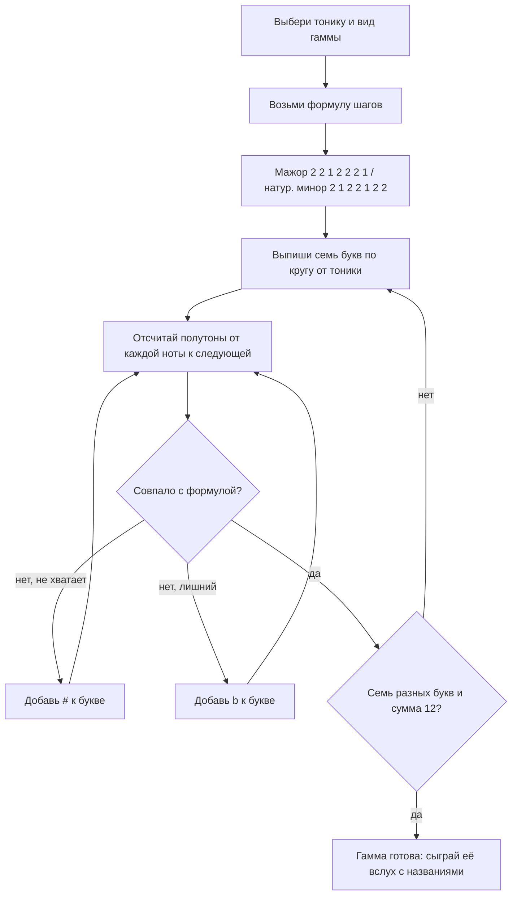

# Гаммы: шаблон шагов по 12 нотам

Вторая часть теории этого модуля — интервалы, тональности и кварто-квинтовый круг:
[`theory-2-intervals-and-keys.md`](./theory-2-intervals-and-keys.md).

## Простыми словами

В музыке есть ровно **12 нот**, и они замкнуты в кольцо: после B снова идёт C, только
октавой выше. Это всё сырьё, весь алфавит.

Играть все 12 подряд — можно, но получится не мелодия, а хроматический пробег. Поэтому
из 12 нот всегда выбирают подмножество из 7 (реже 5), и выбирают не случайно, а **по
шаблону шагов**. Такое подмножество называется **гамма** (scale).

Аналогия для программиста: 12 нот — это массив из 12 элементов, а гамма — это маска.
Мажорная маска, наложенная на кольцо из 12 нот, выглядит так (`x` — нота входит в гамму):

```text
полутон: 0  1  2  3  4  5  6  7  8  9 10 11  (12)
мажор:   x  .  x  .  x  x  .  x  .  x  .  x    x
от C:    C  .  D  .  E  F  .  G  .  A  .  B    C
```

Сдвиньте эту маску по кольцу на 7 позиций — получите гамму G-мажор. Форма шаблона та
же, ноты другие. Вот и всё устройство тональностей: **одна маска, 12 сдвигов**.

Второе понятие, из которого дальше вырастают аккорды, — **интервал**: расстояние между
двумя нотами, измеренное в полутонах. Гамма — это набор нот, интервал — расстояние
между двумя из них. Аккорд (модуль 04) — это уже стопка интервалов.

Обратите внимание на приятное свойство этой картины: в ней нет ни одного правила «так
принято». Всё выводится из двух фактов — нот двенадцать, и они образуют кольцо. Остальное
арифметика по модулю 12: прибавили 7 полутонов — получили квинту, прибавили 12 — вернулись
в ту же ноту октавой выше, прибавили 2 2 1 2 2 2 1 — обошли мажорную гамму. Если по ходу
чтения где-то возникнет ощущение «это надо просто запомнить», почти наверняка вы
пропустили шаг арифметики: вернитесь и пересчитайте полутоны руками.

## Зачем это нужно

Без гамм вы играете по картинкам: выучили форму аккорда, выучили «квадратик» на грифе,
но не знаете, что там внутри, и не можете ничего перенести. С гаммами появляются четыре
вещи сразу:

1. **Свои и чужие ноты.** Песня в тональности A-минор — значит, в мелодии почти
   наверняка живут A B C D E F G, а C# прозвучит как чужак. Это половина умения
   подбирать по слуху.
2. **Аккорды.** Все аккорды тональности берутся из её гаммы, через одну ступень. Без
   гаммы модуль 04 будет заучиванием таблиц.
3. **Транспозиция.** «Спой на два полутона ниже» — это сдвиг маски, а не переучивание
   песни заново.
4. **Импровизация и сочинение.** Пентатоника поверх блюза — это буквально «играй только
   ноты из маски, и почти всё будет звучать».

Пятая причина не такая очевидная, но для нашего случая едва ли не главная: гаммы
**сокращают объём запоминания**. Гитарист, знающий формулу, держит в голове один рисунок
и точку старта. Гитарист, не знающий формулы, держит в голове двенадцать наборов картинок
и всё равно путается. То же с клавишами: «в этой тональности такие-то чёрные клавиши» —
это вывод из формулы, а не отдельный факт для заучивания.

И честное предупреждение: первые дни это будет ощущаться как арифметика, а не как музыка.
Так и есть. Считать полутоны на пальцах — нормально, и через две недели счёт уходит в
фон, как таблица умножения. Ускорить этот этап нельзя, но можно сделать его коротким:
считать каждый день по десять минут, а не раз в неделю по часу.

И одно практическое замечание про мотивацию: гамма — не гимнастика ради гимнастики.
Гоняние гамм «на скорость» без понимания названий нот — самое популярное бесполезное
упражнение на свете. Мы будем делать наоборот: медленно, вслух называя ноты.

Есть и приятный побочный эффект. Как только становится понятно, что тональность — это
сдвиг одной и той же маски, объём материала в курсе резко сжимается. Вместо «двадцати
четырёх тональностей, которые надо выучить» остаётся одна формула и умение считать до
двенадцати. Дальше почти вся теория музыки — это варианты этой мысли.

### Откуда взялись именно 12 нот

Короткий ответ, чтобы не оставалось ощущения магии. Октава — это удвоение частоты
(`440 × 2 = 880`, модуль [`01-sound-and-rhythm`](../01-sound-and-rhythm/theory.md)), и её
делят на 12 равных по отношению шагов. Каждый шаг умножает частоту примерно на
`2^(1/12) ≈ 1.0595`. Двенадцать таких умножений дают ровно 2, то есть октаву. Такой строй
называется **равномерно темперированным** (equal temperament), и он победил потому, что
позволяет играть в любой тональности на одном и том же инструменте без перестройки.
Число 12 выбрано не случайно: при делении на 12 шагов очень близко попадают в цель самые
важные для слуха простые отношения частот — 3/2 (квинта) и 4/3 (кварта). Подробности —
уже акустика, и для наших целей достаточно помнить: 12 равных шагов, и кварта с квинтой
почти идеальны.

## Как устроено

### Тон и полутон

**Полутон** (semitone, half step) — минимальный шаг: соседняя нота в кольце из 12.
**Тон** (tone, whole step) — два полутона.

- На гитаре: **один лад = один полутон**. Два лада = тон.
- На клавишах: **соседняя клавиша = полутон**, но считать надо и чёрные. C → C# —
  полутон, C → D — тон. А вот E → F — полутон, хотя обе клавиши белые и стоят рядом:
  между ними просто нет чёрной. То же с B → C.

Это ключевая асимметрия из модуля 02: семь букв **не** расположены равномерно. Между
E–F и B–C — полутон, между остальными парами соседних букв — тон.

### Мажорная гамма: T T S T T T S

Мажорная гамма (major scale) — семь нот, построенных от тоники по формуле шагов:

```text
       T   T   S   T   T   T   S        T = тон (2 полутона), S = полутон (1)
       2 + 2 + 1 + 2 + 2 + 2 + 1  =  12    ← сумма всегда даёт октаву
```

Проверка суммы — бесплатный тест на ошибку: если ваши шаги не дали ровно 12, вы где-то
сбились.

Строим от C, отсчитывая полутоны:

```text
C --2--> D --2--> E --1--> F --2--> G --2--> A --2--> B --1--> C
```

Получилось `C D E F G A B` — ни одного диеза и бемоля. Именно поэтому C-мажор считают
«нулевой» тональностью: на клавишах это все белые клавиши подряд.

Строим от G:

```text
G --2--> A --2--> B --1--> C --2--> D --2--> E --2--> F# --1--> G
```

`G A B C D E F# G`. Один диез. Обратите внимание: седьмая нота обязана быть **F#**, а не
Gb — потому что в гамме ровно семь нот и **каждая буква встречается ровно один раз**.
Написать `Gb` рядом с `G` нельзя, буква G была бы занята дважды, а буквы F не было бы
вообще. Это железное правило записи гамм, и оно объясняет, откуда в тональностях берутся
на вид странные ноты вроде Cb или F##.

Строим от F:

```text
F --2--> G --2--> A --1--> Bb --2--> C --2--> D --2--> E --1--> F
```

`F G A Bb C D E F`. Здесь по тому же правилу нужен именно **Bb**, а не A#.

Алгоритм на будущее, коротко:

```text
1. Выпиши семь букв по кругу, начиная с тоники: G A B C D E F
2. Иди по шагам 2 2 1 2 2 2 1 и считай полутоны от предыдущей ноты
3. Не хватает полутона — добавь # к текущей букве; лишний — добавь b
4. Проверь: семь разных букв, сумма шагов = 12
```

Прогоните алгоритм три раза — и он станет автоматическим. Вот результаты для тональностей,
которые встретятся раньше всего:

| Тоника | Гамма | Знаки |
|---|---|---|
| C | C D E F G A B | нет |
| G | G A B C D E F# | F# |
| D | D E F# G A B C# | F# C# |
| A | A B C# D E F# G# | F# C# G# |
| E | E F# G# A B C# D# | F# C# G# D# |
| F | F G A Bb C D E | Bb |
| Bb | Bb C D Eb F G A | Bb Eb |
| Eb | Eb F G Ab Bb C D | Bb Eb Ab |

Закономерность видна сразу и разбирается во второй части теории: знаки добавляются не
вразнобой, а строго в одном порядке. Пока достаточно заметить, что D-мажор — это G-мажор
плюс один диез, A-мажор — плюс ещё один, и так далее.

### Ступени и их имена

Ноты гаммы нумеруют римскими цифрами (или просто 1–7) и называют по функции. Это те же
названия, что потом появятся у аккордов в модуле 04:

| Ступень | Имя | В C-мажоре | Смысл в двух словах |
|---|---|---|---|
| I | тоника (tonic) | C | дом, точка покоя |
| II | супертоника (supertonic) | D | «над тоникой» |
| III | медианта (mediant) | E | середина между I и V; задаёт мажор/минор |
| IV | субдоминанта (subdominant) | F | уход от дома |
| V | доминанта (dominant) | G | самое сильное тяготение к тонике |
| VI | субмедианта (submediant) | A | тоника параллельного минора |
| VII | вводный тон (leading tone) | B | полутон под тоникой, тянет вверх в неё |

Полезная привычка: думать **ступенями, а не буквами**. «Мелодия идёт 1–2–3–1» переносится
в любую тональность, а «C–D–E–C» работает только в C. Этим же приёмом живёт тренировка
слуха в модуле [`05-ear-training-and-practice`](../05-ear-training-and-practice/index.md).

### Натуральный минор

Натуральный минор (natural minor) — тот же принцип, другая маска:

```text
       T   S   T   T   S   T   T
       2 + 1 + 2 + 2 + 1 + 2 + 2  =  12
```

От A: `A B C D E F G A` — снова ни одного знака. И это не совпадение.

**A-минор и C-мажор состоят из одних и тех же нот.** Разница только в том, какая нота
работает домом: если мелодия успокаивается на C — это мажор, если на A — минор. Такие
пары называются:

- по-русски **параллельные тональности** (C-мажор ↔ A-минор): одни знаки, разные тоники;
- по-английски это **relative major / relative minor**.

Осторожно, ловушка терминов: английское **parallel** значит совсем другое — тональности
с **одной тоникой** (C-мажор ↔ C-минор), по-русски их называют **одноимёнными**. Читая
англоязычный учебник, держите это в голове.

Как быстро найти пару:

```text
параллельный минор = VI ступень мажора      (C-мажор → A-минор)
параллельный мажор = III ступень минора     (A-минор → C-мажор)
на слух и на грифе: минор на 3 полутона ниже своего мажора
```

Второй способ отличить минор от мажора — посмотреть на третью ступень. От тоники до III
в мажоре 4 полутона (большая терция), в миноре 3 (малая терция). **Терция решает всё**:
она делает звук «светлым» или «тёмным».

Про «весёлый мажор и грустный минор» — эту формулу дают детям, и она мешает взрослым.
Мажор бывает жёстким и злым, минор — танцевальным и радостным; половина мировых хитов в
миноре звучит бодрее половины хитов в мажоре. Надёжная формулировка другая: мажор
**светлее**, минор **темнее**, и разница целиком в трёх полутонах против четырёх на
третьей ступени. Всё остальное делают темп, ритм, тембр и текст.

### Гармонический и мелодический минор

Натуральный минор имеет проблему: его VII ступень стоит на **целый тон** ниже тоники и
не тянет в неё. Композиторам это мешало, и они VII повысили. **Гармонический минор**
(harmonic minor) = натуральный с повышенной VII: шаги `2 1 2 2 1 3 1`, от A получается
`A B C D E F G# A`. Обратите внимание на шаг в 3 полутона между F и G# — из-за него гамма
звучит «по-восточному», это её характерная примета. **Мелодический минор** (melodic
minor) идёт дальше и повышает вверх и VI, и VII (`A B C D E F# G# A`), а вниз в
классической традиции возвращается к натуральному виду. Практический смысл ровно один:
повышенная VII даёт мажорную доминанту (в A-миноре — аккорд E вместо Em), и именно
поэтому в тысячах минорных песен встречается «неожиданный» мажорный аккорд перед
возвращением домой. Подробности — в модуле [`04-chords-and-harmony`](../04-chords-and-harmony/index.md).

### Пентатоника — коротко

**Пентатоника** (pentatonic) — гамма из пяти нот. Минорная пентатоника получается из
натурального минора выбрасыванием II и VI ступеней: `1 b3 4 5 b7`, шаги `3 2 2 3 2`. От
A: `A C D E G`. Мажорная пентатоника — мажор без IV и VII: `1 2 3 5 6`, от C: `C D E G A`.
Ценность в том, что из пентатоники выброшены самые «острые» ноты, поэтому почти любая
последовательность звучит осмысленно — отсюда её роль главной гаммы блюза и рок-соло.
Боксы на грифе и практика — в модуле
[`07-guitar-scales-and-songs`](../07-guitar-scales-and-songs/index.md).

### Хроматическая гамма

**Хроматическая гамма** (chromatic scale) — все 12 нот подряд, шаг всегда 1 полутон. Это
не тональность, а сырьё и техническое упражнение. Договорённость записи: вверх обычно
пишут диезами (`C C# D D# E F F# G G# A A# B`), вниз — бемолями (`C B Bb A Ab G Gb F E
Eb D Db`).

Практическая польза от хроматики две. Первая — разминка: пройти хроматику по одной струне
или по клавишам подряд заставляет пальцы работать ровно, без «любимых» нот. Вторая —
проверка: если вы умеете назвать все 12 нот вверх и вниз без запинки, значит кольцо из 12
у вас в голове действительно есть, а не «примерно есть».

### Один шаблон, семь стартов: лады (короткий тизер)

Если взять маску мажора и начать читать её не с первой ступени, а со второй, третьей и
так далее, получатся семь разных гамм из одних и тех же нот. Они называются **лады**
(modes): от II ступени — дорийский, от VI — эолийский (это и есть натуральный минор), от
V — миксолидийский, и так далее. То есть мажор и натуральный минор — это два из семи
режимов чтения одной и той же маски.

Знать это сейчас нужно ровно для одного: чтобы не удивляться, когда в разборе песни
встретится слово «дорийский». Полноценно лады пригодятся уже при импровизации, и
трогать их до аккордов смысла нет.

### Сколько всего мажорных гамм

Тоник у нас 12 (всё кольцо), значит и мажорных гамм по звучанию ровно 12. Но записать
некоторые из них можно двумя способами: F#-мажор и Gb-мажор звучат одинаково, а на бумаге
это шесть диезов против шести бемолей. Поэтому «тональностей на письме» получается 15, а
не 12 — три энгармонические пары. Играющему это не мешает: на инструменте вы всё равно
нажимаете одни и те же клавиши и лады.

### Сборка: как построить любую гамму



### Проверка себя за минуту

Хорошая гамма — та, которую вы можете предъявить четырьмя способами подряд, не подглядывая:

```text
1. назвать ноты вслух вверх:      D E F# G A B C# D
2. назвать их же вниз:            D C# B A G F# E D
3. назвать шаги в полутонах:      2 2 1 2 2 2 1
4. сыграть на инструменте ровно, называя ступени: 1 2 3 4 5 6 7 8
```

Если сыпется пункт 2 — вы выучили последовательность, а не структуру. Если сыпется
пункт 3 — не отработан счёт полутонов, вернитесь к карте грифа. Если сыпется пункт 4 —
это уже вопрос техники и метронома, а не теории.

## На гитаре

Самый наглядный способ увидеть формулу — сыграть гамму **на одной струне**. Лад = полутон,
поэтому шаги видны как расстояния между ладами. C-мажор на пятой струне (A), где C — на
третьем ладу:

```text
струна 5 (A), C-мажор
лад:   3    5    7    8   10   12   14   15
нота:  C    D    E    F    G    A    B    C
шаг:     2    2    1    2    2    2    1
```

Видно глазами: две пары ладов идут «через один», потом лады 7–8 стоят рядом (это S между
E и F), потом снова три шага по два, и в конце снова соседние лады 14–15 (S между B и C).
Тот же рисунок на любой струне и от любого лада — это и есть транспозиция.

Ту же гамму удобно проверить по карте грифа из модуля
[`02-notes-and-notation`](../02-notes-and-notation/theory.md): найдите на разных струнах
все ноты C и все ноты E и убедитесь, что между ними всегда 4 полутона, где бы вы их ни
взяли.

Минорная пентатоника от E на шестой струне — первое, что играют почти все гитаристы:

```text
струна 6 (E), E-минорная пентатоника
лад:   0    3    5    7   10   12
нота:  E    G    A    B    D    E
шаг:     3    2    2    3    2
```

Аппликатуры в двух-трёх позициях, боксы и растяжки — модуль
[`07-guitar-scales-and-songs`](../07-guitar-scales-and-songs/index.md); здесь важно только
то, что формы на грифе — следствие формулы, а не набор картинок для заучивания.

## На клавишах

C-мажор на клавиатуре — все белые клавиши. Это удобно и одновременно источник главного
заблуждения новичка: белые клавиши кажутся «нейтральными нотами», а чёрные — «особыми».
На самом деле белые клавиши — это и есть гамма C-мажор, просто её сделали удобной для
руки.

```text
C-мажор: отмечены * — все белые
    C#   D#        F#   G#   A#
    Db   Eb        Gb   Ab   Bb
 ___________________________________
|   |#|  |#|       |#|  |#|  |#|   |
|   |#|  |#|       |#|  |#|  |#|   |
|   |_|  |_|       |_|  |_|  |_|   |
|    |    |    |    |    |    |    |
| C* | D* | E* | F* | G* | A* | B* |
|____|____|____|____|____|____|____|
```

Теперь G-мажор. Формула та же, но седьмая ступень — F#, поэтому вместо белой F в гамме
чёрная клавиша:

```text
G-мажор: G A B C D E F#  (F не входит, вместо неё F#)
    C#   D#        F#*  G#   A#
    Db   Eb        Gb   Ab   Bb
 ___________________________________
|   |#|  |#|       |#|  |#|  |#|   |
|   |#|  |#|       |#|  |#|  |#|   |
|   |_|  |_|       |_|  |_|  |_|   |
|    |    |    |    |    |    |    |
| C* | D* | E* | F  | G* | A* | B* |
|____|____|____|____|____|____|____|
```

Проверьте на инструменте (или в piano-roll вашего DAW): сыграйте от G восемь нот только
по белым — на седьмой ноте станет слышно, что что-то «провалилось». Замените F на F# —
и гамма встанет на место. Это самый быстрый способ услышать, зачем вообще нужны знаки.

Ещё одно наблюдение, полезное для ориентации: чем дальше тональность от C, тем больше в
ней чёрных клавиш. В C-мажоре их ноль, в G — одна, в D — две, в F#-мажоре — пять из семи
нот чёрные, и рука там лежит на клавиатуре совсем иначе. Именно поэтому клавишники не
любят некоторые тональности, а гитаристы к этому равнодушны: на грифе все тональности
устроены одинаково, вопрос только в том, на каком ладу начинать.

Полезная привычка на клавишах: строя гамму, вслух проговаривайте не только ноту, но и
номер ступени — «G — раз, A — два, B — три». Через несколько дней ступени начнут
слышаться сами, и это ровно тот навык, на который опирается тренировка слуха.

Аппликатуры, номера пальцев и игра гамм двумя руками — модуль
[`08-keyboard-foundations`](../08-keyboard-foundations/index.md).

## Послушай

Слушать надо не «гаммы», а то, как их характер работает в музыке. Проверенные примеры:

- **Мажорная гамма целиком, по ступеням** — «Do-Re-Mi» из «The Sound of Music» (Роджерс и
  Хаммерстайн): песня буквально построена как обход мажорной гаммы вверх. Идеальный
  тренажёр для ступеней.
- **Мажор, светлый и «прямой»** — «Ode to Joy» (тема из финала Девятой симфонии
  Бетховена): мелодия почти целиком идёт по соседним ступеням мажора.
- **Минор** — «Nothing Else Matters» (Metallica) и «House of the Rising Sun» (The Animals)
  считаются классическими минорными примерами; послушайте, как обе успокаиваются на
  минорной тонике. Аккорды проверьте по табам.
- **Гармонический минор** — традиционная «Hava Nagila»: тот самый шаг в три полутона
  между VI и повышенной VII даёт узнаваемый колорит. Проверь на слух: попробуйте спеть
  гамму вместе с записью.
- **Пентатоника** — «Amazing Grace»: мелодия укладывается в мажорную пентатонику. Плюс
  почти любое блюз-роковое соло — это минорная пентатоника, узнаваемая с первых нот.
- **Хроматика** — «Полёт шмеля» Римского-Корсакова: непрерывное движение полутонами,
  слышно, что это «все 12 нот подряд», а не тональность.

Минимальный ритуал прослушивания: включите фрагмент, найдите на инструменте ноту, на
которой мелодия «садится», и попробуйте от неё сыграть мажор и минор. Один из двух
вариантов совпадёт с записью почти целиком, второй заскрипит на третьей ступени — вот вы
и определили лад на слух, без приложений и без нот. Ошибиться тут не страшно и полезно:
именно момент «вот эта нота не подошла» и есть обучение.

Как слушать, чтобы это работало на слух, а не на общее развитие, — протокол в модуле
[`05-ear-training-and-practice`](../05-ear-training-and-practice/theory.md).

## Типичные ошибки

- **Учить гамму как форму на грифе, не зная имён нот.** Через месяц вы играете «квадратик»
  и не можете сказать, что играете. Лечение: называть ноты вслух, медленно, под метроном.
- **Считать полутоны по буквам.** «От E до F — тон, они же разные буквы» — нет, полутон.
  Между E–F и B–C всегда полутон.
- **Смешивать диезы и бемоли в одной гамме.** В гамме семь **разных** букв, по одному
  знаку на букву. `G A B C D E Gb` — не гамма, это ошибка записи.
- **Думать, что белые клавиши — «без тональности».** Белые клавиши = C-мажор (или
  A-минор). Нейтральных нот не бывает.
- **Путать русское «параллельные» и английское parallel.** Русское «параллельные» =
  английское relative (общие знаки). Английское parallel = русское «одноимённые» (общая
  тоника).
- **Определять лад по первому аккорду песни.** Лад определяет нота, на которой музыка
  успокаивается, а не та, с которой начинается.
- **Гнать гаммы на скорость.** Скорость без ровности — это просто быстрые ошибки.
  Метроном-лесенка из модуля [`05`](../05-ear-training-and-practice/index.md) решает это
  честно.
- **Забывать про октаву.** В гамме семь нот; восьмая — повтор тоники. «Восемь разных нот»
  не бывает.
- **Считать, что мажор = весёлый, минор = грустный.** Разница в одном полутоне на III
  ступени, а настроение делают темп, ритм и тембр.
- **Учить гамму только вверх.** Вниз она должна идти так же уверенно, иначе выучена
  последовательность, а не структура.

## Словарь терминов

- **Полутон (semitone, half step)** — минимальный шаг, один лад / одна соседняя клавиша.
- **Тон (tone, whole step)** — два полутона.
- **Гамма (scale)** — набор нот, отобранный из 12 по шаблону шагов.
- **Тоника (tonic)** — главная нота гаммы, точка покоя; I ступень.
- **Ступень (scale degree)** — номер ноты в гамме, от I до VII.
- **Мажор (major scale)** — гамма с формулой 2 2 1 2 2 2 1.
- **Натуральный минор (natural minor)** — гамма с формулой 2 1 2 2 1 2 2.
- **Гармонический минор (harmonic minor)** — натуральный минор с повышенной VII.
- **Мелодический минор (melodic minor)** — минор с повышенными VI и VII при движении вверх.
- **Параллельные тональности (relative keys)** — мажор и минор с одними знаками
  (C-мажор / A-минор).
- **Одноимённые тональности (parallel keys)** — мажор и минор с одной тоникой
  (C-мажор / C-минор).
- **Терция (third)** — интервал от I до III ступени; большая (4 полутона) даёт мажор,
  малая (3) — минор.
- **Пентатоника (pentatonic)** — гамма из пяти нот.
- **Хроматическая гамма (chromatic scale)** — все 12 нот подряд.

## См. также

- Вторая часть теории модуля: [`theory-2-intervals-and-keys.md`](./theory-2-intervals-and-keys.md).
- Уроки: [`lessons/01-build-major-scale.md`](./lessons/01-build-major-scale.md),
  [`lessons/02-intervals-count-and-hear.md`](./lessons/02-intervals-count-and-hear.md),
  [`lessons/03-minor-keys-circle-of-fifths.md`](./lessons/03-minor-keys-circle-of-fifths.md).
- **musictheory.net** — разделы «Lessons: Scales and Key Signatures» и упражнение «Scale
  Construction»: строит и проверяет гаммы в реальной нотации.
- **teoria.com** — «Scales» с проигрыванием звука.
- **Open Music Theory** (openmusictheory.github.io) — бесплатный открытый учебник, главы
  про гаммы и лады.
- **Michael Pilhofer, Holly Day, «Music Theory For Dummies»** — главы про гаммы и минорные
  разновидности, самый мягкий вход.
- **MuseScore** (musescore.org) — набрать гамму нотами и услышать её; удобно экспортировать
  картинку в `misc/`.
- Предыдущий модуль: [`02-notes-and-notation`](../02-notes-and-notation/index.md).
- Дальше — аккорды: [`04-chords-and-harmony`](../04-chords-and-harmony/index.md).
- Пентатоника на грифе: [`07-guitar-scales-and-songs`](../07-guitar-scales-and-songs/index.md).
