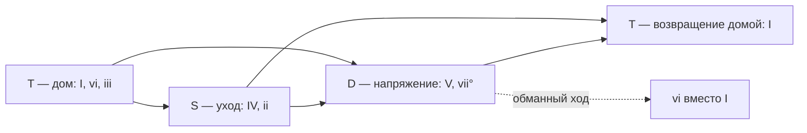
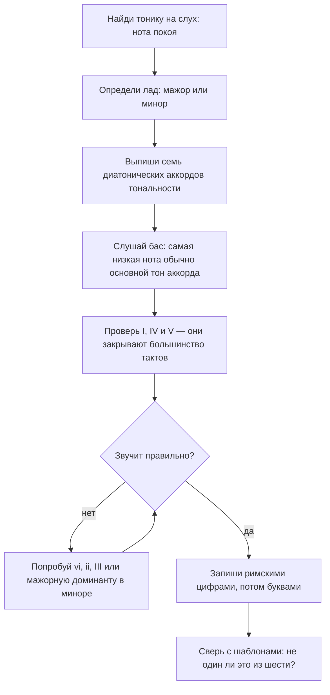

# Аккорды тональности, функции и прогрессии

Первая часть теории модуля — устройство самих аккордов: [`theory.md`](./theory.md).

## Простыми словами

В тональности не «все аккорды мира», а ровно семь основных. Они получаются механически:
берём гамму и строим трезвучие от каждой её ступени, используя **только ноты этой гаммы**.
Такие аккорды называются **диатоническими** (diatonic).

Дальше песня — это ход по этим семи аккордам. Ход называется **прогрессией**
(progression), и записывают его римскими цифрами по номерам ступеней: `I–V–vi–IV`. Такая
запись переносится в любую тональность, потому что описывает не буквы, а роли.

Аналогия: римские цифры — это интерфейс, буквы аккордов — конкретная реализация. `I–V–vi–IV`
в C-мажоре собирается как `C–G–Am–F`, в D-мажоре как `D–A–Bm–G`. Прогрессия та же.

И третья идея, из которой всё держится вместе: у аккордов есть **функции** — «дом»,
«уход из дома» и «сильное тяготение назад». Почти вся популярная музыка — это движение по
кругу «дом → уход → напряжение → дом».

## Зачем это нужно

1. **Разбирать песни.** Услышали четыре аккорда, узнали шаблон — можете сыграть куплет,
   не заглядывая в табы.
2. **Играть на слух в любой тональности.** Шаблон в римских цифрах транспонируется за
   секунды.
3. **Понимать, куда песня идёт.** Функции дают предсказание: после V почти наверняка
   будет I. Ухо, которое умеет предсказывать, слышит гораздо больше.
4. **Подбирать аккорды к мелодии** — по протоколу, а не наугад.
5. **Сочинять.** Своя прогрессия — стартовая точка своей песни (модуль
   [`10-songwriting-basics`](../10-songwriting-basics/index.md)).

Отдельно стоит сказать, зачем нужны именно римские цифры, а не привычные буквы. Буквы
описывают, что нажать; цифры описывают, что происходит. Пока вы играете одну песню в одной
тональности, разницы нет. Как только песен становится десять, оказывается, что половина из
них — один и тот же шаблон, просто в разных тональностях, и увидеть это можно только в
цифрах. Это ровно тот же выигрыш, что от выделения общего кода: вместо десяти
последовательностей вы держите в голове один шаблон и таблицу подстановки.

## Как устроено

### Семь аккордов мажорной тональности

Строим трезвучие от каждой ступени C-мажора, беря только белые клавиши:

| Ступень | Ноты | Аккорд | Вид | Цифра |
|---|---|---|---|---|
| I | C E G | `C` | мажорное | I |
| II | D F A | `Dm` | минорное | ii |
| III | E G B | `Em` | минорное | iii |
| IV | F A C | `F` | мажорное | IV |
| V | G B D | `G` | мажорное | V |
| VI | A C E | `Am` | минорное | vi |
| VII | B D F | `Bdim` | уменьшённое | vii° |

Порядок видов запоминается как считалка и работает **в любом мажоре**:

```text
маж  мин  мин  маж  маж  мин  умень
 I   ii   iii  IV   V    vi   vii°
```

Соглашение записи: **заглавные** цифры — мажорные аккорды, **строчные** — минорные,
кружок — уменьшённый. Поэтому `I ii iii IV V vi vii°` читается однозначно.

Проверьте в G-мажоре (`G A B C D E F#`): `G Am Bm C D Em F#dim`. Тот же порядок видов,
другие буквы. Это и есть главный трюк модуля: одна считалка на все двенадцать
тональностей.

Если строить не трезвучия, а септаккорды, получится столь же жёсткая картина:

```text
Cmaj7   Dm7   Em7   Fmaj7   G7   Am7   Bm7b5
 I     ii    iii    IV      V    vi    vii
```

Обратите внимание: **доминантсептаккорд `G7` в тональности ровно один** — на V ступени.
Поэтому если вы услышали в песне аккорд типа «мажор с напряжённой септимой», вы почти
наверняка нашли V ступень, а значит и тональность.

### Аккорды минорной тональности

В натуральном миноре считалка своя. От A-минора (`A B C D E F G`):

| Ступень | Аккорд | Вид | Цифра |
|---|---|---|---|
| i | `Am` | минорное | i |
| ii | `Bdim` | уменьшённое | ii° |
| III | `C` | мажорное | III |
| iv | `Dm` | минорное | iv |
| v | `Em` | минорное | v |
| VI | `F` | мажорное | VI |
| VII | `G` | мажорное | VII |

Заметьте: аккорды те же, что в C-мажоре, — ведь и ноты те же. Меняются только роли.

Одна важная поправка. В натуральном миноре V ступень минорная (`Em`), и тяготения к
тонике почти нет. Поэтому композиторы берут **гармонический минор** и повышают VII
(модуль [`03-scales-and-intervals`](../03-scales-and-intervals/theory.md)): в A-миноре
появляется G#, а вместе с ним аккорды `E` и `E7` вместо `Em`. Отсюда «неожиданный»
светлый аккорд перед возвращением домой в тысячах минорных песен. Правило для практики:
**в миноре доминанта почти всегда мажорная**, хотя гамма этого не требует.

### Функции: T, S, D

Аккорды делятся на три группы по роли:

```text
T (тоника, tonic)         — дом, покой            I, vi, iii
S (субдоминанта)          — уход, движение        IV, ii
D (доминанта, dominant)   — напряжение, тяга      V, vii°
```

Типовой цикл: `T → S → D → T`. Именно поэтому `C–F–G–C` звучит завершённо, а `C–G–F–C`
слегка «против шерсти» (это не запрещено, просто ощущается иначе).

Почему V так сильно тянет в I? Две причины, обе арифметические. Первая: в `G7` есть нота
B — это VII ступень C-мажора, полутоном ниже тоники, и она физически «просит» шага вверх
в C. Вторая: в `G7` сидит тритон B–F, а тритон неустойчив и требует разрешения. Разрешение
находится ровно в аккорде `C`: B идёт в C, F идёт в E. Всё тяготение в тональной музыке —
это движение полутонами в устойчивые ноты.



### Шесть шаблонов, которые надо знать

**1. I–V–vi–IV** — самый частый шаблон в популярной музыке. В C: `C–G–Am–F`. Считается
основой «Let It Be» (The Beatles) и «Don't Stop Believin'» (Journey). Комик-группа
The Axis of Awesome собрала из него номер «Four Chords», сшив десятки хитов, — реальная
и полезная иллюстрация. Аккорды конкретных песен проверь по табам.

**2. vi–IV–I–V** — тот же круг с другой точки входа, звучит темнее. В C: `Am–F–C–G`.
Классический пример — «Zombie» (The Cranberries), в G это `Em–C–G–D`. Проверь по аккордам.

**3. I–IV–V** — три мажорных аккорда, база рок-н-ролла и почти всей ранней поп-музыки.
В A: `A–D–E`. Примеры: «La Bamba» (Ritchie Valens), «Twist and Shout» (The Isley Brothers,
позже The Beatles), «Wild Thing» (The Troggs).

**4. ii–V–I** — главный оборот джаза. В C: `Dm7–G7–Cmaj7`. Встречается в стандартах
«Autumn Leaves» и «Fly Me to the Moon». Обратите внимание, что это движение по кругу
квинт влево: D → G → C.

**5. I–vi–IV–V** — «пятидесятническая» прогрессия (doo-wop changes). В C: `C–Am–F–G`.
Пример — «Stand By Me» (Ben E. King); также «Blue Moon» и «Earth Angel». Проверь по
аккордам.

**6. 12-тактовый блюз** — не прогрессия, а форма из 12 тактов. Базовый вид в C:

```text
такт:  1    2    3    4  |  5    6    7    8  |  9    10   11   12
цифра: I    I    I    I  |  IV   IV   I    I  |  V    IV   I    V
в C:   C7   C7   C7   C7 |  F7   F7   C7   C7 |  G7   F7   C7   G7
```

Часто во втором такте сразу ставят IV («быстрая смена», quick change), а в 12-м такте V
работает как «поворот» обратно к началу. Все три аккорда обычно доминантсептаккорды — это
и делает блюз блюзом. Примеры: «Johnny B. Goode» (Chuck Berry), «Rock Around the Clock»
(Bill Haley), «Hound Dog».

Бонусом два шаблона, которые вы точно услышите: **i–VII–VI–V** («андалузская каденция»,
в A-миноре `Am–G–F–E`) — например «Hit the Road Jack» (Ray Charles); и цепочка Канона
Пахельбеля `I–V–vi–iii–IV–I–IV–V`, которая переиспользована в огромном количестве песен.

### Где именно меняются аккорды

Шаблон — это половина дела; вторая половина — ритм смены. В популярной музыке аккорд чаще
всего держится **один такт** или **два такта**, и меняется на сильную долю. Отсюда
простой способ разобрать песню: считайте вслух «раз-два-три-четыре» и отмечайте, на каком
счёте звук «переключается».

```text
I–V–vi–IV, по такту на аккорд, 4/4:
| C . . . | G . . . | Am . . . | F . . . |

тот же шаблон по половине такта:
| C . G . | Am . F . |

вариант с задержкой (аккорд IV приходит на «три»):
| C . . . | C . F . | G . . . | G . . . |
```

Счёт и доли — модуль
[`01-sound-and-rhythm`](../01-sound-and-rhythm/theory.md); здесь важно только то, что
прогрессия без ритма смены не воспроизводится. Две песни на одних и тех же четырёх
аккордах звучат совершенно по-разному, если в одной аккорд держится такт, а в другой —
два.

### Каденции

**Каденция** (cadence) — то, чем заканчивается фраза. Четыре вида, которые надо узнавать:

```text
автентическая (perfect / authentic)  V → I     полная точка, «дома»
плагальная (plagal)                  IV → I    мягкое окончание, «аминь» в гимнах
половинная (half cadence)            → V       запятая: фраза встала на напряжении
прерванная (deceptive / interrupted) V → vi    обманка: ждали дом, получили минор
```

Полезнее всего в практике половинная и прерванная. Половинная объясняет, почему куплет
часто «висит» перед припевом. Прерванная — популярный приём: слушатель ждёт `I`, получает
`vi`, и песня едет дальше вместо того, чтобы закончиться.

### Как подобрать аккорды к мелодии

Протокол, который работает без нот и без приложений:



Три практических правила к протоколу. Первое: **аккорд обычно содержит ноту мелодии**,
которая звучит в этот момент долго. Второе: **начинайте с I, IV, V** — статистически они
закрывают большую часть тактов в популярной музыке. Третье: **слушайте бас, а не верх** —
бас чаще всего играет основной тон, и это самый короткий путь к аккорду. Методика
слушания баса — модуль
[`05-ear-training-and-practice`](../05-ear-training-and-practice/index.md).

### За пределами семи аккордов — коротко

Иногда в песне появляется аккорд, которого в тональности быть не должно. Две самые
частые причины, обе — только тизер:

- **Заимствованные аккорды** (borrowed chords): аккорд взят из одноимённой тональности.
  Например `bVII` в мажоре (в C это `Bb`) — характерная рок-краска, или минорная `iv` в
  мажоре (`Fm` в C) — характерная грусть в припеве.
- **Вторичные доминанты** (secondary dominants): доминанта не к тонике, а к другой
  ступени. `V/V` в C — это `D7`, доминанта к `G`. Слышится как «песня на секунду сделала
  вид, что она в G».

Обе темы полноценно разбираются при сочинении — модуль
[`10-songwriting-basics`](../10-songwriting-basics/index.md). Пока достаточно правила:
встретили «чужой» аккорд — не пугайтесь и запишите как есть.

## На гитаре

У гитары есть «удобные» тональности, и это не суеверие: G, C, D, A и E собираются из
открытых аккордов, а Eb или Ab требуют баррэ. Поэтому огромная часть песен написана
именно в них.

Аккорды тональности G-мажор в открытых позициях:

```text
   G            Am           Bm           C            D            Em
e|--3--      e|--0--      e|--2--      e|--0--      e|--2--      e|--0--
B|--0--      B|--1--      B|--3--      B|--1--      B|--3--      B|--0--
G|--0--      G|--2--      G|--4--      G|--0--      G|--2--      G|--0--
D|--0--      D|--2--      D|--4--      D|--2--      D|--0--      D|--2--
A|--2--      A|--0--      A|--2--      A|--3--      A|--x--      A|--2--
E|--3--      E|--x--      E|--x--      E|--x--      E|--x--      E|--0--
```

Из этого набора уже собираются шаблоны: `G–D–Em–C` — это I–V–vi–IV в G; `Em–C–G–D` —
vi–IV–I–V. Обратите внимание, что `Bm` требует баррэ-подобного хвата — поэтому его часто
заменяют или обходят, и это нормальная практика, а не халтура.

И главный практический инструмент гитариста: **каподастр**. Прогрессию, выученную в C,
можно сыграть в D, зажав второй лад и не меняя формы. Это транспозиция из модуля
[`03-scales-and-intervals`](../03-scales-and-intervals/theory-2-intervals-and-keys.md),
только сделанная железкой. Постановка аккордов, бой и смена — модули
[`06-guitar-foundations`](../06-guitar-foundations/index.md) и
[`07-guitar-scales-and-songs`](../07-guitar-scales-and-songs/index.md).

## На клавишах

На клавишах у всех тональностей равные права, зато остро встаёт вопрос плавности. Сыграйте
`C–G–Am–F` в основном виде — рука будет прыгать по всей клавиатуре. Теперь то же самое с
обращениями:

```text
C      C E G        (основной вид)
G      B D G        второе обращение: B и D рядом с E и G
Am     A C E        основной вид, но A рядом с G
F      A C F        второе обращение: A и C остались на месте
```

Двигаются один-два пальца за смену, и аккомпанемент начинает звучать связно. Это и есть
голосоведение: между двумя аккордами ищем общие ноты и оставляем их на месте.

Второй приём, который сразу даёт «полный» звук: аккорд в правой руке, основной тон
(иногда основной тон и квинта) в левой. Так у вас появляется бас — тот самый, по которому
слушатель и опознаёт аккорд. Аккомпанемент левой рукой, арпеджио и педаль — модуль
[`09-keyboard-chords-and-songs`](../09-keyboard-chords-and-songs/index.md).

## Послушай

Слушайте не аккорды по отдельности, а **ход** и место возвращения домой.

- **I–V–vi–IV** — «Let It Be» (The Beatles), «Don't Stop Believin'» (Journey) и номер
  «Four Chords» группы The Axis of Awesome, где шаблон показан на десятках песен.
- **vi–IV–I–V** — «Zombie» (The Cranberries): тот же круг, но начинается с минора, и
  из-за этого песня звучит тяжелее.
- **I–IV–V** — «La Bamba» (Ritchie Valens), «Twist and Shout», «Wild Thing» (The Troggs):
  три аккорда, максимум энергии.
- **I–vi–IV–V** — «Stand By Me» (Ben E. King): узнаваемый «мягкий» ход конца пятидесятых.
- **ii–V–I** — «Autumn Leaves», «Fly Me to the Moon»: послушайте, как `G7` каждый раз
  «падает» в тонику.
- **12-тактовый блюз** — «Johnny B. Goode» (Chuck Berry): считайте такты вслух до 12 и
  ловите момент, когда приходит IV.
- **Плагальная каденция** — окончание «аминь» в церковных гимнах: IV → I без напряжения.

Аккорды конкретных песен проверяйте по табам и аккордовым сайтам: даже в известных вещах
встречаются разные версии разбора. Тренировка узнавания качества аккордов и баса на
слух — модуль [`05-ear-training-and-practice`](../05-ear-training-and-practice/index.md).

## Типичные ошибки

- **Заучивать буквы вместо цифр.** `C–G–Am–F` в другой тональности придётся выводить
  заново; `I–V–vi–IV` переносится сразу.
- **Забывать про заглавные и строчные цифры.** `V` и `v` — разные аккорды, и в миноре это
  особенно важно.
- **Ставить минорную доминанту в миноре.** Обычно там мажорная (`E` в A-миноре) — это
  гармонический минор в действии.
- **Определять тональность по первому аккорду.** Смотрите, куда песня возвращается.
  «Zombie» начинается с `Em`, но это vi в G.
- **Играть все аккорды в основном виде.** Получается прыгающая рука и рваное звучание.
- **Считать `vii°` частым аккордом.** В популярной музыке он редок; его роль обычно
  берёт на себя V.
- **Считать, что шаблон обязывает.** I–V–vi–IV — статистика, а не закон. Отклонения и
  есть то, чем песни отличаются друг от друга.
- **Подбирать аккорды по мелодии сверху.** Слушайте бас: он почти всегда даёт основной тон.
- **Верить одному источнику аккордов.** Разборы в интернете часто упрощены или просто
  неверны — сверяйте два-три и своё ухо.

## Словарь терминов

- **Диатонические аккорды (diatonic chords)** — аккорды, построенные только из нот
  тональности.
- **Римские цифры (Roman numerals)** — запись аккорда по номеру ступени; заглавная —
  мажор, строчная — минор, `°` — уменьшённый.
- **Прогрессия (chord progression)** — последовательность аккордов.
- **Тоника (T)** — функция покоя: I, vi, iii.
- **Субдоминанта (S)** — функция ухода: IV, ii.
- **Доминанта (D)** — функция напряжения: V, vii°.
- **Тяготение (resolution)** — движение неустойчивой ноты в устойчивую, обычно полутоном.
- **Каденция (cadence)** — гармоническое окончание фразы.
- **Автентическая каденция** — V → I.
- **Плагальная каденция** — IV → I.
- **Половинная каденция** — окончание фразы на V.
- **Прерванная каденция** — V → vi вместо ожидаемого I.
- **12-тактовый блюз (12-bar blues)** — форма из 12 тактов на I, IV и V.
- **Заимствованный аккорд (borrowed chord)** — аккорд из одноимённой тональности.
- **Вторичная доминанта (secondary dominant)** — доминанта не к тонике, а к другой
  ступени, например `V/V`.
- **Каподастр (capo)** — зажим на грифе, транспонирующий гитару физически.

## См. также

- Первая часть теории модуля: [`theory.md`](./theory.md).
- Уроки: [`lessons/02-diatonic-chords-roman-numerals.md`](./lessons/02-diatonic-chords-roman-numerals.md),
  [`lessons/03-progressions-in-real-songs.md`](./lessons/03-progressions-in-real-songs.md).
- **Hooktheory** (hooktheory.com) — база прогрессий реальных песен и книги «Hooktheory
  I / II»: лучший источник, чтобы увидеть статистику шаблонов.
- **musictheory.net** — «Lessons: Chord Progressions», упражнения на построение аккордов.
- **teoria.com** — «Harmonic Functions» и слуховые упражнения на прогрессии.
- **Open Music Theory** (openmusictheory.github.io) — диатоническая гармония и каденции.
- **Kostka & Payne, «Tonal Harmony»** — строгое изложение функций, каденций и вторичных
  доминант.
- **Michael Pilhofer, Holly Day, «Music Theory For Dummies»** — прогрессии простым языком.
- **Rick Beato**, **Adam Neely**, **David Bennett Piano**, **12tone** — разборы гармонии
  реальных песен на YouTube.
- **JustinGuitar** (justinguitar.com) — бесплатный курс, где эти же шаблоны сразу
  играются на гитаре.
- Дальше — слух и методика:
  [`05-ear-training-and-practice`](../05-ear-training-and-practice/index.md).
- Своя прогрессия и сочинение:
  [`10-songwriting-basics`](../10-songwriting-basics/index.md).
